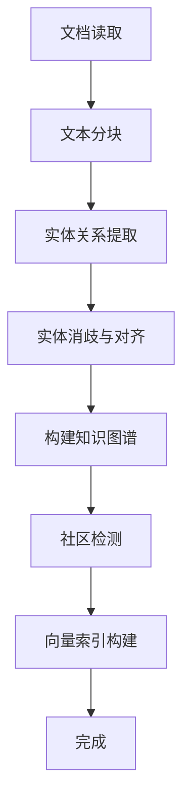

# 第一次构建知识图谱

> **目标读者**：项目新手
> **阅读时间**：20 分钟
> **前置知识**：已完成[安装指南](./安装指南.md)
> **难度等级**：⭐

## 📋 本文大纲

- [1. 数据准备](#1-数据准备)
- [2. 配置实体关系](#2-配置实体关系)
- [3. 运行知识图谱构建](#3-运行知识图谱构建)
- [4. 监控构建过程](#4-监控构建过程)
- [5. 验证构建结果](#5-验证构建结果)
- [6. 常见问题](#6-常见问题)

---

## 1. 数据准备

### 1.1 支持的文件格式

项目支持以下格式的文档：

| 格式 | 扩展名 | 说明 |
|------|--------|------|
| 纯文本 | `.txt` | UTF-8 编码 |
| Markdown | `.md` | Markdown 格式 |
| PDF | `.pdf` | PDF 文档 |
| Word (新) | `.docx` | Office 2007+ |
| Word (旧) | `.doc` | Office 2003 及更早（需额外依赖） |
| CSV | `.csv` | 表格数据 |
| JSON | `.json` | 结构化文本 |
| YAML | `.yaml`, `.yml` | 配置文件 |

### 1.2 准备示例数据

将您的数据文件放入 `files/` 目录：

```bash
cd graph-rag-agent

# 创建 files 目录（如果不存在）
mkdir -p files

# 示例：复制您的文档
cp /path/to/your/documents/*.pdf files/
cp /path/to/your/documents/*.txt files/
```

**支持子目录**：
```bash
files/
├── 学生管理规定/
│   ├── 奖学金管理办法.pdf
│   └── 处分管理规定.pdf
├── 教务文件/
│   ├── 学分管理.docx
│   └── 课程安排.txt
└── FAQ.md
```

### 1.3 数据准备建议

**文件数量**：
- 首次测试：3-5 个小文件（总计 < 50 页）
- 正式使用：根据需求，无上限

**文件内容**：
- 确保文本清晰、格式规范
- PDF 文件尽量使用文本型（非扫描件）
- 中文文档使用 UTF-8 编码

**示例场景**：
- **学校管理**：学生手册、管理规定、FAQ
- **企业知识库**：产品手册、流程文档、Q&A
- **技术文档**：API 文档、技术规范、最佳实践

---

## 2. 配置实体关系

知识图谱的**实体类型**和**关系类型**需要根据您的领域定制。

### 2.1 编辑配置文件

编辑 `.env`（如果不存在，从 `.env.example` 复制），配置领域/知识库语义参数（对应 `backend/config/rag.py`）：

```bash
KB_NAME='华东理工大学'
GRAPH_THEME='华东理工大学学生管理'
GRAPH_ENTITY_TYPES='学生类型,奖学金类型,处分类型,部门,学生职责,管理规定'
GRAPH_RELATIONSHIP_TYPES='申请,评定,撤销,负责,担任,管理,权利义务,互斥'
```

### 2.2 领域适配示例

#### 示例 1：电商领域

```bash
KB_NAME='电商产品知识库'
GRAPH_THEME='电商产品知识库'
GRAPH_ENTITY_TYPES='产品,品牌,类别,用户,订单状态'
GRAPH_RELATIONSHIP_TYPES='属于,分类为,购买,评价,推荐'
```

#### 示例 2：医疗领域

```bash
KB_NAME='中文医疗知识库'
GRAPH_THEME='医疗知识图谱'
GRAPH_ENTITY_TYPES='疾病,症状,药物,检查项目,科室'
GRAPH_RELATIONSHIP_TYPES='表现为,治疗,诊断,隶属,禁忌'
```

### 2.3 其他配置项

```bash
# 冲突解决策略：manual_first / auto_first / merge
GRAPH_CONFLICT_STRATEGY='manual_first'

# 社区检测算法：leiden / sllpa
GRAPH_COMMUNITY_ALGORITHM='leiden'

# 前端示例问题（可选，逗号分隔）
FRONTEND_EXAMPLES='旷课多少学时会被退学？,国家奖学金和国家励志奖学金互斥吗？,优秀学生要怎么申请？,上海市奖学金的评定条件是什么？'
```

---

## 3. 运行知识图谱构建

### 3.1 全量构建（首次使用）

```bash
# 确保在项目根目录
cd graph-rag-agent

# 激活 Python 环境
conda activate graphrag

# 运行全量构建
bash scripts/py.sh infrastructure.integrations.build.main
```

### 3.2 构建流程说明

全量构建包含以下步骤：



| 步骤 | 说明 | 预计时间 |
|------|------|----------|
| 1. 文档读取 | 读取 `files/` 目录下的所有文档 | 1-2 分钟 |
| 2. 文本分块 | 将文档切分为文本块（Chunk） | 1-3 分钟 |
| 3. 实体关系提取 | LLM 提取实体和关系 | **5-30 分钟**（主要耗时） |
| 4. 实体消歧与对齐 | 解决实体歧义和重复 | 2-5 分钟 |
| 5. 构建知识图谱 | 写入 Neo4j 数据库 | 1-3 分钟 |
| 6. 社区检测 | 识别知识社区 | 2-5 分钟 |
| 7. 向量索引构建 | 构建实体和文本块向量索引 | 2-5 分钟 |

**总耗时**：10-50 分钟（取决于文档数量和 LLM 速度）

### 3.3 快速构建模式（仅测试）

如果只想快速测试（减少耗时），推荐先跳过 Phase 3（索引/社区/Chunk 索引），只跑 Phase 2（图谱构建）：

在 `.env` 中设置：
```env
BUILD_RUN_GRAPH = true
BUILD_RUN_INDEX_AND_COMMUNITY = false
BUILD_RUN_CHUNK_INDEX = false
```

然后运行：
```bash
bash scripts/py.sh infrastructure.integrations.build.main
```

**注意**：当前代码版本的 document 模式在 Phase 2 中仍会执行实体抽取；若仅想验证“分块与写入 Chunk 结构”，需要准备少量小文档进行烟囱测试，或等待后续引入“仅分块”的独立开关。

---

## 4. 监控构建过程

### 4.1 查看日志输出

构建过程中会实时输出日志：

```
[INFO] 开始读取文档...
[INFO] 发现 15 个文档文件
[INFO] 文档分块中...
[INFO] 共生成 328 个文本块
[INFO] 开始实体关系提取...（这一步耗时较长，请耐心等待）
[INFO] 提取进度: 50/328 (15%)
[INFO] 提取进度: 100/328 (30%)
...
[INFO] 实体消歧中...
[INFO] 实体对齐中...
[INFO] 写入 Neo4j...
[INFO] 社区检测中...
[INFO] 构建向量索引...
[INFO] ✅ 构建完成！
```

### 4.2 中断与恢复

如果构建中断：
- 已处理的数据会保存在数据库中
- 重新运行 `main.py` 会从头开始（覆盖）
- 建议使用增量更新模式（见下节）

### 4.3 性能优化建议

如果构建速度较慢，可以调整 `.env` 中的并发参数：

```env
# 增加线程数（不超过 CPU 核心数的 2 倍）
MAX_WORKERS = 8

# 增加批处理大小
BATCH_SIZE = 200
ENTITY_BATCH_SIZE = 100
```

---

## 5. 验证构建结果

### 5.1 在 Neo4j Browser 中查看

访问：http://localhost:7474

**查询所有节点**：
```cypher
MATCH (n) RETURN n LIMIT 100
```

**查询实体统计**：
```cypher
MATCH (n)
RETURN labels(n)[0] AS type, count(n) AS count
ORDER BY count DESC
```

预期输出：
```
type           | count
---------------|------
学生类型       | 15
奖学金类型     | 12
管理规定       | 28
...
```

**查询关系统计**：
```cypher
MATCH ()-[r]->()
RETURN type(r) AS relationship, count(r) AS count
ORDER BY count DESC
```

### 5.2 检查向量索引

```cypher
SHOW INDEXES
```

预期应该有：
- `vector` - 实体向量索引
- `chunk_vector` - 文本块向量索引

### 5.3 检查社区检测

```cypher
MATCH (n)
WHERE n.community IS NOT NULL
RETURN n.community AS community, count(n) AS size
ORDER BY size DESC
LIMIT 10
```

---

## 6. 常见问题

### Q1: 构建过程中报错 "LLM 调用失败"

**原因**：API Key 配置错误或网络问题

**解决方法**：
1. 检查 `.env` 中的 `OPENAI_API_KEY` 和 `OPENAI_BASE_URL`
2. 测试 API 连接：
   ```bash
	   bash scripts/python.sh -c "from infrastructure.providers.models import get_llm_model; model = get_llm_model(); print(model.invoke('测试'))"
	   ```

### Q2: "实体索引未找到" 错误

**原因**：尝试单独运行 chunk 索引构建，但实体索引未完成

**解决方法**：
- 运行完整流程：`bash scripts/py.sh infrastructure.integrations.build.main`
- 或先完成实体索引，再运行 chunk 索引

### Q3: 构建速度非常慢

**原因**：LLM 调用耗时、并发度不足

**优化方法**：
1. 使用更快的模型（如 DeepSeek）
2. 增加 `.env` 中的 `MAX_WORKERS`
3. 减少文档数量（先测试小数据集）

### Q4: 内存不足 (Out of Memory)

**原因**：文档过多或过大

**解决方法**：
1. 减少 `.env` 中的 `GDS_MEMORY_LIMIT`
2. 分批导入文档
3. 增加服务器内存

### Q5: 社区检测未发现社区

**解决方法**：
在 `.env` 中切换算法：

```bash
GRAPH_COMMUNITY_ALGORITHM='leiden'  # 从 sllpa 切换到 leiden
```

---

## ✅ 构建完成！

恭喜！您已成功构建第一个知识图谱。

**下一步**：
- [第一次对话](./第一次对话.md) - 启动服务并体验问答功能

---

## 🔗 相关文档

- [知识图谱构建](../02-核心机制/02-核心子系统/知识图谱构建.md) - 深入了解构建原理
- [增量更新机制](../02-核心机制/03-关键特性/增量更新机制.md) - 如何进行增量更新
- [实体消歧和对齐](../02-核心机制/03-关键特性/实体消歧和对齐.md) - 理解实体质量提升机制
- [领域适配指南](../06-应用案例/领域适配指南.md) - 更多领域适配案例

---

## 📝 更新日志

- 2026-01-04: 初始版本

**返回**: [快速开始首页](./README.md) | [文档首页](../README.md)
