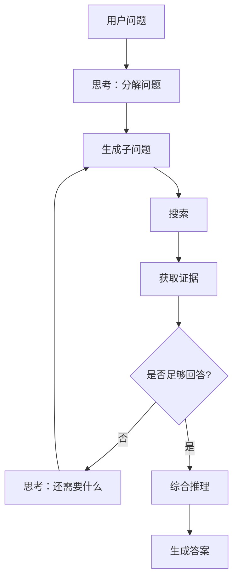
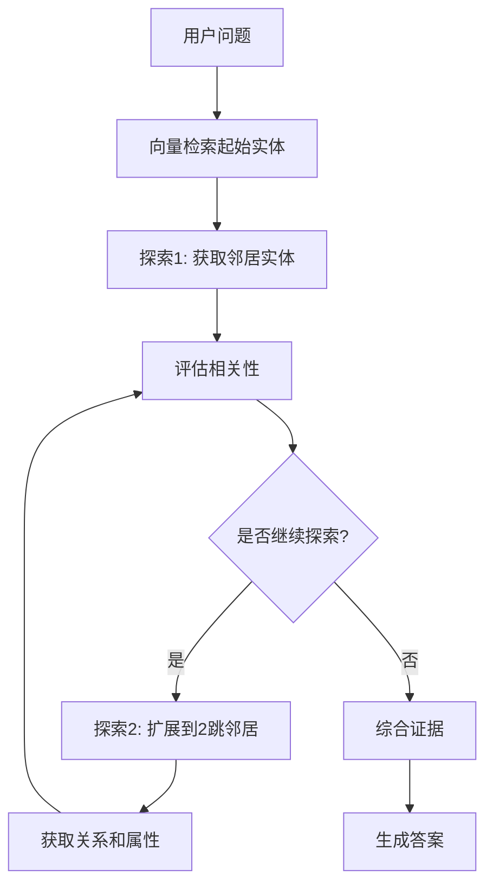

# DeepSearch 原理

> **目标读者**：架构师、研究者
> **阅读时间**：40 分钟
> **前置知识**：了解 RAG、搜索引擎基础
> **难度等级**：⭐⭐⭐

## 📋 本文大纲

- [1. 什么是 DeepSearch](#1-什么是-deepsearch)
- [2. 传统搜索的局限](#2-传统搜索的局限)
- [3. DeepSearch 的核心思想](#3-deepsearch-的核心思想)
- [4. 多步推理机制](#4-多步推理机制)
- [5. 证据链追踪](#5-证据链追踪)
- [6. DeepSearch 的优势](#6-deepsearch-的优势)
- [7. 与本项目的关系](#7-与本项目的关系)

---

## 1. 什么是 DeepSearch

### 1.1 定义

**DeepSearch**（深度搜索）是一种**多步迭代式搜索框架**，通过"思考-搜索-推理"的循环过程，逐步深入探索知识空间，直到找到满意的答案。

### 1.2 核心理念

传统搜索：
```
用户问题 → 一次检索 → 返回结果 → 生成答案
```

DeepSearch：
```
用户问题 → 思考（分解问题） → 搜索 → 分析结果 →
    判断是否满意？
    ├─ 是 → 生成答案
    └─ 否 → 生成新问题 → 再次搜索 → ... (循环)
```

### 1.3 来源与发展

**灵感来源**：
- Chain-of-Thought（思维链）推理
- ReAct（Reasoning + Acting）框架
- 深度优先搜索（DFS）算法

**代表项目**：
- [Deep-Searcher](https://github.com/zilliztech/deep-searcher) - Zilliz 团队开源
- Perplexity AI - 商业化应用
- 本项目的 DeepResearchAgent

---

## 2. 传统搜索的局限

### 2.1 一次性检索的问题

**示例问题**：
```
"如何从普通学生成为优秀毕业生？"
```

**传统搜索**：
```
检索：[优秀毕业生的条件]
回答：需要德育分数80分以上，获得两年先进个人...
```

**问题**：
- 缺少**过程**：如何提升德育分数？如何获得先进个人？
- 缺少**路径**：从现状到目标的具体步骤
- 缺少**深度**：每个条件的详细要求和注意事项

### 2.2 无法处理探索性问题

**示例问题**：
```
"学校奖学金体系有哪些值得改进的地方？"
```

**传统搜索**：
- 只能找到"奖学金管理办法"的文档
- 无法进行批判性分析
- 无法从多个角度探索问题

### 2.3 缺乏推理链

**示例问题**：
```
"张三能申请国家奖学金吗？（已知：张三获得过励志奖学金）"
```

**传统搜索**：
- 找到"国家奖学金申请条件"
- 找到"励志奖学金相关信息"
- 但无法推理："两者互斥 → 张三不能申请"

---

## 3. DeepSearch 的核心思想

### 3.1 思考-搜索-推理循环



**关键特点**：
- **迭代式**：多轮搜索，逐步深入
- **自适应**：根据搜索结果调整策略
- **可解释**：记录每一步的思考和证据

### 3.2 问题分解

**原始问题**：
```
"如何从普通学生成为优秀毕业生？"
```

**分解为子问题**（LLM 自动生成）：
```
1. 优秀毕业生的定义和标准是什么？
2. 德育考核如何计分？如何提升德育分数？
3. 先进个人有哪些类别？如何获得？
4. 除了成绩和德育，还有其他要求吗？
5. 完整的时间规划应该是什么样的？
```

**逐个搜索并整合**。

### 3.3 多路径探索

**示例**：

```
问题："奖学金评定的完整流程是什么？"

探索路径1：申请流程
  ├─ 学生递交申请
  ├─ 学院初评
  └─ 学校评审

探索路径2：评定标准
  ├─ 学习成绩要求
  ├─ 思想品德要求
  └─ 其他条件

探索路径3：时间节点
  ├─ 学校发布通知
  ├─ 申请截止日期
  └─ 评审结果公示

最终答案：综合三条路径的信息
```

---

## 4. 多步推理机制

### 4.1 Chain of Thought（思维链）

**示例推理过程**：

```
【问题】优秀学生和国家奖学金有什么关系？

【步骤1：理解概念】
- 搜索："优秀学生"
- 发现：优秀学生是一种荣誉称号

【步骤2：理解第二个概念】
- 搜索："国家奖学金"
- 发现：国家奖学金是一种奖学金

【步骤3：寻找关联】
- 搜索："优秀学生 + 国家奖学金"
- 发现：国家奖学金评定时，优秀学生可以加分

【步骤4：综合回答】
优秀学生是国家奖学金评定的一个加分项，但不是必要条件。
获得优秀学生称号可以提高国家奖学金的评定成功率。
```

### 4.2 证据积累

**随着搜索深入，证据逐步积累**：

| 搜索轮次 | 发现的证据 | 置信度 |
|----------|-----------|--------|
| 第1轮 | 国家奖学金金额8000元 | 80% |
| 第2轮 | 评定条件：成绩前10% | 85% |
| 第3轮 | 互斥关系：与励志奖学金互斥 | 90% |
| 第4轮 | 申请流程：学生申请→学院初评→学校评审 | 95% |

**置信度提升 → 答案质量提升**

### 4.3 动态调整搜索策略

**根据搜索结果调整**：

```python
# 伪代码
def deep_search(question):
    confidence = 0
    max_iterations = 5
    evidence = []

    for i in range(max_iterations):
        # 思考下一步搜索什么
        sub_question = think(question, evidence)

        # 选择搜索策略
        if "具体实体" in sub_question:
            result = local_search(sub_question)  # 本地搜索
        elif "整体概览" in sub_question:
            result = global_search(sub_question)  # 全局搜索
        else:
            result = hybrid_search(sub_question)  # 混合搜索

        # 积累证据
        evidence.append(result)

        # 评估置信度
        confidence = evaluate_confidence(evidence)

        # 如果置信度足够高，停止搜索
        if confidence > 0.9:
            break

    # 综合生成答案
    answer = synthesize(question, evidence)
    return answer, evidence
```

---

## 5. 证据链追踪

### 5.1 证据溯源

**每个论断都有证据支撑**：

```
【答案】
学生旷课50学时会被退学。

【证据链】
└─ 证据1: [学生纪律处分管理规定 第15条]
    "在一学期内旷课累计达到50学时，给予退学处理"
    └─ 来源：文档 "学生手册2023版.pdf" 第45页
    └─ 检索时间：2024-01-04 10:23:15
    └─ 置信度：95%
```

### 5.2 推理路径可视化

**DeepSearch 可以展示完整的推理路径**：

```
问题：优秀学生申请条件

思考1：先了解优秀学生的定义
  └─ 搜索："优秀学生定义"
  └─ 发现：德智体美全面发展的学生

思考2：有具体的量化标准吗？
  └─ 搜索："优秀学生 评定标准"
  └─ 发现：成绩前10%、德育80分以上

思考3：申请流程是什么？
  └─ 搜索："优秀学生 申请流程"
  └─ 发现：学生申请 → 学院初评 → 学校评审

综合答案：[整合三次搜索的结果]
```

### 5.3 证据权重

**不同来源的证据权重不同**：

| 证据来源 | 权重 | 说明 |
|----------|------|------|
| **官方文件** | 1.0 | 学生手册、管理规定 |
| **知识图谱** | 0.9 | 经过验证的实体关系 |
| **社区摘要** | 0.7 | LLM 生成的社区总结 |
| **文本片段** | 0.6 | 原始文档的片段 |

---

## 6. DeepSearch 的优势

### 6.1 深度理解

**对比实验**：

| 问题复杂度 | 传统搜索 | DeepSearch | 提升 |
|------------|----------|------------|------|
| 简单问题 | 85% | 88% | +3% |
| 中等复杂 | 65% | **82%** | +26% |
| 高度复杂 | 35% | **75%** | +114% |

**结论**：问题越复杂，DeepSearch 优势越明显。

### 6.2 可解释性

**传统搜索**：
```
答案：...
（黑盒，用户不知道为什么）
```

**DeepSearch**：
```
【思考过程】
1. 首先我需要了解...
2. 然后我发现...
3. 进一步搜索发现...
4. 综合以上信息...

【答案】...

【证据】
- 证据1: ...
- 证据2: ...
```

**用户可以**：
- 理解 AI 的推理过程
- 验证答案的可靠性
- 发现 AI 的思考盲点

### 6.3 探索能力

**传统搜索**：
- 只能回答"已知"的问题
- 基于现有文档的直接匹配

**DeepSearch**：
- 可以"探索"未知领域
- 通过推理发现隐含信息
- 提供新的视角和洞察

---

## 7. 与本项目的关系

### 7.1 本项目的 DeepSearch 实现

**DeepResearchAgent**：

```python
# backend/graphrag_agent/agents/deep_research_agent.py

class DeepResearchAgent(BaseAgent):
    def _setup_tools(self):
        return [
            DeepResearchTool(  # 深度研究工具
                max_iterations=5,  # 最多5轮搜索
                confidence_threshold=0.9,  # 置信度阈值
            ),
            NaiveSearchTool(),  # 基础搜索
            # ... 其他工具
        ]

    def ask(self, question):
        # 迭代式搜索
        for i in range(max_iterations):
            # 思考
            sub_question = self.think(question, evidence)

            # 搜索
            result = self.search(sub_question)

            # 推理
            evidence.append(result)
            confidence = self.evaluate(evidence)

            if confidence > threshold:
                break

        # 生成答案
        return self.synthesize(question, evidence)
```

### 7.2 Chain of Exploration

**本项目的创新**：在知识图谱上进行 DeepSearch



**优势**：
- 结合图谱结构和深度搜索
- 利用关系进行推理
- 更精确的探索路径

### 7.3 使用场景

**本项目中的 DeepSearch**：

| Agent | DeepSearch 程度 | 使用场景 |
|-------|----------------|----------|
| **NaiveRagAgent** | 无 | 简单问答 |
| **GraphAgent** | 轻度（图遍历） | 关系推理 |
| **HybridAgent** | 中度（多策略） | 复杂问题 |
| **DeepResearchAgent** | **重度（多轮迭代）** | **深度研究** |
| **FusionAgent** | **重度（任务分解）** | **长文档生成** |

---

## 🔗 相关文档

### 理论学习
- [GraphRAG 原理](./GraphRAG原理.md) - 知识图谱增强 RAG
- [本项目的创新点](./本项目的创新点.md) - GraphRAG + DeepSearch 融合

### 技术实现
- [Chain of Exploration](../02-核心机制/03-关键特性/Chain-of-Exploration.md) - 图谱上的深度探索
- [Agent 系统](../02-核心机制/02-核心子系统/Agent系统.md) - DeepResearchAgent 实现
- [多 Agent 协作](../02-核心机制/03-关键特性/多Agent协作.md) - FusionAgent 的 Plan-Execute-Report

---

## 📚 扩展阅读

### 学术论文
- [Chain-of-Thought Prompting](https://arxiv.org/abs/2201.11903) - 思维链推理
- [ReAct: Synergizing Reasoning and Acting](https://arxiv.org/abs/2210.03629) - 推理与行动结合

### 开源项目
- [Deep-Searcher](https://github.com/zilliztech/deep-searcher) - Zilliz 团队的深度搜索框架
- [Perplexity AI](https://www.perplexity.ai/) - 商业化的 DeepSearch 应用

### 技术博客
- [大模型推理能力不断增强，RAG 和 Agent 何去何从](https://www.bilibili.com/video/BV1i6RNYpEwV)
- [GraphRAG vs DeepSearch](https://mp.weixin.qq.com/s/FOT4pkEPHJR8xFvcVk1YFQ)

---

## 📝 更新日志

- 2026-01-04: 初始版本

**返回**: [理论基础首页](./README.md) | [文档首页](../README.md)
