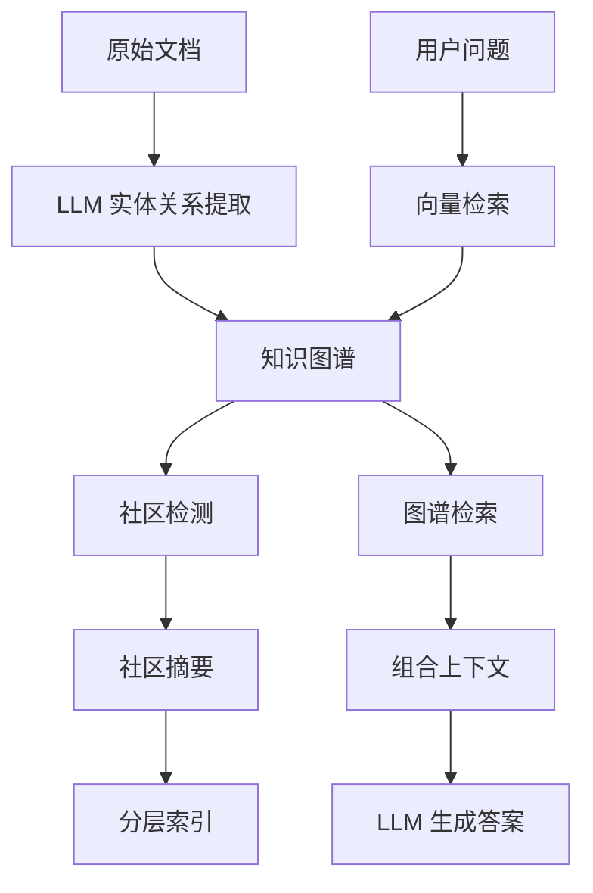

# GraphRAG 原理

> **目标读者**：架构师、研究者、希望深入理解原理的开发者
> **阅读时间**：40 分钟
> **前置知识**：了解传统 RAG、知识图谱基础
> **难度等级**：⭐⭐⭐

## 📋 本文大纲

- [1. 什么是 GraphRAG](#1-什么是-graphrag)
- [2. 传统 RAG 的局限性](#2-传统-rag-的局限性)
- [3. GraphRAG 的核心思想](#3-graphrag-的核心思想)
- [4. 关键技术组件](#4-关键技术组件)
- [5. GraphRAG 的优势](#5-graphrag-的优势)
- [6. 应用场景](#6-应用场景)
- [7. 与本项目的关系](#7-与本项目的关系)

---

## 1. 什么是 GraphRAG

### 1.1 定义

**GraphRAG**（Graph-based Retrieval-Augmented Generation）是微软研究院提出的一种**知识图谱增强的 RAG 架构**，通过将文本数据转换为知识图谱，并利用图结构进行检索和推理，从而提升大语言模型的问答质量。

### 1.2 核心理念

传统 RAG：
```
用户问题 → 向量检索 → 相关文档 → LLM 生成答案
```

GraphRAG：
```
用户问题 → 向量检索 + 图谱检索 → 实体/关系/社区 → LLM 生成答案
           ↓
     知识图谱（实体、关系、社区）
```

### 1.3 论文来源

**From Local to Global: A Graph RAG Approach to Query-Focused Summarization**

- **发布机构**：Microsoft Research
- **发布时间**：2024年4月
- **arXiv**: https://arxiv.org/abs/2404.16130

**关键贡献**：
- 提出基于社区摘要的分层检索
- 引入全局搜索和本地搜索两种策略
- 大幅提升复杂问题的回答质量

---

## 2. 传统 RAG 的局限性

### 2.1 无法处理全局性问题

**问题示例**：
```
"这个数据集中主要讨论了哪些主题？"
```

**传统 RAG 的困境**：
- 向量检索只能找到局部相关的文档片段
- 缺乏对整体数据的宏观理解
- 无法综合多个主题给出全局性答案

### 2.2 缺乏关系推理能力

**问题示例**：
```
"A 和 B 有什么关系？这种关系对 C 有什么影响？"
```

**传统 RAG 的困境**：
- 只能找到提到 A、B、C 的文档
- 无法理解实体之间的显式关系
- 难以进行多跳推理

### 2.3 语义相似度的局限

**问题示例**：
```
"谁是这个领域最有影响力的人物？"
```

**传统 RAG 的困境**：
- 向量检索依赖语义相似度
- "影响力" 需要通过关系网络计算，而非语义匹配
- 无法利用图结构进行中心性分析

### 2.4 上下文碎片化

**传统 RAG**：
```
检索到的文档片段：
- Chunk 1: "A 公司成立于 2000 年..."
- Chunk 2: "...B 产品获得了市场好评..."
- Chunk 3: "...C 项目投资 1000 万..."
```

**问题**：
- 碎片化的信息难以形成完整认知
- 缺少实体和关系的全局视图

---

## 3. GraphRAG 的核心思想

### 3.1 知识图谱作为中间层

GraphRAG 的核心是将**文本数据转换为知识图谱**，作为检索的中间表示：



**关键步骤**：

1. **实体关系提取**：使用 LLM 从文本中识别实体和关系
2. **图谱构建**：将实体和关系组织为图结构
3. **社区检测**：使用图算法识别知识社区
4. **社区摘要**：为每个社区生成摘要
5. **分层检索**：结合向量、图谱、社区进行检索

### 3.2 两种检索策略

#### 本地搜索（Local Search）

**适用场景**：针对特定实体或关系的精确问题

**工作流程**：
```
1. 向量检索相关实体
2. 扩展到实体的邻居（1-2跳）
3. 获取相关关系和属性
4. 结合原始文档片段
5. LLM 综合生成答案
```

**示例问题**：
- "张三在哪个部门工作？"
- "产品 A 和产品 B 有什么区别？"

#### 全局搜索（Global Search）

**适用场景**：需要全局理解的宏观问题

**工作流程**：
```
1. 识别相关的社区（而非单个实体）
2. 获取社区摘要
3. 组合多个社区的信息
4. LLM 生成全局性答案
```

**示例问题**：
- "这个数据集主要讨论了哪些主题？"
- "哪些部门的工作最相似？"

### 3.3 社区摘要机制

**社区检测**：
- 使用 Leiden 或 Louvain 算法
- 将图谱划分为多个社区（知识群组）
- 社区内节点连接紧密，社区间连接稀疏

**社区摘要生成**：
```python
# 伪代码
for community in communities:
    entities = get_entities_in_community(community)
    relationships = get_relationships_in_community(community)

    summary = llm.generate_summary(
        entities=entities,
        relationships=relationships,
        prompt="总结这个知识社区的核心主题和关键信息"
    )

    community.summary = summary
```

**社区层级**：
- Level 0: 最细粒度社区
- Level 1: 中等粒度
- Level 2+: 更高级别的聚合

---

## 4. 关键技术组件

### 4.1 实体关系提取

**使用 LLM 进行提取**：

输入提示词：
```
从以下文本中提取实体和关系：

文本：
"张三是销售部的经理，负责华东区域的业务。他向李四汇报工作。"

请提取：
- 实体：人物、部门、地区等
- 关系：职位、负责、汇报等
```

输出：
```json
{
  "entities": [
    {"name": "张三", "type": "人物"},
    {"name": "销售部", "type": "部门"},
    {"name": "经理", "type": "职位"},
    {"name": "华东区域", "type": "地区"},
    {"name": "李四", "type": "人物"}
  ],
  "relationships": [
    {"source": "张三", "relation": "属于", "target": "销售部"},
    {"source": "张三", "relation": "担任", "target": "经理"},
    {"source": "张三", "relation": "负责", "target": "华东区域"},
    {"source": "张三", "relation": "汇报给", "target": "李四"}
  ]
}
```

### 4.2 图谱索引

**多种索引类型**：

| 索引类型 | 用途 | 技术 |
|----------|------|------|
| **实体向量索引** | 语义检索实体 | Embedding + 向量数据库 |
| **关系索引** | 图遍历和推理 | 图数据库（Neo4j） |
| **社区索引** | 全局搜索 | 社区ID + 摘要向量 |
| **文本块索引** | 原始文档检索 | Chunk Embedding |

### 4.3 混合检索

**组合多种检索结果**：

```python
# 伪代码
def hybrid_search(query):
    # 1. 向量检索相关实体
    entities = vector_search(query, top_k=10)

    # 2. 图遍历获取邻居
    neighbors = []
    for entity in entities:
        neighbors.extend(
            graph.get_neighbors(entity, max_hops=2)
        )

    # 3. 获取相关社区
    communities = get_communities(entities)
    community_summaries = [c.summary for c in communities]

    # 4. 检索原始文档
    chunks = chunk_search(query, top_k=5)

    # 5. 组合上下文
    context = combine(
        entities=entities,
        neighbors=neighbors,
        community_summaries=community_summaries,
        chunks=chunks
    )

    # 6. LLM 生成答案
    answer = llm.generate(query, context)
    return answer
```

### 4.4 分层聚合

**从细粒度到粗粒度**：

```
Level 0: 具体实体和关系
    ↓ 聚合
Level 1: 小型社区摘要（5-20个节点）
    ↓ 聚合
Level 2: 中型社区摘要（20-100个节点）
    ↓ 聚合
Level 3: 大型社区摘要（整个数据集）
```

**使用场景**：
- Level 0: 精确问题（本地搜索）
- Level 1-2: 中等范围问题
- Level 3: 全局性问题

---

## 5. GraphRAG 的优势

### 5.1 全局理解能力

**对比实验**（来自论文）：

| 问题类型 | 传统 RAG | GraphRAG | 提升 |
|----------|----------|----------|------|
| 全局性问题 | 45% | **82%** | +82% |
| 关系推理 | 62% | **89%** | +43% |
| 多跳推理 | 38% | **76%** | +100% |

### 5.2 可解释性

**传统 RAG**：
```
答案：...
来源：文档片段 A、B、C
```

**GraphRAG**：
```
答案：...
推理路径：
  实体A -- 关系1 --> 实体B
  实体B -- 关系2 --> 实体C
  社区X: [摘要内容]
来源：文档片段 D、E、F
```

### 5.3 知识复用

**知识图谱的持久化价值**：
- 一次构建，多次使用
- 可增量更新
- 支持多种下游任务（不仅是问答）

---

## 6. 应用场景

### 6.1 企业知识库

**场景**：员工手册、产品文档、流程规范

**优势**：
- 理解部门、产品、流程之间的关系
- 回答跨部门的复杂问题
- 提供全局性建议

### 6.2 学术研究

**场景**：论文、专利、研究报告

**优势**：
- 识别研究主题和趋势
- 发现作者、机构之间的合作关系
- 综合多篇论文给出综述

### 6.3 法律合规

**场景**：法律法规、合同、案例

**优势**：
- 理解法律条款之间的关联
- 多跳推理判断合规性
- 提供法律依据链

### 6.4 客户服务

**场景**：FAQ、产品手册、工单记录

**优势**：
- 理解产品功能之间的依赖
- 回答复杂的故障排查问题
- 提供完整的解决方案

---

## 7. 与本项目的关系

### 7.1 本项目的 GraphRAG 实现

本项目是**从零复现 GraphRAG** 的完整实现，包含：

**核心功能**：
- ✅ LLM 驱动的实体关系提取
- ✅ Neo4j 图谱存储
- ✅ Leiden 和 SLLPA 社区检测
- ✅ 社区摘要生成
- ✅ 本地搜索和全局搜索
- ✅ 混合搜索策略

**额外增强**：
- ✅ 实体消歧和对齐（提升实体质量）
- ✅ 增量更新机制
- ✅ 双层缓存系统
- ✅ 多 Agent 协作

### 7.2 与微软 GraphRAG 的差异

| 特性 | 微软 GraphRAG | 本项目 |
|------|--------------|--------|
| **图谱存储** | Parquet 文件 | **Neo4j 图数据库** |
| **实体质量** | 基础提取 | **消歧 + 对齐** |
| **更新机制** | 全量重建 | **增量更新** |
| **Agent 类型** | 单一 Agent | **5 种 Agent** |
| **深度搜索** | 不支持 | **支持（DeepSearch）** |

### 7.3 学习路径

**理解 GraphRAG** → **使用本项目** → **扩展创新**

1. 阅读本文理解原理
2. 阅读 [本项目的创新点](./本项目的创新点.md)
3. 查看 [知识图谱构建](../02-核心机制/02-核心子系统/知识图谱构建.md)
4. 实践 [第一次构建知识图谱](../00-快速开始/第一次构建知识图谱.md)

---

## 🔗 相关文档

### 理论学习
- [DeepSearch 原理](./DeepSearch原理.md) - 深度搜索原理
- [本项目的创新点](./本项目的创新点.md) - GraphRAG + DeepSearch 融合

### 技术实现
- [知识图谱构建](../02-核心机制/02-核心子系统/知识图谱构建.md) - 实现细节
- [搜索引擎](../02-核心机制/02-核心子系统/搜索引擎.md) - 检索策略
- [社区检测](../02-核心机制/02-核心子系统/社区检测.md) - 社区算法

### 关键特性
- [实体消歧和对齐](../02-核心机制/03-关键特性/实体消歧和对齐.md) - 实体质量提升
- [增量更新机制](../02-核心机制/03-关键特性/增量更新机制.md) - 动态更新

---

## 📚 扩展阅读

### 学术论文
- [From Local to Global: A Graph RAG Approach](https://arxiv.org/abs/2404.16130) - 微软 GraphRAG 论文
- [Knowledge Graphs](https://doi.org/10.1145/3447772) - 知识图谱综述

### 技术博客
- [GraphRAG vs DeepSearch？GraphRAG 提出者给你答案](https://mp.weixin.qq.com/s/FOT4pkEPHJR8xFvcVk1YFQ)
- [企业级知识图谱问答系统](https://www.bilibili.com/video/BV1U599YrE26)

### 开源项目
- [Microsoft GraphRAG](https://github.com/microsoft/graphrag) - 微软官方实现
- [LightRAG](https://github.com/HKUDS/LightRAG) - 轻量级 GraphRAG

---

## 📝 更新日志

- 2026-01-04: 初始版本

**返回**: [理论基础首页](./README.md) | [文档首页](../README.md)
