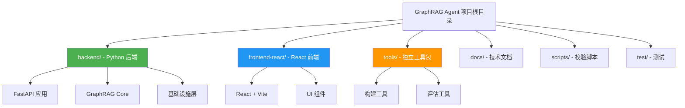
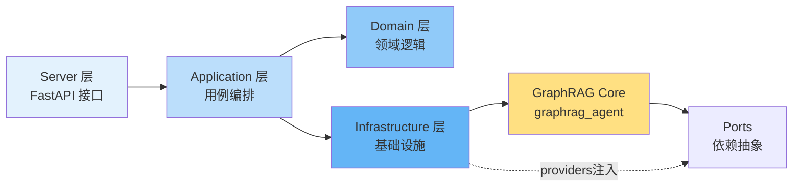
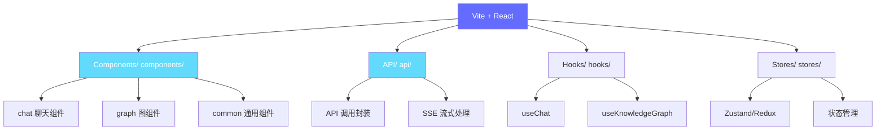
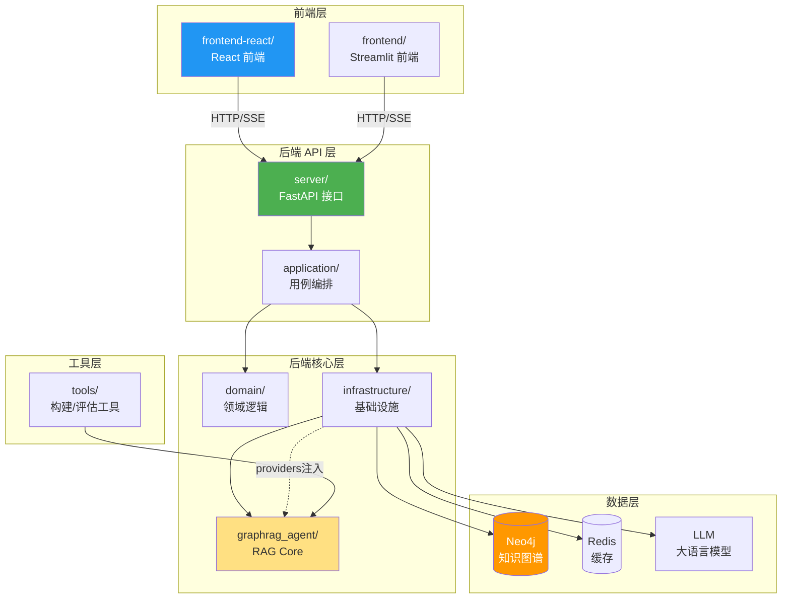
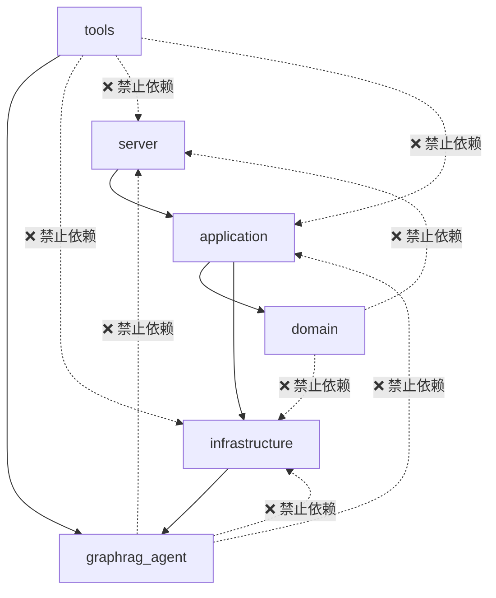
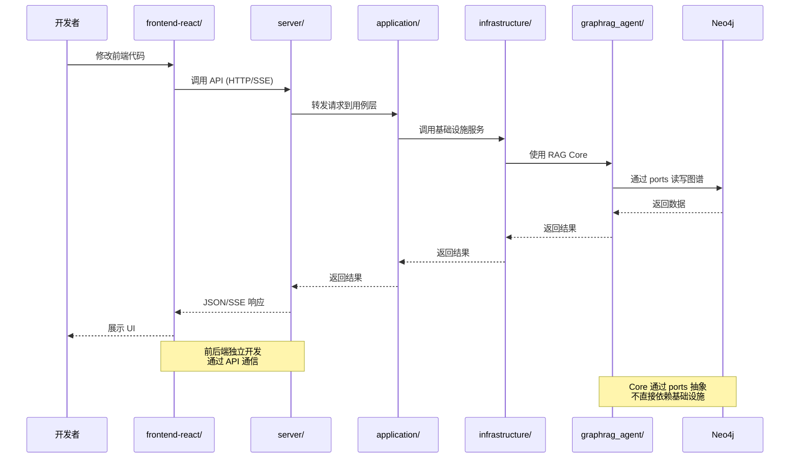

# 01-项目目录结构

> **目标读者**：开发者、架构师、贡献者
> **预计阅读时间**：30-40 分钟
> **难度等级**：⭐⭐

## 目录

- [1. 项目概览](#1-项目概览)
- [2. 顶层目录结构（Monorepo）](#2-顶层目录结构monorepo)
- [3. 核心目录详解](#3-核心目录详解)
  - [3.1 backend/ 后端目录结构](#31-backend-后端目录结构)
  - [3.2 frontend-react/ 前端目录结构](#32-frontend-react-前端目录结构)
  - [3.3 tools/ 工具包目录结构](#33-tools-工具包目录结构)
  - [3.4 其他重要目录](#34-其他重要目录)
- [4. 配置文件说明](#4-配置文件说明)
- [5. 目录依赖关系（分层约束）](#5-目录依赖关系分层约束)
- [6. 快速定位指南](#6-快速定位指南)
- [7. 待完善的目录收敛设计](#7-待完善的目录收敛设计)

---

## 1. 项目概览

本项目是一个 **GraphRAG + 深度搜索** 的知识图谱问答系统，采用 **Monorepo** 架构组织代码：



### 1.1 项目特点

- ✅ **前后端分离**：backend 和 frontend-react 独立开发、部署
- ✅ **分层架构**：后端采用 DDD 分层 + Core 注入设计
- ✅ **工具包独立**：构建和评估工具可独立 pip 安装
- ✅ **多 Agent 协作**：NaiveRAG、GraphAgent、HybridAgent、DeepResearch、FusionAgent
- ✅ **知识图谱驱动**：基于 Neo4j 的实体关系图谱

### 1.2 与 Dify 的架构对比

借鉴 Dify 的"顶层按应用边界拆分"思路：

| Dify | 本项目 | 含义 |
|---|---|---|
| `api/` | `backend/` | 后端应用（HTTP API + 业务编排 + 基础设施 + core 注入） |
| `web/` | `frontend-react/` | React 前端（主要适配对象） |
| `docs/` / `docs_new/` | `docs/` | 文档体系（技术机制/架构/落地指南） |
| `scripts/` | `scripts/` | 仓库脚本（验证、辅助工具） |
| `docker/` | `docker-compose.yaml` | 部署编排（Neo4j 等） |
| `sdks/` |（规划项）| 将来如需 SDK/客户端封装，可单独成顶层目录 |

### 1.3 核心约束

- 所有后端源码物理位置统一在 `backend/` 下（仓库根目录不再出现 `server/`、`graphrag_agent/` 等后端包目录）
- 数据输入与运行产物分离：输入放 `datasets/`、`documents/`（如有）；产物放 `cache/`、`files/`、`logs/`
- Core 核心库 (`graphrag_agent`) 通过 ports 接口依赖外部服务，不直接依赖基础设施层

---

## 2. 顶层目录结构（Monorepo）

### 2.1 完整目录树

（只列与架构/开发最相关的目录；本地 `build/`、`*egg-info/` 等通常是构建产物，不属于架构）

```
graph-rag-agent/
├── backend/                   # 后端（FastAPI + application/domain/infra + graphrag_agent core）
│   ├── server/                # HTTP 层（FastAPI）
│   ├── application/           # 用例编排层
│   ├── domain/                # 领域层
│   ├── infrastructure/        # 基础设施层
│   ├── graphrag_agent/        # RAG 核心库
│   └── config/                # 服务侧配置
├── frontend-react/            # React 前端（主要适配对象）
│   ├── src/                   # 源代码
│   ├── public/                # 静态资源
│   └── ...                    # 前端配置文件
├── frontend/                  # Streamlit UI（历史/辅助）
│   ├── components/            # UI 组件
│   ├── utils/                 # 工具函数
│   └── app.py                 # 应用入口
├── tools/                     # 工具包（build/eval 等），可独立 pip 安装
│   ├── graphrag_agent_build/  # 构建工具
│   └── graphrag_agent_evaluation/ # 评估工具
├── scripts/                   # 校验脚本（core-only / tools packages / etc）
│   ├── verify_core_import.py  # 验证 core-only import（不依赖 infra / 不要求 provider 预配置）
│   └── ...                    # 其他脚本
├── docs/                      # 文档
│   ├── 01-快速开始/           # 快速上手指南
│   ├── 02-核心机制/           # 核心机制文档
│   ├── 03-API参考/            # API 参考文档
│   └── 04-开发指南/           # 开发指南
├── test/                      # unittest 回归测试
│   ├── evaluation/            # 评估测试
│   ├── test_*.py              # 单元测试
│   └── ...                    # 其他测试
├── datasets/                  # 输入数据（源数据）
├── documents/                 # 输入语料（如有；不提交生成物）
├── files/                     # 运行/构建使用的文件与中间产物
│   ├── genres.json            # 输入：类型数据
│   ├── movie_data/            # 输入：电影数据
│   └── neo4j_backups/         # 输出：备份文件
├── cache/                     # 缓存与模型缓存（运行产物；不提交）
│   ├── session/               # 会话缓存
│   └── global/                # 全局缓存
├── logs/                      # 日志（运行产物；不提交）
├── .env.example               # 环境变量模板
├── docker-compose.yaml        # Neo4j 等依赖服务编排
├── requirements.txt           # Python 依赖
├── setup.py                   # 包安装配置
├── CLAUDE.md                  # Claude Code 指南
├── AGENTS.md                  # Agent 开发指南
└── README.md                  # 项目说明
```

### 2.2 顶层目录功能对比

| 目录 | 功能 | 技术栈 | 说明 |
|-----|------|--------|------|
| **backend/** | 后端 API 服务 | Python + FastAPI | RESTful API、业务逻辑、GraphRAG 核心 |
| **frontend-react/** | React 前端应用 | React + Vite + TypeScript | 用户界面、交互逻辑、可视化 |
| **frontend/** | Streamlit 前端 | Streamlit + Python | 历史版本、快速原型、调试工具 |
| **tools/** | 独立工具包 | Python | 构建、评估工具，可独立安装 |
| **docs/** | 技术文档 | Markdown | 多层次技术文档体系 |
| **test/** | 测试套件 | unittest/pytest | 单元测试、集成测试、评估测试 |
| **scripts/** | 仓库脚本 | Python/Bash | 验证脚本、辅助工具 |
| **datasets/** | 输入数据 | JSON/CSV | 源数据文件 |
| **files/** | 运行文件 | 各种格式 | 输入文件 + 中间产物 |
| **cache/** | 缓存目录 | - | 运行时缓存，不提交到仓库 |
| **logs/** | 日志目录 | - | 运行日志，不提交到仓库 |

---

## 3. 核心目录详解

### 3.1 backend/ 后端目录结构

#### 3.1.1 backend 目录树

backend 采用"应用分层 + core 注入"的方式组织：

```
backend/
├── server/                    # HTTP 层（FastAPI）
│   ├── api/                   # REST endpoints
│   │   └── rest/              # RESTful API
│   │       └── v1/            # API v1 版本
│   │           ├── chat.py    # 聊天接口（非流式）
│   │           ├── chat_stream.py  # 聊天接口（SSE 流式）
│   │           ├── knowledge_graphs.py  # 知识图谱接口
│   │           ├── sources.py  # 来源数据接口
│   │           └── ...        # 其他接口
│   ├── models/                # 请求/响应 schema（Pydantic）
│   │   ├── chat.py            # 聊天模型
│   │   ├── knowledge_graph.py  # 知识图谱模型
│   │   └── ...                # 其他模型
│   ├── api_router.py          # v1 路由聚合入口（唯一入口）
│   └── main.py                # FastAPI app 入口（启动时 bootstrap ports）
│
├── application/               # 用例编排层（handlers/use_cases + ports）
│   ├── chat/                  # 聊天应用
│   │   ├── handlers/          # 请求处理器
│   │   │   ├── chat_handler.py    # 普通聊天处理
│   │   │   └── stream_handler.py  # 流式聊天处理
│   │   └── ports/             # 端口接口
│   ├── knowledge_graph/       # 知识图谱应用
│   └── ...                    # 其他应用
│
├── domain/                    # 领域层（实体/服务/配置规则；不依赖 infra/server）
│   ├── knowledge_bases/       # 知识库领域
│   │   ├── movie/             # 电影知识库
│   │   │   ├── planner.py     # 电影 KB 计划器
│   │   │   └── ...            # 其他电影 KB 逻辑
│   │   ├── edu/               # 教育知识库
│   │   │   ├── planner.py     # 教育 KB 计划器
│   │   │   └── ...            # 其他教育 KB 逻辑
│   │   └── general/           # 通用知识库
│   └── entities/              # 领域实体
│
├── infrastructure/            # 基础设施层（Neo4j/LLM/缓存/streaming/routing 等适配）
│   ├── providers/             # graphrag_agent ports 的 provider 实现（推荐入口）
│   │   ├── cache.py           # 缓存 provider
│   │   ├── models.py          # 模型 provider
│   │   ├── neo4jdb.py         # Neo4j provider
│   │   ├── vector_store.py    # 向量存储 provider
│   │   ├── graph_documents.py # GraphDocument 写入 provider
│   │   └── gds.py             # GraphDataScience provider
│   ├── routing/               # 路由实现
│   │   ├── kb_router/         # 启发式/规则路由
│   │   ├── orchestrator/      # RouterGraph / WorkerRegistry
│   │   ├── router.py          # 统一路由器
│   │   └── types.py
│   ├── streaming/             # 流式处理
│   │   ├── chat_stream_executor.py  # 唯一流式执行器
│   │   └── sse.py             # SSE 工具
│   ├── rag/                   # RAG 运行时适配（executor/aggregator/answer generator）
│   ├── llm/                   # LLM 适配
│   ├── bootstrap.py           # 把 providers 注入到 graphrag_agent.ports
│   └── config/                # infra 配置 + core settings overrides
│       ├── settings.py        # Neo4j/LLM/缓存路径等
│       ├── graphrag_settings.py  # core settings overrides
│       └── neo4jdb.py         # Neo4j 连接配置
│
├── graphrag_agent/            # RAG core（算法/agents/search/ports；不 import infra）
│   ├── agents/                # Agent 实现
│   │   ├── base.py            # BaseAgent
│   │   ├── naive_rag_agent.py  # 朴素 RAG Agent
│   │   ├── graph_agent.py     # 图 Agent
│   │   ├── hybrid_agent.py    # 混合 Agent
│   │   ├── deep_research_agent.py  # 深度研究 Agent
│   │   ├── fusion_agent.py    # 融合 Agent
│   │   └── multi_agent/       # 多 Agent 协作
│   │       ├── planner/       # 计划器
│   │       ├── executor/      # 执行器
│   │       ├── reporter/      # 报告器
│   │       └── orchestrator.py  # 编排器
│   ├── search/                # 搜索策略
│   │   ├── local_search.py    # 本地搜索
│   │   ├── global_search.py   # 全局搜索
│   │   ├── tool/              # 搜索工具
│   │   └── tool_registry.py   # 工具注册表
│   ├── graph/                 # 图操作
│   │   ├── extraction/        # 实体提取
│   │   ├── processing/        # 实体处理
│   │   ├── indexing/          # 索引管理
│   │   └── core/              # 图核心
│   ├── community/             # 社区检测
│   │   ├── detector/          # 检测器
│   │   └── summary/           # 摘要
│   ├── models/                # 模型管理
│   ├── pipelines/             # 数据管道
│   │   └── ingestion/         # 数据摄取
│   ├── evaluation/            # 评估系统
│   └── ports/                 # 端口接口（依赖抽象）
│
├── config/                    # 服务侧配置入口（开关/语义配置/数据库入口）
│   ├── settings.py            # 服务运行参数与功能开关
│   ├── rag_semantics.py       # RAG 语义配置
│   └── rag.py                 # 对外 server-facing 语义导出
│
└── pyproject.toml             # runtime 子发行包（graphrag-agent-runtime）
```

#### 3.1.2 backend 架构特点

**采用领域驱动设计（DDD）+ Core 注入**：



**关键模块说明**：

| 模块 | 职责 | 关键文件 | 依赖约束 |
|-----|------|---------|---------|
| **server/** | 处理 HTTP 请求，参数验证 | `api/rest/v1/*.py`, `main.py` | 可依赖 application |
| **application/** | 用例编排，业务流程 | `chat/handlers/*.py` | 可依赖 domain、infra |
| **domain/** | 领域核心逻辑 | `knowledge_bases/*/planner.py` | **不可**依赖 infra、server |
| **infrastructure/** | 外部依赖适配 | `providers/*.py`, `routing/*.py` | 可依赖 graphrag_agent |
| **graphrag_agent/** | RAG 算法核心 | `agents/*.py`, `search/*.py` | **仅**依赖 ports 接口 |
| **config/** | 服务配置管理 | `settings.py`, `rag.py` | 独立配置层 |

---

### 3.2 frontend-react/ 前端目录结构

#### 3.2.1 frontend-react 目录树

```
frontend-react/
├── src/                       # 源代码
│   ├── api/                   # API 调用
│   │   ├── client.ts          # API 客户端
│   │   ├── chat.ts            # 聊天 API
│   │   └── knowledge-graph.ts  # 知识图谱 API
│   ├── components/            # React 组件
│   │   ├── chat/              # 聊天组件
│   │   │   ├── ChatWindow.tsx  # 聊天窗口
│   │   │   ├── MessageList.tsx  # 消息列表
│   │   │   └── ...            # 其他聊天组件
│   │   ├── graph/             # 图可视化组件
│   │   │   ├── GraphViewer.tsx  # 图查看器
│   │   │   └── ...            # 其他图组件
│   │   ├── common/            # 通用组件
│   │   └── layout/            # 布局组件
│   ├── hooks/                 # 自定义 Hooks
│   │   ├── useChat.ts         # 聊天 Hook
│   │   ├── useKnowledgeGraph.ts  # 知识图谱 Hook
│   │   └── ...                # 其他 Hooks
│   ├── stores/                # 状态管理
│   │   ├── chatStore.ts       # 聊天状态
│   │   ├── graphStore.ts      # 图状态
│   │   └── ...                # 其他状态
│   ├── types/                 # TypeScript 类型
│   │   ├── chat.ts            # 聊天类型
│   │   ├── graph.ts           # 图类型
│   │   └── ...                # 其他类型
│   ├── utils/                 # 工具函数
│   │   ├── request.ts         # 请求工具
│   │   └── ...                # 其他工具
│   ├── styles/                # 样式文件
│   │   ├── global.css         # 全局样式
│   │   └── ...                # 其他样式
│   ├── App.tsx                # 应用入口组件
│   ├── main.tsx               # 应用入口
│   └── vite-env.d.ts          # Vite 类型声明
│
├── public/                    # 静态资源
│   ├── favicon.ico            # 图标
│   └── ...                    # 其他静态资源
│
├── index.html                 # HTML 模板
├── package.json               # NPM 依赖管理
├── vite.config.ts             # Vite 配置
├── tsconfig.json              # TypeScript 配置
├── eslint.config.js           # ESLint 配置
└── README.md                  # 前端说明
```

#### 3.2.2 frontend-react 架构特点

**采用 React + Vite + TypeScript**：



**关键目录说明**：

| 目录 | 职责 | 说明 |
|-----|------|------|
| **src/api/** | API 调用 | 封装后端 API，处理 HTTP/SSE 请求 |
| **src/components/** | UI 组件 | 可复用的 React 组件 |
| **src/hooks/** | 自定义 Hooks | 封装可复用逻辑 |
| **src/stores/** | 状态管理 | Zustand/Redux 全局状态 |
| **src/types/** | 类型定义 | TypeScript 类型声明 |
| **src/utils/** | 工具函数 | 通用工具函数 |

---

### 3.3 tools/ 工具包目录结构

#### 3.3.1 tools 目录树

```
tools/
├── graphrag_agent_build/      # 构建工具包（可独立 pip 安装）
│   ├── core/                  # 构建核心逻辑
│   │   ├── graph_builder.py   # 图构建器
│   │   ├── index_builder.py   # 索引构建器
│   │   └── ...                # 其他构建器
│   ├── incremental/           # 增量更新
│   │   ├── file_change_manager.py  # 文件变更管理
│   │   ├── incremental_update_scheduler.py  # 增量更新调度
│   │   └── ...                # 其他增量组件
│   ├── main.py                # 构建入口（全量）
│   ├── incremental_update.py  # 增量更新入口
│   ├── setup.py               # 包安装配置
│   └── README.md              # 构建工具说明
│
└── graphrag_agent_evaluation/ # 评估工具包（可独立 pip 安装）
    ├── core/                  # 评估核心
    │   ├── base_evaluator.py  # 基础评估器
    │   ├── base_metric.py     # 基础指标
    │   └── ...                # 其他评估核心
    ├── evaluators/            # 评估器实现
    │   ├── answer_evaluator.py  # 答案评估
    │   ├── retrieval_evaluator.py  # 检索评估
    │   └── ...                # 其他评估器
    ├── metrics/               # 评估指标
    │   ├── answer_metrics.py  # 答案指标
    │   ├── retrieval_metrics.py  # 检索指标
    │   └── ...                # 其他指标
    ├── setup.py               # 包安装配置
    └── README.md              # 评估工具说明
```

#### 3.3.2 tools 设计特点

- **独立安装**：每个工具包都有独立的 `setup.py`，可以单独 `pip install`
- **最小依赖**：只依赖 core 核心库，不依赖 backend 服务层
- **命令行友好**：提供清晰的 CLI 入口（`main.py`）

---

### 3.4 其他重要目录

#### 3.4.1 frontend/ (Streamlit UI - 历史版本)

```
frontend/
├── components/                # Streamlit 组件
│   ├── chat.py                # 聊天组件
│   ├── graph_visualizer.py    # 图可视化
│   └── ...                    # 其他组件
├── utils/                     # 工具函数
│   ├── api.py                 # API 调用
│   └── ...                    # 其他工具
├── frontend_config/           # 前端配置
│   └── settings.py            # 配置设置
├── app.py                     # Streamlit 应用入口
└── README.md                  # Streamlit 前端说明
```

#### 3.4.2 docs/ (文档)

```
docs/
├── 01-快速开始/               # 快速上手指南
│   ├── 01-项目简介.md
│   ├── 02-环境准备.md
│   └── ...
├── 02-核心机制/               # 核心机制文档
│   ├── 01-整体架构/
│   ├── 02-核心子系统/
│   └── ...
├── 03-API参考/                # API 参考文档
│   └── ...
├── 04-开发指南/               # 开发指南
│   └── ...
└── README.md                  # 文档索引
```

#### 3.4.3 test/ (测试)

```
test/
├── evaluation/                # 评估测试
│   ├── test_answer_quality.py
│   └── ...
├── test_agents_import_hints.py  # Agent 导入测试
├── test_backend_layout.py     # 后端布局测试
├── test_core_import.py        # Core 导入测试
├── test_streaming_real_rag_integration.py  # 流式集成测试
└── ...                        # 其他测试
```

---

## 4. 配置文件说明

### 4.1 项目根目录配置文件

| 配置文件 | 用途 | 说明 |
|---------|------|------|
| **.env.example** | 环境变量模板 | 复制为 `.env` 并修改，包含所有配置项 |
| **docker-compose.yaml** | Docker 编排 | Neo4j、Redis 等服务编排 |
| **requirements.txt** | Python 依赖 | 后端 Python 包依赖 |
| **setup.py** | 包安装配置 | Python 包安装脚本 |
| **pyproject.toml** | Python 项目配置 | （如有）现代 Python 项目配置 |
| **CLAUDE.md** | Claude Code 指南 | AI 辅助开发说明（Claude Code 专用） |
| **AGENTS.md** | Agent 开发指南 | Agent 系统开发说明 |
| **README.md** | 项目说明 | 快速开始指南 |

### 4.2 backend/ 配置文件

#### 4.2.1 服务侧配置（backend/config）

用于"接口行为/运行开关/语义入口"：

| 配置文件 | 用途 | 位置 |
|---------|------|------|
| **settings.py** | 服务运行参数与功能开关 | `backend/config/` |
| **rag_semantics.py** | RAG 语义配置（实体/关系类型、示例等） | `backend/config/` |
| **rag.py** | 对外 server-facing 语义导出 | `backend/config/` |

#### 4.2.2 基础设施侧配置（backend/infrastructure/config）

用于"外部依赖与注入"：

| 配置文件 | 用途 | 位置 |
|---------|------|------|
| **settings.py** | Neo4j/LLM/缓存路径等 | `backend/infrastructure/config/` |
| **graphrag_settings.py** | 构建并注入 core settings overrides | `backend/infrastructure/config/` |

#### 4.2.3 server 配置文件

| 配置文件 | 用途 | 位置 |
|---------|------|------|
| **main.py** | FastAPI app 入口，启动时 bootstrap | `backend/server/` |
| **api_router.py** | v1 路由聚合入口 | `backend/server/` |

### 4.3 frontend-react/ 配置文件

| 配置文件 | 用途 | 位置 |
|---------|------|------|
| **package.json** | NPM 依赖管理 | `frontend-react/` |
| **vite.config.ts** | Vite 配置 | `frontend-react/` |
| **tsconfig.json** | TypeScript 配置 | `frontend-react/` |
| **eslint.config.js** | ESLint 配置 | `frontend-react/` |

### 4.4 环境变量配置（.env）

**配置统一来自仓库根 `.env`**（参考 `.env.example` 与 `assets/start.md`）

关键配置项：

```env
# LLM 配置
OPENAI_API_KEY=sk-xxx
OPENAI_BASE_URL=http://localhost:13000/v1
OPENAI_EMBEDDINGS_MODEL=text-embedding-3-large
OPENAI_LLM_MODEL=gpt-4o

# Neo4j 配置
NEO4J_URI=neo4j://localhost:7687
NEO4J_USERNAME=neo4j
NEO4J_PASSWORD=12345678

# 性能调优
MAX_WORKERS=4
BATCH_SIZE=100
ENTITY_BATCH_SIZE=50
GDS_MEMORY_LIMIT=6
GDS_CONCURRENCY=4

# 运行时目录（生成产物 / 第三方依赖缓存）
RUNTIME_ROOT=./files

# 功能开关
GRAPH_COMMUNITY_ALGORITHM=leiden  # leiden / sllpa
GRAPH_CONFLICT_STRATEGY=manual_first  # manual_first / auto_first / merge
```

本项目配置读取统一来自仓库根 `.env`（参考 `.env.example` 与 `assets/start.md`）。

**配置入口显性化**：在 `assets/start.md` 和本文档中同步维护配置索引，降低误改概率。

---

## 5. 目录依赖关系（分层约束）

### 5.1 架构层次依赖



### 5.2 依赖方向约束

**允许的 import 方向**：



**说明**：

- `domain` 只包含业务语义，**不应**依赖任何具体基础设施实现
- `graphrag_agent` 作为 core **仅**通过 ports 依赖抽象，**不应** import `infrastructure.*`、`server.*`、`application.*`
- `tools` 工具包只依赖 `graphrag_agent` core，**不应**依赖服务层或基础设施层
- `infrastructure` 通过 `providers` 实现 `graphrag_agent.ports.*` 接口，在启动时注入

### 5.3 开发流程依赖



---

## 6. 快速定位指南

### 6.1 按功能定位代码

| 我想找... | 位置 | 说明 |
|---------|------|------|
| **API 接口** | `backend/server/api/rest/v1/` | HTTP 请求处理 |
| **请求/响应模型** | `backend/server/models/` | Pydantic schemas |
| **聊天编排/分流策略** | `backend/application/chat/handlers/` | ChatHandler/StreamHandler |
| **KB 计划/并行 fanout** | `backend/domain/knowledge_bases/*/planner.py` | 只做 plan，不做 IO |
| **路由（movie/edu/general）** | `backend/infrastructure/routing/` | RouterGraph + kb_router |
| **Streaming（SSE 事件流）** | `backend/infrastructure/streaming/` + `backend/server/api/rest/v1/chat_stream.py` | progress/token/error/done |
| **Neo4j/LLM/持久化实现** | `backend/infrastructure/providers/` + `backend/infrastructure/persistence/` | provider 是推荐入口 |
| **Agent 实现** | `backend/graphrag_agent/agents/` | NaiveRAG、Graph、Hybrid、DeepResearch、Fusion |
| **搜索策略** | `backend/graphrag_agent/search/` | Local/Global Search、工具注册表 |
| **图操作** | `backend/graphrag_agent/graph/` | 提取、处理、索引 |
| **社区检测** | `backend/graphrag_agent/community/` | Leiden/SLLPA |
| **构建/导入数据（build）** | `tools/graphrag_agent_build/` | 工具包，可独立安装 |
| **评估（eval）** | `tools/graphrag_agent_evaluation/` | 工具包，可独立安装 |
| **前端页面** | `frontend-react/src/` | React 组件、API 调用 |
| **前端 UI 组件** | `frontend-react/src/components/` | 聊天、图可视化等组件 |
| **前端 API 调用** | `frontend-react/src/api/` | 封装后端 API |
| **跑回归测试** | `test/` | `bash scripts/test.sh` |

### 6.2 按开发任务定位

| 任务 | 相关目录 | 关键文件 |
|-----|---------|---------|
| **新增/修改 API** | `backend/server/api/rest/v1/` | 新建/修改接口文件 |
| **修改请求/响应模型** | `backend/server/models/` | Pydantic schemas |
| **改聊天编排逻辑** | `backend/application/chat/handlers/` | `chat_handler.py`, `stream_handler.py` |
| **改 KB 路由逻辑** | `backend/infrastructure/routing/` | `kb_router.py`, `router_graph.py` |
| **改 SSE 流式事件** | `backend/infrastructure/streaming/` | `event_aggregator.py`, `progress_tracker.py` |
| **添加新 Agent** | `backend/graphrag_agent/agents/` | 继承 `BaseAgent`，实现 `retrieve_with_trace()` |
| **修改搜索策略** | `backend/graphrag_agent/search/` | `local_search.py`, `global_search.py` |
| **修改图构建逻辑** | `backend/graphrag_agent/graph/` | `extraction/`, `processing/`, `indexing/` |
| **修改社区检测算法** | `backend/graphrag_agent/community/` | `detector/`, `summary/` |
| **添加前端页面** | `frontend-react/src/` | 新建组件、路由 |
| **修改前端样式** | `frontend-react/src/styles/` | CSS 文件 |
| **添加前端 API 调用** | `frontend-react/src/api/` | 新建 API 函数 |
| **运行知识图谱构建** | `tools/graphrag_agent_build/` | `python -m graphrag_agent_build.main` |
| **运行评估** | `tools/graphrag_agent_evaluation/` | 参考 `test/evaluation/` |
| **修改配置** | `.env`, `backend/config/`, `backend/infrastructure/config/` | 环境变量、配置文件 |

### 6.3 按角色定位

| 角色 | 关注目录 | 说明 |
|-----|---------|------|
| **前端开发者** | `frontend-react/`, `backend/server/api/`, `backend/server/models/` | 前端代码 + API 接口 + 请求/响应模型 |
| **后端开发者** | `backend/server/`, `backend/application/`, `backend/domain/`, `backend/infrastructure/` | 后端逻辑 + 基础设施 |
| **RAG 算法工程师** | `backend/graphrag_agent/` | RAG 核心算法 + Agent + 搜索 + 图操作 |
| **全栈开发者** | `backend/`, `frontend-react/`, `tools/` | 完整技术栈 |
| **DevOps** | `docker-compose.yaml`, `scripts/`, `.env` | 部署和运维 |
| **数据工程师** | `tools/graphrag_agent_build/`, `backend/graphrag_agent/graph/`, `backend/graphrag_agent/pipelines/` | 数据摄取 + 图构建 + 索引 |
| **贡献者** | `backend/`, `frontend-react/`, `test/` | 核心代码 + 测试 |

### 6.4 按问题类型定位

| 问题 | 去哪看 | 关键文件 |
|-----|--------|---------|
| **API 响应错误** | `backend/server/api/rest/v1/`, `backend/application/` | 接口文件、用例层 |
| **流式响应问题** | `backend/infrastructure/streaming/`, `backend/server/api/rest/v1/chat_stream.py` | SSE 事件流 |
| **Agent 回答质量** | `backend/graphrag_agent/agents/`, `backend/graphrag_agent/search/` | Agent 实现、搜索策略 |
| **图谱构建失败** | `tools/graphrag_agent_build/`, `backend/graphrag_agent/graph/` | 构建工具、图操作 |
| **前端UI问题** | `frontend-react/src/components/`, `frontend-react/src/styles/` | React 组件、样式 |
| **前端API调用失败** | `frontend-react/src/api/`, `backend/server/api/` | 前端 API 调用、后端接口 |
| **配置不生效** | `.env`, `backend/config/`, `backend/infrastructure/config/` | 环境变量、配置文件 |
| **性能问题** | `.env` (性能调优参数), `backend/graphrag_agent/search/`, `backend/infrastructure/` | 性能配置、搜索优化 |

---

## 7. 待完善的目录收敛设计

本节只讨论“目录边界/命名/守门规则/可执行迁移清单”，目标是让目录结构能长期稳定，不再出现“代码又漂移回仓库根目录”的回退。

### 7.1 backend/ 目录收敛

**现状（以仓库代码为准）**

- ✅ 后端源码物理位置统一在 `backend/` 下（由 `test/test_backend_layout.py` 守门）
- ✅ HTTP 路由聚合入口已收敛：`backend/server/api_router.py`（不再依赖旧 `server/routers/` 目录）
- ✅ 流式执行器已收敛为单一实现：`backend/infrastructure/streaming/chat_stream_executor.py`
- ✅ `providers/` 已收敛为唯一注入入口：`backend/infrastructure/providers/*`
  - 仍保留少量兼容 shim：`backend/infrastructure/cache.py`、`backend/infrastructure/neo4jdb.py`、`backend/infrastructure/vector_store.py`、`backend/infrastructure/graph_documents.py`、`backend/infrastructure/gds.py`（全部指向 providers）

**P0 规则**

- **根目录禁止出现后端包目录**：`server/ application/ domain/ infrastructure/ graphrag_agent/ rag_layer/`（`test/test_backend_layout.py` 已覆盖）
- **运行产物目录固定**：`cache/ files/ logs/` 放仓库根目录（不要写到 `backend/` 下面）
- **开发启动统一使用 `scripts/*.sh`**：以 `scripts/dev.sh` / `scripts/py.sh` / `scripts/test.sh` 为准（脚本内部会统一设置 `PYTHONPATH`，文档里不要再扩散手写命令变体）

**P0 验证命令（建议作为本地/CI 的最小门禁）**

```bash
bash scripts/ut.sh discover -s test -p 'test_backend_layout.py' -v
bash scripts/ut.sh discover -s test -p 'test_layer_boundary_imports.py' -v
bash scripts/ut.sh discover -s test -p 'test_bootstrap_provider_entrypoints.py' -v
bash scripts/ut.sh discover -s test -p 'test_infrastructure_shims.py' -v
bash scripts/ut.sh discover -s test -p 'test_no_legacy_provider_imports.py' -v
bash scripts/ut.sh discover -s test -p 'test_config_entrypoints.py' -v
bash scripts/ut.sh discover -s test -p 'test_dotenv_policy.py' -v
bash scripts/test.sh

# core-only 边界验证（不依赖 repo checkout / 不依赖 infra）
python scripts/verify_core_import.py
./scripts/verify_core_install.sh
./scripts/verify_core_sdist.sh

# tools 包独立发布形态验证（不依赖 PYTHONPATH=backend）
./scripts/verify_tools_packages.sh
```

**P0 守门**

- 目录边界：`test/test_backend_layout.py`
- 分层依赖方向（静态 AST 扫描）：`test/test_layer_boundary_imports.py`
- provider 注入入口唯一（bootstrap 只允许 import providers）：`test/test_bootstrap_provider_entrypoints.py`
- 兼容 shim 只能 re-export + DeprecationWarning：`test/test_infrastructure_shims.py`
- 禁止业务代码再引用旧 provider 路径：`test/test_no_legacy_provider_imports.py`
- config 入口分离（server/app 不 import infra.config；infra 不 import config）：`test/test_config_entrypoints.py`
- dotenv 入口收敛（只允许 config entrypoints 读取 `.env`，并强制 `override=True`）：`test/test_dotenv_policy.py`
- 快速 guardrails（不装依赖也能跑）：`.github/workflows/backend-guardrails.yml`
- core-only 安装与 sdist 边界：`.github/workflows/core-only.yml`
- tools 包“可独立 pip 安装、无需 PYTHONPATH=backend”：`.github/workflows/tools-packages.yml`

### 7.1.1 providers/ 收敛（P1：让“注入入口唯一”）

**目标**：`backend/graphrag_agent/`（core）只通过 `graphrag_agent.ports.*` 获取外部能力；所有基础设施实现统一在 `backend/infrastructure/providers/`，由 `backend/infrastructure/bootstrap.py` 注入。

补充（语义配置桥接）：

- 语义默认值（如 `RESPONSE_TYPE`）只在 `backend/config/rag_semantics.py` 定义
- 运行时通过 `backend/infrastructure/config/graphrag_settings.py` 注入到 `graphrag_agent.config.settings`
- 基础设施侧如需读取语义值，只允许通过 `backend/infrastructure/config/semantics.py`（从 core settings 读取），不允许直接 import `config.*`

**迁移 checklist 模板（每个 provider 都按这个做，避免风格漂移）**

1. **新增 provider 实现（唯一入口）**
   - 新文件：`backend/infrastructure/providers/{name}.py`
   - 在 `backend/infrastructure/providers/__init__.py` 暴露（如需）
2. **bootstrap 注入**
   - 修改：`backend/infrastructure/bootstrap.py`
   - 使用 `graphrag_agent.ports.{port}.set_*_provider(...)` 注入
3. **保留旧路径 shim（向后兼容）**
   - 旧文件保留，但只做 re-export + `DeprecationWarning`
   - 兼容期建议写死（例如 1-2 个里程碑），避免永远不删
4. **更新导入路径**
   - 内部新代码只从 `infrastructure/providers/...` 引用
   - 旧引用允许暂存，但必须能被 grep 出来（方便批量清理）
5. **测试与验收**
   - `bash scripts/test.sh` 通过
   - `python scripts/verify_core_import.py` 通过（core-only 环境下不要求 provider 预配置）
6. **文档同步**
   - 本文档目录树与“唯一入口”描述同步更新

**现状（已完成）**

- provider 统一入口已落地：`backend/infrastructure/providers/{cache,models,neo4jdb,vector_store,graph_documents,gds}.py`
- bootstrap 已只从 providers 注入：`backend/infrastructure/bootstrap.py`
- 旧路径保留 shim 并告警：`backend/infrastructure/{cache,neo4jdb,vector_store,graph_documents,gds}.py`

**下一步（P1：把“兼容层”逐步消化掉）**

1. **停止新增旧路径引用**
   - 新代码只允许 import `infrastructure.providers.*`
   - 旧路径只允许存在于 legacy/兼容场景（并且必须带 DeprecationWarning）
2. **逐步替换旧引用**
   - 用 `rg "from infrastructure\\.(neo4jdb|vector_store|graph_documents|gds|cache) import"` 找到引用点
   - 逐个替换为 `from infrastructure.providers...`
3. **设定 shim 下线窗口**
   - 给每个 shim 标注一个“移除里程碑/日期”（建议 1-2 个迭代内）
   - 约定：shim 必须包含 `DEPRECATED_REMOVE_MILESTONE` 常量，避免“无限期兼容”
   - 到期后删 shim，并在 `test/test_infrastructure_shims.py` 更新允许列表

**验收标准**

- `bash scripts/test.sh` 通过
- `python scripts/verify_core_import.py` 通过（core-only 环境下可 import、ports 可用且不要求提前配置 provider）
- 服务可启动：`bash scripts/dev.sh backend`
- CI gate：`.github/workflows/core-only.yml`、`.github/workflows/tools-packages.yml` 通过

### 7.1.2 Streaming 与 StreamEvent 协议（P1：只保留一套流式链路）

**明确不做的（避免过度设计）**

- ❌ “边检索边生成 / 多流交错 / LangGraph event stream”
- ✅ 保持：**全量检索完成 → 拼接 context → 单次流式生成**，并在检索阶段输出 progress 事件提升可感知性

**唯一实现（后续所有修改都集中在这里，避免两套逻辑漂移）**

- 事件生成与取消/超时：`backend/infrastructure/streaming/chat_stream_executor.py`
- SSE 输出与 keepalive：`backend/server/api/rest/v1/chat_stream.py`
- 事件协议 normalize：`backend/server/models/stream_events.py`

**验收标准**

- stub 回归：`bash scripts/ut.sh discover -s test -p 'test_phase2_api_e2e.py' -v`
- 可选真实链路（需要 Neo4j/LLM env 才跑）：`RUN_REAL_RAG_TESTS=1 bash scripts/ut.sh discover -s test -p 'test_streaming_real_rag_integration.py' -v`

### 7.2 frontend-react/ 目录与接口约定（P1：保证前端适配稳定）

**约定**

- 前端只依赖稳定的 HTTP 协议：REST + SSE（不直接依赖后端内部目录/实现细节）
- SSE 必须能解析 `start/progress/token/done/error` 五类事件（progress 字段固定：`stage/completed/total/error`）
- keepalive 采用 SSE 注释帧（前端应忽略以兼容网关/代理长连接）

**落地建议（最小可执行）**

- 统一 API baseURL：在 `frontend-react/src/api/` 或 `frontend-react/src/config/` 中集中管理（不要在组件里散落字符串）
- 前端对 progress 的 UI 展示只依赖固定字段，不使用“debug 才有”的字段

### 7.3 tools/ 工具包收敛（P0/P1：独立发布形态）

**目标**：`tools/graphrag_agent_build/`、`tools/graphrag_agent_evaluation/` 能被 `pip install -e` 独立安装并运行，不依赖 `PYTHONPATH=backend`。

**守门**

- `./scripts/verify_tools_packages.sh` 必须长期通过

**待收敛项（P1）**

- 逐步下线 root 下的 wrapper/兼容入口（例如 `tools/build/` 的“转发脚本”），改为文档与入口都指向 tools 包自身的 CLI/模块入口

### 7.4 test/ 与 CI 的目录约束（P0：把“边界”变成自动化）

本项目当前以 `unittest` 为主（推荐 `bash scripts/test.sh`），目录不强制拆分成 `unit/ integration/`，优先保证：

- 有“边界守门”测试（例如 `test/test_backend_layout.py`）
- 有“协议守门”测试（例如 SSE progress 字段固定）
- 有“可选集成测试”（需要 Neo4j/LLM env 才跑，默认 skip）

---

## 总结

### 关键要点

1. **Monorepo 架构**：前后端分离，工具独立，清晰的目录边界
2. **backend/ 分层设计**：采用 DDD 架构 + Core 注入，清晰的依赖约束
3. **graphrag_agent/ 核心纯净**：通过 ports 抽象依赖，可独立服务化
4. **frontend-react/ 现代化**：React + Vite + TypeScript，组件化开发
5. **tools/ 独立发布**：构建和评估工具可独立安装使用
6. **配置分层清晰**：服务侧配置 vs 基础设施侧配置，统一从 `.env` 读取
7. **依赖方向明确**：domain 不依赖 infra，core 不依赖任何服务层

### 核心约束（必须遵守）

- ❌ **禁止** `graphrag_agent/` 依赖 `infrastructure/`、`server/`、`application/`
- ❌ **禁止** `domain/` 依赖 `infrastructure/`、`server/`
- ❌ **禁止** `tools/` 依赖 `infrastructure/`、`server/`、`application/`
- ✅ **允许** `infrastructure/` 通过 `providers/` 实现 `graphrag_agent/ports/*` 接口
- ✅ **允许** 在服务启动时通过 `bootstrap.py` 注入依赖

### 下一步学习

- **[系统架构总览](./02-系统架构总览.md)** - 了解整体架构设计
- **[完整数据流](./03-完整数据流.md)** - 理解数据流转过程
- **[Multi-Agent 协作](../02-核心子系统/01-MultiAgent协作.md)** - 深入多 Agent 协作机制
- **[知识图谱构建](../02-核心子系统/02-知识图谱构建.md)** - 了解图谱构建流程
- **[开发环境搭建](../../04-开发指南/01-开发环境搭建.md)** - 搭建开发环境

### 常见问题

**Q: 为什么要把 `graphrag_agent` 放在 `backend/` 下？**
A: 虽然 `graphrag_agent` 是可独立服务化的核心库，但目前它和后端服务紧密集成。通过 `ports` 抽象，保证了它的独立性，未来可以轻松抽取出来。

**Q: `frontend/` 和 `frontend-react/` 有什么区别？**
A: `frontend/` 是基于 Streamlit 的历史版本，主要用于快速原型和调试。`frontend-react/` 是基于 React 的现代化前端，是主要适配对象。

**Q: `tools/` 下的工具包可以独立安装吗？**
A: 是的，`tools/graphrag_agent_build/` 和 `tools/graphrag_agent_evaluation/` 都有独立的 `setup.py`，可以通过 `pip install -e tools/graphrag_agent_build/` 独立安装。

**Q: 配置文件应该放在哪里？**
A: 统一放在仓库根目录的 `.env` 文件中。`backend/config/` 和 `backend/infrastructure/config/` 用于代码层面的配置管理，但最终的配置值都来自 `.env`。

**Q: 如何验证依赖约束是否被违反？**
A: 运行 `python scripts/verify_core_import.py` 可以验证 `graphrag_agent/` 是否保持纯净（core-only 环境下可 import，不依赖基础设施层）。

---

**文档版本**：v2.0
**最后更新**：2026-01-18
**维护者**：GraphRAG Agent 文档团队
**参考**：借鉴 Dify 项目目录结构设计
