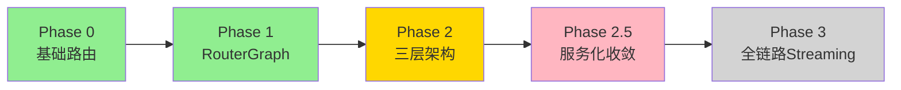
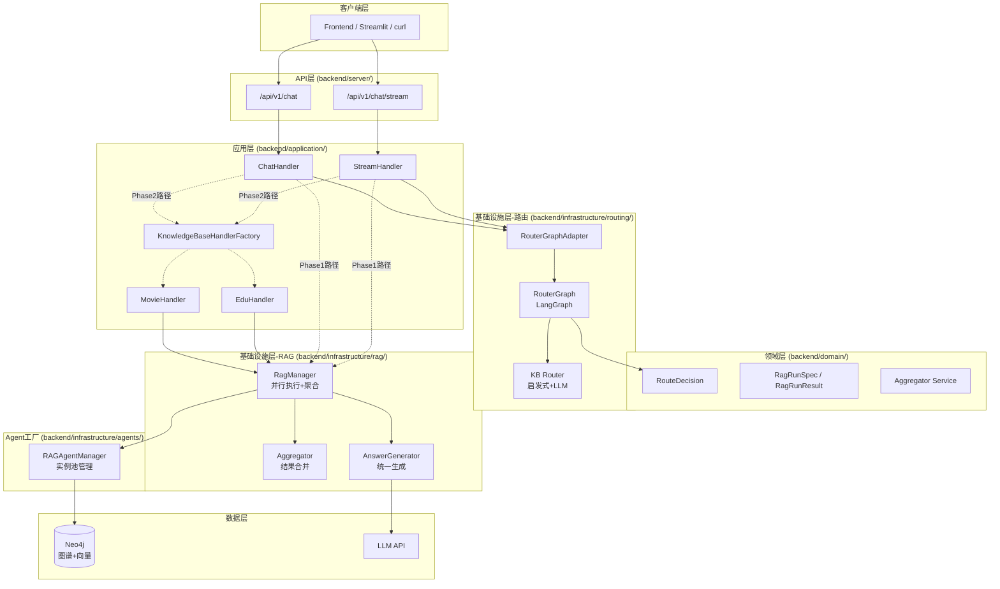

# LangGraph Router-Worker 实施进度

> **文档版本**: v1.0
> **更新日期**: 2025-01-19
> **文档性质**: 已落地功能 + 实施进度跟踪

---

## 📋 目录

### 第一部分: 已落地功能
- [1. 重构概览](#1-重构概览)
- [2. 已落地的架构](#2-已落地的架构)
- [3. 核心组件实现状态](#3-核心组件实现状态)

### 第二部分: 实施路线图
- [4. 近期任务](#4-近期任务)
- [5. 中期目标](#5-中期目标)
- [6. 长期规划](#6-长期规划)

### 第三部分: 技术债务
- [7. 已知问题](#7-已知问题)
- [8. 优化方向](#8-优化方向)

---

# 第一部分: 已落地功能

## 1. 重构概览

### 1.1 重构阶段划分



**图例说明**:
- 🟢 绿色: 已完全落地
- 🟡 黄色: 部分完成
- 🟣 粉色: 规划中
- ⚪ 灰色: 未开始

### 1.2 当前进度总览

| 阶段 | 状态 | 完成度 | 核心交付物 |
|------|------|--------|-----------|
| **Phase 0** | ✅ 已完成 | 100% | KB自动路由、意图识别 |
| **Phase 1** | ✅ 已完成 | 100% | RouterGraph、WorkerRegistry |
| **Phase 2** | 🟡 部分完成 | 90% | KnowledgeBaseHandler、RagManager、聚合器 |
| **Phase 2.5** | 🟡 部分完成 | 30% | graphrag_agent 服务化收敛 |
| **Phase 3** | ⚪ 未开始 | 0% | 全链路LangGraph Streaming |

---

## 2. 已落地的架构

### 2.1 整体架构图



### 2.2 分层职责

| 层级 | 模块 | 职责 | 主要内容 |
|------|------|------|---------|
| **API层** | `backend/server/api/rest/v1/` | HTTP协议适配 | SSE封装、参数验证 |
| **应用层** | `backend/application/chat/handlers/` | 会话编排 | 路由 + RAG执行协调 |
| **应用层** | `backend/application/handlers/` | 业务编排 | KB级别的fanout/聚合规则 |
| **领域层** | `backend/domain/chat/entities/` | 领域实体 | RouteDecision、RagRunSpec/Result |
| **领域层** | `backend/domain/chat/services/` | 领域服务 | 聚合器领域逻辑 |
| **基础设施层-路由** | `backend/infrastructure/routing/` | 路由决策 | RouterGraph、KB Router |
| **基础设施层-RAG** | `backend/infrastructure/rag/` | RAG执行 | RagManager、并行、聚合、生成 |
| **Agent工厂** | `backend/infrastructure/agents/` | Agent管理 | 实例池、生命周期 |

---

## 3. 核心组件实现状态

### 3.1 RouterGraph (✅ 已完成)

**位置**: `backend/infrastructure/routing/orchestrator/router_graph.py`

**状态**: 完全实现并已投入使用

**功能**:
- ✅ 使用LangGraph实现的三阶段路由流程
- ✅ 意图检测节点 (intent_detect)
- ✅ 覆盖策略节点 (apply_override_policy)
- ✅ Worker选择节点 (worker_select)

**配置项**:
- ✅ `KB_AUTO_ROUTE` (是否启用自动路由)
- ✅ `KB_AUTO_ROUTE_OVERRIDE` (是否允许覆盖用户选择)
- ✅ `KB_AUTO_ROUTE_MIN_CONFIDENCE` (覆盖的最低置信度)

### 3.2 KB Router (✅ 已完成)

**位置**: `backend/infrastructure/routing/kb_router/`

**状态**: 完全实现并已投入使用

**功能**:
- ✅ 启发式路由 (零成本，关键词匹配)
- ✅ LLM兜底路由 (当启发式失败时)
- ✅ 降级策略 (LLM失败时使用默认值)

**已支持的知识库**:
- ✅ movie (电影知识库)
- ✅ edu (教务知识库)
- ✅ general (通用知识库)

### 3.3 RagManager (✅ 已完成)

**位置**: `backend/infrastructure/rag/rag_manager.py`

**状态**: 完全实现并已投入使用

**功能**:
- ✅ 并行执行多个RagRunSpec
- ✅ 超时控制 (per-spec配置)
- ✅ 错误隔离 (单个Agent失败不影响其他)
- ✅ 统一答案生成 (避免重复生成)

### 3.4 Aggregator (✅ 已完成)

**位置**:
- 实现层: `backend/infrastructure/rag/aggregator.py`
- 领域层: `backend/domain/chat/services/rag_aggregator.py`

**状态**: 完全实现并已投入使用

**功能**:
- ✅ source_id + granularity 去重
- ✅ 按 score 排序输出
- ✅ 合并 reference 去重
- ✅ 低质量回答时 synthesize 兜底 (可配置)

### 3.5 KnowledgeBaseHandler (✅ 已完成)

**位置**: `backend/application/handlers/`

**状态**: 完全实现并已投入使用

**已实现**:
- ✅ 基类接口定义 (`base.py`)
- ✅ MovieHandler (`movie/handler.py`)
- ✅ EduHandler (`edu/handler.py`)
- ✅ Factory模式 (`factory.py`)

**功能**:
- ✅ 按KB实现业务编排逻辑
- ✅ build_plan() 方法决定是否fanout
- ✅ 预处理/后处理钩子

### 3.6 RAGAgentManager (✅ 已完成)

**位置**: `backend/infrastructure/agents/rag_factory/manager.py`

**状态**: 完全实现并已投入使用

**功能**:
- ✅ Agent实例池管理
- ✅ 实例缓存: `{agent_type}:{kb_prefix}:{session_id}`
- ✅ 生命周期管理

### 3.7 StreamHandler & ChatHandler (✅ 已完成)

**位置**:
- `backend/application/chat/handlers/stream_handler.py`
- `backend/application/chat/handlers/chat_handler.py`

**状态**: 完全实现并已投入使用

**功能**:
- ✅ 统一的流式和非流式处理入口
- ✅ 路由调用
- ✅ RAG执行协调
- ✅ SSE事件输出

---

# 第二部分: 实施路线图

## 4. 近期任务

### 4.1 Phase 2 收尾 (预计1-2周)

#### Task 1: Phase 2 充分测试

**状态**: 🟡 进行中

**测试清单**:
- [x] 单元测试：聚合器/去重/排序/兜底
- [x] 单元测试：retrieve_only 调用链路
- [x] 单元测试：fanout + 超时降级 + 失败隔离
- [x] 端到端：`/api/v1/chat` (movie/edu/general 三条路径)
- [x] 端到端：`/api/v1/chat/stream` SSE
- [x] 多策略 fanout (2-3个Agent) + 聚合稳定性
- [x] 超时降级 (单Agent超时不影响整体返回)
- [x] 错误隔离 (单Agent失败不影响整体返回)
- [x] KB隔离测试 (worker_name/kb_prefix 不串库)
- [x] 性能采样脚本 (测编排开销)

**验收标准**:
- 所有单元测试通过
- 端到端测试覆盖 movie/edu/general 三条路径
- 性能测试显示无显著退化

#### Task 2: 聚合器智能去重优化

**状态**: ✅ 已完成

**已实现**:
- ✅ source_id + granularity 去重
- ✅ 按 score 排序输出
- ✅ 低质量回答时 synthesize 兜底

**下一步**: 持续打磨阈值/证据选取策略 (配置项已接入)

### 4.2 Tool retrieve_only 补全

**状态**: 🟡 部分完成

**已完成**:
- [x] LocalSearchTool.retrieve_only()
- [x] GlobalSearchTool.retrieve_only()
- [x] HybridSearchTool.retrieve_only()
- [x] DeepResearchTool.retrieve_only()
- [x] DeeperResearchTool.retrieve_only()
- [x] ChainExplorationTool.retrieve_only()
- [x] HypothesisGeneratorTool.retrieve_only()
- [x] AnswerValidationTool.retrieve_only()

**验收标准**:
- 所有工具提供 retrieve_only 兼容接口
- 检索型工具返回 context/retrieval_results
- 非检索型工具返回结构化结果

---

## 5. 中期目标

### 5.1 Phase 2.5: graphrag_agent 服务化收敛

**目标**: 将 `backend/graphrag_agent/` 收敛为独立的 RAG Core，可作为独立服务部署

**核心原则**:
- graphrag_agent 是纯算法核心库，不依赖 FastAPI/Neo4j/Redis/环境配置
- 所有外部依赖 (LLM/DB/Config) 通过 Port 接口注入
- 可独立安装为 Python 包 (`pip install graphrag-agent`)
- 可作为独立微服务部署 (HTTP API)

**预计工作量**: 3-4周

#### Week 1: 配置与缓存解耦

**任务**:
- [ ] 在 `backend/graphrag_agent/` 下创建 `ports/` 目录
- [ ] 定义 `CachePort` 接口
- [x] 移除检索侧缓存系统（不再保留相关目录/接口）
- [ ] 修改 `BaseAgent` 构造函数，缓存通过参数注入
- [ ] graphrag_agent 内部只保留算法默认值 (不读取环境变量)

#### Week 2: 模型客户端端口化

**任务**:
- [ ] 定义 `LLMPort` 和 `EmbeddingPort` 接口
- [ ] 将 `backend/graphrag_agent/models/` 移动到 `backend/infrastructure/models/`
- [ ] 在 `backend/infrastructure/models/` 实现端口
- [ ] 修改 `BaseAgent` 构造函数，模型客户端通过参数注入
- [ ] 修改 Agent/Tool 中所有直接导入 `get_models()` 的地方

#### Week 3: Neo4j 连接解耦

**任务**:
- [ ] 定义 `GraphDatabasePort` 接口
- [ ] 在 `backend/infrastructure/persistence/` 实现端口
- [ ] 修改所有 SearchTool 构造函数，数据库连接通过参数注入
- [x] 完成 build/eval 工具层迁移 (已完成)
- [x] 删除 `backend/graphrag_agent/evaluation/` (已完成)

#### Week 4: 独立性验证与文档更新

**任务**:
- [ ] 为 `backend/graphrag_agent/` 编写 `setup.py` 或 `pyproject.toml`
- [ ] 独立安装测试
- [ ] 编写依赖注入示例代码
- [ ] 更新 README.md
- [ ] 编写单元测试示例 (使用 Mock 实现 Port)

### 5.2 性能优化

#### 优化1: 路由缓存

**状态**: ❌ 未开始

**目标**: 相似问题复用路由决策

**实现**:
```python
# backend/infrastructure/routing/orchestrator/router_cache.py

from functools import lru_cache
import hashlib

@lru_cache(maxsize=1000)
def route_with_cache(query_hash: str, requested_kb: str) -> RouteDecision:
    """缓存路由决策"""
    ...
```

**预期收益**: 减少 LLM 调用，降低路由延迟

#### 优化2: 并行执行优化

**状态**: 🟡 部分完成

**已完成**:
- ✅ 超时控制 (per-spec配置)
- ✅ 错误隔离

**待优化**:
- [ ] Early-stop: 第一个成功即可返回 (可选模式)
- [ ] Agent预热: 连接池预初始化

---

## 6. 长期规划

### 6.1 Phase 3: 全链路 Streaming (可选)

**目标**: 统一流式事件模型，全链路 LangGraph streaming

**说明**: 当前流式已足够可用 (检索完成 → 单次 token streaming)，配合 progress 事件增强体验

**明确不做**:
- ❌ 不做"边检索边生成/多流交错/增量上下文"
- ❌ 不引入"LangGraph 事件流"作为对外 SSE 协议

**原因**:
- 多路检索场景下，增量上下文会引入引用一致性与答案反复修正问题
- 复杂度/维护成本高
- 当前方案足够可用

### 6.2 可观测性增强

#### Trace ID传递

**目标**: 全链路 trace_id

**实现**:
```python
RouteDecision
  → trace_id: "req_123456"
    → RagRunSpec.trace_id
      → Agent.retrieve_with_trace(trace_id)
        → Neo4j查询日志带trace_id
```

#### Metrics埋点

**关键指标**:
- 路由层: router_latency_ms, router_confidence_distribution, router_override_rate
- RAG层: rag_fanout_count, rag_parallel_latency_p50/p95/p99, rag_aggregation_latency_ms
- Agent层: agent_retrieve_latency_ms, agent_error_rate, agent_cache_hit_rate

---

# 第三部分: 技术债务

## 7. 已知问题

### 7.1 高优先级

#### 问题1: DeepResearchAgent 拆分

**状态**: 🟡 部分完成

**当前**: 已支持 retrieve_only，仍有链路可简化

**目标**: 彻底拆分检索/生成路径，减少多余初始化

**影响文件**: `backend/graphrag_agent/agents/deep_research_agent.py`

#### 问题2: FusionAgent 报告生成禁用

**状态**: ✅ 已完成

**已实现**:
- ✅ retrieve_only 模式已禁用报告生成 (auto_generate_report=False)
- ✅ retrieve_only 下避免初始化/触发研究与反思执行器
- ✅ retrieve_only 下 ask/ask_stream 禁止直接生成答案

**验收**: retrieve_only 不会在 agent 内生成最终答案/报告 (由 RAG 执行层统一生成)

### 7.2 中优先级

#### 问题3: 路由结果缓存

**状态**: ❌ 未开始

**当前**: 每次都重新路由

**目标**: 相似问题复用路由决策

**实现文件**: `backend/infrastructure/routing/orchestrator/router_cache.py` (待创建)

#### 问题4: 插件化编排

**状态**: ❌ 未开始

**目标**: 业务规则配置化

**示例**:
```yaml
# backend/config/kb_strategies.yaml
movie:
  fanout_triggers:
    - keywords: ["推荐", "对比", "Top"]
      plan:
        - agent: hybrid_agent
          timeout: 25
        - agent: graph_agent
          timeout: 25
  aggregation: "synthesize"
```

### 7.3 低优先级

#### 问题5: 流式LLM接口改造

**状态**: ❌ 未开始

**当前**: `generate_answer()` 是 blocking

**目标**: 改为 `generate_answer_stream()`

**影响文件**: `backend/infrastructure/rag/answer_generator.py`

---

## 8. 优化方向

### 8.1 性能优化

#### 优化1: 启发式路由优化

**当前性能**:
- 启发式命中: ~5ms
- LLM兜底: ~500ms

**优化方向**:
1. 关键词树优化: Aho-Corasick算法 (批量匹配)
2. 路由缓存: 相似问题复用 (MD5 hash)
3. 预热: 启动时预编译正则表达式

#### 优化2: Agent预热

**当前**: 每次请求时初始化Agent

**优化**: 启动时预初始化连接池

**预期收益**: 减少首请求延迟

### 8.2 架构演进

#### 演进1: Agent注册表

**目标**: 动态注册Agent

**示例**:
```python
# backend/infrastructure/agents/registry.py

class AgentRegistry:
    def register(self, agent_class, capabilities):
        """注册新Agent及其能力"""
        pass

    def recommend_agents(self, query_features):
        """根据查询特征推荐最佳Agent组合"""
        pass
```

#### 演进2: 知识库动态加载

**目标**: 运行时动态添加知识库

**实现**:
- 知识库元数据注册
- 向量索引自动创建
- Handler 自动发现

---

## 附录

### A. 术语对照表

| 术语 | 说明 | 示例 |
|------|------|------|
| **kb_prefix** | 知识库前缀，用于数据隔离 | movie / edu |
| **worker_name** | Worker标识，格式`{kb_prefix}:{agent_type}` | movie:hybrid_agent |
| **agent_type** | Agent类型 | hybrid_agent / graph_agent |
| **agent_mode** | Agent运行模式 | legacy / retrieve_only |
| **RagRunSpec** | RAG执行规格(输入) | {agent_type, timeout_s} |
| **RagRunResult** | RAG执行结果(输出) | {context, retrieval_results, reference} |
| **fanout** | 并行执行多个策略 | [Spec1, Spec2, Spec3] |
| **aggregation** | 结果聚合 | concat / synthesize |

### B. 关键配置速查

```bash
# .env

# KB路由
KB_AUTO_ROUTE=True
KB_AUTO_ROUTE_OVERRIDE=True
KB_AUTO_ROUTE_MIN_CONFIDENCE=0.7

# Phase2开关
PHASE2_ENABLE_KB_HANDLERS=True  # 默认启用；如需降级可临时关闭

# 超时控制
RAG_ANSWER_TIMEOUT_S=30.0

# 数据库
NEO4J_URI=neo4j://localhost:7687
OPENAI_API_KEY=sk-xxx
```

### C. 参考资源

- [LangGraph 官方文档](https://langchain-ai.github.io/langgraph/)
- [项目 README](../../../readme.md)
- [CLAUDE.md - 项目指导](../../../CLAUDE.md)
- [架构说明文档](./LangGraph-Router-Worker架构说明.md)

---

**文档结束** | 更新日期: 2025-01-19 | 版本: v1.0
