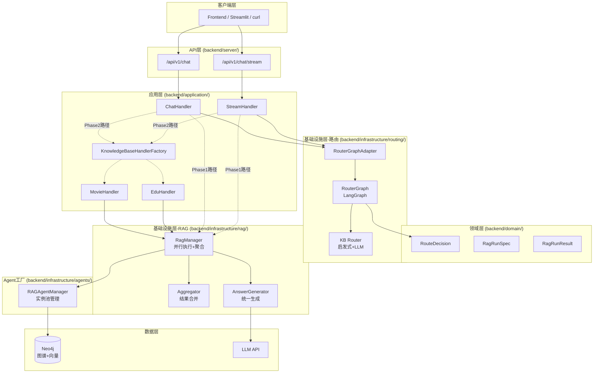
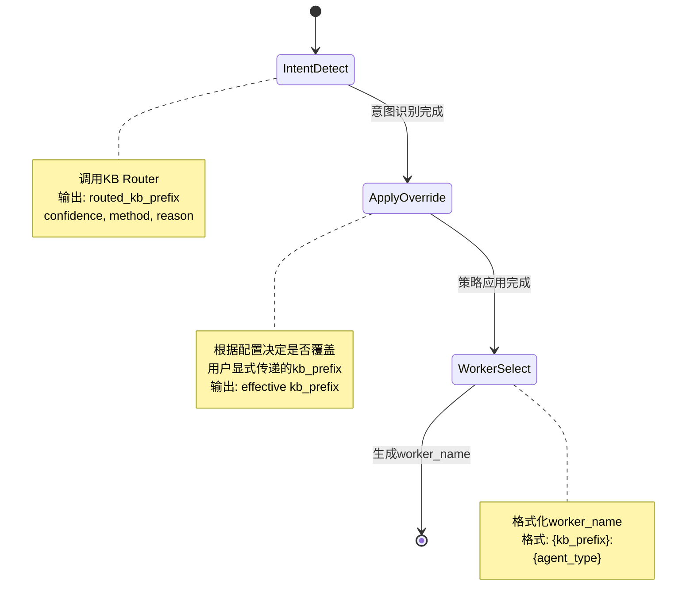
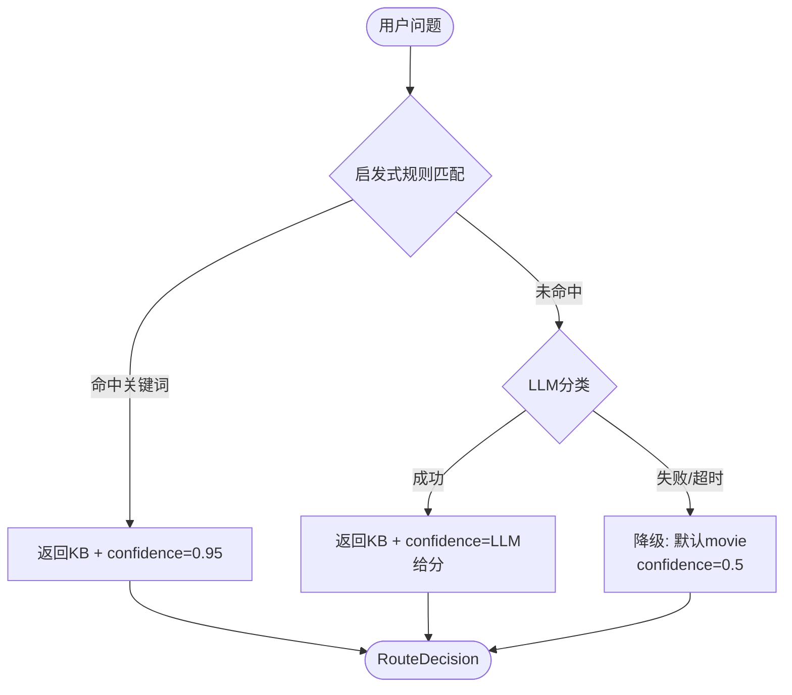
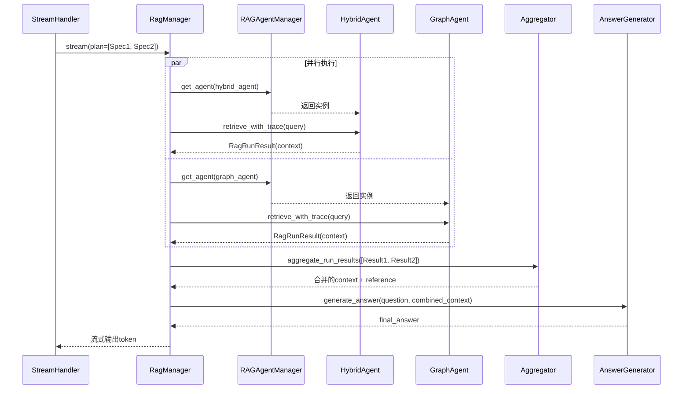
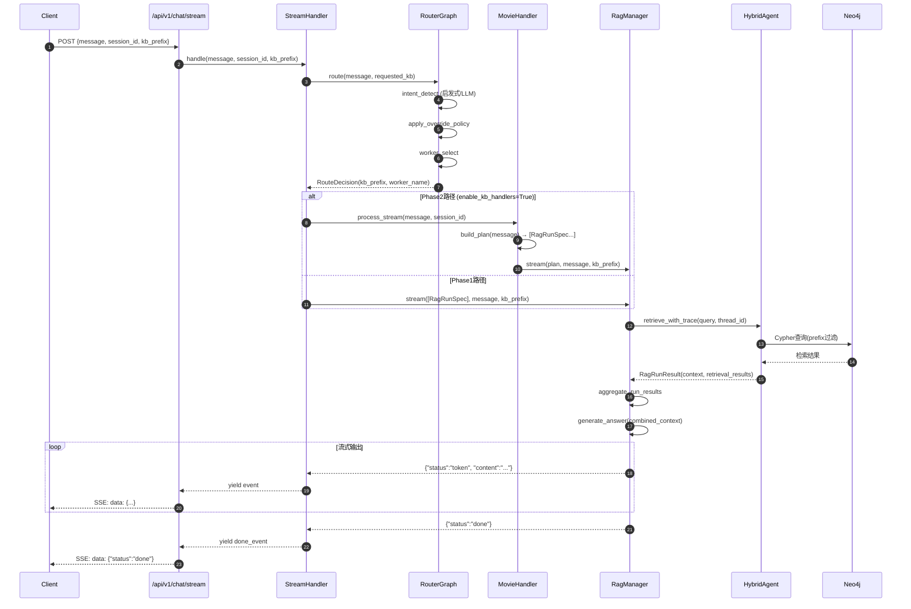
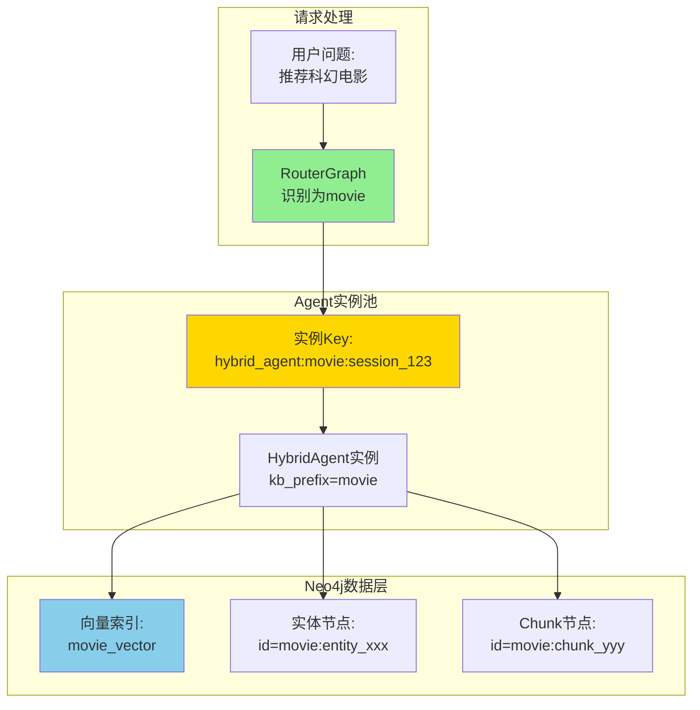

# LangGraph Router-Worker 架构说明

> **文档版本**: v1.0
> **更新日期**: 2025-01-19
> **目标读者**: 架构师、后端开发人员、全栈开发人员
> **文档性质**: 架构说明与实施指南

---

## 📋 目录

- [1. 架构概览](#1-架构概览)
- [2. 分层架构](#2-分层架构)
- [3. 核心组件](#3-核心组件)
- [4. 数据流转](#4-数据流转)
- [5. KB隔离机制](#5-kb隔离机制)
- [6. 配置管理](#6-配置管理)
- [7. 实施指南](#7-实施指南)
- [8. 附录](#8-附录)

---

## 1. 架构概览

### 1.1 设计目标

本架构旨在实现以下核心目标：

1. **单入口自动路由**: 同一个 FastAPI 实例，根据用户问题自动选择知识库（movie/edu），避免跨库数据串联
2. **编排可观测**: 路由决策、策略执行、聚合过程全程可追踪
3. **业务隔离**: 通过 `kb_prefix` 实现知识库级别的数据隔离
4. **架构分层**: 路由层、业务编排层、RAG执行层、检索层四层架构
5. **可扩展性**: 支持新增知识库、新增Agent类型、新增编排策略

### 1.2 整体架构图



---

## 2. 分层架构

### 2.1 四层架构说明

```
┌─────────────────────────────────────────────────────┐
│  API层 (backend/server/api/rest/v1/)                 │
│  职责: HTTP协议适配、SSE封装、参数验证               │
└─────────────────────────────────────────────────────┘
                          ↓
┌─────────────────────────────────────────────────────┐
│  应用层 (backend/application/)                       │
│  - chat/handlers: 会话编排、路由调用、执行协调        │
│  - handlers: KB级别的业务策略(fanout/聚合规则)       │
│  - ports: 端口接口定义(RouterPort/RAGExecutorPort)   │
└─────────────────────────────────────────────────────┘
                          ↓
┌─────────────────────────────────────────────────────┐
│  领域层 (backend/domain/)                            │
│  - chat/entities: 路由决策、RAG运行规范等核心实体    │
│  - chat/services: 领域服务(如聚合器)                 │
│  - knowledge_bases: KB领域规则                       │
└─────────────────────────────────────────────────────┘
                          ↓
┌─────────────────────────────────────────────────────┐
│  基础设施层 (backend/infrastructure/)                │
│  - routing/: 路由实现(RouterGraph、KB Router)        │
│  - rag/: RAG执行层(RagManager、聚合、生成)           │
│  - agents/: Agent工厂与生命周期管理                  │
│  - config/: 配置管理                                 │
└─────────────────────────────────────────────────────┘
                          ↓
┌─────────────────────────────────────────────────────┐
│  数据层 (Neo4j + Vector Indexes)                     │
│  - 实体/关系/Chunk节点按kb_prefix前缀隔离             │
│  - 向量索引命名: ${kb_prefix}_vector                 │
└─────────────────────────────────────────────────────┘
```

### 2.2 目录结构

```
graph-rag-agent/
├── backend/
│   ├── application/              # 应用层
│   │   ├── chat/                 # 聊天应用服务
│   │   │   └── handlers/         # StreamHandler, ChatHandler
│   │   ├── handlers/             # KB专用处理器
│   │   │   ├── base.py           # 基类
│   │   │   ├── factory.py        # 工厂
│   │   │   ├── movie/            # Movie知识库处理器
│   │   │   └── edu/              # Edu知识库处理器
│   │   ├── knowledge_graph/      # 知识图谱应用服务
│   │   └── ports/                # 端口接口定义
│   │       ├── router_port.py
│   │       └── rag_executor_port.py
│   │
│   ├── domain/                   # 领域层
│   │   ├── chat/
│   │   │   ├── entities/         # 领域实体
│   │   │   │   ├── route_decision.py
│   │   │   │   └── rag_run.py
│   │   │   └── services/         # 领域服务
│   │   │       └── rag_aggregator.py
│   │   └── knowledge_bases/      # KB领域规则
│   │
│   ├── infrastructure/           # 基础设施层
│   │   ├── routing/              # 路由系统
│   │   │   ├── orchestrator/      # RouterGraph
│   │   │   │   ├── router_graph.py
│   │   │   │   └── state.py
│   │   │   └── kb_router/         # KB路由
│   │   │       ├── router.py
│   │   │       ├── heuristics.py
│   │   │       └── types.py
│   │   ├── rag/                  # RAG执行层
│   │   │   ├── rag_manager.py
│   │   │   ├── aggregator.py
│   │   │   ├── answer_generator.py
│   │   │   └── specs.py
│   │   ├── agents/               # Agent工厂
│   │   │   └── rag_factory/
│   │   │       ├── manager.py
│   │   │       └── factory.py
│   │   ├── config/               # 配置管理
│   │   ├── streaming/            # 流式处理
│   │   └── persistence/          # 会话/反馈持久化
│   │
│   ├── config/                   # 服务器配置
│   │   └── settings.py
│   │
│   └── server/                   # FastAPI服务器
│       ├── api/
│       │   └── rest/v1/          # API端点
│       │       ├── chat.py
│       │       └── chat_stream.py
│       └── main.py
│
├── frontend/                     # Streamlit前端
├── .env.example                  # 环境变量示例
└── README.md
```

---

## 3. 核心组件

### 3.1 RouterGraph (路由层)

**位置**: `backend/infrastructure/routing/orchestrator/router_graph.py`

**功能**: 使用LangGraph实现的三阶段路由决策流程



**关键节点**:

1. **intent_detect**: 调用KB Router识别知识库
2. **apply_override_policy**: 应用覆盖策略
3. **worker_select**: 生成worker_name

**配置项**:

| 配置项 | 说明 | 默认值 | 位置 |
|--------|------|--------|------|
| `KB_AUTO_ROUTE` | 是否启用自动路由 | True | `backend/infrastructure/config/settings.py` |
| `KB_AUTO_ROUTE_OVERRIDE` | 是否允许覆盖用户选择 | True | 同上 |
| `KB_AUTO_ROUTE_MIN_CONFIDENCE` | 覆盖的最低置信度 | 0.7 | 同上 |

### 3.2 KB Router (路由算法)

**位置**: `backend/infrastructure/routing/kb_router/`

**功能**: 两级路由策略 - 启发式优先，LLM兜底



**启发式规则** (零成本):

```python
# backend/infrastructure/routing/kb_router/heuristics.py

EDU_KEYWORDS = [
    "学生", "学籍", "退学", "旷课", "学分", "奖学金",
    "处分", "申诉", "学校", "规定", "管理", "评选"
]

MOVIE_KEYWORDS = [
    "电影", "导演", "演员", "主演", "配角", "票房",
    "剧情", "推荐", "影评", "片名"
]
```

### 3.3 RagManager (RAG执行层)

**位置**: `backend/infrastructure/rag/rag_manager.py`

**功能**:
1. 并行执行多个RagRunSpec
2. 调用Agent的检索接口
3. 聚合检索结果
4. 统一生成最终答案

**执行流程**:



**关键特性**:
- ✅ 支持超时控制 (per-spec配置)
- ✅ 错误隔离 (单个Agent失败不影响其他)
- ✅ 统一答案生成 (避免重复生成)

### 3.4 KnowledgeBaseHandler (业务编排层)

**位置**: `backend/application/handlers/`

**功能**: 按KB实现业务编排逻辑

**已实现**:
- ✅ 基类接口定义 (`base.py`)
- ✅ MovieHandler (`movie/handler.py`)
- ✅ EduHandler (`edu/handler.py`)
- ✅ Factory模式 (`factory.py`)

**MovieHandler 的 fanout 策略**:

```python
# backend/application/handlers/movie/handler.py

def build_plan(self, *, message: str, agent_type: str) -> list[RagRunSpec]:
    """根据问题类型决定是否fanout"""

    # 推荐/对比/列表类问题 → 多策略并行
    if any(k in message for k in ["推荐", "对比", "有哪些", "Top", "总结"]):
        return [
            RagRunSpec(agent_type="hybrid_agent", timeout_s=25.0),
            RagRunSpec(agent_type="graph_agent", timeout_s=25.0),
            RagRunSpec(agent_type="naive_rag_agent", timeout_s=25.0),
        ]

    # 单一事实查询 → 单策略
    return [RagRunSpec(agent_type=agent_type, timeout_s=30.0)]
```

### 3.5 RAGAgentManager (Agent工厂)

**位置**: `backend/infrastructure/agents/rag_factory/manager.py`

**功能**:
- Agent实例池管理
- 实例缓存: `{agent_type}:{kb_prefix}:{session_id}`
- 生命周期管理

**使用示例**:

```python
from infrastructure.agents.rag_factory.manager import rag_agent_manager

agent = rag_agent_manager.get_agent(
    agent_type="hybrid_agent",
    session_id="user_123",
    kb_prefix="movie",
    agent_mode="retrieve_only"
)
```

---

## 4. 数据流转

### 4.1 完整请求流程



### 4.2 核心数据结构

#### RouteDecision (路由决策)

```python
# backend/domain/chat/entities/route_decision.py

@dataclass
class RouteDecision:
    """路由决策结果"""
    requested_kb_prefix: str      # 用户请求的KB
    routed_kb_prefix: str          # 路由算法推荐的KB
    kb_prefix: str                 # 最终生效的KB (考虑覆盖策略)
    confidence: float              # 路由置信度 0.0-1.0
    method: str                    # 路由方法: heuristic/llm/fallback
    reason: str                    # 路由原因
    worker_name: str               # Worker标识 格式: {kb_prefix}:{agent_type}
```

#### RagRunSpec (RAG执行规格)

```python
# backend/infrastructure/rag/specs.py
# backend/domain/chat/entities/rag_run.py

@dataclass(frozen=True)
class RagRunSpec:
    """单次RAG执行规格"""
    agent_type: str                # Agent类型: hybrid_agent/graph_agent等
    timeout_s: float = 30.0        # 超时时间(秒)
```

#### RagRunResult (RAG执行结果)

```python
# backend/infrastructure/rag/specs.py
# backend/domain/chat/entities/rag_run.py

@dataclass(frozen=True)
class RagRunResult:
    """单次RAG执行结果"""
    agent_type: str                     # 执行的Agent类型
    answer: str                         # 生成的答案
    context: Optional[str] = None       # 检索的上下文
    reference: Optional[dict] = None    # 引用信息 (chunks/entities/relationships)
    retrieval_results: Optional[list] = None  # 检索结果详情
    execution_log: Optional[list] = None      # 执行日志
    error: Optional[str] = None         # 错误信息
```

---

## 5. KB隔离机制

### 5.1 隔离策略



**关键约束**:

1. **Agent实例池**:
   ```python
   cache_key = f"{agent_type}:{kb_prefix}:{session_id}"
   # 例: hybrid_agent:movie:session_123
   ```

2. **Neo4j节点ID**:
   ```cypher
   // 实体节点
   CREATE (:__Entity__ {id: "movie:entity_银翼杀手", ...})
   CREATE (:__Entity__ {id: "edu:entity_奖学金", ...})

   // Chunk节点
   CREATE (:__Chunk__ {id: "movie:chunk_001", ...})
   ```

3. **向量索引命名**:
   ```python
   entity_index = f"{kb_prefix}_vector"      # movie_vector / edu_vector
   chunk_index = f"{kb_prefix}_chunk_vector" # movie_chunk_vector
   ```

4. **Cypher查询过滤**:
   ```cypher
   MATCH (e:__Entity__)
   WHERE e.id STARTS WITH $kb_prefix + ":"  // 强制前缀过滤
   RETURN e
   ```

### 5.2 验证清单

部署前检查KB隔离:

```python
def verify_kb_isolation():
    """
    部署前检查KB隔离（示意）。

    关键点：
    - 数据层：Neo4j 中同一类节点（__Entity__/__Chunk__/__Community__）的 id 必须以 `${kb_prefix}:` 开头
    - 检索层：SearchTool 必须使用 `${kb_prefix}_vector` / `${kb_prefix}_chunk_vector`，并在 Cypher 中带前缀过滤
    """

    from backend.infrastructure.routing.kb_router.heuristics import KBPrefix

    for kb_prefix in KBPrefix.__args__:  # ("movie", "edu", "general")
        # 检查向量索引命名
        # 检查 Cypher 查询是否带前缀过滤
        # 检查 Agent 实例池 key 是否包含 kb_prefix
        pass
```

---

## 6. 配置管理

### 6.1 配置文件位置

| 配置文件 | 路径 | 用途 |
|---------|------|------|
| 环境变量示例 | `.env.example` | API密钥、连接串、性能参数 |
| 基础设施配置 | `backend/infrastructure/config/settings.py` | KB路由、RAG执行配置 |
| 服务器配置 | `backend/config/settings.py` | FastAPI、CORS等配置 |

### 6.2 关键配置项

```bash
# .env

# KB路由
KB_AUTO_ROUTE=True                    # 启用自动路由
KB_AUTO_ROUTE_OVERRIDE=True           # 允许覆盖用户选择
KB_AUTO_ROUTE_MIN_CONFIDENCE=0.7      # 覆盖的最低置信度

# Phase2开关
PHASE2_ENABLE_KB_HANDLERS=True        # 是否启用Phase2路径 (默认启用)

# RAG执行
RAG_ANSWER_TIMEOUT_S=30.0             # 答案生成超时

# 数据库
NEO4J_URI=neo4j://localhost:7687
NEO4J_USERNAME=neo4j
NEO4J_PASSWORD=12345678

# LLM
OPENAI_API_KEY=sk-xxx
OPENAI_BASE_URL=http://localhost:13000/v1
OPENAI_LLM_MODEL=gpt-4o
OPENAI_EMBEDDINGS_MODEL=text-embedding-3-large
```

### 6.3 读取配置

```python
# backend/infrastructure/config/settings.py

from pydantic_settings import BaseSettings

class Settings(BaseSettings):
    # KB路由
    KB_AUTO_ROUTE: bool = True
    KB_AUTO_ROUTE_OVERRIDE: bool = True
    KB_AUTO_ROUTE_MIN_CONFIDENCE: float = 0.7

    # Phase2
    PHASE2_ENABLE_KB_HANDLERS: bool = True

    # RAG执行
    RAG_ANSWER_TIMEOUT_S: float = 30.0

    class Config:
        env_file = ".env"

settings = Settings()
```

---

## 7. 实施指南

### 7.1 添加新的知识库

#### 步骤1: 定义KB前缀

```python
# backend/domain/chat/entities/route_decision.py

from typing import Literal

KBPrefix = Literal["movie", "edu", "general", "new_kb"]  # 添加新KB
```

#### 步骤2: 添加启发式规则

```python
# backend/infrastructure/routing/kb_router/heuristics.py

NEW_KB_KEYWORDS = [
    "关键词1", "关键词2", "关键词3"
]
```

#### 步骤3: 创建KnowledgeBaseHandler

```python
# backend/application/handlers/new_kb/handler.py

from application.handlers.base import KnowledgeBaseHandler
from domain.chat.entities.rag_run import RagRunSpec

class NewKBHandler(KnowledgeBaseHandler):
    name = "new_kb"
    kb_prefix = "new_kb"

    def build_plan(self, *, message: str, agent_type: str) -> list[RagRunSpec]:
        # 实现业务规则
        return [RagRunSpec(agent_type=agent_type, timeout_s=30.0)]
```

#### 步骤4: 注册到Factory

```python
# backend/application/handlers/factory.py

class KnowledgeBaseHandlerFactory:
    _handlers = {
        "movie": MovieHandler,
        "edu": EduHandler,
        "new_kb": NewKBHandler,  # 添加新KB
    }
```

#### 步骤5: 构建知识图谱

```bash
# 确保Neo4j中的节点ID使用正确的前缀
# new_kb:entity_xxx
# new_kb:chunk_yyy

# 创建向量索引
# new_kb_vector
# new_kb_chunk_vector
```

### 7.2 添加新的Agent类型

#### 步骤1: 实现Agent

```python
# backend/infrastructure/agents/custom_agent.py

from backend.graphrag_agent.agents.base import BaseAgent

class CustomAgent(BaseAgent):
    def _setup_tools(self):
        # 返回工具列表
        return [...]
```

#### 步骤2: 注册到Factory

```python
# backend/infrastructure/agents/rag_factory/factory.py

class RAGAgentFactory:
    _agent_classes = {
        "hybrid_agent": HybridAgent,
        "graph_agent": GraphAgent,
        "custom_agent": CustomAgent,  # 添加新Agent
    }
```

### 7.3 测试

#### 手工测试 (curl)

```bash
# 测试自动路由 (edu)
curl -X POST http://localhost:8000/api/v1/chat/stream \
  -H "Content-Type: application/json" \
  -d '{
    "message": "旷课多少学时会被退学？",
    "session_id": "test_session",
    "debug": true,
    "agent_type": "hybrid_agent"
  }'

# 测试自动路由 (movie)
curl -X POST http://localhost:8000/api/v1/chat/stream \
  -H "Content-Type: application/json" \
  -d '{
    "message": "推荐一些科幻电影",
    "session_id": "test_session",
    "debug": true,
    "agent_type": "hybrid_agent"
  }'

# 测试覆盖策略
curl -X POST http://localhost:8000/api/v1/chat/stream \
  -H "Content-Type: application/json" \
  -d '{
    "message": "旷课多少学时会被退学？",
    "kb_prefix": "movie",
    "session_id": "test_session",
    "debug": true,
    "agent_type": "hybrid_agent"
  }'
```

#### 单元测试

```python
# test/test_router_graph.py

import unittest
from infrastructure.routing.orchestrator.router_graph import invoke_router_graph

class TestRouterGraph(unittest.TestCase):
    def test_heuristic_routes_to_edu(self):
        decision = invoke_router_graph(
            message="旷课多少学时会被退学？",
            session_id="t",
            agent_type="hybrid_agent",
            requested_kb_prefix="",
        )
        self.assertEqual(decision.kb_prefix, "edu")

    def test_heuristic_routes_to_movie(self):
        decision = invoke_router_graph(
            message="推荐一些科幻电影",
            session_id="t",
            agent_type="hybrid_agent",
            requested_kb_prefix="",
        )
        self.assertEqual(decision.kb_prefix, "movie")
```

---

## 8. 附录

### 8.1 术语对照表

| 术语 | 说明 | 示例 |
|------|------|------|
| **kb_prefix** | 知识库前缀，用于数据隔离 | movie / edu |
| **worker_name** | Worker标识，格式`{kb_prefix}:{agent_type}` | movie:hybrid_agent |
| **agent_type** | Agent类型 | hybrid_agent / graph_agent |
| **agent_mode** | Agent运行模式 | legacy / retrieve_only |
| **RagRunSpec** | RAG执行规格(输入) | {agent_type, timeout_s} |
| **RagRunResult** | RAG执行结果(输出) | {context, retrieval_results, reference} |
| **fanout** | 并行执行多个策略 | [Spec1, Spec2, Spec3] |
| **aggregation** | 结果聚合 | concat / synthesize |

### 8.2 代码文件索引

| 功能模块 | 文件路径 |
|---------|---------|
| **RouterGraph** | `backend/infrastructure/routing/orchestrator/router_graph.py` |
| **路由状态** | `backend/infrastructure/routing/orchestrator/state.py` |
| **KB Router** | `backend/infrastructure/routing/kb_router/router.py` |
| **启发式规则** | `backend/infrastructure/routing/kb_router/heuristics.py` |
| **RouteDecision** | `backend/domain/chat/entities/route_decision.py` |
| **RagManager** | `backend/infrastructure/rag/rag_manager.py` |
| **Aggregator** | `backend/infrastructure/rag/aggregator.py` |
| **AnswerGenerator** | `backend/infrastructure/rag/answer_generator.py` |
| **RagRunSpec/Result** | `backend/domain/chat/entities/rag_run.py` |
| **KBHandler基类** | `backend/application/handlers/base.py` |
| **MovieHandler** | `backend/application/handlers/movie/handler.py` |
| **EduHandler** | `backend/application/handlers/edu/handler.py` |
| **KBHandler Factory** | `backend/application/handlers/factory.py` |
| **RAGAgentManager** | `backend/infrastructure/agents/rag_factory/manager.py` |
| **StreamHandler** | `backend/application/chat/handlers/stream_handler.py` |
| **ChatHandler** | `backend/application/chat/handlers/chat_handler.py` |
| **API端点(流式)** | `backend/server/api/rest/v1/chat_stream.py` |
| **API端点(非流式)** | `backend/server/api/rest/v1/chat.py` |
| **基础设施配置** | `backend/infrastructure/config/settings.py` |
| **服务器配置** | `backend/config/settings.py` |

### 8.3 常见问题

**Q1: Phase2路径为什么默认启用？**

A: Phase2路径（KnowledgeBaseHandler + RagManager）已经过充分测试，提供了更好的业务隔离和可扩展性。如需临时关闭，可设置 `PHASE2_ENABLE_KB_HANDLERS=False`。

**Q2: retrieve_only模式与legacy模式的区别？**

A:
- **retrieve_only**: Agent只产出检索结果(context/retrieval_results)，不生成答案，适合Phase2的统一生成模式
- **legacy**: Agent自己检索+生成答案，适合Phase1的单Agent模式

**Q3: 如何验证KB隔离是否生效？**

A: 检查以下几点:
1. Neo4j节点ID是否带正确前缀 (`movie:`/`edu:`)
2. 向量索引名称是否正确 (`movie_vector`/`edu_vector`)
3. Cypher查询是否包含 `WHERE id STARTS WITH $kb_prefix`
4. Agent实例池key是否包含kb_prefix

**Q4: fanout会导致成本翻倍吗？**

A:
- **检索成本**: 是的，3个Agent并行会发起3倍的Neo4j查询
- **LLM成本**: 不会，因为最终答案只生成一次 (在RagManager的AnswerGenerator)
- **优化**: 可以通过智能触发 (只对推荐/对比类问题fanout) 来控制成本

### 8.4 参考资源

- [LangGraph 官方文档](https://langchain-ai.github.io/langgraph/)
- [项目 README](../../../readme.md)
- [CLAUDE.md - 项目指导](../../../CLAUDE.md)
- [重构进度文档](./LangGraph-Router-Worker-重构进度.md)

---

**文档结束** | 更新日期: 2025-01-19 | 版本: v1.0
