# 数据流总览

---

## 📋 元信息

- **目标读者**：所有读者（开发者、架构师、产品经理）
- **阅读时间**：15分钟
- **难度**：⭐⭐
- **前置知识**：基础数据处理概念
- **最后更新**：2026-01-04

---

## 📖 本文大纲

- [完整数据流程图](#完整数据流程图)
- [阶段一：文档摄取](#阶段一文档摄取)
- [阶段二：知识图谱构建](#阶段二知识图谱构建)
- [阶段三：索引构建](#阶段三索引构建)
- [阶段四：用户问答](#阶段四用户问答)
- [数据存储详解](#数据存储详解)
- [性能优化要点](#性能优化要点)
- [相关文档](#相关文档)

---

## 完整数据流程图

本系统的数据流分为两大主线：**构建时数据流**（离线）和**查询时数据流**（在线）。

### 总览流程

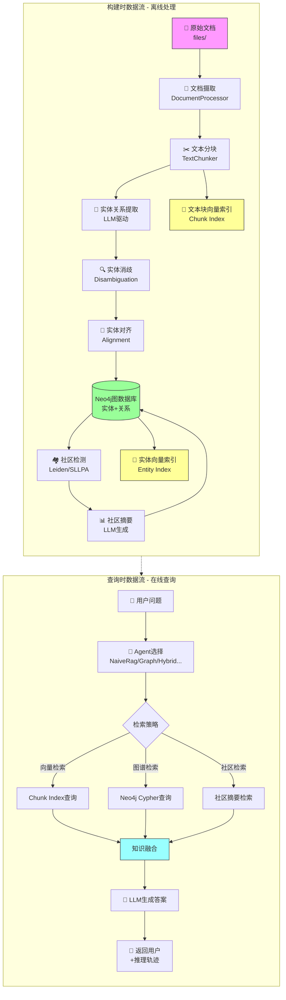

---

## 阶段一：文档摄取

### 流程详解

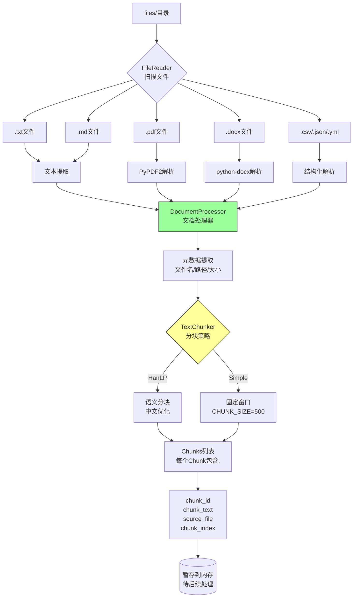

### 关键参数

| 参数 | 默认值 | 说明 | 配置位置 |
|------|--------|------|---------|
| `CHUNK_SIZE` | 500 | 分块大小（字符数） | `.env` |
| `OVERLAP` | 100 | 分块重叠长度 | `.env` |
| `MAX_TEXT_LENGTH` | 500000 | 单文件最大长度 | `.env` |
| `TEXT_CHUNKER_PROVIDER` | hanlp | 分块策略（hanlp/simple） | `.env` |

### 支持的文件格式

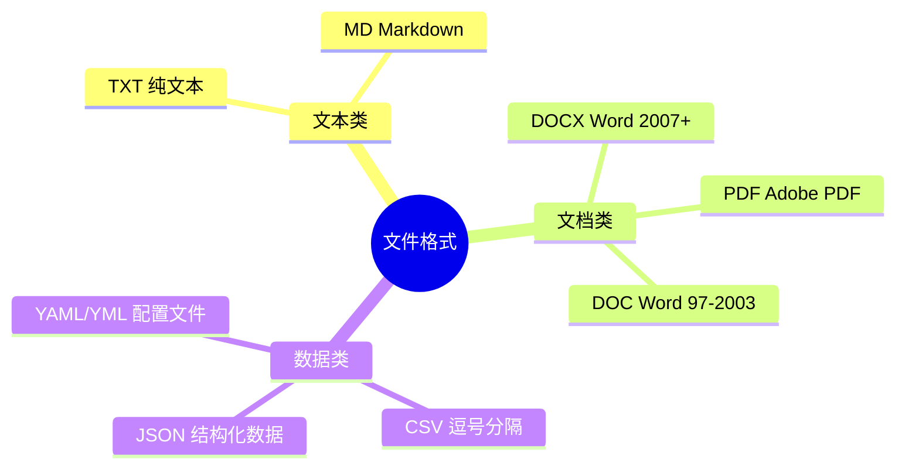

### 数据输出示例

```python
# DocumentProcessor输出格式
[
    {
        "filepath": "files/学生手册.pdf",
        "filename": "学生手册.pdf",
        "extension": ".pdf",
        "content": "完整文本内容...",
        "content_length": 45230,
        "chunks": [
            ["第一章 学生管理总则", "第一条..."],
            ["第二条...", "第三条..."],
            ...
        ],
        "chunk_count": 89,
        "average_chunk_length": 508
    },
    ...
]
```

---

## 阶段二：知识图谱构建

### 完整流程

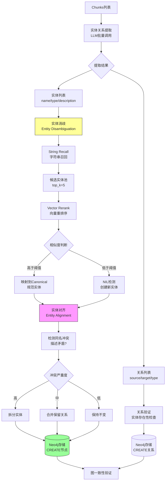

### 实体关系提取详解

#### LLM提示词结构

```python
# 实体提取提示词
ENTITY_EXTRACTION_PROMPT = f"""
从以下文本中提取实体，要求：
1. 实体类型必须为：{entity_types}
2. 提取实体名称、类型、简短描述
3. 返回JSON格式

文本：{{text}}

输出示例：
{{
  "entities": [
    {{"name": "优秀学生", "type": "学生类型", "description": "德智体美全面发展的学生"}},
    ...
  ]
}}
"""

# 关系提取提示词
RELATIONSHIP_EXTRACTION_PROMPT = f"""
从以下文本中提取实体间的关系，要求：
1. 关系类型必须为：{relationship_types}
2. 明确source和target实体
3. 返回JSON格式

文本：{{text}}
已识别实体：{{entities}}

输出示例：
{{
  "relationships": [
    {{"source": "优秀学生", "target": "国家奖学金", "type": "申请"}},
    ...
  ]
}}
"""
```

### 实体消歧算法

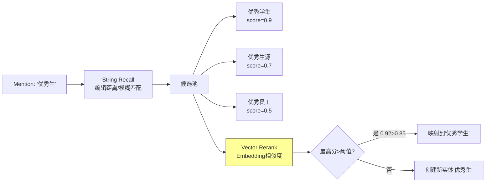

**关键参数**：

| 参数 | 默认值 | 说明 |
|------|--------|------|
| `DISAMBIG_STRING_THRESHOLD` | 0.7 | 字符串召回阈值 |
| `DISAMBIG_VECTOR_THRESHOLD` | 0.85 | 向量重排阈值 |
| `DISAMBIG_NIL_THRESHOLD` | 0.6 | NIL检测阈值 |
| `DISAMBIG_TOP_K` | 5 | 候选实体数量 |

### 实体对齐机制

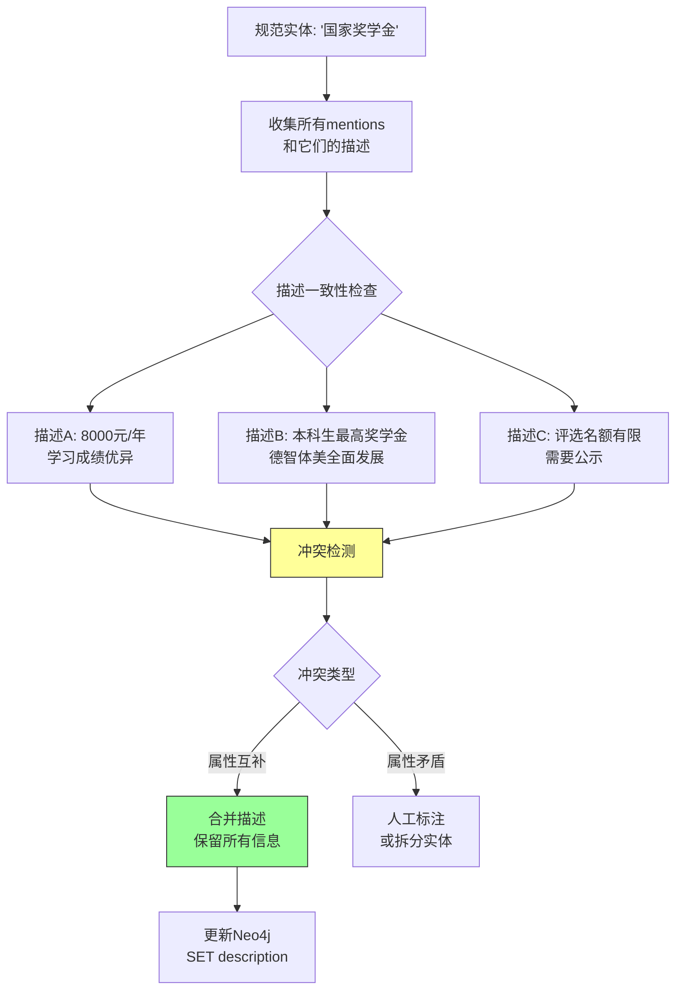

### Neo4j存储模式

```cypher
// 实体节点示例
CREATE (e:学生类型 {
  id: "entity_001",
  name: "优秀学生",
  description: "在德智体美全面发展方面表现突出的学生",
  mentions: ["优秀学生", "优秀生", "优秀在校生"],
  source_chunks: ["chunk_001", "chunk_045"]
})

// 关系示例
CREATE (e1)-[:申请 {
  confidence: 0.95,
  source_chunk: "chunk_001"
}]->(e2)
```

---

## 阶段三：索引构建

### 双索引策略

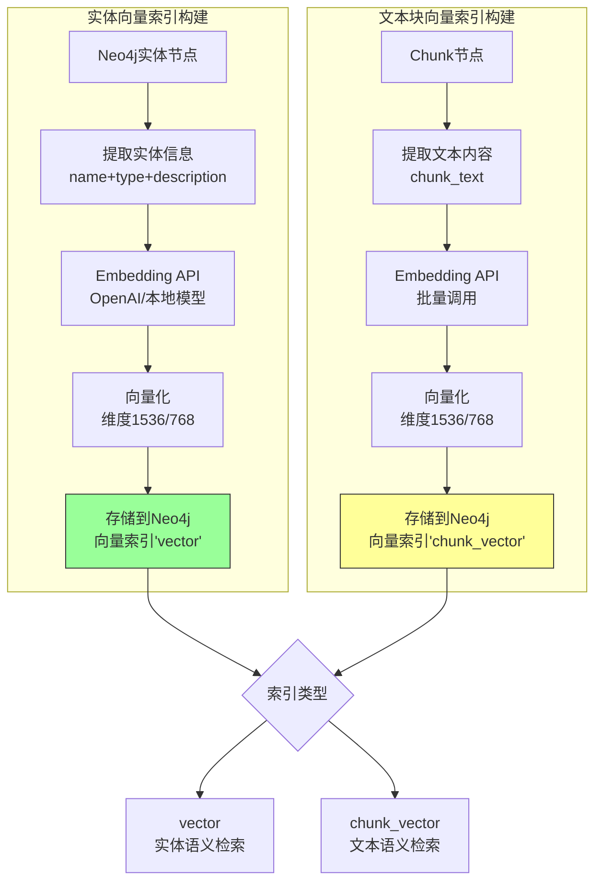

### 社区检测与摘要

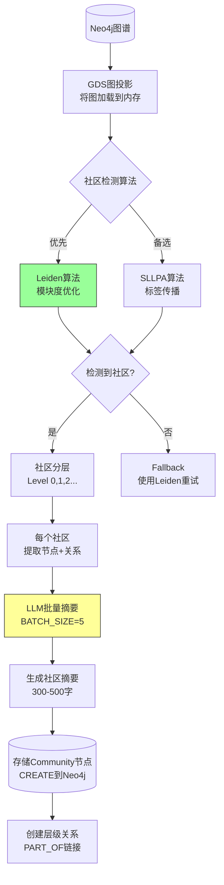

**社区检测参数**：

| 参数 | 默认值 | 说明 |
|------|--------|------|
| `GRAPH_COMMUNITY_ALGORITHM` | leiden | 算法选择（leiden/sllpa） |
| `GDS_MEMORY_LIMIT` | 6GB | GDS内存限制 |
| `GDS_CONCURRENCY` | 4 | 并发度 |
| `COMMUNITY_BATCH_SIZE` | 50 | 摘要生成批次 |

### 索引构建顺序（重要）

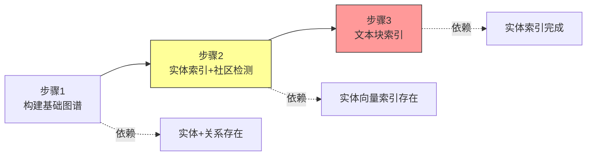

**⚠️ 关键约束**：
- **Chunk索引必须在Entity索引之后**
- 原因：Chunk索引构建时需要查询Entity索引来关联实体
- 违反顺序会导致索引不完整

---

## 阶段四：用户问答

### 完整查询流程

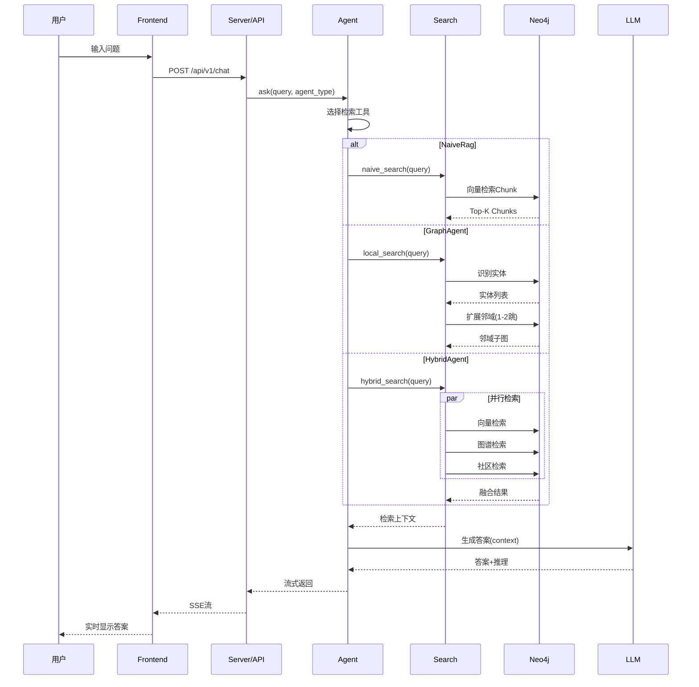

### 检索策略对比

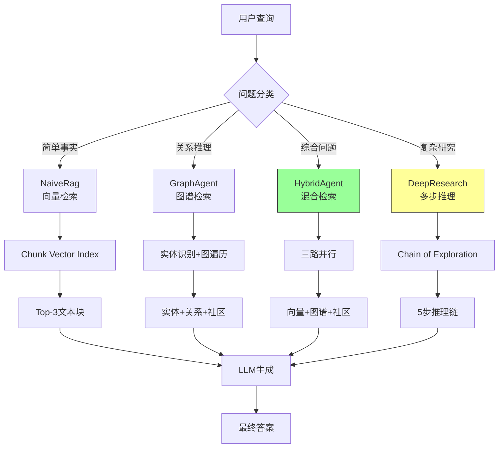

### Local Search详细流程

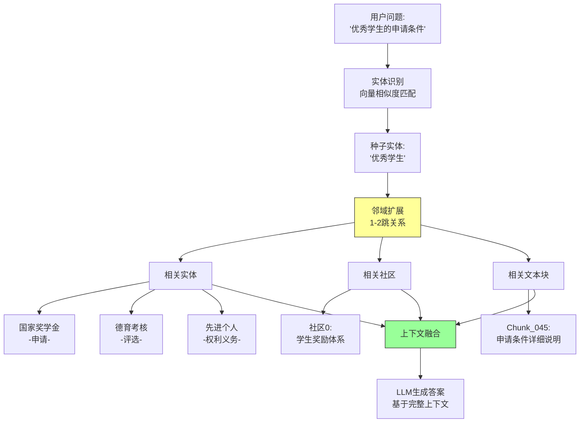

**Local Search参数**：

| 参数 | 默认值 | 说明 |
|------|--------|------|
| `top_entities` | 10 | 最多扩展实体数 |
| `top_chunks` | 3 | 相关文本块数 |
| `top_communities` | 3 | 相关社区数 |
| `top_inside_relationships` | 10 | 内部关系数 |
| `top_outside_relationships` | 10 | 外部关系数 |

### Global Search详细流程

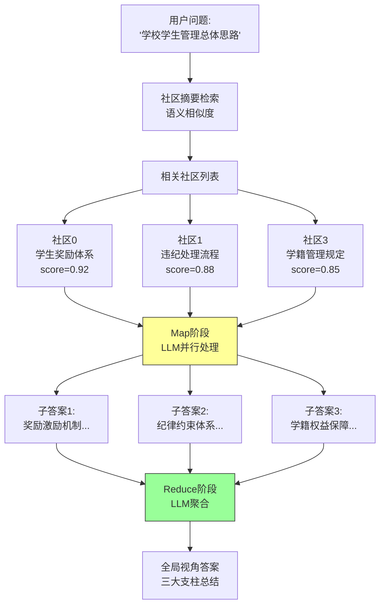

---

## 数据存储详解

### Neo4j图数据库

**存储内容**：

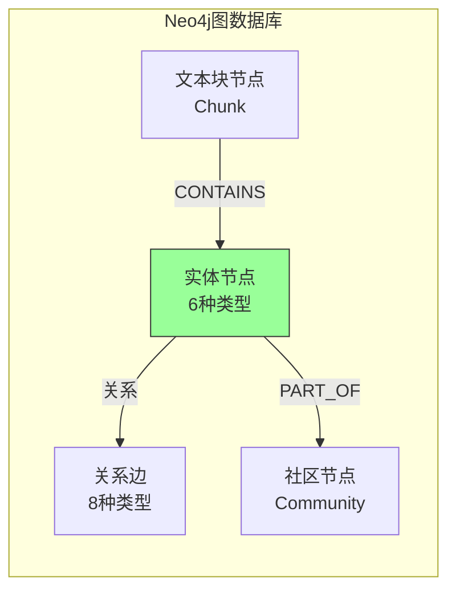

**节点类型**：

| 节点类型 | Label | 属性 | 数量估算 |
|----------|-------|------|---------|
| 实体节点 | 学生类型/奖学金类型/... | id, name, description, mentions | ~1200 |
| 社区节点 | Community | id, level, summary, size | ~15 |
| 文本块节点 | Chunk | id, text, source_file, index | ~5000 |

**关系类型**：
- 申请、评选、违纪、资助、申诉、管理、权利义务、互斥（共8种）
- PART_OF（实体→社区）
- CONTAINS（Chunk→实体）

### 向量索引

**两类索引**：

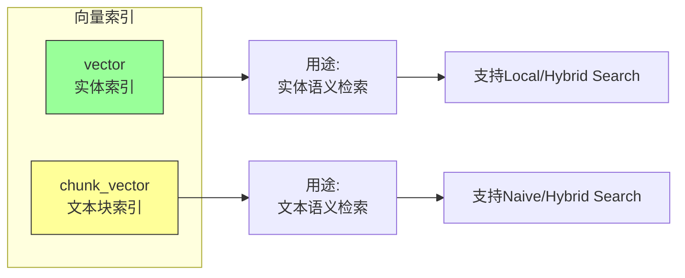

**索引参数**：

| 索引名 | 向量维度 | 相似度算法 | 数据量 |
|--------|---------|----------|--------|
| vector | 1536 (OpenAI) | Cosine | ~1200 |
| chunk_vector | 1536 (OpenAI) | Cosine | ~5000 |

### 检索结果不缓存（v3 strict）

v3 strict 默认不做检索结果缓存：每次请求都执行实时检索与生成。可感知性与稳定性主要通过 SSE `progress` 事件、超时与降级策略来保证。

### 文件注册表

**file_registry.json结构**：

```json
{
  "files/学生手册.pdf": {
    "filepath": "files/学生手册.pdf",
    "file_hash": "a3d5f2e1...",
    "last_modified": "2026-01-01T10:00:00",
    "status": "processed",
    "chunks_count": 89,
    "entities_count": 45,
    "relationships_count": 120,
    "processed_at": "2026-01-01T10:05:30"
  },
  ...
}
```

**用途**：
- 增量更新：跟踪文件变化
- 去重：避免重复处理
- 回滚：删除文件时清理相关数据

---

## 性能优化要点

### 批处理优化

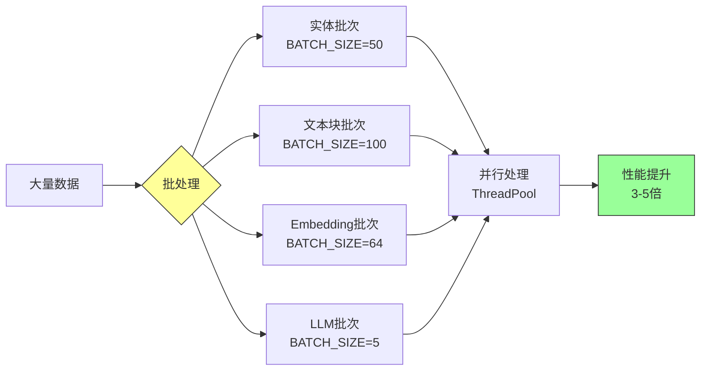

**关键参数**：

| 参数 | 默认值 | 说明 | 影响 |
|------|--------|------|------|
| `MAX_WORKERS` | 4 | 线程池大小 | 并行度 |
| `ENTITY_BATCH_SIZE` | 50 | 实体批次 | 消歧效率 |
| `EMBEDDING_BATCH_SIZE` | 64 | 向量批次 | API效率 |
| `LLM_BATCH_SIZE` | 5 | LLM批次 | 生成效率 |

### 可感知性优化（SSE progress + keepalive）

长检索阶段通过周期性 `progress`/心跳事件避免链路空转导致的代理断连；前端可用进度条/状态提示提升体验。

### Neo4j查询优化

**索引优化**：
```cypher
// 为常用查询字段创建索引
CREATE INDEX entity_name_idx FOR (e:学生类型) ON (e.name);
CREATE INDEX chunk_id_idx FOR (c:Chunk) ON (c.id);
```

**查询优化**：
```cypher
// 避免全图扫描，使用LIMIT
MATCH (e:学生类型)-[r]-(related)
WHERE e.name = '优秀学生'
RETURN e, r, related
LIMIT 100

// 使用向量索引加速
CALL db.index.vector.queryNodes(
  'vector',
  5,
  [0.1, 0.2, ...]  // 查询向量
) YIELD node, score
```

---

## 相关文档

### 内部文档
- [系统架构总览](./系统架构总览.md) - 整体架构设计
- [本项目的创新点](../../01-理论基础/本项目的创新点.md) - 技术创新说明
- [知识图谱构建](../02-核心子系统/知识图谱构建.md) - 构建详细步骤
- [实体消歧和对齐](../03-关键特性/实体消歧和对齐.md) - 消歧算法详解
- [搜索引擎](../02-核心子系统/搜索引擎.md) - 多级检索实现

### 外部参考
- [Neo4j数据导入最佳实践](https://neo4j.com/docs/operations-manual/current/tools/neo4j-admin-import/)
- [OpenAI Embeddings API](https://platform.openai.com/docs/guides/embeddings)
- [LangChain Document Loaders](https://python.langchain.com/docs/modules/data_connection/document_loaders/)

---

## 更新日志

| 日期 | 版本 | 更新内容 |
|------|------|----------|
| 2026-01-04 | v1.0 | 初始版本，完整数据流说明 |

---

**贡献者**：项目团队
**维护者**：架构委员会
**反馈渠道**：GitHub Issues
