# 系统架构总览

---

## 📋 元信息

- **目标读者**：所有读者（开发者、架构师、产品经理）
- **阅读时间**：15分钟
- **难度**：⭐⭐
- **前置知识**：基础软件架构概念
- **最后更新**：2026-01-04

---

## 📖 本文大纲

- [整体架构图](#整体架构图)
- [三大核心模块](#三大核心模块)
- [核心引擎与关键子系统详解](#核心引擎与关键子系统详解)
- [技术栈说明](#技术栈说明)
- [模块职责与交互](#模块职责与交互)
- [部署架构](#部署架构)
- [相关文档](#相关文档)

---

## 整体架构图

本项目采用分层架构设计，清晰分离 API、用例编排、领域模型、基础设施与核心算法层，便于 GraphRAG 独立服务化：

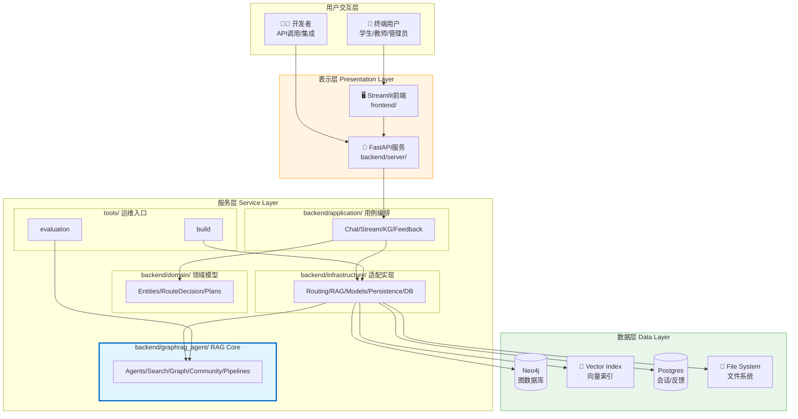

---

## 三大核心模块

### 1. backend/graphrag_agent/ - 核心算法包

**定位**：RAG 核心算法与流程，不包含具体基础设施实现（LLM/DB/缓存/服务框架）。

**特点**：
- 可独立抽取为库或服务核心
- 不依赖 FastAPI/Neo4j/LLM/数据库客户端
- 通过 ports/adapters 由上层注入依赖

**核心模块概览**：

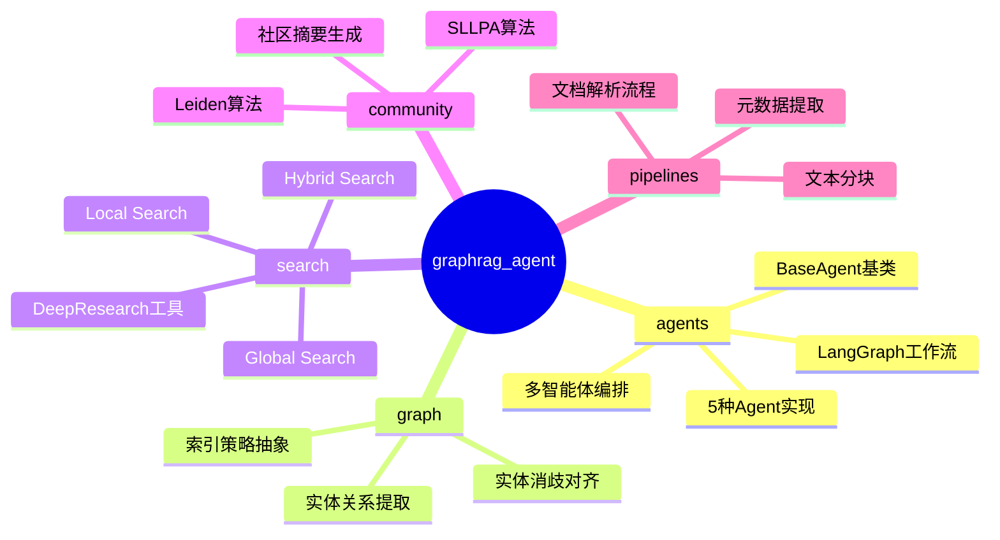

> 缓存/模型客户端/配置/评估等能力已下沉到 `backend/infrastructure/` 与 `tools/`。

### 2. GraphRAG 服务层（server + application + infrastructure）

**定位**：基于 FastAPI 的 GraphRAG 服务入口，API + 用例编排 + 端口实现。

**目录结构**：
```
backend/server/
├── main.py                 # FastAPI应用入口
├── api/                    # REST API
├── models/                 # 请求/响应模型
│   └── schemas.py          # Schema
```

**相关层（顶层包）**：
- `backend/application/`：用例编排 + ports
- `backend/infrastructure/`：端口实现（RAG/路由/模型/缓存/DB）
- `backend/config/`：服务配置（settings/database/rag）

**核心API端点**：

| 端点 | 方法 | 功能 | 返回 |
|------|------|------|------|
| `/api/v1/chat` | POST | 智能问答 | 流式/非流式答案 |
| `/api/v1/chat/stream` | POST | 流式问答 | SSE 事件流 |

### 3. frontend/ - 前端界面

**定位**：基于Streamlit的Web交互界面。

**目录结构**：
```
frontend/
├── app.py                  # Streamlit应用入口
├── components/             # UI组件
│   ├── sidebar.py          # 侧边栏（Agent选择、参数配置）
│   ├── chat_interface.py   # 聊天界面
│   └── graph_view.py       # 图谱可视化组件
├── utils/                  # 前端工具
│   └── api.py              # 后端API调用封装
└── frontend_config/                # 前端配置
    └── settings.py         # 自动继承服务配置
```

**核心功能**：
- 💬 聊天界面：支持流式/非流式输出
- 🔍 调试模式：显示推理轨迹、检索过程
- 📊 图谱可视化：Neo4j风格交互式图谱
- ⚙️ 参数调整：实时调整Agent行为
- 📝 反馈收集：点赞/点踩机制

---

## 核心引擎与关键子系统详解

本节覆盖 `graphrag_agent` 的核心算法，以及与之配套的基础设施与工具子系统，职责以分层边界为准。

### 1. agents/ - 智能体系统

**架构设计**：

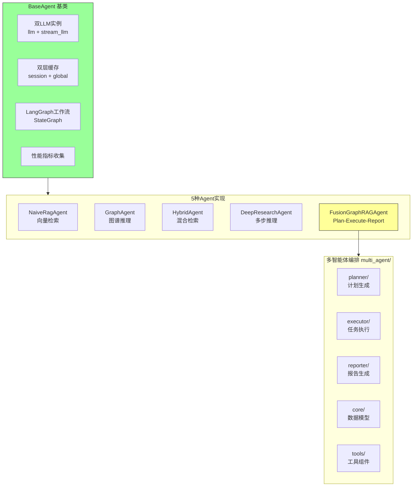

**关键技术**：
- **retrieve-only**：Agent 只负责检索，返回结构化证据（不在 core 内做对话编排）
- **ports 注入**：LLM/DB/向量索引等通过 ports/provider 在运行时注入
- **服务侧编排**：Router-Worker / streaming / memory / persistence 由 `backend/` 服务侧负责

**代码示例**（目标形态：依赖由基础设施注入）：
```python
# BaseAgent（v3 strict）核心结构
class BaseAgent(ABC):
    @abstractmethod
    def retrieve_with_trace(self, query: str, thread_id: str = "default") -> dict:
        """子类实现：返回结构化检索证据（用于服务侧聚合/生成）"""
        pass
```

### 2. graph/ - 图谱构建

**流程架构**：

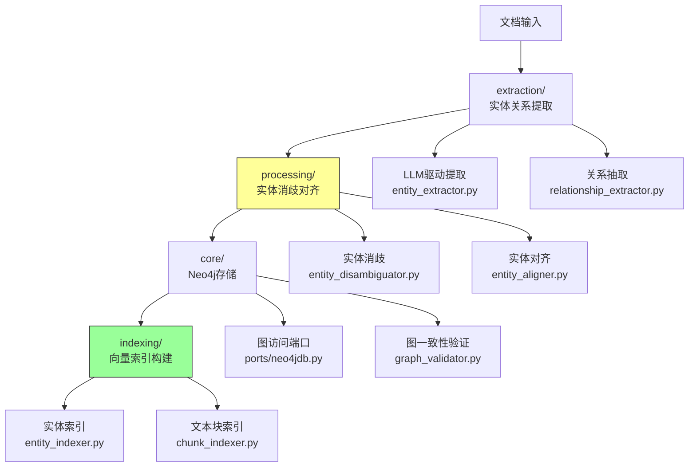

**关键组件**：

| 组件 | 文件路径 | 功能 |
|------|---------|------|
| **实体提取器** | `extraction/entity_extractor.py` | LLM识别实体和属性 |
| **关系提取器** | `extraction/relationship_extractor.py` | LLM识别实体间关系 |
| **实体消歧器** | `processing/entity_disambiguator.py` | Mention→Canonical映射 |
| **实体对齐器** | `processing/entity_aligner.py` | 解决同名实体冲突 |
| **图访问端口** | `ports/neo4jdb.py` | GraphClient/GraphQueryPort 接口 |
| **实体索引** | `indexing/entity_indexer.py` | 实体向量索引构建 |
| **文本索引** | `indexing/chunk_indexer.py` | 文本块向量索引构建 |

### 3. search/ - 检索引擎

**三级检索策略**：

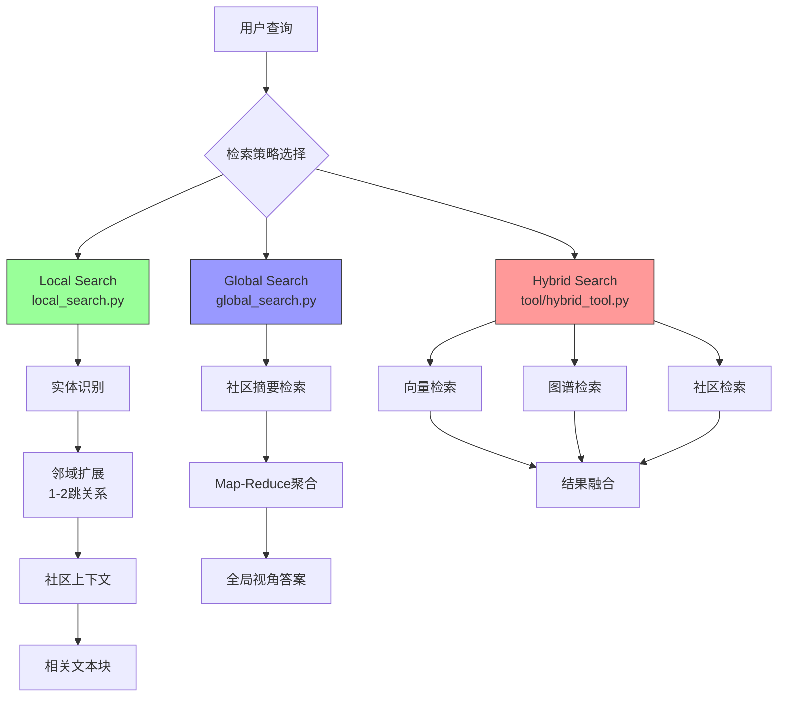

**工具集 tool/**：

| 工具 | 文件 | 用途 |
|------|------|------|
| **NaiveSearchTool** | `naive_search_tool.py` | 纯向量检索 |
| **LocalSearchTool** | `local_search_tool.py` | 实体中心检索 |
| **GlobalSearchTool** | `global_search_tool.py` | 社区聚合检索 |
| **HybridTool** | `hybrid_tool.py` | 多策略融合 |
| **DeepResearchTool** | `deep_research_tool.py` | 多步推理 |
| **ChainExplorationTool** | `chain_exploration_tool.py` | 图谱探索链 |

**推理组件 reasoning/**：
- `chain_of_exploration.py`：图谱多跳推理
- `evidence.py`：证据追踪与管理
- `validator.py`：答案验证
- `thinking.py`：思考步骤生成

### 4. backend/infrastructure/persistence/ - 会话与反馈持久化

> v3 strict：不做“检索结果缓存/Agent 内缓存”。持久化只用于会话记录、反馈等系统数据。

**落点**：
- 会话消息/对话：Postgres（system-of-record）
- 反馈：Postgres（feedback 表）
- 长期记忆：mem0（本地/自托管，存向量库 + Postgres 元数据）

### 5. community/ - 社区检测

**双算法策略**：

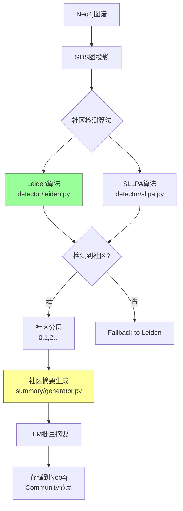

**社区摘要示例**：
```
社区0 (1097节点):
主题：优秀学生评定与奖励体系
摘要：本社区包含优秀学生、优秀团员、社会工作奖等评定标准和流程。
      核心规定包括：德育考核成绩、先进个人称号、班级考核等...
```

### 6. pipelines/ingestion/ - 文档摄取

**处理流程**：

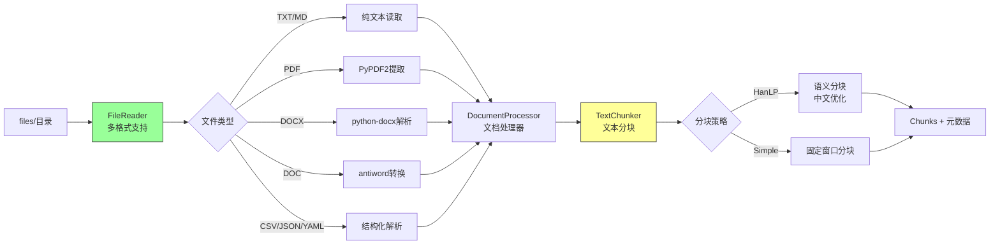

**支持格式**：
- 文本：TXT, MD（Markdown）
- 文档：PDF, DOCX, DOC
- 数据：CSV, JSON, YAML/YML

**分块策略**：
- **HanLP**（推荐）：基于中文语义的智能分块
- **Simple**：固定窗口 + 重叠

### 7. tools/evaluation/ - 评估系统

> 评估工具独立于核心算法，便于在服务外部运行。

**20+评估指标**：

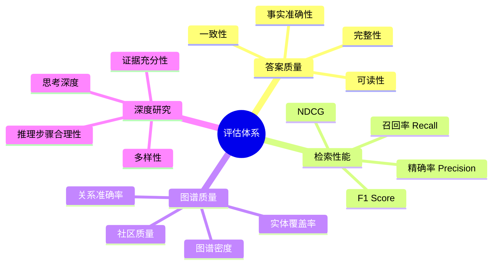

**目录结构**：
```
tools/evaluation/
├── core/                   # 评估核心
│   ├── evaluator.py        # 评估器基类
│   └── runner.py           # 批量评估运行器
├── metrics/                # 评估指标
│   ├── answer/             # 答案质量指标
│   ├── retrieval/          # 检索性能指标
│   ├── graph/              # 图谱质量指标
│   └── deep_research/      # 深度研究指标
└── test/                   # 测试脚本
    └── README.md           # 评估使用文档
```

### 8. 配置管理（backend/infrastructure/config + backend/config/rag）

**三层配置体系**：

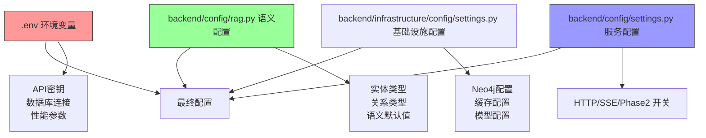

**关键配置文件**：

		| 文件 | 作用域 | 内容 |
		|------|--------|------|
		| `.env` | 运行时参数 | API密钥、数据库URI、性能调优 |
		| `backend/config/rag.py` | RAG 语义 | KB_NAME、theme、entity_types、relationship_types、示例问题、工具描述 |
		| `backend/config/settings.py` | 后端服务 | SERVER_*、PHASE2_ENABLE_*、SSE_HEARTBEAT_S 等运行参数 |
		| `backend/infrastructure/config/settings.py` | 基础设施 | NEO4J_*、OPENAI_*、CACHE_*、KB_AUTO_ROUTE* 等 |
		| `backend/graphrag_agent/config/settings.py` | 核心默认值 | 仅保留算法默认值与类型（不做环境/连接读取） |
		| `frontend/frontend_config/settings.py` | 前端界面 | 前端 UI/接口地址/展示开关等（从 `.env` 读取为主） |

---

## 技术栈说明

### 核心依赖

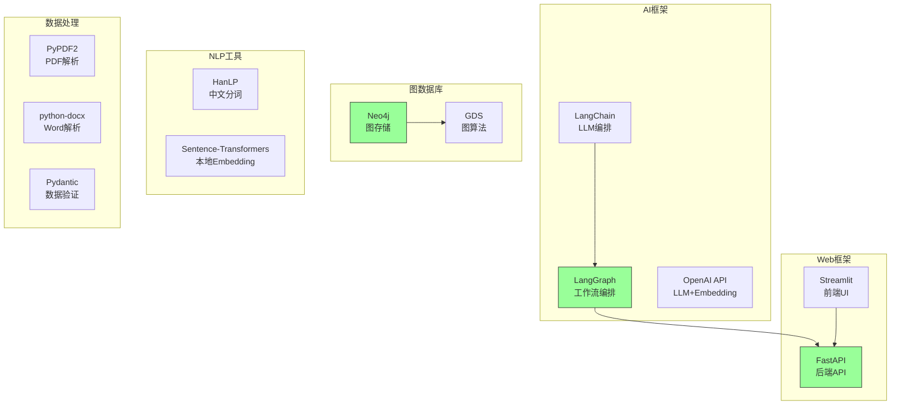

### 完整技术栈

| 类别 | 技术 | 版本要求 | 用途 |
|------|------|---------|------|
| **Python** | Python | 3.10+ | 运行环境 |
| **LLM框架** | LangChain | 最新 | LLM编排 |
|  | LangGraph | 最新 | Agent工作流 |
| **图数据库** | Neo4j | 5.x+ | 图存储 |
|  | Neo4j GDS | 2.x+ | 图算法 |
| **Web框架** | FastAPI | 最新 | REST API |
|  | Streamlit | 最新 | Web UI |
| **NLP工具** | HanLP | 2.x | 中文分词 |
|  | Sentence-Transformers | 最新 | 本地Embedding |
| **文档解析** | PyPDF2 | 最新 | PDF处理 |
|  | python-docx | 最新 | Word处理 |
| **数据验证** | Pydantic | 2.x | Schema验证 |
| **并发** | asyncio | 标准库 | 异步I/O |
|  | ThreadPoolExecutor | 标准库 | 多线程 |

---

## 模块职责与交互

### 数据流交互图

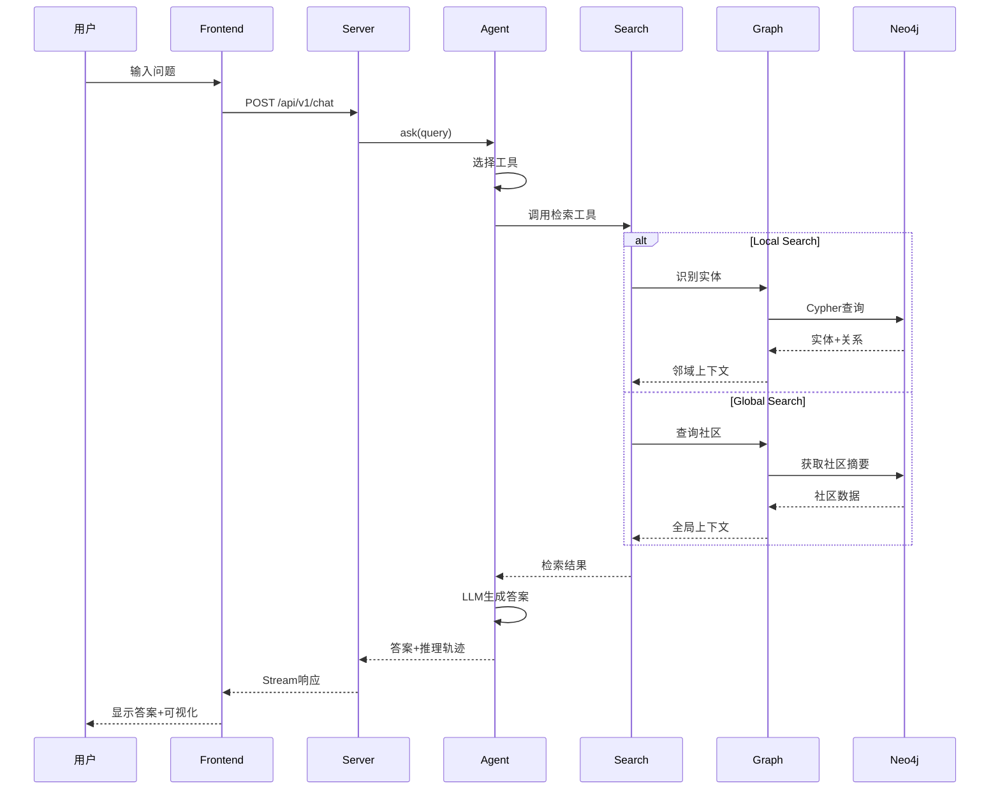

### 模块依赖关系

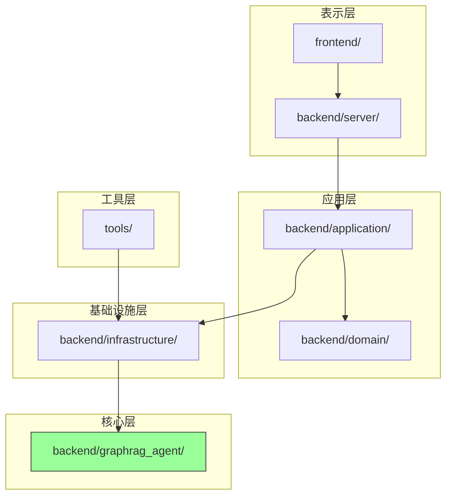

---

## 部署架构

### 开发环境

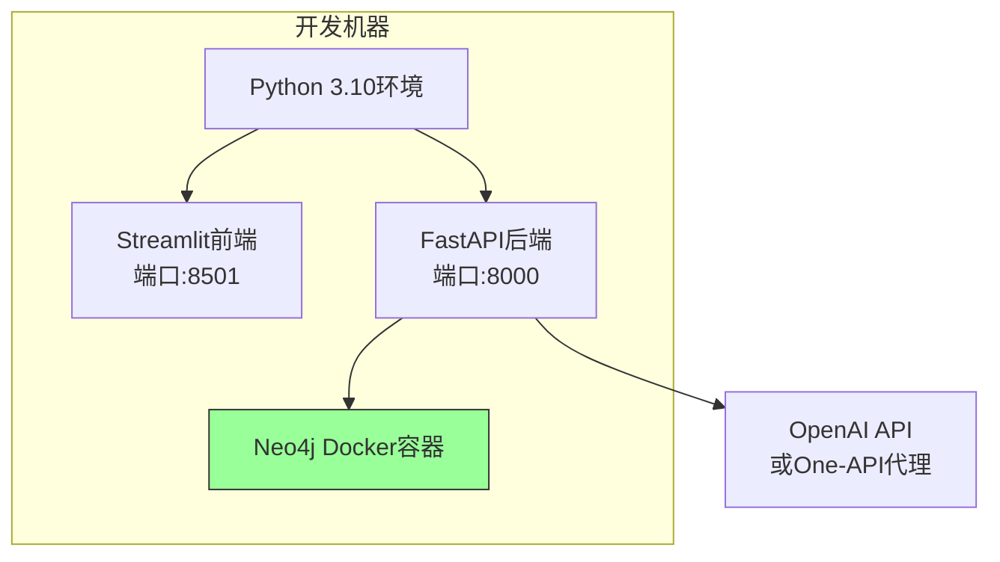

### 生产环境（推荐）

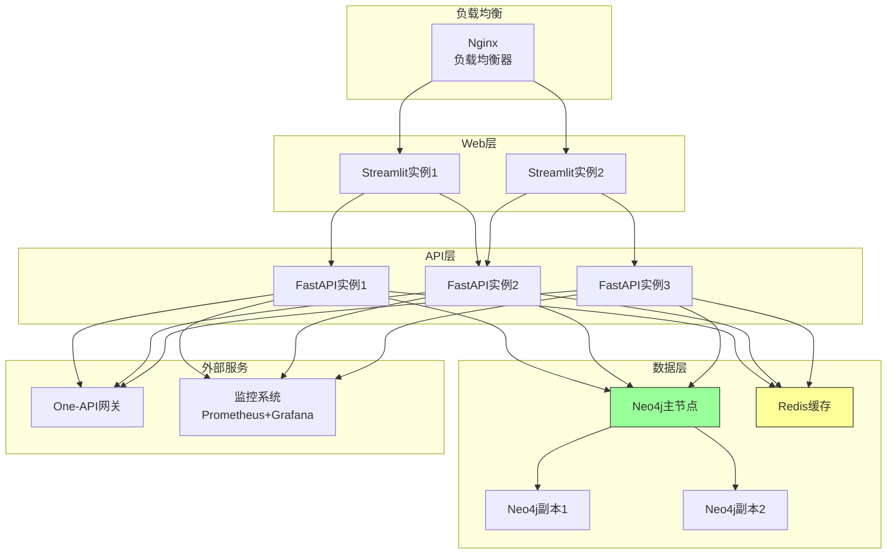

**部署建议**：
- **小规模**（<100用户）：单机部署（1个FastAPI + 1个Streamlit + 1个Neo4j）
- **中规模**（100-1000用户）：FastAPI多实例 + Neo4j主从 + Redis缓存
- **大规模**（>1000用户）：完整负载均衡 + Neo4j集群 + 分布式缓存

---

## 相关文档

### 内部文档
- [数据流总览](./数据流总览.md) - 完整数据处理流程
- [本项目的创新点](../../01-理论基础/本项目的创新点.md) - 技术创新说明
- [第一次对话](../../00-快速开始/第一次对话.md) - 快速开始指南
- [Agent系统](../02-核心子系统/Agent系统.md) - 多智能体详细设计

### 模块文档
每个子模块都有独立的README：
- `backend/graphrag_agent/agents/README.md` - Agent系统
- `backend/graphrag_agent/graph/README.md` - 图谱构建
- `backend/graphrag_agent/search/README.md` - 检索引擎
- `backend/infrastructure/persistence/README.md` - 会话与反馈持久化
- `backend/graphrag_agent/community/README.md` - 社区检测
- `tools/evaluation/README.md` - 评估系统

### 外部参考
- [Neo4j官方文档](https://neo4j.com/docs/)
- [LangGraph官方文档](https://langchain-ai.github.io/langgraph/)
- [FastAPI官方文档](https://fastapi.tiangolo.com/)
- [Streamlit官方文档](https://docs.streamlit.io/)

---

## 更新日志

| 日期 | 版本 | 更新内容 |
|------|------|----------|
| 2026-01-04 | v1.0 | 初始版本，完整架构说明 |

---

**贡献者**：项目团队
**维护者**：架构委员会
**反馈渠道**：GitHub Issuesa
