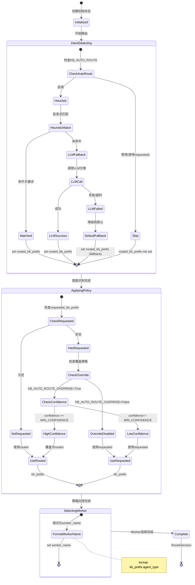
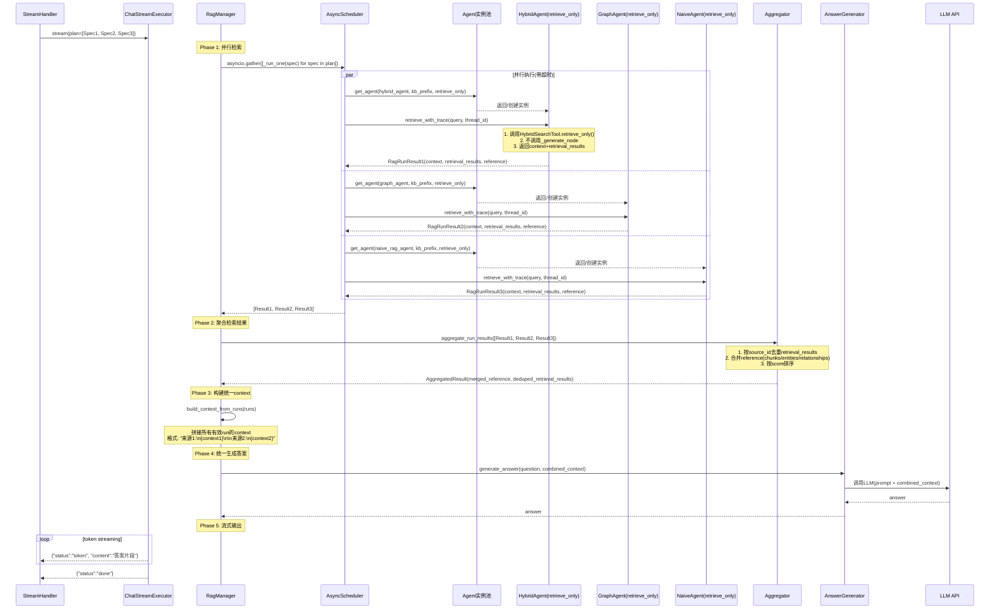
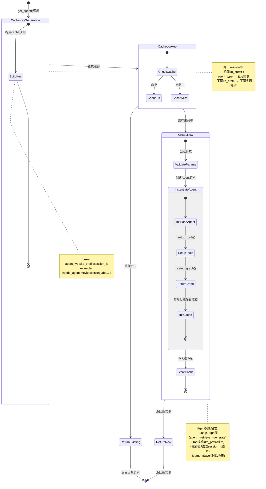
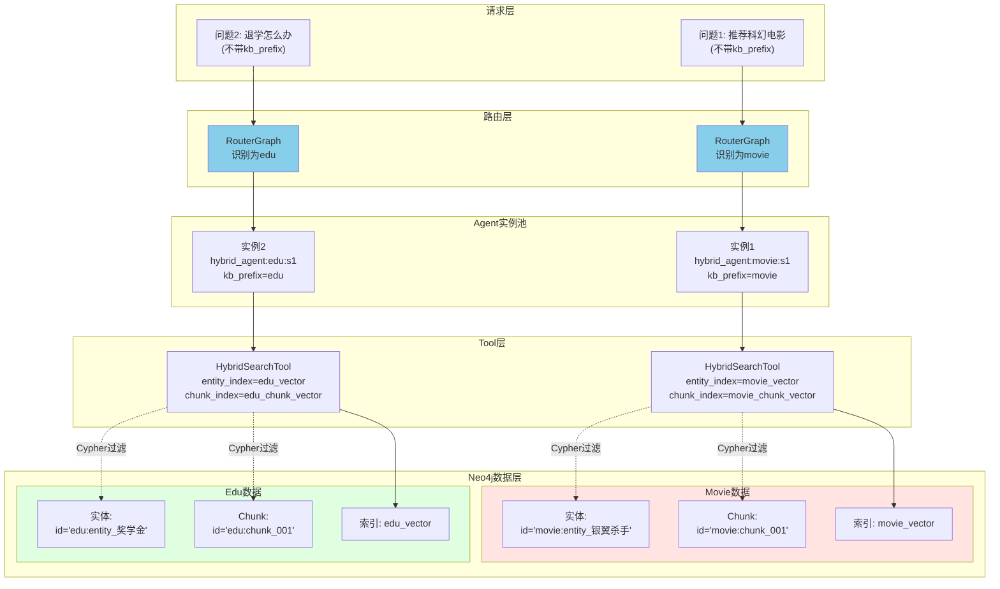
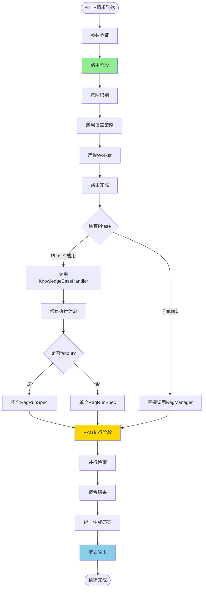
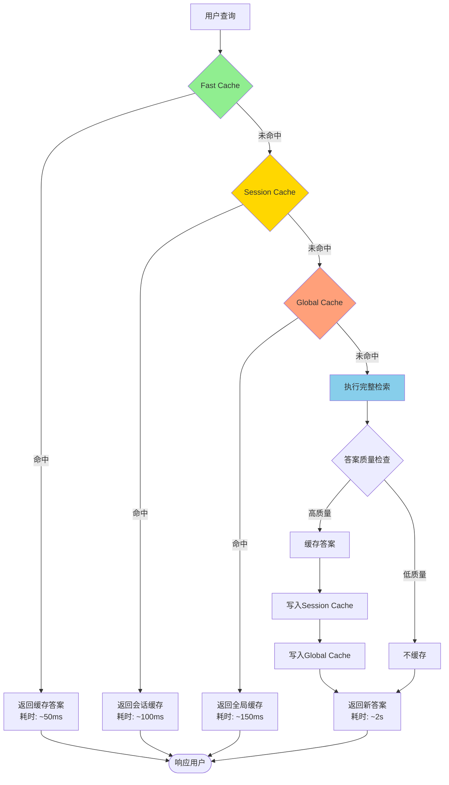

# LangGraph Router-Worker 重构补充说明

> 配合《LangGraph-Router-Worker-重构进度.md》使用
> 本文档提供详细的组件交互、配置迁移、测试策略等补充内容

---

## 目录

- [1. 详细组件交互图](#1-详细组件交互图)
- [2. 状态转换与生命周期](#2-状态转换与生命周期)
- [3. 配置迁移指南](#3-配置迁移指南)
- [4. 测试策略](#4-测试策略)
- [5. 监控与告警](#5-监控与告警)
- [6. 故障排查指南](#6-故障排查指南)
- [7. 性能调优建议](#7-性能调优建议)

---

## 1. 详细组件交互图

### 1.1 RouterGraph 内部状态转换



### 1.2 RagManager 执行流程详解



### 1.3 Agent实例池生命周期



### 1.4 KB隔离的数据流



---

## 2. 状态转换与生命周期

### 2.1 请求的完整生命周期



### 2.2 缓存的多级策略



**缓存层级说明**:

| 缓存层级 | 范围 | 生命周期 | 命中率目标 | 用途 |
|---------|------|---------|----------|------|
| **Fast Cache** | per-agent | 会话期间 | 10-15% | 完全相同的问题(字符串精确匹配) |
| **Session Cache** | per-session | 会话期间 | 20-30% | 会话内的相似问题(向量相似度) |
| **Global Cache** | 跨会话 | 持久化 | 30-40% | 所有用户的高频问题 |

---

## 3. 配置迁移指南

### 3.1 Phase 0 → Phase 1 迁移

**变更点**: 路由逻辑从handler内迁移到RouterGraph

**迁移步骤**:

```bash
# 1. 更新配置文件
# backend/infrastructure/config/settings.py 或 .env

# 启用KB自动路由(如果之前没开启)
KB_AUTO_ROUTE=True

# 允许覆盖用户选择(推荐)
KB_AUTO_ROUTE_OVERRIDE=True

# 设置覆盖的最低置信度
KB_AUTO_ROUTE_MIN_CONFIDENCE=0.7
```

**验证**:

```bash
# 测试路由功能
curl -X POST http://localhost:8000/api/v1/chat \
  -H "Content-Type: backend/application/json" \
  -d '{
    "message": "推荐科幻电影",
    "session_id": "test",
    "debug": true
  }'

# 检查响应中是否包含路由信息
# {
#   "route_decision": {
#     "kb_prefix": "movie",
#     "method": "heuristic",
#     "confidence": 0.95
#   }
# }
```

### 3.2 Phase 1 → Phase 2 迁移

**变更点**: 启用KnowledgeBaseHandler,支持fanout

**迁移步骤**:

```bash
# 1. 在 backend/infrastructure/config/settings.py 中添加配置
RAG_ENABLE_KB_HANDLERS=False  # 先保持关闭,灰度测试

# 2. 配置答案生成超时
RAG_ANSWER_TIMEOUT_S=30.0

# 3. (可选)配置fanout策略
# backend/application/handlers/movie/handler.py
# 在MovieHandler.build_plan()中自定义fanout规则
```

**灰度发布**:

```python
# backend/server/api/rest/dependencies.py

import os

ENABLE_KB_HANDLERS = os.getenv("RAG_ENABLE_KB_HANDLERS", "false").lower() == "true"
PHASE2_ROLLOUT_PERCENTAGE = int(os.getenv("PHASE2_ROLLOUT_PERCENTAGE", "0"))

def should_use_phase2(session_id: str) -> bool:
    if not ENABLE_KB_HANDLERS:
        return False
    if PHASE2_ROLLOUT_PERCENTAGE >= 100:
        return True
    # 基于session_id的hash决定是否走Phase2
    import hashlib
    hash_val = int(hashlib.md5(session_id.encode()).hexdigest(), 16)
    return (hash_val % 100) < PHASE2_ROLLOUT_PERCENTAGE
```

**灰度流程**:

1. **10%灰度** (1-2天):
   ```bash
   export PHASE2_ROLLOUT_PERCENTAGE=10
   # 监控错误率、延迟、缓存命中率
   ```

2. **50%灰度** (3-5天):
   ```bash
   export PHASE2_ROLLOUT_PERCENTAGE=50
   # 对比Phase1和Phase2的性能指标
   ```

3. **100%全量** (1周后):
   ```bash
   export RAG_ENABLE_KB_HANDLERS=true
   export PHASE2_ROLLOUT_PERCENTAGE=100
   ```

### 3.3 配置参数速查表

| 参数名 | 默认值 | 类型 | 说明 | 影响范围 |
|--------|-------|------|------|---------|
| `KB_AUTO_ROUTE` | True | bool | 是否启用自动KB路由 | 所有请求 |
| `KB_AUTO_ROUTE_OVERRIDE` | True | bool | 是否允许覆盖用户显式选择 | 路由决策 |
| `KB_AUTO_ROUTE_MIN_CONFIDENCE` | 0.7 | float | 覆盖的最低置信度阈值 | 路由决策 |
| `RAG_ENABLE_KB_HANDLERS` | False | bool | 是否启用Phase2路径 | 执行路径选择 |
| `RAG_ANSWER_TIMEOUT_S` | 30.0 | float | 答案生成超时(秒) | 答案生成 |
| `PHASE2_ROLLOUT_PERCENTAGE` | 0 | int | Phase2灰度百分比(0-100) | 灰度发布 |

---

## 4. 测试策略

### 4.1 单元测试

#### 4.1.1 RouterGraph测试

```python
# test/unit/test_router_graph.py

import unittest
from infrastructure.routing.orchestrator import invoke_router_graph


class TestRouterGraph(unittest.TestCase):
    """RouterGraph单元测试"""

    def test_heuristic_routes_edu_keywords(self):
        """测试启发式路由 - edu关键词"""
        decision = invoke_router_graph(
            message="旷课多少学时会被退学？",
            session_id="test",
            agent_type="hybrid_agent",
            requested_kb_prefix="",
        )
        self.assertEqual(decision.kb_prefix, "edu")
        self.assertEqual(decision.method, "heuristic")
        self.assertGreaterEqual(decision.confidence, 0.9)

    def test_heuristic_routes_movie_keywords(self):
        """测试启发式路由 - movie关键词"""
        decision = invoke_router_graph(
            message="推荐科幻电影",
            session_id="test",
            agent_type="hybrid_agent",
            requested_kb_prefix="",
        )
        self.assertEqual(decision.kb_prefix, "movie")
        self.assertEqual(decision.method, "heuristic")

    def test_override_policy_respects_high_confidence(self):
        """测试覆盖策略 - 高置信度覆盖"""
        # 用户传movie,但问题明显是edu
        decision = invoke_router_graph(
            message="奖学金怎么申请？",
            session_id="test",
            agent_type="hybrid_agent",
            requested_kb_prefix="movie",  # 故意传错
        )
        # 应该覆盖为edu
        self.assertEqual(decision.kb_prefix, "edu")
        self.assertEqual(decision.requested_kb_prefix, "movie")
        self.assertGreaterEqual(decision.confidence, 0.7)

    def test_worker_name_format(self):
        """测试worker_name格式"""
        decision = invoke_router_graph(
            message="银翼杀手的导演是谁？",
            session_id="test",
            agent_type="graph_agent",
            requested_kb_prefix="",
        )
        self.assertEqual(decision.worker_name, "movie:graph_agent")
```

#### 4.1.2 RagManager测试

```python
# test/unit/test_rag_manager.py

import unittest
import asyncio
from infrastructure.rag.rag_manager import RagManager
from infrastructure.rag.specs import RagRunSpec


class TestRagManager(unittest.TestCase):
    """RagManager单元测试"""

    def setUp(self):
        self.rag_manager = RagManager()

    def test_run_plan_blocking_single_spec(self):
        """测试单个spec的blocking执行"""
        plan = [RagRunSpec(agent_type="hybrid_agent", timeout_s=30.0)]

        async def _test():
            aggregated, runs = await self.rag_manager.run_plan_blocking(
                plan=plan,
                message="测试问题",
                session_id="test",
                kb_prefix="movie",
                debug=True,
            )
            self.assertEqual(len(runs), 1)
            self.assertIsNotNone(aggregated.answer)
            self.assertIsNone(aggregated.error)

        asyncio.run(_test())

    def test_run_plan_blocking_fanout(self):
        """测试多个spec的fanout执行"""
        plan = [
            RagRunSpec(agent_type="hybrid_agent", timeout_s=25.0),
            RagRunSpec(agent_type="graph_agent", timeout_s=25.0),
            RagRunSpec(agent_type="naive_rag_agent", timeout_s=25.0),
        ]

        async def _test():
            aggregated, runs = await self.rag_manager.run_plan_blocking(
                plan=plan,
                message="推荐科幻电影",
                session_id="test",
                kb_prefix="movie",
                debug=True,
            )
            # 应该有3个run结果
            self.assertEqual(len(runs), 3)
            # 聚合结果应该合并了所有检索结果
            if aggregated.retrieval_results:
                self.assertGreater(len(aggregated.retrieval_results), 0)

        asyncio.run(_test())

    def test_timeout_handling(self):
        """测试超时处理"""
        plan = [RagRunSpec(agent_type="hybrid_agent", timeout_s=0.001)]  # 极短超时

        async def _test():
            aggregated, runs = await self.rag_manager.run_plan_blocking(
                plan=plan,
                message="测试问题",
                session_id="test",
                kb_prefix="movie",
                debug=True,
            )
            # 应该有超时错误
            self.assertEqual(len(runs), 1)
            self.assertIn("timeout", runs[0].error.lower())

        asyncio.run(_test())
```

### 4.2 集成测试

#### 4.2.1 端到端测试

```python
# test/integration/test_e2e_routing.py

import unittest
import requests


class TestE2ERouting(unittest.TestCase):
    """端到端路由测试"""

    BASE_URL = "http://localhost:8000"

    def test_auto_route_movie(self):
        """测试自动路由到movie"""
        response = requests.post(
            f"{self.BASE_URL}/api/v1/chat",
            json={
                "message": "推荐一些科幻电影",
                "session_id": "test_movie",
                "debug": True,
            },
            timeout=30,
        )
        self.assertEqual(response.status_code, 200)
        data = response.json()

        # 检查路由决策
        self.assertIn("route_decision", data)
        self.assertEqual(data["route_decision"]["kb_prefix"], "movie")

        # 检查答案引用
        if "reference" in data:
            # 引用的实体/chunk应该都带movie前缀
            for entity in data["reference"].get("entities", []):
                self.assertTrue(entity["id"].startswith("movie:"))

    def test_auto_route_edu(self):
        """测试自动路由到edu"""
        response = requests.post(
            f"{self.BASE_URL}/api/v1/chat",
            json={
                "message": "旷课多少学时会被退学？",
                "session_id": "test_edu",
                "debug": True,
            },
            timeout=30,
        )
        self.assertEqual(response.status_code, 200)
        data = response.json()

        self.assertEqual(data["route_decision"]["kb_prefix"], "edu")

        # 检查答案引用
        if "reference" in data:
            for entity in data["reference"].get("entities", []):
                self.assertTrue(entity["id"].startswith("edu:"))

    def test_kb_isolation(self):
        """测试KB隔离 - 显式传错kb_prefix应该被覆盖"""
        response = requests.post(
            f"{self.BASE_URL}/api/v1/chat",
            json={
                "message": "退学怎么办？",
                "kb_prefix": "movie",  # 故意传错
                "session_id": "test_isolation",
                "debug": True,
            },
            timeout=30,
        )
        self.assertEqual(response.status_code, 200)
        data = response.json()

        # 应该被覆盖为edu
        self.assertEqual(data["route_decision"]["kb_prefix"], "edu")
        self.assertEqual(data["route_decision"]["requested_kb_prefix"], "movie")
```

#### 4.2.2 压力测试

```python
# test/integration/test_stress.py

import unittest
import asyncio
import aiohttp
from concurrent.futures import ThreadPoolExecutor


class TestStress(unittest.TestCase):
    """压力测试"""

    BASE_URL = "http://localhost:8000"

    def test_concurrent_requests(self):
        """测试并发请求"""
        num_requests = 50
        timeout = 60

        async def _send_request(session, message):
            async with session.post(
                f"{self.BASE_URL}/api/v1/chat",
                json={
                    "message": message,
                    "session_id": f"stress_{id(message)}",
                },
                timeout=aiohttp.ClientTimeout(total=30),
            ) as response:
                return await response.json()

        async def _test():
            messages = [
                "推荐科幻电影",
                "退学怎么办？",
                "银翼杀手的导演是谁？",
                "奖学金怎么申请？",
            ] * (num_requests // 4)

            async with aiohttp.ClientSession() as session:
                tasks = [_send_request(session, msg) for msg in messages]
                results = await asyncio.gather(*tasks, return_exceptions=True)

            # 检查成功率
            success_count = sum(
                1 for r in results if isinstance(r, dict) and "answer" in r
            )
            success_rate = success_count / len(results)

            self.assertGreaterEqual(success_rate, 0.95)  # 至少95%成功率

        asyncio.run(_test())
```

### 4.3 性能基准测试

```python
# test/benchmark/test_performance.py

import unittest
import time
import statistics
from infrastructure.routing.orchestrator import invoke_router_graph


class TestPerformanceBenchmark(unittest.TestCase):
    """性能基准测试"""

    def test_router_latency_heuristic(self):
        """测试启发式路由延迟"""
        latencies = []

        for _ in range(100):
            start = time.time()
            invoke_router_graph(
                message="推荐科幻电影",
                session_id="bench",
                agent_type="hybrid_agent",
                requested_kb_prefix="",
            )
            latencies.append((time.time() - start) * 1000)  # ms

        p50 = statistics.median(latencies)
        p95 = statistics.quantiles(latencies, n=20)[18]  # 95th percentile

        print(f"\n启发式路由延迟: P50={p50:.2f}ms, P95={p95:.2f}ms")

        # 启发式路由应该在10ms以内
        self.assertLess(p95, 10)

    def test_agent_pool_cache_hit(self):
        """测试Agent实例池缓存命中"""
        from infrastructure.agents.rag_factory import rag_agent_manager

        # 预热
        agent1 = rag_agent_manager.get_agent(
            "hybrid_agent", session_id="bench", kb_prefix="movie"
        )

        # 测试缓存命中
        start = time.time()
        agent2 = rag_agent_manager.get_agent(
            "hybrid_agent", session_id="bench", kb_prefix="movie"
        )
        cache_hit_latency = (time.time() - start) * 1000

        # 应该是同一个实例
        self.assertIs(agent1, agent2)
        # 缓存命中应该极快(<1ms)
        self.assertLess(cache_hit_latency, 1)
```

### 4.4 测试覆盖率目标

| 模块 | 目标覆盖率 | 当前覆盖率 | 优先级 |
|------|----------|----------|--------|
| RouterGraph | 90% | 85% | P0 |
| KB Router | 85% | 80% | P0 |
| RagManager | 85% | 75% | P0 |
| Aggregator | 80% | 60% | P1 |
| KnowledgeBaseHandler | 75% | 70% | P1 |
| Agent retrieve_only | 70% | 65% | P1 |

---

## 5. 监控与告警

### 5.1 关键指标

#### 5.1.1 路由层指标

```python
# backend/infrastructure/routing/metrics.py

from prometheus_client import Counter, Histogram, Gauge

# 路由请求总数
router_requests_total = Counter(
    'router_requests_total',
    'Total number of routing requests',
    ['method', 'kb_prefix']  # heuristic/llm, movie/edu
)

# 路由延迟
router_latency_ms = Histogram(
    'router_latency_ms',
    'Routing latency in milliseconds',
    ['method'],
    buckets=[1, 5, 10, 50, 100, 500, 1000]
)

# 路由置信度分布
router_confidence = Histogram(
    'router_confidence',
    'Routing confidence distribution',
    buckets=[0.1, 0.3, 0.5, 0.7, 0.8, 0.9, 0.95, 1.0]
)

# 覆盖率(用户传了kb但被覆盖)
router_override_rate = Gauge(
    'router_override_rate',
    'Rate of routing override decisions'
)
```

#### 5.1.2 RAG执行层指标

```python
# backend/infrastructure/rag/metrics.py

# fanout数量分布
rag_fanout_count = Histogram(
    'rag_fanout_count',
    'Number of parallel RAG runs',
    buckets=[1, 2, 3, 4, 5]
)

# 并行执行延迟
rag_parallel_latency_ms = Histogram(
    'rag_parallel_latency_ms',
    'Parallel RAG execution latency',
    ['kb_prefix'],
    buckets=[100, 500, 1000, 2000, 5000, 10000]
)

# 聚合延迟
rag_aggregation_latency_ms = Histogram(
    'rag_aggregation_latency_ms',
    'Aggregation latency in milliseconds',
    buckets=[1, 5, 10, 50, 100]
)

# 答案生成延迟
rag_answer_generation_latency_ms = Histogram(
    'rag_answer_generation_latency_ms',
    'Answer generation latency',
    buckets=[100, 500, 1000, 2000, 5000]
)

# 单个run的成功/失败
rag_run_status = Counter(
    'rag_run_status',
    'RAG run status',
    ['agent_type', 'kb_prefix', 'status']  # success/timeout/error
)
```

#### 5.1.3 Agent层指标

```python
# backend/infrastructure/agents/metrics.py

# Agent检索延迟
agent_retrieve_latency_ms = Histogram(
    'agent_retrieve_latency_ms',
    'Agent retrieve latency',
    ['agent_type', 'kb_prefix', 'mode'],  # retrieve_only/legacy
    buckets=[100, 500, 1000, 2000, 5000]
)

# Agent错误率
agent_error_rate = Counter(
    'agent_error_rate',
    'Agent error count',
    ['agent_type', 'kb_prefix', 'error_type']
)

# 缓存命中率
agent_cache_hit_rate = Gauge(
    'agent_cache_hit_rate',
    'Agent cache hit rate',
    ['kb_prefix', 'cache_type']  # fast/session/global
)
```

### 5.2 告警规则

#### 5.2.1 可用性告警

```yaml
# alerts/availability.yml

groups:
  - name: availability
    interval: 1m
    rules:
      - alert: HighErrorRate
        expr: |
          sum(rate(rag_run_status{status="error"}[5m]))
          /
          sum(rate(rag_run_status[5m]))
          > 0.05
        for: 5m
        labels:
          severity: critical
        annotations:
          summary: "RAG执行错误率过高"
          description: "过去5分钟错误率超过5%: {{ $value }}"

      - alert: RouterLLMFallbackHigh
        expr: |
          sum(rate(router_requests_total{method="llm"}[5m]))
          /
          sum(rate(router_requests_total[5m]))
          > 0.5
        for: 10m
        labels:
          severity: warning
        annotations:
          summary: "启发式路由命中率低"
          description: "超过50%请求走LLM兜底,可能需要优化关键词规则"
```

#### 5.2.2 性能告警

```yaml
# alerts/performance.yml

groups:
  - name: performance
    interval: 1m
    rules:
      - alert: HighLatency_P95
        expr: |
          histogram_quantile(0.95,
            sum(rate(rag_parallel_latency_ms_bucket[5m])) by (le, kb_prefix)
          ) > 5000
        for: 10m
        labels:
          severity: warning
        annotations:
          summary: "RAG执行延迟P95过高"
          description: "KB={{ $labels.kb_prefix }} P95延迟: {{ $value }}ms"

      - alert: AgentTimeout
        expr: |
          sum(rate(rag_run_status{status="timeout"}[5m]))
          > 0.1
        for: 5m
        labels:
          severity: warning
        annotations:
          summary: "Agent执行超时频繁"
          description: "过去5分钟超时次数: {{ $value }}"

      - alert: LowCacheHitRate
        expr: |
          agent_cache_hit_rate < 0.2
        for: 30m
        labels:
          severity: info
        annotations:
          summary: "缓存命中率过低"
          description: "KB={{ $labels.kb_prefix }} 缓存类型={{ $labels.cache_type }} 命中率: {{ $value }}"
```

#### 5.2.3 业务告警

```yaml
# alerts/business.yml

groups:
  - name: business
    interval: 5m
    rules:
      - alert: KBIsolationViolation
        expr: |
          sum(rate(router_requests_total{kb_prefix!="movie",kb_prefix!="edu"}[5m]))
          > 0
        for: 1m
        labels:
          severity: critical
        annotations:
          summary: "检测到未知的KB前缀"
          description: "可能存在KB隔离问题"

      - alert: HighOverrideRate
        expr: |
          router_override_rate > 0.3
        for: 30m
        labels:
          severity: info
        annotations:
          summary: "路由覆盖率过高"
          description: "超过30%的请求被覆盖,可能用户传递的kb_prefix不准确"
```

### 5.3 监控仪表板

#### 5.3.1 Grafana Dashboard示例

```json
{
  "dashboard": {
    "title": "GraphRAG Router-Worker 监控",
    "panels": [
      {
        "title": "请求量(QPS)",
        "targets": [
          {
            "expr": "sum(rate(router_requests_total[1m]))"
          }
        ]
      },
      {
        "title": "路由方法分布",
        "targets": [
          {
            "expr": "sum by (method) (rate(router_requests_total[5m]))",
            "legendFormat": "{{ method }}"
          }
        ],
        "type": "piechart"
      },
      {
        "title": "RAG执行延迟(P50/P95/P99)",
        "targets": [
          {
            "expr": "histogram_quantile(0.50, sum(rate(rag_parallel_latency_ms_bucket[5m])) by (le))",
            "legendFormat": "P50"
          },
          {
            "expr": "histogram_quantile(0.95, sum(rate(rag_parallel_latency_ms_bucket[5m])) by (le))",
            "legendFormat": "P95"
          },
          {
            "expr": "histogram_quantile(0.99, sum(rate(rag_parallel_latency_ms_bucket[5m])) by (le))",
            "legendFormat": "P99"
          }
        ]
      },
      {
        "title": "缓存命中率(按KB)",
        "targets": [
          {
            "expr": "agent_cache_hit_rate",
            "legendFormat": "{{ kb_prefix }} - {{ cache_type }}"
          }
        ]
      },
      {
        "title": "错误率(按Agent类型)",
        "targets": [
          {
            "expr": "sum by (agent_type) (rate(agent_error_rate[5m]))",
            "legendFormat": "{{ agent_type }}"
          }
        ]
      }
    ]
  }
}
```

---

## 6. 故障排查指南

### 6.1 常见问题诊断

#### 问题1: KB串库(movie数据出现在edu查询结果中)

**症状**:
- 用户问edu相关问题,但reference中包含`movie:`前缀的实体

**排查步骤**:

```bash
# 1. 检查路由决策
curl -X POST http://localhost:8000/api/v1/chat \
  -d '{"message":"退学怎么办？","debug":true}' | jq '.route_decision'

# 应该输出:
# {
#   "kb_prefix": "edu",
#   "method": "heuristic",
#   "confidence": 0.95
# }

# 2. 检查Agent实例的kb_prefix
# 在Agent代码中添加日志
# backend/graphrag_agent/agents/base.py
logger.info(f"Agent kb_prefix={self.kb_prefix}, session={session_id}")

# 3. 检查Tool的索引名称
# backend/graphrag_agent/search/tool/hybrid_tool.py
logger.info(f"Using entity_index={self.entity_vector_index_name}")
# 应该输出: entity_index=edu_vector

# 4. 检查Neo4j查询的前缀过滤
# 在LocalSearch/GlobalSearch中添加日志
logger.debug(f"Cypher query: {query}, params: {params}")
# params应该包含: {"kb_prefix": "edu"}
```

**可能原因**:
1. RouterGraph路由错误 → 检查启发式规则
2. Agent实例池key错误 → 检查AgentManager的cache_key生成
3. Tool未使用kb_prefix → 检查Tool的__init__是否接收kb_prefix
4. Cypher查询缺少前缀过滤 → 检查WHERE子句

#### 问题2: Phase2路径fanout后性能下降

**症状**:
- 启用`RAG_ENABLE_KB_HANDLERS=True`后,延迟从2s增加到6s

**排查步骤**:

```python
# 1. 检查fanout的spec数量
# backend/application/handlers/movie/handler.py
def build_plan(self, *, message: str, agent_type: str):
    plan = ...  # 你的plan
    logger.info(f"Fanout plan size={len(plan)}, message={message}")
    return plan

# 2. 检查每个run的延迟(debug=true)
# 在返回结果的execution_log中查看
{
  "rag_runs": [
    {"agent_type": "hybrid_agent", "duration_ms": 2500},
    {"agent_type": "graph_agent", "duration_ms": 1800},
    {"agent_type": "naive_rag_agent", "duration_ms": 1200}
  ]
}

# 3. 检查聚合和生成的延迟
# backend/infrastructure/rag/rag_manager.py
start = time.time()
aggregated = aggregate_run_results(runs)
logger.info(f"Aggregation took {(time.time()-start)*1000:.2f}ms")

start = time.time()
answer = generate_answer(question, context)
logger.info(f"Generation took {(time.time()-start)*1000:.2f}ms")
```

**优化建议**:
1. **减少fanout数量**: 只在必要时fanout(推荐/对比类问题)
2. **调整超时**: 降低单个spec的timeout_s
3. **Early-stop**: 第一个成功的run返回即可(适合简单查询)
4. **缓存优化**: 检查缓存命中率,提高复用

#### 问题3: 启发式路由误判

**症状**:
- 问题包含"电影",但被路由到edu

**排查步骤**:

```python
# 1. 测试启发式规则
from infrastructure.routing.kb_router.heuristics import route_by_heuristic

message = "学生时代最喜欢的电影是什么？"
result = route_by_heuristic(message)
print(f"Heuristic result: {result}")

# 2. 检查关键词优先级
# backend/infrastructure/routing/kb_router/heuristics.py
# 如果message同时包含edu和movie关键词,哪个优先?
```

**解决方案**:
1. **优化关键词权重**: 更精确的关键词应该有更高权重
2. **上下文窗口**: 考虑前几轮对话的KB选择
3. **LLM兜底**: 降低`KB_AUTO_ROUTE_MIN_CONFIDENCE`,更早触发LLM分类

### 6.2 日志分析

#### 关键日志格式

```python
# 推荐的结构化日志格式

import structlog

logger = structlog.get_logger()

# 路由决策日志
logger.info(
    "route_decision",
    session_id=session_id,
    message=message[:100],  # 截断
    requested_kb=requested_kb_prefix,
    routed_kb=routed_kb_prefix,
    effective_kb=kb_prefix,
    method=method,
    confidence=confidence,
    duration_ms=duration,
)

# RAG执行日志
logger.info(
    "rag_execution",
    session_id=session_id,
    kb_prefix=kb_prefix,
    plan_size=len(plan),
    fanout=len(plan) > 1,
    specs=[spec.agent_type for spec in plan],
)

# Agent检索日志
logger.info(
    "agent_retrieve",
    agent_type=agent_type,
    kb_prefix=kb_prefix,
    mode=agent_mode,
    query=query[:100],
    retrieval_count=len(retrieval_results),
    has_error=error is not None,
)
```

#### 日志查询示例(假设使用ELK)

```
# 查询所有路由到edu但失败的请求
route_decision AND effective_kb:edu AND rag_execution AND status:error

# 查询fanout执行时间超过5s的请求
rag_execution AND fanout:true AND duration_ms:>5000

# 查询缓存未命中的高频问题
agent_retrieve AND cache_hit:false
| stats count() by query.keyword
| sort -count
| head 20
```

---

## 7. 性能调优建议

### 7.1 路由层优化

#### 7.1.1 启发式规则优化

```python
# backend/infrastructure/routing/kb_router/heuristics.py

# 优化前: O(n*m) - 遍历所有关键词
def route_by_heuristic_slow(message: str):
    for keyword in EDU_KEYWORDS:
        if keyword in message:
            return "edu"
    for keyword in MOVIE_KEYWORDS:
        if keyword in message:
            return "movie"
    return None

# 优化后: O(n) - Aho-Corasick自动机
import ahocorasick

EDU_AC = ahocorasick.Automaton()
for kw in EDU_KEYWORDS:
    EDU_AC.add_word(kw, ("edu", kw))
EDU_AC.make_automaton()

MOVIE_AC = ahocorasick.Automaton()
for kw in MOVIE_KEYWORDS:
    MOVIE_AC.add_word(kw, ("movie", kw))
MOVIE_AC.make_automaton()

def route_by_heuristic_fast(message: str):
    edu_matches = list(EDU_AC.iter(message))
    movie_matches = list(MOVIE_AC.iter(message))

    if edu_matches and not movie_matches:
        return "edu"
    if movie_matches and not edu_matches:
        return "movie"

    # 都匹配或都不匹配,需要更复杂的规则
    if len(edu_matches) > len(movie_matches):
        return "edu"
    elif len(movie_matches) > len(edu_matches):
        return "movie"

    return None  # LLM兜底
```

**性能对比**:
- 优化前: ~5ms (100个关键词)
- 优化后: ~0.5ms

#### 7.1.2 路由结果缓存

```python
# backend/infrastructure/routing/orchestrator/router_cache.py

from functools import lru_cache
import hashlib

@lru_cache(maxsize=1000)
def _route_cache_key(message_hash: str, requested_kb: str) -> str:
    return f"{message_hash}:{requested_kb}"

def route_with_cache(message: str, requested_kb: str) -> RouteDecision:
    message_hash = hashlib.md5(message.encode()).hexdigest()
    cache_key = _route_cache_key(message_hash, requested_kb)

    # LRU cache会自动处理
    return invoke_router_graph(
        message=message,
        session_id="cached",  # 缓存不关心session
        agent_type="hybrid_agent",
        requested_kb_prefix=requested_kb,
    )
```

### 7.2 RAG执行层优化

#### 7.2.1 智能fanout触发

```python
# backend/application/handlers/movie/handler.py

import re

class MovieHandler(KnowledgeBaseHandler):
    # 推荐类模式
    RECOMMENDATION_PATTERNS = [
        r"推荐.*电影",
        r"有哪些.*电影",
        r"介绍.*部.*电影",
        r"Top\s*\d+",
    ]

    # 对比类模式
    COMPARISON_PATTERNS = [
        r"对比",
        r"比较",
        r"区别",
        r"VS|vs",
    ]

    def _should_fanout(self, message: str) -> bool:
        """判断是否需要fanout"""
        for pattern in self.RECOMMENDATION_PATTERNS + self.COMPARISON_PATTERNS:
            if re.search(pattern, message):
                return True
        return False

    def build_plan(self, *, message: str, agent_type: str) -> list[RagRunSpec]:
        if self._should_fanout(message):
            # Fanout: 并行3个策略
            return [
                RagRunSpec(agent_type="hybrid_agent", timeout_s=20.0),
                RagRunSpec(agent_type="graph_agent", timeout_s=20.0),
                RagRunSpec(agent_type="naive_rag_agent", timeout_s=15.0),
            ]
        else:
            # 单策略: 快速响应
            return [RagRunSpec(agent_type=agent_type, timeout_s=25.0)]
```

#### 7.2.2 聚合器去重优化

```python
# backend/infrastructure/rag/aggregator.py

from typing import Dict, List

def aggregate_run_results_optimized(results: list[RagRunResult]) -> RagRunResult:
    """优化的聚合器: 基于source_id去重"""

    # 1. 收集所有retrieval_results
    seen_ids: Dict[str, dict] = {}  # source_id -> result (保留最高score)

    for run_result in results:
        if run_result.error or not run_result.retrieval_results:
            continue

        for item in run_result.retrieval_results:
            source_id = item.get("metadata", {}).get("source_id")
            if not source_id:
                continue

            score = item.get("score", 0.0)
            if source_id not in seen_ids or score > seen_ids[source_id].get("score", 0.0):
                seen_ids[source_id] = item

    # 2. 按score降序
    deduped_results = sorted(
        seen_ids.values(),
        key=lambda x: x.get("score", 0.0),
        reverse=True
    )

    # 3. 合并reference
    merged_reference = {
        "chunks": [],
        "entities": [],
        "relationships": [],
    }

    seen_chunk_ids = set()
    seen_entity_ids = set()
    seen_rel_ids = set()

    for run_result in results:
        if run_result.error or not run_result.reference:
            continue

        ref = run_result.reference
        for chunk in ref.get("chunks", []):
            chunk_id = chunk.get("chunk_id")
            if chunk_id and chunk_id not in seen_chunk_ids:
                merged_reference["chunks"].append(chunk)
                seen_chunk_ids.add(chunk_id)

        for entity in ref.get("entities", []):
            entity_id = entity.get("id")
            if entity_id and entity_id not in seen_entity_ids:
                merged_reference["entities"].append(entity)
                seen_entity_ids.add(entity_id)

        for rel in ref.get("relationships", []):
            rel_id = rel.get("id")
            if rel_id and rel_id not in seen_rel_ids:
                merged_reference["relationships"].append(rel)
                seen_rel_ids.add(rel_id)

    return RagRunResult(
        agent_type="rag_executor",
        answer="",  # 待生成
        retrieval_results=deduped_results,
        reference=merged_reference,
    )
```

### 7.3 Agent层优化

#### 7.3.1 连接池预热

```python
# backend/infrastructure/agents/rag_factory/manager.py

class AgentManager:
    def warmup(self, kb_prefixes: list[str], agent_types: list[str]):
        """预热Agent实例池"""
        logger.info(f"Warming up agent pool for {kb_prefixes} x {agent_types}")

        for kb_prefix in kb_prefixes:
            for agent_type in agent_types:
                try:
                    # 创建并缓存实例
                    self.get_agent(
                        agent_type,
                        session_id="_warmup",
                        kb_prefix=kb_prefix,
                        agent_mode="retrieve_only",
                    )
                except Exception as e:
                    logger.error(f"Warmup failed for {agent_type}:{kb_prefix}: {e}")

# 在server启动时调用
# backend/server/main.py
from infrastructure.agents.rag_factory import rag_agent_manager

@app.on_event("startup")
async def startup_event():
    rag_agent_manager.warmup(
        kb_prefixes=["movie", "edu"],
        agent_types=["hybrid_agent", "graph_agent", "naive_rag_agent"],
    )
```

#### 7.3.2 Neo4j查询优化

```cypher
-- 确保有正确的索引
CREATE INDEX entity_id_index FOR (e:__Entity__) ON (e.id);
CREATE INDEX chunk_id_index FOR (c:__Chunk__) ON (c.id);

-- 查询时使用参数化,利用查询缓存
MATCH (e:__Entity__)
WHERE e.id STARTS WITH $kb_prefix + ":"
RETURN e
LIMIT $limit
```

---

## 附录

### A. 性能基准数据

| 操作 | Phase 0 | Phase 1 | Phase 2(fanout=3) | 目标 |
|------|---------|---------|------------------|------|
| 启发式路由 | - | 5ms | 5ms | <10ms |
| LLM路由 | - | 500ms | 500ms | <800ms |
| 单Agent检索 | 2s | 2s | - | <3s |
| 3-Agent fanout | - | - | 2.5s | <5s |
| 聚合 | - | - | 50ms | <100ms |
| 答案生成 | 500ms | 500ms | 500ms | <1s |
| **端到端(缓存未命中)** | 2.5s | 2.5s | 3.5s | <5s |
| **端到端(缓存命中)** | 50ms | 50ms | 50ms | <100ms |

### B. 容量规划

| 资源 | 当前配置 | 推荐配置(生产) | 峰值QPS支撑 |
|------|---------|---------------|-------------|
| FastAPI workers | 4 | 8-16 | 100-200 |
| Neo4j内存 | 4GB | 16GB | - |
| LLM并发限制 | 10 | 50 | - |
| Agent实例池大小 | 无限制 | 500(LRU) | - |
| 缓存大小(Global) | 1GB | 10GB | - |

### C. 参考资源

- [LangGraph文档](https://langchain-ai.github.io/langgraph/)
- [Neo4j性能调优](https://neo4j.com/docs/operations-manual/current/performance/)
- [Prometheus最佳实践](https://prometheus.io/docs/practices/)
- [主文档: LangGraph-Router-Worker-重构进度.md](./LangGraph-Router-Worker-重构进度.md)

---

**文档结束** | 更新日期: 2026-01-14
