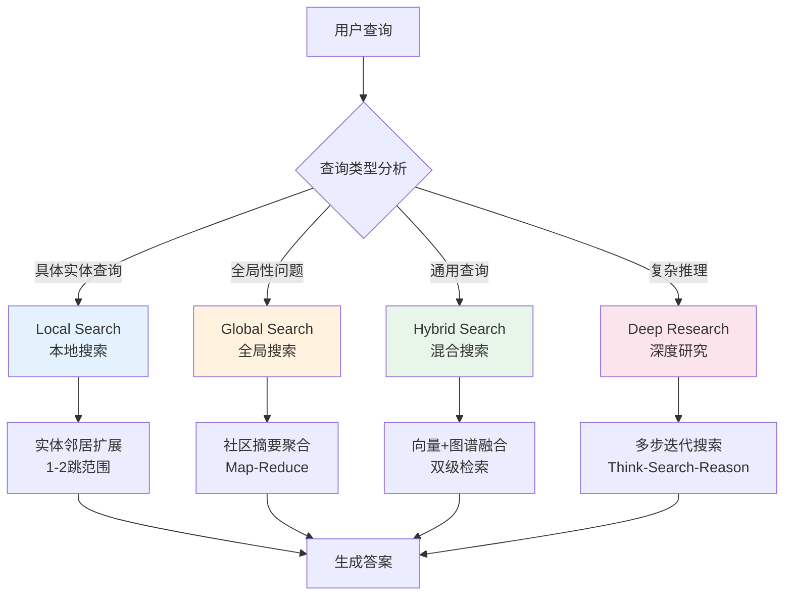
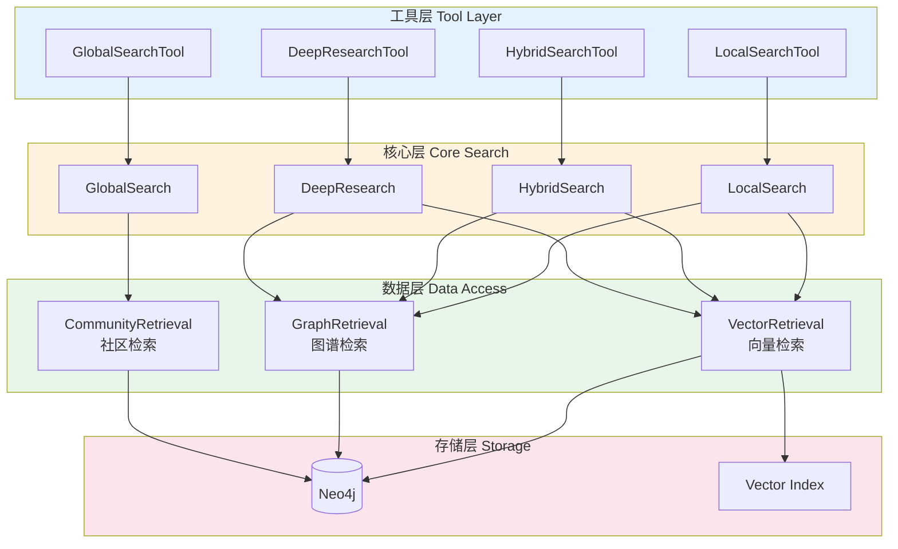
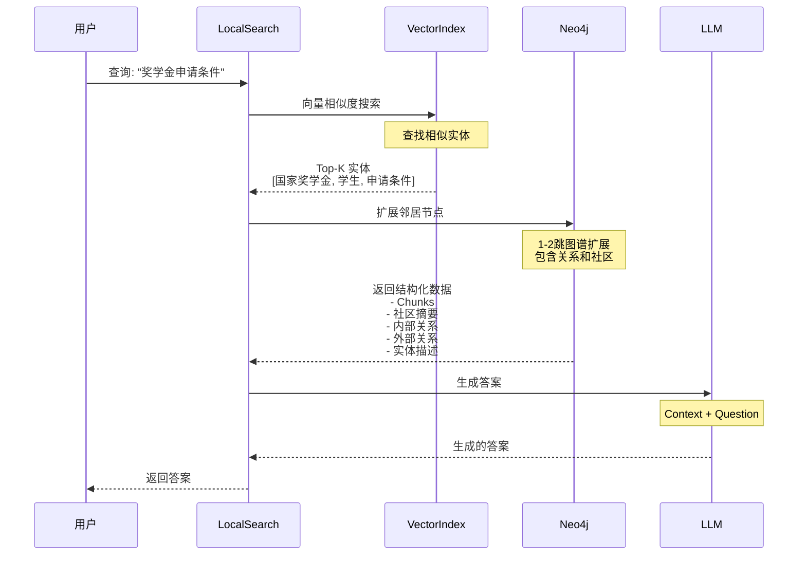
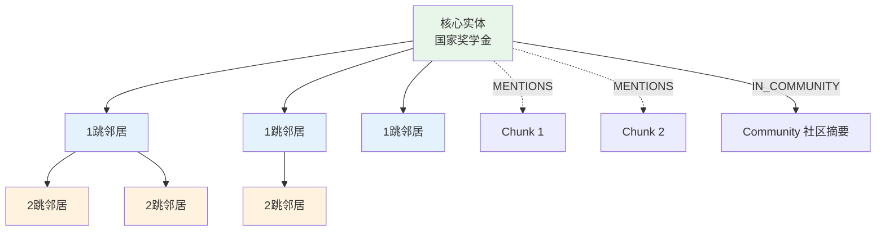
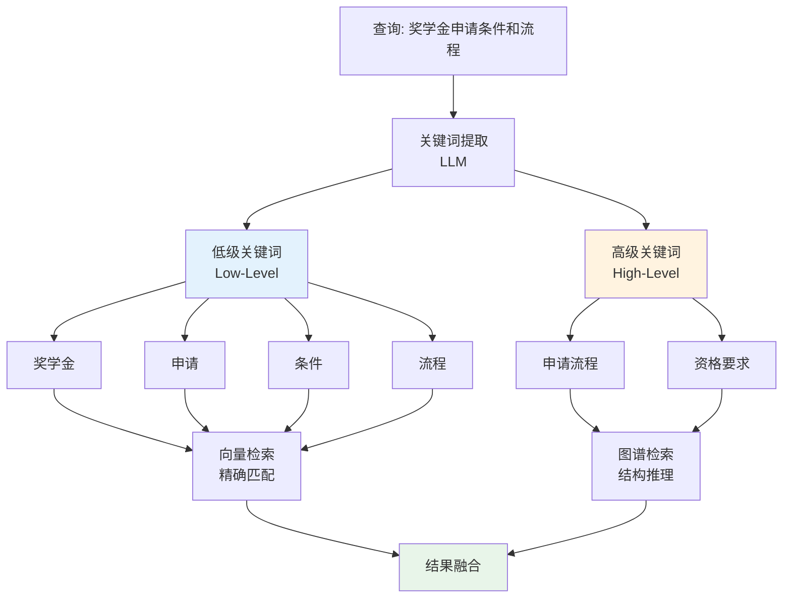
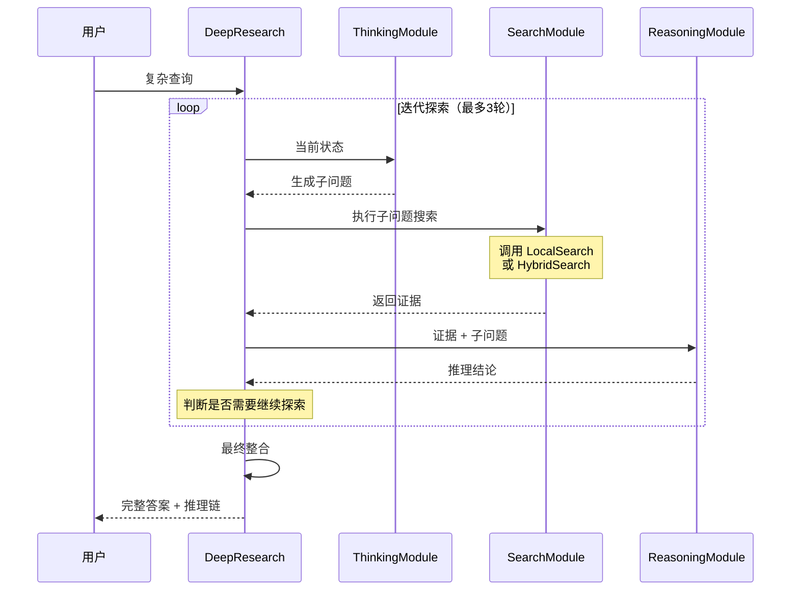
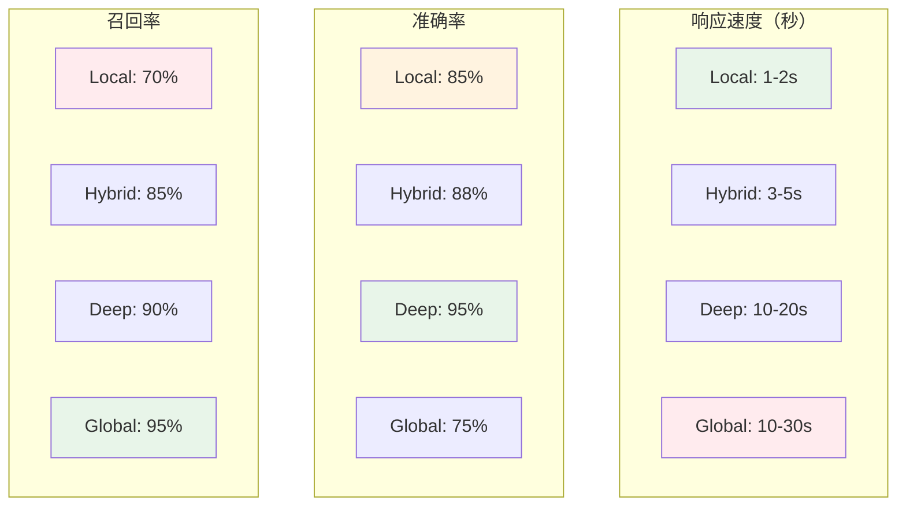
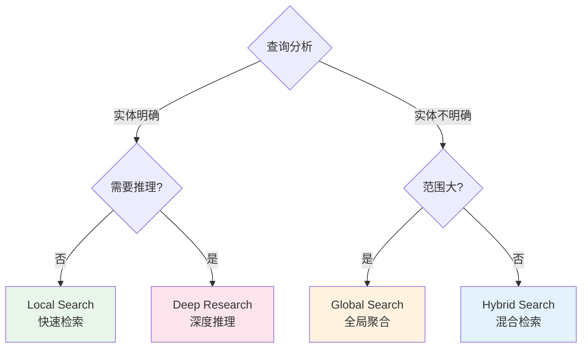

# 搜索引擎

---

## 📋 元信息

- **目标读者**：开发者、架构师
- **阅读时间**：50分钟
- **难度**：⭐⭐⭐
- **前置知识**：Neo4j Cypher、向量检索、图算法
- **最后更新**：2026-01-04

---

## 📖 本文大纲

- [系统概览](#系统概览)
- [Local Search（本地搜索）](#local-search本地搜索)
- [Global Search（全局搜索）](#global-search全局搜索)
- [Hybrid Search（混合搜索）](#hybrid-search混合搜索)
- [Deep Research（深度研究）](#deep-research深度研究)
- [搜索策略对比](#搜索策略对比)
- [向量检索实现](#向量检索实现)
- [图谱检索实现](#图谱检索实现)
- [性能优化](#性能优化)
- [配置参数](#配置参数)
- [相关文档](#相关文档)

---

## 系统概览

### 核心理念

搜索引擎是连接用户查询和知识图谱的关键桥梁，负责从海量图谱数据中高效、准确地检索相关信息。

**核心目标**：
1. **高召回率**：找到所有相关信息
2. **高准确率**：过滤无关信息
3. **低延迟**：快速返回结果
4. **可解释性**：提供检索路径和证据

### 四种搜索策略



### 架构层级



---

## Local Search（本地搜索）

### 核心思想

**实体为中心**：从查询中识别核心实体，探索其邻居节点和关系。

**适用场景**：
- "奖学金的申请条件是什么？"
- "学生违纪会受到什么处分？"
- "评审委员会的职责有哪些？"

### 工作流程



### 检索查询

**核心 Cypher 查询**：

```cypher
WITH collect(node) as nodes
WITH
collect {
    UNWIND nodes as n
    MATCH (n)<-[:MENTIONS]-(c:__Chunk__)
    WITH distinct c, count(distinct n) as freq
    RETURN {id:c.id, text: c.text} AS chunkText
    ORDER BY freq DESC
    LIMIT $topChunks
} AS text_mapping,
collect {
    UNWIND nodes as n
    MATCH (n)-[:IN_COMMUNITY]->(c:__Community__)
    WITH distinct c, c.community_rank as rank, c.weight AS weight
    RETURN c.summary
    ORDER BY rank, weight DESC
    LIMIT $topCommunities
} AS report_mapping,
collect {
    UNWIND nodes as n
    MATCH (n)-[r]-(m:__Entity__)
    WHERE NOT m IN nodes
    RETURN r.description AS descriptionText
    ORDER BY r.weight DESC
    LIMIT $topOutsideRels
} as outsideRels,
collect {
    UNWIND nodes as n
    MATCH (n)-[r]-(m:__Entity__)
    WHERE m IN nodes
    RETURN r.description AS descriptionText
    ORDER BY r.weight DESC
    LIMIT $topInsideRels
} as insideRels,
collect {
    UNWIND nodes as n
    RETURN n.description AS descriptionText
} as entities
RETURN {
    Chunks: text_mapping,
    Reports: report_mapping,
    Relationships: outsideRels + insideRels,
    Entities: entities
} AS text, 1.0 AS score, {} AS metadata
```

**查询解析**：

1. **Chunks**：提取提到核心实体的文本块，按频率排序
2. **Reports**：获取实体所属社区的摘要
3. **OutsideRels**：实体与外部实体的关系
4. **InsideRels**：核心实体之间的关系
5. **Entities**：实体本身的描述

### 邻居扩展策略



### 核心代码

```python
class LocalSearch:
    def __init__(self, llm, embeddings, response_type: str = "多个段落"):
        self.llm = llm
        self.embeddings = embeddings
        self.response_type = response_type

        # 检索参数
        self.top_chunks = LOCAL_SEARCH_SETTINGS["top_chunks"]             # 5
        self.top_communities = LOCAL_SEARCH_SETTINGS["top_communities"]   # 3
        self.top_outside_rels = LOCAL_SEARCH_SETTINGS["top_outside_relationships"]  # 10
        self.top_inside_rels = LOCAL_SEARCH_SETTINGS["top_inside_relationships"]    # 10
        self.top_entities = LOCAL_SEARCH_SETTINGS["top_entities"]         # 5

    def search(self, query: str) -> str:
        """执行本地搜索"""
        # 1. 初始化向量存储
        vector_store = from_existing_index(
            self.embeddings,
            index_name=self.index_name,
            retrieval_query=self.retrieval_query  # 上面的 Cypher 查询
        )

        # 2. 执行相似度搜索
        docs = vector_store.similarity_search(
            query,
            k=self.top_entities,
            params={
                "topChunks": self.top_chunks,
                "topCommunities": self.top_communities,
                "topOutsideRels": self.top_outside_rels,
                "topInsideRels": self.top_inside_rels,
            }
        )

        # 3. 使用 LLM 生成响应
        prompt = ChatPromptTemplate.from_messages([
            ("system", LC_SYSTEM_PROMPT),
            ("human", LOCAL_SEARCH_CONTEXT_PROMPT),
        ])

        chain = prompt | self.llm | StrOutputParser()

        response = chain.invoke({
            "context": docs[0].page_content if docs else "",
            "input": query,
            "response_type": self.response_type
        })

        return response
```

### 社区权重初始化

```python
def _init_community_weights(self):
    """初始化社区节点的权重（基于提到该社区的 chunk 数）"""
    self.db_query("""
    MATCH (n:`__Community__`)<-[:IN_COMMUNITY]-()<-[:MENTIONS]-(c)
    WITH n, count(distinct c) AS chunkCount
    SET n.weight = chunkCount
    """)
```

---

## Global Search（全局搜索）

### 核心思想

**社区为中心**：采用 Map-Reduce 模式，先对每个社区生成中间报告，再整合为全局答案。

**适用场景**：
- "总结所有奖学金类型"
- "学生可以获得哪些资助？"
- "学校有哪些管理规定？"

### 工作流程

```mermaid
graph TB
    Query[用户查询:<br/>"总结所有奖学金类型"]

    Query --> GetComm[获取社区数据]

    GetComm --> C1[社区1:<br/>国家奖学金]
    GetComm --> C2[社区2:<br/>学校奖学金]
    GetComm --> C3[社区3:<br/>社会奖学金]

    subgraph Map阶段[Map 阶段 - 并行处理]
        C1 --> M1[LLM生成:<br/>中间报告1]
        C2 --> M2[LLM生成:<br/>中间报告2]
        C3 --> M3[LLM生成:<br/>中间报告3]
    end

    M1 --> Reduce[Reduce阶段]
    M2 --> Reduce
    M3 --> Reduce

    Reduce --> LLM[LLM整合]
    LLM --> Answer[最终答案]

    style Map阶段 fill:#e3f2fd
    style Reduce fill:#fff3e0
    style Answer fill:#e8f5e9
```

### Map 阶段

**目标**：为每个社区生成中间报告。

```python
def _process_communities(self, query: str, communities: List[dict]) -> List[str]:
    """Map 阶段：处理社区数据生成中间结果"""
    # 设置 Map 提示模板
    map_prompt = ChatPromptTemplate.from_messages([
        ("system", MAP_SYSTEM_PROMPT),
        ("human", GLOBAL_SEARCH_MAP_PROMPT),
    ])

    map_chain = map_prompt | self.llm | StrOutputParser()

    results = []
    for community in tqdm(communities, desc="正在处理社区数据"):
        response = map_chain.invoke({
            "question": query,
            "context_data": community["output"]
        })
        results.append(response)

    return results
```

**Map 提示词**：

```python
MAP_SYSTEM_PROMPT = """
你是一个知识整理专家。你的任务是从给定的社区数据中提取与问题相关的信息。

**要求**：
1. 仅提取与问题直接相关的信息
2. 保持信息的准确性和完整性
3. 如果社区数据不包含相关信息，返回"无相关信息"
"""

GLOBAL_SEARCH_MAP_PROMPT = """
问题: {question}

社区数据:
{context_data}

请提取与问题相关的关键信息。
"""
```

### Reduce 阶段

**目标**：整合所有中间报告，生成全局答案。

```python
def _reduce_results(self, query: str, intermediate_results: List[str]) -> str:
    """Reduce 阶段：整合中间结果生成最终答案"""
    reduce_prompt = ChatPromptTemplate.from_messages([
        ("system", REDUCE_SYSTEM_PROMPT),
        ("human", GLOBAL_SEARCH_REDUCE_PROMPT),
    ])

    reduce_chain = reduce_prompt | self.llm | StrOutputParser()

    return reduce_chain.invoke({
        "report_data": intermediate_results,
        "question": query,
        "response_type": self.response_type,
    })
```

**Reduce 提示词**：

```python
REDUCE_SYSTEM_PROMPT = """
你是一个知识整合专家。你的任务是将多个中间报告整合为一个完整、连贯的答案。

**要求**：
1. 整合所有有价值的信息
2. 去除重复内容
3. 保持逻辑清晰
4. 输出格式为 {response_type}
"""

GLOBAL_SEARCH_REDUCE_PROMPT = """
问题: {question}

中间报告:
{report_data}

请整合以上报告，生成一个完整的答案。
"""
```

### 社区数据获取

```python
def _get_community_data(self, level: int) -> List[dict]:
    """获取指定层级的社区数据"""
    return self.graph.query(
        """
        MATCH (c:__Community__)
        WHERE c.level = $level
        RETURN {communityId:c.id, full_content:c.full_content} AS output
        """,
        params={"level": level},
    )
```

### 完整搜索流程

```python
class GlobalSearch:
    def search(self, query: str, level: int) -> str:
        """执行全局搜索"""
        # 1. 获取社区数据
        communities = self._get_community_data(level)

        # 2. Map 阶段：处理社区数据
        intermediate_results = self._process_communities(query, communities)

        # 3. Reduce 阶段：生成最终答案
        return self._reduce_results(query, intermediate_results)
```

---

## Hybrid Search（混合搜索）

### 核心思想

**双级检索**：结合向量检索（语义匹配）和图谱检索（结构推理），平衡准确率和召回率。

**适用场景**：
- 大部分通用查询
- 既需要语义理解又需要结构推理的查询

### 双级关键词提取



### 关键词提取实现

```python
def extract_keywords(self, query: str) -> Dict[str, List[str]]:
    """提取双级关键词"""
    # 调用 LLM 提取关键词
    prompt = """
    请从以下查询中提取关键词，分为两类：

    1. 低级关键词（low_level）：具体的实体名称、操作动词
    2. 高级关键词（high_level）：抽象概念、主题

    查询: {query}

    请以 JSON 格式输出：
    {{
        "low_level": ["关键词1", "关键词2", ...],
        "high_level": ["关键词1", "关键词2", ...]
    }}
    """

    result = self.keyword_chain.invoke({"query": query})

    # 解析 JSON
    keywords = json.loads(result)

    return keywords
```

### 向量检索

```python
def _vector_search(self, query: str, keywords: Dict, top_k: int = 5) -> List[Dict]:
    """向量检索（使用低级关键词）"""
    # 1. 生成查询向量
    query_vec = self.embeddings.embed_query(query)

    # 2. 向量相似度搜索
    cypher = """
    CALL db.index.vector.queryNodes(
        'entity_index',
        $top_k,
        $query_vec
    )
    YIELD node, score
    RETURN node.id AS entity_id,
           node.description AS description,
           score
    ORDER BY score DESC
    """

    results = self.graph.query(cypher, params={
        'top_k': top_k,
        'query_vec': query_vec
    })

    return results
```

### 图谱检索

```python
def _graph_search(self, keywords: Dict, max_hops: int = 2) -> List[Dict]:
    """图谱检索（使用高级关键词）"""
    high_level_keywords = keywords.get("high_level", [])

    if not high_level_keywords:
        return []

    # 基于关键词的图谱扩展
    cypher = """
    MATCH (e:`__Entity__`)
    WHERE any(kw IN $keywords WHERE toLower(e.id) CONTAINS toLower(kw))

    // 扩展邻居（最多 max_hops 跳）
    CALL apoc.path.subgraphNodes(e, {
        maxLevel: $max_hops,
        relationshipFilter: "RELATES_TO"
    })
    YIELD node

    // 收集实体和关系
    WITH collect(distinct node) AS nodes
    UNWIND nodes AS n
    MATCH (n)-[r]-(m)
    WHERE m IN nodes

    RETURN n.id AS entity_id,
           n.description AS description,
           type(r) AS relationship,
           r.description AS rel_description,
           m.id AS related_entity
    """

    results = self.graph.query(cypher, params={
        'keywords': high_level_keywords,
        'max_hops': max_hops
    })

    return results
```

### 结果融合

```python
def _merge_results(self, vector_results: List[Dict],
                  graph_results: List[Dict],
                  alpha: float = 0.6, beta: float = 0.4) -> List[Dict]:
    """加权融合向量和图谱检索结果"""
    # 1. 归一化向量结果的分数
    if vector_results:
        max_vec_score = max(r['score'] for r in vector_results)
        for r in vector_results:
            r['normalized_score'] = r['score'] / max_vec_score

    # 2. 归一化图谱结果的分数（基于路径长度）
    if graph_results:
        for r in graph_results:
            # 路径越短，分数越高
            r['normalized_score'] = 1.0 / (r.get('path_length', 1) + 1)

    # 3. 合并并去重
    entity_scores = {}

    for r in vector_results:
        entity_id = r['entity_id']
        entity_scores[entity_id] = {
            'entity_id': entity_id,
            'description': r['description'],
            'score': alpha * r['normalized_score'],
            'source': 'vector'
        }

    for r in graph_results:
        entity_id = r['entity_id']
        if entity_id in entity_scores:
            # 实体已存在，合并分数
            entity_scores[entity_id]['score'] += beta * r['normalized_score']
            entity_scores[entity_id]['source'] = 'hybrid'
        else:
            entity_scores[entity_id] = {
                'entity_id': entity_id,
                'description': r['description'],
                'score': beta * r['normalized_score'],
                'source': 'graph'
            }

    # 4. 排序并返回
    merged = sorted(
        entity_scores.values(),
        key=lambda x: x['score'],
        reverse=True
    )

    return merged
```

### 完整搜索流程

```python
class HybridSearchTool:
    def search(self, query: str) -> str:
        """执行混合搜索"""
        # 1. 提取关键词
        keywords = self.extract_keywords(query)

        # 2. 向量检索
        vector_results = self._vector_search(query, keywords, top_k=5)

        # 3. 图谱检索
        graph_results = self._graph_search(keywords, max_hops=2)

        # 4. 融合结果
        merged_results = self._merge_results(
            vector_results,
            graph_results,
            alpha=0.6,  # 向量权重
            beta=0.4    # 图谱权重
        )

        # 5. 生成答案
        context = self._format_results(merged_results)

        prompt = ChatPromptTemplate.from_messages([
            ("system", LC_SYSTEM_PROMPT),
            ("human", HYBRID_TOOL_QUERY_PROMPT),
        ])

        chain = prompt | self.llm | StrOutputParser()

        response = chain.invoke({
            "context": context,
            "question": query,
            "response_type": self.response_type
        })

        return response
```

### 回退策略

当图谱中没有匹配实体时，使用 Chunk 关键词搜索作为回退：

```python
def _fallback_chunk_keyword_search(self, query: str, keywords: List[str],
                                   limit: int = 5) -> List[Dict]:
    """基于关键词的 Chunk 文本匹配检索（回退策略）"""
    # 使用 jieba 分词作为保底
    if not keywords:
        import jieba
        keywords = jieba.lcut(query)

    # Chunk 文本匹配查询
    chunk_query = """
    MATCH (c:__Chunk__)
    WITH c, size([w IN $keywords WHERE c.text CONTAINS w]) AS hits
    WHERE hits > 0
    RETURN c.id AS id,
           c.text AS text,
           c.fileName AS fileName,
           hits AS hits
    ORDER BY hits DESC
    LIMIT $limit
    """

    results = self.graph.query(chunk_query, params={
        'keywords': keywords[:8],  # 限制关键词数量
        'limit': limit
    })

    return results
```

---

## Deep Research（深度研究）

### 核心思想

**多步迭代**：Think-Search-Reason 循环，逐步深入探索知识图谱。

**适用场景**：
- 复杂多跳推理
- 需要展示推理过程
- 研究性查询

### 工作流程



### Thinking 模块

```python
class ThinkingModule:
    def analyze(self, query: str, context: Dict) -> Dict:
        """分析当前状态，生成子问题"""
        prompt = """
        当前查询: {query}

        已知信息:
        {context}

        请分析以下内容：
        1. 当前信息是否足够回答问题？
        2. 还需要探索哪些方向？
        3. 下一步应该搜索什么？

        请以 JSON 格式输出：
        {{
            "is_sufficient": true/false,
            "sub_questions": ["子问题1", "子问题2", ...],
            "reasoning": "推理过程"
        }}
        """

        result = self.llm.invoke(prompt.format(
            query=query,
            context=json.dumps(context, ensure_ascii=False)
        ))

        return json.loads(result.content)
```

### Search 模块

```python
class SearchModule:
    def execute(self, sub_question: str) -> Dict:
        """执行子问题搜索"""
        # 选择搜索策略
        if self._is_local_query(sub_question):
            # 使用本地搜索
            result = self.local_search.search(sub_question)
        else:
            # 使用混合搜索
            result = self.hybrid_search.search(sub_question)

        return {
            "question": sub_question,
            "evidence": result,
            "source": "local" if self._is_local_query(sub_question) else "hybrid"
        }
```

### Reasoning 模块

```python
class ReasoningModule:
    def integrate(self, query: str, evidences: List[Dict]) -> Dict:
        """整合证据，生成推理结论"""
        prompt = """
        原始问题: {query}

        收集的证据:
        {evidences}

        请基于以上证据，进行推理并生成结论。

        输出格式：
        {{
            "conclusion": "推理结论",
            "supporting_evidence": ["证据1", "证据2", ...],
            "reasoning_chain": ["推理步骤1", "推理步骤2", ...]
        }}
        """

        result = self.llm.invoke(prompt.format(
            query=query,
            evidences=json.dumps(evidences, ensure_ascii=False)
        ))

        return json.loads(result.content)
```

### 迭代控制

```python
class DeepResearch:
    def research(self, query: str, max_iterations: int = 3) -> Dict:
        """执行深度研究"""
        context = {"evidences": [], "reasoning_steps": []}

        for iteration in range(max_iterations):
            # 1. Thinking：分析当前状态
            thinking_result = self.thinking.analyze(query, context)

            if thinking_result["is_sufficient"]:
                # 信息足够，停止迭代
                break

            # 2. Search：执行子问题搜索
            for sub_q in thinking_result["sub_questions"]:
                evidence = self.search.execute(sub_q)
                context["evidences"].append(evidence)

            # 3. Reasoning：推理整合
            reasoning_result = self.reasoning.integrate(query, context["evidences"])
            context["reasoning_steps"].append(reasoning_result)

        # 4. 生成最终答案
        final_answer = self._generate_final_answer(query, context)

        return {
            "answer": final_answer,
            "thinking_steps": context["reasoning_steps"],
            "evidences": context["evidences"]
        }
```

### 知识图谱探索

```python
def explore_graph(self, entity: str, max_depth: int = 3) -> Dict:
    """探索知识图谱（深度优先）"""
    cypher = """
    MATCH path = (start:`__Entity__` {id: $entity})-[*1..$max_depth]-(end)
    RETURN path,
           length(path) AS depth,
           [n IN nodes(path) | n.id] AS entities,
           [r IN relationships(path) | type(r)] AS relations
    ORDER BY depth
    LIMIT 20
    """

    paths = self.graph.query(cypher, params={
        'entity': entity,
        'max_depth': max_depth
    })

    return {
        "entity": entity,
        "paths": paths,
        "exploration_depth": max_depth
    }
```

---

## 搜索策略对比

### 功能对比表

| 特性 | Local Search | Global Search | Hybrid Search | Deep Research |
|------|--------------|---------------|---------------|---------------|
| **检索范围** | 实体邻居（1-2跳） | 所有社区 | 向量+图谱 | 迭代扩展 |
| **检索粒度** | 细粒度 | 粗粒度 | 中等粒度 | 自适应 |
| **响应速度** | 快（1-2s） | 慢（10-30s） | 中（3-5s） | 慢（10-20s） |
| **准确率** | 高 | 中 | 高 | 极高 |
| **召回率** | 中 | 高 | 高 | 极高 |
| **推理能力** | 低 | 低 | 中 | 高 |
| **可解释性** | 中 | 低 | 中 | 极高 |
| **适用查询** | 具体实体查询 | 全局性问题 | 通用查询 | 复杂推理 |
| **资源消耗** | 低 | 高 | 中 | 高 |

### 性能对比



### 选择建议



---

## 向量检索实现

### 向量索引

```cypher
-- 实体向量索引
CREATE VECTOR INDEX entity_index IF NOT EXISTS
FOR (e:`__Entity__`)
ON e.embedding
OPTIONS {
    indexConfig: {
        `vector.dimensions`: 1536,
        `vector.similarity_function`: 'cosine'
    }
}

-- Chunk 向量索引
CREATE VECTOR INDEX chunk_index IF NOT EXISTS
FOR (c:`__Chunk__`)
ON c.embedding
OPTIONS {
    indexConfig: {
        `vector.dimensions`: 1536,
        `vector.similarity_function`: 'cosine'
    }
}
```

### 向量搜索

```python
def vector_search(query: str, index_name: str, top_k: int = 5) -> List[Dict]:
    """向量相似度搜索"""
    # 1. 向量化查询
    query_vec = embeddings.embed_query(query)

    # 2. 调用向量索引
    cypher = """
    CALL db.index.vector.queryNodes(
        $index_name,
        $top_k,
        $query_vec
    )
    YIELD node, score
    RETURN node, score
    ORDER BY score DESC
    """

    results = graph.query(cypher, params={
        'index_name': index_name,
        'top_k': top_k,
        'query_vec': query_vec
    })

    return results
```

### 向量生成优化

```python
def batch_generate_embeddings(texts: List[str], batch_size: int = 64) -> List[List[float]]:
    """批量生成向量（优化性能）"""
    embeddings = []

    for i in range(0, len(texts), batch_size):
        batch = texts[i:i + batch_size]
        batch_embeddings = embedding_model.embed_documents(batch)
        embeddings.extend(batch_embeddings)

    return embeddings
```

---

## 图谱检索实现

### 路径查询

```cypher
-- 查找两个实体之间的路径
MATCH path = shortestPath(
    (e1:`__Entity__` {id: $entity1})-[*..5]-(e2:`__Entity__` {id: $entity2})
)
RETURN path
```

### 邻居扩展

```cypher
-- N 跳邻居扩展
MATCH (e:`__Entity__` {id: $entity})
CALL apoc.path.subgraphNodes(e, {
    maxLevel: $max_hops,
    relationshipFilter: "RELATES_TO"
})
YIELD node
RETURN collect(distinct node) AS neighbors
```

### 社区聚合

```cypher
-- 获取实体所属社区的所有实体
MATCH (e:`__Entity__` {id: $entity})-[:IN_COMMUNITY]->(c:`__Community__`)
MATCH (c)<-[:IN_COMMUNITY]-(other:`__Entity__`)
RETURN collect(distinct other) AS community_members
```

---

## 性能优化

### 缓存策略

```python
class SearchCache:
    def __init__(self):
        self.cache = {}

    def get(self, key: str) -> Optional[str]:
        """获取缓存"""
        return self.cache.get(key)

    def set(self, key: str, value: str):
        """设置缓存"""
        self.cache[key] = value

# 使用缓存
cache = SearchCache()

def search_with_cache(query: str) -> str:
    # 检查缓存
    cached_result = cache.get(query)
    if cached_result:
        return cached_result

    # 执行搜索
    result = search(query)

    # 缓存结果
    cache.set(query, result)

    return result
```

### 批量查询

```python
def batch_search(queries: List[str]) -> List[str]:
    """批量搜索（并行）"""
    with ThreadPoolExecutor(max_workers=4) as executor:
        futures = [executor.submit(search, q) for q in queries]
        results = [f.result() for f in futures]

    return results
```

### 查询优化

```cypher
-- 使用索引加速查询
CREATE INDEX entity_type_index IF NOT EXISTS
FOR (e:`__Entity__`) ON (e.type);

-- 使用参数化查询
MATCH (e:`__Entity__`)
WHERE e.type = $entity_type
RETURN e
```

---

## 配置参数

### Local Search 配置

```python
LOCAL_SEARCH_SETTINGS = {
    "top_chunks": 5,                 # 检索的 Chunk 数量
    "top_communities": 3,            # 检索的社区数量
    "top_outside_relationships": 10, # 外部关系数量
    "top_inside_relationships": 10,  # 内部关系数量
    "top_entities": 5,               # 检索的实体数量
    "index_name": "entity_index"     # 向量索引名称
}
```

### Hybrid Search 配置

```python
HYBRID_SEARCH_SETTINGS = {
    "entity_limit": 10,         # 实体检索数量
    "max_hop_distance": 2,      # 最大跳数
    "top_communities": 5,       # 社区数量
    "batch_size": 100,          # 批处理大小
    "community_level": 0,       # 社区层级
    "vector_weight": 0.6,       # 向量权重
    "graph_weight": 0.4         # 图谱权重
}
```

### Deep Research 配置

```python
DEEP_RESEARCH_SETTINGS = {
    "max_iterations": 3,        # 最大迭代次数
    "max_exploration_depth": 3, # 图谱探索深度
    "evidence_threshold": 5     # 证据数量阈值
}
```

---

## 相关文档

- [Agent系统](./Agent系统.md) - 了解如何将搜索引擎集成到 Agent
- [知识图谱构建](./知识图谱构建.md) - 了解搜索的数据来源
- [系统架构总览](../01-整体架构/系统架构总览.md) - 了解整体架构
- [Neo4j Cypher 文档](https://neo4j.com/docs/cypher-manual/) - Cypher 查询语言
- [LangChain Retrieval 文档](https://python.langchain.com/docs/modules/data_connection/) - 检索模块

---

## 更新日志

| 版本 | 日期 | 更新内容 | 作者 |
|------|------|----------|------|
| 1.0 | 2026-01-04 | 初始版本，完整覆盖4种搜索策略 | Claude |
| - | - | - | - |
