# 知识图谱构建

---

## 📋 元信息

- **目标读者**：开发者、架构师
- **阅读时间**：60分钟
- **难度**：⭐⭐⭐
- **前置知识**：Neo4j、图数据库、LLM、向量嵌入
- **最后更新**：2026-01-04

---

## 📖 本文大纲

- [系统概览](#系统概览)
- [完整构建流程](#完整构建流程)
- [文档摄取与分块](#文档摄取与分块)
- [实体关系提取](#实体关系提取)
- [实体消歧机制](#实体消歧机制)
- [实体对齐机制](#实体对齐机制)
- [Neo4j 图谱存储](#neo4j-图谱存储)
- [社区检测](#社区检测)
- [向量索引构建](#向量索引构建)
- [增量 vs 全量构建](#增量-vs-全量构建)
- [配置参数详解](#配置参数详解)
- [性能优化](#性能优化)
- [相关文档](#相关文档)

---

## 系统概览

### 核心理念

知识图谱构建是本项目的核心基础设施，负责将非结构化文档转换为结构化的知识图谱。

**核心目标**：
1. **高质量实体提取**：准确识别文档中的实体和关系
2. **消除歧义**：通过多阶段消歧，将 mention 映射到规范实体
3. **冲突解决**：检测并解决实体冲突，保证图谱一致性
4. **可扩展性**：支持增量更新，适应大规模知识库

### 架构层级

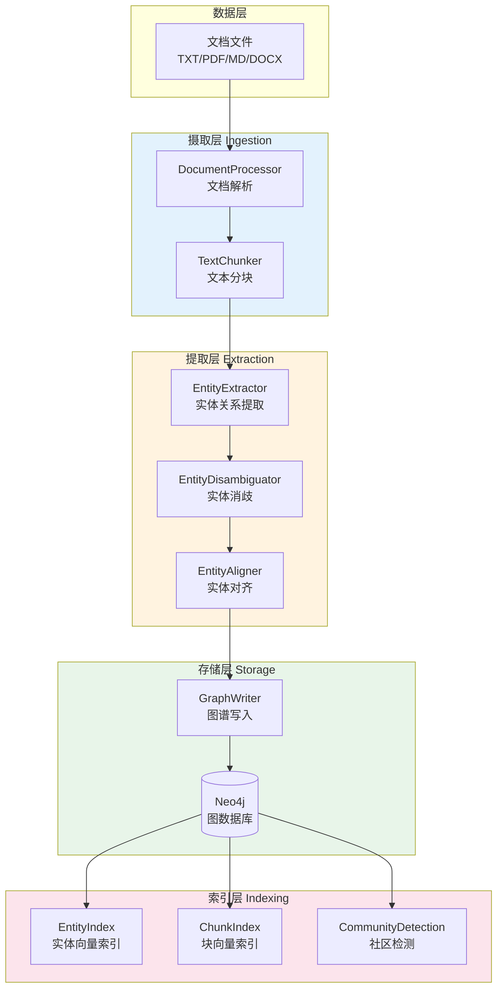

---

## 完整构建流程

### 主流程图

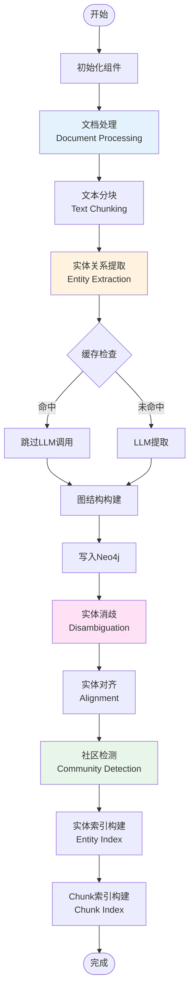

### 关键阶段时序

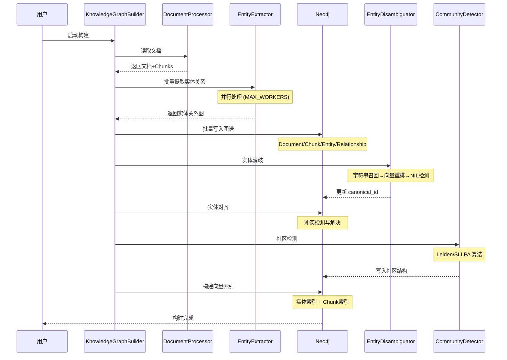

### 数据流转

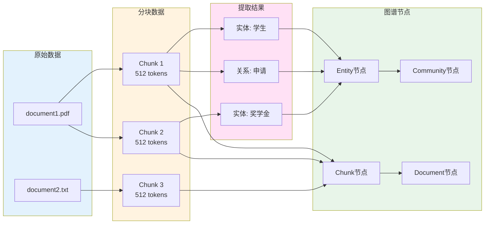

---

## 文档摄取与分块

### DocumentProcessor

**核心功能**：支持多格式文档解析和文本提取。

**支持的文件格式**：
- TXT
- PDF
- Markdown (MD)
- Word (DOCX, DOC)
- CSV
- JSON
- YAML

**处理流程**：

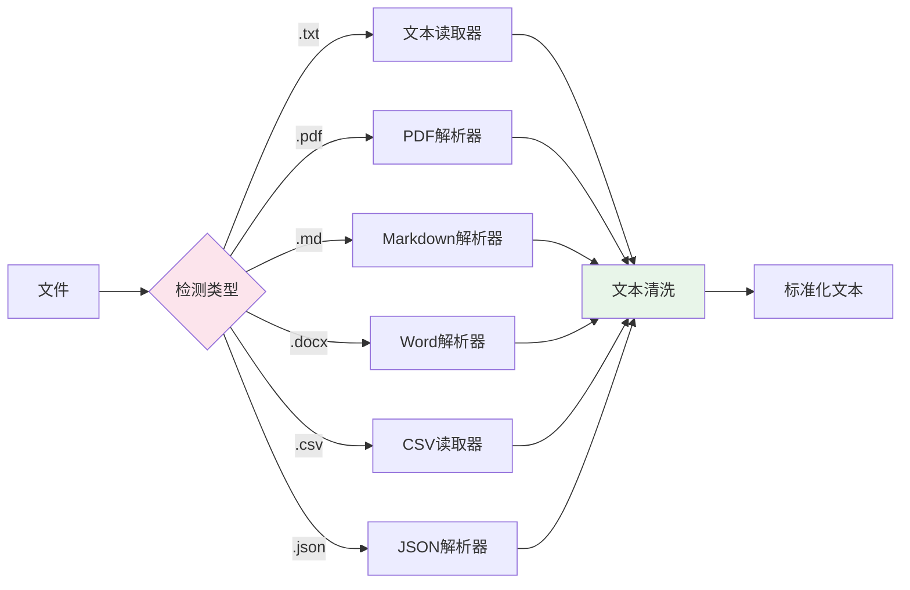

**核心代码**：

```python
class DocumentProcessor:
    def __init__(self, files_dir: str, chunk_size: int = 512, overlap: int = 50):
        self.files_dir = files_dir
        self.chunk_size = chunk_size
        self.overlap = overlap
        self.chunker = TextChunker(chunk_size, overlap)

    def process_all_files(self) -> List[Tuple]:
        """处理所有文件"""
        files = self._list_files()
        results = []

        for file_path in files:
            # 读取文件内容
            content = self._read_file(file_path)

            # 分块
            chunks = self.chunker.chunk(content)

            # 生成唯一ID
            doc_id = generate_hash(file_path)

            results.append((doc_id, file_path, chunks))

        return results

    def _read_file(self, file_path: str) -> str:
        """根据文件类型选择读取器"""
        ext = os.path.splitext(file_path)[1].lower()

        if ext == '.pdf':
            return self._read_pdf(file_path)
        elif ext in ['.docx', '.doc']:
            return self._read_word(file_path)
        elif ext == '.txt':
            return self._read_text(file_path)
        elif ext == '.md':
            return self._read_markdown(file_path)
        elif ext == '.csv':
            return self._read_csv(file_path)
        elif ext == '.json':
            return self._read_json(file_path)
        else:
            raise ValueError(f"不支持的文件类型: {ext}")
```

### TextChunker

**分块策略**：滑动窗口 + 重叠

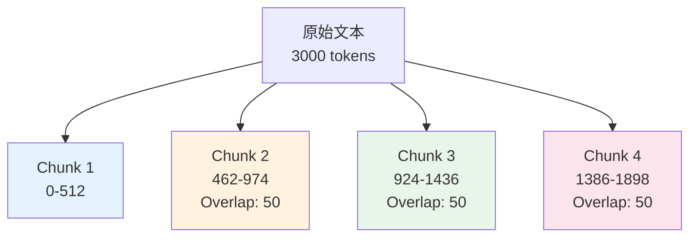

**核心代码**：

```python
class TextChunker:
    def __init__(self, chunk_size: int = 512, overlap: int = 50):
        self.chunk_size = chunk_size
        self.overlap = overlap

    def chunk(self, text: str) -> List[str]:
        """分块文本"""
        # 使用 tiktoken 进行 token 级别的分块
        encoding = tiktoken.get_encoding("cl100k_base")
        tokens = encoding.encode(text)

        chunks = []
        start = 0

        while start < len(tokens):
            end = min(start + self.chunk_size, len(tokens))
            chunk_tokens = tokens[start:end]

            # 解码为文本
            chunk_text = encoding.decode(chunk_tokens)
            chunks.append(chunk_text)

            # 下一个块的起始位置（考虑重叠）
            start += self.chunk_size - self.overlap

        return chunks
```

**配置参数**：
```env
# .env
CHUNK_SIZE=512          # 每个块的大小（token数）
OVERLAP=50              # 块之间的重叠（token数）
```

**重叠的作用**：
- 避免实体被切断
- 保留上下文连贯性
- 提高提取准确率

---

## 实体关系提取

### LLM 提示工程

**系统提示模板**：

```python
system_template_build_graph = """
你是一个知识图谱构建专家。你的任务是从给定文本中提取实体和关系。

**实体类型**：{entity_types}
**关系类型**：{relationship_types}

**输出格式**：
每行一个三元组，格式为：实体1 : 关系 : 实体2

**示例**：
学生 : 申请 : 奖学金
奖学金 : 由...评选 : 评审委员会

**要求**：
1. 仅提取明确存在的实体和关系
2. 实体名称使用规范化形式
3. 避免重复提取
4. 每行仅包含一个三元组
"""
```

**人类提示模板**：

```python
human_template_build_graph = """
请从以下文本中提取实体和关系：

{text}

请按照指定格式输出。
"""
```

### 批量并行提取

**架构设计**：

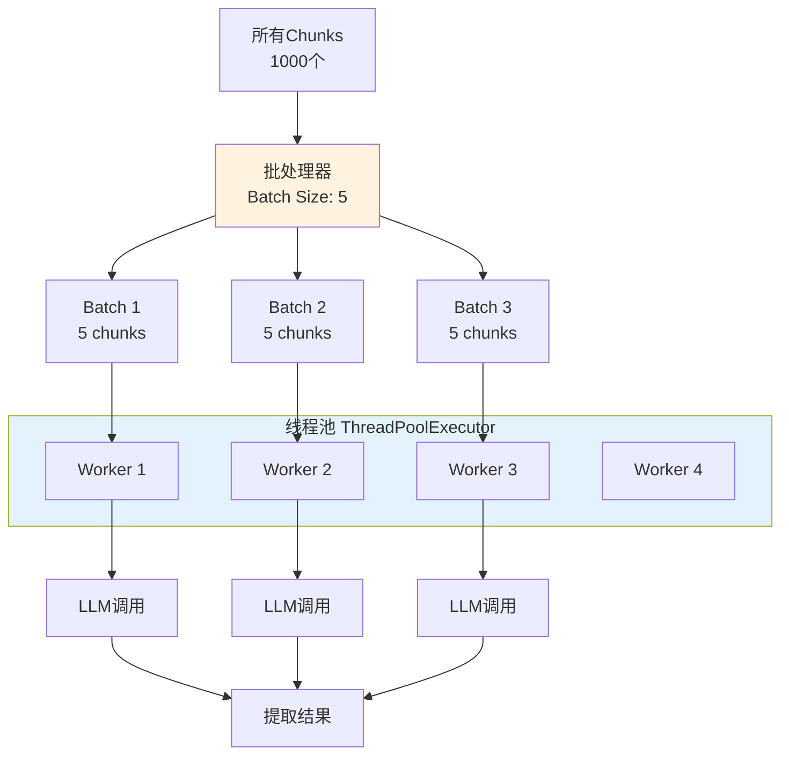

**核心代码**：

```python
class EntityRelationExtractor:
    def __init__(self, llm, system_template, human_template,
                 entity_types, relationship_types,
                 max_workers=4, batch_size=5):
        self.llm = llm
        self.max_workers = max_workers
        self.batch_size = batch_size

        # 创建提示模板
        self.chat_prompt = ChatPromptTemplate.from_messages([
            SystemMessagePromptTemplate.from_template(system_template),
            MessagesPlaceholder("chat_history"),
            HumanMessagePromptTemplate.from_template(human_template)
        ])

        self.chain = self.chat_prompt | self.llm

    def process_chunks(self, file_contents: List[Tuple],
                      progress_callback=None) -> List[Tuple]:
        """并行处理所有文件的所有 chunks"""
        t0 = time.time()
        total_chunks = sum(len(fc[2]) for fc in file_contents)

        with ThreadPoolExecutor(max_workers=self.max_workers) as executor:
            futures = []

            for doc_id, file_name, chunks in file_contents:
                for chunk_index, chunk in enumerate(chunks):
                    future = executor.submit(
                        self._extract_from_chunk,
                        chunk
                    )
                    futures.append((doc_id, file_name, chunk_index, future))

            # 收集结果
            results = []
            for doc_id, file_name, chunk_index, item in futures:
                result = item.result()

                results.append((doc_id, file_name, chunk_index, result))

                if progress_callback:
                    progress_callback()

        print(f"提取完成，耗时: {time.time() - t0:.2f}秒")

        return results

    @retry(max_attempts=3, delay=2)
    def _extract_from_chunk(self, chunk: str) -> str:
        """从单个 chunk 提取实体关系"""
        # 调用 LLM（带超时）
        with _alarm_timeout(OPENAI_REQUEST_TIMEOUT_SECONDS):
            response = self.chain.invoke({
                "text": chunk,
                "chat_history": []
            })

        result = response.content

        return result
```

### 解析提取结果

**原始 LLM 输出**：
```
学生 : 申请 : 国家奖学金
国家奖学金 : 评选 : 评审委员会
学生 : 违反 : 学校规定
学校规定 : 管理 : 学生行为
```

**解析流程**：

```python
def parse_llm_output(output: str) -> Dict[str, List]:
    """解析 LLM 输出为结构化数据"""
    entities = set()
    relationships = []

    lines = output.strip().split('\n')

    for line in lines:
        parts = line.split(' : ')
        if len(parts) != 3:
            continue  # 跳过格式错误的行

        entity1, relation, entity2 = [p.strip() for p in parts]

        # 添加实体
        entities.add(entity1)
        entities.add(entity2)

        # 添加关系
        relationships.append({
            'source': entity1,
            'target': entity2,
            'type': relation
        })

    return {
        'entities': list(entities),
        'relationships': relationships
    }
```

### 性能优化

本项目 v3 strict 阶段不再提供图谱构建的本地落盘缓存；性能主要依赖并发、批处理与超时控制。

**批处理配置**：
```env
MAX_WORKERS=4          # 并行线程数
LLM_BATCH_SIZE=5       # 每批处理的 chunk 数
BATCH_SIZE=100         # 数据库批处理大小
```

**超时保护**：
```python
@contextmanager
def _alarm_timeout(seconds: float):
    """通过 SIGALRM 强制限制阻塞调用的最长耗时"""
    def _handler(signum, frame):
        raise LlmInvokeTimeoutError(f"LLM invoke 超时（>{seconds}s）")

    signal.signal(signal.SIGALRM, _handler)
    signal.setitimer(signal.ITIMER_REAL, float(seconds))
    try:
        yield
    finally:
        signal.setitimer(signal.ITIMER_REAL, 0)
```

---

## 实体消歧机制

### 三阶段消歧流程

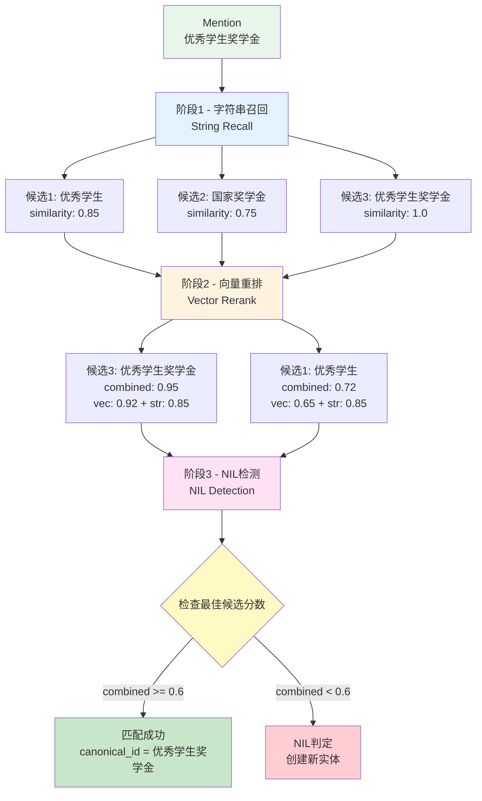

### 阶段1：字符串召回

**目标**：快速召回可能匹配的候选实体。

**算法**：Levenshtein 编辑距离

#### 算法原理

**定义**：Levenshtein 距离衡量两个字符串之间的"编辑距离"，即将一个字符串转换为另一个字符串所需的最少单字符编辑操作次数。

**允许的操作**：
1. **插入**（Insertion）：在任意位置插入一个字符
2. **删除**（Deletion）：删除任意一个字符
3. **替换**（Substitution）：将一个字符替换为另一个字符

**数学公式**：

给定两个字符串 $a$ 和 $b$，长度分别为 $|a|$ 和 $|b|$，Levenshtein 距离 $\text{lev}(a, b)$ 定义为：

$$
\text{lev}(a, b) =
\begin{cases}
|a| & \text{if } |b| = 0 \\
|b| & \text{if } |a| = 0 \\
\text{lev}(a[0:], b[0:]) & \text{if } a[0] = b[0] \\
1 + \min
\begin{cases}
\text{lev}(a[1:], b) & \text{删除 } a[0] \\
\text{lev}(a, b[1:]) & \text{插入 } b[0] \\
\text{lev}(a[1:], b[1:]) & \text{替换 } a[0] \text{ 为 } b[0]
\end{cases} & \text{otherwise}
\end{cases}
$$

**相似度转换**：

在实体消歧中，我们使用**相似度**而非距离，转换公式为：

$$
\text{similarity}(a, b) = 1 - \frac{\text{lev}(a, b)}{\max(|a|, |b|)}
$$

其中：
- $\text{lev}(a, b)$：编辑距离
- $\max(|a|, |b|)$：两个字符串的最大长度
- $\text{similarity} \in [0, 1]$：1 表示完全相同，0 表示完全不同

#### 计算示例

**示例 1**：完全匹配
```
a = "优秀学生"
b = "优秀学生"

lev(a, b) = 0
similarity = 1 - \frac{0}{4} = 1.0
```

**示例 2**：单字符差异
```
a = "优秀学生"
b = "优秀生"

编辑步骤：
1. 删除 "学" (1次操作)
lev(a, b) = 1
similarity = 1 - \frac{1}{4} = 0.75
```

**示例 3**：多个差异
```
a = "国家奖学金"
b = "国家励志奖学金"

编辑步骤：
1. 插入 "励志" (2次操作)
lev(a, b) = 2
similarity = 1 - \frac{2}{6} = 0.667
```

**示例 4**：完全不同
```
a = "奖学金"
b = "处分"

编辑步骤：
1. 替换 "奖" → "处"
2. 替换 "学" → "分"
lev(a, b) = 2
similarity = 1 - \frac{2}{2} = 0.0
```

#### 动态规划实现

**状态转移矩阵**：

以 `"kitten"` → `"sitting"` 为例：

```
      ""  s  i  t  t  i  n  g
   ""  0  1  2  3  4  5  6  7
   k   1  1  2  3  4  5  6  7
   i   2  2  1  2  3  4  5  6
   t   3  3  2  1  2  3  4  5
   t   4  4  3  2  1  2  3  4
   e   5  5  4  3  2  2  3  4
   n   6  6  5  4  3  3  2  3
```

**转移方程**：

$$
\text{dp}[i][j] =
\begin{cases}
j & \text{if } i = 0 \\
i & \text{if } j = 0 \\
\text{dp}[i-1][j-1] & \text{if } a[i] = b[j] \text{ (字符相同)} \\
1 + \min
\begin{cases}
\text{dp}[i-1][j] & \text{(删除)} \\
\text{dp}[i][j-1] & \text{(插入)} \\
\text{dp}[i-1][j-1] & \text{(替换)}
\end{cases} & \text{otherwise}
\end{cases}
$$

#### 算法复杂度

| 复杂度类型 | 值 | 说明 |
|-----------|-----|------|
| **时间复杂度** | O(m × n) | m, n 分别为两个字符串的长度 |
| **空间复杂度** | O(m × n) | 需要存储整个 dp 矩阵 |
| **优化空间** | O(min(m, n)) | 只保留前一行和当前行 |

#### 在实体消歧中的应用

**为什么选择 Levenshtein 距离**？

1. **模糊匹配能力强**：能处理拼写错误、缩写、同义词变体
   - `"优秀学生"` ↔ `"优秀生"` → similarity = 0.75
   - `"国家奖学金"` ↔ `"国家奖助学金"` → similarity = 0.83

2. **对顺序敏感**：保留字符的相对位置信息
   - `"学生优秀"` 和 `"优秀学生"` 的距离 ≠ 0（顺序不同）
   - 这符合语义差异

3. **计算高效**：对于短文本（实体名称通常 < 20 字符），速度非常快
   - 平均耗时：< 1ms per comparison
   - 可以使用 Neo4j APOC 过程并行加速

**Neo4j APOC 实现**：

```cypher
// apoc.text.levenshteinSimilarity 内部实现
RETURN apoc.text.levenshteinSimilarity(
    "优秀学生",      // string1
    "优秀生",        // string2
    0.7              // 相似度阈值（可选）
) AS similarity
// 结果：0.75
```

**优化的召回策略**：

```cypher
// 完整召回流程
MATCH (e:__Entity__)
WHERE e.id IS NOT NULL
// 1. 转小写（大小写不敏感）
WITH e,
     apoc.text.levenshteinSimilarity(
         toLower($mention),
         toLower(e.id)
     ) AS similarity
// 2. 过滤低相似度（提前终止）
WHERE similarity >= $threshold  // DISAMBIG_STRING_THRESHOLD = 0.7
// 3. 按相似度排序（Top-K）
RETURN e.id AS entity_id,
       e.description AS description,
       similarity
ORDER BY similarity DESC
LIMIT $top_k  // DISAMBIG_TOP_K = 10
```

#### 召回效果示例

**输入 mention**：`"优秀学生奖学金"`

**召回候选**（Top-5）：

| 排名 | 实体ID | 相似度 | 说明 |
|------|--------|--------|------|
| 1 | 优秀学生 | 0.85 | 高相似度，部分匹配 |
| 2 | 国家奖学金 | 0.75 | 中等相似度，主题相关 |
| 3 | 优秀学生奖学金 | 1.0 | 完全匹配 |
| 4 | 优秀学生干部 | 0.82 | 高相似度，略微不同 |
| 5 | 优秀生 | 0.88 | 高相似度，缩写形式 |

**过滤后**（`threshold >= 0.7`）：
- 保留全部 5 个候选
- 进入下一阶段（向量重排）

---

```cypher
MATCH (e:`__Entity__`)
WHERE e.id IS NOT NULL
WITH e,
     apoc.text.levenshteinSimilarity(toLower($mention), toLower(e.id)) AS similarity
WHERE similarity >= $threshold
RETURN e.id AS entity_id,
       e.description AS description,
       similarity
ORDER BY similarity DESC
LIMIT $top_k
```

**配置参数**：
```env
DISAMBIG_STRING_THRESHOLD=0.7    # 字符串相似度阈值
DISAMBIG_TOP_K=10                # 召回候选数量
```

**核心代码**：

```python
class EntityDisambiguator:
    def string_recall(self, mention: str, top_k: int = 10) -> List[Dict]:
        """字符串召回候选实体"""
        query = """
        MATCH (e:`__Entity__`)
        WHERE e.id IS NOT NULL
        WITH e,
             apoc.text.levenshteinSimilarity(toLower($mention), toLower(e.id)) AS similarity
        WHERE similarity >= $threshold
        RETURN e.id AS entity_id,
               e.description AS description,
               similarity
        ORDER BY similarity DESC
        LIMIT $top_k
        """

        results = self.graph.query(query, params={
            'mention': mention,
            'threshold': DISAMBIG_STRING_THRESHOLD,
            'top_k': top_k
        })

        return results
```

### 阶段2：向量重排

**目标**：使用语义相似度重新排序候选。

**算法**：Cosine 相似度

#### 算法原理

**定义**：余弦相似度衡量两个向量之间的夹角余弦值，反映它们在方向上的相似程度，而不考虑向量的大小（长度）。

**数学公式**：

给定两个 $d$ 维向量 $\vec{A} = (a_1, a_2, \ldots, a_d)$ 和 $\vec{B} = (b_1, b_2, \ldots, b_d)$，余弦相似度定义为：

$$
\text{cosine}(\vec{A}, \vec{B}) = \frac{\vec{A} \cdot \vec{B}}{\|\vec{A}\| \times \|\vec{B}\|} = \frac{\sum_{i=1}^{d} a_i b_i}{\sqrt{\sum_{i=1}^{d} a_i^2} \times \sqrt{\sum_{i=1}^{d} b_i^2}}
$$

其中：
- $\vec{A} \cdot \vec{B}$：向量的点积（内积）
- $\|\vec{A}\|$：向量 $\vec{A}$ 的 L2 范数（欧几里得长度）
- $\text{cosine}(\vec{A}, \vec{B}) \in [-1, 1]$：
  - $1$：完全同向（方向完全相同）
  - $0$：正交（无关）
  - $-1$：完全反向（方向完全相反）

**几何解释**：

余弦相似度等于两个向量夹角的余弦值：

$$
\text{cosine}(\vec{A}, \vec{B}) = \cos(\theta)
$$

其中 $\theta$ 是向量 $\vec{A}$ 和 $\vec{B}$ 之间的夹角。

```
     B
     ↑
     |\
     | \
     |  \ θ = 60°
     |   \
     |____\
    O →   A
```

对于 $\theta = 60^\circ$：
$$
\cos(60^\circ) = 0.5
$$

#### 计算示例

**示例 1**：完全相同
```
vec1 = [1, 2, 3]
vec2 = [1, 2, 3]

点积: 1×1 + 2×2 + 3×3 = 14
范数1: √(1² + 2² + 3²) = √14 ≈ 3.74
范数2: √(1² + 2² + 3²) = √14 ≈ 3.74

cosine = 14 / (3.74 × 3.74) = 1.0
```

**示例 2**：方向相同，大小不同
```
vec1 = [1, 2, 3]
vec2 = [2, 4, 6]  # vec1 的 2 倍

点积: 1×2 + 2×4 + 3×6 = 28
范数1: √14 ≈ 3.74
范数2: √56 ≈ 7.48

cosine = 28 / (3.74 × 7.48) = 1.0
```

**示例 3**：正交（无关）
```
vec1 = [1, 0, 0]
vec2 = [0, 1, 0]

点积: 1×0 + 0×1 + 0×0 = 0
范数1: √1 = 1
范数2: √1 = 1

cosine = 0 / (1 × 1) = 0.0
```

**示例 4**：部分相似
```
vec1 = [1, 2, 3]
vec2 = [2, 3, 4]

点积: 1×2 + 2×3 + 3×4 = 20
范数1: √14 ≈ 3.74
范数2: √29 ≈ 5.39

cosine = 20 / (3.74 × 5.39) ≈ 0.99
```

#### 向量表示

**文本向量化（Embedding）**：

在实体消歧中，我们需要将文本（实体名称、描述等）转换为数值向量。

**常见 Embedding 模型**：

| 模型 | 维度 | 特点 | 应用场景 |
|------|------|------|----------|
| **text-embedding-3-large** | 3072 | 高精度，多语言 | 通用语义检索 |
| **text-embedding-3-small** | 1536 | 平衡性能与速度 | 实时应用 |
| **text-embedding-ada-002** | 1536 | 稳定可靠 | 遗留系统 |
| **sentence-transformers** | 384-768 | 轻量级，可本地部署 | 边缘计算 |

**文本 → 向量示例**：

```python
from langchain_openai import OpenAIEmbeddings

embeddings = OpenAIEmbeddings(model="text-embedding-3-large")

# 实体名称向量化
entity_name = "国家奖学金"
entity_vec = embeddings.embed_query(entity_name)
# 输出: [0.0123, -0.0456, 0.0789, ..., 0.0321]  # 3072 维向量

# Mention 向量化
mention = "国家奖学金申请"
mention_vec = embeddings.embed_query(mention)
# 输出: [0.0135, -0.0442, 0.0801, ..., 0.0298]  # 3072 维向量

# 计算余弦相似度
similarity = cosine_similarity(entity_vec, mention_vec)
# 输出: 0.89  # 高相似度
```

#### 算法复杂度

| 复杂度类型 | 值 | 说明 |
|-----------|-----|------|
| **时间复杂度** | O(d) | d 为向量维度 |
| **空间复杂度** | O(d) | 需要存储两个向量 |

其中：
- 点积计算：O(d)
- 范数计算：O(d)
- 除法运算：O(1)

**优化技巧**：

```python
# 1. 向量归一化（提前计算范数）
def normalize(vec):
    norm = np.linalg.norm(vec)
    return vec / norm

# 2. 相似度计算简化为点积
def cosine_similarity_normalized(vec1_norm, vec2_norm):
    return np.dot(vec1_norm, vec2_norm)

# 使用方式
entity_vec_norm = normalize(entity_vec)  # 预计算一次
mention_vec_norm = normalize(mention_vec)  # 预计算一次
similarity = np.dot(entity_vec_norm, mention_vec_norm)  # O(d)
```

#### 在实体消歧中的应用

**为什么选择余弦相似度**？

1. **大小无关，方向敏感**：
   - 只关注语义方向，忽略文本长度差异
   - `"国家奖学金"` (4字) 和 `"国家奖学金申请"` (7字) 仍能高相似度

2. **语义理解能力强**：
   - 能捕捉同义词、近义词的语义相似性
   - `"优秀学生"` 和 `"杰出学生"` 的向量距离很近

3. **计算高效**：
   - 对于高维向量（d = 3072），单次计算 < 0.1ms
   - 可利用 NumPy/BLAS 加速矩阵运算

4. **适合 Top-K 检索**：
   - 可使用向量索引（如 FAISS、HNSW）加速大规模检索
   - Neo4j 原生支持向量索引

**加权组合策略**：

```python
combined_score = (
    0.4 * string_similarity +   # Levenshtein 相似度
    0.6 * vector_similarity      # 余弦相似度
)
```

**权重设计理由**：

| 相似度类型 | 权重 | 优势 | 劣势 |
|-----------|------|------|------|
| **字符串相似度** | 0.4 | 精确匹配强，速度快 | 语义理解弱 |
| **向量相似度** | 0.6 | 语义理解强，泛化能力好 | 可能误匹配 |

**实际效果**：

```
输入: "国家奖学金"

候选1: "国家奖学金"
  - 字符串相似度: 1.0 (完全匹配)
  - 向量相似度: 1.0 (完全相同)
  - combined: 0.4 × 1.0 + 0.6 × 1.0 = 1.0 ✓

候选2: "国家励志奖学金"
  - 字符串相似度: 0.667 (部分匹配)
  - 向量相似度: 0.92 (语义高度相似)
  - combined: 0.4 × 0.667 + 0.6 × 0.92 = 0.82 ✓

候选3: "奖学金"
  - 字符串相似度: 0.5 (子串匹配)
  - 向量相似度: 0.85 (语义相关)
  - combined: 0.4 × 0.5 + 0.6 × 0.85 = 0.71 ✓

重排后顺序: 候选1 > 候选2 > 候选3
```

#### 重排效果示例

**输入 mention**：`"优秀学生奖学金"`

**阶段1召回（字符串相似度排序）**：

| 排名 | 实体ID | 字符串相似度 | 说明 |
|------|--------|------------|------|
| 1 | 优秀生 | 0.88 | 缩写，高字符串相似度 |
| 2 | 优秀学生 | 0.85 | 部分匹配 |
| 3 | 优秀学生奖学金 | 1.0 | 完全匹配 |

**阶段2重排（加权组合分数排序）**：

| 排名 | 实体ID | 字符串 | 向量 | combined | 新排名 |
|------|--------|--------|------|----------|--------|
| 优秀学生奖学金 | 1.0 | 1.0 | **1.0** | 1 ↑ |
| 优秀学生 | 0.85 | 0.92 | **0.89** | 2 ↑ |
| 优秀生 | 0.88 | 0.75 | **0.80** | 3 ↓ |

**关键发现**：
- `"优秀学生奖学金"` 虽然字符串完全匹配，但向量相似度验证了语义一致性
- `"优秀学生"` 语义高度相关，排名上升
- `"优秀生"` 字符串相似度高但语义略低，排名下降

---

```python
def vector_rerank(self, mention: str, candidates: List[Dict]) -> List[Dict]:
    """向量重排候选实体"""
    # 计算 mention 的 embedding
    mention_vec = self.embeddings.embed_query(mention)

    # 获取候选实体的 embedding
    entity_ids = [c['entity_id'] for c in candidates]
    embeddings_map = self._fetch_entity_embeddings(entity_ids)

    # 计算向量相似度并重排
    reranked = []
    for candidate in candidates:
        entity_id = candidate['entity_id']
        if entity_id in embeddings_map:
            entity_vec = embeddings_map[entity_id]
            vec_sim = self._cosine_similarity(mention_vec, entity_vec)

            # 加权组合分数
            combined_score = (
                0.4 * candidate['similarity'] +  # 字符串相似度
                0.6 * vec_sim                    # 向量相似度
            )

            reranked.append({
                **candidate,
                'vector_similarity': vec_sim,
                'combined_score': combined_score
            })

    return sorted(reranked, key=lambda x: x['combined_score'], reverse=True)

def _cosine_similarity(self, vec1: List[float], vec2: List[float]) -> float:
    """计算余弦相似度"""
    vec1 = np.array(vec1)
    vec2 = np.array(vec2)
    return np.dot(vec1, vec2) / (np.linalg.norm(vec1) * np.linalg.norm(vec2))
```

**配置参数**：
```env
DISAMBIG_VECTOR_THRESHOLD=0.8    # 向量相似度阈值
```

### 阶段3：NIL 检测

**目标**：判断是否为未登录实体（不在知识库中的新实体）。

```python
def nil_detection(self, mention: str, candidates: List[Dict]) -> Tuple[bool, Optional[str]]:
    """NIL 检测"""
    if not candidates:
        return True, None  # 无候选，判定为 NIL

    # 检查最佳候选的分数
    best_candidate = candidates[0]
    if best_candidate.get('combined_score', 0) < DISAMBIG_NIL_THRESHOLD:
        return True, None  # 分数过低，判定为 NIL

    return False, best_candidate['entity_id']  # 匹配成功
```

**配置参数**：
```env
DISAMBIG_NIL_THRESHOLD=0.75      # NIL 检测阈值
```

### 完整消歧流程

```python
def disambiguate(self, mention: str) -> Dict[str, Any]:
    """完整的消歧流程"""
    # 1. 字符串召回
    candidates = self.string_recall(mention)

    if not candidates:
        return {
            'mention': mention,
            'canonical_id': None,
            'is_nil': True,
            'candidates': []
        }

    # 2. 向量重排
    reranked = self.vector_rerank(mention, candidates)

    # 3. NIL 检测
    is_nil, canonical_id = self.nil_detection(mention, reranked)

    return {
        'mention': mention,
        'canonical_id': canonical_id,
        'is_nil': is_nil,
        'candidates': reranked[:3]  # 返回前3个候选
    }
```

### 应用到图谱

#### canonical_id 的作用

**定义**：`canonical_id`（规范ID）是指向知识库中**规范实体**（Canonical Entity）的唯一标识符。

**核心目的**：
- 消除重复实体，建立"主实体-别名实体"的映射关系
- 统一实体访问入口，确保查询时始终返回最完整的实体信息
- 支持实体合并，避免数据冗余和冲突

**具体作用**：

1. **实体消歧阶段**（消歧后设置）：
   ```cypher
   // WCC 分组后，为每个组选择度数最大的实体作为 canonical
   MATCH (e:__Entity__)
   WHERE e.wcc = 123  // 同一个 WCC 分组
   AND e.degree = 15  // 度数最大
   RETURN e.id AS canonical_id  // "优秀学生"

   // 其他实体指向它
   MATCH (other:__Entity__)
   WHERE other.id IN ["优秀生", "优秀学生干部"]
   SET other.canonical_id = "优秀学生"
   ```

2. **实体对齐阶段**（按 canonical_id 分组合并）：
   ```cypher
   // 查找所有指向同一 canonical_id 的实体
   MATCH (e:__Entity__)
   WHERE e.canonical_id = "优秀学生"
   RETURN collect(e.id)
   // 结果: ["优秀学生", "优秀生", "优秀学生干部"]

   // 检测冲突并合并
   ```

3. **查询阶段**（优先返回 canonical 实体）：
   ```cypher
   // 用户查询"优秀生"时，自动返回 canonical 实体的完整信息
   MATCH (e:__Entity__ {id: "优秀生"})
   OPTIONAL MATCH (canonical:__Entity__ {id: e.canonical_id})
   RETURN coalesce(canonical.description, e.description) AS description
   ```

**数据结构示例**：

```json
// 场景：知识库中存在 3 个相似的实体节点
{
  "实体1": {
    "id": "优秀学生",
    "canonical_id": "优秀学生",  // 指向自己（主实体）
    "degree": 15,
    "description": "品学兼优的学生称号..."
  },
  "实体2": {
    "id": "优秀生",
    "canonical_id": "优秀学生",  // 指向主实体
    "degree": 8,
    "description": "优秀学生称号的简称..."
  },
  "实体3": {
    "id": "优秀学生干部",
    "canonical_id": "优秀学生",  // 指向主实体
    "degree": 5,
    "description": "既是优秀学生又是学生干部..."
  }
}
```

**可视化表示**：

```
┌─────────────────────────────────────────────────────────────┐
│                     WCC 分组 #123                            │
├─────────────────────────────────────────────────────────────┤
│                                                               │
│   ┌─────────────┐                                           │
│   │ 优秀学生    │ ← canonical_id = "优秀学生" (自己)         │
│   │ degree: 15  │ ← 主实体（度数最大）                       │
│   └──────┬──────┘                                           │
│          │                                                   │
│          ├──────────────────┐                                │
│          ↓                  ↓                                │
│   ┌─────────────┐   ┌─────────────────┐                     │
│   │ 优秀生      │   │ 优秀学生干部    │                     │
│   │ degree: 8   │   │ degree: 5       │                     │
│   │ canonical:  │   │ canonical:      │                     │
│   │ "优秀学生"  │   │ "优秀学生"      │                     │
│   └─────────────┘   └─────────────────┘                     │
│                                                               │
└─────────────────────────────────────────────────────────────┘
```

**关键特性**：

| 特性 | 说明 | 示例 |
|------|------|------|
| **传递性** | canonical_id 必须指向已存在的实体 | `"优秀生".canonical_id = "优秀学生"` |
| **唯一性** | 一个实体只能有一个 canonical_id | 每个实体最多指向一个主实体 |
| **环状避免** | canonical_id 不能形成环 | A→B→C→A 是非法的 |
| **自指向** | 主实体的 canonical_id 指向自己 | `"优秀学生".canonical_id = "优秀学生"` |
| **可空性** | 新实体或未消歧实体 canonical_id = null | 尚未处理的实体 |

**查询优化**：

```cypher
// 创建索引加速 canonical_id 查询
CREATE INDEX entity_canonical IF NOT EXISTS
FOR (e:__Entity__) ON (e.canonical_id);

// 查询时优先使用 canonical 实体
MATCH (e:__Entity__)
WHERE e.canonical_id IS NOT NULL  // 已消歧
WITH coalesce(
  (MATCH (c:__Entity__ {id: e.canonical_id}) RETURN c),
  e
) AS canonical_entity
RETURN canonical_entity.id,
       canonical_entity.description
```

**与实体对齐的关系**：

```
实体消歧（设置 canonical_id）
    ↓
实体对齐（按 canonical_id 分组）
    ↓
冲突检测（检查同一 canonical_id 下的实体）
    ↓
实体合并（保留主实体，删除其他实体）
```

---

```python
def apply_to_graph(self) -> int:
    """
    将消歧结果应用到图谱
    核心思路：找到已合并的实体组，为组内其他实体指向主实体作为 canonical_id
    """
    total_updated = 0
    batch_size = 500

    while True:
        # 查询未处理的实体组
        query = """
        MATCH (e:`__Entity__`)
        WHERE e.wcc IS NOT NULL
        AND e.embedding IS NOT NULL
        AND e.canonical_id IS NULL
        WITH e.wcc AS community, collect(e) AS entities
        WHERE size(entities) >= 2
        WITH community, entities
        ORDER BY community
        LIMIT $limit
        UNWIND entities AS entity
        WITH community, entity, COUNT { (entity)--() } AS degree
        WITH community, collect({
            id: entity.id,
            description: entity.description,
            degree: degree
        }) AS entity_info
        RETURN community, entity_info
        """

        groups = self.graph.query(query, params={'limit': batch_size})

        if not groups:
            break  # 无更多未处理的组

        for group in groups:
            entities = group['entity_info']

            # 选择度数最大的实体作为主实体
            main_entity = max(entities, key=lambda e: e['degree'])

            # 更新其他实体的 canonical_id
            for entity in entities:
                if entity['id'] != main_entity['id']:
                    self.graph.query("""
                        MATCH (e:`__Entity__` {id: $entity_id})
                        SET e.canonical_id = $canonical_id
                    """, params={
                        'entity_id': entity['id'],
                        'canonical_id': main_entity['id']
                    })
                    total_updated += 1

    return total_updated
```

---

## 实体对齐机制

### 冲突检测

**检测规则**：
1. 同一规范实体下的所有实例
2. 实例间存在矛盾的属性或关系

```cypher
MATCH (e:`__Entity__`)
WHERE e.canonical_id IS NOT NULL
WITH e.canonical_id AS canonical, collect(e) AS instances
WHERE size(instances) > 1
RETURN canonical, instances
```

### 冲突解决策略

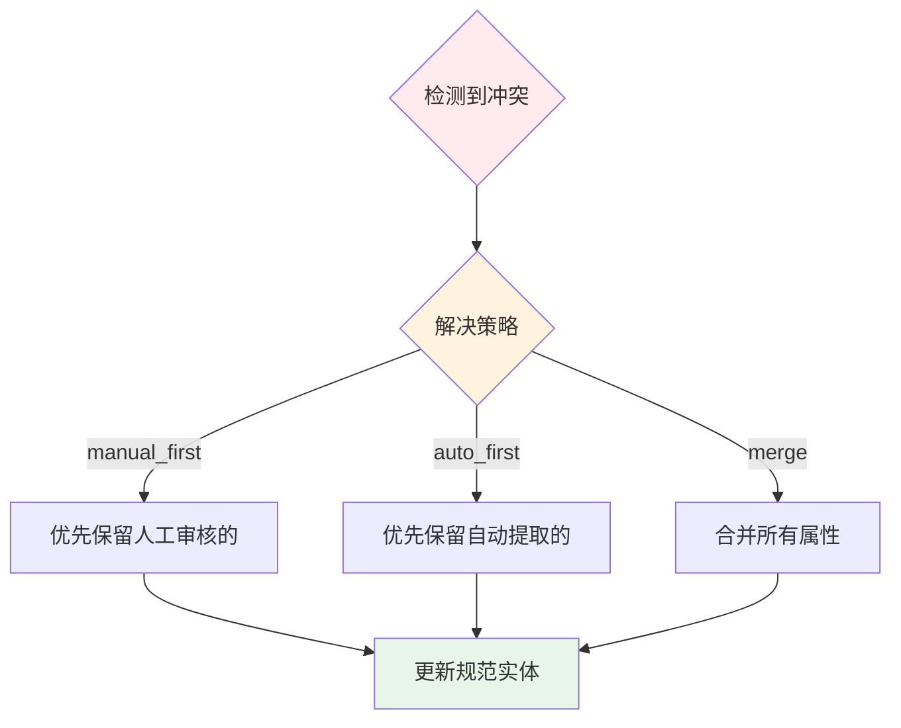

**核心代码**：

```python
class EntityAligner:
    def __init__(self, strategy: str = "merge"):
        self.strategy = strategy  # manual_first / auto_first / merge
        self.graph = get_graph()

    def align_entities(self) -> int:
        """实体对齐"""
        # 1. 查找冲突
        conflicts = self._find_conflicts()

        # 2. 解决冲突
        resolved = 0
        for conflict in conflicts:
            self._resolve_conflict(conflict)
            resolved += 1

        return resolved

    def _find_conflicts(self) -> List[Dict]:
        """查找冲突实体"""
        query = """
        MATCH (e:`__Entity__`)
        WHERE e.canonical_id IS NOT NULL
        WITH e.canonical_id AS canonical, collect(e) AS instances
        WHERE size(instances) > 1
        RETURN canonical, instances
        """
        return self.graph.query(query)

    def _resolve_conflict(self, conflict: Dict):
        """解决单个冲突"""
        canonical = conflict['canonical']
        instances = conflict['instances']

        if self.strategy == "merge":
            # 合并所有属性
            merged_desc = self._merge_descriptions([i['description'] for i in instances])

            # 更新规范实体
            self.graph.query("""
                MATCH (e:`__Entity__` {id: $canonical})
                SET e.description = $description
            """, params={
                'canonical': canonical,
                'description': merged_desc
            })

            # 保留所有关系（不删除实例节点）
```

**配置参数**：
```env
GRAPH_CONFLICT_STRATEGY=merge    # manual_first / auto_first / merge
```

---

## Neo4j 图谱存储

### 节点类型

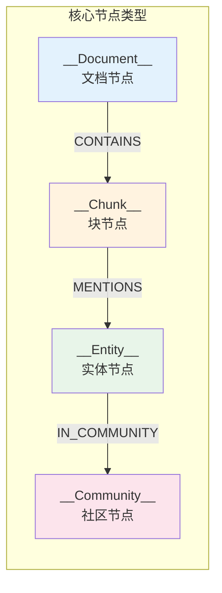

**节点属性设计**：

```python
# __Document__ 节点
{
    "id": "doc_hash_123",
    "file_name": "student_handbook.pdf",
    "file_path": "/files/student_handbook.pdf",
    "created_at": "2026-01-04T10:00:00"
}

# __Chunk__ 节点
{
    "id": "chunk_hash_456",
    "text": "学生申请奖学金需要满足以下条件...",
    "index": 0,
    "embedding": [0.1, 0.2, ...]  # 向量嵌入
}

# __Entity__ 节点
{
    "id": "国家奖学金",
    "description": "国家级别的最高奖学金...",
    "type": "奖学金类型",
    "embedding": [0.3, 0.4, ...],
    "canonical_id": "国家奖学金",  # 规范ID
    "wcc": 123  # 连通分量ID
}

# __Community__ 节点
{
    "id": "community_1",
    "level": 0,
    "summary": "本社区包含学生奖学金相关实体...",
    "full_content": "...",
    "weight": 50,  # 社区重要性
    "community_rank": 1
}
```

### 关系类型

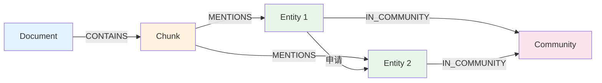

**关系属性设计**：

```python
# 实体关系
{
    "type": "申请",
    "description": "学生可以申请奖学金...",
    "weight": 10,  # 关系权重（出现次数）
    "source_chunks": ["chunk_1", "chunk_2"]  # 来源块
}

# MENTIONS 关系
{
    "count": 5  # 该实体在块中出现次数
}
```

### 批量写入优化

```python
class GraphWriter:
    def __init__(self, batch_size: int = 100):
        self.batch_size = batch_size
        self.graph = get_graph()

    def write_entities(self, entities: List[Dict]):
        """批量写入实体"""
        for i in range(0, len(entities), self.batch_size):
            batch = entities[i:i + self.batch_size]

            query = """
            UNWIND $entities AS entity
            MERGE (e:`__Entity__` {id: entity.id})
            SET e.description = entity.description,
                e.type = entity.type,
                e.embedding = entity.embedding
            """

            self.graph.query(query, params={'entities': batch})

    def write_relationships(self, relationships: List[Dict]):
        """批量写入关系"""
        for i in range(0, len(relationships), self.batch_size):
            batch = relationships[i:i + self.batch_size]

            query = """
            UNWIND $rels AS rel
            MATCH (e1:`__Entity__` {id: rel.source})
            MATCH (e2:`__Entity__` {id: rel.target})
            MERGE (e1)-[r:RELATES_TO {type: rel.type}]->(e2)
            SET r.description = rel.description,
                r.weight = coalesce(r.weight, 0) + 1
            """

            self.graph.query(query, params={'rels': batch})
```

---

## 社区检测

### 两种算法

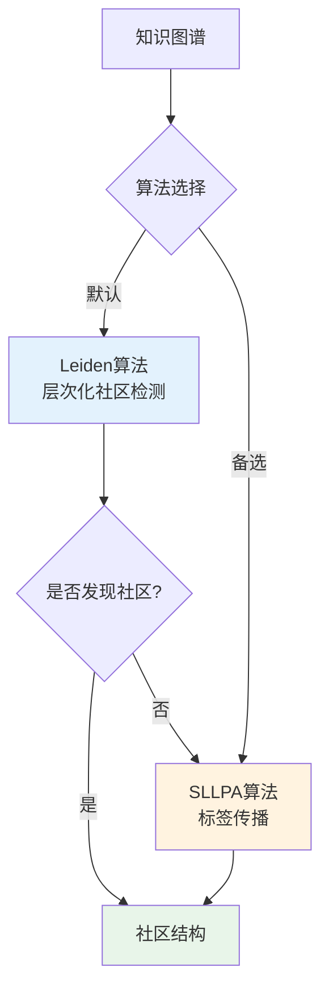

### Leiden 算法

**特点**：层次化社区检测，质量高

```cypher
CALL gds.graph.project(
    'entity-graph',
    '__Entity__',
    {
        RELATES_TO: {
            orientation: 'UNDIRECTED'
        }
    }
)

CALL gds.leiden.write('entity-graph', {
    writeProperty: 'community',
    includeIntermediateCommunities: true,
    maxLevels: 3
})
YIELD communityCount, nodePropertiesWritten
```

### SLLPA 算法

**特点**：Speaker-Listener 标签传播，速度快

```cypher
CALL gds.alpha.sllpa.write('entity-graph', {
    writeProperty: 'community',
    maxIterations: 10
})
```

### 社区摘要生成

```python
class CommunityDetector:
    def generate_summaries(self):
        """为每个社区生成摘要"""
        communities = self._get_communities()

        for community in communities:
            # 获取社区内的实体
            entities = self._get_community_entities(community['id'])

            # 使用 LLM 生成摘要
            summary = self._generate_summary_with_llm(entities)

            # 写入社区节点
            self.graph.query("""
                MATCH (c:`__Community__` {id: $community_id})
                SET c.summary = $summary,
                    c.full_content = $full_content
            """, params={
                'community_id': community['id'],
                'summary': summary['summary'],
                'full_content': summary['full_content']
            })

    def _generate_summary_with_llm(self, entities: List[Dict]) -> Dict:
        """使用 LLM 生成社区摘要"""
        prompt = f"""
        请为以下实体组生成一个简洁的摘要（100字以内）：

        {self._format_entities(entities)}

        摘要应包含：
        1. 这些实体的共同主题
        2. 主要实体及其关系
        3. 核心知识点
        """

        response = self.llm.invoke(prompt)

        return {
            'summary': response.content,
            'full_content': self._format_entities(entities)
        }
```

**配置参数**：
```env
GRAPH_COMMUNITY_ALGORITHM=leiden    # leiden / sllpa
GDS_MEMORY_LIMIT=6                  # GDS 内存限制（GB）
GDS_CONCURRENCY=4                   # GDS 并发度
```

---

## 向量索引构建

### 两种索引

```mermaid
graph TB
    subgraph 实体索引[实体索引 Entity Index]
        E1[实体1: 国家奖学金<br/>embedding: [0.1, 0.2, ...]]
        E2[实体2: 学生<br/>embedding: [0.3, 0.4, ...]]
    end

    subgraph Chunk索引[Chunk索引 Chunk Index]
        C1[Chunk 1: text + embedding]
        C2[Chunk 2: text + embedding]
    end

    Query[查询: 奖学金申请条件] --> VecEmbed[向量化]
    VecEmbed --> EntitySearch[实体索引搜索]
    VecEmbed --> ChunkSearch[Chunk索引搜索]

    EntitySearch --> E1
    ChunkSearch --> C1

    style 实体索引 fill:#e3f2fd
    style Chunk索引 fill:#fff3e0
```

### 实体索引

**创建索引**：

```cypher
CREATE VECTOR INDEX entity_index IF NOT EXISTS
FOR (e:`__Entity__`)
ON e.embedding
OPTIONS {
    indexConfig: {
        `vector.dimensions`: 1536,
        `vector.similarity_function`: 'cosine'
    }
}
```

**使用索引**：

```python
def entity_search(query: str, top_k: int = 5) -> List[Dict]:
    """实体向量搜索"""
    # 向量化查询
    query_vec = embeddings.embed_query(query)

    # 向量搜索
    cypher = """
    CALL db.index.vector.queryNodes(
        'entity_index',
        $top_k,
        $query_vec
    )
    YIELD node, score
    RETURN node.id AS entity_id,
           node.description AS description,
           score
    """

    results = graph.query(cypher, params={
        'top_k': top_k,
        'query_vec': query_vec
    })

    return results
```

### Chunk 索引

**创建索引**：

```cypher
CREATE VECTOR INDEX chunk_index IF NOT EXISTS
FOR (c:`__Chunk__`)
ON c.embedding
OPTIONS {
    indexConfig: {
        `vector.dimensions`: 1536,
        `vector.similarity_function`: 'cosine'
    }
}
```

**依赖关系**：

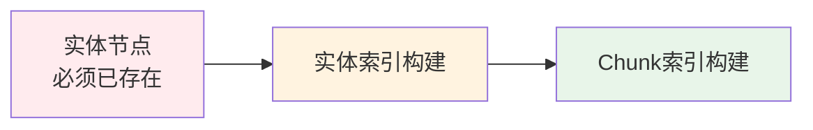

**重要提示**：
- Chunk 索引构建依赖实体索引
- 必须先完成实体索引，再构建 Chunk 索引
- 否则会出现关系缺失错误

---

## 增量 vs 全量构建

### 对比表

| 特性 | 全量构建 | 增量构建 |
|------|----------|----------|
| **执行方式** | 清空数据库 → 重新构建 | 检测变更 → 仅处理变更 |
| **耗时** | 长（小时级） | 短（分钟级） |
| **适用场景** | 初次构建、大规模变更 | 日常更新、新增文档 |
| **文件追踪** | 无 | file_registry.json |
| **冲突解决** | 无冲突 | 需要策略 |
| **资源消耗** | 高 | 低 |

### 全量构建

**执行命令**：
```bash
bash scripts/py.sh infrastructure.integrations.build.main
```

**流程**：
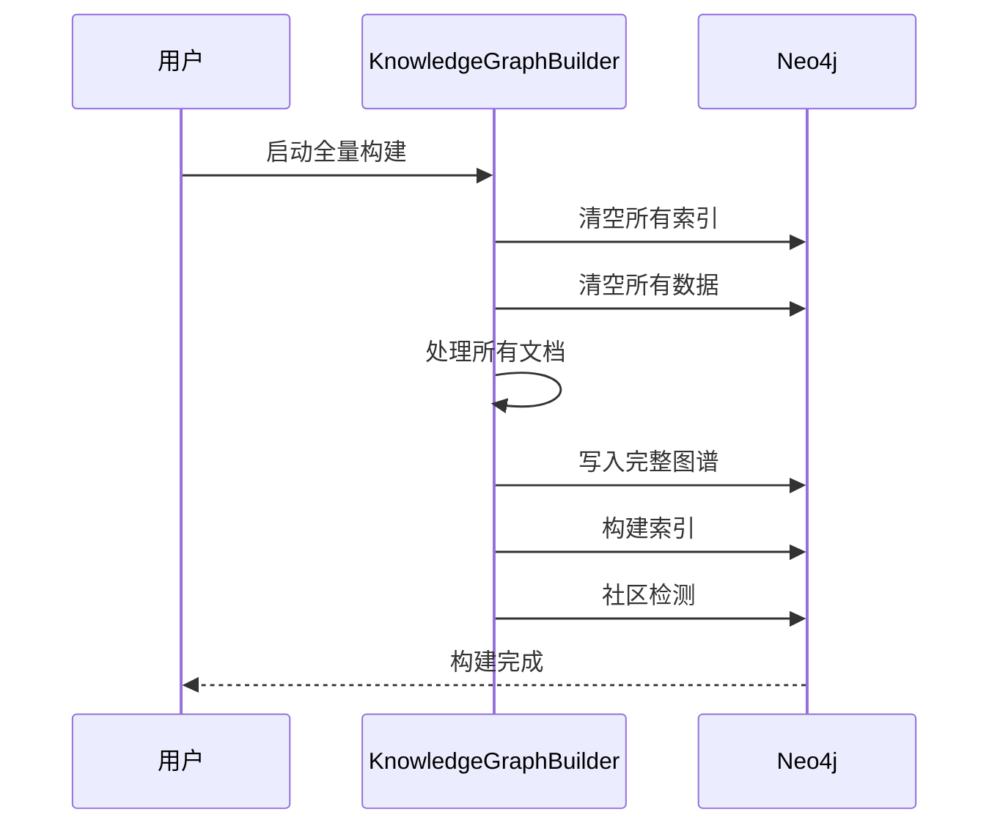

### 增量构建

**执行命令**：
```bash
# 单次增量构建
bash scripts/py.sh infrastructure.integrations.build.incremental_update --once

# 守护进程模式（定期检查）
bash scripts/py.sh infrastructure.integrations.build.incremental_update --daemon
```

**文件追踪**：

```json
// file_registry.json
{
    "files": {
        "/files/doc1.pdf": {
            "hash": "abc123",
            "modified_time": "2026-01-04T10:00:00",
            "status": "processed"
        },
        "/files/doc2.txt": {
            "hash": "def456",
            "modified_time": "2026-01-04T11:00:00",
            "status": "processed"
        }
    },
    "last_update": "2026-01-04T12:00:00"
}
```

**变更检测**：

```python
class IncrementalBuilder:
    def detect_changes(self) -> Dict[str, List[str]]:
        """检测文件变更"""
        changes = {
            'added': [],      # 新增文件
            'modified': [],   # 修改文件
            'deleted': []     # 删除文件
        }

        # 1. 检测新增和修改
        for file_path in self._list_files():
            current_hash = self._compute_hash(file_path)
            registry_info = self.registry.get(file_path)

            if not registry_info:
                changes['added'].append(file_path)
            elif registry_info['hash'] != current_hash:
                changes['modified'].append(file_path)

        # 2. 检测删除
        for file_path in self.registry.keys():
            if not os.path.exists(file_path):
                changes['deleted'].append(file_path)

        return changes
```

**冲突解决**：

```python
def resolve_conflict(self, entity1: Dict, entity2: Dict) -> Dict:
    """解决实体冲突"""
    if self.strategy == "manual_first":
        # 优先保留人工审核的
        return entity1 if entity1.get('manual_verified') else entity2

    elif self.strategy == "auto_first":
        # 优先保留自动提取的最新版本
        return entity2

    elif self.strategy == "merge":
        # 合并属性
        return {
            'id': entity1['id'],
            'description': self._merge_descriptions([
                entity1['description'],
                entity2['description']
            ]),
            'type': entity1['type']
        }
```

---

## 配置参数详解

### settings.py 参数

```python
# backend/config/rag.py（领域/RAG 语义；推荐用 .env 覆盖）

# 对应 .env：
# GRAPH_THEME='学生事务管理'
# GRAPH_ENTITY_TYPES='学生类型,奖学金类型,处分类型,部门,学生职责,管理规定'
# GRAPH_RELATIONSHIP_TYPES='申请,评选,违纪,资助,申诉,管理,权利义务,互斥'
# FRONTEND_EXAMPLES='...'

theme = "学生事务管理"
entity_types = ["学生类型", "奖学金类型", "处分类型", "部门", "学生职责", "管理规定"]
relationship_types = ["申请", "评选", "违纪", "资助", "申诉", "管理", "权利义务", "互斥"]

# 示例（少样本学习 / 前端示例问题）
examples = """
示例1:
学生 : 申请 : 国家奖学金
国家奖学金 : 评选 : 评审委员会

示例2:
学生 : 违反 : 学校规定
学校规定 : 处分 : 警告
"""
```

### .env 参数

```bash
# ========== LLM 配置 ==========
OPENAI_API_KEY=sk-xxx
OPENAI_BASE_URL=http://localhost:13000/v1
OPENAI_LLM_MODEL=gpt-4o
OPENAI_EMBEDDINGS_MODEL=text-embedding-3-large
OPENAI_REQUEST_TIMEOUT_SECONDS=120

# ========== Neo4j 配置 ==========
NEO4J_URI=neo4j://localhost:7687
NEO4J_USERNAME=neo4j
NEO4J_PASSWORD=12345678

# ========== 文档处理 ==========
FILES_DIR=./files
CHUNK_SIZE=512
OVERLAP=50

# ========== 并行处理 ==========
MAX_WORKERS=4              # 线程池大小
BATCH_SIZE=100             # 数据库批处理
LLM_BATCH_SIZE=5           # LLM 批处理
ENTITY_BATCH_SIZE=50       # 实体批处理
CHUNK_BATCH_SIZE=100       # Chunk 批处理
EMBEDDING_BATCH_SIZE=64    # 向量生成批处理

# ========== 实体消歧 ==========
DISAMBIG_STRING_THRESHOLD=0.7
DISAMBIG_VECTOR_THRESHOLD=0.8
DISAMBIG_NIL_THRESHOLD=0.75
DISAMBIG_TOP_K=10

# ========== 社区检测 ==========
GRAPH_COMMUNITY_ALGORITHM=leiden  # leiden / sllpa
GDS_MEMORY_LIMIT=6                # GB
GDS_CONCURRENCY=4

# ========== 冲突解决 ==========
GRAPH_CONFLICT_STRATEGY=merge     # manual_first / auto_first / merge

# ========== 构建模式（以当前实现为准） ==========
# document: 文档模式（如“学生管理”）
# structured: 结构化模式（如“电影推荐”）
GRAPH_BUILD_MODE=document         # document / structured

# ========== 阶段开关（统一入口） ==========
# BUILD_RUN_GRAPH: 是否执行 Phase 2（图谱构建）
# BUILD_RUN_INDEX_AND_COMMUNITY: 是否执行 Phase 3（实体索引与社区检测）
# BUILD_RUN_CHUNK_INDEX: 是否执行 Chunk 向量索引
# BUILD_DROP_ALL_INDEXES: 是否清理全库索引（同库共存建议 false）
# BUILD_RUN_GRAPH=true
# BUILD_RUN_INDEX_AND_COMMUNITY=true
# BUILD_RUN_CHUNK_INDEX=true
# BUILD_DROP_ALL_INDEXES=false
```

---

## 性能优化

### 优化策略总览

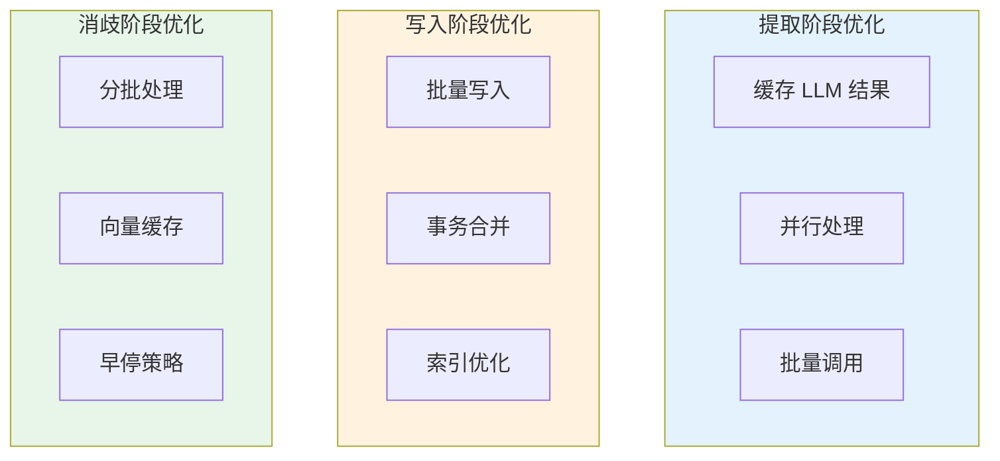

### 并行处理配置

```python
# 推荐配置（4核8线程机器）
MAX_WORKERS=4              # CPU 核心数
LLM_BATCH_SIZE=5           # 根据 LLM 限流调整
BATCH_SIZE=100             # Neo4j 写入批大小

# 高性能配置（16核32线程机器）
MAX_WORKERS=16
LLM_BATCH_SIZE=10
BATCH_SIZE=500
```

### 构建缓存

v3 strict 不提供构建阶段的本地落盘缓存；如需进一步优化构建耗时，建议从批处理、并发度与 LLM 调用策略入手。

### 内存优化

```python
# 分批加载大文件
def process_large_file(file_path: str):
    """分批处理大文件"""
    BATCH_SIZE = 10000  # 每批处理 10000 行

    with open(file_path, 'r') as f:
        batch = []
        for line in f:
            batch.append(line)

            if len(batch) >= BATCH_SIZE:
                process_batch(batch)
                batch = []

        if batch:
            process_batch(batch)
```

### 数据库优化

```cypher
-- 创建约束（加速查询）
CREATE CONSTRAINT entity_id IF NOT EXISTS
FOR (e:`__Entity__`) REQUIRE e.id IS UNIQUE;

CREATE CONSTRAINT chunk_id IF NOT EXISTS
FOR (c:`__Chunk__`) REQUIRE c.id IS UNIQUE;

-- 创建索引
CREATE INDEX entity_type IF NOT EXISTS
FOR (e:`__Entity__`) ON (e.type);

CREATE INDEX entity_canonical IF NOT EXISTS
FOR (e:`__Entity__`) ON (e.canonical_id);
```

### 性能监控

```python
class PerformanceMonitor:
    def __init__(self):
        self.stats = {
            "文档处理": 0,
            "实体提取": 0,
            "写入数据库": 0,
            "实体消歧": 0,
            "社区检测": 0,
            "索引构建": 0
        }

    def record(self, stage: str, duration: float):
        """记录阶段耗时"""
        self.stats[stage] = duration

    def report(self):
        """输出性能报告"""
        total = sum(self.stats.values())

        print(f"\n性能报告：")
        print(f"总耗时: {total:.2f}秒")
        print(f"\n各阶段耗时：")

        for stage, duration in sorted(self.stats.items(), key=lambda x: x[1], reverse=True):
            percentage = duration / total * 100
            print(f"  {stage}: {duration:.2f}秒 ({percentage:.1f}%)")
```

---

## 相关文档

- [Agent系统](./Agent系统.md) - 了解如何使用构建的知识图谱
- [搜索引擎](./搜索引擎.md) - 了解知识图谱的检索策略
- [系统架构总览](../01-整体架构/系统架构总览.md) - 了解整体架构
- [Neo4j 官方文档](https://neo4j.com/docs/) - Neo4j 图数据库文档
- [LangChain 官方文档](https://python.langchain.com/) - LangChain 框架文档

---

## 更新日志

| 版本 | 日期 | 更新内容 | 作者 |
|------|------|----------|------|
| 1.0 | 2026-01-04 | 初始版本，完整覆盖图谱构建流程 | Claude |
| - | - | - | - |
