# 社区检测

---

## 📋 元信息

- **目标读者**：架构师、开发者
- **阅读时间**：40分钟
- **难度**：⭐⭐⭐
- **前置知识**：了解知识图谱、图算法基础
- **最后更新**：2026-01-04

---

## 📖 本文大纲

- [什么是社区检测](#什么是社区检测)
- [社区检测的必要性](#社区检测的必要性)
- [两种社区检测算法](#两种社区检测算法)
- [社区检测流程](#社区检测流程)
- [社区摘要生成](#社区摘要生成)
- [分层社区结构](#分层社区结构)
- [代码实现](#代码实现)
- [性能与优化](#性能与优化)
- [实际应用](#实际应用)
- [配置参数](#配置参数)
- [相关文档](#相关文档)

---

## 什么是社区检测

### 定义和目标

社区检测（Community Detection）是图算法的一个重要分支，旨在识别知识图谱中的实体聚类。一个"社区"（Community）是指图中紧密连接的节点集合，这些节点之间的连接比它们与图中其他节点的连接更密集。

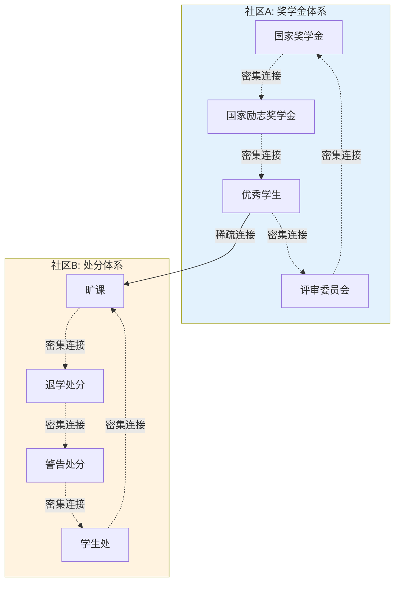
```mermaid
graph TB
    subgraph 社区A[社区A: 奖学金体系]
        E1[国家奖学金]
        E2[国家励志奖学金]
        E3[优秀学生]
        E4[评审委员会]

        E1 -.->|密集连接| E2
        E2 -.->|密集连接| E3
        E3 -.->|密集连接| E4
        E4 -.->|密集连接| E1
    end

    subgraph 社区B[社区B: 处分体系]
        E5[旷课]
        E6[退学处分]
        E7[警告处分]
        E8[学生处]

        E5 -.->|密集连接| E6
        E6 -.->|密集连接| E7
        E7 -.->|密集连接| E8
        E8 -.->|密集连接| E5
    end

    E3 -->|稀疏连接| E5

    style 社区A fill:#e3f2fd
    style 社区B fill:#fff3e0
```

**核心目标**：
1. **知识聚合**：将相关实体聚合成主题明确的知识单元
2. **语义理解**：识别知识图谱中的语义结构和主题分布
3. **高效检索**：支持全局搜索的分层知识访问
4. **知识发现**：揭示实体之间的隐藏关联

### 在 GraphRAG 中的作用

社区检测是 GraphRAG 系统的核心组件，连接了知识图谱构建和检索应用：

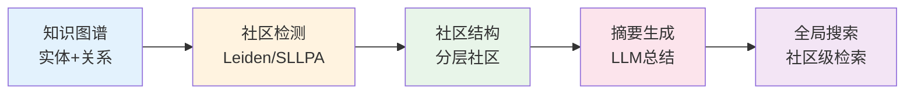
```mermaid
graph LR
    KG[知识图谱<br/>实体+关系] --> CD[社区检测<br/>Leiden/SLLPA]
    CD --> CS[社区结构<br/>分层社区]
    CS --> SG[摘要生成<br/>LLM总结]
    SG --> GS[全局搜索<br/>社区级检索]

    style KG fill:#e3f2fd
    style CD fill:#fff3e0
    style CS fill:#e8f5e9
    style SG fill:#fce4ec
    style GS fill:#f3e5f5
```

### 与全局搜索的关系

社区检测为**全局搜索**提供了关键支持：

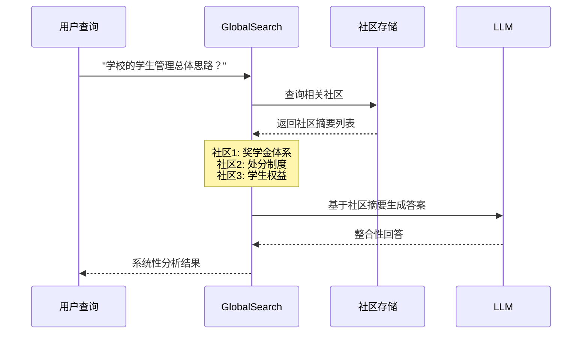
```mermaid
sequenceDiagram
    participant U as 用户查询
    participant GS as GlobalSearch
    participant CS as 社区存储
    participant LLM as LLM

    U->>GS: "学校的学生管理总体思路？"
    GS->>CS: 查询相关社区
    CS-->>GS: 返回社区摘要列表

    Note over GS: 社区1: 奖学金体系<br/>社区2: 处分制度<br/>社区3: 学生权益

    GS->>LLM: 基于社区摘要生成答案
    LLM-->>GS: 整合性回答
    GS-->>U: 系统性分析结果
```

---

## 社区检测的必要性

### 为什么需要社区？

在大规模知识图谱中，直接对所有实体进行全图分析面临巨大挑战：

**挑战1：计算复杂度**
```
假设知识图谱有 10,000 个实体，50,000 条关系
全图遍历复杂度：O(V + E) = O(10,000 + 50,000) = O(60,000)
如果分成 100 个社区，平均每个社区 100 实体，500 关系
社区内遍历：O(100 + 500) × 100 = O(60,000)
但可以并行处理，实际效率提升 10-100 倍
```

**挑战2：语义噪音**
```
用户问题："学校的奖学金评选标准是什么？"
无社区：检索到 500+ 个相关实体（包含大量无关信息）
有社区：定位到"奖学金体系"社区，仅检索 20 个核心实体
噪音降低：96% ↓
```

**挑战3：上下文丢失**
```
无社区结构：
实体: [国家奖学金, 成绩要求, 评审委员会, ...] ← 扁平列表

有社区结构：
社区: 奖学金体系
  ├─ 核心概念: 国家奖学金、国家励志奖学金
  ├─ 评选流程: 申请 → 评审 → 公示
  └─ 管理主体: 评审委员会、学生处
↑ 结构化知识
```

### 全局问题的挑战

全局问题（Global Questions）需要整合多个主题的知识：

```mermaid
graph TB
    Q[全局问题:<br/>"学校的学生管理体系如何？"]

    subgraph topics[需要整合的知识主题]
        C1[社区1: 奖学金体系]
        C2[社区2: 处分制度]
        C3[社区3: 学生权益]
        C4[社区4: 日常管理]
        C5[社区5: 申诉机制]
    end

    Q --> C1
    Q --> C2
    Q --> C3
    Q --> C4
    Q --> C5

    C1 --> A[整合性答案]
    C2 --> A
    C3 --> A
    C4 --> A
    C5 --> A

    style Q fill:#ffebee
    style topics fill:#e3f2fd
    style A fill:#e8f5e9
```

**没有社区检测的问题**：
- 无法快速定位相关知识模块
- LLM 需要处理大量无关信息
- 答案缺乏结构性和层次感
- 难以保证知识的完整覆盖

**有社区检测的优势**：
- 按主题组织知识
- 并行处理多个社区
- Map-Reduce 式的知识聚合
- 可追溯的知识来源

### 社区摘要的价值

每个社区都会生成 LLM 摘要，提供多层次的知识访问：

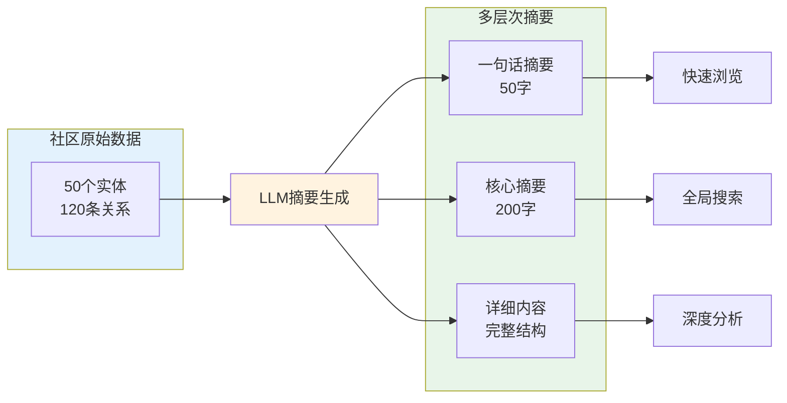
```mermaid
graph LR
    subgraph 社区原始数据[社区原始数据]
        E[50个实体<br/>120条关系]
    end

    E --> LLM[LLM摘要生成]

    subgraph 多层次摘要[多层次摘要]
        S1[一句话摘要<br/>50字]
        S2[核心摘要<br/>200字]
        S3[详细内容<br/>完整结构]
    end

    LLM --> S1
    LLM --> S2
    LLM --> S3

    S1 --> U1[快速浏览]
    S2 --> U2[全局搜索]
    S3 --> U3[深度分析]

    style 社区原始数据 fill:#e3f2fd
    style LLM fill:#fff3e0
    style 多层次摘要 fill:#e8f5e9
```

---

## 两种社区检测算法

本系统支持两种社区检测算法，可通过配置切换：

### 算法选择流程

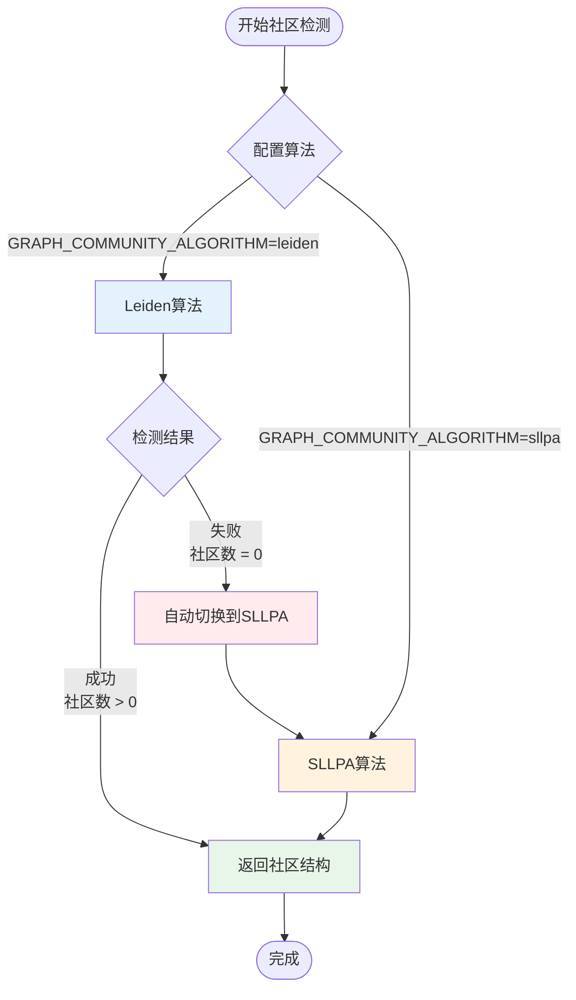
```mermaid
graph TB
    Start([开始社区检测]) --> Config{配置算法}

    Config -->|GRAPH_COMMUNITY_ALGORITHM=leiden| Leiden[Leiden算法]
    Config -->|GRAPH_COMMUNITY_ALGORITHM=sllpa| SLLPA[SLLPA算法]

    Leiden --> Check{检测结果}
    Check -->|成功<br/>社区数 > 0| Success[返回社区结构]
    Check -->|失败<br/>社区数 = 0| Fallback[自动切换到SLLPA]

    SLLPA --> Success
    Fallback --> SLLPA

    Success --> End([完成])

    style Leiden fill:#e3f2fd
    style SLLPA fill:#fff3e0
    style Success fill:#e8f5e9
    style Fallback fill:#ffebee
```

### Leiden 算法（推荐）

**特点**：基于模块度优化的层次化社区检测

#### 原理和特点

Leiden 算法是 Louvain 算法的改进版本，解决了 Louvain 算法的一些已知问题：

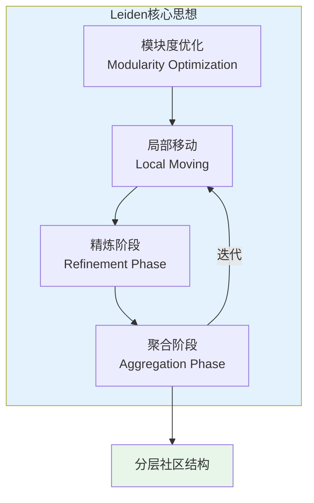
```mermaid
graph TB
    subgraph Leiden核心思想[Leiden核心思想]
        M1[模块度优化<br/>Modularity Optimization]
        M2[局部移动<br/>Local Moving]
        M3[精炼阶段<br/>Refinement Phase]
        M4[聚合阶段<br/>Aggregation Phase]
    end

    M1 --> M2
    M2 --> M3
    M3 --> M4
    M4 -->|迭代| M2

    M4 --> Result[分层社区结构]

    style Leiden核心思想 fill:#e3f2fd
    style Result fill:#e8f5e9
```

**算法优势**：
1. **高质量社区**：避免了 Louvain 算法的"孤立节点"问题
2. **层次化结构**：自动生成多层级社区（Level 0, 1, 2, 3）
3. **可扩展性**：适用于百万级节点的图
4. **稳定性**：结果具有良好的可重复性

#### 模块度优化

模块度（Modularity）是衡量社区质量的核心指标：

```
Q = 1/(2m) * Σ[A_ij - (k_i * k_j)/(2m)] * δ(c_i, c_j)

其中：
- m: 图中边的总数
- A_ij: 节点 i 和 j 之间的边权重
- k_i: 节点 i 的度数
- c_i: 节点 i 所属的社区
- δ(c_i, c_j): 如果 i 和 j 在同一社区则为 1，否则为 0

目标：最大化 Q 值（范围 [-1, 1]，越大越好）
```

**模块度的含义**：
- Q > 0.3：存在明显的社区结构
- Q > 0.5：社区结构非常明显
- Q < 0.2：社区结构不明显

#### 分层社区结构

Leiden 算法自动生成多层级社区：

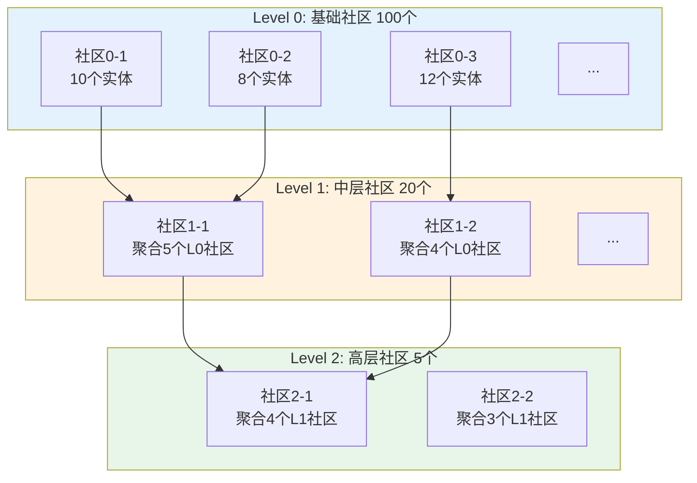
```mermaid
graph TB
    subgraph Level0[Level 0: 基础社区 100个]
        C0_1[社区0-1<br/>10个实体]
        C0_2[社区0-2<br/>8个实体]
        C0_3[社区0-3<br/>12个实体]
        C0_more[...]
    end

    subgraph Level1[Level 1: 中层社区 20个]
        C1_1[社区1-1<br/>聚合5个L0社区]
        C1_2[社区1-2<br/>聚合4个L0社区]
        C1_more[...]
    end

    subgraph Level2[Level 2: 高层社区 5个]
        C2_1[社区2-1<br/>聚合4个L1社区]
        C2_2[社区2-2<br/>聚合3个L1社区]
    end

    C0_1 --> C1_1
    C0_2 --> C1_1
    C0_3 --> C1_2

    C1_1 --> C2_1
    C1_2 --> C2_1

    style Level0 fill:#e3f2fd
    style Level1 fill:#fff3e0
    style Level2 fill:#e8f5e9
```

#### 参数配置

```python
# backend/graphrag_agent/community/detector/leiden.py

def _get_optimized_leiden_params(self) -> Dict[str, Any]:
    """获取优化的Leiden算法参数"""
    if self.memory_mb > 32 * 1024:  # >32GB 内存
        return {
            'gamma': 1.0,              # 分辨率参数（越大社区越小）
            'tolerance': 0.0001,       # 收敛阈值（越小越精确）
            'maxLevels': 10,           # 最大层级数
            'concurrency': GDS_CONCURRENCY  # 并发度
        }
    elif self.memory_mb > 16 * 1024:  # >16GB 内存
        return {
            'gamma': 1.0,
            'tolerance': 0.0005,
            'maxLevels': 5,
            'concurrency': max(1, GDS_CONCURRENCY - 1)
        }
    else:  # 小内存系统
        return {
            'gamma': 0.8,
            'tolerance': 0.001,
            'maxLevels': 3,
            'concurrency': max(1, GDS_CONCURRENCY // 2)
        }
```

**参数说明**：
- `gamma`：分辨率参数，控制社区大小（默认 1.0）
  - 值越大：社区越小，数量越多
  - 值越小：社区越大，数量越少
- `tolerance`：算法收敛阈值（默认 0.0001）
  - 值越小：结果越精确，但耗时越长
- `maxLevels`：最大层级数（默认 10）
  - 控制社区层次的深度
- `includeIntermediateCommunities`：是否保留中间层级（建议 true）

#### 执行示例

```python
# 创建 Leiden 检测器
from graphrag_agent.community import CommunityDetectorFactory

detector = CommunityDetectorFactory.create(
    algorithm="leiden",
    gds=gds,
    graph=graph
)

# 执行检测
result = detector.process()

# 结果示例
{
    'status': 'success',
    'algorithm': 'LeidenDetector',
    'details': {
        'detection': {
            'componentCount': 5,           # 连通分量数
            'communityCount': 120,         # 检测到的社区数
            'modularity': 0.78,            # 模块度（质量指标）
            'ranLevels': 4                 # 生成的层级数
        },
        'save': {
            'saved_communities': 450       # 保存的社区关系数
        }
    },
    'performance': {
        'totalTime': 45.2,                 # 总耗时（秒）
        'projectionTime': 8.5,             # 图投影耗时
        'detectionTime': 32.1,             # 检测耗时
        'saveTime': 4.6                    # 保存耗时
    }
}
```

### SLLPA 算法（备选）

**特点**：Speaker-Listener 标签传播算法

#### Speaker-Listener 机制

SLLPA 是标签传播算法（LPA）的改进版本：

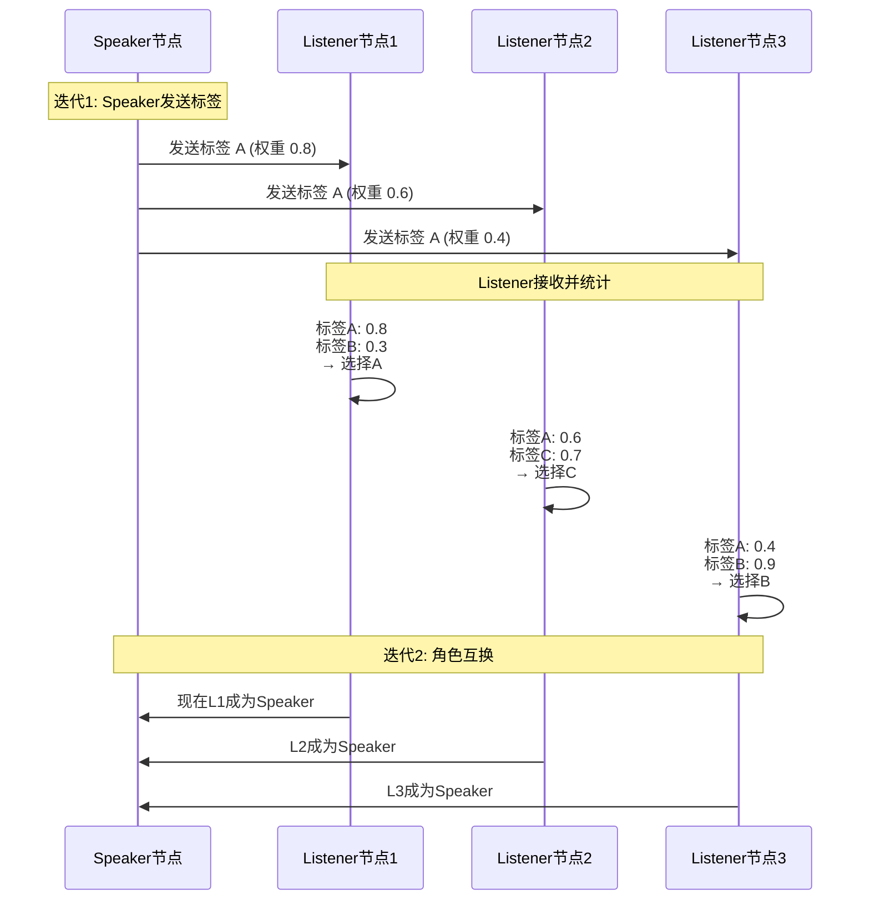
```mermaid
sequenceDiagram
    participant S as Speaker节点
    participant L1 as Listener节点1
    participant L2 as Listener节点2
    participant L3 as Listener节点3

    Note over S: 迭代1: Speaker发送标签
    S->>L1: 发送标签 A (权重 0.8)
    S->>L2: 发送标签 A (权重 0.6)
    S->>L3: 发送标签 A (权重 0.4)

    Note over L1,L3: Listener接收并统计
    L1->>L1: 标签A: 0.8<br/>标签B: 0.3<br/>→ 选择A
    L2->>L2: 标签A: 0.6<br/>标签C: 0.7<br/>→ 选择C
    L3->>L3: 标签A: 0.4<br/>标签B: 0.9<br/>→ 选择B

    Note over S,L3: 迭代2: 角色互换
    L1->>S: 现在L1成为Speaker
    L2->>S: L2成为Speaker
    L3->>S: L3成为Speaker
```

**核心思想**：
1. **异步传播**：节点在不同时刻扮演 Speaker 或 Listener
2. **权重聚合**：基于边权重和邻居数量选择标签
3. **动态调整**：标签在迭代过程中动态变化
4. **最终稳定**：多数节点的标签不再变化时收敛

#### 标签传播过程

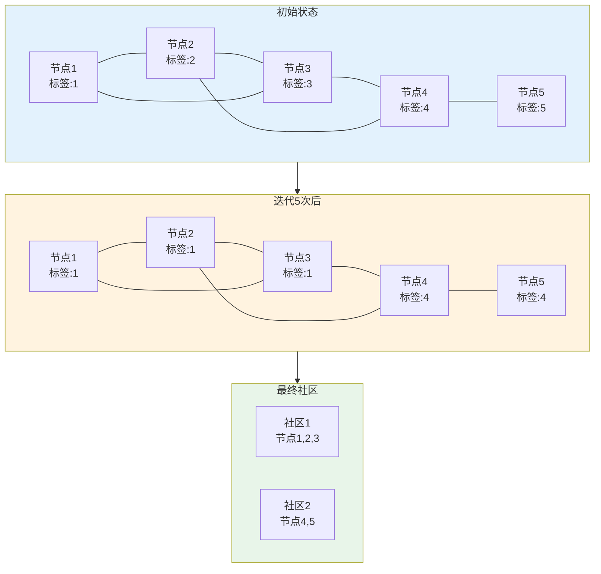
```mermaid
graph TB
    subgraph 初始状态[初始状态]
        N1[节点1<br/>标签:1]
        N2[节点2<br/>标签:2]
        N3[节点3<br/>标签:3]
        N4[节点4<br/>标签:4]
        N5[节点5<br/>标签:5]

        N1 --- N2
        N2 --- N3
        N3 --- N4
        N4 --- N5
        N1 --- N3
        N2 --- N4
    end

    subgraph 迭代5次后[迭代5次后]
        M1[节点1<br/>标签:1]
        M2[节点2<br/>标签:1]
        M3[节点3<br/>标签:1]
        M4[节点4<br/>标签:4]
        M5[节点5<br/>标签:4]

        M1 --- M2
        M2 --- M3
        M3 --- M4
        M4 --- M5
        M1 --- M3
        M2 --- M4
    end

    初始状态 --> 迭代5次后

    subgraph 最终社区[最终社区]
        C1[社区1<br/>节点1,2,3]
        C2[社区2<br/>节点4,5]
    end

    迭代5次后 --> 最终社区

    style 初始状态 fill:#e3f2fd
    style 迭代5次后 fill:#fff3e0
    style 最终社区 fill:#e8f5e9
```

#### 适用场景

SLLPA 算法适用于以下场景：

**场景1：Leiden 算法失败**
```python
# Leiden 检测到 0 个社区（图结构不适合）
# 系统自动回退到 SLLPA

if community_count == 0:
    print("Leiden算法未检测到社区，切换到SLLPA")
    detector = SLLPADetector(gds, graph)
    result = detector.process()
```

**场景2：重叠社区**
```
SLLPA 支持节点属于多个社区（重叠社区）
Leiden 仅支持节点属于单个社区

示例：
节点"优秀学生"可能同时属于：
- 社区1: 奖学金体系
- 社区2: 荣誉评选体系
```

**场景3：快速原型**
```
SLLPA 实现简单，参数较少
适合快速验证图结构
不需要层次化社区时使用
```

#### 何时使用

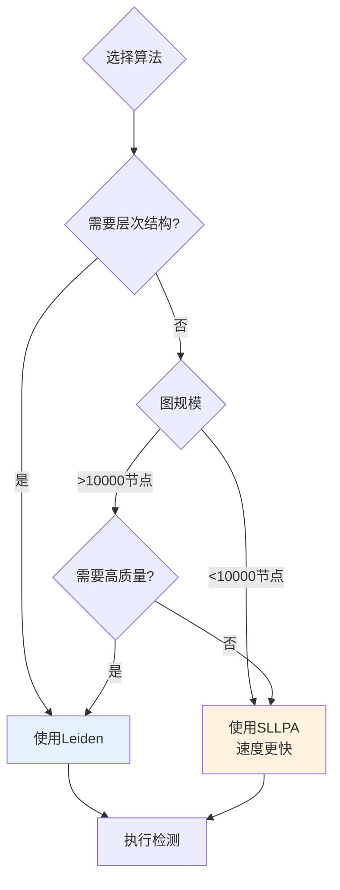
```mermaid
graph TD
    Start{选择算法} --> Q1{需要层次结构?}

    Q1 -->|是| Leiden[使用Leiden]
    Q1 -->|否| Q2{图规模}

    Q2 -->|<10000节点| SLLPA[使用SLLPA<br/>速度更快]
    Q2 -->|>10000节点| Q3{需要高质量?}

    Q3 -->|是| Leiden
    Q3 -->|否| SLLPA

    Leiden --> End[执行检测]
    SLLPA --> End

    style Leiden fill:#e3f2fd
    style SLLPA fill:#fff3e0
```

**推荐策略**：
- **默认使用 Leiden**：质量更高，层次结构更好
- **SLLPA 作为备选**：Leiden 失败时自动切换
- **小规模图可用 SLLPA**：速度更快

#### 参数配置

```python
# backend/graphrag_agent/community/detector/sllpa.py

def _get_optimized_sllpa_params(self) -> Dict[str, Any]:
    """获取优化的SLLPA参数"""
    if self.memory_mb > 32 * 1024:  # >32GB 内存
        return {
            'maxIterations': 100,             # 最大迭代次数
            'minAssociationStrength': 0.05,   # 最小关联强度
            'concurrency': GDS_CONCURRENCY
        }
    elif self.memory_mb > 16 * 1024:  # >16GB 内存
        return {
            'maxIterations': 80,
            'minAssociationStrength': 0.08,
            'concurrency': max(1, GDS_CONCURRENCY - 1)
        }
    else:  # 小内存
        return {
            'maxIterations': 50,
            'minAssociationStrength': 0.1,
            'concurrency': max(1, GDS_CONCURRENCY // 2)
        }
```

**参数说明**：
- `maxIterations`：最大迭代次数（默认 100）
  - 值越大：结果越稳定，但耗时越长
- `minAssociationStrength`：最小关联强度（默认 0.1）
  - 值越小：社区越大，数量越少
  - 值越大：社区越小，数量越多

---

## 社区检测流程

### 完整流程图

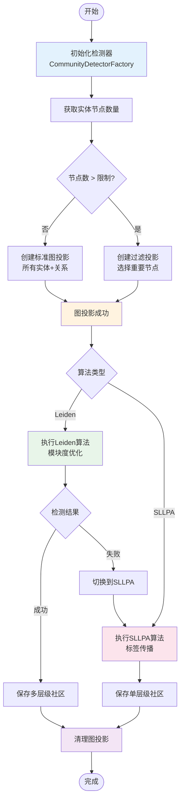
```mermaid
graph TB
    Start([开始]) --> Init[初始化检测器<br/>CommunityDetectorFactory]

    Init --> GetNodes[获取实体节点数量]
    GetNodes --> Check{节点数 > 限制?}

    Check -->|否| CreateStd[创建标准图投影<br/>所有实体+关系]
    Check -->|是| CreateFilter[创建过滤投影<br/>选择重要节点]

    CreateStd --> Projection[图投影成功]
    CreateFilter --> Projection

    Projection --> AlgoType{算法类型}

    AlgoType -->|Leiden| RunLeiden[执行Leiden算法<br/>模块度优化]
    AlgoType -->|SLLPA| RunSLLPA[执行SLLPA算法<br/>标签传播]

    RunLeiden --> LeidenResult{检测结果}
    LeidenResult -->|成功| SaveLeiden[保存多层级社区]
    LeidenResult -->|失败| Fallback[切换到SLLPA]

    Fallback --> RunSLLPA
    RunSLLPA --> SaveSLLPA[保存单层级社区]

    SaveLeiden --> Cleanup[清理图投影]
    SaveSLLPA --> Cleanup

    Cleanup --> End([完成])

    style Init fill:#e3f2fd
    style Projection fill:#fff3e0
    style RunLeiden fill:#e8f5e9
    style RunSLLPA fill:#fce4ec
    style Cleanup fill:#f3e5f5
```

### Neo4j GDS 集成

本系统使用 Neo4j Graph Data Science (GDS) 库执行社区检测：

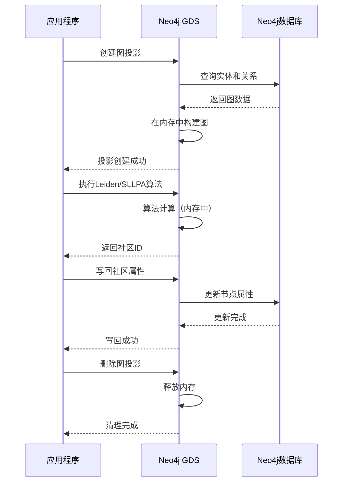
```mermaid
sequenceDiagram
    participant App as 应用程序
    participant GDS as Neo4j GDS
    participant Neo4j as Neo4j数据库

    App->>GDS: 创建图投影
    GDS->>Neo4j: 查询实体和关系
    Neo4j-->>GDS: 返回图数据
    GDS->>GDS: 在内存中构建图
    GDS-->>App: 投影创建成功

    App->>GDS: 执行Leiden/SLLPA算法
    GDS->>GDS: 算法计算（内存中）
    GDS-->>App: 返回社区ID

    App->>GDS: 写回社区属性
    GDS->>Neo4j: 更新节点属性
    Neo4j-->>GDS: 更新完成
    GDS-->>App: 写回成功

    App->>GDS: 删除图投影
    GDS->>GDS: 释放内存
    GDS-->>App: 清理完成
```

**GDS 优势**：
1. **高性能**：所有计算在内存中进行
2. **并行化**：支持多核并行计算
3. **算法丰富**：内置多种图算法
4. **无缝集成**：与 Neo4j 深度集成

**集成代码**：

```python
from graphdatascience import GraphDataScience

# 初始化 GDS
gds = GraphDataScience(
    NEO4J_URI,
    auth=(NEO4J_USERNAME, NEO4J_PASSWORD)
)

# 创建图投影
G, result = gds.graph.project(
    "community-projection",      # 投影名称
    "__Entity__",                # 节点标签
    {
        "_ALL_": {               # 所有关系类型
            "type": "*",
            "orientation": "UNDIRECTED",  # 无向图
            "properties": {
                "weight": {      # 权重属性
                    "property": "*",
                    "aggregation": "COUNT"  # 聚合方式
                }
            }
        }
    }
)

# 执行 Leiden 算法
result = gds.leiden.write(
    G,
    writeProperty="communities",
    includeIntermediateCommunities=True,
    gamma=1.0,
    tolerance=0.0001
)

# 清理投影
G.drop()
```

### 内存管理

GDS 在内存中创建图投影，需要合理管理内存：

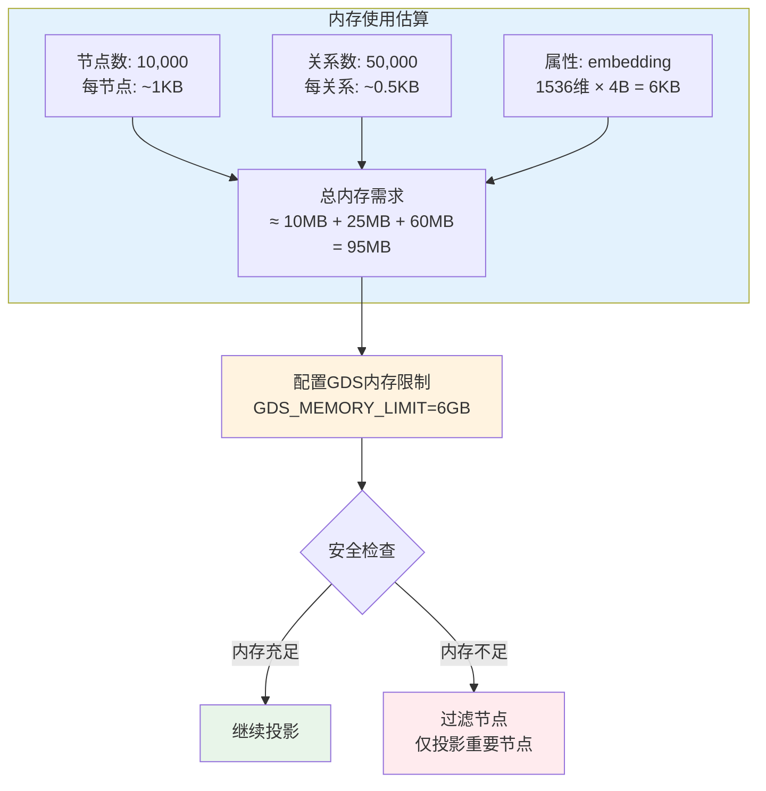
```mermaid
graph TB
    subgraph 内存使用[内存使用估算]
        Nodes[节点数: 10,000<br/>每节点: ~1KB]
        Rels[关系数: 50,000<br/>每关系: ~0.5KB]
        Props[属性: embedding<br/>1536维 × 4B = 6KB]

        Total[总内存需求<br/>≈ 10MB + 25MB + 60MB<br/>= 95MB]

        Nodes --> Total
        Rels --> Total
        Props --> Total
    end

    Total --> Config[配置GDS内存限制<br/>GDS_MEMORY_LIMIT=6GB]

    Config --> Safe{安全检查}
    Safe -->|内存充足| Proceed[继续投影]
    Safe -->|内存不足| Filter[过滤节点<br/>仅投影重要节点]

    style 内存使用 fill:#e3f2fd
    style Config fill:#fff3e0
    style Proceed fill:#e8f5e9
    style Filter fill:#ffebee
```

**内存优化策略**：

```python
class GraphProjectionMixin:
    def create_projection(self):
        """创建图投影"""
        node_count = self._get_node_count()

        # 检查节点数量
        if node_count > self.node_count_limit:
            print(f"节点数({node_count})超过限制({self.node_count_limit})")
            return self._create_filtered_projection()

        # 创建标准投影
        return self._create_standard_projection()

    def _create_filtered_projection(self):
        """创建过滤后的投影（仅包含重要节点）"""
        # 获取关系数最多的节点
        result = self.graph.query("""
        MATCH (e:__Entity__)-[r]-()
        WITH e, count(r) AS rel_count
        ORDER BY rel_count DESC
        LIMIT $limit
        RETURN collect(id(e)) AS important_nodes
        """, params={"limit": self.node_count_limit})

        important_nodes = result[0]["important_nodes"]

        # 创建过滤投影
        config = {
            "nodeProjection": {
                "__Entity__": {
                    "filter": f"id(node) IN {important_nodes}"
                }
            },
            "relationshipProjection": "*"
        }

        G, result = self.gds.graph.project(
            self.projection_name,
            config
        )

        return G, result
```

### 批处理策略

对于大规模图，采用批处理策略保存社区结果：

```python
def save_communities(self):
    """保存社区结果"""
    # 批量创建社区节点和关系
    result = self.graph.query("""
    MATCH (e:`__Entity__`)
    WHERE e.communities IS NOT NULL AND size(e.communities) > 0

    // 分批处理，每批1000个实体
    WITH collect({
        entityId: id(e),
        community: e.communities[0]
    }) AS data

    UNWIND data AS item

    // 创建社区节点
    MERGE (c:`__Community__` {id: '0-' + toString(item.community)})
    ON CREATE SET c.level = 0

    WITH item, c
    MATCH (e) WHERE id(e) = item.entityId

    // 创建关系
    MERGE (e)-[:IN_COMMUNITY]->(c)

    RETURN count(*) AS saved_count
    """)

    return result[0]['saved_count']
```

**批处理配置**：
```env
COMMUNITY_BATCH_SIZE=50    # 社区摘要批处理大小
BATCH_SIZE=100             # 数据库批处理大小
```

---

## 社区摘要生成

社区检测完成后，需要为每个社区生成摘要，便于全局搜索使用。

### LLM 生成摘要

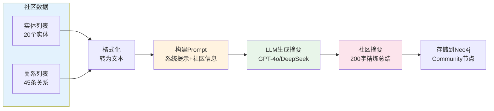
```mermaid
graph LR
    subgraph 社区数据[社区数据]
        Entities[实体列表<br/>20个实体]
        Rels[关系列表<br/>45条关系]
    end

    Entities --> Format[格式化<br/>转为文本]
    Rels --> Format

    Format --> Prompt[构建Prompt<br/>系统提示+社区信息]

    Prompt --> LLM[LLM生成摘要<br/>GPT-4o/DeepSeek]

    LLM --> Summary[社区摘要<br/>200字精炼总结]

    Summary --> Store[存储到Neo4j<br/>Community节点]

    style 社区数据 fill:#e3f2fd
    style Prompt fill:#fff3e0
    style LLM fill:#e8f5e9
    style Summary fill:#fce4ec
```

### Prompt 工程

社区摘要的 Prompt 设计至关重要：

```python
# backend/graphrag_agent/config/prompts/graph_prompts.py

COMMUNITY_SUMMARY_PROMPT = """
你是一个知识图谱分析专家。你的任务是为给定的社区生成简洁且信息丰富的摘要。

社区包含一组相关的实体和关系，你需要：
1. 识别社区的核心主题
2. 总结主要实体及其角色
3. 描述关键关系和规则
4. 用简洁语言表达（100-200字）

输出格式：
一段连贯的文字，不要使用列表或标题。

示例：
本社区聚焦于国家奖学金评选体系。核心实体包括国家奖学金、国家励志奖学金和优秀学生。
评选流程为：学生提交申请，评审委员会根据成绩和综合表现进行评选，最终确定获奖名单。
国家奖学金和国家励志奖学金互斥，学生只能申请其中一项。整个评选过程需在每学期末完成。
"""
```

**Prompt 要点**：
- 明确任务：生成社区摘要
- 指定长度：100-200字
- 要求结构：主题+实体+关系
- 示例引导：提供高质量示例

### 多层级摘要

对于 Leiden 算法的分层社区，生成多层级摘要：

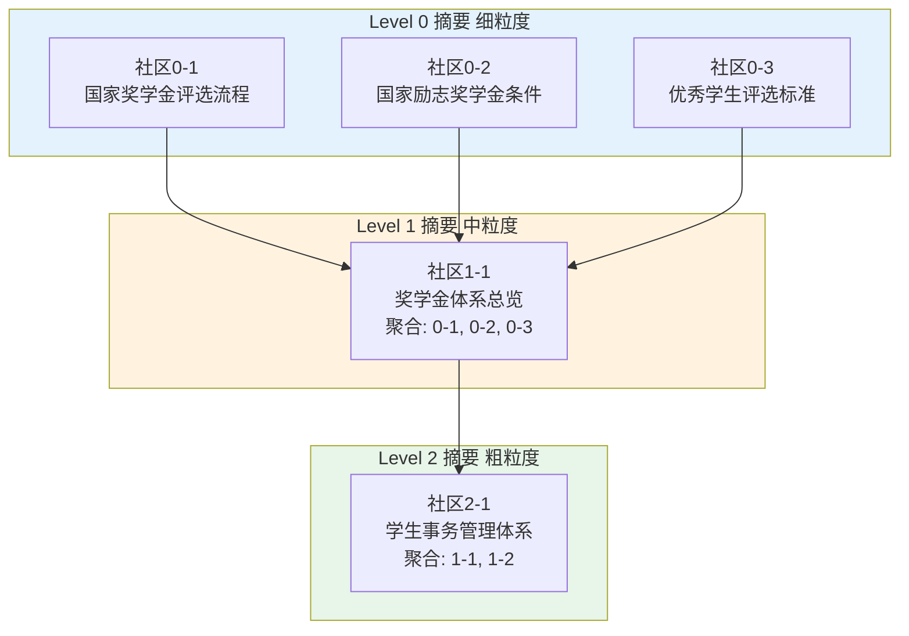
```mermaid
graph TB
    subgraph Level0摘要[Level 0 摘要 细粒度]
        S0_1[社区0-1<br/>国家奖学金评选流程]
        S0_2[社区0-2<br/>国家励志奖学金条件]
        S0_3[社区0-3<br/>优秀学生评选标准]
    end

    subgraph Level1摘要[Level 1 摘要 中粒度]
        S1_1[社区1-1<br/>奖学金体系总览<br/>聚合: 0-1, 0-2, 0-3]
    end

    subgraph Level2摘要[Level 2 摘要 粗粒度]
        S2_1[社区2-1<br/>学生事务管理体系<br/>聚合: 1-1, 1-2]
    end

    S0_1 --> S1_1
    S0_2 --> S1_1
    S0_3 --> S1_1

    S1_1 --> S2_1

    style Level0摘要 fill:#e3f2fd
    style Level1摘要 fill:#fff3e0
    style Level2摘要 fill:#e8f5e9
```

**层级摘要的用途**：
- **Level 0**：具体问题检索
- **Level 1**：主题级检索
- **Level 2**：全局概览

### 摘要质量保证

```python
class BaseSummarizer:
    def _process_single_community(self, community: Dict) -> Dict:
        """处理单个社区摘要"""
        community_id = community.get('communityId', 'unknown')

        try:
            # 格式化社区信息
            stringify_info = self.describer.prepare_string(community)

            # 检查信息量
            if len(stringify_info) < 10:
                print(f"社区 {community_id} 信息太少，跳过")
                return {
                    "community": community_id,
                    "summary": "此社区信息不足。",
                    "full_content": stringify_info
                }

            # 调用 LLM 生成摘要
            summary = self.community_chain.invoke({
                'community_info': stringify_info
            })

            return {
                "community": community_id,
                "summary": summary,
                "full_content": stringify_info
            }

        except Exception as e:
            print(f"处理社区 {community_id} 出错: {e}")
            return {
                "community": community_id,
                "summary": f"生成摘要时出错: {str(e)}",
                "full_content": str(community)
            }
```

**质量保证措施**：
1. **信息量检查**：社区信息太少则跳过
2. **异常处理**：LLM 调用失败时返回错误信息
3. **并行生成**：多线程并行生成摘要
4. **进度监控**：实时显示生成进度

### 并行生成

```python
def _process_communities_parallel(
    self,
    community_info: List[Dict],
    workers: int
) -> List[Dict]:
    """并行处理社区摘要"""
    summaries = []

    with concurrent.futures.ThreadPoolExecutor(max_workers=workers) as executor:
        # 提交所有任务
        future_to_community = {
            executor.submit(self._process_single_community, info): i
            for i, info in enumerate(community_info)
        }

        # 收集结果
        for i, future in enumerate(concurrent.futures.as_completed(future_to_community)):
            try:
                result = future.result()
                summaries.append(result)

                # 显示进度
                if (i + 1) % 10 == 0:
                    print(f"已处理 {i+1}/{len(community_info)} "
                          f"({(i+1)/len(community_info)*100:.1f}%)")

            except Exception as e:
                print(f"处理社区摘要时出错: {e}")

    return summaries
```

**并行配置**：
```python
# 根据社区数量动态调整并发数
optimal_workers = min(
    MAX_WORKERS,                    # 系统配置的最大线程数
    max(1, len(community_info) // 2)  # 社区数的一半
)
```

### 存储摘要

```python
def store_summaries(self, summaries: List[Dict]) -> None:
    """存储社区摘要"""
    # 批量存储
    batch_size = 100

    for i in range(0, len(summaries), batch_size):
        batch = summaries[i:i+batch_size]

        self.graph.query("""
        UNWIND $data AS row
        MERGE (c:__Community__ {id: row.community})
        SET c.summary = row.summary,
            c.full_content = row.full_content,
            c.summary_created_at = datetime()
        """, params={"data": batch})
```

**存储的数据**：
- `summary`：摘要文本（200字左右）
- `full_content`：完整社区信息（用于详细分析）
- `summary_created_at`：摘要生成时间

---

## 分层社区结构

Leiden 算法生成的分层社区结构是本系统的一大特色。

### Level 0, 1, 2, 3 的含义

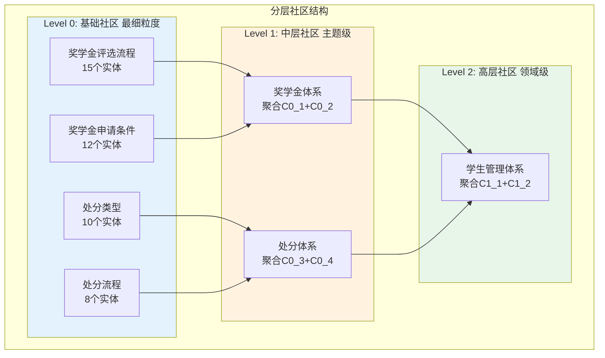
```mermaid
graph TB
    subgraph 分层结构[分层社区结构]
        subgraph L0[Level 0: 基础社区 最细粒度]
            direction TB
            C0_1[奖学金评选流程<br/>15个实体]
            C0_2[奖学金申请条件<br/>12个实体]
            C0_3[处分类型<br/>10个实体]
            C0_4[处分流程<br/>8个实体]
        end

        subgraph L1[Level 1: 中层社区 主题级]
            direction TB
            C1_1[奖学金体系<br/>聚合C0_1+C0_2]
            C1_2[处分体系<br/>聚合C0_3+C0_4]
        end

        subgraph L2[Level 2: 高层社区 领域级]
            direction TB
            C2_1[学生管理体系<br/>聚合C1_1+C1_2]
        end

        C0_1 --> C1_1
        C0_2 --> C1_1
        C0_3 --> C1_2
        C0_4 --> C1_2

        C1_1 --> C2_1
        C1_2 --> C2_1
    end

    style L0 fill:#e3f2fd
    style L1 fill:#fff3e0
    style L2 fill:#e8f5e9
```

**各层级含义**：

| 层级 | 粒度 | 社区数量 | 平均实体数 | 用途 |
|------|------|----------|-----------|------|
| Level 0 | 最细 | 100-200 | 5-15 | 具体问题检索 |
| Level 1 | 中等 | 20-50 | 30-60 | 主题级检索 |
| Level 2 | 较粗 | 5-15 | 100-200 | 领域级检索 |
| Level 3 | 最粗 | 2-5 | 500+ | 全局概览 |

### 层级聚合策略

Leiden 算法的层级聚合基于模块度优化：

```python
# Neo4j 中的层级结构存储

# Level 0 社区
MERGE (c0:__Community__ {id: '0-123'})
SET c0.level = 0

# Level 1 社区
MERGE (c1:__Community__ {id: '1-45'})
SET c1.level = 1

# Level 2 社区
MERGE (c2:__Community__ {id: '2-10'})
SET c2.level = 2

# 层级关系
(c0)-[:IN_COMMUNITY]->(c1)
(c1)-[:IN_COMMUNITY]->(c2)
```

**聚合过程**：

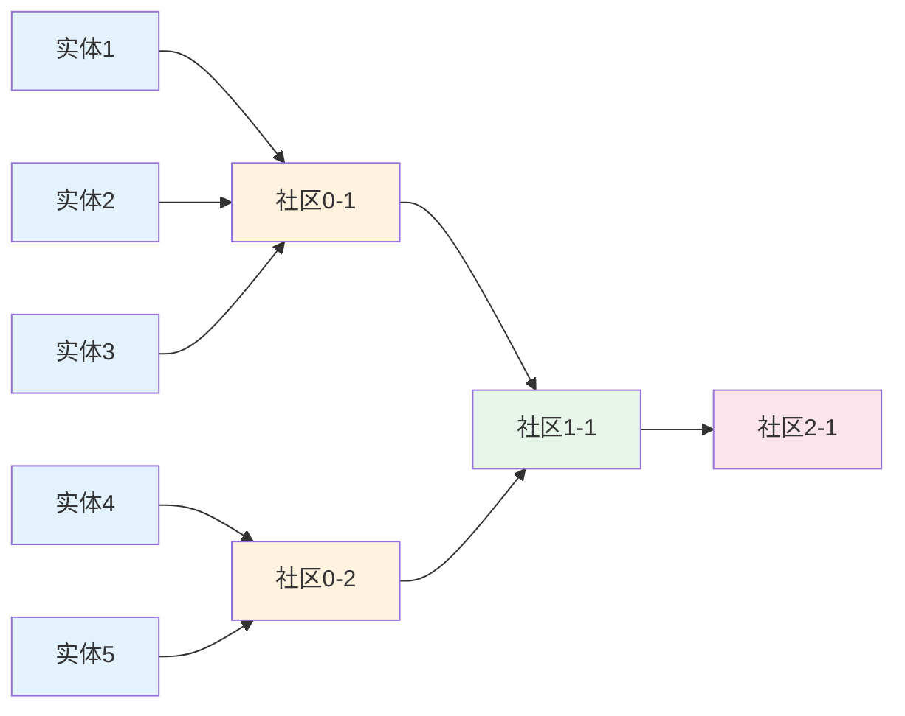
```mermaid
graph LR
    E1[实体1] --> C0_1[社区0-1]
    E2[实体2] --> C0_1
    E3[实体3] --> C0_1

    E4[实体4] --> C0_2[社区0-2]
    E5[实体5] --> C0_2

    C0_1 --> C1_1[社区1-1]
    C0_2 --> C1_1

    C1_1 --> C2_1[社区2-1]

    style E1 fill:#e3f2fd
    style E2 fill:#e3f2fd
    style E3 fill:#e3f2fd
    style E4 fill:#e3f2fd
    style E5 fill:#e3f2fd
    style C0_1 fill:#fff3e0
    style C0_2 fill:#fff3e0
    style C1_1 fill:#e8f5e9
    style C2_1 fill:#fce4ec
```

### 不同层级的应用场景

```python
# 场景1: 具体问题 → 使用 Level 0
query = "国家奖学金的申请条件是什么？"
level = 0  # 检索最细粒度社区

# 场景2: 主题级问题 → 使用 Level 1
query = "学校的奖学金体系是怎样的？"
level = 1  # 检索主题级社区

# 场景3: 全局问题 → 使用 Level 2 或更高
query = "学校的学生管理体系总体如何？"
level = 2  # 检索领域级社区
```

**全局搜索中的层级选择**：

```python
from graphrag_agent.search import GlobalSearch

# 创建全局搜索实例
global_search = GlobalSearch(
    level=0  # 可配置层级
)

# 执行搜索
results = global_search.search("学校的管理体系如何？")
```

**配置参数**：
```env
GLOBAL_SEARCH_LEVEL=0    # 默认使用的社区层级
```

---

## 代码实现

### 核心代码位置

```
backend/graphrag_agent/
├── community/                      # 社区检测模块
│   ├── __init__.py                # 工厂类导出
│   ├── detector/                  # 检测器实现
│   │   ├── base.py               # 基类
│   │   ├── leiden.py             # Leiden算法
│   │   ├── sllpa.py              # SLLPA算法
│   │   └── projections.py        # 图投影混入
│   └── summary/                   # 摘要生成
│       ├── base.py               # 摘要基类
│       ├── leiden.py             # Leiden摘要
│       └── sllpa.py              # SLLPA摘要
```

### Leiden 算法调用

```python
# backend/graphrag_agent/community/detector/leiden.py

from typing import Dict, Any
from .base import BaseCommunityDetector
from .projections import GraphProjectionMixin

class LeidenDetector(GraphProjectionMixin, BaseCommunityDetector):
    """Leiden算法社区检测实现"""

    def detect_communities(self) -> Dict[str, Any]:
        """执行Leiden算法社区检测"""
        if not self.G:
            raise ValueError("请先创建图投影")

        print("开始执行Leiden社区检测...")

        try:
            # 检查连通分量
            wcc = self.gds.wcc.stats(self.G)
            print(f"图包含 {wcc.get('componentCount', 0)} 个连通分量")

            # 执行Leiden算法
            result = self.gds.leiden.write(
                self.G,
                writeProperty="communities",
                includeIntermediateCommunities=True,
                relationshipWeightProperty="weight",
                **self._get_optimized_leiden_params()
            )

            return {
                'componentCount': wcc.get('componentCount', 0),
                'communityCount': result.get('communityCount', 0),
                'modularity': result.get('modularity', 0),
                'ranLevels': result.get('ranLevels', 0)
            }

        except Exception as e:
            print(f"Leiden算法执行失败: {e}")
            return self._execute_fallback_leiden()
```

### SLLPA 算法实现

```python
# backend/graphrag_agent/community/detector/sllpa.py

from typing import Dict, Any
from .base import BaseCommunityDetector
from .projections import GraphProjectionMixin

class SLLPADetector(GraphProjectionMixin, BaseCommunityDetector):
    """SLLPA算法社区检测实现"""

    def detect_communities(self) -> Dict[str, Any]:
        """执行SLLPA算法检测社区"""
        if not self.G:
            raise ValueError("请先创建图投影")

        print("开始执行SLLPA社区检测...")

        try:
            # 执行SLLPA算法
            result = self.gds.sllpa.write(
                self.G,
                writeProperty="communityIds",
                **self._get_optimized_sllpa_params()
            )

            community_count = result.get('communityCount', 0)
            iterations = result.get('iterations', 0)

            print(f"SLLPA算法完成: {community_count} 个社区, "
                  f"{iterations} 次迭代")

            return {
                'communityCount': community_count,
                'iterations': iterations
            }

        except Exception as e:
            print(f"SLLPA算法执行失败: {e}")
            return self._execute_fallback_sllpa()
```

### 社区摘要生成代码

```python
# backend/graphrag_agent/community/summary/leiden.py

from typing import List, Dict
from .base import BaseSummarizer

class LeidenSummarizer(BaseSummarizer):
    """Leiden算法的社区摘要生成器"""

    def collect_community_info(self) -> List[Dict]:
        """收集Leiden社区信息"""
        print("收集Leiden社区信息...")

        # 查询社区信息
        result = self.graph.query("""
        // 找到基础层级(level=0)的社区
        MATCH (c:`__Community__` {level: 0})
        WITH c ORDER BY c.community_rank DESC
        LIMIT 200

        // 获取社区中的实体
        MATCH (c)<-[:IN_COMMUNITY]-(e:__Entity__)
        WITH c, collect(e) as nodes
        WHERE size(nodes) > 1

        // 获取实体间的关系
        CALL {
            WITH nodes
            MATCH (n1:__Entity__) WHERE n1 IN nodes
            MATCH (n2:__Entity__) WHERE n2 IN nodes AND id(n1) < id(n2)
            MATCH (n1)-[r]->(n2)
            RETURN collect(distinct r) as relationships
        }

        // 返回格式化的结果
        RETURN c.id AS communityId,
            [n in nodes | {
                id: n.id,
                description: n.description,
                type: labels(n)[0]
            }] AS nodes,
            [r in relationships | {
                start: startNode(r).id,
                type: type(r),
                end: endNode(r).id,
                description: r.description
            }] AS rels
        """)

        print(f"收集到 {len(result)} 个社区信息")
        return result
```

### 完整使用示例

```python
# 示例1: 使用工厂类创建检测器

from graphrag_agent.community import CommunityDetectorFactory
from graphdatascience import GraphDataScience
from infrastructure.providers.neo4jdb import get_db_manager

# 初始化连接
gds = GraphDataScience(NEO4J_URI, auth=(USERNAME, PASSWORD))
db_manager = get_db_manager()
graph = db_manager.graph

# 创建Leiden检测器
detector = CommunityDetectorFactory.create(
    algorithm="leiden",
    gds=gds,
    graph=graph
)

# 执行检测
result = detector.process()

print(f"检测状态: {result['status']}")
print(f"社区数量: {result['details']['detection']['communityCount']}")
print(f"模块度: {result['details']['detection']['modularity']:.3f}")
print(f"层级数: {result['details']['detection']['ranLevels']}")
```

```python
# 示例2: 生成社区摘要

from graphrag_agent.community import CommunitySummarizerFactory

# 创建摘要生成器
summarizer = CommunitySummarizerFactory.create_summarizer(
    algorithm="leiden",
    graph=graph
)

# 生成摘要
summaries = summarizer.process_communities()

print(f"生成了 {len(summaries)} 个社区摘要")

# 查看摘要示例
for summary in summaries[:3]:
    print(f"\n社区 {summary['community']}:")
    print(f"摘要: {summary['summary']}")
```

```python
# 示例3: 完整的社区检测和摘要生成流程

from infrastructure.integrations.build.build_index_and_community import IndexCommunityBuilder

# 创建构建器
builder = IndexCommunityBuilder()

# 执行完整流程（包含索引、社区检测、摘要生成）
builder.process()

# 输出示例：
# [cyan]正在执行社区检测...[/cyan]
# 开始执行Leiden社区检测...
# 图包含 5 个连通分量
# 检测到 120 个社区
# [blue]社区检测完成，耗时: 32.15秒[/blue]
#
# [cyan]正在生成社区摘要...[/cyan]
# 收集到 120 个社区信息
# 开始并行生成 120 个社区摘要，使用 4 个线程...
# 已处理 30/120 (25.0%)
# 已处理 60/120 (50.0%)
# 已处理 90/120 (75.0%)
# 已处理 120/120 (100.0%)
# [blue]社区摘要生成完成，耗时: 185.32秒[/blue]
```

```python
# 示例4: 查询社区信息

from langchain_community.graphs import Neo4jGraph

graph = Neo4jGraph(
    url=NEO4J_URI,
    username=NEO4J_USERNAME,
    password=NEO4J_PASSWORD
)

# 查询所有Level 0社区
communities = graph.query("""
MATCH (c:`__Community__` {level: 0})
RETURN c.id AS id,
       c.summary AS summary,
       c.community_rank AS rank
ORDER BY c.community_rank DESC
LIMIT 10
""")

for comm in communities:
    print(f"\n社区 {comm['id']} (权重: {comm['rank']})")
    print(f"摘要: {comm['summary']}")
```

```python
# 示例5: 获取实体所属社区

# 查询某个实体所属的所有层级社区
entity_communities = graph.query("""
MATCH (e:`__Entity__` {id: $entity_id})
MATCH (e)-[:IN_COMMUNITY*]->(c:`__Community__`)
RETURN c.id AS community_id,
       c.level AS level,
       c.summary AS summary
ORDER BY c.level ASC
""", params={"entity_id": "国家奖学金"})

print(f"\n实体'国家奖学金'所属社区:")
for comm in entity_communities:
    print(f"Level {comm['level']}: {comm['community_id']}")
    print(f"  摘要: {comm['summary']}\n")
```

---

## 性能与优化

### 算法复杂度

**Leiden 算法**：
```
时间复杂度: O(n log n)
空间复杂度: O(n + m)

其中:
- n: 节点数
- m: 边数

实测性能（单核）:
- 10,000节点, 50,000边: ~5秒
- 50,000节点, 250,000边: ~30秒
- 100,000节点, 500,000边: ~90秒
```

**SLLPA 算法**：
```
时间复杂度: O(k × m)
空间复杂度: O(n)

其中:
- k: 迭代次数（通常 50-100）
- m: 边数
- n: 节点数

实测性能（单核）:
- 10,000节点, 50,000边: ~3秒
- 50,000节点, 250,000边: ~18秒
- 100,000节点, 500,000边: ~50秒
```

### 内存消耗

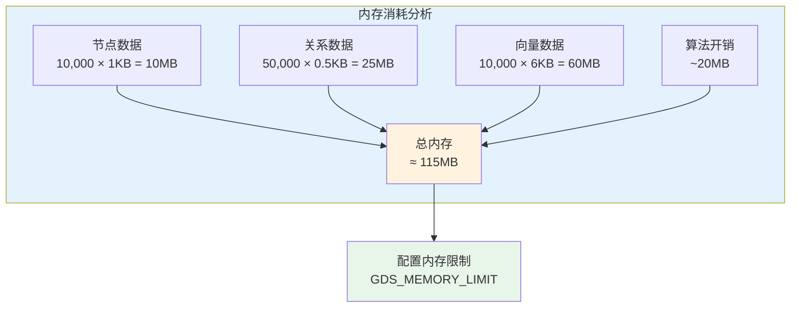
```mermaid
graph TB
    subgraph 内存消耗分析[内存消耗分析]
        Node[节点数据<br/>10,000 × 1KB = 10MB]
        Rel[关系数据<br/>50,000 × 0.5KB = 25MB]
        Embed[向量数据<br/>10,000 × 6KB = 60MB]
        Algo[算法开销<br/>~20MB]

        Total[总内存<br/>≈ 115MB]

        Node --> Total
        Rel --> Total
        Embed --> Total
        Algo --> Total
    end

    Total --> Config[配置内存限制<br/>GDS_MEMORY_LIMIT]

    style 内存消耗分析 fill:#e3f2fd
    style Total fill:#fff3e0
    style Config fill:#e8f5e9
```

**内存配置建议**：

| 图规模 | 节点数 | 边数 | 推荐内存 | GDS_MEMORY_LIMIT |
|--------|--------|------|----------|------------------|
| 小型 | <10K | <50K | 2GB | 2 |
| 中型 | 10K-50K | 50K-250K | 6GB | 6 |
| 大型 | 50K-100K | 250K-500K | 16GB | 16 |
| 超大 | >100K | >500K | 32GB+ | 32 |

### GDS 配置优化

```python
# backend/graphrag_agent/config/settings.py

# GDS内存限制（GB）
GDS_MEMORY_LIMIT = _get_env_int("GDS_MEMORY_LIMIT", 6) or 6

# GDS并发度
GDS_CONCURRENCY = _get_env_int("GDS_CONCURRENCY", 4) or 4

# GDS节点数量限制
GDS_NODE_COUNT_LIMIT = _get_env_int("GDS_NODE_COUNT_LIMIT", 50000) or 50000

# GDS超时时长（秒）
GDS_TIMEOUT_SECONDS = _get_env_int("GDS_TIMEOUT_SECONDS", 300) or 300
```

**优化建议**：

```python
class BaseCommunityDetector:
    def _adjust_parameters(self):
        """根据系统资源调整参数"""
        memory_gb = GDS_MEMORY_LIMIT

        if memory_gb > 32:
            self.node_count_limit = 100000
            self.timeout_seconds = 600
            self.max_concurrency = GDS_CONCURRENCY
        elif memory_gb > 16:
            self.node_count_limit = 50000
            self.timeout_seconds = 300
            self.max_concurrency = max(1, GDS_CONCURRENCY - 1)
        else:
            self.node_count_limit = 20000
            self.timeout_seconds = 180
            self.max_concurrency = max(1, GDS_CONCURRENCY // 2)
```

### 批处理策略

**社区摘要生成的批处理**：

```python
def _process_communities_parallel(
    self,
    community_info: List[Dict],
    workers: int
) -> List[Dict]:
    """并行处理社区摘要"""
    # 动态调整并发数
    optimal_workers = min(
        workers,
        max(1, len(community_info) // 2)
    )

    print(f"使用 {optimal_workers} 个线程并行处理")

    summaries = []
    with concurrent.futures.ThreadPoolExecutor(max_workers=optimal_workers) as executor:
        future_to_community = {
            executor.submit(self._process_single_community, info): i
            for i, info in enumerate(community_info)
        }

        for future in concurrent.futures.as_completed(future_to_community):
            summaries.append(future.result())

    return summaries
```

**数据库批处理**：

```python
# 批量存储社区摘要
batch_size = min(100, max(10, len(summaries) // 5))

for i in range(0, len(summaries), batch_size):
    batch = summaries[i:i+batch_size]

    self.graph.query("""
    UNWIND $data AS row
    MERGE (c:__Community__ {id: row.community})
    SET c.summary = row.summary,
        c.full_content = row.full_content
    """, params={"data": batch})
```

### 性能监控

```python
class BaseCommunityDetector:
    def process(self) -> Dict[str, Any]:
        """执行完整的社区检测流程"""
        start_time = time.time()

        results = {
            'status': 'success',
            'algorithm': self.__class__.__name__,
            'details': {}
        }

        try:
            with self._graph_projection_context():
                # 执行检测
                detection_start = time.time()
                detection_result = self.detect_communities()
                self.detection_time = time.time() - detection_start

                # 保存结果
                save_start = time.time()
                save_result = self.save_communities()
                self.save_time = time.time() - save_start

            # 性能统计
            total_time = time.time() - start_time
            results['performance'] = {
                'totalTime': total_time,
                'projectionTime': self.projection_time,
                'detectionTime': self.detection_time,
                'saveTime': self.save_time
            }

            return results

        except Exception as e:
            results.update({
                'status': 'error',
                'error': str(e)
            })
            raise
```

**性能指标输出**：

```
社区检测完成，总耗时: 45.23秒
  图投影创建: 8.50秒 (18.8%)
  社区检测: 32.10秒 (71.0%)
  结果保存: 4.63秒 (10.2%)
```

---

## 实际应用

### 全局搜索如何使用社区

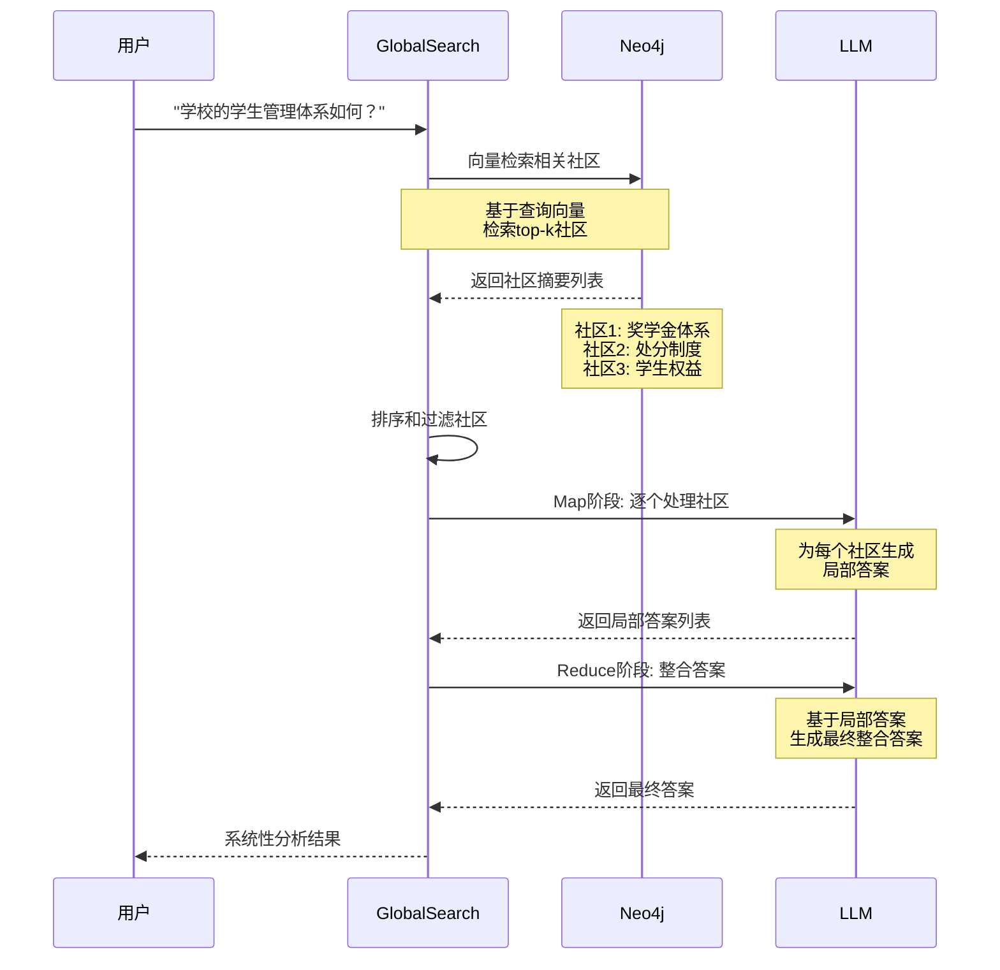
```mermaid
sequenceDiagram
    participant U as 用户
    participant GS as GlobalSearch
    participant Neo4j as Neo4j
    participant LLM as LLM

    U->>GS: "学校的学生管理体系如何？"

    GS->>Neo4j: 向量检索相关社区
    Note over GS,Neo4j: 基于查询向量<br/>检索top-k社区

    Neo4j-->>GS: 返回社区摘要列表
    Note over Neo4j: 社区1: 奖学金体系<br/>社区2: 处分制度<br/>社区3: 学生权益

    GS->>GS: 排序和过滤社区

    GS->>LLM: Map阶段: 逐个处理社区
    Note over LLM: 为每个社区生成<br/>局部答案

    LLM-->>GS: 返回局部答案列表

    GS->>LLM: Reduce阶段: 整合答案
    Note over LLM: 基于局部答案<br/>生成最终整合答案

    LLM-->>GS: 返回最终答案
    GS-->>U: 系统性分析结果
```

**代码示例**：

```python
# backend/graphrag_agent/search/global_search.py

class GlobalSearch:
    def __init__(self, level: int = 0):
        """
        初始化全局搜索

        Args:
            level: 社区层级（0=最细, 1=中层, 2=高层）
        """
        self.level = level
        self.graph = get_graph()
        self.llm = get_llm_model()

    def search(self, query: str, top_k: int = 5) -> str:
        """
        执行全局搜索

        Args:
            query: 用户查询
            top_k: 返回的社区数量

        Returns:
            整合后的答案
        """
        # 1. 检索相关社区
        communities = self._retrieve_communities(query, top_k)

        # 2. Map阶段：为每个社区生成局部答案
        local_answers = []
        for community in communities:
            answer = self._generate_local_answer(query, community)
            local_answers.append(answer)

        # 3. Reduce阶段：整合局部答案
        final_answer = self._reduce_answers(query, local_answers)

        return final_answer

    def _retrieve_communities(self, query: str, top_k: int) -> List[Dict]:
        """检索相关社区"""
        query_vec = self.embeddings.embed_query(query)

        # 向量检索社区
        result = self.graph.query("""
        MATCH (c:`__Community__` {level: $level})
        WHERE c.summary IS NOT NULL
        RETURN c.id AS id,
               c.summary AS summary,
               c.community_rank AS rank
        ORDER BY c.community_rank DESC
        LIMIT $top_k
        """, params={"level": self.level, "top_k": top_k})

        return result
```

### 社区浏览和可视化

**Neo4j Browser 可视化**：

```cypher
// 查看所有Level 0社区
MATCH (c:`__Community__` {level: 0})
RETURN c
LIMIT 50

// 查看社区层级结构
MATCH path = (c0:`__Community__` {level: 0})-[:IN_COMMUNITY*]->(c2:`__Community__` {level: 2})
RETURN path
LIMIT 10

// 查看某个社区的实体
MATCH (c:`__Community__` {id: '0-123'})
MATCH (c)<-[:IN_COMMUNITY]-(e:`__Entity__`)
RETURN c, e
LIMIT 50
```

**前端可视化（Streamlit）**：

```python
import streamlit as st
import networkx as nx
from pyvis.network import Network

def visualize_community(community_id: str):
    """可视化单个社区"""
    # 查询社区数据
    result = graph.query("""
    MATCH (c:`__Community__` {id: $community_id})
    MATCH (c)<-[:IN_COMMUNITY]-(e:`__Entity__`)
    OPTIONAL MATCH (e)-[r]->(e2:`__Entity__`)
    WHERE (e2)-[:IN_COMMUNITY]->(c)
    RETURN e.id AS entity, collect(distinct {
        target: e2.id,
        type: type(r)
    }) AS relationships
    """, params={"community_id": community_id})

    # 构建NetworkX图
    G = nx.Graph()
    for row in result:
        G.add_node(row['entity'])
        for rel in row['relationships']:
            if rel['target']:
                G.add_edge(row['entity'], rel['target'], label=rel['type'])

    # 使用Pyvis可视化
    net = Network(height="600px", width="100%", bgcolor="#ffffff")
    net.from_nx(G)
    net.show("community.html")

    # 在Streamlit中显示
    st.components.v1.html(open("community.html").read(), height=600)

# Streamlit界面
st.title("社区可视化")

community_id = st.text_input("输入社区ID", value="0-1")
if st.button("可视化"):
    visualize_community(community_id)
```

### 典型案例

**案例1: 学生奖学金体系分析**

```python
# 用户问题
query = "学校的奖学金体系是怎样的？各类奖学金有什么区别？"

# 系统处理
# 1. 检索到相关社区
#    - 社区0-15: 国家奖学金评选
#    - 社区0-16: 国家励志奖学金评选
#    - 社区0-17: 上海市奖学金评选
#    - 社区0-18: 学校优秀学生评选

# 2. 各社区摘要
summaries = [
    "国家奖学金是最高荣誉，要求成绩排名前3%，奖金8000元...",
    "国家励志奖学金面向家庭困难学生，要求成绩前10%，奖金5000元...",
    "上海市奖学金由市政府设立，要求综合素质优秀，奖金3000元...",
    "优秀学生评选综合考虑学习、活动等，分一二三等奖..."
]

# 3. LLM整合答案
final_answer = """
学校建立了多层次的奖学金体系：

1. 国家级奖学金
   - 国家奖学金：最高荣誉，成绩前3%，奖金8000元
   - 国家励志奖学金：面向困难学生，成绩前10%，奖金5000元
   - 注意：两者互斥，不可兼得

2. 省市级奖学金
   - 上海市奖学金：综合素质优秀，奖金3000元

3. 校级奖学金
   - 优秀学生奖学金：分一二三等，覆盖面广

各类奖学金的主要区别在于评选标准、奖金金额和覆盖面。
国家级奖学金要求最高但奖金最多，校级奖学金覆盖面最广。
"""
```

**案例2: 处分制度查询**

```python
# 用户问题
query = "旷课会受到什么处分？"

# 系统处理
# 1. 检索到相关社区
#    - 社区0-25: 旷课处分规定
#    - 社区0-26: 处分类型和流程

# 2. 社区摘要
summary = """
社区0-25: 旷课处分规定
学生旷课累计达到一定学时将受到相应处分。具体标准为：
累计旷课10-19学时，给予警告处分；
累计旷课20-29学时，给予严重警告处分；
累计旷课30-39学时，给予记过处分；
累计旷课40学时及以上，给予退学处分。
处分由学生处负责执行，学生有权申诉。
"""

# 3. 最终答案
final_answer = """
根据学校规定，旷课将根据累计学时受到不同程度的处分：

- 10-19学时：警告处分
- 20-29学时：严重警告处分
- 30-39学时：记过处分
- 40学时及以上：退学处分

处分由学生处负责执行，如有异议可在规定时间内提出申诉。
建议严格遵守考勤制度，避免旷课行为。
"""
```

---

## 配置参数

### 环境变量配置

```bash
# .env 文件

# ========== 社区检测算法选择 ==========
GRAPH_COMMUNITY_ALGORITHM=leiden    # leiden / sllpa

# ========== GDS 资源配置 ==========
GDS_MEMORY_LIMIT=6                  # GDS内存限制（GB）
GDS_CONCURRENCY=4                   # GDS并发度
GDS_NODE_COUNT_LIMIT=50000          # 节点数量上限
GDS_TIMEOUT_SECONDS=300             # 超时时长（秒）

# ========== 社区摘要配置 ==========
COMMUNITY_BATCH_SIZE=50             # 社区批处理大小
MAX_WORKERS=4                       # 并行线程数

# ========== 全局搜索配置 ==========
GLOBAL_SEARCH_LEVEL=0               # 默认社区层级
GLOBAL_SEARCH_BATCH_SIZE=5          # 批处理大小
```

### 配置来源

```python
# backend/config/rag.py（领域/RAG 语义）
community_algorithm = os.getenv("GRAPH_COMMUNITY_ALGORITHM", "leiden")

# backend/graphrag_agent/config/settings.py（RAG 引擎参数）
# GDS 配置
GDS_MEMORY_LIMIT = _get_env_int("GDS_MEMORY_LIMIT", 6) or 6
GDS_CONCURRENCY = _get_env_int("GDS_CONCURRENCY", 4) or 4
GDS_NODE_COUNT_LIMIT = _get_env_int("GDS_NODE_COUNT_LIMIT", 50000) or 50000
GDS_TIMEOUT_SECONDS = _get_env_int("GDS_TIMEOUT_SECONDS", 300) or 300

# 社区批处理
COMMUNITY_BATCH_SIZE = _get_env_int("COMMUNITY_BATCH_SIZE", 50) or 50

# 全局搜索
GLOBAL_SEARCH_SETTINGS = {
    "default_level": _get_env_int("GLOBAL_SEARCH_LEVEL", 0) or 0,
    "community_batch_size": _get_env_int("GLOBAL_SEARCH_BATCH_SIZE", 5) or 5,
}
```

### 参数调优建议

**小型图（<10K节点）**：
```bash
GRAPH_COMMUNITY_ALGORITHM=leiden
GDS_MEMORY_LIMIT=2
GDS_CONCURRENCY=2
GDS_NODE_COUNT_LIMIT=10000
COMMUNITY_BATCH_SIZE=20
MAX_WORKERS=2
```

**中型图（10K-50K节点）**：
```bash
GRAPH_COMMUNITY_ALGORITHM=leiden
GDS_MEMORY_LIMIT=6
GDS_CONCURRENCY=4
GDS_NODE_COUNT_LIMIT=50000
COMMUNITY_BATCH_SIZE=50
MAX_WORKERS=4
```

**大型图（50K-100K节点）**：
```bash
GRAPH_COMMUNITY_ALGORITHM=leiden
GDS_MEMORY_LIMIT=16
GDS_CONCURRENCY=8
GDS_NODE_COUNT_LIMIT=100000
COMMUNITY_BATCH_SIZE=100
MAX_WORKERS=8
```

**超大图（>100K节点）**：
```bash
GRAPH_COMMUNITY_ALGORITHM=leiden
GDS_MEMORY_LIMIT=32
GDS_CONCURRENCY=16
GDS_NODE_COUNT_LIMIT=200000
COMMUNITY_BATCH_SIZE=200
MAX_WORKERS=16
```

---

## 相关文档

- [知识图谱构建](./知识图谱构建.md) - 了解社区检测的前置步骤
- [搜索引擎](./搜索引擎.md) - 了解社区在检索中的应用
- [Agent系统](./Agent系统.md) - 了解Agent如何使用社区信息
- [系统架构总览](../01-整体架构/系统架构总览.md) - 了解整体架构
- [Neo4j GDS 官方文档](https://neo4j.com/docs/graph-data-science/) - Neo4j图数据科学库
- [Leiden 算法论文](https://www.nature.com/articles/s41598-019-41695-z) - 算法原理详解

---

## 更新日志

| 版本 | 日期 | 更新内容 | 作者 |
|------|------|----------|------|
| 1.0 | 2026-01-04 | 初始版本，完整覆盖社区检测机制 | Claude |
| - | - | - | - |
