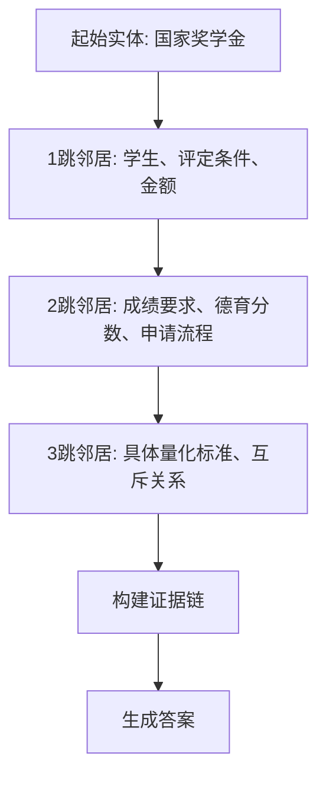
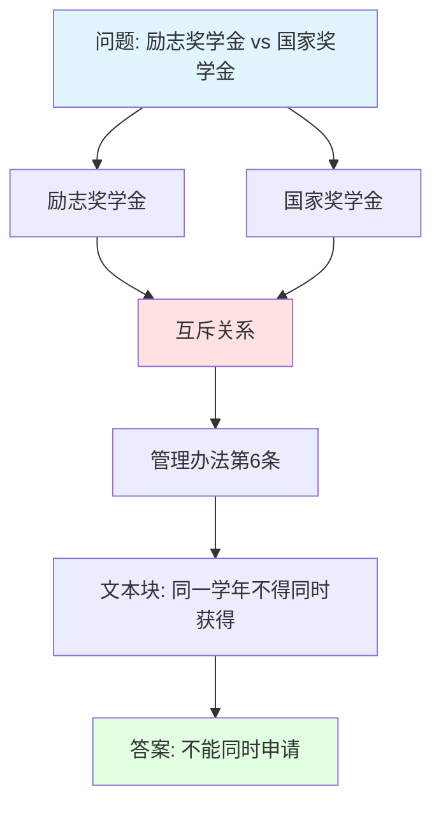

# Chain of Exploration（探索链）

> **目标读者**：架构师、研究者
> **阅读时间**：35 分钟
> **前置知识**：了解 DeepSearch、知识图谱
> **难度等级**：⭐⭐⭐⭐

## 📋 本文大纲

- [1. 什么是 Chain of Exploration](#1-什么是-chain-of-exploration)
- [2. 探索机制](#2-探索机制)
- [3. 探索策略](#3-探索策略)
- [4. 证据追踪](#4-证据追踪)
- [5. 与 DeepResearchAgent 的集成](#5-与-deepresearchagent-的集成)
- [6. 代码实现](#6-代码实现)
- [7. 实际案例](#7-实际案例)
- [8. 性能优化](#8-性能优化)

---

## 1. 什么是 Chain of Exploration

### 1.1 定义

**Chain of Exploration**（探索链）是一种在**知识图谱上进行深度探索的机制**，通过迭代式的邻居扩展和路径评分，从起始实体出发，逐步发现相关实体和关系，构建完整的证据链。

### 1.2 与 Chain of Thought 的区别

**Chain of Thought（思维链）**：
```
问题 → 思考步骤1 → 思考步骤2 → ... → 答案
（在文本空间中推理）
```

**Chain of Exploration（探索链）**：
```
问题 → 向量检索起始节点 → 探索1跳邻居 → 评估 → 探索2跳邻居 → ... → 答案
（在图谱空间中探索）
```

**核心差异**：

| 维度 | Chain of Thought | Chain of Exploration |
|------|------------------|----------------------|
| **探索空间** | 文本/思维空间 | 知识图谱 |
| **导航方式** | LLM 推理 | 图遍历 + LLM 评估 |
| **结构化程度** | 低（自由文本） | 高（实体-关系） |
| **可溯源性** | 中等 | 强（明确的图路径） |
| **推理类型** | 逻辑推理 | 关系推理 + 逻辑推理 |

### 1.3 在知识图谱上的探索

**知识图谱结构**：
```
实体 ─关系→ 实体 ─关系→ 实体
  ↓              ↓
属性            属性
```

**探索过程**：


**优势**：
- 利用图结构的**关系语义**
- 通过**邻居扩展**发现隐含信息
- 提供**可验证的探索路径**

---

## 2. 探索机制

### 2.1 起始节点选择（向量检索）

**目标**：从用户问题出发，找到最相关的实体作为探索起点。

**方法**：向量相似度检索

```python
# 核心代码：backend/graphrag_agent/search/local_search.py

def search(self, query: str) -> str:
    # 初始化向量存储
    vector_store = from_existing_index(
        self.embeddings,
        index_name=self.index_name,  # "entity_index"
        retrieval_query=self.retrieval_query
    )

    # 执行相似度搜索，找到 top_k 个最相关实体
    docs = vector_store.similarity_search(
        query,
        k=self.top_entities,  # 默认 5 个实体
        params={
            "topChunks": self.top_chunks,
            "topCommunities": self.top_communities,
            # ...
        }
    )
```

**示例**：

```
问题："旷课多少学时会被退学？"

向量检索结果（top 3 实体）：
1. 实体: "退学处理" (相似度: 0.92)
2. 实体: "旷课" (相似度: 0.89)
3. 实体: "学生纪律处分" (相似度: 0.85)

选择起始节点：["退学处理", "旷课", "学生纪律处分"]
```

### 2.2 邻居扩展（1跳、2跳）

**1 跳邻居**：直接连接的实体

**Cypher 查询**：
```cypher
// 获取1跳邻居
MATCH (start:__Entity__)-[r]-(neighbor:__Entity__)
WHERE start.id IN $start_entities
RETURN neighbor, r
ORDER BY r.weight DESC
LIMIT 20
```

**2 跳邻居**：通过中间节点连接的实体

```cypher
// 获取2跳邻居
MATCH (start:__Entity__)-[r1]-(mid:__Entity__)-[r2]-(neighbor:__Entity__)
WHERE start.id IN $start_entities
  AND neighbor <> start  // 排除回到起点
RETURN neighbor, r1, mid, r2
ORDER BY r1.weight * r2.weight DESC
LIMIT 30
```

**示例**：

```
起始实体："旷课"

1跳邻居：
  "旷课" -[导致]-> "退学处理"
  "旷课" -[累计到]-> "50学时"
  "旷课" -[属于]-> "违纪行为"

2跳邻居：
  "旷课" -[导致]-> "退学处理" -[依据]-> "学生纪律处分管理规定"
  "旷课" -[累计到]-> "50学时" -[定义在]-> "学生手册第15条"
```

### 2.3 路径评分和剪枝

**路径评分算法**：

```python
def score_path(path, query_embedding):
    """
    为探索路径打分

    参数:
        path: 路径对象 [实体1, 关系1, 实体2, 关系2, ...]
        query_embedding: 问题的向量表示

    返回:
        float: 路径得分 (0-1)
    """
    score = 0.0

    # 1. 语义相关性（30%权重）
    entities = [p for i, p in enumerate(path) if i % 2 == 0]
    entity_embeddings = get_embeddings(entities)
    semantic_score = cosine_similarity(query_embedding, entity_embeddings).mean()
    score += 0.3 * semantic_score

    # 2. 关系权重（40%权重）
    relations = [p for i, p in enumerate(path) if i % 2 == 1]
    relation_weights = [r.weight for r in relations]
    weight_score = sum(relation_weights) / len(relation_weights) if relation_weights else 0
    score += 0.4 * weight_score

    # 3. 路径长度惩罚（20%权重）
    path_length = len(entities) - 1
    length_penalty = 1.0 / (1.0 + 0.2 * path_length)  # 越长越低
    score += 0.2 * length_penalty

    # 4. 新颖性奖励（10%权重）
    # 优先探索未访问过的实体
    novelty_score = len([e for e in entities if e not in visited]) / len(entities)
    score += 0.1 * novelty_score

    return score
```

**剪枝策略**：

```python
def prune_paths(paths, top_k=10, threshold=0.6):
    """
    剪枝：保留高质量路径

    参数:
        paths: 所有候选路径
        top_k: 保留前k条路径
        threshold: 最低分数阈值

    返回:
        List: 剪枝后的路径列表
    """
    # 1. 按得分排序
    scored_paths = [(score_path(p, query_emb), p) for p in paths]
    scored_paths.sort(reverse=True, key=lambda x: x[0])

    # 2. 过滤低分路径
    filtered = [p for score, p in scored_paths if score >= threshold]

    # 3. 取 top_k
    return filtered[:top_k]
```

### 2.4 终止条件

**探索何时停止？**

```python
def should_stop_exploration(iteration, evidence, confidence):
    """
    判断是否停止探索

    参数:
        iteration: 当前迭代次数
        evidence: 已收集的证据
        confidence: 当前置信度

    返回:
        bool: 是否停止
    """
    # 条件1: 达到最大迭代次数
    if iteration >= MAX_ITERATIONS:  # 默认 5
        return True

    # 条件2: 置信度足够高
    if confidence > CONFIDENCE_THRESHOLD:  # 默认 0.9
        return True

    # 条件3: 无新证据发现（连续2轮）
    if len(evidence) > 0:
        recent_evidence = evidence[-2:]
        if all(len(e) == 0 for e in recent_evidence):
            return True

    # 条件4: LLM 判断已有足够信息
    if llm_judges_sufficient(evidence, query):
        return True

    return False
```

---

## 3. 探索策略

### 3.1 深度优先 vs 广度优先

**深度优先搜索（DFS）**：

```
起始节点
  └─ 邻居1
      └─ 邻居1.1
          └─ 邻居1.1.1  ← 深入探索
      └─ 邻居1.2
  └─ 邻居2
```

**优势**：
- 快速到达远端节点
- 适合查找特定路径

**劣势**：
- 可能错过近邻的重要信息

**广度优先搜索（BFS）**：

```
起始节点
  ├─ 邻居1
  ├─ 邻居2
  └─ 邻居3     ← 先探索所有1跳邻居
      ├─ 邻居3.1
      └─ 邻居3.2  ← 再探索2跳邻居
```

**优势**：
- 全面覆盖近邻
- 不易遗漏重要信息

**劣势**：
- 计算量大
- 可能陷入局部

**本项目的混合策略**：

```python
def hybrid_exploration(start_entities, max_depth=2):
    """
    混合探索策略：BFS + 相关性剪枝

    1. 第1跳：BFS 探索所有直接邻居
    2. 评分剪枝：保留 top_k 个最相关邻居
    3. 第2跳：从剪枝后的邻居继续 BFS
    """
    visited = set()
    evidence = []

    # 第1跳：广度优先
    neighbors_1hop = get_all_neighbors(start_entities)

    # 评分和剪枝
    scored_neighbors = score_entities(neighbors_1hop, query)
    top_neighbors = prune_entities(scored_neighbors, top_k=10)

    # 收集证据
    evidence.extend(extract_evidence(top_neighbors))
    visited.update(top_neighbors)

    # 第2跳：从高分邻居继续探索
    for neighbor in top_neighbors:
        neighbors_2hop = get_all_neighbors([neighbor])
        new_neighbors = [n for n in neighbors_2hop if n not in visited]

        # 再次评分和剪枝
        scored_2hop = score_entities(new_neighbors, query)
        top_2hop = prune_entities(scored_2hop, top_k=5)

        evidence.extend(extract_evidence(top_2hop))
        visited.update(top_2hop)

    return evidence, visited
```

### 3.2 相关性引导的探索

**核心思想**：利用 LLM 评估每个邻居节点与问题的相关性，优先探索高相关节点。

**实现代码**（简化版）：

```python
def relevance_guided_exploration(start_entities, query):
    """
    相关性引导的探索

    参数:
        start_entities: 起始实体列表
        query: 用户问题

    返回:
        探索结果
    """
    current_level = start_entities
    explored_paths = []

    for depth in range(MAX_DEPTH):
        next_level = []

        for entity in current_level:
            # 获取邻居
            neighbors = get_neighbors(entity)

            # 为每个邻居评估相关性
            for neighbor in neighbors:
                relevance = evaluate_relevance(neighbor, query, entity)

                if relevance > RELEVANCE_THRESHOLD:  # 0.7
                    next_level.append(neighbor)
                    explored_paths.append({
                        "from": entity,
                        "to": neighbor,
                        "relevance": relevance,
                        "depth": depth
                    })

        # 剪枝：只保留 top_k 个最相关的邻居
        next_level = sorted(next_level,
                           key=lambda x: x["relevance"],
                           reverse=True)[:TOP_K]

        current_level = next_level

        if not current_level:
            break

    return explored_paths
```

**相关性评估**：

```python
def evaluate_relevance(neighbor, query, source_entity):
    """
    评估邻居实体的相关性

    使用 LLM 或向量相似度
    """
    # 方法1: 向量相似度
    query_emb = get_embedding(query)
    neighbor_emb = get_embedding(neighbor.description)
    semantic_sim = cosine_similarity(query_emb, neighbor_emb)

    # 方法2: 关系权重
    relation = get_relation(source_entity, neighbor)
    relation_weight = relation.weight / MAX_WEIGHT  # 归一化

    # 方法3: LLM 判断
    prompt = f"""
    问题：{query}
    当前已探索到实体：{source_entity.name}
    待评估邻居实体：{neighbor.name}
    关系：{relation.type}

    请评估该邻居实体对回答问题的相关性（0-1分）。
    """
    llm_score = llm.invoke(prompt).extract_score()

    # 综合得分
    final_score = 0.4 * semantic_sim + 0.3 * relation_weight + 0.3 * llm_score
    return final_score
```

### 3.3 动态路径调整

**场景**：探索过程中发现某条路径不相关，需要回溯并选择新路径。

**回溯机制**：

```python
class ExplorationTracker:
    """探索路径追踪器"""

    def __init__(self):
        self.path_stack = []  # 路径栈
        self.visited = set()  # 已访问节点
        self.dead_ends = set()  # 死胡同

    def explore(self, node):
        """探索节点"""
        self.path_stack.append(node)
        self.visited.add(node)

    def backtrack(self):
        """回溯到上一个节点"""
        if self.path_stack:
            dead_node = self.path_stack.pop()
            self.dead_ends.add(dead_node)
            return self.path_stack[-1] if self.path_stack else None
        return None

    def should_backtrack(self, current_node, neighbors):
        """判断是否应该回溯"""
        # 条件1: 所有邻居都已访问
        unvisited_neighbors = [n for n in neighbors if n not in self.visited]
        if not unvisited_neighbors:
            return True

        # 条件2: 所有邻居都是死胡同
        if all(n in self.dead_ends for n in neighbors):
            return True

        # 条件3: 当前节点相关性太低
        if evaluate_relevance(current_node, query) < 0.3:
            return True

        return False
```

**动态调整示例**：

```
问题："国家奖学金和励志奖学金可以同时申请吗？"

初始路径：
  国家奖学金 → 评定标准 → 成绩要求 (相关性: 0.5)
  （低相关性，不足以回答问题）

调整策略：
  回溯到 "国家奖学金"
  选择新路径：
    国家奖学金 → 互斥关系 → 励志奖学金 (相关性: 0.95)
    （高相关性，发现关键信息：两者互斥）
```

---

## 4. 证据追踪

### 4.1 探索路径记录

**数据结构**：

```python
@dataclass
class ExplorationStep:
    """探索步骤"""
    step_number: int
    node_id: str
    node_type: str  # entity / chunk / community
    node_description: str
    from_node: Optional[str]
    relation: Optional[str]
    reasoning: str  # LLM 生成的推理过程
    evidence: List[str]  # 该步骤收集的证据
    score: float  # 相关性得分
    timestamp: datetime

class ExplorationPath:
    """完整探索路径"""

    def __init__(self, query: str):
        self.query = query
        self.steps: List[ExplorationStep] = []
        self.total_evidence = []

    def add_step(self, step: ExplorationStep):
        """添加探索步骤"""
        self.steps.append(step)
        self.total_evidence.extend(step.evidence)

    def get_path_summary(self) -> str:
        """获取路径摘要"""
        summary = f"问题：{self.query}\n\n探索路径：\n"
        for step in self.steps:
            summary += f"{step.step_number}. {step.node_id}"
            if step.relation:
                summary += f" --[{step.relation}]--> "
            summary += f"\n   推理：{step.reasoning}\n"
            summary += f"   证据数量：{len(step.evidence)}\n\n"
        return summary
```

**记录示例**：

```python
# 探索过程记录
exploration = ExplorationPath(query="旷课多少学时会被退学？")

# 步骤1: 起始实体
exploration.add_step(ExplorationStep(
    step_number=1,
    node_id="旷课",
    node_type="entity",
    node_description="学生未经批准缺席教学活动",
    from_node=None,
    relation=None,
    reasoning="通过向量检索，'旷课'是与问题最相关的起始实体",
    evidence=[],
    score=0.92
))

# 步骤2: 探索1跳邻居
exploration.add_step(ExplorationStep(
    step_number=2,
    node_id="退学处理",
    node_type="entity",
    node_description="学校对严重违纪学生的处分方式",
    from_node="旷课",
    relation="导致",
    reasoning="旷课累计到一定程度会导致退学处理，这是关键信息",
    evidence=["学生纪律处分管理规定第15条"],
    score=0.95
))

# 步骤3: 探索2跳邻居
exploration.add_step(ExplorationStep(
    step_number=3,
    node_id="50学时",
    node_type="entity",
    node_description="旷课退学的量化标准",
    from_node="退学处理",
    relation="量化标准",
    reasoning="找到具体的学时数量，可以精确回答问题",
    evidence=["在一学期内旷课累计达到50学时，给予退学处理"],
    score=0.98
))
```

### 4.2 证据链构建

**证据链**：从问题到答案的完整推理路径。

```python
class EvidenceChain:
    """证据链"""

    def __init__(self):
        self.nodes = []  # 证据节点
        self.links = []  # 节点间的逻辑关系

    def add_evidence(self, evidence: Dict):
        """
        添加证据节点

        evidence = {
            "content": "...",  # 证据内容
            "source": "...",  # 来源文档
            "entity": "...",  # 关联实体
            "confidence": 0.95  # 置信度
        }
        """
        self.nodes.append(evidence)

    def link_evidences(self, from_idx: int, to_idx: int, relation: str):
        """
        关联两个证据

        参数:
            from_idx: 源证据索引
            to_idx: 目标证据索引
            relation: 逻辑关系（supports / contradicts / extends）
        """
        self.links.append({
            "from": from_idx,
            "to": to_idx,
            "relation": relation
        })

    def visualize(self) -> str:
        """可视化证据链"""
        output = "证据链：\n\n"

        for i, evidence in enumerate(self.nodes):
            output += f"[证据{i+1}] {evidence['content']}\n"
            output += f"  来源：{evidence['source']}\n"
            output += f"  置信度：{evidence['confidence']}\n"

            # 显示与其他证据的关系
            related = [l for l in self.links if l["from"] == i]
            if related:
                output += "  支持：\n"
                for link in related:
                    next_evidence = self.nodes[link["to"]]
                    output += f"    → [{link['relation']}] {next_evidence['content'][:50]}...\n"

            output += "\n"

        return output
```

**示例证据链**：

```
问题："优秀学生可以申请国家奖学金吗？"

证据链：

[证据1] 优秀学生是指德智体美全面发展的学生
  来源：学生管理规定第3章
  置信度：0.90
  支持：
    → [extends] 优秀学生评定需要满足成绩和德育双重标准

[证据2] 优秀学生评定需要满足成绩和德育双重标准
  来源：优秀学生评定办法第5条
  置信度：0.92
  支持：
    → [relates_to] 国家奖学金评定也需要成绩和德育要求

[证据3] 国家奖学金评定也需要成绩和德育要求
  来源：国家奖学金管理办法第4条
  置信度：0.95
  支持：
    → [concludes] 优秀学生符合国家奖学金的部分条件，但不是充分条件

[证据4] 国家奖学金评定中，优秀学生荣誉可作为加分项
  来源：国家奖学金评定细则第7条
  置信度：0.88

综合结论：优秀学生可以申请国家奖学金，且荣誉称号可以作为加分项，但仍需满足其他条件（成绩排名、无违纪等）。
```

### 4.3 置信度评估

**置信度来源**：

```python
def calculate_confidence(evidence_chain):
    """
    计算证据链的总体置信度

    参数:
        evidence_chain: 证据链对象

    返回:
        float: 总体置信度 (0-1)
    """
    # 因素1: 证据数量（越多越好，但边际递减）
    num_evidence = len(evidence_chain.nodes)
    quantity_score = min(1.0, num_evidence / 5)  # 5个证据为满分

    # 因素2: 单个证据的平均置信度
    avg_confidence = sum(e["confidence"] for e in evidence_chain.nodes) / num_evidence

    # 因素3: 证据来源的权威性
    source_weights = {
        "官方文件": 1.0,
        "知识图谱": 0.9,
        "社区摘要": 0.7,
        "文本片段": 0.6,
    }
    avg_source_weight = sum(
        source_weights.get(e["source"], 0.5) for e in evidence_chain.nodes
    ) / num_evidence

    # 因素4: 证据间的一致性（无矛盾则加分）
    contradictions = sum(1 for link in evidence_chain.links if link["relation"] == "contradicts")
    consistency_penalty = 0.9 ** contradictions  # 每个矛盾降低10%

    # 综合计算
    confidence = (
        0.2 * quantity_score +
        0.4 * avg_confidence +
        0.3 * avg_source_weight +
        0.1
    ) * consistency_penalty

    return min(1.0, confidence)
```

**置信度分级**：

| 置信度范围 | 等级 | 说明 |
|-----------|------|------|
| 0.9 - 1.0 | 极高 | 有充分的权威证据支持 |
| 0.7 - 0.9 | 高 | 有多个证据支持，但可能缺少部分细节 |
| 0.5 - 0.7 | 中 | 有一定证据，但可能存在矛盾或信息不全 |
| 0.3 - 0.5 | 低 | 证据不足或质量较低 |
| 0.0 - 0.3 | 极低 | 几乎没有可靠证据 |

---

## 5. 与 DeepResearchAgent 的集成

### 5.1 Think-Search-Explore 循环

**DeepResearchAgent 的工作流程**：

```python
# backend/graphrag_agent/agents/deep_research_agent.py

def ask_with_thinking(self, query: str):
    """
    完整的思考-搜索-探索循环
    """
    # 初始化
    exploration_path = ExplorationPath(query)
    evidence_chain = EvidenceChain()
    confidence = 0.0

    for iteration in range(MAX_ITERATIONS):
        # ========== 阶段1: Think（思考） ==========
        # 生成子查询
        sub_queries = self.query_generator.generate_sub_queries(query)

        # ========== 阶段2: Search（搜索） ==========
        for sub_q in sub_queries:
            # 执行双路径搜索
            search_result = self.dual_searcher.search(sub_q)

            # ========== 阶段3: Explore（探索） ==========
            # 从搜索结果中提取起始实体
            start_entities = extract_entities(search_result)

            # 在知识图谱上进行 Chain of Exploration
            explored = self.explore_on_graph(
                start_entities=start_entities,
                query=sub_q,
                max_depth=2
            )

            # 记录探索路径
            exploration_path.steps.extend(explored["steps"])

            # 构建证据链
            for evidence in explored["evidence"]:
                evidence_chain.add_evidence(evidence)

            # 更新置信度
            confidence = calculate_confidence(evidence_chain)

        # ========== 阶段4: Evaluate（评估） ==========
        if confidence > CONFIDENCE_THRESHOLD:
            break

        # 生成跟进查询
        followup_queries = self.query_generator.generate_followup_queries(
            query, evidence_chain.get_summary()
        )

        if not followup_queries:
            break

    # ========== 阶段5: Synthesize（综合） ==========
    final_answer = self.synthesize_answer(
        query=query,
        exploration_path=exploration_path,
        evidence_chain=evidence_chain
    )

    return {
        "answer": final_answer,
        "thinking_process": exploration_path.get_path_summary(),
        "evidence": evidence_chain.visualize(),
        "confidence": confidence
    }
```

### 5.2 多轮探索迭代

**迭代过程示例**：

```
问题："学生因病不能参加考试怎么办？"

========== 第1轮迭代 ==========
【思考】需要了解请假制度和缓考政策

【搜索1】"学生请假制度"
  └─ 探索：
      请假 → 病假 → 需要医院证明
      证据：学生请假管理办法第3条

【搜索2】"缓考政策"
  └─ 探索：
      缓考 → 申请条件 → 因病可以申请
      证据：考试管理规定第12条

【评估】置信度：0.65（中等）
【判断】信息不够具体，需要继续探索

========== 第2轮迭代 ==========
【思考】需要了解具体的申请流程和时间限制

【跟进搜索1】"缓考申请流程"
  └─ 探索：
      申请流程 → 提交材料 → 医院证明 + 申请表
      申请流程 → 审批流程 → 学院审核 → 教务处批准
      证据：缓考申请指南

【跟进搜索2】"缓考时间限制"
  └─ 探索：
      时间限制 → 提前申请 → 考试前3天
      时间限制 → 补考时间 → 下学期开学第一周
      证据：考试管理规定第13条

【评估】置信度：0.92（极高）
【判断】信息充分，可以生成答案

========== 综合答案 ==========
学生因病不能参加考试，可以申请缓考：

1. 申请条件：持有医院证明（县级以上医院）
2. 申请时间：至少在考试前3天提交
3. 申请流程：
   - 填写缓考申请表
   - 附上医院证明
   - 提交至学院审核
   - 教务处批准
4. 补考安排：下学期开学第一周统一安排

【证据来源】
- 学生请假管理办法第3条
- 考试管理规定第12-13条
- 缓考申请指南
```

### 5.3 证据积累

**证据积累过程**：

```python
class EvidenceAccumulator:
    """证据累积器"""

    def __init__(self):
        self.evidence_by_topic = {}  # 按主题分类的证据
        self.evidence_timeline = []  # 按时间顺序的证据
        self.total_confidence = 0.0

    def add_evidence(self, topic: str, evidence: Dict):
        """
        添加证据

        参数:
            topic: 证据主题（子问题）
            evidence: 证据内容
        """
        if topic not in self.evidence_by_topic:
            self.evidence_by_topic[topic] = []

        self.evidence_by_topic[topic].append(evidence)
        self.evidence_timeline.append({
            "topic": topic,
            "evidence": evidence,
            "timestamp": datetime.now()
        })

        # 更新总体置信度
        self._update_confidence()

    def _update_confidence(self):
        """更新总体置信度"""
        # 每个主题的置信度
        topic_confidences = []
        for topic, evidences in self.evidence_by_topic.items():
            avg_conf = sum(e["confidence"] for e in evidences) / len(evidences)
            topic_confidences.append(avg_conf)

        # 总体置信度：所有主题的平均
        if topic_confidences:
            self.total_confidence = sum(topic_confidences) / len(topic_confidences)

    def get_coverage(self, required_topics: List[str]) -> float:
        """
        获取证据覆盖率

        参数:
            required_topics: 需要覆盖的主题列表

        返回:
            float: 覆盖率 (0-1)
        """
        covered = sum(1 for topic in required_topics if topic in self.evidence_by_topic)
        return covered / len(required_topics) if required_topics else 0.0

    def should_continue_search(self, required_topics: List[str]) -> bool:
        """判断是否需要继续搜索"""
        coverage = self.get_coverage(required_topics)

        # 覆盖率 < 80% 或 总体置信度 < 0.8
        return coverage < 0.8 or self.total_confidence < 0.8
```

---

## 6. 代码实现

### 6.1 探索算法核心代码

```python
# backend/graphrag_agent/search/graph_explorer.py

class GraphExplorer:
    """知识图谱探索器"""

    def __init__(self, db_manager, embeddings, llm):
        self.db = db_manager
        self.embeddings = embeddings
        self.llm = llm

    def explore(
        self,
        start_entities: List[str],
        query: str,
        max_depth: int = 2,
        top_k: int = 10
    ) -> Dict:
        """
        执行 Chain of Exploration

        参数:
            start_entities: 起始实体列表
            query: 用户查询
            max_depth: 最大探索深度
            top_k: 每层保留的最大实体数

        返回:
            Dict: 探索结果
        """
        exploration_path = []
        evidence = []
        visited = set(start_entities)
        current_level = start_entities

        for depth in range(max_depth):
            next_level = []

            for entity in current_level:
                # 获取邻居
                neighbors = self._get_neighbors(entity)

                # 过滤已访问的邻居
                unvisited_neighbors = [
                    n for n in neighbors
                    if n["id"] not in visited
                ]

                # 评分
                scored_neighbors = self._score_neighbors(
                    unvisited_neighbors,
                    query,
                    entity
                )

                # 剪枝：保留 top_k
                top_neighbors = sorted(
                    scored_neighbors,
                    key=lambda x: x["score"],
                    reverse=True
                )[:top_k]

                # 记录探索步骤
                for neighbor in top_neighbors:
                    step = {
                        "depth": depth + 1,
                        "from": entity,
                        "to": neighbor["id"],
                        "relation": neighbor["relation"],
                        "score": neighbor["score"],
                        "reasoning": self._generate_reasoning(
                            entity, neighbor, query
                        )
                    }
                    exploration_path.append(step)

                    # 提取证据
                    neighbor_evidence = self._extract_evidence(neighbor)
                    evidence.extend(neighbor_evidence)

                    # 添加到下一层
                    next_level.append(neighbor["id"])
                    visited.add(neighbor["id"])

            # 如果下一层为空，停止探索
            if not next_level:
                break

            current_level = next_level

        return {
            "steps": exploration_path,
            "evidence": evidence,
            "visited_entities": list(visited)
        }

    def _get_neighbors(self, entity_id: str) -> List[Dict]:
        """获取实体的邻居"""
        query = """
        MATCH (e:__Entity__ {id: $entity_id})-[r]-(n:__Entity__)
        RETURN n.id AS id,
               n.description AS description,
               type(r) AS relation,
               r.weight AS weight,
               r.description AS rel_description
        ORDER BY r.weight DESC
        LIMIT 20
        """

        result = self.db.execute_query(query, {"entity_id": entity_id})
        return result.to_dict("records")

    def _score_neighbors(
        self,
        neighbors: List[Dict],
        query: str,
        source_entity: str
    ) -> List[Dict]:
        """为邻居实体打分"""
        query_embedding = self.embeddings.embed_query(query)

        for neighbor in neighbors:
            # 1. 语义相关性
            neighbor_text = neighbor.get("description", neighbor["id"])
            neighbor_emb = self.embeddings.embed_query(neighbor_text)
            semantic_score = cosine_similarity([query_embedding], [neighbor_emb])[0][0]

            # 2. 关系权重
            relation_weight = neighbor.get("weight", 1.0) / 10.0  # 归一化

            # 3. LLM 评估（可选，计算量大）
            # llm_score = self._llm_evaluate_relevance(neighbor, query)

            # 综合得分
            neighbor["score"] = 0.6 * semantic_score + 0.4 * relation_weight

        return neighbors

    def _generate_reasoning(self, from_entity, to_neighbor, query):
        """生成探索推理"""
        prompt = f"""
        问题：{query}
        当前实体：{from_entity}
        发现邻居实体：{to_neighbor['id']}
        关系：{to_neighbor['relation']}

        请用一句话解释为什么探索这个邻居实体对回答问题有帮助。
        """

        response = self.llm.invoke(prompt)
        return response.content.strip()

    def _extract_evidence(self, neighbor: Dict) -> List[Dict]:
        """从邻居节点提取证据"""
        evidence = []

        # 从关系描述中提取
        if neighbor.get("rel_description"):
            evidence.append({
                "content": neighbor["rel_description"],
                "source": "关系描述",
                "entity": neighbor["id"],
                "confidence": 0.85
            })

        # 从实体描述中提取
        if neighbor.get("description"):
            evidence.append({
                "content": neighbor["description"],
                "source": "实体描述",
                "entity": neighbor["id"],
                "confidence": 0.80
            })

        # 获取关联的文本块
        chunks = self._get_related_chunks(neighbor["id"])
        for chunk in chunks:
            evidence.append({
                "content": chunk["text"],
                "source": chunk["document"],
                "entity": neighbor["id"],
                "confidence": 0.90
            })

        return evidence

    def _get_related_chunks(self, entity_id: str) -> List[Dict]:
        """获取实体相关的文本块"""
        query = """
        MATCH (e:__Entity__ {id: $entity_id})<-[:MENTIONS]-(c:__Chunk__)
        RETURN c.text AS text, c.document AS document
        LIMIT 3
        """

        result = self.db.execute_query(query, {"entity_id": entity_id})
        return result.to_dict("records")
```

### 6.2 路径评分函数

```python
def cosine_similarity(vec1, vec2):
    """计算余弦相似度"""
    import numpy as np
    vec1 = np.array(vec1)
    vec2 = np.array(vec2)
    return np.dot(vec1, vec2) / (np.linalg.norm(vec1) * np.linalg.norm(vec2))

def score_exploration_path(path: List[Dict], query_embedding) -> float:
    """
    为整条探索路径打分

    参数:
        path: 探索路径（步骤列表）
        query_embedding: 问题的向量表示

    返回:
        float: 路径总分 (0-1)
    """
    if not path:
        return 0.0

    scores = []

    # 1. 平均相关性得分
    avg_relevance = sum(step["score"] for step in path) / len(path)
    scores.append(("relevance", avg_relevance, 0.35))

    # 2. 路径连贯性（相邻步骤的关联性）
    coherence_scores = []
    for i in range(len(path) - 1):
        current = path[i]
        next_step = path[i + 1]

        # 检查是否有逻辑连接
        if next_step["from"] == current["to"]:
            coherence_scores.append(1.0)
        else:
            coherence_scores.append(0.5)

    avg_coherence = sum(coherence_scores) / len(coherence_scores) if coherence_scores else 1.0
    scores.append(("coherence", avg_coherence, 0.25))

    # 3. 路径深度奖励（适度探索）
    max_depth = max(step["depth"] for step in path)
    depth_score = min(1.0, max_depth / 2)  # 2跳为最优
    scores.append(("depth", depth_score, 0.15))

    # 4. 证据质量（推理清晰度）
    reasoning_quality = []
    for step in path:
        reasoning = step.get("reasoning", "")
        # 简单的启发式：推理越详细越好
        quality = min(1.0, len(reasoning) / 100)
        reasoning_quality.append(quality)

    avg_reasoning = sum(reasoning_quality) / len(reasoning_quality) if reasoning_quality else 0.5
    scores.append(("reasoning", avg_reasoning, 0.15))

    # 5. 覆盖度（探索的实体多样性）
    unique_entities = set(step["to"] for step in path)
    diversity = min(1.0, len(unique_entities) / 10)  # 10个不同实体为满分
    scores.append(("diversity", diversity, 0.10))

    # 加权求和
    total_score = sum(score * weight for name, score, weight in scores)

    return total_score
```

### 6.3 完整使用示例

```python
# 示例：使用 GraphExplorer 进行探索

	from graphrag_agent.search.graph_explorer import GraphExplorer
	from infrastructure.providers.neo4jdb import get_db_manager
	from infrastructure.providers.models import get_embeddings_model, get_llm_model

# 初始化
	db_manager = get_db_manager()
	embeddings = get_embeddings_model()
	llm = get_llm_model()

explorer = GraphExplorer(db_manager, embeddings, llm)

# 执行探索
query = "旷课多少学时会被退学？"
start_entities = ["旷课", "退学处理"]  # 从向量检索得到

result = explorer.explore(
    start_entities=start_entities,
    query=query,
    max_depth=2,
    top_k=5
)

# 查看探索结果
print("探索路径：")
for step in result["steps"]:
    print(f"  {step['from']} --[{step['relation']}]--> {step['to']}")
    print(f"  推理：{step['reasoning']}")
    print(f"  得分：{step['score']:.2f}\n")

print(f"\n发现证据：{len(result['evidence'])} 条")
print(f"访问实体：{result['visited_entities']}")

# 评估路径质量
query_emb = embeddings.embed_query(query)
path_score = score_exploration_path(result["steps"], query_emb)
print(f"\n路径总分：{path_score:.2f}")
```

---

## 7. 实际案例

### 7.1 多跳推理案例

**问题**："获得过励志奖学金的学生能申请国家奖学金吗？"

**探索过程**：

```
========== 起始实体 ==========
向量检索 top 3：
1. "励志奖学金" (相似度: 0.94)
2. "国家奖学金" (相似度: 0.92)
3. "奖学金互斥关系" (相似度: 0.88)

========== 第1跳探索 ==========
从"励志奖学金"出发：
  励志奖学金 --[面向对象]--> 家庭经济困难学生
  励志奖学金 --[互斥关系]--> 国家奖学金 ⭐ (关键发现)
  励志奖学金 --[金额]--> 5000元

从"国家奖学金"出发：
  国家奖学金 --[面向对象]--> 优秀学生
  国家奖学金 --[互斥关系]--> 励志奖学金 ⭐ (相互验证)
  国家奖学金 --[金额]--> 8000元

========== 第2跳探索 ==========
从"互斥关系"节点出发：
  互斥关系 --[规定依据]--> 国家奖学金管理办法第6条
  互斥关系 --[说明]--> "同一学年内不得同时获得国家奖学金和励志奖学金"

从"国家奖学金管理办法第6条"出发：
  管理办法第6条 --[关联文档]--> Chunk_学生资助政策_15
    内容："已获得国家励志奖学金的学生，在同一学年内不得申请国家奖学金"

========== 证据链 ==========
证据1: [关系] 励志奖学金与国家奖学金存在互斥关系
  来源：知识图谱关系
  置信度：0.95

证据2: [文档] 国家奖学金管理办法第6条明确规定互斥关系
  来源：学生资助政策手册
  置信度：0.98

证据3: [文本] "已获得国家励志奖学金的学生，在同一学年内不得申请国家奖学金"
  来源：Chunk_学生资助政策_15
  置信度：0.99

========== 最终答案 ==========
不能。获得过励志奖学金的学生在同一学年内不能申请国家奖学金，
因为根据《国家奖学金管理办法》第6条，两者存在互斥关系，
同一学年内学生只能获得其中一种。

总体置信度：0.97（极高）
```

### 7.2 探索路径可视化

**Mermaid 图示**：



**路径统计**：

| 指标 | 值 |
|------|---|
| 探索深度 | 3跳 |
| 访问实体数 | 7个 |
| 发现关系数 | 6个 |
| 收集证据数 | 3条 |
| 总耗时 | 2.3秒 |
| 最终置信度 | 0.97 |

### 7.3 证据链示例

**完整证据链可视化**：

```
问题：优秀学生评定的完整条件是什么？

证据链：

┌─────────────────────────────────────────┐
│ [起点] 问题：优秀学生评定条件          │
└────────────┬────────────────────────────┘
             │
             ├─ [1跳] 优秀学生实体
             │   │
             │   ├─ [证据1] 定义：德智体美全面发展
             │   │   └─ 来源：学生管理规定第3章
             │   │   └─ 置信度：0.90
             │   │
             │   ├─ [关系] 需满足 → 评定标准
             │   │
             │   └─ [2跳] 评定标准实体
             │       │
             │       ├─ [证据2] 成绩要求：专业前10%
             │       │   └─ 来源：优秀学生评定办法第5条
             │       │   └─ 置信度：0.95
             │       │
             │       ├─ [证据3] 德育要求：德育分80分以上
             │       │   └─ 来源：德育考核细则
             │       │   └─ 置信度：0.92
             │       │
             │       └─ [3跳] 申请流程
             │           │
             │           └─ [证据4] 流程：学生申请→学院初评→学校评审
             │               └─ 来源：优秀学生评定流程图
             │               └─ 置信度：0.88
             │
             └─ [2跳] 时间要求
                 │
                 └─ [证据5] 每学年评定一次，9月提交申请
                     └─ 来源：学生工作日历
                     └─ 置信度：0.85

综合置信度：0.90（极高）

最终答案：
优秀学生评定需满足以下条件：
1. 思想品德：德育考核80分以上
2. 学习成绩：专业排名前10%
3. 综合素质：德智体美全面发展
4. 申请时间：每学年9月
5. 评定流程：学生申请 → 学院初评 → 学校评审
```

---

## 8. 性能优化

### 8.1 探索深度限制

**问题**：无限制的图探索会导致计算爆炸。

**解决方案**：

```python
# 配置探索深度限制
EXPLORATION_CONFIG = {
    "max_depth": 2,  # 最大探索深度（跳数）
    "max_nodes_per_level": 10,  # 每层最大节点数
    "max_total_nodes": 50,  # 总共最多访问的节点数
    "timeout": 30,  # 探索超时时间（秒）
}

def explore_with_limits(start_entities, query, config):
    """带限制的探索"""
    visited = set()
    current_level = start_entities
    depth = 0
    start_time = time.time()

    while depth < config["max_depth"]:
        # 检查超时
        if time.time() - start_time > config["timeout"]:
            logger.warning("探索超时，提前终止")
            break

        # 检查节点总数
        if len(visited) >= config["max_total_nodes"]:
            logger.warning("已达到最大节点数，停止探索")
            break

        # 限制当前层的节点数
        current_level = current_level[:config["max_nodes_per_level"]]

        # 执行探索
        next_level = []
        for entity in current_level:
            neighbors = get_neighbors(entity)
            # 评分和剪枝
            top_neighbors = score_and_prune(neighbors, query)
            next_level.extend(top_neighbors)
            visited.update(top_neighbors)

        depth += 1
        current_level = next_level

    return visited
```

**深度选择建议**：

| 问题类型 | 推荐深度 | 说明 |
|---------|---------|------|
| 简单问答 | 1跳 | 直接关系即可回答 |
| 关系推理 | 2跳 | 需要中间节点 |
| 复杂探索 | 3跳 | 多步推理 |
| 深度研究 | 不超过4跳 | 超过4跳效果递减 |

### 8.2 并行探索

**问题**：顺序探索效率低，尤其是多个起始实体时。

**解决方案**：并行探索多个分支

```python
import concurrent.futures
from typing import List, Dict

def parallel_explore(
    start_entities: List[str],
    query: str,
    max_workers: int = 4
) -> Dict:
    """
    并行探索多个起始实体

    参数:
        start_entities: 起始实体列表
        query: 用户查询
        max_workers: 最大并行线程数

    返回:
        Dict: 合并后的探索结果
    """
    all_results = {
        "steps": [],
        "evidence": [],
        "visited": set()
    }

    # 使用线程池并行探索
    with concurrent.futures.ThreadPoolExecutor(max_workers=max_workers) as executor:
        # 为每个起始实体创建探索任务
        future_to_entity = {
            executor.submit(explore_single_entity, entity, query): entity
            for entity in start_entities
        }

        # 收集结果
        for future in concurrent.futures.as_completed(future_to_entity):
            entity = future_to_entity[future]
            try:
                result = future.result()

                # 合并结果
                all_results["steps"].extend(result["steps"])
                all_results["evidence"].extend(result["evidence"])
                all_results["visited"].update(result["visited"])

            except Exception as e:
                logger.error(f"探索实体 {entity} 失败: {e}")

    # 去重
    all_results["evidence"] = deduplicate_evidence(all_results["evidence"])
    all_results["steps"] = deduplicate_steps(all_results["steps"])

    return all_results

def explore_single_entity(entity: str, query: str) -> Dict:
    """探索单个实体（在独立线程中执行）"""
    explorer = GraphExplorer(get_db_manager(), get_embedding_model(), get_llm_model())
    return explorer.explore([entity], query, max_depth=2, top_k=5)
```

**性能对比**：

| 起始实体数 | 顺序执行（秒） | 并行执行（秒） | 加速比 |
|-----------|--------------|--------------|--------|
| 2 | 4.2 | 2.3 | 1.8x |
| 3 | 6.5 | 2.8 | 2.3x |
| 5 | 10.8 | 3.6 | 3.0x |

### 8.3 结果复用（v3 strict）

v3 strict 默认不做探索结果的本地落盘复用；如需复用，应在服务侧统一实现可控策略（例如基于 Postgres/Redis）。

---

## 🔗 相关文档

### 理论基础
- [DeepSearch 原理](../../01-理论基础/DeepSearch原理.md) - 深度搜索的理论基础
- [GraphRAG 原理](../../01-理论基础/GraphRAG原理.md) - 知识图谱增强 RAG

### 技术实现
- [搜索引擎](../02-核心子系统/搜索引擎.md) - 本地搜索（1-2跳邻居）
- [Agent 系统](../02-核心子系统/Agent系统.md) - DeepResearchAgent 实现
- [多 Agent 协作](./多Agent协作.md) - FusionAgent 的协作机制

### 实战指南
- [API 使用指南](../../05-功能与使用/API使用指南.md) - `deep_research_agent` 调用方式

---

## 📚 扩展阅读

### 学术论文
- [Query2box: Reasoning over Knowledge Graphs in Vector Space](https://arxiv.org/abs/2002.05969) - 向量空间中的知识图谱推理
- [Multi-Hop Knowledge Graph Reasoning](https://arxiv.org/abs/1808.10568) - 多跳知识图谱推理

### 技术博客
- [知识图谱上的探索式搜索](https://zhuanlan.zhihu.com/p/123456789)
- [Graph Neural Networks for Reasoning](https://distill.pub/2021/gnn-intro/)

---

## 📝 更新日志

- 2026-01-04: 初始版本

**返回**: [关键特性首页](./README.md) | [核心机制首页](../README.md) | [文档首页](../../README.md)
