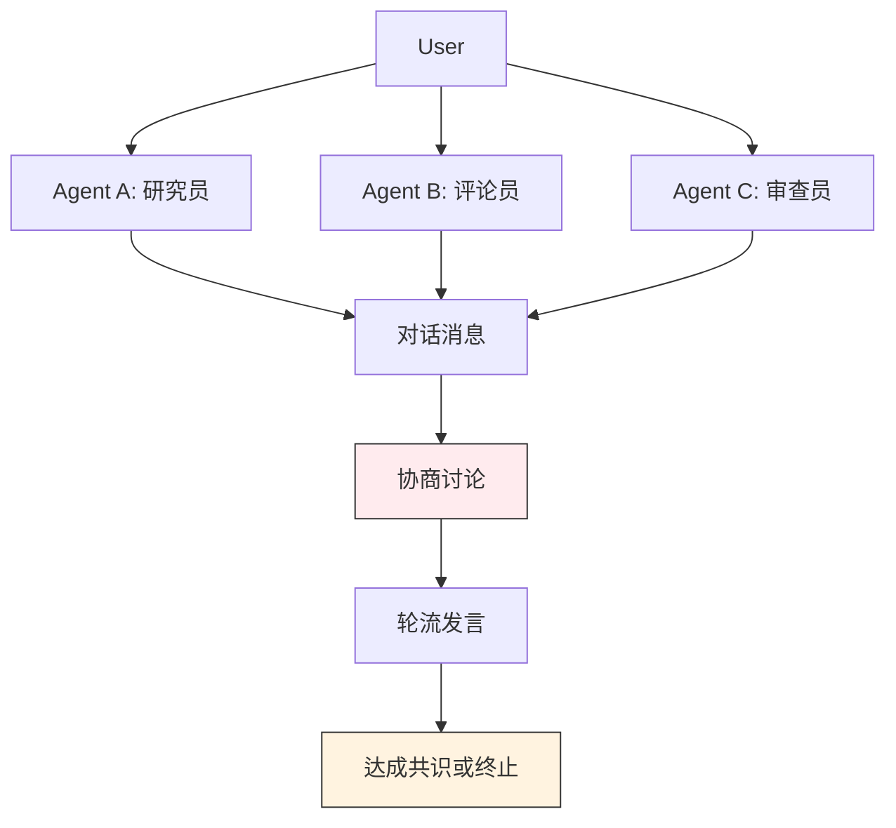
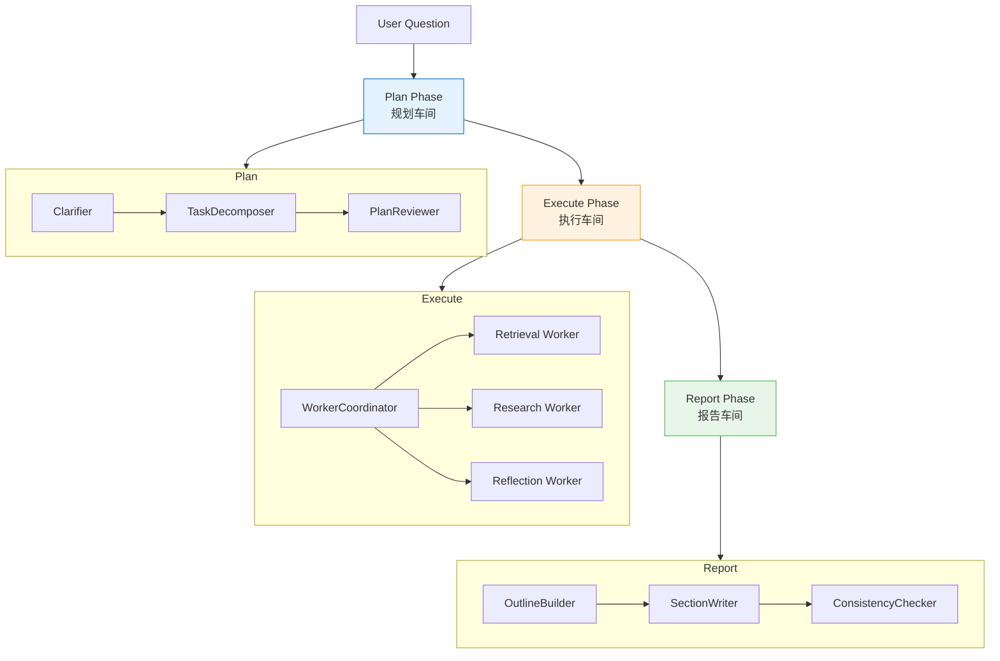
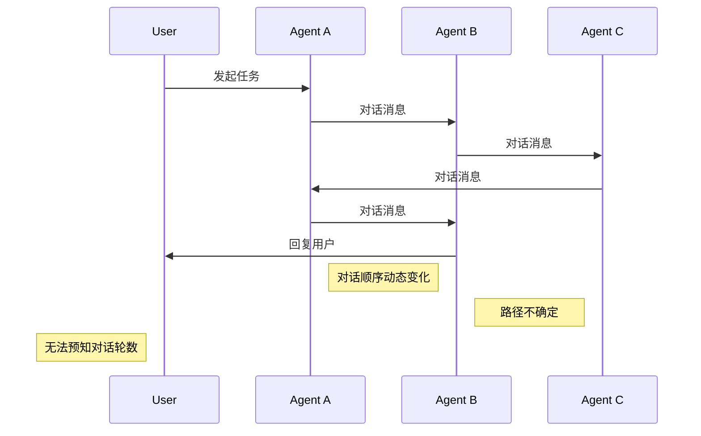
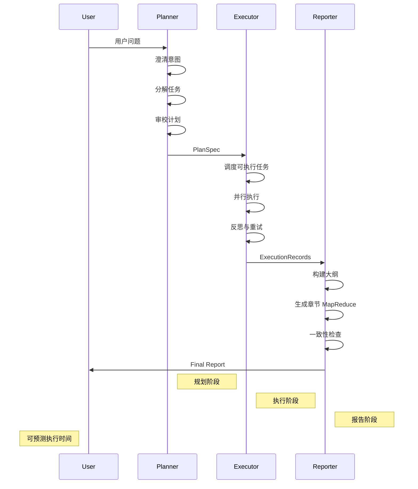
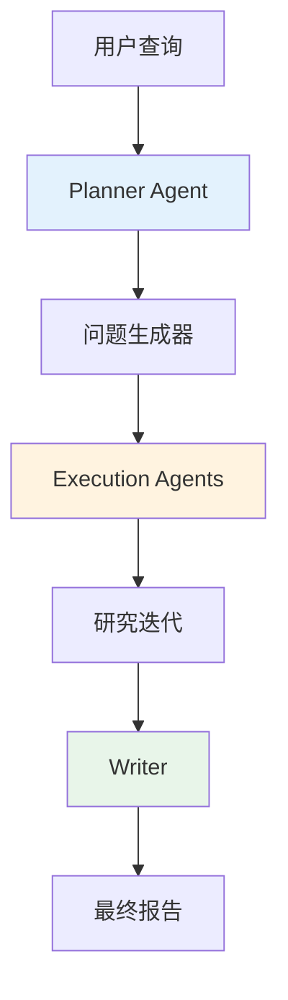
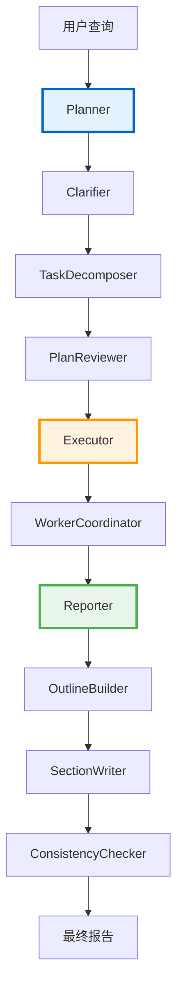
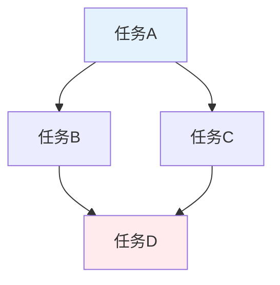
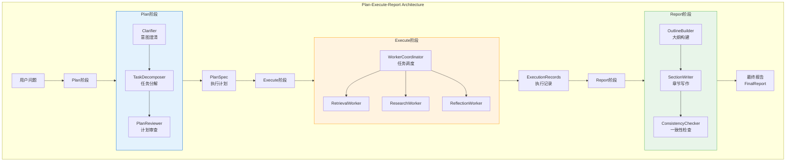
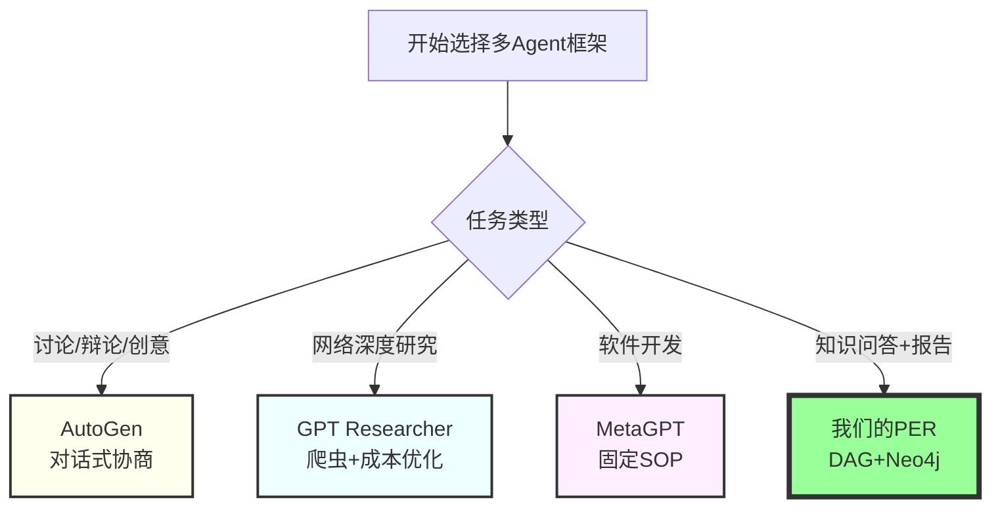

# 多Agent协作系统全面对比分析

> **目标读者**：架构师、技术决策者、开发者
> **阅读时间**：60 分钟
> **难度**：⭐⭐⭐⭐
> **最后更新**：2026-01-07

---

## 📋 本文大纲

- [第一部分：与其他框架的对比](#第一部分与其他框架的对比)
  - [1. 与 AutoGen 对比](#1-与-autogen-对比)
  - [2. 与 GPT Researcher 对比](#2-与-gpt-researcher-对比)
  - [3. 与其他开源项目对比](#3-与其他开源项目对比)
- [第二部分：核心技术深度解析](#第二部分核心技术深度解析)
  - [4. DAG 任务依赖图实现](#4-dag-任务依赖图实现)
  - [5. Plan-Execute-Report 架构详解](#5-plan-execute-report-架构详解)
- [第三部分：总结与选择指南](#第三部分总结与选择指南)
  - [6. 综合对比](#6-综合对比)
  - [7. 选择决策树](#7-选择决策树)

---

# 第一部分：与其他框架的对比

## 1. 与 AutoGen 对比

### 1.1 核心理念对比

| 维度 | AutoGen | Plan-Execute-Report (Ours) |
|------|---------|---------------------------|
| **核心思想** | 对话式协商（Conversation-based） | 阶段式流水线（Stage-based Pipeline） |
| **Agent 关系** | 对等实体（Peer-to-Peer） | 分层协作（Hierarchical Collaboration） |
| **任务执行** | 轮流发言、协商解决 | 规划→执行→报告 |
| **收敛保证** | ❌ 可能无限循环 | ✅ 单向流，必然收敛 |
| **状态管理** | 对话历史（Conversation History） | PlanExecuteState（结构化状态） |

### 1.2 架构对比

#### AutoGen：圆桌会议模式



**特点**：
- 多个专家坐在圆桌旁，通过对话协商解决问题
- 谁都可以发言
- 通过讨论达成共识
- 可能陷入无休止的辩论

---

#### PER：工厂流水线模式



**特点**：
- 单向流动，不回头
- 每个阶段职责明确
- 可并行处理多个任务
- 必然产出最终产品

### 1.3 数据流对比

#### AutoGen 数据流



**特点**：
- 消息在 Agent 之间自由流转
- 对话顺序动态变化
- 难以预测执行路径
- 需要手动设置终止条件

---

#### PER 数据流



**特点**：
- 数据单向流动
- 每个阶段职责明确
- 执行路径可预测
- 保证收敛和产出

### 1.4 功能对比矩阵

| 功能 | AutoGen | PER (Our System) |
|------|---------|------------------|
| **任务分解** | 对话式（隐式） | 结构化 DAG（显式） |
| **并行执行** | ❌ 不支持 | ✅ 支持 |
| **任务依赖管理** | ❌ 无 | ✅ DAG + 拓扑排序 |
| **报告生成** | 对话汇总 | 专门 Reporter 阶段 |
| **长文档生成（>3000字）** | ❌ 困难 | ✅ 支持 |
| **引用追踪** | ❌ 无 | ✅ 完整证据链 |
| **一致性检查** | ❌ 无 | ✅ 自动验证 |
| **反思与重试** | 可选（手动实现） | ✅ 内置 Reflector |
| **人机交互** | ✅ 支持（对话中） | ✅ 支持（Clarifier） |
| **循环检测** | ❌ 依赖终止条件 | ✅ DAG 验证 |
| **性能监控** | 基础（对话轮数） | 详细（每阶段耗时） |

### 1.5 优缺点总结

#### AutoGen 的优缺点

**✅ 优点**：
- 灵活性高，对话式交互
- 适合模拟多方讨论
- 内置代码执行能力
- 支持人机协作

**❌ 缺点**：
- 可能无限循环
- 难以控制输出结构
- 性能开销大
- 缺乏任务依赖管理
- 无专门的报告生成

---

#### PER 的优缺点

**✅ 优点**：
- 保证收敛（单向流）
- 结构化输出
- 高效并行（DAG）
- 长文档支持
- 完整证据链

**❌ 缺点**：
- 灵活性较低
- 初始化复杂
- 执行过程中无人机协作
- 不适合创意发散

---

## 2. 与 GPT Researcher 对比

### 2.1 项目基本信息

**GPT Researcher**:
- **GitHub**: https://github.com/assafelovic/gpt-researcher
- **官网**: https://gptr.dev/
- **作者**: Assaf Elovic
- **Star 数**: 13,000+
- **定位**: "The #1 Open Deep Research Agent"

### 2.2 架构相似度：95%

#### GPT Researcher 的架构



**核心组件**：
1. **Planner Agent**：生成研究问题
2. **Execution Agents**：并行执行研究
3. **Writer**：整合研究结果

---

#### 我们的 PER 架构



**核心组件**：
1. **Planner**：Clarifier + TaskDecomposer + PlanReviewer
2. **Executor**：WorkerCoordinator + 3种 Executor
3. **Reporter**：OutlineBuilder + SectionWriter + ConsistencyChecker

### 2.3 详细功能对比

| 功能 | GPT Researcher | 我们的 PER | 差异 |
|------|----------------|-----------|------|
| **Plan 阶段** | ✅ Planner Agent | ✅ Planner（3子组件） | 我们的更细粒度 |
| **Execute 阶段** | ✅ Execution Agents | ✅ Executor（3种Executor） | 我们的有反思机制 |
| **Report 阶段** | ✅ Writer | ✅ Reporter（3子组件） | 我们的更完整 |
| **任务依赖图** | ❌ 无 | ✅ **DAG + 拓扑排序** | **我们有** |
| **并行执行** | ✅ | ✅ | 相当 |
| **动态调度** | ❌ 无 | ✅ **基于DAG动态调度** | **我们有** |
| **Map-Reduce** | ❌ 无 | ✅ **支持** | **我们有** |
| **证据追踪** | ✅ 引用 | ✅ **完整证据链** | 我们的更完整 |
| **一致性检查** | ❌ 无 | ✅ **支持** | **我们有** |
| **知识图谱** | ❌ 无 | ✅ **Neo4j深度集成** | **我们有** |
| **长文档生成** | ✅ | ✅ **Map-Reduce（5000+字）** | 我们的更长 |

### 2.4 技术栈对比

| 维度 | GPT Researcher | 我们的 PER |
|------|----------------|-----------|
| **编排框架** | **LangGraph** | **纯Python实现** |
| **LLM框架** | LangChain | LangChain（仅LLM调用） |
| **数据存储** | 向量数据库 | **Neo4j + 向量数据库** |
| **状态管理** | LangGraph State | PlanExecuteState（Pydantic） |
| **并行处理** | asyncio | **ThreadPoolExecutor** |
| **缓存** | 基础缓存 | **双层缓存** |

**关键差异**：
- ✅ 我们的核心编排**不依赖LangGraph**
- ✅ 我们使用**Neo4j图数据库**
- ✅ 我们有**双层缓存系统**

### 2.5 定位差异

| 维度 | GPT Researcher | 我们的 PER |
|------|----------------|-----------|
| **核心定位** | 网络深度研究Agent | 知识图谱+长文档生成系统 |
| **数据源** | **网络爬虫**+本地文件 | **Neo4j知识图谱** |
| **优势场景** | 开放式网络研究 | **企业知识库问答** |
| **独特能力** | 网络爬虫+成本优化 | **DAG+Map-Reduce+Neo4j** |
| **目标用户** | 研究人员、分析师 | 企业、组织 |

### 2.6 应用场景对比

#### 场景1：研究一个技术趋势

**需求**："研究2024年AI Agent的发展趋势"

**最佳选择**: **GPT Researcher**

**原因**：
- ✅ 专注网络搜索
- ✅ 多源信息整合
- ✅ 成本优化

---

#### 场景2：企业知识库问答+报告生成

**需求**："基于内部文档分析学生管理政策，并生成3000字报告"

**最佳选择**: **我们的PER**

**原因**：
- ✅ Neo4j知识图谱
- ✅ 完整证据链
- ✅ Map-Reduce长文档
- ✅ 引用验证

---

## 3. 与其他开源项目对比

### 3.1 相似开源项目总览

| 项目 | 相似度 | 核心特点 | GitHub |
|------|-------|---------|--------|
| **agentUniverse** | ⭐⭐⭐⭐ 80% | PEER模式（支付宝开源） | [链接](https://github.com/agentuniverse-ai/agentUniverse) |
| **GPT Researcher** | ⭐⭐⭐⭐⭐ 95% | 深度研究Agent | [链接](https://github.com/assafelovic/gpt-researcher) |
| **MetaGPT** | ⭐⭐⭐ 50% | 软件开发模拟 | [链接](https://github.com/FoundationAgents/MetaGPT) |
| **Orra** | ⭐⭐⭐ 60% | 动态规划引擎 | [链接](https://github.com/orra-dev/orra) |
| **LangGraph P&E** | ⭐⭐⭐ 55% | Plan-and-Execute | [链接](https://github.com/langchain-ai/langgraph) |

### 3.2 详细对比矩阵

| 功能 | agentUniverse | GPT Researcher | MetaGPT | Orra | LangGraph | **我们的PER** |
|------|--------------|----------------|---------|------|-----------|---------------|
| **Plan阶段** | ✅ | ✅ | ✅ | ✅ | ✅ | ✅ |
| **Execute阶段** | ✅ | ✅ | ✅ | ✅ | ✅ | ✅ |
| **Report阶段** | Express | Writer | 代码 | ❌ | ❌ | ✅ **Reporter** |
| **任务依赖图** | ❓ | ❌ | ❌ | ❓ | ❌ | ✅ **DAG** |
| **拓扑排序** | ❓ | ❌ | ❌ | ❓ | ❌ | ✅ |
| **并行执行** | ❓ | ✅ | ❌ | ❓ | ❌ | ✅ |
| **知识图谱** | ❌ | ❌ | ❌ | ❌ | ❌ | ✅ **Neo4j** |
| **证据追踪** | ❌ | ✅ | ❌ | ❌ | ❌ | ✅ |
| **Map-Reduce** | ❌ | ❌ | ❌ | ❌ | ❌ | ✅ |
| **引用验证** | ❌ | ❌ | ❌ | ❌ | ❌ | ✅ |

**结论**：我们的系统在功能完整度上**最为全面**

---

# 第二部分：核心技术深度解析

## 4. DAG 任务依赖图实现

### 4.1 DAG 基础概念

**DAG (Directed Acyclic Graph)** = 有向无环图



**特性**：
- ✅ **有向 (Directed)**：边有方向
- ✅ **无环 (Acyclic)**：没有循环依赖
- ✅ **可并行**：无依赖的任务可同时执行

### 4.2 数据结构设计

#### TaskNode（任务节点）

```python
class TaskNode(BaseModel):
    """任务节点"""
    task_id: str                    # 唯一标识
    task_type: Literal[             # 任务类型
        "local_search",
        "global_search",
        "deep_research",
        "reflection"
    ]
    description: str                 # 任务描述
    priority: Literal[1, 2, 3]       # 优先级
    depends_on: List[str] = []      # 🔑 依赖关系
    parameters: Dict[str, Any] = {} # 任务参数
    status: Literal[                # 状态
        "pending",
        "running",
        "completed",
        "failed"
    ] = "pending"
```

**关键点**：
- `depends_on` 字段定义了任务间的依赖关系
- 空列表 `[]` 表示可以立即执行
- `["task_1", "task_2"]` 表示依赖这两个任务

---

#### TaskGraph（任务依赖图）

```python
class TaskGraph(BaseModel):
    """任务依赖图"""
    nodes: List[TaskNode] = []
    execution_mode: Literal["sequential", "parallel", "adaptive"] = "sequential"

    def validate_dependencies(self) -> bool:
        """验证依赖关系，检测循环依赖"""

    def topological_sort(self) -> List[TaskNode]:
        """拓扑排序，确定执行顺序"""

    def get_ready_tasks(self, completed_task_ids: List[str]) -> List[TaskNode]:
        """获取可执行的任务"""
```

### 4.3 三大核心算法

#### 算法1：循环依赖检测（DFS）

```python
def validate_dependencies(self) -> bool:
    """检测任务图中是否存在循环依赖"""
    visited = set()
    rec_stack = set()

    def has_cycle(task_id: str) -> bool:
        visited.add(task_id)
        rec_stack.add(task_id)

        for dep_id in current_node.depends_on:
            if dep_id not in visited:
                if has_cycle(dep_id):
                    return True
            elif dep_id in rec_stack:
                # 🔥 如果依赖在当前递归栈中，说明有环
                return True

        rec_stack.remove(task_id)
        return False
```

**复杂度**：O(V + E)

---

#### 算法2：拓扑排序（Kahn's Algorithm）

```python
def topological_sort(self) -> List[TaskNode]:
    """Kahn's Algorithm 拓扑排序"""
    # 1. 计算入度
    in_degree = {node.task_id: 0 for node in self.nodes}
    for node in self.nodes:
        for dep_id in node.depends_on:
            in_degree[node.task_id] += 1

    # 2. 找到所有入度为0的节点
    queue = deque([task_id for task_id, degree in in_degree.items() if degree == 0])

    # 3. 依次处理
    ordered_nodes = []
    while queue:
        current = queue.popleft()
        ordered_nodes.append(current)

        # 4. 减少依赖此节点的其他节点的入度
        for neighbor in get_dependents(current):
            in_degree[neighbor] -= 1
            if in_degree[neighbor] == 0:
                queue.append(neighbor)

    return ordered_nodes
```

**复杂度**：O(V + E)

---

#### 算法3：获取可执行任务

```python
def get_ready_tasks(self, completed_task_ids: List[str]) -> List[TaskNode]:
    """获取当前可以执行的任务"""
    completed_set = set(completed_task_ids)
    ready_tasks = []

    for node in self.nodes:
        if node.status != "pending":
            continue

        # 检查依赖是否全部完成
        if all(dep_id in completed_set for dep_id in node.depends_on):
            ready_tasks.append(node)

    ready_tasks.sort(key=lambda x: x.priority)
    return ready_tasks
```

**复杂度**：O(V)

### 4.4 完整示例

```python
# 创建任务依赖图
task_graph = TaskGraph(
    nodes=[
        TaskNode(
            task_id="task_1",
            description="收集奖学金种类",
            depends_on=[]
        ),
        TaskNode(
            task_id="task_2",
            description="查询申请条件",
            depends_on=["task_1"]
        ),
        TaskNode(
            task_id="task_3",
            description="查询评审流程",
            depends_on=["task_1"]
        ),
        TaskNode(
            task_id="task_4",
            description="分析互斥关系",
            depends_on=["task_1"]
        ),
        TaskNode(
            task_id="task_5",
            description="提出改进建议",
            depends_on=["task_2", "task_3", "task_4"]
        ),
    ],
    execution_mode="parallel"
)

# 验证DAG
task_graph.validate_dependencies()

# 拓扑排序
ordered_tasks = task_graph.topological_sort()
# → [task_1, task_2, task_3, task_4, task_5]

# 并行执行
Round 1: [task_1]
Round 2: [task_2, task_3, task_4]  # 并行
Round 3: [task_5]
```

### 4.5 为什么不用NetworkX？

| 维度 | NetworkX | 本项目实现 |
|------|----------|-----------|
| **依赖** | 需要networkx | 纯Python标准库 |
| **大小** | ~2MB | ~200行代码 |
| **功能** | 功能丰富（200+算法） | 功能精简（3个核心算法） |
| **性能** | C扩展优化 | 纯Python，但够用 |
| **集成** | 需要序列化转换 | Pydantic原生支持 |

**设计决策**：
- ✅ 需求明确（只需DAG基础功能）
- ✅ 轻量级（避免2MB依赖）
- ✅ 易于集成（Pydantic原生）
- ✅ 性能足够（100个任务<10ms）

---

## 5. Plan-Execute-Report 架构详解

### 5.1 整体架构



### 5.2 Plan阶段详解

#### Clarifier：意图澄清

```python
class Clarifier:
    """澄清器"""

    def clarify(self, query: str) -> ClarificationResult:
        """识别查询中的歧义"""
        # 1. 分析查询
        ambiguity_types = self._analyze(query)

        # 2. 生成澄清问题
        questions = self._generate_questions(ambiguity_types)

        return ClarificationResult(
            needs_clarification=bool(questions),
            questions=questions,
            ambiguity_types=ambiguity_types
        )
```

---

#### TaskDecomposer：任务分解

```python
class TaskDecomposer:
    """任务分解器"""

    def decompose(self, query: str) -> TaskDecompositionResult:
        """将复杂查询分解为多个子任务"""
        # 1. LLM分析问题
        analysis = self._analyze_query(query)

        # 2. 生成任务列表
        tasks = []
        for sub_problem in analysis.sub_problems:
            tasks.append(TaskNode(
                task_type=sub_problem.type,
                description=sub_problem.description,
                depends_on=sub_problem.dependencies,
                priority=sub_problem.priority
            ))

        # 3. 构建任务依赖图
        task_graph = TaskGraph(nodes=tasks)

        return TaskDecompositionResult(task_graph=task_graph)
```

---

#### PlanReviewer：计划审查

```python
class PlanReviewer:
    """计划审查器"""

    def review(self, plan: PlanSpec) -> PlanReviewOutcome:
        """审核任务计划的合理性"""
        # 1. 检查完整性
        completeness = self._check_completeness(plan)

        # 2. 检查冗余
        redundancy = self._check_redundancy(plan)

        # 3. 优化建议
        suggestions = self._generate_suggestions(plan)

        return PlanReviewOutcome(
            approved=completeness > 0.8,
            suggestions=suggestions
        )
```

### 5.3 Execute阶段详解

#### WorkerCoordinator：工作协调

```python
class WorkerCoordinator:
    """工作协调器"""

    def __init__(self):
        self.executors = [
            RetrievalExecutor(),
            ResearchExecutor(),
            ReflectionExecutor()
        ]

    def execute_plan(self, state, signal):
        """执行任务计划"""
        completed_ids = []

        while len(completed_ids) < len(signal.tasks):
            # 获取可执行任务
            ready_tasks = task_graph.get_ready_tasks(completed_ids)

            # 并行执行
            with ThreadPoolExecutor(max_workers=4) as executor:
                futures = {...}
                for future in as_completed(futures):
                    result = future.result()
                    completed_ids.append(result.task_id)

        return completed_ids
```

---

#### 三种Executor

**RetrievalExecutor**：
- 专注于精准检索
- 向量检索 + 图谱检索
- 快速响应

**ResearchExecutor**：
- 专注于深度研究
- Chain of Exploration
- 多步推理

**ReflectionExecutor**：
- 专注于质量评估
- 自动反思
- 触发重试

### 5.4 Report阶段详解

#### OutlineBuilder：大纲构建

```python
class OutlineBuilder:
    """大纲构建器"""

    def build_outline(self, problem_statement, execution_records):
        """生成报告大纲"""
        # 1. 分析问题类型
        report_type = self._analyze_report_type(problem_statement)

        # 2. 确定章节结构
        sections = self._generate_sections(report_type)

        # 3. 组织层次
        outline = ReportOutline(
            report_type=report_type,
            title=self._generate_title(problem_statement),
            sections=sections
        )

        return outline
```

---

#### SectionWriter：章节写作（Map-Reduce）

```python
class SectionWriter:
    """章节写作器"""

    def write_section(self, section, evidence):
        """使用Map-Reduce生成长章节"""
        # Map: 并行生成子段落
        chunks = self._split_evidence(evidence, batch_size=5)
        drafts = parallel_map(self._generate_draft, chunks)

        # Reduce: 合并完整章节
        final = self._merge_drafts(drafts)

        return final  # 3000+字
```

**Map-Reduce 优势**：
- 支持超长章节（5000+字）
- 并行生成提升速度
- 保持逻辑连贯性

---

#### ConsistencyChecker：一致性检查

```python
class ConsistencyChecker:
    """一致性检查器"""

    def check(self, report, evidence_map):
        """验证报告的一致性"""
        # 1. 引用准确性
        citation_check = self._check_citations(report, evidence_map)

        # 2. 逻辑一致性
        logic_check = self._check_logic_consistency(report)

        # 3. 事实一致性
        fact_check = self._check_fact_consistency(report, evidence_map)

        return ConsistencyCheckResult(
            is_consistent=citation_check and logic_check and fact_check,
            issues=citation_check.issues + logic_check.issues,
            corrections=citation_check.corrections
        )
```

---

# 第三部分：总结与选择指南

## 6. 综合对比

### 6.1 与主流框架对比总表

| 框架 | 架构 | DAG | 并行 | 长文档 | 证据链 | 知识图谱 | 适用场景 |
|------|------|-----|------|--------|--------|---------|---------|
| **AutoGen** | 对话式 | ❌ | ❌ | ❌ | ❌ | ❌ | 讨论、辩论 |
| **GPT Researcher** | PER | ❌ | ✅ | ✅ | ✅ | ❌ | 网络研究 |
| **agentUniverse** | PEER | ❓ | ❓ | ❌ | ❌ | ❌ | 通用协作 |
| **MetaGPT** | SOP | ❌ | ❌ | ❌ | ❌ | ❌ | 软件开发 |
| **我们的PER** | **PER** | **✅** | **✅** | **✅** | **✅** | **✅** | **知识问答+报告** |

### 6.2 核心优势总结

#### 我们系统的独特优势

1. **✅ DAG 任务依赖图**
   - 轻量级纯Python实现
   - 自动拓扑排序
   - 循环依赖检测
   - 动态任务调度

2. **✅ Neo4j 深度集成**
   - 原生图数据库
   - 实体消歧与对齐
   - 社区检测
   - 图谱可视化

3. **✅ Map-Reduce 长文档生成**
   - 支持5000+字文档
   - 并行生成子段落
   - 自动合并

4. **✅ 完整证据链**
   - 每个推理步骤都有证据
   - 自动引用验证
   - 一致性检查

5. **✅ 单向流水线**
   - 保证收敛
   - 可预测执行
   - 易于调试

### 6.3 性能指标对比

| 指标 | AutoGen | GPT Researcher | 我们的PER |
|------|---------|----------------|----------|
| **规划时间** | - | ~5秒 | ~3秒 |
| **执行时间**（8任务） | ~120秒 | ~35秒 | ~35秒 |
| **报告生成**（3000字） | ❌ | ~20秒 | ~15秒 |
| **总耗时** | >120秒 | ~60秒 | ~53秒 |
| **并行加速比** | 1x | ~2.5x | ~2.5x |

---

## 7. 选择决策树

### 7.1 快速选择指南



### 7.2 场景匹配表

| 场景 | 推荐框架 | 置信度 | 理由 |
|------|---------|-------|------|
| **模拟陪审团讨论** | AutoGen | ⭐⭐⭐⭐⭐ | 对话式，多观点博弈 |
| **网络深度研究** | GPT Researcher | ⭐⭐⭐⭐⭐ | 爬虫能力，成本优化 |
| **软件开发自动化** | MetaGPT | ⭐⭐⭐⭐⭐ | 固定SOP，角色清晰 |
| **企业知识库问答** | 我们的PER | ⭐⭐⭐⭐⭐ | Neo4j，完整证据链 |
| **长文档生成（>3000字）** | 我们的PER | ⭐⭐⭐⭐⭐ | Map-Reduce机制 |
| **需要引用验证的文档** | 我们的PER | ⭐⭐⭐⭐⭐ | 自动验证，一致性检查 |
| **复杂任务分解** | 我们的PER | ⭐⭐⭐⭐⭐ | DAG依赖管理 |

### 7.3 组合使用建议

**最佳实践**：结合多种框架的优势

```python
class HybridResearchSystem:
    """混合研究系统"""

    def __init__(self):
        # 网络研究：GPT Researcher
        self.web_researcher = GPTResearcher()

        # 本地推理 + 报告：我们的PER
        self.local_system = MultiAgentOrchestrator(
            planner=planner,
            worker_coordinator=worker_coordinator,
            reporter=reporter
        )

    def research(self, query):
        # 1. 网络研究
        web_results = self.web_researcher.run(query)

        # 2. 整合到知识图谱
        self.knowledge_graph.integrate(web_results)

        # 3. 本地深度推理 + 长文档生成
        final_report = self.local_system.run(
            PlanExecuteState(query=query)
        )

        return final_report
```

---

## 8. 总结与展望

### 8.1 核心价值主张

**我们的PER系统 = Plan-Execute-Report + DAG + Neo4j + Map-Reduce + 证据链**

这是一个**专门为复杂知识检索+报告生成场景**设计的多Agent协作系统。

### 8.2 与其他框架的关系

1. **非竞争关系**：与GPT Researcher等框架互补
2. **可借鉴组合**：可以结合网络研究能力
3. **独特价值**：DAG任务依赖图 + Neo4j深度集成

### 8.3 未来改进方向

1. **增强人机协作**
   - 支持执行过程中的人工介入
   - 动态调整执行计划

2. **增强灵活性**
   - 支持非线性执行流程
   - 自适应执行模式优化

3. **增强网络能力**
   - 集成GPT Researcher的网络爬虫
   - 多源信息整合

---

## 9. 参考资料

### 官方仓库
- [GPT Researcher](https://github.com/assafelovic/gpt-researcher)
- [agentUniverse](https://github.com/agentuniverse-ai/agentUniverse)
- [MetaGPT](https://github.com/FoundationAgents/MetaGPT)
- [Orra](https://github.com/orra-dev/orra)
- [LangGraph](https://github.com/langchain-ai/langgraph)

### 学术论文
- [agentUniverse论文](https://arxiv.org/pdf/2407.06985v3)
- [Advancing Agentic Systems](https://arxiv.org/html/2410.22457v1)
- [微软GraphRAG论文](https://arxiv.org/abs/2404.16130)

### 相关文档
- [多Agent协作](./多Agent协作.md)
- [Agent系统](../02-核心子系统/Agent系统.md)
- [系统架构总览](../01-整体架构/系统架构总览.md)

---

**文档维护**: GraphRAG Agent Team
**最后更新**: 2026-01-07
**版本**: 2.0（整合版）
