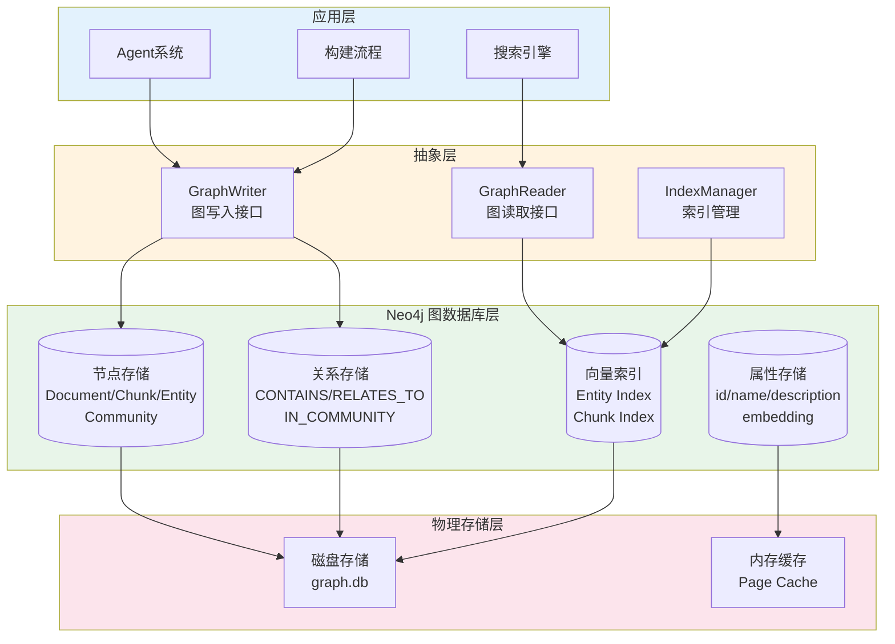
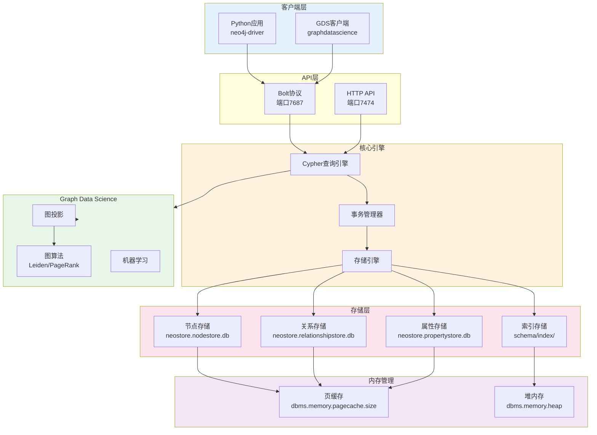
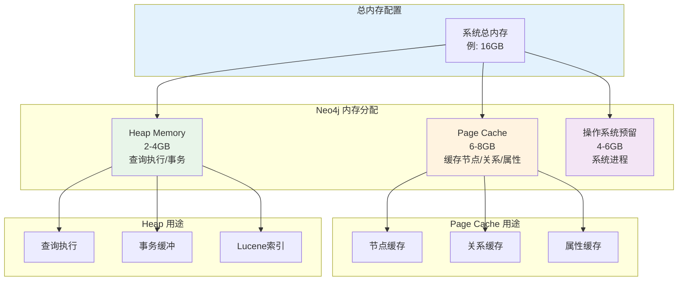
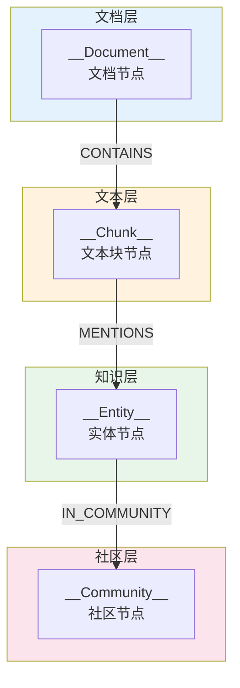
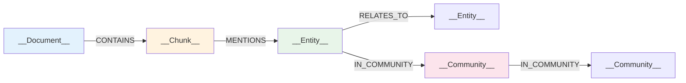
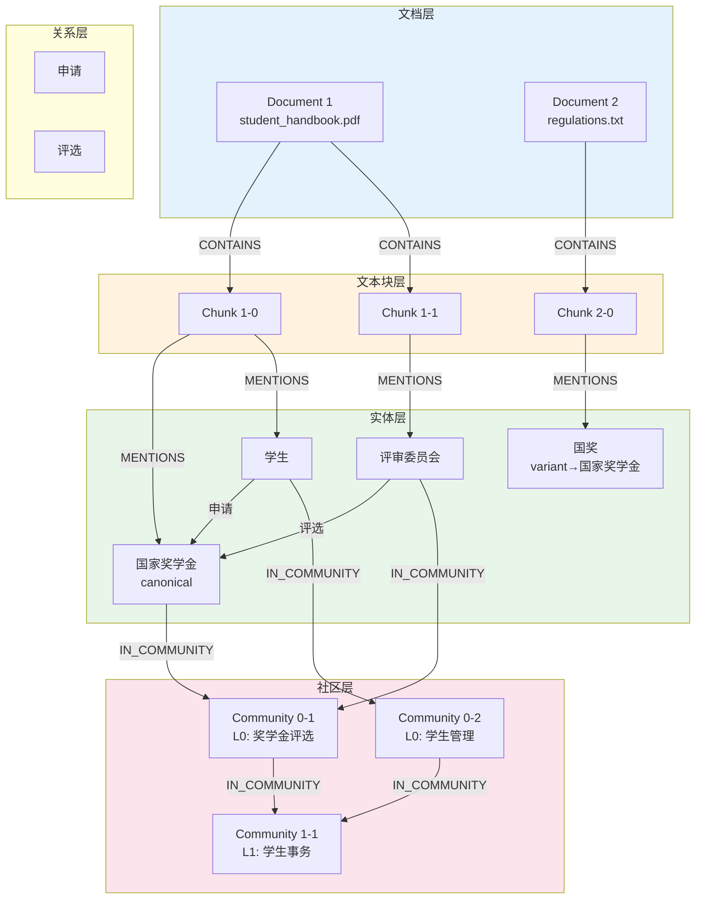

# 存储模型详解

---

## 📋 元信息

- **目标读者**：二次开发者、贡献者、数据库管理员
- **阅读时间**：90分钟
- **难度**：⭐⭐⭐⭐
- **前置知识**：Neo4j 图数据库、Cypher 查询语言、向量数据库、嵌入技术
- **最后更新**：2026-01-04

---

## 📖 本文大纲

- [什么是存储模型](#什么是存储模型)
- [Neo4j 图数据库架构](#neo4j-图数据库架构)
- [节点类型与属性](#节点类型与属性)
- [关系类型与属性](#关系类型与属性)
- [向量索引设计](#向量索引设计)
- [数据模型详解](#数据模型详解)
- [存储优化策略](#存储优化策略)
- [查询性能优化](#查询性能优化)
- [数据一致性保证](#数据一致性保证)
- [备份与恢复](#备份与恢复)
- [监控与诊断](#监控与诊断)
- [实战案例](#实战案例)
- [常见问题](#常见问题)
- [相关文档](#相关文档)

---

## 什么是存储模型

### 定义和作用

存储模型是 GraphRAG-Agent 系统的数据持久化层设计，定义了如何在 Neo4j 图数据库中组织和存储知识图谱数据。

**核心目标**：
1. **高效存储**：合理设计节点和关系结构，最小化存储空间
2. **快速检索**：通过索引优化，支持毫秒级查询响应
3. **数据一致性**：保证图数据的完整性和一致性约束
4. **可扩展性**：支持百万级节点和关系的高效管理

### 存储层架构



### 设计原则

1. **图优先设计**
   - 利用图的天然关联性，避免 JOIN 操作
   - 关系即索引，遍历性能 O(1)
   - 支持多跳查询和路径分析

2. **向量混合存储**
   - 向量嵌入作为节点属性存储
   - 专用向量索引支持相似度搜索
   - 结合图结构和向量检索优势

3. **Schema-Free 灵活性**
   - Neo4j 支持动态属性添加
   - 不同类型节点可有不同属性集
   - 便于迭代开发和功能扩展

4. **索引驱动查询**
   - 所有查询路径都有索引支持
   - 向量索引 + 全文索引 + 属性索引
   - 查询性能与数据规模解耦

---

## Neo4j 图数据库架构

### 整体架构



### 存储文件结构

```bash
neo4j/data/databases/neo4j/
├── neostore                              # 数据库元信息
├── neostore.nodestore.db                 # 节点存储（定长）
├── neostore.nodestore.db.labels          # 节点标签索引
├── neostore.relationshipstore.db         # 关系存储（定长）
├── neostore.relationshiptypestore.db     # 关系类型索引
├── neostore.propertystore.db             # 属性存储（变长）
├── neostore.propertystore.db.strings     # 字符串属性
├── neostore.propertystore.db.arrays      # 数组属性（向量）
├── schema/
│   ├── index/                            # 属性索引
│   │   ├── lucene/                       # 全文索引
│   │   └── vector/                       # 向量索引
│   └── label/                            # 标签索引
└── transactions/                         # 事务日志
    ├── neostore.transaction.db.0
    └── neostore.transaction.db.1
```

### 内存管理



**内存配置建议**：

```properties
# neo4j.conf

# Page Cache: 节点/关系/属性的缓存（建议: 总内存的 40-50%）
dbms.memory.pagecache.size=6g

# Heap Memory: 查询执行和事务管理（建议: 总内存的 20-30%）
dbms.memory.heap.initial_size=2g
dbms.memory.heap.max_size=4g

# Transaction Log: 事务日志保留
dbms.tx_log.rotation.retention_policy=2 days
dbms.tx_log.rotation.size=100M
```

---

## 节点类型与属性

### 节点类型总览

系统定义了 4 种核心节点类型：



### 1. Document 节点（文档）

**用途**：表示原始文档，作为数据溯源的根节点

**标签**：`__Document__`

**属性结构**：

| 属性名 | 类型 | 必需 | 说明 | 示例 |
|--------|------|------|------|------|
| `id` | String | ✅ | 文档唯一标识 | `"doc_001"` |
| `file_name` | String | ✅ | 文件名 | `"student_handbook.pdf"` |
| `file_path` | String | ✅ | 文件路径 | `"files/student_handbook.pdf"` |
| `file_type` | String | ✅ | 文件类型 | `"pdf"` / `"txt"` / `"md"` |
| `content_hash` | String | ✅ | 内容哈希（SHA256） | `"a3f5e9..."` |
| `file_size` | Integer | ✅ | 文件大小（字节） | `1048576` |
| `chunk_count` | Integer | ✅ | 包含的文本块数量 | `42` |
| `created_at` | DateTime | ✅ | 创建时间 | `2026-01-04T10:00:00Z` |
| `updated_at` | DateTime | ❌ | 更新时间 | `2026-01-04T15:30:00Z` |

**Cypher 创建示例**：

```cypher
CREATE (d:__Document__ {
    id: "doc_001",
    file_name: "student_handbook.pdf",
    file_path: "files/student_handbook.pdf",
    file_type: "pdf",
    content_hash: "a3f5e9d2c4b8a1f6e3d9c7b5a2f4e8d1c6b9a3f7e2d5c8b4a1f9e6d3c7b2a5",
    file_size: 1048576,
    chunk_count: 42,
    created_at: datetime()
})
```

**索引**：

```cypher
-- 文档ID唯一索引（主键）
CREATE CONSTRAINT document_id_unique IF NOT EXISTS
FOR (d:__Document__) REQUIRE d.id IS UNIQUE;

-- 文件路径索引（用于快速查找）
CREATE INDEX document_file_path IF NOT EXISTS
FOR (d:__Document__) ON (d.file_path);

-- 内容哈希索引（用于重复检测）
CREATE INDEX document_hash IF NOT EXISTS
FOR (d:__Document__) ON (d.content_hash);
```

### 2. Chunk 节点（文本块）

**用途**：文档的分块单元，承载原始文本和向量嵌入

**标签**：`__Chunk__`

**属性结构**：

| 属性名 | 类型 | 必需 | 说明 | 示例 |
|--------|------|------|------|------|
| `id` | String | ✅ | 块唯一标识 | `"chunk_001_0"` |
| `text` | String | ✅ | 文本内容 | `"学生应遵守校规..."` |
| `chunk_index` | Integer | ✅ | 在文档中的序号 | `0` |
| `token_count` | Integer | ✅ | Token 数量 | `512` |
| `embedding` | List[Float] | ✅ | 向量嵌入（1536维） | `[0.123, -0.456, ...]` |
| `created_at` | DateTime | ✅ | 创建时间 | `2026-01-04T10:00:00Z` |

**Cypher 创建示例**：

```cypher
CREATE (c:__Chunk__ {
    id: "chunk_001_0",
    text: "学生应遵守校规校纪...",
    chunk_index: 0,
    token_count: 512,
    embedding: [0.123, -0.456, ...],  // 1536 维向量
    created_at: datetime()
})
```

**索引**：

```cypher
-- Chunk ID 唯一索引
CREATE CONSTRAINT chunk_id_unique IF NOT EXISTS
FOR (c:__Chunk__) REQUIRE c.id IS UNIQUE;

-- 向量索引（用于相似度搜索）
CALL db.index.vector.createNodeIndex(
    'chunk_index',                    // 索引名称
    '__Chunk__',                      // 节点标签
    'embedding',                      // 嵌入属性
    1536,                             // 向量维度
    'cosine'                          // 相似度度量
);
```

### 3. Entity 节点（实体）

**用途**：知识图谱的核心节点，表示领域内的概念、对象、事件等

**标签**：
- 主标签：`__Entity__`
- 动态标签：根据实体类型自动添加（如 `学生`, `奖学金`, `处分`）

**属性结构**：

| 属性名 | 类型 | 必需 | 说明 | 示例 |
|--------|------|------|------|------|
| `id` | String | ✅ | 实体唯一标识（规范名称） | `"国家奖学金"` |
| `name` | String | ✅ | 实体名称（显示用） | `"国家奖学金"` |
| `type` | String | ✅ | 实体类型 | `"奖学金类型"` |
| `description` | String | ✅ | 实体描述 | `"面向学业成绩优异的学生..."` |
| `embedding` | List[Float] | ✅ | 向量嵌入（1536维） | `[0.789, -0.234, ...]` |
| `canonical_id` | String | ❌ | 规范实体ID（消歧后） | `"国家奖学金"` |
| `mention_count` | Integer | ❌ | 提及次数 | `15` |
| `degree` | Integer | ❌ | 关系度数（缓存） | `8` |
| `created_at` | DateTime | ✅ | 创建时间 | `2026-01-04T10:00:00Z` |

**实体消歧相关属性**：

| 属性名 | 类型 | 说明 |
|--------|------|------|
| `canonical_id` | String | 指向规范实体的ID（如果是变体） |
| `is_canonical` | Boolean | 是否为规范实体 |
| `variants` | List[String] | 已知变体列表（仅规范实体有） |

**Cypher 创建示例**：

```cypher
// 创建规范实体
CREATE (e:__Entity__:奖学金类型 {
    id: "国家奖学金",
    name: "国家奖学金",
    type: "奖学金类型",
    description: "面向学业成绩优异的学生，每年评选一次，奖金8000元",
    embedding: [0.789, -0.234, ...],
    is_canonical: true,
    variants: ["国奖", "National Scholarship"],
    mention_count: 15,
    degree: 8,
    created_at: datetime()
})

// 创建变体实体（指向规范实体）
CREATE (e2:__Entity__:奖学金类型 {
    id: "国奖",
    name: "国奖",
    type: "奖学金类型",
    description: "国家奖学金的简称",
    canonical_id: "国家奖学金",
    is_canonical: false,
    created_at: datetime()
})
```

**索引**：

```cypher
-- 实体ID唯一索引
CREATE CONSTRAINT entity_id_unique IF NOT EXISTS
FOR (e:__Entity__) REQUIRE e.id IS UNIQUE;

-- 实体类型索引
CREATE INDEX entity_type IF NOT EXISTS
FOR (e:__Entity__) ON (e.type);

-- 规范ID索引（用于消歧查询）
CREATE INDEX entity_canonical IF NOT EXISTS
FOR (e:__Entity__) ON (e.canonical_id);

-- 向量索引
CALL db.index.vector.createNodeIndex(
    'entity_index',
    '__Entity__',
    'embedding',
    1536,
    'cosine'
);

-- 全文索引（用于文本搜索）
CALL db.index.fulltext.createNodeIndex(
    'entity_fulltext',
    ['__Entity__'],
    ['name', 'description']
);
```

### 4. Community 节点（社区）

**用途**：表示图中的社区聚类，支持全局搜索

**标签**：`__Community__`

**属性结构**：

| 属性名 | 类型 | 必需 | 说明 | 示例 |
|--------|------|------|------|------|
| `id` | String | ✅ | 社区唯一标识 | `"0-123"` / `"1-45"` |
| `level` | Integer | ✅ | 社区层级（0/1/2/3） | `0` |
| `community_rank` | Float | ✅ | 社区重要性分数 | `0.85` |
| `summary` | String | ✅ | LLM生成的社区摘要 | `"本社区聚焦于奖学金体系..."` |
| `full_content` | String | ❌ | 完整社区信息 | `"实体: [...], 关系: [...]"` |
| `entity_count` | Integer | ✅ | 包含的实体数量 | `15` |
| `summary_created_at` | DateTime | ❌ | 摘要生成时间 | `2026-01-04T12:00:00Z` |
| `created_at` | DateTime | ✅ | 创建时间 | `2026-01-04T10:00:00Z` |

**Cypher 创建示例**：

```cypher
CREATE (c:__Community__ {
    id: "0-123",
    level: 0,
    community_rank: 0.85,
    summary: "本社区聚焦于国家奖学金评选体系。核心实体包括国家奖学金、评审委员会和优秀学生。",
    full_content: "实体: [国家奖学金, 评审委员会, ...], 关系: [评选, 申请, ...]",
    entity_count: 15,
    summary_created_at: datetime(),
    created_at: datetime()
})
```

**索引**：

```cypher
-- 社区ID唯一索引
CREATE CONSTRAINT community_id_unique IF NOT EXISTS
FOR (c:__Community__) REQUIRE c.id IS UNIQUE;

-- 社区层级索引
CREATE INDEX community_level IF NOT EXISTS
FOR (c:__Community__) ON (c.level);

-- 社区排名索引（用于排序）
CREATE INDEX community_rank IF NOT EXISTS
FOR (c:__Community__) ON (c.community_rank);
```

---

## 关系类型与属性

### 关系类型总览



### 1. CONTAINS（包含关系）

**方向**：`Document` → `Chunk`

**用途**：表示文档包含哪些文本块

**属性**：

| 属性名 | 类型 | 必需 | 说明 |
|--------|------|------|------|
| `chunk_index` | Integer | ✅ | 块在文档中的序号 |

**Cypher 示例**：

```cypher
MATCH (d:__Document__ {id: "doc_001"})
MATCH (c:__Chunk__ {id: "chunk_001_0"})
CREATE (d)-[:CONTAINS {chunk_index: 0}]->(c)
```

### 2. MENTIONS（提及关系）

**方向**：`Chunk` → `Entity`

**用途**：表示文本块提及了哪些实体

**属性**：

| 属性名 | 类型 | 必需 | 说明 |
|--------|------|------|------|
| `mention_count` | Integer | ❌ | 提及次数（可选） |

**Cypher 示例**：

```cypher
MATCH (c:__Chunk__ {id: "chunk_001_0"})
MATCH (e:__Entity__ {id: "国家奖学金"})
CREATE (c)-[:MENTIONS {mention_count: 1}]->(e)
```

### 3. RELATES_TO（实体关系）

**方向**：`Entity` → `Entity`

**用途**：表示实体之间的语义关系

**动态关系类型**：
- 系统会根据领域定义动态创建关系类型
- 例如：`申请`, `评选`, `违纪`, `管理` 等

**属性**：

| 属性名 | 类型 | 必需 | 说明 |
|--------|------|------|------|
| `description` | String | ✅ | 关系描述 |
| `weight` | Float | ❌ | 关系权重（1.0） |
| `source_chunk` | String | ❌ | 来源chunk ID |

**Cypher 示例**：

```cypher
MATCH (e1:__Entity__ {id: "学生"})
MATCH (e2:__Entity__ {id: "国家奖学金"})
CREATE (e1)-[:申请 {
    description: "学生可以申请国家奖学金",
    weight: 1.0,
    source_chunk: "chunk_001_0"
}]->(e2)
```

### 4. IN_COMMUNITY（社区归属）

**方向**：`Entity` → `Community` 或 `Community` → `Community`

**用途**：
- Entity → Community: 实体属于某个社区
- Community → Community: 社区层级关系（Level 0 → Level 1 → Level 2）

**属性**：无额外属性

**Cypher 示例**：

```cypher
-- 实体归属社区
MATCH (e:__Entity__ {id: "国家奖学金"})
MATCH (c:__Community__ {id: "0-123"})
CREATE (e)-[:IN_COMMUNITY]->(c)

-- 社区层级关系
MATCH (c0:__Community__ {id: "0-123", level: 0})
MATCH (c1:__Community__ {id: "1-45", level: 1})
CREATE (c0)-[:IN_COMMUNITY]->(c1)
```

---

## 向量索引设计

### 向量索引架构

```mermaid
graph TB
    subgraph 应用层[应用层查询]
        Query[用户查询<br/>"国家奖学金的申请条件"]
        Embed[嵌入模型<br/>text-embedding-3-large]
        QueryVec[查询向量<br/>1536维]
    end

    subgraph 索引层[Neo4j 向量索引]
        EntityIdx[Entity Index<br/>entity_index]
        ChunkIdx[Chunk Index<br/>chunk_index]
    end

    subgraph 存储层[向量存储]
        EntityVec[Entity Embeddings<br/>存储在embedding属性]
        ChunkVec[Chunk Embeddings<br/>存储在embedding属性]
    end

    subgraph 结果层[检索结果]
        EntityRes[相似实体<br/>Top-K]
        ChunkRes[相似文本块<br/>Top-K]
    end

    Query --> Embed
    Embed --> QueryVec

    QueryVec --> EntityIdx
    QueryVec --> ChunkIdx

    EntityIdx --> EntityVec
    ChunkIdx --> ChunkVec

    EntityVec --> EntityRes
    ChunkVec --> ChunkRes

    style 应用层 fill:#e3f2fd
    style 索引层 fill:#fff3e0
    style 存储层 fill:#e8f5e9
    style 结果层 fill:#fce4ec
```

### 1. Entity 向量索引

**索引配置**：

```cypher
// 创建 Entity 向量索引
CALL db.index.vector.createNodeIndex(
    'entity_index',                   // 索引名称
    '__Entity__',                     // 节点标签
    'embedding',                      // 嵌入属性名
    1536,                             // 向量维度（text-embedding-3-large）
    'cosine'                          // 相似度度量（cosine/euclidean/dot）
)
```

**查询示例**：

```cypher
// 向量相似度搜索
CALL db.index.vector.queryNodes(
    'entity_index',                   // 索引名称
    10,                               // Top-K
    [0.123, -0.456, ...]              // 查询向量（1536维）
)
YIELD node, score
RETURN node.id, node.name, node.description, score
ORDER BY score DESC
```

**性能特征**：

| 指标 | 数值 | 说明 |
|------|------|------|
| 索引大小 | ~9KB/实体 | 1536维 × 4字节 + 元数据 |
| 检索延迟 | 10-50ms | Top-10，10K实体 |
| 召回率 | >95% | 使用HNSW算法 |

### 2. Chunk 向量索引

**索引配置**：

```cypher
// 创建 Chunk 向量索引
CALL db.index.vector.createNodeIndex(
    'chunk_index',
    '__Chunk__',
    'embedding',
    1536,
    'cosine'
)
```

**查询示例**：

```cypher
// Chunk 相似度搜索
CALL db.index.vector.queryNodes(
    'chunk_index',
    5,
    [0.789, -0.234, ...]
)
YIELD node, score
RETURN node.id, node.text, score
ORDER BY score DESC
```

### 向量索引优化

**1. HNSW 参数调优**

Neo4j 的向量索引基于 HNSW（Hierarchical Navigable Small World）算法：

```properties
# neo4j.conf

# HNSW 索引配置
db.index.vector.hnsw.ef_construction=200    # 构建时的搜索宽度（默认200，越大越精确）
db.index.vector.hnsw.m=16                   # 每层最大连接数（默认16）
```

**参数影响**：

| 参数 | 值越大 | 索引构建 | 查询性能 | 召回率 |
|------|--------|----------|----------|--------|
| ef_construction | ↑ | 越慢 | 无影响 | 越高 |
| m | ↑ | 越慢 | 越快 | 越高 |

**2. 批量索引构建**

```python
# 批量创建向量索引
from graphrag_agent.graph.indexing import EntityIndexBuilder

builder = EntityIndexBuilder()
builder.build_index(
    batch_size=100,           # 批大小
    max_workers=4             # 并行度
)
```

**3. 索引监控**

```cypher
// 查看索引状态
SHOW INDEXES
YIELD name, type, state, populationPercent, entityType
WHERE type = 'VECTOR'
RETURN *;

// 查看索引大小
CALL db.index.vector.queryNodes('entity_index', 1, [0.0, 0.0, ...])
YIELD node
RETURN count(*) as total_indexed;
```

---

## 数据模型详解

### 完整数据模型图



### 数据模型示例

**场景**：学生手册中关于国家奖学金的内容

**1. Document 节点**

```cypher
(:__Document__ {
    id: "doc_handbook",
    file_name: "student_handbook.pdf",
    file_path: "files/student_handbook.pdf",
    file_type: "pdf",
    content_hash: "a3f5e9...",
    file_size: 2048576,
    chunk_count: 85,
    created_at: datetime("2026-01-04T10:00:00Z")
})
```

**2. Chunk 节点**

```cypher
(:__Chunk__ {
    id: "chunk_handbook_15",
    text: "国家奖学金是奖励学业成绩优异学生的最高荣誉。每年评选一次，奖金8000元。学生需成绩排名前3%才可申请。",
    chunk_index: 15,
    token_count: 512,
    embedding: [0.023, -0.145, 0.289, ...],  // 1536维
    created_at: datetime("2026-01-04T10:05:00Z")
})
```

**3. Entity 节点**

```cypher
// 规范实体
(:__Entity__:奖学金类型 {
    id: "国家奖学金",
    name: "国家奖学金",
    type: "奖学金类型",
    description: "奖励学业成绩优异学生的最高荣誉，每年评选一次，奖金8000元",
    embedding: [0.156, -0.289, 0.445, ...],
    is_canonical: true,
    variants: ["国奖", "National Scholarship"],
    mention_count: 23,
    degree: 12,
    created_at: datetime("2026-01-04T10:10:00Z")
})

// 变体实体
(:__Entity__:奖学金类型 {
    id: "国奖",
    name: "国奖",
    type: "奖学金类型",
    canonical_id: "国家奖学金",
    is_canonical: false,
    created_at: datetime("2026-01-04T10:15:00Z")
})

// 其他实体
(:__Entity__:学生类型 {
    id: "优秀学生",
    name: "优秀学生",
    type: "学生类型",
    description: "学业成绩优异的学生",
    embedding: [0.234, -0.112, 0.567, ...],
    is_canonical: true,
    mention_count: 18,
    degree: 15,
    created_at: datetime("2026-01-04T10:12:00Z")
})
```

**4. 关系**

```cypher
// 文档包含chunk
(:__Document__ {id: "doc_handbook"})-[:CONTAINS {chunk_index: 15}]->(:__Chunk__ {id: "chunk_handbook_15"})

// Chunk提及实体
(:__Chunk__ {id: "chunk_handbook_15"})-[:MENTIONS]->(:__Entity__ {id: "国家奖学金"})
(:__Chunk__ {id: "chunk_handbook_15"})-[:MENTIONS]->(:__Entity__ {id: "优秀学生"})

// 实体之间的关系
(:__Entity__ {id: "优秀学生"})-[:申请 {
    description: "优秀学生可以申请国家奖学金",
    weight: 1.0,
    source_chunk: "chunk_handbook_15"
}]->(:__Entity__ {id: "国家奖学金"})
```

**5. Community 节点**

```cypher
(:__Community__ {
    id: "0-25",
    level: 0,
    community_rank: 0.89,
    summary: "本社区聚焦于国家奖学金评选体系。核心实体包括国家奖学金、优秀学生、评审委员会。",
    entity_count: 8,
    created_at: datetime("2026-01-04T11:00:00Z")
})

// 实体归属社区
(:__Entity__ {id: "国家奖学金"})-[:IN_COMMUNITY]->(:__Community__ {id: "0-25"})
```

---

## 存储优化策略

### 1. 属性压缩

**向量压缩**：

虽然 Neo4j 不直接支持向量量化，但可以通过以下方式优化：

```python
# 使用较低维度的嵌入模型（权衡：准确率 vs 存储）
# text-embedding-3-large: 1536维（默认）
# text-embedding-3-small: 512维（节省 67% 存储）

from graphrag_agent.config import settings

# 配置使用小模型
settings.OPENAI_EMBEDDINGS_MODEL = "text-embedding-3-small"
settings.EMBEDDING_DIM = 512
```

**字符串去重**：

```cypher
// Neo4j 自动对相同字符串去重（String Interning）
// 多个节点引用相同描述时，实际只存储一份
```

### 2. 批量操作

**批量写入**：

```python
# 使用 UNWIND 批量创建节点
batch_size = 100
entities_batch = entities[i:i+batch_size]

query = """
UNWIND $batch AS row
MERGE (e:__Entity__ {id: row.id})
SET e.name = row.name,
    e.type = row.type,
    e.description = row.description,
    e.embedding = row.embedding
"""

graph.query(query, params={"batch": entities_batch})
```

**批量删除**：

```cypher
// 分批删除（避免大事务）
CALL apoc.periodic.iterate(
    "MATCH (c:__Chunk__) WHERE c.id STARTS WITH 'old_' RETURN c",
    "DETACH DELETE c",
    {batchSize: 1000, parallel: false}
)
```

### 3. 索引策略

**按需创建索引**：

```cypher
// 仅为高频查询字段创建索引
// ✅ 推荐：查询频繁的字段
CREATE INDEX entity_type IF NOT EXISTS FOR (e:__Entity__) ON (e.type);

// ❌ 避免：低频查询字段
// CREATE INDEX entity_mention_count IF NOT EXISTS FOR (e:__Entity__) ON (e.mention_count);
```

**复合索引**（Neo4j 5.x+）：

```cypher
// 多字段组合索引
CREATE INDEX entity_type_canonical IF NOT EXISTS
FOR (e:__Entity__) ON (e.type, e.is_canonical);
```

### 4. 关系优化

**避免创建冗余关系**：

```cypher
// ✅ 推荐：使用 MERGE 避免重复
MATCH (e1:__Entity__ {id: "学生"})
MATCH (e2:__Entity__ {id: "国家奖学金"})
MERGE (e1)-[r:申请]->(e2)
ON CREATE SET r.description = "学生可以申请国家奖学金"

// ❌ 避免：直接 CREATE 可能创建重复关系
// CREATE (e1)-[:申请]->(e2)
```

**关系方向优化**：

```cypher
// 统一关系方向，避免双向存储
// ✅ 推荐：单向关系 + 查询时反向
(:学生)-[:申请]->(:国家奖学金)

// 查询反向关系
MATCH (:国家奖学金)<-[:申请]-(s:学生)
RETURN s

// ❌ 避免：存储双向关系
// (:学生)-[:申请]->(:国家奖学金)
// (:国家奖学金)-[:被申请]->(:学生)
```

---

## 查询性能优化

### 1. 查询计划分析

**使用 EXPLAIN 和 PROFILE**：

```cypher
// EXPLAIN: 查看执行计划（不实际执行）
EXPLAIN
MATCH (e:__Entity__ {type: "奖学金类型"})
RETURN e.id, e.name
LIMIT 10;

// PROFILE: 查看执行计划 + 实际性能数据
PROFILE
MATCH (e:__Entity__ {type: "奖学金类型"})-[:申请]-(s:__Entity__)
RETURN e.id, count(s) as applicants
ORDER BY applicants DESC
LIMIT 10;
```

**关键指标**：

| 指标 | 说明 | 优化目标 |
|------|------|----------|
| db hits | 数据库访问次数 | 越少越好 |
| rows | 返回行数 | - |
| estimated rows | 估计行数 | 越准越好 |
| Index Seek | 索引查找 | 优先使用 |
| Node By Label Scan | 标签扫描 | 可接受 |
| All Nodes Scan | 全表扫描 | ❌ 避免 |

### 2. 索引提示

**强制使用索引**：

```cypher
// 使用 USING INDEX 提示
MATCH (e:__Entity__)
USING INDEX e:__Entity__(type)
WHERE e.type = "奖学金类型"
RETURN e
```

**向量索引查询优化**：

```cypher
// ✅ 推荐：限制 Top-K
CALL db.index.vector.queryNodes('entity_index', 10, $queryVector)
YIELD node, score
WHERE score > 0.8  // 设置相似度阈值
RETURN node
LIMIT 10

// ❌ 避免：不限制结果数
// CALL db.index.vector.queryNodes('entity_index', 10000, $queryVector)
```

### 3. 查询优化模式

**模式1：避免笛卡尔积**

```cypher
// ❌ 避免：笛卡尔积
MATCH (e1:__Entity__)
MATCH (e2:__Entity__)
WHERE e1.type = e2.type
RETURN e1, e2

// ✅ 推荐：使用关系或 WITH 分隔
MATCH (e1:__Entity__)
WITH e1
MATCH (e2:__Entity__ {type: e1.type})
WHERE id(e1) < id(e2)
RETURN e1, e2
```

**模式2：提前过滤**

```cypher
// ❌ 避免：后过滤
MATCH (e:__Entity__)-[r]-(e2:__Entity__)
WHERE e.type = "奖学金类型"
RETURN e, r, e2

// ✅ 推荐：先过滤再遍历
MATCH (e:__Entity__ {type: "奖学金类型"})-[r]-(e2:__Entity__)
RETURN e, r, e2
```

**模式3：使用子查询**

```cypher
// 复杂查询使用 CALL 子查询
MATCH (c:__Community__ {level: 0})
CALL {
    WITH c
    MATCH (c)<-[:IN_COMMUNITY]-(e:__Entity__)
    RETURN count(e) as entity_count
}
WHERE entity_count > 5
RETURN c.id, entity_count
ORDER BY entity_count DESC
```

### 4. 缓存策略

**查询结果缓存**（应用层）：

```python
from functools import lru_cache

@lru_cache(maxsize=1000)
def get_entity_by_id(entity_id: str):
    """带缓存的实体查询"""
    result = graph.query("""
        MATCH (e:__Entity__ {id: $id})
        RETURN e
    """, params={"id": entity_id})
    return result[0] if result else None
```

**Neo4j Page Cache**：

```properties
# neo4j.conf
# 增加 Page Cache 大小，缓存更多节点/关系
dbms.memory.pagecache.size=8g
```

---

## 数据一致性保证

### 1. 约束定义

**唯一性约束**：

```cypher
-- 文档ID唯一
CREATE CONSTRAINT document_id_unique IF NOT EXISTS
FOR (d:__Document__) REQUIRE d.id IS UNIQUE;

-- Chunk ID唯一
CREATE CONSTRAINT chunk_id_unique IF NOT EXISTS
FOR (c:__Chunk__) REQUIRE c.id IS UNIQUE;

-- Entity ID唯一
CREATE CONSTRAINT entity_id_unique IF NOT EXISTS
FOR (e:__Entity__) REQUIRE e.id IS UNIQUE;

-- Community ID唯一
CREATE CONSTRAINT community_id_unique IF NOT EXISTS
FOR (c:__Community__) REQUIRE c.id IS UNIQUE;
```

**存在性约束**（Neo4j Enterprise）：

```cypher
-- 实体必须有 name 属性
CREATE CONSTRAINT entity_name_exists IF NOT EXISTS
FOR (e:__Entity__) REQUIRE e.name IS NOT NULL;

-- 实体必须有 type 属性
CREATE CONSTRAINT entity_type_exists IF NOT EXISTS
FOR (e:__Entity__) REQUIRE e.type IS NOT NULL;
```

### 2. 事务管理

**批量操作的事务控制**：

```python
from neo4j import GraphDatabase

class GraphTransactionManager:
    def __init__(self, uri, auth):
        self.driver = GraphDatabase.driver(uri, auth=auth)

    def batch_create_entities(self, entities, batch_size=100):
        """批量创建实体，使用事务"""
        with self.driver.session() as session:
            for i in range(0, len(entities), batch_size):
                batch = entities[i:i+batch_size]

                # 使用事务函数
                session.execute_write(self._create_entities_tx, batch)

    @staticmethod
    def _create_entities_tx(tx, entities):
        """事务函数：创建实体"""
        query = """
        UNWIND $batch AS row
        MERGE (e:__Entity__ {id: row.id})
        SET e.name = row.name,
            e.type = row.type,
            e.description = row.description
        """
        tx.run(query, batch=entities)
```

**事务隔离级别**：

Neo4j 使用 **READ COMMITTED** 隔离级别：
- 读操作只能看到已提交的数据
- 写操作会锁定相关节点和关系
- 避免脏读，但可能出现不可重复读

### 3. 数据完整性检查

**定期检查脚本**：

```cypher
// 1. 检查孤立 Chunk（没有连接到 Document）
MATCH (c:__Chunk__)
WHERE NOT (c)<-[:CONTAINS]-(:__Document__)
RETURN count(c) as orphan_chunks;

// 2. 检查孤立 Entity（没有关系）
MATCH (e:__Entity__)
WHERE NOT (e)-[]-()
RETURN count(e) as orphan_entities;

// 3. 检查向量嵌入缺失
MATCH (e:__Entity__)
WHERE e.embedding IS NULL
RETURN count(e) as entities_without_embedding;

// 4. 检查社区归属
MATCH (e:__Entity__)
WHERE NOT (e)-[:IN_COMMUNITY]->(:__Community__)
RETURN count(e) as entities_without_community;
```

**自动修复工具**：

```python
# backend/graphrag_agent/graph/graph_consistency_validator.py

class GraphConsistencyValidator:
    def validate_and_fix(self):
        """验证并修复图一致性"""
        issues = []

        # 1. 修复孤立 chunks
        orphan_chunks = self.find_orphan_chunks()
        if orphan_chunks:
            issues.append(f"发现 {len(orphan_chunks)} 个孤立 chunks")
            self.delete_orphan_chunks(orphan_chunks)

        # 2. 补全缺失的嵌入
        entities_without_embedding = self.find_entities_without_embedding()
        if entities_without_embedding:
            issues.append(f"发现 {len(entities_without_embedding)} 个实体缺失嵌入")
            self.regenerate_embeddings(entities_without_embedding)

        return issues
```

---

## 备份与恢复

### 1. Neo4j 备份策略

**在线备份**（Neo4j Enterprise）：

```bash
# 全量备份
neo4j-admin database backup --database=neo4j --to-path=/backups/full-backup

# 增量备份
neo4j-admin database backup --database=neo4j --to-path=/backups/incremental-backup --incremental
```

**导出为 Cypher**（Community）：

```bash
# 使用 apoc 导出
cypher-shell "
CALL apoc.export.cypher.all('/backups/graph-export.cypher', {
    format: 'cypher-shell',
    useOptimizations: {type: 'UNWIND_BATCH', unwindBatchSize: 20}
})
"
```

**导出为 JSON**：

```cypher
// 导出所有实体
CALL apoc.export.json.query(
    "MATCH (e:__Entity__) RETURN e",
    "/backups/entities.json",
    {}
)

// 导出所有关系
CALL apoc.export.json.query(
    "MATCH (e1:__Entity__)-[r]->(e2:__Entity__) RETURN e1, r, e2",
    "/backups/relationships.json",
    {}
)
```

### 2. 定时备份脚本

```bash
#!/bin/bash
# backup-neo4j.sh

BACKUP_DIR="/backups/neo4j"
DATE=$(date +%Y%m%d_%H%M%S)
BACKUP_NAME="neo4j_backup_${DATE}"

# 创建备份目录
mkdir -p ${BACKUP_DIR}/${BACKUP_NAME}

# 停止 Neo4j
docker-compose stop neo4j

# 复制数据文件
cp -r /var/lib/neo4j/data ${BACKUP_DIR}/${BACKUP_NAME}/

# 启动 Neo4j
docker-compose start neo4j

# 压缩备份
tar -czf ${BACKUP_DIR}/${BACKUP_NAME}.tar.gz ${BACKUP_DIR}/${BACKUP_NAME}

# 删除临时目录
rm -rf ${BACKUP_DIR}/${BACKUP_NAME}

# 保留最近7天的备份
find ${BACKUP_DIR} -name "*.tar.gz" -mtime +7 -delete

echo "备份完成: ${BACKUP_NAME}.tar.gz"
```

**定时任务**：

```bash
# crontab -e
# 每天凌晨2点备份
0 2 * * * /path/to/backup-neo4j.sh >> /var/log/neo4j-backup.log 2>&1
```

### 3. 数据恢复

**从备份恢复**：

```bash
#!/bin/bash
# restore-neo4j.sh

BACKUP_FILE="/backups/neo4j/neo4j_backup_20260104_020000.tar.gz"

# 停止 Neo4j
docker-compose stop neo4j

# 清空现有数据
rm -rf /var/lib/neo4j/data/*

# 解压备份
tar -xzf ${BACKUP_FILE} -C /tmp/

# 恢复数据
cp -r /tmp/neo4j_backup_*/data/* /var/lib/neo4j/data/

# 启动 Neo4j
docker-compose start neo4j

echo "恢复完成"
```

**从 Cypher 导入**：

```bash
# 清空数据库
cypher-shell "MATCH (n) DETACH DELETE n"

# 导入备份
cypher-shell < /backups/graph-export.cypher
```

---

## 监控与诊断

### 1. Neo4j 监控指标

**关键性能指标**：

| 指标 | 查询方法 | 健康阈值 |
|------|----------|----------|
| 节点总数 | `MATCH (n) RETURN count(n)` | - |
| 关系总数 | `MATCH ()-[r]->() RETURN count(r)` | - |
| 存储大小 | `CALL dbms.queryJmx("org.neo4j:name=Store file sizes")` | <80% 磁盘 |
| Page Cache 命中率 | `CALL dbms.queryJmx("org.neo4j:name=Page cache")` | >90% |
| 事务吞吐量 | Metrics API | - |
| 查询延迟 | `CALL dbms.listQueries()` | <100ms |

**实时监控查询**：

```cypher
// 查看当前运行的查询
CALL dbms.listQueries()
YIELD queryId, query, elapsedTimeMillis, status
WHERE elapsedTimeMillis > 1000  // 超过1秒的查询
RETURN queryId, query, elapsedTimeMillis
ORDER BY elapsedTimeMillis DESC;

// 终止慢查询
CALL dbms.killQuery($queryId)
```

**存储统计**：

```cypher
// 节点标签统计
CALL db.labels() YIELD label
CALL apoc.cypher.run('MATCH (:`'+label+'`) RETURN count(*) as count', {})
YIELD value
RETURN label, value.count as count
ORDER BY count DESC;

// 关系类型统计
CALL db.relationshipTypes() YIELD relationshipType
CALL apoc.cypher.run('MATCH ()-[:`'+relationshipType+'`]->() RETURN count(*) as count', {})
YIELD value
RETURN relationshipType, value.count as count
ORDER BY count DESC;
```

### 2. 性能诊断工具

**慢查询日志**：

```properties
# neo4j.conf
# 记录超过 1 秒的查询
dbms.logs.query.enabled=true
dbms.logs.query.threshold=1s
dbms.logs.query.parameter_logging_enabled=true
```

**分析慢查询日志**：

```bash
# 查看慢查询日志
tail -f /var/lib/neo4j/logs/query.log

# 分析最慢的查询
cat /var/lib/neo4j/logs/query.log | grep -oP '(?<=runtime=)[0-9]+' | sort -n | tail -10
```

**向量索引诊断**：

```cypher
// 检查向量索引状态
SHOW INDEXES
YIELD name, type, state, populationPercent
WHERE type = 'VECTOR'
RETURN *;

// 测试向量查询性能
CALL db.index.vector.queryNodes('entity_index', 10, $testVector)
YIELD node, score
RETURN count(*);
```

### 3. 监控仪表板

**Prometheus + Grafana 集成**：

```yaml
# docker-compose.yml
services:
  neo4j:
    image: neo4j:5.14.0
    environment:
      - NEO4J_metrics_prometheus_enabled=true
      - NEO4J_metrics_prometheus_endpoint=0.0.0.0:2004
    ports:
      - "2004:2004"  # Prometheus metrics

  prometheus:
    image: prom/prometheus
    volumes:
      - ./prometheus.yml:/etc/prometheus/prometheus.yml
    ports:
      - "9090:9090"

  grafana:
    image: grafana/grafana
    ports:
      - "3000:3000"
```

**Prometheus 配置**：

```yaml
# prometheus.yml
scrape_configs:
  - job_name: 'neo4j'
    static_configs:
      - targets: ['neo4j:2004']
```

---

## 实战案例

### 案例1：高效的多跳查询

**需求**：查找与"国家奖学金"相关的所有实体（2跳内）

```cypher
// ❌ 低效方案：多次查询
MATCH (e:__Entity__ {id: "国家奖学金"})
RETURN e;

MATCH (e:__Entity__ {id: "国家奖学金"})-[r1]-(e1)
RETURN e, r1, e1;

MATCH (e:__Entity__ {id: "国家奖学金"})-[r1]-(e1)-[r2]-(e2)
RETURN e, r1, e1, r2, e2;

// ✅ 高效方案：单次查询
MATCH path = (e:__Entity__ {id: "国家奖学金"})-[*1..2]-(related)
RETURN
    e.id as center_entity,
    [n in nodes(path) | n.id] as path_entities,
    length(path) as hops
ORDER BY hops, related.degree DESC
LIMIT 100;
```

### 案例2：向量检索 + 图遍历混合

**需求**：找到与查询最相似的实体，并返回其邻居

```cypher
// 第一步：向量相似度召回
CALL db.index.vector.queryNodes('entity_index', 5, $queryVector)
YIELD node as center, score
WHERE score > 0.8

// 第二步：图遍历获取邻居
CALL {
    WITH center
    MATCH (center)-[r]-(neighbor:__Entity__)
    RETURN neighbor, r, type(r) as rel_type
    ORDER BY neighbor.degree DESC
    LIMIT 10
}

// 第三步：聚合结果
RETURN
    center.id as entity,
    score,
    collect({
        neighbor: neighbor.id,
        relationship: rel_type,
        description: r.description
    }) as related_entities
ORDER BY score DESC;
```

### 案例3：社区级聚合查询

**需求**：统计每个 Level 1 社区包含的实体数量和类型分布

```cypher
MATCH (c:__Community__ {level: 1})
CALL {
    WITH c
    MATCH (c)<-[:IN_COMMUNITY*]-(e:__Entity__)
    RETURN
        count(distinct e) as entity_count,
        collect(distinct e.type) as entity_types
}
RETURN
    c.id as community,
    c.summary as summary,
    entity_count,
    entity_types,
    size(entity_types) as type_diversity
ORDER BY entity_count DESC;
```

### 案例4：增量更新中的冲突检测

**需求**：检测新实体与现有实体的潜在冲突

```cypher
// 第一步：向量相似度召回候选
CALL db.index.vector.queryNodes('entity_index', 20, $newEntityEmbedding)
YIELD node as candidate, score
WHERE score > 0.85 AND node.type = $newEntityType

// 第二步：字符串相似度过滤
WITH candidate, score,
     apoc.text.levenshteinSimilarity(candidate.name, $newEntityName) as name_similarity
WHERE name_similarity > 0.8

// 第三步：检查关系重叠
CALL {
    WITH candidate
    MATCH (candidate)-[r]-(neighbor)
    RETURN collect(distinct neighbor.id) as candidate_neighbors
}

WITH candidate, score, name_similarity, candidate_neighbors,
     [n in $newEntityNeighbors | n.id] as new_neighbors
WITH candidate, score, name_similarity,
     apoc.coll.intersection(candidate_neighbors, new_neighbors) as common_neighbors

// 第四步：判断是否冲突
RETURN
    candidate.id as potentially_duplicate,
    score as vector_similarity,
    name_similarity,
    size(common_neighbors) as common_neighbor_count,
    CASE
        WHEN score > 0.95 AND name_similarity > 0.9 THEN 'HIGH_CONFLICT'
        WHEN score > 0.90 AND name_similarity > 0.85 THEN 'MEDIUM_CONFLICT'
        WHEN score > 0.85 OR name_similarity > 0.80 THEN 'LOW_CONFLICT'
        ELSE 'NO_CONFLICT'
    END as conflict_level
ORDER BY score DESC, name_similarity DESC;
```

---

## 常见问题

### Q1: 向量索引构建失败

**问题**：`db.index.vector.createNodeIndex` 报错

**可能原因**：
1. Neo4j 版本 < 5.13（向量索引需要 5.13+）
2. 向量维度不匹配
3. 内存不足

**解决方案**：

```bash
# 1. 检查 Neo4j 版本
cypher-shell "CALL dbms.components() YIELD versions RETURN versions[0]"

# 2. 检查向量维度
cypher-shell "MATCH (e:__Entity__) RETURN size(e.embedding) LIMIT 1"

# 3. 增加堆内存
# neo4j.conf
dbms.memory.heap.max_size=8g
```

### Q2: 查询性能突然下降

**问题**：相同查询从 100ms 变为 5s

**可能原因**：
1. Page Cache 不足
2. 索引失效或未使用
3. 数据量突增

**诊断步骤**：

```cypher
// 1. 检查查询计划
PROFILE
<your slow query>

// 2. 检查索引使用
EXPLAIN
<your slow query>

// 3. 检查 Page Cache 命中率
CALL dbms.queryJmx("org.neo4j:name=Page cache")
YIELD attributes
RETURN attributes["HitRatio"]
```

### Q3: 向量相似度查询召回率低

**问题**：预期应该召回的实体没有返回

**可能原因**：
1. 相似度阈值过高
2. 向量嵌入质量问题
3. Top-K 设置过小

**解决方案**：

```cypher
// 1. 降低相似度阈值
CALL db.index.vector.queryNodes('entity_index', 20, $queryVector)
YIELD node, score
WHERE score > 0.7  // 从 0.9 降低到 0.7
RETURN node

// 2. 检查嵌入质量
MATCH (e:__Entity__)
WHERE e.embedding IS NULL OR size(e.embedding) <> 1536
RETURN count(e) as problematic_entities

// 3. 增加 Top-K
CALL db.index.vector.queryNodes('entity_index', 50, $queryVector)  // 从 10 增加到 50
YIELD node, score
RETURN node
```

### Q4: 存储空间占用过大

**问题**：知识图谱占用 10GB+ 存储

**优化建议**：

```cypher
// 1. 删除孤立节点
MATCH (e:__Entity__)
WHERE NOT (e)-[]-()
DETACH DELETE e

// 2. 合并重复实体（运行消歧）
// 见实体消歧文档

// 3. 清理旧数据
MATCH (d:__Document__)
WHERE d.created_at < datetime() - duration('P90D')  // 90天前
DETACH DELETE d

// 4. 压缩数据库
// 停止 Neo4j，删除 transaction logs
```

---

## 相关文档

- [知识图谱构建](../02-核心子系统/知识图谱构建.md) - 了解图谱构建流程
- [实体消歧和对齐](../03-关键特性/实体消歧和对齐.md) - 实体质量保证机制
- [社区检测](../02-核心子系统/社区检测.md) - 社区结构设计
- [性能调优](./性能调优.md) - 系统性能优化
- [Neo4j 官方文档](https://neo4j.com/docs/) - Neo4j 详细文档

---

## 更新日志

| 版本 | 日期 | 更新内容 | 作者 |
|------|------|----------|------|
| 1.0 | 2026-01-04 | 初始版本，完整覆盖存储模型设计 | Claude |
| - | - | - | - |
