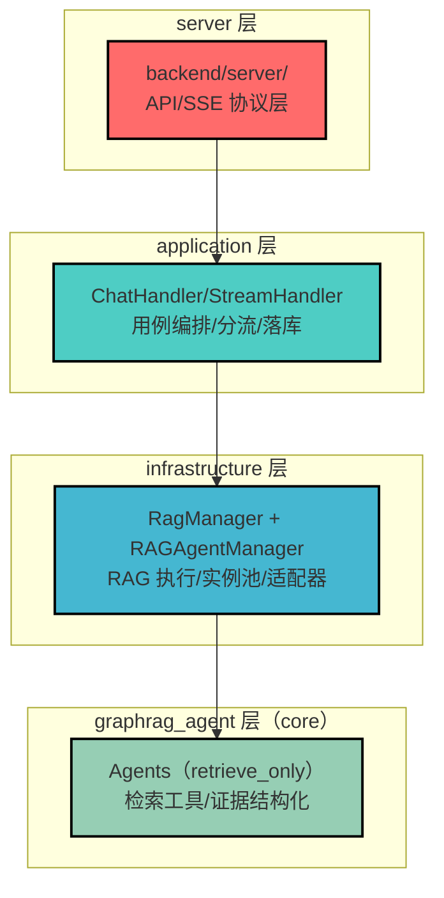
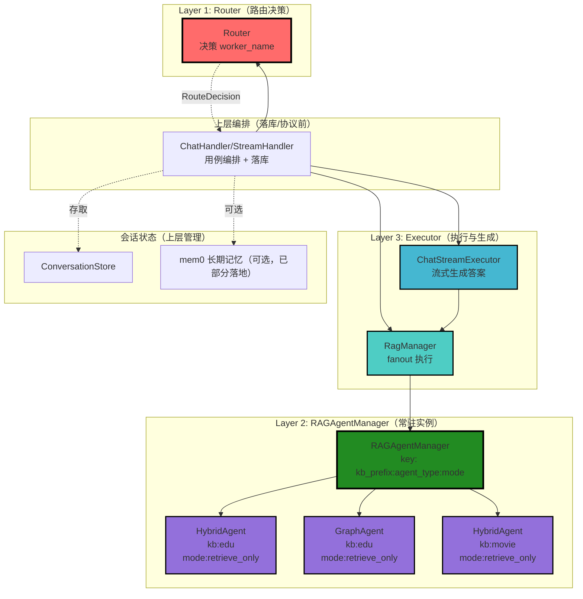
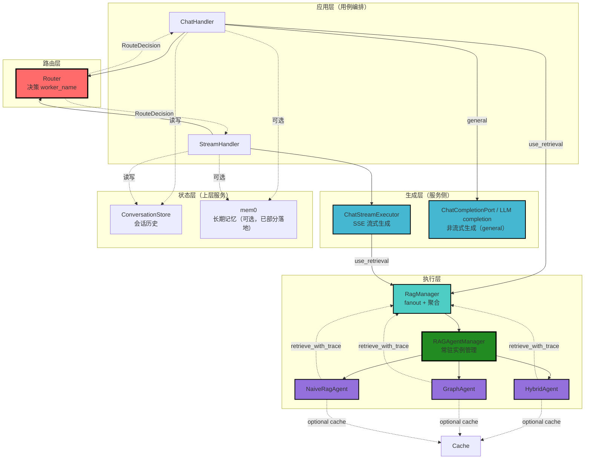

# Router→Worker 架构迁移设计文档

## 文档信息

- **项目**: GraphRAG Agent
- **文档版本**: v3.0（纯 Router→Worker 架构）
- **创建日期**: 2025-01-19
- **作者**: System Architect
- **状态**: 已落地（v3 strict），持续同步仓库现状
- **前置文档**: Agent状态托管迁移设计文档v2.md

---

## 目录

- [1. 迁移目标](#1-迁移目标)
- [2. 核心架构原则](#2-核心架构原则)
  - [2.1 worker_name 协议 v2（三段格式）【P0】](#21-worker_name-协议-v2三段格式p0)
  - [2.2 检索缓存协议【P0】](#22-检索缓存协议p0)
  - [2.3 模块落点与分层【P0】](#23-模块落点与分层p0)
  - [2.4 thread_id/user_id/session_id 语义统一【P1】](#24-thread_iduser_idsession_id-语义统一p1)
  - [2.5 Router 返回类型统一【P1】](#25-router-返回类型统一p1)
  - [2.6 三层分离](#26-三层分离)
- [3. 历史问题（已解决/已收敛）](#3-历史问题已解决已收敛)
- [4. 目标架构设计](#4-目标架构设计)
- [5. Chat 会话记录持久化](#5-chat-会话记录持久化)
- [6. 接口设计](#6-接口设计)
- [7. 落地状态](#7-落地状态)
- [8. 风险与约束](#8-风险与约束)
- [9. 附录](#9-附录)

---

## 1. 迁移目标

### 1.1 核心目标

**只保留 Router→Worker 架构，完全下线 LegacyChatAgent**

### 1.2 具体要求

1. **Agent（检索执行器，retrieve_only）**
   - ✅ 只负责数据检索（retrieval）
   - ✅ 无状态、可常驻、易并发
   - ✅ 不负责会话管理、不构建 LangGraph
   - ✅ 暴露 `retrieve_with_trace()` 接口

2. **Router（路由层）**
   - ✅ ChatHandler 调用 Router 决策
   - ✅ Router 输出 RouteDecision（含 `kb_prefix/worker_name/confidence/method/reason`）；其中 `worker_name` 是检索分发的权威字段
   - ✅ RagManager fanout 执行多个检索 Agent（retrieve_only）
   - ✅ ChatStreamExecutor 统一流式生成答案

3. **会话状态管理**
   - ✅ 由上层服务管理（ChatHandler/ConversationStore；长期记忆模块为未来可选，不在 v3 strict 范围）
   - ✅ 检索 Agent 不依赖 checkpointer
   - ✅ clear_history 语义迁移为"清理服务侧状态"

4. **缓存管理**
   - ✅ 不再在 Agent 内做答案生成缓存/会话状态托管
   - ✅ v3 strict 已物理移除检索侧缓存（不再保留任何检索缓存实现/兼容签名）
   - ✅ 如需缓存/复用，应在服务侧（infrastructure/persistence 或外部 Redis 等）单独设计

### 1.3 下线范围

**完全移除**：
- ❌ LegacyChatAgent（带 LangGraph 图执行的 Agent）
- ❌ BaseAgent 中的 checkpointer/MemorySaver
- ❌ BaseAgent 中的 ask/ask_stream（chat 语义）

**保留并重构**：
- ✅ Agent 实例池化（常驻、可复用；由 RAGAgentManager 承担）
- ✅ Agent 的检索能力（retrieve_with_trace）
- ✅ Router 决策机制
- ✅ 检索侧不做缓存（物理下线）

---

## 2. 核心架构原则

### 2.1 worker_name 协议 v2（三段格式）【P0】

#### 协议定义

**worker_name 格式**（统一为三段）：
```
{kb_prefix}:{agent_type}:{agent_mode}
```

**字段说明**：
| 字段 | 说明 | 示例 |
|------|------|------|
| `kb_prefix` | 知识库前缀 | `edu`、`movie` |
| `agent_type` | Agent/Worker 类型 | `hybrid_agent`、`graph_agent`、`naive_rag_agent` |
| `agent_mode` | Agent 模式 | `retrieve_only`（仅此一种） |

**完整示例**：
- `edu:hybrid_agent:retrieve_only`
- `movie:graph_agent:retrieve_only`
- `edu:naive_rag_agent:retrieve_only`

**当前支持的 agent_type（以代码为准）**：
- `graph_agent` / `hybrid_agent` / `naive_rag_agent` / `deep_research_agent` / `fusion_agent`（见 `backend/infrastructure/agents/rag_factory/factory.py`）

**特殊约定（general/no-retrieval）**：
- 当最终 `kb_prefix` 为 `general` 时，`worker_name` 置为 `""`（空字符串），明确表示“不要分发到检索 Worker”。
- 当最终 `kb_prefix` 为空串时，application 层会按 general 路径处理（不走检索）；此时 `worker_name` 即使非空也应被忽略。
- 当 `KB_AUTO_ROUTE=false` 且 `requested_kb_prefix` 为空时，RouterGraph 会将 `kb_prefix` 归一为 `general`（避免出现 “kb_prefix 为空但 worker_name 非空” 的不一致）。

#### 兼容策略

**向后兼容旧格式（空/一段/二段/三段）**：
- 一段格式（`<agent_type>`）仅作为历史兼容：RouterGraph 不应再产出该格式；若出现，表示仍有旧组件在绕过 v3 路由协议。
```python
def parse_worker_name(worker_name: str) -> ParsedWorkerName:
    """
    解析 worker_name（兼容空/一段/二段/三段格式）

    Args:
        worker_name: Worker 名称
            - 新格式（三段）：{kb_prefix}:{agent_type}:{agent_mode}
            - 兼容（二段）：{kb_prefix}:{agent_type}
            - 兼容（一段）：{agent_type}
            - 特例（空串）：""

    Returns:
        ParsedWorkerName
    """
    raw = (worker_name or "").strip()
    if not raw:
        return ParsedWorkerName(kb_prefix="", agent_type="", agent_mode="retrieve_only")

    parts = [p.strip() for p in raw.split(":") if p is not None]
    if len(parts) == 1:
        return ParsedWorkerName(kb_prefix="", agent_type=parts[0], agent_mode="retrieve_only")
    if len(parts) == 2:
        kb_prefix, agent_type = parts
        return ParsedWorkerName(kb_prefix=kb_prefix, agent_type=agent_type, agent_mode="retrieve_only")
    if len(parts) == 3:
        kb_prefix, agent_type, agent_mode = parts
        agent_mode = agent_mode or "retrieve_only"
        if agent_mode != "retrieve_only":
            raise ValueError(f"unsupported agent_mode in worker_name: {worker_name}")
        return ParsedWorkerName(kb_prefix=kb_prefix, agent_type=agent_type, agent_mode=agent_mode)

    raise ValueError(f"invalid worker_name format: {worker_name}")
```

**为什么选择 {kb_prefix}:{agent_type}:{agent_mode} 顺序**：
- ✅ 现有代码已使用 `{kb_prefix}:{agent_type}` 二段
- ✅ 向后扩展只需在尾部加一段，最易兼容
- ❌ 如果用 `{agent_type}:{kb_prefix}:{mode}`，现有二段完全无法兼容

#### 代码变更点

**变更 1：RouterGraph._worker_select_node() 输出改为三段**

```python
# backend/infrastructure/routing/orchestrator/router_graph.py

# 历史（已删除）：旧二段格式（{kb_prefix}:{agent_type}）
def _worker_select_node(state: ChatRouteState) -> ChatRouteState:
    kb_prefix = state.get("kb_prefix") or "default"
    agent_type = state.get("agent_type") or "hybrid_agent"
    return {"worker_name": f"{kb_prefix}:{agent_type}"}

# 当前：三段格式（{kb_prefix}:{agent_type}:{agent_mode}），并保留 general 特例
def _worker_select_node(state: ChatRouteState) -> ChatRouteState:
    kb_raw = _normalize_kb_prefix(state.get("kb_prefix") or "")
    if kb_raw == "general":
        # 明确“无检索”路径：worker_name 置空，避免下游误当成检索 worker。
        return {"worker_name": ""}

    kb_slug = kb_raw or "default"
    agent_type = (state.get("agent_type") or "").strip() or "hybrid_agent"
    return {"worker_name": f"{kb_slug}:{agent_type}:retrieve_only"}
```

**变更 2：新增 parse_worker_name()（支持二段/三段兼容）**

```python
# backend/infrastructure/routing/orchestrator/worker_registry.py

@dataclass(frozen=True)
class ParsedWorkerName:
    kb_prefix: str
    agent_type: str
    agent_mode: str


def parse_worker_name(worker_name: str) -> ParsedWorkerName:
    """
    解析 worker_name（兼容二段/三段格式）

    Args:
        worker_name: Worker 名称
            - 新格式（三段）：{kb_prefix}:{agent_type}:{agent_mode}
            - 旧格式（二段）：{kb_prefix}:{agent_type}

    Returns:
        ParsedWorkerName

    Raises:
        ValueError: 格式无效

    Examples:
        >>> parse_worker_name("edu:hybrid_agent:retrieve_only")
        ParsedWorkerName(kb_prefix="edu", agent_type="hybrid_agent", agent_mode="retrieve_only")

        >>> parse_worker_name("edu:hybrid_agent")  # 兼容旧格式
        ParsedWorkerName(kb_prefix="edu", agent_type="hybrid_agent", agent_mode="retrieve_only")
    """
    raw = (worker_name or "").strip()
    if not raw:
        return ParsedWorkerName(kb_prefix="", agent_type="", agent_mode="retrieve_only")

    parts = [p.strip() for p in raw.split(":") if p is not None]
    if len(parts) == 1:
        # Historical/compat: "<agent_type>"
        return ParsedWorkerName(kb_prefix="", agent_type=parts[0], agent_mode="retrieve_only")
    if len(parts) == 2:
        # Compat: "{kb_prefix}:{agent_type}"
        kb_prefix, agent_type = parts
        return ParsedWorkerName(kb_prefix=kb_prefix, agent_type=agent_type, agent_mode="retrieve_only")
    if len(parts) == 3:
        kb_prefix, agent_type, agent_mode = parts
        agent_mode = agent_mode or "retrieve_only"
        if agent_mode != "retrieve_only":
            raise ValueError(f"unsupported agent_mode in worker_name: {worker_name}")
        return ParsedWorkerName(kb_prefix=kb_prefix, agent_type=agent_type, agent_mode=agent_mode)

    raise ValueError(f"invalid worker_name format: {worker_name}")
```

**变更 3：get_agent_for_worker_name() 透传 agent_mode**

```python
# backend/infrastructure/routing/orchestrator/worker_registry.py

def get_agent_for_worker_name(
    *,
    worker_name: str,
    session_id: str,
    agent_mode: str | None = None,
):
    parsed = parse_worker_name(worker_name)

    kb_prefix = parsed.kb_prefix
    if kb_prefix == "default":
        kb_prefix = ""

    from infrastructure.agents.rag_factory import rag_agent_manager as agent_manager

    return agent_manager.get_agent(
        parsed.agent_type,
        session_id=session_id,
        kb_prefix=kb_prefix,
        # Keep explicit argument for callers, but default to parsed mode.
        agent_mode=(agent_mode or parsed.agent_mode),
    )
```

### 2.2 thread_id 约定【P0】

v3 strict 保留 `retrieve_with_trace(query, thread_id)` 的 `thread_id` 入参，用于 trace/长期记忆/会话关联；不用于检索结果缓存。

### 2.3 模块落点与分层【P0】

#### 分层架构（不新增 backend/core）



#### 文件落点

| 层级 | 路径 | 内容 | 依赖 |
|------|------|------|------|
| **server** | `backend/server/` | API/SSE 协议层 | application |
| **application** | `backend/application/chat/handlers/` | Chat/Stream 编排（路由、分流、落库） | ports |
| **infrastructure** | `backend/infrastructure/rag/rag_manager.py` | RagManager（检索 fanout、聚合、触发服务侧生成） | agents/routing |
| **infrastructure** | `backend/infrastructure/agents/rag_factory/manager.py` | RAGAgentManager（常驻实例池） | graphrag_agent |
| **graphrag_agent** | `backend/graphrag_agent/agents/` | retrieval-only Agents（只提供 retrieve_with_trace） | 无（core） |

**核心原则**：
- ✅ `backend/graphrag_agent/`：检索算法与证据结构化（不依赖 infrastructure/application/server）
- ✅ `backend/infrastructure/`：RagManager/实例池/对外部资源的适配
- ✅ `backend/application/`：HTTP 之上的用例编排（路由分流、plan 组装、落库）
- ✅ `backend/server/`：API/SSE 协议层
- ❌ **不新增 `backend/core/`**（避免与 `graphrag_agent=core` 冲突）

### 2.4 thread_id/user_id/session_id 语义统一【P1】

#### 术语定义

| 术语 | 定义 | 用途 | 示例 |
|------|------|------|------|
| **user_id** | 用户唯一标识 | 权限控制；未来长期记忆隔离（可选） | `user_123` |
| **session_id** | 会话唯一标识 | 会话隔离、History 持久化、ConversationStore | `session_456` |
| **thread_id** | 请求链路关联 ID（等于 session_id） | 用于 trace 关联、日志追踪 | `session_456` |

#### 语义映射

**Router→Worker 架构中的语义**：

```python
# ChatHandler 调用链
async def handle_chat(user_id: str, session_id: str, query: str):
    # 1. Router 决策
    decision = router.route(message=query, session_id=session_id, requested_kb="edu", agent_type="hybrid_agent")

    # 2. general / RAG 分流（general 直接生成；RAG 组 plan 并走执行器）
    conversation_id = await conversation_store.get_or_create_conversation_id(user_id=user_id, session_id=session_id)
    await conversation_store.append_message(conversation_id=conversation_id, role="user", content=query)

    if decision.kb_prefix in {"", "general"}:
        answer = await completion.generate(message=query)
        await conversation_store.append_message(conversation_id=conversation_id, role="assistant", content=answer)
        return answer

    resolved_agent_type = _resolve_agent_type(agent_type="hybrid_agent", worker_name=decision.worker_name)
    plan = [RagRunSpec(agent_type=resolved_agent_type, worker_name=decision.worker_name)]
    aggregated, runs = await executor.run(plan=plan, message=query, session_id=session_id, kb_prefix=decision.kb_prefix, debug=False)
    await conversation_store.append_message(conversation_id=conversation_id, role="assistant", content=aggregated.answer)
    return aggregated.answer
```

**Agent 中的 thread_id 使用**：

```python
class BaseAgent:
    def retrieve_with_trace(self, query: str, thread_id: str = "default") -> dict:
        \"\"\"仅检索：返回结构化证据。

        注意：
        - thread_id 在系统里约定等于 session_id（用于 trace 关联）
        - Agent 不持久化 thread_id，不管理对话状态
        \"\"\"
        ...
```

**关键原则**：
- ✅ `thread_id = session_id`：用于请求链路 trace 关联、日志追踪
- ✅ Agent 接收 `thread_id`（仅用于 trace 字段与上层关联）
- ❌ Agent **不持久化** `thread_id`（无状态设计）
- ❌ **不再使用** LangGraph checkpointer（v3 完全移除）

#### 会话隔离

**会话历史**（不是缓存，是状态托管）：
- ConversationStore（Postgres/InMemory）按 `(user_id, session_id)` 定位会话，再读写 messages

### 2.5 Router 返回类型统一【P1】

#### Router 接口定义

**统一返回类型**：
```python
@dataclass
class RouteDecision:
    """路由决策结果"""
    requested_kb_prefix: str     # 用户请求的 KB（可能为空）
    routed_kb_prefix: str        # 路由命中的 KB（可能为空）
    kb_prefix: str               # 最终生效的 KB（含策略覆盖）
    confidence: float            # 置信度
    method: str                  # 路由方法（heuristic/llm/default/...）
    reason: str                  # 路由理由（可用于 debug）
    worker_name: str             # Worker 名称（{kb_prefix}:{agent_type}:{agent_mode}）
```

#### Router 接口

```python
# backend/application/ports/router_port.py
from typing import Optional, Protocol

class RouterPort(Protocol):
    def route(
        self,
        *,
        message: str,
        session_id: str,
        requested_kb: Optional[str],
        agent_type: str,
    ) -> RouteDecision:
        ...
```

#### RouterGraph（LangGraph 实现）

**是否保留**：✅ 保留，但无需 checkpointer

```python
# backend/infrastructure/routing/orchestrator/router_graph.py

def build_router_graph():
    graph = StateGraph(ChatRouteState)
    graph.add_node("intent_detect", _intent_detect_node)
    graph.add_node("apply_override_policy", _apply_override_policy_node)
    graph.add_node("worker_select", _worker_select_node)

    graph.set_entry_point("intent_detect")
    graph.add_edge("intent_detect", "apply_override_policy")
    graph.add_edge("apply_override_policy", "worker_select")
    graph.add_edge("worker_select", END)
    return graph.compile()  # 不使用 checkpointer


_ROUTER_GRAPH = build_router_graph()


def invoke_router_graph(
    *,
    message: str,
    session_id: str,
    agent_type: str,
    requested_kb_prefix: Optional[str] = None,
) -> RouteDecision:
    initial: ChatRouteState = {
        "message": message,
        "session_id": session_id,
        "agent_type": agent_type,
        "requested_kb_prefix": requested_kb_prefix,
    }
    final_state: ChatRouteState = _ROUTER_GRAPH.invoke(initial)
    return RouteDecision(
        requested_kb_prefix=str(final_state.get("requested_kb_prefix") or ""),
        routed_kb_prefix=str(final_state.get("routed_kb_prefix") or ""),
        kb_prefix=str(final_state.get("kb_prefix") or ""),
        confidence=float(final_state.get("confidence") or 0.0),
        method=str(final_state.get("method") or ""),
        reason=str(final_state.get("reason") or ""),
        worker_name=str(final_state.get("worker_name") or ""),
    )
```

### 2.6 三层分离（上层 Handler 负责编排与落库）



**关键区别**：
- ❌ 旧架构：ChatHandler → LegacyChatAgent.ask() → LangGraph 图执行 → 答案生成
- ✅ 新架构：ChatHandler/StreamHandler → Router → RagManager → Agent.retrieve_with_trace() → ChatStreamExecutor → 答案生成

### 2.6.1 职责划分

| 层级 | 组件 | 职责 | 不负责 |
|------|------|------|--------|
| Handler | ChatHandler/StreamHandler | 用例编排（general/RAG 分流、plan 组装）、落库（ConversationStore） | 不做检索实现细节、不做路由算法 |
| Router | Router | 根据用户查询决策 `worker_name`（可扩展为 fanout plan） | 不执行检索、不生成答案 |
| AgentPool | RAGAgentManager | 管理 Agent 常驻实例（常驻/复用） | 不参与业务语义 |
| Agent（retrieve_only） | GraphAgent/HybridAgent/... | 执行检索、返回结构化证据 | 不管理会话、不生成最终答案 |
| Executor | RagManager | Fanout 执行多个检索 Agent、聚合结果 | 不做路由决策 |
| Executor | ChatStreamExecutor | 流式生成最终答案 | 不做检索 |
| State | ConversationStore | 管理会话历史 | 不参与检索 |
| State | mem0（可选） | 长期记忆存储（已部分落地，可选启用） | 不参与检索 |
| Extension | KnowledgeBaseHandlerFactory | KB 专用 Handler 扩展（可绕过通用 RAG 执行器） | 不负责通用流程 |

### 2.6.2 实例 Key 规范

**Agent 实例 key**（统一规范）：
```python
instance_key = f"{kb_prefix}:{agent_type}:{agent_mode}"
```

**示例**：
- `edu:hybrid_agent:retrieve_only`
- `movie:graph_agent:retrieve_only`

**效果**：
- ✅ 常驻实例数量 = agent_type 数 × kb 数（固定、少量）
- ✅ session 数量不影响实例数量

---

## 3. 历史问题（已解决/已收敛）

### 3.1 P0：架构混用（已解决）

历史上存在两种调用路径（legacy chat vs Router→Worker）。v3 strict 已把 legacy 路径物理删除，只保留 Router→Worker。

```python
# 路径 1（已删除）：LegacyChatAgent.ask() + LangGraph 图执行
# agent = LegacyChatAgent(...)
# answer = agent.ask(query, thread_id=session_id)

# 路径 2（当前）：Router → Executor → retrieve_with_trace → 服务侧生成
decision = router.route(message=query, session_id=session_id, requested_kb=kb_prefix, agent_type=agent_type)
plan = [RagRunSpec(agent_type=agent_type, worker_name=decision.worker_name)]
aggregated, runs = await executor.run(plan=plan, message=query, session_id=session_id, kb_prefix=decision.kb_prefix, debug=debug)
answer = aggregated.answer
```

**现状**：
- ✅ 语义统一：Agent 只做 `retrieve_with_trace()`；答案生成/流式在服务侧
- ✅ 不存在 checkpointer/MemorySaver 形态（物理移除）

**历史问题：BaseAgent 职责不清（已修复）**

```python
# backend/graphrag_agent/agents/base.py（v3 strict 现状）
# - 不存在 ask/ask_stream/ask_with_trace
# - 不依赖 MemorySaver/checkpointer
class BaseAgent:
    def retrieve_with_trace(self, query: str, thread_id: str = "default") -> dict:
        ...  # 返回 context/retrieval_results/reference
```

**现状**：
- ✅ BaseAgent/各 Agent 只承担“检索取证据”
- ✅ 会话状态由 ConversationStore 托管（user_id + session_id）

### 3.2 P0：clear_session_state（已解决）

v3 strict 下，会话消息清理由 ConversationStore 提供能力：按 `(user_id, session_id)` 定位到 `conversation_id`，再清空该会话 messages。

### 3.3 P1：边界收敛（检索/生成/状态）

v3 strict 收敛为：Agent 只检索，生成在服务侧流式执行器完成，会话状态由 ConversationStore/mem0 托管。

### 3.4 P1：实例 key 定义不一致

**问题**：文档中 instance_key 定义不统一

- 有的地方说：`(agent_type, kb_prefix)` ← **错误**
- 有的地方说：`(agent_type, kb_prefix, mode)` ← **正确**
- 代码注释写包含 mode，但接口说明写不包含

**影响**：
- 导致实现时反复打补丁
- 不同 mode 的 Agent 实例无法隔离

**解决方案**：
- ✅ 全文统一为 `{kb_prefix}:{agent_type}:{agent_mode}`

---

## 4. 目标架构设计

### 4.1 整体架构



### 4.2 调用链路

#### 完整调用流程

```python
# 1) ChatHandler 接收用户查询并写入 ConversationStore
async def handle_chat(user_id: str, session_id: str, query: str):
    conversation_id = await conversation_store.get_or_create_conversation_id(
        user_id=user_id,
        session_id=session_id,
    )
    await conversation_store.append_message(conversation_id=conversation_id, role="user", content=query)

    # 2) Router 决策（输出 worker_name 三段：{kb}:{agent}:{mode}）
    decision = router.route(
        message=query,
        session_id=session_id,
        requested_kb="edu",
        agent_type="hybrid_agent",
    )

    # 3) general / RAG 分流
    if decision.kb_prefix in {"", "general"}:
        answer = await completion.generate(message=query)
        await conversation_store.append_message(conversation_id=conversation_id, role="assistant", content=answer)
        return answer

    resolved_agent_type = _resolve_agent_type(agent_type="hybrid_agent", worker_name=decision.worker_name)
    plan = [RagRunSpec(agent_type=resolved_agent_type, worker_name=decision.worker_name)]
    aggregated, runs = await executor.run(
        plan=plan,
        message=query,
        session_id=session_id,
        kb_prefix=decision.kb_prefix,
        debug=False,
    )
    await conversation_store.append_message(conversation_id=conversation_id, role="assistant", content=aggregated.answer)
    return aggregated.answer
```

#### Agent 检索流程（retrieve_only）

v3 strict 下，实例池中复用的是 `graphrag_agent` 的 retrieval-only Agent（不是 BaseWorker/HybridWorker）。

```python
# Agent（无状态检索执行器）
class HybridAgent(BaseAgent):
    def retrieve_with_trace(self, query: str, thread_id: str = "default") -> dict:
        _ = thread_id

        # 只返回证据（context + retrieval_results + reference）
        payload = self.search_tool.retrieve_only({"query": query})
        low = str(payload.get("low_level_content") or "").strip()
        high = str(payload.get("high_level_content") or "").strip()
        context = "\n\n".join([p for p in (low, high) if p]).strip()

        return {
            "context": context,
            "retrieval_results": payload.get("retrieval_results", []) or [],
            "reference": payload.get("reference", {}) or {},
        }
```

### 4.3 会话状态管理（v3 strict 现状）

#### 状态存储位置

| 状态类型 | 存储位置 | 管理组件 | 清理方式 | 隔离维度 |
|---------|---------|---------|---------|---------|
| 会话历史 | ConversationStore（Postgres/InMemory） | AgentHistoryService / ChatHandler / StreamHandler | `POST /api/v1/clear` | (user_id, session_id) |
| LangGraph state | 不再使用（已移除） | N/A | N/A | N/A |
| 长期记忆 | mem0（已部分落地，可选启用） | MemoryService + Mem0HttpMemoryStore | 按策略写入/召回 | user_id |

#### clear_history 语义（与仓库实现一致）

`/api/v1/clear` 的实现位于 `backend/infrastructure/chat/history_service.py`：

```python
conversation_id = await conversation_store.get_or_create_conversation_id(
    user_id=user_id,
    session_id=session_id,
)
cleared = await conversation_store.clear_messages(conversation_id=conversation_id)

# 迁移期兼容（当前实现为 no-op，保持返回形态稳定）
agent_manager.clear_history(session_id=session_id, kb_prefix=kb_prefix)

return {"status": "ok", "remaining_messages": str(cleared)}
```

### 4.4 缓存（v3 strict 现状）

- v3 strict 不提供检索结果缓存与答案缓存：每次请求实时检索/生成；如需复用/缓存，应在服务侧统一设计与实现（例如 Redis/Postgres/应用层缓存）。

## 5. Chat 会话记录持久化

v3 strict 下，“会话状态”不再由检索 Agent 持有，而是由服务侧 ConversationStore 托管。

### 5.1 协议与行为

#### 前端请求必须携带

- `user_id`：用户标识（前端稳定传入；同一用户不变）
- `session_id`：会话标识（前端生成；用于把一段对话聚合到同一个 conversation）
- `message`：用户消息

#### 后端处理规则

- 映射：`(user_id, session_id) -> conversation_id`（幂等，唯一约束）
- 写入：每次请求都先写入 `role=user`，生成/流结束后写入 `role=assistant`
- clear_history：只清当前会话消息（ConversationStore），不影响未来可能引入的长期记忆模块

### 5.2 数据库表结构（与仓库一致）

表结构以 `scripts/db/init_chat_history.sql` 为准，核心三张表：

- `conversations(id, user_id, session_id, created_at, updated_at, unique(user_id, session_id))`
- `messages(id, conversation_id, role, content, created_at, citations jsonb, debug jsonb)`
- `feedback(id, message_id, query, is_positive, thread_id, agent_type, created_at, metadata jsonb)` —— 用户反馈（点赞/点踩），用于后续分析与调优

### 5.3 初始化与本地运行

#### 使用 docker-compose 的 Postgres（推荐）

仓库已提供 `docker-compose.yaml`：

- service：`postgres`
- 默认数据库：`graphrag_chat`
- 默认账号：`postgres/postgres`

初始化建表：

```bash
docker compose up -d postgres

docker compose exec -T postgres psql -U postgres -d graphrag_chat < scripts/db/init_chat_history.sql
```

#### 环境变量（服务侧）

ConversationStore 的 DSN 由 `backend/config/database.py:get_postgres_dsn()` 读取：

- 优先：`POSTGRES_DSN`
- 否则使用：`POSTGRES_HOST/POSTGRES_PORT/POSTGRES_USER/POSTGRES_PASSWORD/POSTGRES_DB`

### 5.4 代码落点（当前实现）

- Port：`backend/application/ports/conversation_store_port.py`
- 实现：`backend/infrastructure/persistence/postgres/conversation_store.py`
  - `PostgresConversationStore`：生产/持久化
  - `InMemoryConversationStore`：未配置 Postgres 时回退（不跨进程/重启持久化）
- 写入点：
  - `backend/application/chat/handlers/chat_handler.py`
  - `backend/application/chat/handlers/stream_handler.py`

---

## 6. 接口设计

本节不再描述“WorkerPool/BaseWorker/worker_pool.py”等历史草案实现；以当前仓库的 ports + infra adapters 为准。

### 6.1 RouterPort / RouteDecision

- **接口**：`backend/application/ports/router_port.py`
- **模型**：`backend/domain/chat/entities/route_decision.py`
- **实现适配器**：`backend/infrastructure/routing/router.py`（RouterGraphAdapter）
- **路由图实现**：`backend/infrastructure/routing/orchestrator/router_graph.py`

关键点：
- `worker_name` 统一为三段：`{kb_prefix}:{agent_type}:{agent_mode}`
- general/no-retrieval：`worker_name=""`（空字符串）
- strict：`agent_mode` 仅允许 `retrieve_only`

### 6.2 ConversationStorePort（会话状态托管）

- **接口**：`backend/application/ports/conversation_store_port.py`
- **实现**：`backend/infrastructure/persistence/postgres/conversation_store.py`

核心方法：
- `get_or_create_conversation_id(user_id, session_id) -> conversation_id`
- `append_message(conversation_id, role, content, citations?, debug?)`
- `list_messages(conversation_id, limit?, before?)`
- `clear_messages(conversation_id) -> deleted_count`

### 6.3 RAGExecutorPort（非流式）

- **接口**：`backend/application/ports/rag_executor_port.py`
- **实现适配器**：`backend/infrastructure/rag/adapters/graphrag_executor.py`
- **infra 执行器**：`backend/infrastructure/rag/rag_manager.py`

约定：
- application 侧传入 `plan: list[RagRunSpec]`（可扩展 fanout）
- infra 侧对每个 spec 调用 `agent.retrieve_with_trace(...)`，聚合后再统一生成最终答案（`RagManager.run_plan_blocking()`）
- 当 `RagRunSpec.worker_name` 存在时，它是“权威路由结果”：infra 会优先用它解析 `(kb_prefix, agent_type, agent_mode)` 并获取常驻实例；`RagRunSpec.agent_type` 仅作为兜底/日志字段

### 6.4 RAGStreamExecutorPort（SSE 流式）

- **接口**：`backend/application/ports/rag_stream_executor_port.py`
- **实现适配器**：`backend/infrastructure/rag/adapters/graphrag_stream_executor.py`
- **流式执行器**：`backend/infrastructure/streaming/chat_stream_executor.py`（ChatStreamExecutor）
- **事件协议**：`backend/server/models/stream_events.py`

关键点：
- general 与 RAG 共用同一 SSE 事件协议（通过“空 plan”实现）
- 检索 Agent 不参与流式输出；流式发生在服务侧 executor

#### StreamEvent 最小合同（以代码为准）

事件会被 `backend/server/models/stream_events.py:normalize_stream_event()` 归一化为稳定结构，供 React 消费：

```json
{"status":"start"}
{"status":"progress","content":{"stage":"retrieval|generation","completed":0,"total":0,"error":null,"agent_type":"","retrieval_count":null}}
{"status":"token","content":"..."}
{"status":"error","message":"..."}
{"status":"execution_log","content":{"node":"...","input":{},"output":{}}}
{"status":"done"}
```

补充：
- server 可能发送 SSE 注释心跳帧（例如 `: ping`），客户端应忽略即可。

### 6.5 RAGAgentManager（常驻实例池）

- **实现**：`backend/infrastructure/agents/rag_factory/manager.py`

约定：
- `instance_key = f"{kb_prefix}:{agent_type}:{agent_mode}"`
- strict：仅允许 `retrieve_only`
- `session_id` 不进入 instance_key（避免按 session 膨胀）

### 6.6 core Agent 合同（retrieve_only）

- **目录**：`backend/graphrag_agent/agents/`
- **对外合同**：每个 Agent 只实现：`retrieve_with_trace(query, thread_id)`
- **返回结构**（供 infra 聚合/生成）：
  - `context: str`
  - `retrieval_results: list[dict]`
  - `reference: dict`

---

## 7. 落地状态

本节以当前仓库代码为“唯一真相”，同步 v3 strict 的实际落地形态：

- ✅ `LegacyChatAgent` 已物理删除（不再存在任何可运行的 legacy 路径）。
- ✅ core Agent 只提供 `retrieve_with_trace()`；`ask/ask_stream/ask_with_trace` 物理移除（AttributeError）。
- ✅ 会话状态在服务侧托管：`ConversationStore(user_id, session_id) -> conversation_id -> messages`。
- ✅ 流式输出统一走服务侧 SSE：`/api/v1/chat/stream`（general 与 RAG 共用同一事件协议）。

### 7.0 legacy 物理下线步骤（已完成）

1) **删除 Agent 的 chat 语义 API**
   - `backend/graphrag_agent/agents/base.py` 不再提供 `ask/ask_stream/ask_with_trace`（不做 stub，不做兼容重定向）。
   - 任何需要“对话/生成/流式”的能力，统一由服务侧（ChatHandler/StreamHandler + executor）提供。

2) **删除 legacy Agent 形态**
   - 仓库中不再存在 `LegacyChatAgent`（含导入与引用）。
   - 不再保留“legacy mode/flag”分支（避免实现继续兼容 legacy 的心理预期）。

3) **强约束 agent_mode**
   - worker_name 协议保留三段，但 infra 侧强制 `agent_mode=retrieve_only`（见 `backend/infrastructure/routing/orchestrator/worker_registry.py`）。

### 7.1 目录与关键文件（当前实现）

#### 7.1.1 core（检索证据）

- `backend/graphrag_agent/agents/base.py`
  - 仅保留“检索侧通用能力 + 缓存工具 + 性能指标”
  - 抽象方法：`retrieve_with_trace(query, thread_id)`（必须实现）
  - 不存在 `ask/ask_stream/ask_with_trace`
- `backend/graphrag_agent/agents/graph_agent.py` / `backend/graphrag_agent/agents/hybrid_agent.py` / `backend/graphrag_agent/agents/naive_rag_agent.py` / `backend/graphrag_agent/agents/deep_research_agent.py` / `backend/graphrag_agent/agents/fusion_agent.py`
  - 均为 retrieval-only：只负责取证据（context/retrieval_results/reference）
  - 不生成最终答案、不做流式输出、不持有会话状态

#### 7.1.2 infrastructure（池化 + 适配）

- `backend/infrastructure/agents/rag_factory/manager.py`
  - 常驻实例池：`instance_key = f"{kb_prefix}:{agent_type}:{agent_mode}"`
  - strict：`agent_mode` 仅允许 `retrieve_only`
  - `session_id` 仅用于传入 `thread_id`，不参与实例缓存 key（避免按 session 爆炸）
- `backend/infrastructure/routing/router.py`
  - RouterGraphAdapter：实现 `RouterPort`，把 application 的 route() 调用适配到 RouterGraph
- `backend/infrastructure/routing/orchestrator/router_graph.py`
  - RouterGraph 输出 `worker_name`（三段）：`{kb_prefix}:{agent_type}:{agent_mode}`
- `backend/infrastructure/routing/orchestrator/worker_registry.py`
  - 解析/校验 `worker_name`，并强制 `agent_mode=retrieve_only`
- `backend/infrastructure/streaming/chat_stream_executor.py`
  - ChatStreamExecutor：统一 SSE 事件流产出（general 与 RAG 共用同一事件协议）
- `backend/infrastructure/rag/rag_manager.py`
  - retrieval fanout：内部调用 `agent.retrieve_with_trace(...)`
  - 非流式 answer generation：通过 `infrastructure.llm.completion.generate_rag_answer()` 生成最终答案（不回退到 legacy agent）
  - 流式 answer generation：由 `backend/infrastructure/streaming/chat_stream_executor.py` 调用 `generate_rag_answer_stream()` 产出 token 流

#### 7.1.3 application/server（编排 + 状态托管）

- `backend/application/chat/handlers/chat_handler.py`
  - general：直接调用 `ChatCompletionPort.generate()` 生成答案
  - RAG：组装 `RagRunSpec` plan，调用 `RAGExecutorPort.run()`
  - 统一落库：把 user/assistant 消息写入 ConversationStore
- `backend/application/chat/handlers/stream_handler.py`
  - general：传空 plan 给 stream executor（从而复用 SSE 协议/事件管道）
  - RAG：传 plan 给 stream executor，支持 progress/token/done 事件
  - 统一落库：流结束（含 client abort）写入 assistant（debug 下标记 partial）
- `backend/server/api/rest/v1/chat_stream.py`
  - SSE 输出层：发送 `start/done`，心跳 `: ping`，并通过 `normalize_stream_event()` 归一化事件协议
- `backend/application/ports/conversation_store_port.py`
- `backend/infrastructure/persistence/postgres/conversation_store.py`
  - Postgres 实现（asyncpg）+ InMemory 回退

### 7.2 关键调用链路（与代码一致）

#### 7.2.1 非 RAG（general）

1) `ChatHandler.handle(...)` 判定 `kb_prefix in {"", "general"}`（general 路径）
2) `ChatCompletionPort.generate(message)` 生成答案
3) `ConversationStore.append_message(...)` 写入 user/assistant

#### 7.2.2 RAG（retrieve_only + 服务侧生成）

1) RouterGraph 产出 `worker_name = "{kb_prefix}:{agent_type}:retrieve_only"`（三段；若 general/no-retrieval 则 `worker_name=""`）
2) `RAGExecutorPort.run(plan=[RagRunSpec(..., worker_name=...)])`
3) infra RagManager 调用 `agent.retrieve_with_trace(message, thread_id=session_id)`
4) 聚合证据后，服务侧统一生成最终答案（LLM completion）

#### 7.2.3 流式（SSE）

1) `/api/v1/chat/stream` 委托 `StreamHandler.handle(...)`
2) StreamHandler/stream executor 产出事件；server 层用 `normalize_stream_event()` 归一化为稳定协议后再 SSE 输出
3) StreamHandler 收集 token 并在结束时把 assistant 写入 ConversationStore

### 7.3 验收口径（v3 strict）

#### 7.3.1 代码层“物理下线”验收

```bash
# 不应存在任何 ask/ask_stream/ask_with_trace 的代码实现或调用
rg -n "\bask_stream\b|\bask_with_trace\b|\bask\(" backend/ test/ --glob "*.py"

# 不应存在 checkpointer/MemorySaver 代码引用
rg -n "checkpointer|MemorySaver|langgraph\.checkpoint" backend/ --glob "*.py"
```

#### 7.3.2 回归测试（建议命令）

```bash
bash scripts/test.sh
```

---

## 8. 风险与约束

- 兼容性：任何外部代码若仍调用 `agent.ask(...)` 将直接触发 AttributeError（这是刻意的强约束）。
- 工具依赖：检索工具仍可能依赖 langchain/neo4j 等 optional deps；缺失时应通过 ImportError 提示引导安装。
- 缓存：若生产环境需要检索缓存/结果复用，需在服务侧层级重新设计（例如 Redis/Postgres/应用层缓存）。
- 取消语义：retrieval 目前通过 `asyncio.to_thread(...)` 包装同步 Agent 调用；上层 cancel 只能做到“事件循环不再等待 + 不再写回结果”，无法强制中断线程中的 Neo4j/LLM 调用。
- 遗留模块：`backend/graphrag_agent/agents/multi_agent/` 等子包目前不在 v3 strict 主链路内；若未来要进一步“core 瘦身”，建议迁出到 tools/ 或单独仓库。

---

## 9. 附录

### 9.1 术语表（以仓库命名为准）

| 术语 | 定义 |
|------|------|
| worker_name | 三段：`{kb_prefix}:{agent_type}:{agent_mode}`（strict：只允许 `retrieve_only`）；general/no-retrieval：`""`（空字符串） |
| RAGAgentManager | 常驻实例池（`backend/infrastructure/agents/rag_factory/manager.py`） |
| RouterGraph | 路由图（`backend/infrastructure/routing/orchestrator/router_graph.py`） |
| RagManager | RAG 执行器（检索 fanout + 聚合 + 触发服务侧生成） |
| ChatStreamExecutor | SSE 流式执行器（`backend/infrastructure/streaming/chat_stream_executor.py`） |
| ChatHandler | 非流式编排（general 或 RAG），并写入 ConversationStore |
| StreamHandler | SSE 编排（general 或 RAG），并写入 ConversationStore |
| ConversationStore | 会话状态托管（Postgres/InMemory），key=(user_id, session_id) |

### 9.2 与 v2 的关键差异

| 项目 | v2（legacy） | v3 strict（当前） |
|------|--------------|------------------|
| checkpointer | LangGraph MemorySaver | 完全移除 |
| agent API | `ask/ask_stream` | 仅 `retrieve_with_trace` |
| 会话状态 | Agent 内持有（图状态/缓存） | 服务侧 ConversationStore 托管 |
| 流式输出 | Agent 内流式 | 服务侧 SSE（统一协议） |

---

**文档结束**
