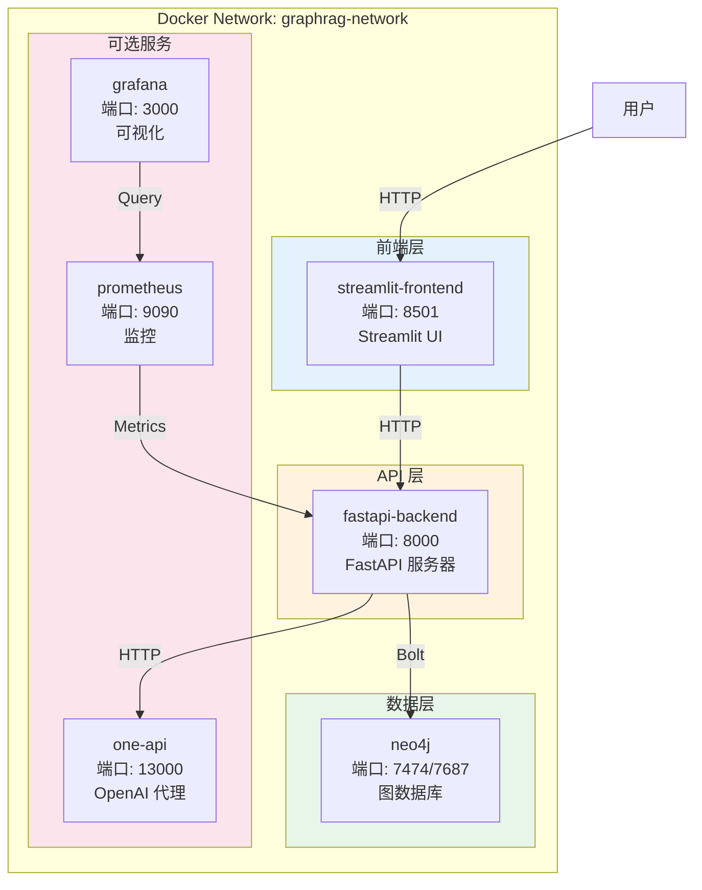
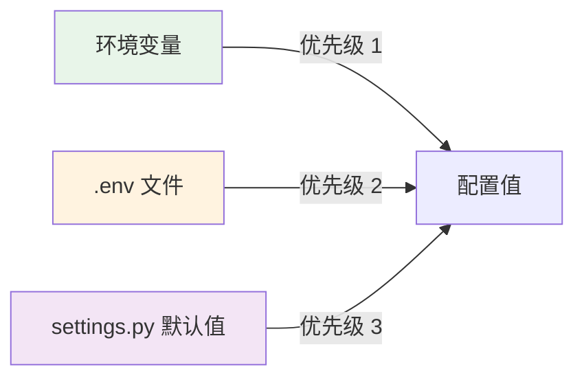
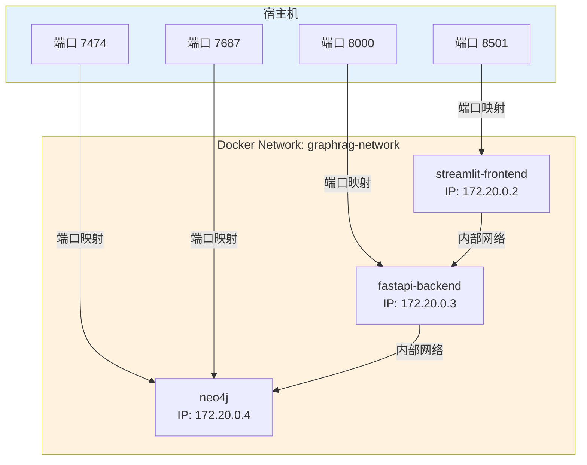

# Docker 部署

---

## 📋 元信息

- **目标读者**：运维工程师、开发者
- **阅读时间**：40分钟
- **难度**：⭐⭐
- **前置知识**：Docker、Docker Compose 基础
- **最后更新**：2026-01-04

---

## 📖 本文大纲

- [快速开始](#快速开始)
- [架构总览](#架构总览)
- [服务配置详解](#服务配置详解)
- [环境变量配置](#环境变量配置)
- [数据持久化](#数据持久化)
- [网络配置](#网络配置)
- [常用命令](#常用命令)
- [故障排查](#故障排查)
- [性能优化](#性能优化)
- [升级和回滚](#升级和回滚)
- [相关文档](#相关文档)

---

## 快速开始

### 前置条件

```bash
# 1. 安装 Docker
docker --version
# Docker version 24.0.0 或更高

# 2. 安装 Docker Compose
docker-compose --version
# Docker Compose version 2.20.0 或更高

# 3. 检查系统资源
# 推荐配置：
# - CPU: 4核+
# - 内存: 8GB+
# - 磁盘: 50GB+
```

### 一键部署

```bash
# 1. 克隆项目
git clone https://github.com/your-org/graph-rag-agent.git
cd graph-rag-agent

# 2. 配置环境变量
cp .env.example .env
vim .env  # 编辑配置（至少配置 OPENAI_API_KEY）

# 3. 启动所有服务
docker-compose up -d

# 4. 查看服务状态
docker-compose ps

# 5. 查看日志
docker-compose logs -f

# 6. 访问服务
# Neo4j 浏览器: http://localhost:7474 (neo4j/12345678)
# FastAPI 文档: http://localhost:8000/docs
# Streamlit 前端: http://localhost:8501
```

### 验证部署

```bash
# 1. 检查 Neo4j 连接
docker-compose exec neo4j cypher-shell -u neo4j -p 12345678 "RETURN 'Hello Neo4j' AS message"

# 2. 检查 API 健康
curl http://localhost:8000/health

# 3. 测试问答接口
curl -X POST http://localhost:8000/api/v1/chat \
  -H "Content-Type: backend/application/json" \
  -d '{
    "query": "你好",
    "agent_type": "naive",
    "session_id": "test"
  }'
```

---

## 架构总览

### 容器架构图



### docker-compose.yaml 完整配置

```yaml
version: "3.8"

services:
  # ========== Neo4j 图数据库 ==========
  neo4j:
    image: neo4j:5.22.0
    container_name: graphrag-neo4j
    hostname: neo4j
    ports:
      - "7474:7474"  # HTTP 浏览器
      - "7687:7687"  # Bolt 协议
    environment:
      # 认证信息
      NEO4J_AUTH: "neo4j/12345678"

      # 插件配置
      NEO4J_PLUGINS: '["apoc", "graph-data-science"]'
      NEO4J_dbms_security_procedures_unrestricted: "apoc.*,gds.*"

      # 内存配置
      NEO4J_dbms_memory_heap_initial__size: "2G"
      NEO4J_dbms_memory_heap_max__size: "2G"
      NEO4J_dbms_memory_pagecache_size: "1G"

      # 其他配置
      NEO4J_apoc_trigger_enabled: "true"
      NEO4J_dbms_connector_bolt_listen__address: "0.0.0.0:7687"
      NEO4J_dbms_connector_http_listen__address: "0.0.0.0:7474"

    volumes:
      # 数据持久化
      - neo4j_data:/data
      - neo4j_logs:/logs
      - neo4j_import:/var/lib/neo4j/import
      - neo4j_plugins:/plugins

    networks:
      - graphrag-network

    restart: unless-stopped

    healthcheck:
      test: ["CMD", "cypher-shell", "-u", "neo4j", "-p", "12345678", "RETURN 1"]
      interval: 30s
      timeout: 10s
      retries: 5
      start_period: 60s

  # ========== FastAPI 后端 ==========
  fastapi-backend:
    build:
      context: .
      dockerfile: Dockerfile.backend
    container_name: graphrag-api
    hostname: api
    ports:
      - "8000:8000"
    environment:
      # 从 .env 文件加载
      - OPENAI_API_KEY=${OPENAI_API_KEY}
      - OPENAI_BASE_URL=${OPENAI_BASE_URL}
      - OPENAI_EMBEDDINGS_MODEL=${OPENAI_EMBEDDINGS_MODEL}
      - OPENAI_LLM_MODEL=${OPENAI_LLM_MODEL}

      # Neo4j 连接（容器内部地址）
      - NEO4J_URI=neo4j://neo4j:7687
      - NEO4J_USERNAME=neo4j
      - NEO4J_PASSWORD=12345678

      # 其他配置
      # 推荐使用 SERVER_*（与 scripts/prod.sh 对齐）；同时保留 FASTAPI_WORKERS 兼容
      - SERVER_HOST=0.0.0.0
      - SERVER_PORT=8000
      - SERVER_WORKERS=${SERVER_WORKERS:-2}
      - FASTAPI_WORKERS=${FASTAPI_WORKERS:-2}
      - MAX_WORKERS=${MAX_WORKERS:-4}

    volumes:
      # 生产部署建议：不要挂载源码目录（用镜像内代码），只挂载数据/日志目录
      - ./files:/app/files
      - ./logs:/app/logs

    networks:
      - graphrag-network

    depends_on:
      neo4j:
        condition: service_healthy

    restart: unless-stopped

    healthcheck:
      test: ["CMD", "curl", "-f", "http://localhost:8000/openapi.json"]
      interval: 30s
      timeout: 10s
      retries: 3
      start_period: 40s

  # ========== Streamlit 前端 ==========
  streamlit-frontend:
    build:
      context: .
      dockerfile: Dockerfile.frontend
    container_name: graphrag-frontend
    hostname: frontend
    ports:
      - "8501:8501"
    environment:
      # API 地址（容器内部地址）
      - API_URL=http://fastapi-backend:8000

    volumes:
      # 挂载源代码（开发模式）
      - ./frontend:/app/frontend

    networks:
      - graphrag-network

    depends_on:
      fastapi-backend:
        condition: service_healthy

    restart: unless-stopped

  # ========== One-API（可选） ==========
  one-api:
    image: justsong/one-api:latest
    container_name: graphrag-oneapi
    hostname: oneapi
    ports:
      - "13000:3000"
    environment:
      - TZ=Asia/Shanghai
      - SQL_DSN=one-api:one-api@tcp(one-api-db:3306)/oneapi

    volumes:
      - oneapi_data:/data

    networks:
      - graphrag-network

    restart: unless-stopped

    profiles:
      - with-oneapi  # 使用 --profile with-oneapi 启动

  # ========== Prometheus（可选） ==========
  prometheus:
    image: prom/prometheus:latest
    container_name: graphrag-prometheus
    hostname: prometheus
    ports:
      - "9090:9090"
    volumes:
      - ./monitoring/prometheus.yml:/etc/prometheus/prometheus.yml
      - prometheus_data:/prometheus

    command:
      - '--config.file=/etc/prometheus/prometheus.yml'
      - '--storage.tsdb.path=/prometheus'
      - '--web.console.libraries=/etc/prometheus/console_libraries'
      - '--web.console.templates=/etc/prometheus/consoles'

    networks:
      - graphrag-network

    restart: unless-stopped

    profiles:
      - with-monitoring

  # ========== Grafana（可选） ==========
  grafana:
    image: grafana/grafana:latest
    container_name: graphrag-grafana
    hostname: grafana
    ports:
      - "3000:3000"
    environment:
      - GF_SECURITY_ADMIN_USER=admin
      - GF_SECURITY_ADMIN_PASSWORD=admin
      - GF_INSTALL_PLUGINS=

    volumes:
      - grafana_data:/var/lib/grafana
      - ./monitoring/grafana/dashboards:/etc/grafana/provisioning/dashboards

    networks:
      - graphrag-network

    depends_on:
      - prometheus

    restart: unless-stopped

    profiles:
      - with-monitoring

# ========== 网络定义 ==========
networks:
  graphrag-network:
    driver: bridge
    name: graphrag-network

# ========== 数据卷定义 ==========
volumes:
  neo4j_data:
    name: graphrag-neo4j-data
  neo4j_logs:
    name: graphrag-neo4j-logs
  neo4j_import:
    name: graphrag-neo4j-import
  neo4j_plugins:
    name: graphrag-neo4j-plugins
  oneapi_data:
    name: graphrag-oneapi-data
  prometheus_data:
    name: graphrag-prometheus-data
  grafana_data:
    name: graphrag-grafana-data
```

---

## 服务配置详解

### 1. Neo4j 服务

**Dockerfile（使用官方镜像）**：

```dockerfile
# 直接使用官方镜像，无需自定义 Dockerfile
# docker-compose.yaml 中配置即可
```

**关键配置项**：

| 配置项 | 默认值 | 说明 | 调优建议 |
|--------|--------|------|----------|
| `NEO4J_AUTH` | `neo4j/12345678` | 用户名/密码 | 生产环境使用强密码 |
| `NEO4J_dbms_memory_heap_max__size` | `2G` | 堆内存上限 | 总内存的 25% |
| `NEO4J_dbms_memory_pagecache_size` | `1G` | 页缓存大小 | 总内存的 50% |
| `NEO4J_PLUGINS` | `["apoc", "graph-data-science"]` | 插件列表 | 必需 |

**数据持久化**：

```yaml
volumes:
  - neo4j_data:/data              # 核心数据（节点/关系/索引）
  - neo4j_logs:/logs              # 日志文件
  - neo4j_import:/var/lib/neo4j/import  # 导入数据目录
  - neo4j_plugins:/plugins        # 插件目录
```

**健康检查**：

```yaml
healthcheck:
  test: ["CMD", "cypher-shell", "-u", "neo4j", "-p", "12345678", "RETURN 1"]
  interval: 30s      # 每30秒检查一次
  timeout: 10s       # 10秒超时
  retries: 5         # 失败5次后标记为 unhealthy
  start_period: 60s  # 启动后60秒开始检查
```

### 2. FastAPI 后端服务

**Dockerfile.backend**：

```dockerfile
FROM python:3.10-slim

WORKDIR /app

# 安装系统依赖
RUN apt-get update && apt-get install -y \
    bash \
    build-essential \
    curl \
    && rm -rf /var/lib/apt/lists/*

# 复制依赖文件
COPY requirements.txt .

# 安装 Python 依赖
RUN pip install --no-cache-dir -r requirements.txt \
    && pip install --no-cache-dir gunicorn

# 复制项目代码
COPY backend /app/backend
COPY scripts /app/scripts
COPY files /app/files

# 暴露端口
EXPOSE 8000

# 启动命令
# backend 作为源码根（src-layout）
ENV PYTHONPATH=/app/backend
RUN chmod +x /app/scripts/*.sh
CMD ["bash", "/app/scripts/prod.sh"]
```

**环境变量**：

```yaml
environment:
  # LLM 配置
  - OPENAI_API_KEY=${OPENAI_API_KEY}
  - OPENAI_BASE_URL=${OPENAI_BASE_URL:-https://api.openai.com/v1}
  - OPENAI_EMBEDDINGS_MODEL=${OPENAI_EMBEDDINGS_MODEL:-text-embedding-3-large}
  - OPENAI_LLM_MODEL=${OPENAI_LLM_MODEL:-gpt-4o}

  # Neo4j 配置（容器内地址）
  - NEO4J_URI=neo4j://neo4j:7687
  - NEO4J_USERNAME=neo4j
  - NEO4J_PASSWORD=12345678

  # 性能配置
  - FASTAPI_WORKERS=2
  - MAX_WORKERS=4
```

### 3. Streamlit 前端服务

**Dockerfile.frontend**：

```dockerfile
FROM python:3.10-slim

WORKDIR /app

# 安装依赖
COPY requirements.txt .
RUN pip install --no-cache-dir -r requirements.txt

# 复制前端代码
COPY frontend /app/frontend

# 暴露端口
EXPOSE 8501

# 启动命令
CMD ["streamlit", "run", "frontend/app.py", "--server.port=8501", "--server.address=0.0.0.0"]
```

---

## 环境变量配置

### .env 文件模板

```bash
# ========== OpenAI 配置 ==========
OPENAI_API_KEY=sk-your-api-key-here
OPENAI_BASE_URL=http://localhost:13000/v1  # 或 https://api.openai.com/v1
OPENAI_EMBEDDINGS_MODEL=text-embedding-3-large
OPENAI_LLM_MODEL=gpt-4o

# ========== 性能配置 ==========
FASTAPI_WORKERS=2
MAX_WORKERS=4
BATCH_SIZE=100

# ========== Neo4j 配置 ==========
NEO4J_URI=neo4j://localhost:7687
NEO4J_USERNAME=neo4j
NEO4J_PASSWORD=12345678

# ========== GDS 配置 ==========
GDS_MEMORY_LIMIT=6
GDS_CONCURRENCY=4

# ========== 其他配置 ==========
CHUNK_SIZE=500
CHUNK_OVERLAP=100
TEMPERATURE=0
MAX_TOKENS=2000
```

### 配置优先级



---

## 数据持久化

### 数据卷管理

**查看所有数据卷**：

```bash
docker volume ls | grep graphrag
```

**备份数据卷**：

```bash
# 1. 停止服务
docker-compose stop neo4j

# 2. 备份 Neo4j 数据
docker run --rm \
  -v graphrag-neo4j-data:/data \
  -v $(pwd)/backups:/backup \
  ubuntu tar czf /backup/neo4j-data-$(date +%Y%m%d).tar.gz /data

# 3. 重启服务
docker-compose start neo4j
```

**恢复数据卷**：

```bash
# 1. 停止服务
docker-compose stop neo4j

# 2. 删除旧数据卷
docker volume rm graphrag-neo4j-data

# 3. 创建新数据卷
docker volume create graphrag-neo4j-data

# 4. 恢复数据
docker run --rm \
  -v graphrag-neo4j-data:/data \
  -v $(pwd)/backups:/backup \
  ubuntu tar xzf /backup/neo4j-data-20260104.tar.gz -C /

# 5. 重启服务
docker-compose start neo4j
```

### 挂载本地目录（开发模式）

```yaml
services:
  fastapi-backend:
    volumes:
      # 挂载源代码（实时更新）
      - ./backend:/app/backend:ro  # 只读
      - ./scripts:/app/scripts:ro

      # 挂载数据目录（读写）
      - ./files:/app/files
      - ./logs:/app/logs
```

---

## 网络配置

### Docker 网络架构



### 端口映射

| 服务 | 容器端口 | 宿主机端口 | 协议 | 说明 |
|------|----------|------------|------|------|
| Neo4j | 7474 | 7474 | HTTP | Web 浏览器 |
| Neo4j | 7687 | 7687 | Bolt | 数据库连接 |
| FastAPI | 8000 | 8000 | HTTP | REST API |
| Streamlit | 8501 | 8501 | HTTP | 前端界面 |
| One-API | 3000 | 13000 | HTTP | OpenAI 代理 |
| Prometheus | 9090 | 9090 | HTTP | 监控 |
| Grafana | 3000 | 3000 | HTTP | 可视化 |

### 自定义网络

```yaml
networks:
  graphrag-network:
    driver: bridge
    name: graphrag-network
    ipam:
      driver: default
      config:
        - subnet: 172.20.0.0/16  # 自定义子网
          gateway: 172.20.0.1
```

---

## 常用命令

### 启动和停止

```bash
# 启动所有服务（后台运行）
docker-compose up -d

# 启动指定服务
docker-compose up -d neo4j fastapi-backend

# 启动并查看日志
docker-compose up

# 停止所有服务
docker-compose stop

# 停止并删除容器
docker-compose down

# 停止并删除容器+数据卷（危险！）
docker-compose down -v
```

### 日志查看

```bash
# 查看所有服务日志
docker-compose logs

# 查看指定服务日志
docker-compose logs neo4j
docker-compose logs fastapi-backend

# 实时跟踪日志
docker-compose logs -f

# 查看最近100行日志
docker-compose logs --tail=100

# 查看带时间戳的日志
docker-compose logs -t
```

### 服务管理

```bash
# 查看服务状态
docker-compose ps

# 重启服务
docker-compose restart neo4j

# 重新构建镜像
docker-compose build

# 重新构建并启动
docker-compose up -d --build

# 查看服务资源占用
docker stats
```

### 进入容器

```bash
# 进入 Neo4j 容器
docker-compose exec neo4j bash

# 进入 FastAPI 容器
docker-compose exec fastapi-backend bash

# 执行一次性命令
docker-compose exec neo4j cypher-shell -u neo4j -p 12345678

# 以 root 用户进入
docker-compose exec -u root neo4j bash
```

### 数据操作

```bash
# 备份 Neo4j 数据库
docker-compose exec neo4j neo4j-admin database dump neo4j --to-path=/backups

# 导入数据
docker-compose exec -T neo4j cypher-shell -u neo4j -p 12345678 < data.cypher

# 清空数据库
docker-compose exec neo4j cypher-shell -u neo4j -p 12345678 "MATCH (n) DETACH DELETE n"
```

---

## 故障排查

### 常见问题

#### 1. Neo4j 启动失败

**症状**：
```bash
docker-compose ps
# neo4j     Restarting
```

**诊断**：
```bash
# 查看详细日志
docker-compose logs neo4j

# 常见错误信息：
# - "Out of memory" → 增加内存配置
# - "Failed to install plugin" → 检查网络或使用本地插件
```

**解决方案**：
```yaml
# 调整内存配置
environment:
  NEO4J_dbms_memory_heap_max__size: "4G"  # 增加到4GB
  NEO4J_dbms_memory_pagecache_size: "2G"
```

#### 2. FastAPI 无法连接 Neo4j

**症状**：
```bash
curl http://localhost:8000/health
# {"status": "unhealthy", "neo4j": "connection failed"}
```

**诊断**：
```bash
# 检查 Neo4j 是否健康
docker-compose ps neo4j

# 检查网络连接
docker-compose exec fastapi-backend ping neo4j

# 检查环境变量
docker-compose exec fastapi-backend env | grep NEO4J
```

**解决方案**：
```yaml
# 确保使用容器内部地址
environment:
  NEO4J_URI: neo4j://neo4j:7687  # ✅ 正确（容器名）
  # NEO4J_URI: neo4j://localhost:7687  # ❌ 错误（宿主机地址）
```

#### 3. 端口冲突

**症状**：
```bash
docker-compose up -d
# Error: bind: address already in use
```

**诊断**：
```bash
# 查看端口占用
lsof -i :7474
lsof -i :7687
lsof -i :8000
```

**解决方案**：
```yaml
# 修改端口映射
ports:
  - "17474:7474"  # 改为 17474
  - "17687:7687"  # 改为 17687
```

#### 4. 数据卷权限问题

**症状**：
```bash
docker-compose logs neo4j
# Permission denied: /data/databases
```

**解决方案**：
```bash
# 修复数据卷权限
docker-compose down
docker volume rm graphrag-neo4j-data
docker-compose up -d

# 或手动修复
docker-compose exec -u root neo4j chown -R neo4j:neo4j /data
```

### 健康检查

```bash
# 检查所有服务健康状态
docker-compose ps

# 输出示例：
# NAME                  STATUS                   PORTS
# graphrag-neo4j        Up (healthy)             7474/tcp, 7687/tcp
# graphrag-api          Up (healthy)             8000/tcp
# graphrag-frontend     Up                       8501/tcp

# 手动检查各服务
curl http://localhost:8000/health      # FastAPI
curl http://localhost:7474              # Neo4j Browser
```

---

## 性能优化

### 资源限制

```yaml
services:
  neo4j:
    deploy:
      resources:
        limits:
          cpus: '4.0'      # 最多使用 4 核
          memory: 8G       # 最多使用 8GB 内存
        reservations:
          cpus: '2.0'      # 保留 2 核
          memory: 4G       # 保留 4GB 内存

  fastapi-backend:
    deploy:
      resources:
        limits:
          cpus: '2.0'
          memory: 4G
        reservations:
          cpus: '1.0'
          memory: 2G
```

### 生产环境优化配置

```yaml
version: "3.8"

services:
  neo4j:
    image: neo4j:5.22.0
    environment:
      # 生产级内存配置
      NEO4J_dbms_memory_heap_initial__size: "4G"
      NEO4J_dbms_memory_heap_max__size: "4G"
      NEO4J_dbms_memory_pagecache_size: "4G"

      # 事务日志配置
      NEO4J_dbms_tx__log_rotation_retention__policy: "2 days"
      NEO4J_dbms_tx__log_rotation_size: "100M"

      # 查询优化
      NEO4J_dbms_query__cache__size: "1000"

      # 慢查询日志
      NEO4J_dbms_logs_query_enabled: "true"
      NEO4J_dbms_logs_query_threshold: "1s"

    # 资源限制
    deploy:
      resources:
        limits:
          cpus: '8.0'
          memory: 16G
        reservations:
          cpus: '4.0'
          memory: 8G

  fastapi-backend:
    environment:
      # 增加 workers 数量
      FASTAPI_WORKERS: "4"
      MAX_WORKERS: "8"

    # 资源限制
    deploy:
      resources:
        limits:
          cpus: '4.0'
          memory: 8G
```

---

## 升级和回滚

### 升级流程

```bash
# 1. 备份当前数据
docker-compose exec neo4j neo4j-admin database dump neo4j \
  --to-path=/backups/neo4j-$(date +%Y%m%d).dump

# 2. 拉取最新镜像
docker-compose pull

# 3. 重新构建服务
docker-compose build --no-cache

# 4. 停止旧服务
docker-compose down

# 5. 启动新服务
docker-compose up -d

# 6. 验证服务
docker-compose ps
curl http://localhost:8000/health
```

### 回滚流程

```bash
# 1. 停止当前服务
docker-compose down

# 2. 恢复镜像版本
# 方法1：修改 docker-compose.yaml
services:
  neo4j:
    image: neo4j:5.21.0  # 回滚到旧版本

# 方法2：使用 git 回滚
git checkout HEAD~1 docker-compose.yaml

# 3. 恢复数据（如果需要）
docker volume rm graphrag-neo4j-data
docker volume create graphrag-neo4j-data
# 从备份恢复...

# 4. 启动服务
docker-compose up -d
```

### 零停机升级（蓝绿部署）

```bash
# 1. 启动新版本（使用不同端口）
docker-compose -f docker-compose.blue.yaml up -d

# 2. 验证新版本
curl http://localhost:18000/health

# 3. 切换流量（修改负载均衡器配置）

# 4. 停止旧版本
docker-compose -f docker-compose.green.yaml down
```

---

## 相关文档

- [Neo4j 配置](./Neo4j配置.md) - Neo4j 详细配置
- [生产环境部署](./生产环境部署.md) - 高可用部署
- [性能调优](../02-核心机制/04-深入理解/性能调优.md) - 性能优化指南
- [快速开始](../00-快速开始/安装指南.md) - 本地开发环境

---

## 更新日志

| 版本 | 日期 | 更新内容 | 作者 |
|------|------|----------|------|
| 1.0 | 2026-01-04 | 初始版本，完整 Docker 部署指南 | Claude |
| - | - | - | - |
