# Neo4j 配置

---

## 📋 元信息

- **目标读者**：运维工程师、数据库管理员
- **阅读时间**：40分钟
- **难度**：⭐⭐
- **前置知识**：Linux 基础、数据库基础概念
- **最后更新**：2026-01-04

---

## 📖 本文大纲

- [安装 Neo4j](#安装-neo4j)
- [核心配置文件](#核心配置文件)
- [内存配置详解](#内存配置详解)
- [插件安装与配置](#插件安装与配置)
- [安全配置](#安全配置)
- [性能调优](#性能调优)
- [备份与恢复](#备份与恢复)
- [监控与诊断](#监控与诊断)
- [常见问题](#常见问题)
- [相关文档](#相关文档)

---

## 安装 Neo4j

### 系统要求

**最低配置**：
- CPU: 2核
- 内存: 4GB
- 磁盘: 20GB SSD
- 操作系统: Linux / macOS / Windows

**推荐配置**：
- CPU: 8核+
- 内存: 16GB+
- 磁盘: 100GB+ NVMe SSD
- 操作系统: Ubuntu 20.04+ / CentOS 8+ / macOS 12+

**软件依赖**：
- Java: OpenJDK 17 或 21（Neo4j 5.x 要求）
- Docker: 24.0+ (如使用 Docker)

### 方法1：Docker 安装（推荐）

**优势**：快速、隔离、易于管理

```bash
# 1. 拉取镜像
docker pull neo4j:5.22.0

# 2. 运行容器
docker run -d \
  --name neo4j \
  -p 7474:7474 \
  -p 7687:7687 \
  -e NEO4J_AUTH=neo4j/your-password \
  -e NEO4J_PLUGINS='["apoc", "graph-data-science"]' \
  -v $HOME/neo4j/data:/data \
  -v $HOME/neo4j/logs:/logs \
  -v $HOME/neo4j/conf:/conf \
  neo4j:5.22.0

# 3. 验证安装
docker logs neo4j

# 4. 访问 Browser
# http://localhost:7474
# 用户名: neo4j
# 密码: your-password
```

### 方法2：Linux 二进制安装

**Ubuntu/Debian**：

```bash
# 1. 添加 Neo4j 仓库
wget -O - https://debian.neo4j.com/neotechnology.gpg.key | sudo apt-key add -
echo 'deb https://debian.neo4j.com stable latest' | sudo tee /etc/apt/sources.list.d/neo4j.list

# 2. 更新并安装
sudo apt-get update
sudo apt-get install neo4j=1:5.22.0

# 3. 启动服务
sudo systemctl enable neo4j
sudo systemctl start neo4j

# 4. 查看状态
sudo systemctl status neo4j

# 5. 查看日志
sudo journalctl -u neo4j -f
```

**CentOS/RHEL**：

```bash
# 1. 创建仓库文件
cat <<EOF | sudo tee /etc/yum.repos.d/neo4j.repo
[neo4j]
name=Neo4j RPM Repository
baseurl=https://yum.neo4j.com/stable/5
enabled=1
gpgcheck=1
EOF

# 2. 导入 GPG key
sudo rpm --import https://debian.neo4j.com/neotechnology.gpg.key

# 3. 安装
sudo yum install neo4j-5.22.0

# 4. 启动
sudo systemctl enable neo4j
sudo systemctl start neo4j
```

### 方法3：macOS 安装

```bash
# 使用 Homebrew
brew install neo4j

# 启动服务
neo4j start

# 停止服务
neo4j stop

# 查看状态
neo4j status
```

### 验证安装

```bash
# 1. 检查端口
netstat -tuln | grep 7474
netstat -tuln | grep 7687

# 2. 测试连接
cypher-shell -u neo4j -p your-password "RETURN 'Hello Neo4j' AS message"

# 3. 检查版本
cypher-shell -u neo4j -p your-password "CALL dbms.components() YIELD versions RETURN versions[0]"
```

---

## 核心配置文件

### 配置文件位置

| 安装方式 | 配置文件路径 |
|----------|-------------|
| Docker | `/conf/neo4j.conf` (容器内) |
| Linux 包管理 | `/etc/neo4j/neo4j.conf` |
| macOS Homebrew | `/opt/homebrew/etc/neo4j/neo4j.conf` |
| 二进制安装 | `$NEO4J_HOME/conf/neo4j.conf` |

### neo4j.conf 完整配置

```properties
# ========================================
# Neo4j 5.22 生产环境配置文件
# ========================================

# ========== 服务器配置 ==========
# 服务器 ID（集群环境必须唯一）
#server.default_advertised_address=localhost
#server.default_listen_address=0.0.0.0

# ========== 数据库位置 ==========
# 数据存储路径
#server.directories.data=data
# 日志路径
#server.directories.logs=logs
# 导入数据路径
#server.directories.import=import
# 插件路径
#server.directories.plugins=plugins

# ========== 内存配置 ==========
# 堆内存初始大小
server.memory.heap.initial_size=4g
# 堆内存最大值（推荐：总内存的 25-30%）
server.memory.heap.max_size=4g
# 页缓存大小（推荐：总内存的 50%）
server.memory.pagecache.size=8g

# ========== 网络配置 ==========
# HTTP 连接器（Browser）
server.http.enabled=true
server.http.listen_address=0.0.0.0:7474
#server.http.advertised_address=:7474

# Bolt 连接器（驱动程序）
server.bolt.enabled=true
server.bolt.listen_address=0.0.0.0:7687
#server.bolt.advertised_address=:7687

# HTTPS 连接器（生产环境推荐）
#server.https.enabled=true
#server.https.listen_address=0.0.0.0:7473

# ========== 安全配置 ==========
# 初始密码（首次启动后必须修改）
#dbms.security.auth_enabled=true
#server.default_database=neo4j

# 密码策略
#dbms.security.auth_minimum_password_length=8

# 允许的过程和函数
dbms.security.procedures.unrestricted=apoc.*,gds.*
dbms.security.procedures.allowlist=apoc.*,gds.*

# ========== 事务配置 ==========
# 事务超时（默认：无限制）
db.transaction.timeout=60s
# 事务并发数限制
db.transaction.concurrent.maximum=1000
# 锁超时
db.lock.acquisition.timeout=60s

# ========== 查询配置 ==========
# 查询缓存大小
db.query_cache_size=1000
# 慢查询日志
db.logs.query.enabled=true
db.logs.query.threshold=1s
db.logs.query.parameter_logging_enabled=true
db.logs.query.plan_description_enabled=true

# 查询超时
#db.transaction.timeout=0

# ========== 事务日志配置 ==========
# 事务日志保留策略
db.tx_log.rotation.retention_policy=2 days
# 事务日志轮转大小
db.tx_log.rotation.size=100M

# ========== 插件配置 ==========
# 插件列表（Docker 使用环境变量）
#server.directories.plugins=plugins

# APOC 配置
apoc.trigger.enabled=true
apoc.import.file.enabled=true
apoc.export.file.enabled=true

# ========== 性能优化 ==========
# 关系类型缓存
db.relationship_type_scan.buffer.size=1000
# 读并发限制
db.transaction.bookmark_ready_timeout=30s

# ========== 备份配置 ==========
# 备份路径
#server.directories.dumps.root=dumps

# ========== 监控配置 ==========
# JMX 监控
#server.jvm.additional=-Dcom.sun.management.jmxremote.port=3637
#server.jvm.additional=-Dcom.sun.management.jmxremote.authenticate=true
#server.jvm.additional=-Dcom.sun.management.jmxremote.ssl=false

# Prometheus metrics（需要插件）
#metrics.enabled=true
#metrics.prometheus.enabled=true
#metrics.prometheus.endpoint=0.0.0.0:2004

# ========== 集群配置（Enterprise）==========
# 集群模式
#dbms.mode=CORE
# 集群初始成员
#causal_clustering.initial_discovery_members=server1:5000,server2:5000,server3:5000
# 广播地址
#causal_clustering.discovery_advertised_address=:5000
#causal_clustering.transaction_advertised_address=:6000
#causal_clustering.raft_advertised_address=:7000

# ========== 日志级别 ==========
# 日志级别：DEBUG, INFO, WARN, ERROR
dbms.logs.debug.level=INFO
```

### Docker 环境变量配置

**docker-compose.yaml 配置映射**：

```yaml
services:
  neo4j:
    environment:
      # 基础配置
      NEO4J_AUTH: "neo4j/password"

      # 内存配置（格式：NEO4J_<category>_<key>）
      NEO4J_server_memory_heap_initial__size: "4G"
      NEO4J_server_memory_heap_max__size: "4G"
      NEO4J_server_memory_pagecache_size: "8G"

      # 插件
      NEO4J_PLUGINS: '["apoc", "graph-data-science"]'

      # 安全配置
      NEO4J_dbms_security_procedures_unrestricted: "apoc.*,gds.*"

      # 查询日志
      NEO4J_db_logs_query_enabled: "true"
      NEO4J_db_logs_query_threshold: "1s"

      # 事务配置
      NEO4J_db_transaction_timeout: "60s"

      # APOC
      NEO4J_apoc_trigger_enabled: "true"
```

**环境变量命名规则**：
```
配置项: server.memory.heap.max_size=4G
环境变量: NEO4J_server_memory_heap_max__size=4G
         ^^^^^^ ^^^^^^ ^^^^^^ ^^^^ ^^^^
         前缀   分类   子类   属性  (. → _, 连续. → __)
```

---

## 内存配置详解

### 内存分配原则

```mermaid
graph TB
    Total[系统总内存<br/>例: 16GB]

    Neo4j[Neo4j 可用内存<br/>12-14GB 70-85%]
    OS[操作系统保留<br/>2-4GB 15-30%]

    Total --> Neo4j
    Total --> OS

    Heap[Heap Memory<br/>4GB 25%]
    PageCache[Page Cache<br/>8GB 50%]
    Other[其他开销<br/>0.5-1GB]

    Neo4j --> Heap
    Neo4j --> PageCache
    Neo4j --> Other

    style Total fill:#e3f2fd
    style Neo4j fill:#fff3e0
    style Heap fill:#e8f5e9
    style PageCache fill:#fce4ec
```



### 内存配置计算公式

```
总内存 = 16GB

Neo4j 可用内存 = 16GB × 80% = 12.8GB

Heap Memory = 总内存 × 25% = 4GB
Page Cache = 总内存 × 50% = 8GB
操作系统 + 其他 = 16GB - 4GB - 8GB = 4GB
```

### 不同规模的推荐配置

**小型部署（<10K 节点）**：

```properties
# 系统内存: 8GB
server.memory.heap.initial_size=2g
server.memory.heap.max_size=2g
server.memory.pagecache.size=4g
```

**中型部署（10K-100K 节点）**：

```properties
# 系统内存: 16GB
server.memory.heap.initial_size=4g
server.memory.heap.max_size=4g
server.memory.pagecache.size=8g
```

**大型部署（100K-1M 节点）**：

```properties
# 系统内存: 32GB
server.memory.heap.initial_size=8g
server.memory.heap.max_size=8g
server.memory.pagecache.size=16g
```

**超大型部署（>1M 节点）**：

```properties
# 系统内存: 64GB+
server.memory.heap.initial_size=16g
server.memory.heap.max_size=16g
server.memory.pagecache.size=32g
```

### 内存监控

**查看内存使用情况**：

```cypher
// 查看 Page Cache 统计
CALL dbms.queryJmx("org.neo4j:name=Page cache")
YIELD attributes
RETURN attributes["HitRatio"] as hitRatio,
       attributes["BytesRead"] as bytesRead,
       attributes["BytesWritten"] as bytesWritten;

// 查看堆内存使用
CALL dbms.queryJmx("java.lang:type=Memory")
YIELD attributes
RETURN attributes["HeapMemoryUsage"] as heapUsage;
```

**调优建议**：
- Page Cache 命中率 > 90% → 正常
- Page Cache 命中率 < 80% → 增加 pagecache.size
- Heap Memory 使用率 > 80% → 增加 heap.max_size
- 频繁 GC → 检查查询是否有内存泄漏

---

## 插件安装与配置

### APOC 插件

**APOC (Awesome Procedures On Cypher)** 提供 500+ 实用函数和过程。

**Docker 安装**：

```yaml
services:
  neo4j:
    environment:
      NEO4J_PLUGINS: '["apoc"]'
      NEO4J_dbms_security_procedures_unrestricted: "apoc.*"
      NEO4J_apoc_trigger_enabled: "true"
      NEO4J_apoc_import_file_enabled: "true"
      NEO4J_apoc_export_file_enabled: "true"
```

**手动安装**：

```bash
# 1. 下载 APOC JAR
cd /var/lib/neo4j/plugins
wget https://github.com/neo4j/apoc/releases/download/5.22.0/apoc-5.22.0-core.jar

# 2. 配置 neo4j.conf
echo "dbms.security.procedures.unrestricted=apoc.*" >> /etc/neo4j/neo4j.conf
echo "apoc.trigger.enabled=true" >> /etc/neo4j/neo4j.conf

# 3. 重启 Neo4j
sudo systemctl restart neo4j

# 4. 验证安装
cypher-shell -u neo4j -p password "RETURN apoc.version()"
```

**常用 APOC 函数**：

```cypher
// 批量处理
CALL apoc.periodic.iterate(
    "MATCH (n:OldLabel) RETURN n",
    "SET n:NewLabel",
    {batchSize: 1000, parallel: false}
);

// 导出数据
CALL apoc.export.json.all("/var/lib/neo4j/import/export.json", {});

// 导入数据
CALL apoc.load.json("file:///import/data.json") YIELD value
CREATE (n:Node) SET n = value;

// 文本处理
RETURN apoc.text.levenshteinDistance("hello", "hallo") AS distance;
```

### Graph Data Science (GDS) 插件

**GDS** 提供图算法（社区检测、PageRank、最短路径等）。

> 说明：GDS/APOC 属于 Neo4j 运行时插件二进制（`.jar`）。本仓库默认不在 Git 中追踪这类插件产物；
> 推荐使用 `NEO4J_PLUGINS` 由 Neo4j Docker 镜像在启动时自动下载，或按“手动安装”步骤下载安装到 Neo4j 的 `plugins/` 目录。

**Docker 安装**：

```yaml
services:
  neo4j:
    environment:
      NEO4J_PLUGINS: '["graph-data-science"]'
      NEO4J_dbms_security_procedures_unrestricted: "gds.*"
```

**手动安装**：

```bash
# 1. 下载 GDS JAR
cd /var/lib/neo4j/plugins
wget https://github.com/neo4j/graph-data-science/releases/download/2.7.1/neo4j-graph-data-science-2.7.1.jar

# 2. 配置
echo "dbms.security.procedures.unrestricted=gds.*" >> /etc/neo4j/neo4j.conf

# 3. 重启
sudo systemctl restart neo4j

# 4. 验证
cypher-shell -u neo4j -p password "RETURN gds.version()"
```

**常用 GDS 算法**：

```cypher
// 1. 创建图投影
CALL gds.graph.project(
    'myGraph',
    '__Entity__',
    {_ALL_: {type: '*', orientation: 'UNDIRECTED'}}
);

// 2. 运行 Leiden 社区检测
CALL gds.leiden.write('myGraph', {
    writeProperty: 'community',
    includeIntermediateCommunities: true
});

// 3. PageRank
CALL gds.pageRank.write('myGraph', {
    writeProperty: 'pagerank'
});

// 4. 删除投影
CALL gds.graph.drop('myGraph');
```

### 向量索引插件（Neo4j 5.13+）

**内置向量索引**（无需额外插件）：

```cypher
// 创建向量索引
CALL db.index.vector.createNodeIndex(
    'entity_embeddings',
    '__Entity__',
    'embedding',
    1536,
    'cosine'
);

// 向量检索
CALL db.index.vector.queryNodes(
    'entity_embeddings',
    10,
    [0.1, 0.2, ...]  // 查询向量
)
YIELD node, score
RETURN node.name, score;
```

---

## 安全配置

### 1. 认证配置

**修改默认密码**：

```bash
# 方法1：首次登录后通过 Browser 修改

# 方法2：使用 cypher-shell
cypher-shell -u neo4j -p neo4j
> ALTER CURRENT USER SET PASSWORD FROM 'neo4j' TO 'NewStrongPassword123!';
```

**禁用匿名访问**：

```properties
# neo4j.conf
dbms.security.auth_enabled=true
```

### 2. 加密配置

**启用 SSL/TLS**：

```properties
# 生成证书
# openssl req -x509 -newkey rsa:4096 -keyout key.pem -out cert.pem -days 365 -nodes

# neo4j.conf
server.https.enabled=true
server.https.listen_address=0.0.0.0:7473

# 证书路径
server.https.ssl_policy=default
dbms.ssl.policy.default.base_directory=certificates/default
dbms.ssl.policy.default.private_key=private.key
dbms.ssl.policy.default.public_certificate=public.crt
```

**Bolt 加密**：

```properties
dbms.ssl.policy.bolt.enabled=true
dbms.ssl.policy.bolt.base_directory=certificates/bolt
dbms.ssl.policy.bolt.private_key=private.key
dbms.ssl.policy.bolt.public_certificate=public.crt
```

### 3. 访问控制

**创建用户和角色**（Enterprise 版本）：

```cypher
// 创建角色
CREATE ROLE read_only;
GRANT MATCH {*} ON GRAPH * TO read_only;

CREATE ROLE data_scientist;
GRANT MATCH {*} ON GRAPH * TO data_scientist;
GRANT EXECUTE PROCEDURE gds.* ON DBMS TO data_scientist;

// 创建用户
CREATE USER alice SET PASSWORD 'password' CHANGE NOT REQUIRED;
GRANT ROLE read_only TO alice;

CREATE USER bob SET PASSWORD 'password' CHANGE NOT REQUIRED;
GRANT ROLE data_scientist TO bob;

// 查看用户
SHOW USERS;

// 查看角色
SHOW ROLES;
```

### 4. 防火墙配置

**UFW (Ubuntu)**：

```bash
# 允许 Neo4j 端口
sudo ufw allow 7474/tcp  # HTTP
sudo ufw allow 7687/tcp  # Bolt
sudo ufw allow 7473/tcp  # HTTPS

# 仅允许特定 IP
sudo ufw allow from 192.168.1.0/24 to any port 7687
```

**firewalld (CentOS)**：

```bash
# 开放端口
sudo firewall-cmd --permanent --add-port=7474/tcp
sudo firewall-cmd --permanent --add-port=7687/tcp
sudo firewall-cmd --reload
```

---

## 性能调优

### 1. 查询缓存优化

```properties
# 增加查询缓存
db.query_cache_size=2000

# 查询结果缓存时间（秒）
#db.query_cache_ttl=300
```

**清空查询缓存**：

```cypher
CALL db.clearQueryCaches();
```

### 2. 事务日志优化

```properties
# 事务日志保留策略
db.tx_log.rotation.retention_policy=3 days

# 日志文件大小
db.tx_log.rotation.size=250M

# 日志缓冲区
#db.tx_log.buffer.size=512k
```

### 3. 索引优化

**创建必要索引**：

```cypher
// 唯一约束（自动创建索引）
CREATE CONSTRAINT entity_id_unique IF NOT EXISTS
FOR (e:__Entity__) REQUIRE e.id IS UNIQUE;

// 属性索引
CREATE INDEX entity_type IF NOT EXISTS
FOR (e:__Entity__) ON (e.type);

// 全文索引
CALL db.index.fulltext.createNodeIndex(
    'entity_search',
    ['__Entity__'],
    ['name', 'description']
);

// 查看所有索引
SHOW INDEXES;
```

**索引统计信息**：

```cypher
// 查看索引采样率
CALL db.index.fulltext.queryNodes('entity_search', 'test')
YIELD node
RETURN count(node);

// 重建索引
DROP INDEX entity_type IF EXISTS;
CREATE INDEX entity_type FOR (e:__Entity__) ON (e.type);
```

### 4. 并发配置

```properties
# 增加事务并发数
db.transaction.concurrent.maximum=2000

# Bolt 线程池
server.bolt.thread_pool_min_size=10
server.bolt.thread_pool_max_size=400
```

---

## 备份与恢复

### 1. 在线备份（Enterprise）

```bash
# 全量备份
neo4j-admin database backup \
  --database=neo4j \
  --to-path=/backups/full-$(date +%Y%m%d)

# 增量备份
neo4j-admin database backup \
  --database=neo4j \
  --to-path=/backups/incremental-$(date +%Y%m%d) \
  --incremental
```

### 2. 离线备份（Community）

```bash
# 1. 停止 Neo4j
sudo systemctl stop neo4j

# 2. 备份数据目录
tar czf neo4j-backup-$(date +%Y%m%d).tar.gz /var/lib/neo4j/data

# 3. 启动 Neo4j
sudo systemctl start neo4j
```

### 3. 导出为 Cypher

```cypher
// 使用 APOC 导出
CALL apoc.export.cypher.all(
    '/var/lib/neo4j/import/backup.cypher',
    {format: 'cypher-shell'}
);
```

### 4. 恢复数据

```bash
# 方法1：恢复数据目录
sudo systemctl stop neo4j
rm -rf /var/lib/neo4j/data/*
tar xzf neo4j-backup-20260104.tar.gz -C /
sudo systemctl start neo4j

# 方法2：从 Cypher 导入
cypher-shell -u neo4j -p password < backup.cypher
```

---

## 监控与诊断

### 1. JMX 监控

**启用 JMX**：

```properties
# neo4j.conf
server.jvm.additional=-Dcom.sun.management.jmxremote.port=3637
server.jvm.additional=-Dcom.sun.management.jmxremote.authenticate=false
server.jvm.additional=-Dcom.sun.management.jmxremote.ssl=false
```

**使用 JConsole 连接**：

```bash
jconsole localhost:3637
```

### 2. 慢查询分析

**查看慢查询日志**：

```bash
# 查看最近的慢查询
tail -f /var/lib/neo4j/logs/query.log

# 分析慢查询
cat /var/lib/neo4j/logs/query.log | \
  grep -oP '(?<=runtime=)[0-9]+' | \
  sort -n | \
  tail -20
```

### 3. 数据库统计

```cypher
// 节点统计
CALL db.labels() YIELD label
CALL apoc.cypher.run('MATCH (:`'+label+'`) RETURN count(*) as count', {})
YIELD value
RETURN label, value.count;

// 关系统计
CALL db.relationshipTypes() YIELD relationshipType
CALL apoc.cypher.run('MATCH ()-[:`'+relationshipType+'`]->() RETURN count(*) as count', {})
YIELD value
RETURN relationshipType, value.count;

// 存储大小
CALL apoc.monitor.store();
```

---

## 常见问题

### Q1: Neo4j 无法启动

**诊断**：
```bash
# 查看日志
sudo journalctl -u neo4j -n 100

# 常见错误
# - "Out of memory" → 调整内存配置
# - "Port already in use" → 修改端口或停止占用进程
# - "Permission denied" → 检查文件权限
```

### Q2: 查询性能慢

**解决方案**：
1. 使用 `EXPLAIN` 查看查询计划
2. 创建必要的索引
3. 增加 Page Cache
4. 优化 Cypher 查询

### Q3: 内存溢出

**解决方案**：
```properties
# 增加堆内存
server.memory.heap.max_size=8g

# 增加页缓存
server.memory.pagecache.size=16g
```

---

## 相关文档

- [Docker 部署](./Docker部署.md) - Docker 容器部署
- [生产环境部署](./生产环境部署.md) - 生产级配置
- [性能调优](../02-核心机制/04-深入理解/性能调优.md) - 深度性能优化
- [Neo4j 官方文档](https://neo4j.com/docs/) - 官方详细文档

---

## 更新日志

| 版本 | 日期 | 更新内容 | 作者 |
|------|------|----------|------|
| 1.0 | 2026-01-04 | 初始版本，完整 Neo4j 配置指南 | Claude |
| - | - | - | - |
