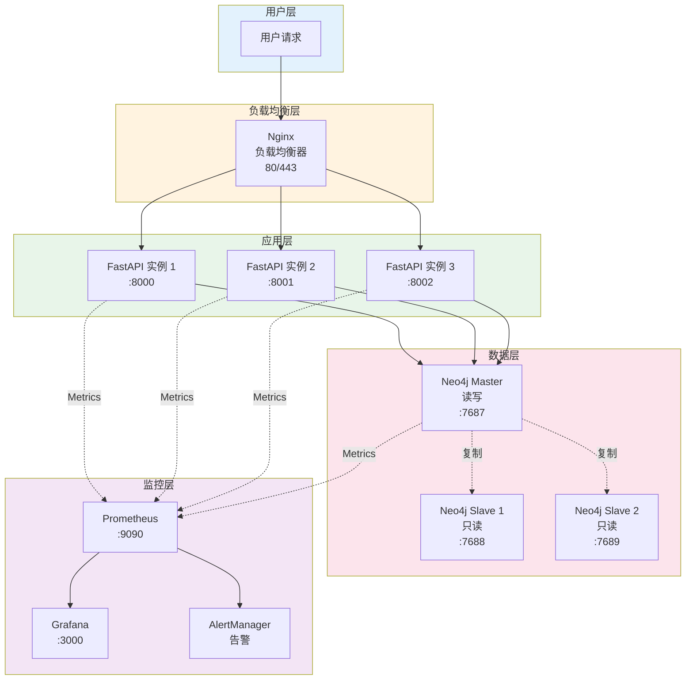

# 生产环境部署

---

## 📋 元信息

- **目标读者**：运维工程师、架构师、DevOps 工程师
- **阅读时间**：50分钟
- **难度**：⭐⭐⭐
- **前置知识**：Linux 系统管理、Docker、Nginx、CI/CD 基础
- **最后更新**：2026-01-04

---

## 📖 本文大纲

- [生产环境架构](#生产环境架构)
- [高可用配置](#高可用配置)
- [安全加固](#安全加固)
- [性能优化](#性能优化)
- [监控告警](#监控告警)
- [日志管理](#日志管理)
- [CI/CD 流程](#cicd-流程)
- [灾难恢复](#灾难恢复)
- [运维检查清单](#运维检查清单)
- [相关文档](#相关文档)

---

## 生产环境架构

### 架构选型对比

| 架构类型 | 适用场景 | 可用性 | 成本 | 复杂度 |
|----------|----------|--------|------|--------|
| **单机部署** | 开发/测试环境 | 低 | 低 | 低 |
| **主从复制** | 中小型生产 | 中 | 中 | 中 |
| **负载均衡** | 高并发场景 | 高 | 中高 | 中 |
| **集群部署** | 大型生产 | 非常高 | 高 | 高 |

### 推荐架构：负载均衡 + 主从复制



### 服务器配置建议

**负载均衡器**：
- CPU: 2核
- 内存: 4GB
- 磁盘: 20GB SSD
- 数量: 2台（主备）

**FastAPI 应用服务器**：
- CPU: 4核
- 内存: 8GB
- 磁盘: 50GB SSD
- 数量: 3台+（水平扩展）

**Neo4j 主节点**：
- CPU: 16核
- 内存: 64GB
- 磁盘: 500GB NVMe SSD
- 数量: 1台

**Neo4j 从节点**（Enterprise 版本）：
- CPU: 8核
- 内存: 32GB
- 磁盘: 500GB SSD
- 数量: 2台+

---

## 高可用配置

### 1. Nginx 负载均衡

**安装 Nginx**：

```bash
# Ubuntu/Debian
sudo apt-get update
sudo apt-get install nginx

# CentOS/RHEL
sudo yum install nginx
```

**配置文件**：`/etc/nginx/conf.d/graphrag.conf`

```nginx
# 上游服务器组
upstream graphrag_api {
    # 负载均衡策略：
    # - 默认：轮询（round-robin）
    # - ip_hash：相同 IP 到同一服务器（会话保持）
    # - least_conn：最少连接数
    ip_hash;

    # 应用服务器列表
    server 10.0.1.11:8000 weight=1 max_fails=3 fail_timeout=30s;
    server 10.0.1.12:8000 weight=1 max_fails=3 fail_timeout=30s;
    server 10.0.1.13:8000 weight=1 max_fails=3 fail_timeout=30s;

    # 健康检查（需要 nginx-plus 或 openresty）
    # check interval=3000 rise=2 fall=5 timeout=1000 type=http;
    # check_http_send "GET /health HTTP/1.0\r\n\r\n";
    # check_http_expect_alive http_2xx http_3xx;
}

# HTTP 服务器（重定向到 HTTPS）
server {
    listen 80;
    server_name graphrag.example.com;

    # 强制 HTTPS
    return 301 https://$server_name$request_uri;
}

# HTTPS 服务器
server {
    listen 443 ssl http2;
    server_name graphrag.example.com;

    # SSL 证书
    ssl_certificate /etc/nginx/ssl/graphrag.crt;
    ssl_certificate_key /etc/nginx/ssl/graphrag.key;

    # SSL 配置
    ssl_protocols TLSv1.2 TLSv1.3;
    ssl_ciphers 'ECDHE-ECDSA-AES128-GCM-SHA256:ECDHE-RSA-AES128-GCM-SHA256';
    ssl_prefer_server_ciphers on;
    ssl_session_cache shared:SSL:10m;
    ssl_session_timeout 10m;

    # 安全头
    add_header Strict-Transport-Security "max-age=31536000; includeSubDomains" always;
    add_header X-Frame-Options "SAMEORIGIN" always;
    add_header X-Content-Type-Options "nosniff" always;
    add_header X-XSS-Protection "1; mode=block" always;

    # 日志
    access_log /var/log/nginx/graphrag-access.log;
    error_log /var/log/nginx/graphrag-error.log;

    # API 代理
    location /api/ {
        proxy_pass http://graphrag_api/;

        # 代理头设置
        proxy_set_header Host $host;
        proxy_set_header X-Real-IP $remote_addr;
        proxy_set_header X-Forwarded-For $proxy_add_x_forwarded_for;
        proxy_set_header X-Forwarded-Proto $scheme;

        # 超时设置
        proxy_connect_timeout 60s;
        proxy_send_timeout 300s;
        proxy_read_timeout 300s;

        # WebSocket 支持（如果需要）
        proxy_http_version 1.1;
        proxy_set_header Upgrade $http_upgrade;
        proxy_set_header Connection "upgrade";
    }

    # 前端静态文件
    location / {
        root /var/www/graphrag-frontend;
        index index.html;
        try_files $uri $uri/ /index.html;
    }

    # 健康检查端点
    location /nginx-health {
        access_log off;
        return 200 "healthy\n";
        add_header Content-Type text/plain;
    }
}
```

**启动 Nginx**：

```bash
# 测试配置
sudo nginx -t

# 启动服务
sudo systemctl enable nginx
sudo systemctl start nginx

# 重载配置
sudo systemctl reload nginx
```

### 2. FastAPI 多实例部署

**使用 Systemd 管理**：

**服务文件**：`/etc/systemd/system/graphrag-api@.service`

```ini
[Unit]
Description=GraphRAG FastAPI Instance %i
After=network.target neo4j.service

[Service]
Type=simple
User=graphrag
Group=graphrag
WorkingDirectory=/opt/graphrag-agent

# 环境变量
Environment="SERVER_HOST=0.0.0.0"
Environment="SERVER_PORT=800%i"
Environment="SERVER_WORKERS=2"
Environment="GUNICORN_BIN=/opt/graphrag-agent/.venv/bin/gunicorn"
EnvironmentFile=/opt/graphrag-agent/.env

# 启动命令
ExecStart=/opt/graphrag-agent/scripts/prod.sh

# 重启策略
Restart=always
RestartSec=10

# 资源限制
LimitNOFILE=65535
MemoryMax=4G
CPUQuota=200%

[Install]
WantedBy=multi-user.target
```

**启动多个实例**：

```bash
# 启动 3 个实例（端口 8000, 8001, 8002）
sudo systemctl enable graphrag-api@0
sudo systemctl enable graphrag-api@1
sudo systemctl enable graphrag-api@2

sudo systemctl start graphrag-api@{0,1,2}

# 查看状态
sudo systemctl status graphrag-api@*
```

### 3. Neo4j 主从复制（Enterprise）

**注意**：Community 版本不支持主从复制，需要 Enterprise 版本。

**Master 节点配置**：

```properties
# neo4j.conf (Master)
dbms.mode=CORE

# 集群配置
causal_clustering.minimum_core_cluster_size_at_formation=3
causal_clustering.minimum_core_cluster_size_at_runtime=3

# 发现机制
causal_clustering.initial_discovery_members=\
    neo4j-master:5000,\
    neo4j-slave1:5000,\
    neo4j-slave2:5000

# 广播地址
causal_clustering.discovery_advertised_address=neo4j-master:5000
causal_clustering.transaction_advertised_address=neo4j-master:6000
causal_clustering.raft_advertised_address=neo4j-master:7000
```

**Slave 节点配置**：

```properties
# neo4j.conf (Slave)
dbms.mode=READ_REPLICA

# 集群配置
causal_clustering.initial_discovery_members=\
    neo4j-master:5000,\
    neo4j-slave1:5000,\
    neo4j-slave2:5000

# 广播地址
causal_clustering.discovery_advertised_address=neo4j-slave1:5000
causal_clustering.transaction_advertised_address=neo4j-slave1:6000
causal_clustering.raft_advertised_address=neo4j-slave1:7000
```

### 4. 健康检查与自动故障转移

**Keepalived 配置**（主备切换）：

```bash
# 安装
sudo apt-get install keepalived

# 配置文件：/etc/keepalived/keepalived.conf
vrrp_script check_nginx {
    script "/usr/local/bin/check_nginx.sh"
    interval 2
    weight -20
}

vrrp_instance VI_1 {
    state MASTER        # 主节点为 MASTER，备节点为 BACKUP
    interface eth0
    virtual_router_id 51
    priority 100        # 主节点优先级高于备节点
    advert_int 1

    authentication {
        auth_type PASS
        auth_pass 1234
    }

    virtual_ipaddress {
        192.168.1.100   # 虚拟 IP
    }

    track_script {
        check_nginx
    }
}
```

**健康检查脚本**：`/usr/local/bin/check_nginx.sh`

```bash
#!/bin/bash

# 检查 Nginx 进程
if ! pgrep nginx > /dev/null; then
    exit 1
fi

# 检查端口
if ! nc -z localhost 80; then
    exit 1
fi

# 检查健康端点
if ! curl -f -s http://localhost/nginx-health > /dev/null; then
    exit 1
fi

exit 0
```

---

## 安全加固

### 1. SSL/TLS 证书

**使用 Let's Encrypt 免费证书**：

```bash
# 安装 Certbot
sudo apt-get install certbot python3-certbot-nginx

# 获取证书
sudo certbot --nginx -d graphrag.example.com

# 自动续期
sudo systemctl enable certbot.timer
sudo systemctl start certbot.timer

# 手动续期测试
sudo certbot renew --dry-run
```

**自签名证书（测试环境）**：

```bash
# 生成证书
sudo openssl req -x509 -nodes -days 365 -newkey rsa:2048 \
    -keyout /etc/nginx/ssl/graphrag.key \
    -out /etc/nginx/ssl/graphrag.crt \
    -subj "/C=CN/ST=Shanghai/L=Shanghai/O=YourOrg/OU=IT/CN=graphrag.example.com"
```

### 2. 防火墙配置

**UFW (Ubuntu)**：

```bash
# 启用防火墙
sudo ufw enable

# 允许 SSH
sudo ufw allow 22/tcp

# 允许 HTTP/HTTPS
sudo ufw allow 80/tcp
sudo ufw allow 443/tcp

# 仅允许内网访问 Neo4j
sudo ufw allow from 10.0.0.0/8 to any port 7687

# 拒绝其他所有入站流量
sudo ufw default deny incoming
sudo ufw default allow outgoing

# 查看规则
sudo ufw status
```

**iptables**：

```bash
# 清空规则
sudo iptables -F

# 允许本地回环
sudo iptables -A INPUT -i lo -j ACCEPT

# 允许已建立的连接
sudo iptables -A INPUT -m state --state ESTABLISHED,RELATED -j ACCEPT

# 允许 SSH
sudo iptables -A INPUT -p tcp --dport 22 -j ACCEPT

# 允许 HTTP/HTTPS
sudo iptables -A INPUT -p tcp --dport 80 -j ACCEPT
sudo iptables -A INPUT -p tcp --dport 443 -j ACCEPT

# 默认拒绝
sudo iptables -P INPUT DROP
sudo iptables -P FORWARD DROP
sudo iptables -P OUTPUT ACCEPT

# 保存规则
sudo iptables-save > /etc/iptables/rules.v4
```

### 3. API 认证

**JWT 认证实现**：

```python
# backend/server/auth/jwt_auth.py

from fastapi import Depends, HTTPException, status
from fastapi.security import HTTPBearer, HTTPAuthorizationCredentials
from jose import JWTError, jwt
from datetime import datetime, timedelta

SECRET_KEY = "your-secret-key-change-in-production"
ALGORITHM = "HS256"
ACCESS_TOKEN_EXPIRE_MINUTES = 30

security = HTTPBearer()

def create_access_token(data: dict):
    """创建 JWT token"""
    to_encode = data.copy()
    expire = datetime.utcnow() + timedelta(minutes=ACCESS_TOKEN_EXPIRE_MINUTES)
    to_encode.update({"exp": expire})
    encoded_jwt = jwt.encode(to_encode, SECRET_KEY, algorithm=ALGORITHM)
    return encoded_jwt

def verify_token(credentials: HTTPAuthorizationCredentials = Depends(security)):
    """验证 JWT token"""
    token = credentials.credentials

    try:
        payload = jwt.decode(token, SECRET_KEY, algorithms=[ALGORITHM])
        username: str = payload.get("sub")
        if username is None:
            raise HTTPException(
                status_code=status.HTTP_401_UNAUTHORIZED,
                detail="Invalid authentication credentials"
            )
        return username
    except JWTError:
        raise HTTPException(
            status_code=status.HTTP_401_UNAUTHORIZED,
            detail="Invalid authentication credentials"
        )

# 使用示例
from fastapi import APIRouter

router = APIRouter()

@router.post("/login")
def login(username: str, password: str):
    """登录获取 token"""
    # 验证用户名密码（这里简化处理）
    if username == "admin" and password == "password":
        access_token = create_access_token(data={"sub": username})
        return {"access_token": access_token, "token_type": "bearer"}

    raise HTTPException(status_code=400, detail="Incorrect username or password")

@router.get("/protected")
def protected_route(username: str = Depends(verify_token)):
    """受保护的路由"""
    return {"message": f"Hello {username}, you have access!"}
```

### 4. 环境变量安全

**使用 Vault 管理密钥**：

```bash
# 安装 Vault
wget https://releases.hashicorp.com/vault/1.15.0/vault_1.15.0_linux_amd64.zip
unzip vault_1.15.0_linux_amd64.zip
sudo mv vault /usr/local/bin/

# 启动 Vault
vault server -dev

# 设置密钥
export VAULT_ADDR='http://127.0.0.1:8200'
vault kv put secret/graphrag \
    openai_api_key="sk-xxx" \
    neo4j_password="password"

# 读取密钥
vault kv get -field=openai_api_key secret/graphrag
```

**Python 集成**：

```python
import hvac

# 连接 Vault
client = hvac.Client(url='http://127.0.0.1:8200', token='dev-token')

# 读取密钥
secret = client.secrets.kv.v2.read_secret_version(path='graphrag')
openai_key = secret['data']['data']['openai_api_key']
neo4j_password = secret['data']['data']['neo4j_password']
```

---

## 性能优化

### 1. 操作系统调优

**内核参数优化**：`/etc/sysctl.conf`

```bash
# 网络优化
net.core.somaxconn = 4096
net.ipv4.tcp_max_syn_backlog = 4096
net.ipv4.tcp_fin_timeout = 30
net.ipv4.tcp_keepalive_time = 300
net.ipv4.tcp_tw_reuse = 1

# 文件描述符限制
fs.file-max = 2097152
fs.nr_open = 2097152

# 内存优化
vm.swappiness = 10
vm.dirty_ratio = 60
vm.dirty_background_ratio = 2

# 应用生效
sudo sysctl -p
```

**文件描述符限制**：`/etc/security/limits.conf`

```bash
*  soft  nofile  65535
*  hard  nofile  65535
*  soft  nproc   65535
*  hard  nproc   65535
```

### 2. FastAPI 优化

**使用 Gunicorn + Uvicorn Workers**：

```bash
# 安装
pip install gunicorn

# 启动
bash scripts/prod.sh \
    --workers 4 \
    --bind 0.0.0.0:8000 \
    --max-requests 1000 \
    --max-requests-jitter 100
```

**配置文件**：`gunicorn.conf.py`

```python
import multiprocessing

# 绑定地址
bind = "0.0.0.0:8000"

# Worker 配置
workers = multiprocessing.cpu_count() * 2 + 1
worker_class = "uvicorn.workers.UvicornWorker"
worker_connections = 1000
max_requests = 1000
max_requests_jitter = 100

# 超时
timeout = 300
keepalive = 5

# 日志
accesslog = "/var/log/graphrag/access.log"
errorlog = "/var/log/graphrag/error.log"
loglevel = "info"

# 进程命名
proc_name = "graphrag-api"

# 守护进程
daemon = False
```

### 3. 缓存优化

**Redis 缓存集成**：

```python
# 安装
pip install redis

# 配置
import redis
from functools import wraps

redis_client = redis.Redis(
    host='localhost',
    port=6379,
    db=0,
    decode_responses=True
)

def cache_result(ttl: int = 3600):
    """缓存装饰器"""
    def decorator(func):
        @wraps(func)
        def wrapper(*args, **kwargs):
            # 生成缓存键
            cache_key = f"{func.__name__}:{str(args)}:{str(kwargs)}"

            # 检查缓存
            cached = redis_client.get(cache_key)
            if cached:
                return json.loads(cached)

            # 执行函数
            result = func(*args, **kwargs)

            # 写入缓存
            redis_client.setex(
                cache_key,
                ttl,
                json.dumps(result)
            )

            return result

        return wrapper
    return decorator

# 使用
@cache_result(ttl=1800)
def get_entity_info(entity_id: str):
    # 查询数据库
    pass
```

---

## 监控告警

### 1. Prometheus + Grafana 部署

**docker-compose.yaml**：

```yaml
version: "3.8"

services:
  prometheus:
    image: prom/prometheus:latest
    container_name: prometheus
    ports:
      - "9090:9090"
    volumes:
      - ./monitoring/prometheus.yml:/etc/prometheus/prometheus.yml
      - prometheus_data:/prometheus
    command:
      - '--config.file=/etc/prometheus/prometheus.yml'
      - '--storage.tsdb.path=/prometheus'
      - '--storage.tsdb.retention.time=30d'
    restart: unless-stopped

  grafana:
    image: grafana/grafana:latest
    container_name: grafana
    ports:
      - "3000:3000"
    environment:
      - GF_SECURITY_ADMIN_USER=admin
      - GF_SECURITY_ADMIN_PASSWORD=admin
      - GF_INSTALL_PLUGINS=
    volumes:
      - grafana_data:/var/lib/grafana
      - ./monitoring/grafana/dashboards:/etc/grafana/provisioning/dashboards
      - ./monitoring/grafana/datasources:/etc/grafana/provisioning/datasources
    restart: unless-stopped

  alertmanager:
    image: prom/alertmanager:latest
    container_name: alertmanager
    ports:
      - "9093:9093"
    volumes:
      - ./monitoring/alertmanager.yml:/etc/alertmanager/alertmanager.yml
    command:
      - '--config.file=/etc/alertmanager/alertmanager.yml'
    restart: unless-stopped

volumes:
  prometheus_data:
  grafana_data:
```

**Prometheus 配置**：`monitoring/prometheus.yml`

```yaml
global:
  scrape_interval: 15s
  evaluation_interval: 15s

# 告警规则
rule_files:
  - 'alerts/*.yml'

# 抓取配置
scrape_configs:
  # FastAPI 应用
  - job_name: 'graphrag-api'
    static_configs:
      - targets:
          - '10.0.1.11:8000'
          - '10.0.1.12:8000'
          - '10.0.1.13:8000'
    metrics_path: '/metrics'

  # Neo4j
  - job_name: 'neo4j'
    static_configs:
      - targets: ['10.0.1.20:2004']

  # Nginx
  - job_name: 'nginx'
    static_configs:
      - targets: ['10.0.1.10:9113']

  # Node Exporter（系统指标）
  - job_name: 'node'
    static_configs:
      - targets:
          - '10.0.1.11:9100'
          - '10.0.1.12:9100'
          - '10.0.1.13:9100'

# AlertManager 配置
alerting:
  alertmanagers:
    - static_configs:
        - targets: ['alertmanager:9093']
```

### 2. 告警规则

**告警配置**：`monitoring/alerts/graphrag.yml`

```yaml
groups:
  - name: graphrag_alerts
    interval: 30s
    rules:
      # API 可用性告警
      - alert: APIDown
        expr: up{job="graphrag-api"} == 0
        for: 1m
        labels:
          severity: critical
        annotations:
          summary: "GraphRAG API 实例宕机"
          description: "{{ $labels.instance }} 已宕机超过 1 分钟"

      # 高延迟告警
      - alert: HighLatency
        expr: histogram_quantile(0.95, rate(http_request_duration_seconds_bucket[5m])) > 5
        for: 5m
        labels:
          severity: warning
        annotations:
          summary: "API 响应延迟过高"
          description: "P95 延迟超过 5 秒"

      # 高错误率告警
      - alert: HighErrorRate
        expr: rate(http_requests_total{status=~"5.."}[5m]) > 0.05
        for: 5m
        labels:
          severity: critical
        annotations:
          summary: "API 错误率过高"
          description: "5xx 错误率超过 5%"

      # Neo4j 连接失败
      - alert: Neo4jDown
        expr: up{job="neo4j"} == 0
        for: 1m
        labels:
          severity: critical
        annotations:
          summary: "Neo4j 数据库宕机"
          description: "Neo4j 不可用"

      # 内存使用告警
      - alert: HighMemoryUsage
        expr: (node_memory_MemTotal_bytes - node_memory_MemAvailable_bytes) / node_memory_MemTotal_bytes > 0.9
        for: 5m
        labels:
          severity: warning
        annotations:
          summary: "服务器内存使用率过高"
          description: "{{ $labels.instance }} 内存使用率超过 90%"

      # 磁盘空间告警
      - alert: LowDiskSpace
        expr: (node_filesystem_avail_bytes{mountpoint="/"} / node_filesystem_size_bytes{mountpoint="/"}) < 0.1
        for: 5m
        labels:
          severity: warning
        annotations:
          summary: "磁盘空间不足"
          description: "{{ $labels.instance }} 剩余磁盘空间小于 10%"
```

### 3. AlertManager 配置

**alertmanager.yml**：

```yaml
global:
  resolve_timeout: 5m

# 路由规则
route:
  group_by: ['alertname', 'cluster', 'service']
  group_wait: 10s
  group_interval: 10s
  repeat_interval: 12h
  receiver: 'default'

  routes:
    - match:
        severity: critical
      receiver: 'critical'
      continue: true

    - match:
        severity: warning
      receiver: 'warning'

# 接收器
receivers:
  - name: 'default'
    webhook_configs:
      - url: 'http://localhost:5001/alert'

  - name: 'critical'
    email_configs:
      - to: 'ops@example.com'
        from: 'alertmanager@example.com'
        smarthost: 'smtp.example.com:587'
        auth_username: 'alertmanager@example.com'
        auth_password: 'password'
        headers:
          Subject: '[CRITICAL] GraphRAG Alert'

  - name: 'warning'
    webhook_configs:
      - url: 'https://hooks.slack.com/services/YOUR/SLACK/WEBHOOK'

# 抑制规则
inhibit_rules:
  - source_match:
      severity: 'critical'
    target_match:
      severity: 'warning'
    equal: ['alertname', 'instance']
```

---

## 日志管理

### 1. 集中式日志收集（ELK）

**Filebeat 配置**：`filebeat.yml`

```yaml
filebeat.inputs:
  # FastAPI 日志
  - type: log
    enabled: true
    paths:
      - /var/log/graphrag/access.log
      - /var/log/graphrag/error.log
    fields:
      service: graphrag-api
      environment: production

  # Neo4j 日志
  - type: log
    enabled: true
    paths:
      - /var/lib/neo4j/logs/neo4j.log
      - /var/lib/neo4j/logs/query.log
    fields:
      service: neo4j
      environment: production

  # Nginx 日志
  - type: log
    enabled: true
    paths:
      - /var/log/nginx/access.log
      - /var/log/nginx/error.log
    fields:
      service: nginx
      environment: production

# 输出到 Elasticsearch
output.elasticsearch:
  hosts: ["elasticsearch:9200"]
  index: "graphrag-logs-%{+yyyy.MM.dd}"

# 或输出到 Logstash
#output.logstash:
#  hosts: ["logstash:5044"]
```

### 2. 日志轮转

**logrotate 配置**：`/etc/logrotate.d/graphrag`

```bash
/var/log/graphrag/*.log {
    daily                   # 每天轮转
    rotate 30               # 保留 30 天
    compress                # 压缩旧日志
    delaycompress           # 延迟压缩
    missingok               # 文件丢失不报错
    notifempty              # 空文件不轮转
    create 0644 graphrag graphrag  # 新文件权限

    postrotate
        # 重新加载服务
        systemctl reload graphrag-api || true
    endscript
}
```

---

## CI/CD 流程

### GitLab CI/CD 配置

**.gitlab-ci.yml**：

```yaml
stages:
  - test
  - build
  - deploy

variables:
  DOCKER_DRIVER: overlay2
  DOCKER_TLS_CERTDIR: "/certs"

# 测试阶段
test:
  stage: test
  image: python:3.10
  before_script:
    - pip install -r requirements.txt
  script:
    - pytest tests/ -v
    - pylint backend/graphrag_agent/
  only:
    - branches

# 构建镜像
build:
  stage: build
  image: docker:latest
  services:
    - docker:dind
  before_script:
    - docker login -u $CI_REGISTRY_USER -p $CI_REGISTRY_PASSWORD $CI_REGISTRY
  script:
    # 构建后端镜像
    - docker build -t $CI_REGISTRY_IMAGE/backend:$CI_COMMIT_SHORT_SHA -f Dockerfile.backend .
    - docker push $CI_REGISTRY_IMAGE/backend:$CI_COMMIT_SHORT_SHA

    # 构建前端镜像
    - docker build -t $CI_REGISTRY_IMAGE/frontend:$CI_COMMIT_SHORT_SHA -f Dockerfile.frontend .
    - docker push $CI_REGISTRY_IMAGE/frontend:$CI_COMMIT_SHORT_SHA

    # 打 latest 标签
    - docker tag $CI_REGISTRY_IMAGE/backend:$CI_COMMIT_SHORT_SHA $CI_REGISTRY_IMAGE/backend:latest
    - docker push $CI_REGISTRY_IMAGE/backend:latest
  only:
    - master
    - tags

# 部署到测试环境
deploy_staging:
  stage: deploy
  image: alpine:latest
  before_script:
    - apk add --no-cache openssh-client
    - eval $(ssh-agent -s)
    - echo "$SSH_PRIVATE_KEY" | tr -d '\r' | ssh-add -
    - mkdir -p ~/.ssh
    - chmod 700 ~/.ssh
  script:
    - ssh -o StrictHostKeyChecking=no deploy@staging-server "
        cd /opt/graphrag-agent &&
        docker-compose pull &&
        docker-compose up -d &&
        docker-compose ps"
  environment:
    name: staging
    url: https://staging.graphrag.example.com
  only:
    - master

# 部署到生产环境（手动触发）
deploy_production:
  stage: deploy
  image: alpine:latest
  before_script:
    - apk add --no-cache openssh-client
    - eval $(ssh-agent -s)
    - echo "$SSH_PRIVATE_KEY" | tr -d '\r' | ssh-add -
  script:
    - ssh deploy@prod-server "
        cd /opt/graphrag-agent &&
        docker-compose pull &&
        docker-compose up -d --no-deps --build &&
        docker-compose ps"
  environment:
    name: production
    url: https://graphrag.example.com
  when: manual
  only:
    - tags
```

---

## 灾难恢复

### 备份策略

**自动备份脚本**：`/usr/local/bin/backup-graphrag.sh`

```bash
#!/bin/bash

# 配置
BACKUP_DIR="/backup/graphrag"
DATE=$(date +%Y%m%d_%H%M%S)
RETENTION_DAYS=30

# 创建备份目录
mkdir -p ${BACKUP_DIR}/${DATE}

# 1. 备份 Neo4j 数据库
docker exec neo4j neo4j-admin database dump neo4j \
    --to-path=/backups/neo4j-${DATE}.dump

# 2. 备份配置文件
tar czf ${BACKUP_DIR}/${DATE}/config.tar.gz \
    /opt/graphrag-agent/.env \
    /etc/nginx/conf.d/graphrag.conf \
    /etc/neo4j/neo4j.conf

# 3. 备份应用代码
tar czf ${BACKUP_DIR}/${DATE}/code.tar.gz \
    /opt/graphrag-agent

# 4. 上传到远程存储（可选）
# aws s3 sync ${BACKUP_DIR}/${DATE} s3://backup-bucket/graphrag/${DATE}/

# 5. 清理旧备份
find ${BACKUP_DIR} -type d -mtime +${RETENTION_DAYS} -exec rm -rf {} +

echo "备份完成: ${DATE}"
```

**定时任务**：

```bash
# 每天凌晨 2 点备份
0 2 * * * /usr/local/bin/backup-graphrag.sh >> /var/log/graphrag-backup.log 2>&1
```

---

## 运维检查清单

### 日常检查（每天）

- [ ] 检查所有服务状态
- [ ] 查看错误日志
- [ ] 检查磁盘空间
- [ ] 查看监控面板
- [ ] 确认备份成功

### 周度检查（每周）

- [ ] 审查慢查询日志
- [ ] 分析性能趋势
- [ ] 检查证书过期时间
- [ ] 更新安全补丁
- [ ] 测试备份恢复

### 月度检查（每月）

- [ ] 容量规划评估
- [ ] 安全审计
- [ ] 性能优化调整
- [ ] 文档更新
- [ ] 灾难恢复演练

---

## 相关文档

- [Docker 部署](./Docker部署.md) - Docker 容器部署
- [Neo4j 配置](./Neo4j配置.md) - Neo4j 详细配置
- [性能调优](../02-核心机制/04-深入理解/性能调优.md) - 深度性能优化

---

## 更新日志

| 版本 | 日期 | 更新内容 | 作者 |
|------|------|----------|------|
| 1.0 | 2026-01-04 | 初始版本，完整生产环境部署指南 | Claude |
| - | - | - | - |
