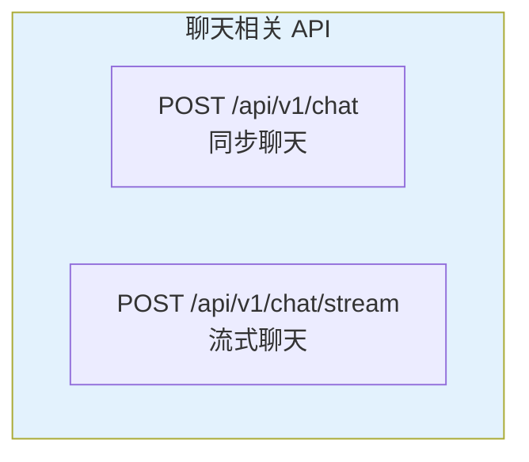

# API 使用指南

---

## 📋 元信息

- **目标读者**：后端开发者、API 集成者
- **阅读时间**：50分钟
- **难度**：⭐⭐
- **前置知识**：HTTP 协议、RESTful API、JSON 格式
- **最后更新**：2026-01-04

---

## 📖 本文大纲

- [API 概览](#api-概览)
- [认证与鉴权](#认证与鉴权)
- [聊天接口](#聊天接口)
- [错误处理](#错误处理)
- [最佳实践](#最佳实践)
- [SDK 示例](#sdk-示例)
- [相关文档](#相关文档)

---

## API 概览

### 基础信息

**Base URL**: `http://localhost:8000`

**协议**: HTTP/HTTPS

**数据格式**: JSON

**响应格式**: JSON

**文档地址**:
- Swagger UI: `http://localhost:8000/docs`
- ReDoc: `http://localhost:8000/redoc`

### 端点总览



### 快速开始

```python
import requests

# 基础配置
API_URL = "http://localhost:8000"
SESSION_ID = "user_12345"

# 发送聊天请求
response = requests.post(
    f"{API_URL}/api/v1/chat",
    json={
        "message": "国家奖学金的申请条件是什么？",
        "session_id": SESSION_ID,
        "debug": False,
        "agent_type": "hybrid_agent"
    }
)

# 解析响应
result = response.json()
print(result["answer"])
```

---

## 认证与鉴权

### 当前版本

**当前状态**: 无需认证（开发版本）

**说明**: 当前 API 处于开发测试阶段，未启用认证机制。

### 生产环境建议

**推荐方案**: JWT (JSON Web Token) 认证

**实现步骤**：

1. **登录获取 Token**:
```python
# POST /auth/login
response = requests.post(
    f"{API_URL}/auth/login",
    json={
        "username": "admin",
        "password": "your_password"
    }
)

token = response.json()["access_token"]
```

2. **携带 Token 调用 API**:
```python
headers = {
    "Authorization": f"Bearer {token}"
}

response = requests.post(
    f"{API_URL}/api/v1/chat",
    headers=headers,
    json={...}
)
```

**Token 配置**（见生产环境部署文档）:
- 有效期: 30 分钟（可配置）
- 刷新机制: Refresh Token
- 加密算法: HS256

---

## 聊天接口

### 1. 同步聊天

**端点**: `POST /api/v1/chat`

**描述**: 发送聊天消息，等待完整响应

**请求参数**:

| 参数 | 类型 | 必填 | 默认值 | 说明 |
|------|------|------|--------|------|
| `message` | string | ✅ | - | 用户消息 |
| `session_id` | string | ✅ | - | 会话ID（用于区分用户） |
| `debug` | boolean | ❌ | `false` | 是否返回调试信息 |
| `agent_type` | string | ❌ | `"naive_rag_agent"` | Agent 类型 |
| `use_deeper_tool` | boolean | ❌ | `true` | 使用增强版工具（仅 deep_research_agent） |
| `show_thinking` | boolean | ❌ | `false` | 显示思考过程（仅 deep_research_agent） |

**Agent 类型**:
- `naive_rag_agent`: 朴素 RAG（向量检索）
- `graph_agent`: 图谱检索
- `hybrid_agent`: 混合检索（推荐）
- `deep_research_agent`: 深度研究
- `fusion_agent`: 融合式图谱 Agent

**请求示例**:

```http
POST /api/v1/chat HTTP/1.1
Host: localhost:8000
Content-Type: backend/application/json

{
  "message": "国家奖学金的申请条件是什么？",
  "session_id": "user_12345",
  "debug": false,
  "agent_type": "hybrid_agent"
}
```

**Python 示例**:

```python
import requests

response = requests.post(
    "http://localhost:8000/api/v1/chat",
    json={
        "message": "国家奖学金的申请条件是什么？",
        "session_id": "user_12345",
        "debug": False,
        "agent_type": "hybrid_agent"
    }
)

result = response.json()
print(f"答案: {result['answer']}")
```

**响应格式**:

```json
{
  "answer": "根据知识图谱，国家奖学金的申请条件包括：\n1. 学习成绩优异，排名年级前10%\n2. 思想品德良好，无违纪记录\n3. 积极参与社会实践活动",
  "execution_log": null,
  "kg_data": null,
  "reference": null,
  "iterations": null,
  "raw_thinking": null,
  "execution_logs": null
}
```

**响应字段说明**:

| 字段 | 类型 | 说明 |
|------|------|------|
| `answer` | string | 生成的答案 |
| `execution_log` | array | 执行日志（debug=true 时） |
| `kg_data` | object | 知识图谱数据（debug=true 时） |
| `reference` | object | 引用信息 |
| `iterations` | array | 迭代记录（deep_research_agent） |
| `raw_thinking` | string | 原始思考过程（show_thinking=true） |
| `execution_logs` | array | 完整执行日志 |

**调试模式响应**:

```json
{
  "answer": "...",
  "execution_log": [
    {
      "step": "向量检索",
      "duration": 0.15,
      "result": {
        "entities": ["国家奖学金", "申请条件"],
        "similarity": [0.92, 0.87]
      }
    },
    {
      "step": "图遍历",
      "duration": 0.35,
      "result": {
        "nodes": 8,
        "relationships": 15
      }
    }
  ],
  "kg_data": {
    "nodes": [...],
    "edges": [...]
  }
}
```

### 2. 流式聊天

**端点**: `POST /api/v1/chat/stream`

**描述**: 发送聊天消息，以 Server-Sent Events (SSE) 方式实时返回结果

**请求参数**: 与同步聊天相同

**请求示例**:

```python
import requests
import json

response = requests.post(
    "http://localhost:8000/api/v1/chat/stream",
    json={
        "message": "国家奖学金的申请条件是什么？",
        "session_id": "user_12345",
        "debug": False,
        "agent_type": "hybrid_agent"
    },
    stream=True
)

# 处理流式响应
for line in response.iter_lines():
    if line:
        # 解析 SSE 格式
        if line.startswith(b"data: "):
            data = json.loads(line[6:])

            if data["status"] == "start":
                print("开始生成...")
            elif data["status"] == "token":
                print(data["content"], end="", flush=True)
            elif data["status"] == "done":
                print("\n完成!")
            elif data["status"] == "error":
                print(f"错误: {data['message']}")
```

**SSE 事件类型**:

| 状态 | 说明 | 数据格式 |
|------|------|----------|
| `start` | 开始生成 | `{"status": "start"}` |
| `token` | 生成的文本片段 | `{"status": "token", "content": "文本"}` |
| `execution_log` | 执行日志（debug） | `{"status": "execution_log", "content": {...}}` |
| `done` | 生成完成 | `{"status": "done"}` |
| `error` | 发生错误 | `{"status": "error", "message": "错误信息"}` |

**完整示例**:

```python
def chat_stream(message: str, session_id: str, agent_type: str = "hybrid_agent"):
    """流式聊天示例"""
    response = requests.post(
        "http://localhost:8000/api/v1/chat/stream",
        json={
            "message": message,
            "session_id": session_id,
            "agent_type": agent_type,
            "debug": False
        },
        stream=True
    )

    full_answer = ""

    for line in response.iter_lines():
        if line and line.startswith(b"data: "):
            data = json.loads(line[6:])

            if data["status"] == "token":
                chunk = data["content"]
                full_answer += chunk
                print(chunk, end="", flush=True)
            elif data["status"] == "done":
                break

    print()  # 换行
    return full_answer

# 使用
answer = chat_stream(
    "国家奖学金的申请条件是什么？",
    "user_12345",
    "hybrid_agent"
)
```

---

## 其他接口

### 会话与反馈

- `POST /api/v1/clear`：清空会话历史
- `POST /api/v1/feedback`：提交回答反馈

### 知识图谱

- `GET /api/v1/knowledge_graph`：全局图谱
- `GET /api/v1/knowledge_graph_from_message`：从文本提取图谱
- `POST /api/v1/kg_reasoning`：图谱推理
- `GET /api/v1/entity_types`、`GET /api/v1/relation_types`
- `POST /api/v1/entities/search`、`POST /api/v1/relations/search`
- `POST /api/v1/entity/create|update|delete`
- `POST /api/v1/relation/create|update|delete`

### 源内容

- `POST /api/v1/source`：单条源内容
- `POST /api/v1/source_info_batch`：批量文件信息
- `POST /api/v1/content_batch`：批量文本块内容
- `GET /api/v1/chunks`：分页获取 chunks

### 示例

```python
# 清空会话
requests.post(f"{API_URL}/api/v1/clear", json={"session_id": SESSION_ID})

# 获取全局图谱
requests.get(f"{API_URL}/api/v1/knowledge_graph", params={"limit": 100})

# 查询源内容
requests.post(f"{API_URL}/api/v1/source", json={"source_id": "chunk_001"})
```

## 错误处理

### HTTP 状态码

| 状态码 | 说明 | 处理方式 |
|--------|------|----------|
| 200 | 成功 | 正常处理响应 |
| 400 | 请求参数错误 | 检查请求参数格式 |
| 401 | 未授权 | 检查认证信息 |
| 404 | 资源不存在 | 检查请求路径 |
| 422 | 参数验证失败 | 检查参数类型和必填项 |
| 500 | 服务器内部错误 | 查看服务器日志 |
| 503 | 服务不可用 | 稍后重试 |

### 错误响应格式

```json
{
  "detail": "错误描述信息",
  "error_code": "ERROR_CODE",
  "timestamp": "2026-01-04T14:32:15Z"
}
```

### 常见错误及解决方案

**错误 1: 参数验证失败**

```json
{
  "detail": [
    {
      "loc": ["body", "message"],
      "msg": "field required",
      "type": "value_error.missing"
    }
  ]
}
```

**解决方案**: 确保所有必填参数都已提供

**错误 2: Agent 类型不存在**

```json
{
  "detail": "Unknown agent type: invalid_agent"
}
```

**解决方案**: 使用有效的 Agent 类型（见聊天接口说明）

**错误 3: 会话不存在**

```json
{
  "detail": "Session not found: unknown_session"
}
```

**解决方案**: 检查 session_id 是否正确

### Python 异常处理示例

```python
import requests
from requests.exceptions import RequestException

def chat_with_error_handling(message, session_id, agent_type="hybrid_agent"):
    """带错误处理的聊天函数"""
    try:
        response = requests.post(
            "http://localhost:8000/api/v1/chat",
            json={
                "message": message,
                "session_id": session_id,
                "agent_type": agent_type
            },
            timeout=60  # 设置超时
        )

        # 检查 HTTP 状态码
        response.raise_for_status()

        # 解析响应
        result = response.json()
        return result["answer"]

    except requests.exceptions.Timeout:
        print("请求超时，请稍后重试")
        return None

    except requests.exceptions.HTTPError as e:
        if e.response.status_code == 422:
            print(f"参数错误: {e.response.json()}")
        elif e.response.status_code == 500:
            print("服务器错误，请联系管理员")
        else:
            print(f"HTTP 错误: {e}")
        return None

    except RequestException as e:
        print(f"网络错误: {e}")
        return None

    except Exception as e:
        print(f"未知错误: {e}")
        return None

# 使用
answer = chat_with_error_handling(
    "国家奖学金的申请条件是什么？",
    "user_12345",
    "hybrid_agent"
)

if answer:
    print(answer)
```

---

## 最佳实践

### 1. 会话管理

**使用唯一的 session_id**:

```python
import uuid

# 为每个用户生成唯一 ID
user_id = str(uuid.uuid4())

# 在同一会话中使用相同 ID
for query in user_queries:
    chat(query, session_id=user_id)
```

### 2. 超时设置

**为不同 Agent 设置合适的超时**:

```python
TIMEOUT_CONFIG = {
    "naive_rag_agent": 10,       # 10秒
    "hybrid_agent": 30,          # 30秒
    "graph_agent": 30,           # 30秒
    "deep_research_agent": 120,  # 2分钟
    "fusion_agent": 60           # 1分钟
}

def chat(message, session_id, agent_type):
    timeout = TIMEOUT_CONFIG.get(agent_type, 30)

    response = requests.post(
        f"{API_URL}/api/v1/chat",
        json={...},
        timeout=timeout
    )
```

### 3. 重试机制

**实现指数退避重试**:

```python
import time

def chat_with_retry(message, session_id, max_retries=3):
    """带重试机制的聊天"""
    for attempt in range(max_retries):
        try:
            response = requests.post(
                f"{API_URL}/api/v1/chat",
                json={
                    "message": message,
                    "session_id": session_id
                },
                timeout=30
            )
            response.raise_for_status()
            return response.json()

        except requests.exceptions.RequestException as e:
            if attempt < max_retries - 1:
                # 指数退避: 1s, 2s, 4s
                wait_time = 2 ** attempt
                print(f"请求失败，{wait_time}秒后重试...")
                time.sleep(wait_time)
            else:
                print(f"重试{max_retries}次后仍失败")
                raise e
```

### 4. 批量请求优化

**使用连接池**:

```python
from requests.adapters import HTTPAdapter
from urllib3.util.retry import Retry

# 配置连接池
session = requests.Session()
adapter = HTTPAdapter(
    pool_connections=10,
    pool_maxsize=20,
    max_retries=Retry(total=3, backoff_factor=1)
)
session.mount("http://", adapter)
session.mount("https://", adapter)

# 复用 session
for query in queries:
    response = session.post(f"{API_URL}/api/v1/chat", json={...})
```

### 5. 日志记录

**记录 API 调用日志**:

```python
import logging

logging.basicConfig(
    level=logging.INFO,
    format='%(asctime)s - %(levelname)s - %(message)s'
)

def chat_with_logging(message, session_id):
    """带日志的聊天"""
    logging.info(f"发送请求: {message[:50]}...")

    start_time = time.time()

    response = requests.post(
        f"{API_URL}/api/v1/chat",
        json={
            "message": message,
            "session_id": session_id
        }
    )

    elapsed_time = time.time() - start_time

    logging.info(f"响应耗时: {elapsed_time:.2f}s")
    logging.info(f"状态码: {response.status_code}")

    return response.json()
```

---

## SDK 示例

### Python SDK 封装

```python
# graphrag_client.py

import requests
from typing import Optional, Dict, Any, Generator
import json

class GraphRAGClient:
    """GraphRAG API 客户端"""

    def __init__(self, base_url: str = "http://localhost:8000"):
        self.base_url = base_url
        self.session = requests.Session()

    def chat(
        self,
        message: str,
        session_id: str,
        agent_type: str = "hybrid_agent",
        debug: bool = False
    ) -> Dict[str, Any]:
        """同步聊天"""
        response = self.session.post(
            f"{self.base_url}/api/v1/chat",
            json={
                "message": message,
                "session_id": session_id,
                "agent_type": agent_type,
                "debug": debug
            }
        )
        response.raise_for_status()
        return response.json()

    def chat_stream(
        self,
        message: str,
        session_id: str,
        agent_type: str = "hybrid_agent",
        debug: bool = False
    ) -> Generator[str, None, None]:
        """流式聊天"""
        response = self.session.post(
            f"{self.base_url}/api/v1/chat/stream",
            json={
                "message": message,
                "session_id": session_id,
                "agent_type": agent_type,
                "debug": debug
            },
            stream=True
        )

        for line in response.iter_lines():
            if line and line.startswith(b"data: "):
                data = json.loads(line[6:])
                if data["status"] == "token":
                    yield data["content"]
                elif data["status"] == "done":
                    break

# 使用示例
client = GraphRAGClient()

# 同步聊天
result = client.chat(
    "国家奖学金的申请条件是什么？",
    session_id="user_12345",
    agent_type="hybrid_agent"
)
print(result["answer"])

# 流式聊天
for chunk in client.chat_stream(
    "国家奖学金的申请条件是什么？",
    session_id="user_12345"
):
    print(chunk, end="", flush=True)
print()
```

### JavaScript/TypeScript SDK

```typescript
// graphrag-client.ts

interface ChatRequest {
  message: string;
  session_id: string;
  agent_type?: string;
  debug?: boolean;
}

interface ChatResponse {
  answer: string;
  execution_log?: any[];
  kg_data?: any;
}

class GraphRAGClient {
  private baseUrl: string;

  constructor(baseUrl: string = "http://localhost:8000") {
    this.baseUrl = baseUrl;
  }

  async chat(request: ChatRequest): Promise<ChatResponse> {
    const response = await fetch(`${this.baseUrl}/api/v1/chat`, {
      method: "POST",
      headers: {
        "Content-Type": "backend/application/json",
      },
      body: JSON.stringify({
        message: request.message,
        session_id: request.session_id,
        agent_type: request.agent_type || "hybrid_agent",
        debug: request.debug || false,
      }),
    });

    if (!response.ok) {
      throw new Error(`HTTP error! status: ${response.status}`);
    }

    return await response.json();
  }

  async *chatStream(request: ChatRequest): AsyncGenerator<string> {
    const response = await fetch(`${this.baseUrl}/api/v1/chat/stream`, {
      method: "POST",
      headers: {
        "Content-Type": "backend/application/json",
      },
      body: JSON.stringify({
        message: request.message,
        session_id: request.session_id,
        agent_type: request.agent_type || "hybrid_agent",
        debug: request.debug || false,
      }),
    });

    const reader = response.body?.getReader();
    const decoder = new TextDecoder();

    if (!reader) return;

    while (true) {
      const { done, value } = await reader.read();
      if (done) break;

      const chunk = decoder.decode(value);
      const lines = chunk.split("\n");

      for (const line of lines) {
        if (line.startsWith("data: ")) {
          const data = JSON.parse(line.slice(6));
          if (data.status === "token") {
            yield data.content;
          } else if (data.status === "done") {
            return;
          }
        }
      }
    }
  }

}

// 使用示例
const client = new GraphRAGClient();

// 同步聊天
const result = await client.chat({
  message: "国家奖学金的申请条件是什么？",
  session_id: "user_12345",
  agent_type: "hybrid_agent",
});
console.log(result.answer);

// 流式聊天
for await (const chunk of client.chatStream({
  message: "国家奖学金的申请条件是什么？",
  session_id: "user_12345",
})) {
  process.stdout.write(chunk);
}
console.log();
```

---

## 相关文档

- [前端界面使用](./前端界面使用.md) - Streamlit 界面操作
- [调试模式](./调试模式.md) - 调试功能详解
- [生产环境部署](../03-部署指南/生产环境部署.md) - API 认证与安全
- [Agent 系统](../02-核心机制/02-核心子系统/Agent系统.md) - Agent 工作原理

---

## 更新日志

| 版本 | 日期 | 更新内容 | 作者 |
|------|------|----------|------|
| 1.0 | 2026-01-04 | 初始版本，完整 API 使用指南 | Claude |
| - | - | - | - |
