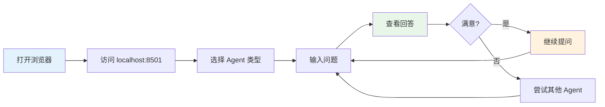
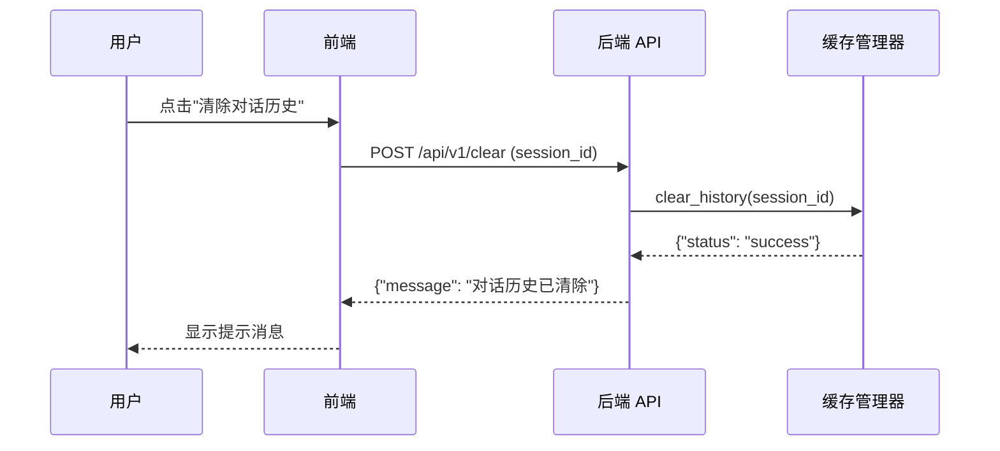
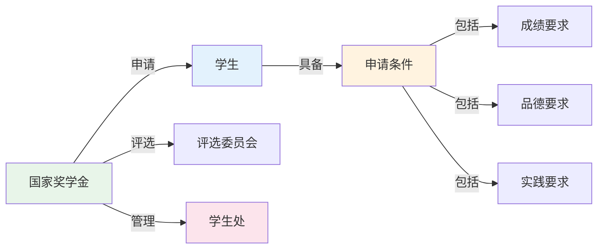
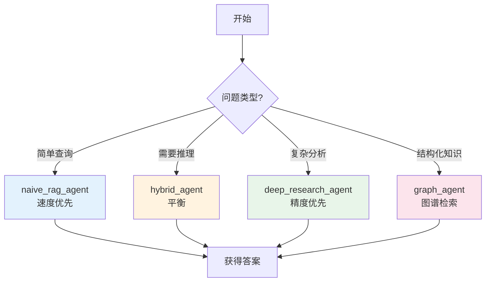

# 前端界面使用

---

## 📋 元信息

- **目标读者**：终端用户、项目使用者
- **阅读时间**：40分钟
- **难度**：⭐⭐
- **前置知识**：基本的 Web 浏览器使用
- **最后更新**：2026-01-04

---

## 📖 本文大纲

- [快速开始](#快速开始)
- [界面总览](#界面总览)
- [侧边栏功能](#侧边栏功能)
- [聊天界面](#聊天界面)
- [调试面板](#调试面板)
- [常见使用场景](#常见使用场景)
- [快捷键与技巧](#快捷键与技巧)
- [常见问题](#常见问题)
- [相关文档](#相关文档)

---

## 快速开始

### 启动前端服务

```bash
# 1. 确保后端服务已启动
bash scripts/dev.sh backend

# 2. 启动 Streamlit 前端（新终端）
streamlit run frontend/app.py

# 3. 浏览器自动打开（默认地址）
# http://localhost:8501
```

### 首次使用流程



---

## 界面总览

### 整体布局

```
┌─────────────────────────────────────────────────────────────────┐
│                         GraphRAG Chat Interface                  │
├──────────────┬──────────────────────────────────────────────────┤
│              │                                                    │
│   侧边栏     │              主聊天区域                             │
│              │                                                    │
│  ┌────────┐  │  ┌─────────────────────────────────────────────┐  │
│  │Agent   │  │  │  Q: 国家奖学金的申请条件是什么？              │  │
│  │选择    │  │  │  A: 根据知识图谱，国家奖学金的申请条件...    │  │
│  └────────┘  │  └─────────────────────────────────────────────┘  │
│              │                                                    │
│  ┌────────┐  │  ┌─────────────────────────────────────────────┐  │
│  │系统    │  │  │  [输入框]                         [发送]    │  │
│  │设置    │  │  └─────────────────────────────────────────────┘  │
│  └────────┘  │                                                    │
│              │                                                    │
│  ┌────────┐  │  （调试模式下，右侧显示调试面板）                   │
│  │示例    │  │                                                    │
│  │问题    │  │                                                    │
│  └────────┘  │                                                    │
│              │                                                    │
└──────────────┴──────────────────────────────────────────────────┘
```

### 调试模式布局

```
┌─────────────────────────────────────────────────────────────────┐
│                         GraphRAG Chat Interface                  │
├──────────────┬────────────────────────────┬───────────────────────┤
│   侧边栏     │      主聊天区域 (5列)       │   调试面板 (4列)       │
│              │                            │                       │
│  [Agent]     │  Q: 问题...                │ 📊 执行轨迹            │
│  [设置]      │  A: 回答...                │   - 向量检索          │
│  [示例]      │                            │   - 图遍历            │
│              │  [输入框]                  │   - LLM生成           │
│              │                            │                       │
│              │                            │ 🕸️ 知识图谱           │
│              │                            │   (可视化)            │
│              │                            │                       │
│              │                            │ 📄 源内容             │
│              │                            │   (Document/Chunk)    │
└──────────────┴────────────────────────────┴───────────────────────┘
```

---

## 侧边栏功能

### 1. Agent 选择

**位置**：侧边栏顶部

**可选类型**：

| Agent 类型 | 说明 | 适用场景 | 速度 | 精度 |
|-----------|------|---------|------|------|
| **graph_agent** | 知识图谱检索（局部+全局） | 需要结构化推理 | ⭐⭐⭐ | ⭐⭐⭐⭐ |
| **hybrid_agent** | 混合检索（向量+图谱） | 平衡速度与精度 | ⭐⭐⭐⭐ | ⭐⭐⭐⭐ |
| **naive_rag_agent** | 朴素 RAG（仅向量检索） | 快速简单查询 | ⭐⭐⭐⭐⭐ | ⭐⭐⭐ |
| **deep_research_agent** | 深度研究（多轮推理） | 复杂问题分析 | ⭐⭐ | ⭐⭐⭐⭐⭐ |
| **fusion_agent** | 融合式图谱 Agent | 综合性问题 | ⭐⭐⭐ | ⭐⭐⭐⭐⭐ |

**使用示例**：

```mermaid
graph TB
    User[用户] --> Question{问题类型?}

    Question -->|简单事实查询| Naive[naive_rag_agent<br/>"国家奖学金金额是多少?"]
    Question -->|需要推理| Hybrid[hybrid_agent<br/>"如何同时满足多个奖学金条件?"]
    Question -->|复杂分析| Deep[deep_research_agent<br/>"对比分析三种奖学金的异同"]
    Question -->|结构化知识| Graph[graph_agent<br/>"学生处管理哪些部门?"]
    Question -->|综合问题| Fusion[fusion_agent<br/>"制定完整的奖学金申请计划"]

    style Naive fill:#e3f2fd
    style Hybrid fill:#fff3e0
    style Deep fill:#e8f5e9
    style Graph fill:#fce4ec
    style Fusion fill:#f3e5f5
```

### 2. 系统设置

**调试模式**：

- **选项**：启用调试模式（复选框）
- **功能**：
  - ✅ 显示执行轨迹（每一步操作的详细记录）
  - ✅ 显示知识图谱可视化（实体关系网络）
  - ✅ 显示源内容（原始文档和文本块）
  - ✅ 显示性能监控（响应时间、Token 使用量）
- **注意**：启用调试模式后，自动禁用流式响应

**流式响应**：

- **选项**：使用流式响应（复选框）
- **功能**：
  - 实时显示生成的答案（逐字输出）
  - 减少等待时间，改善用户体验
- **限制**：调试模式下不可用

**Deep Research Agent 专属选项**：

- **显示推理过程**：展示 AI 的思考链路
- **使用增强版研究工具**：启用社区感知和知识图谱增强

### 3. 示例问题

**位置**：侧边栏中部

**功能**：
- 快速测试系统功能
- 了解系统能力范围
- 点击示例自动填入输入框（需配合前端实现）

**示例问题列表**（来自配置文件）：
```
- 国家奖学金的申请条件是什么？
- 旷课多少学时会被退学？
- 如何申请国家励志奖学金？
- 学生处的联系方式是什么？
- 违纪处分有哪些类型？
```

### 4. 清除对话历史

**按钮**：🗑️ 清除对话历史

**功能**：
- 清空当前会话的聊天记录
- 重置 Agent 状态
- 释放缓存内存

**操作流程**：



---

## 聊天界面

### 消息显示格式

**用户消息**：

```
┌─────────────────────────────────────────────┐
│ Q: 国家奖学金的申请条件是什么？              │
│                                             │
│ [时间戳] 2026-01-04 14:32:15                │
└─────────────────────────────────────────────┘
```

**AI 回答（非调试模式）**：

```
┌─────────────────────────────────────────────┐
│ A: 根据知识图谱中的信息，国家奖学金的申请   │
│ 条件包括：                                  │
│                                             │
│ 1. 学习成绩优异，排名年级前 10%             │
│ 2. 思想品德良好，无违纪记录                 │
│ 3. 积极参与社会实践活动                     │
│                                             │
│ [响应时间] 1.2s | [Token] 156               │
└─────────────────────────────────────────────┘
```

**AI 回答（调试模式）**：

```
┌─────────────────────────────────────────────┐
│ A: [答案内容...]                             │
│                                             │
│ 📊 执行信息：                                │
│   - 检索实体数: 8                           │
│   - 图遍历深度: 2                           │
│   - LLM 调用次数: 1                         │
│   - 响应时间: 1.2s                          │
│                                             │
│ 📄 引用来源:                                 │
│   - student_handbook.pdf (第3页)           │
│   - scholarship_rules.docx (第1-2页)       │
└─────────────────────────────────────────────┘
```

### 输入框功能

**位置**：聊天区域底部

**特性**：
- 多行文本输入（支持换行）
- 字数统计（可选）
- 发送按钮
- 快捷键：`Ctrl+Enter` 或 `Cmd+Enter` 发送

**输入示例**：

```python
# 简单问题
"国家奖学金的金额是多少？"

# 多条件查询
"我想了解：
1. 国家奖学金的申请条件
2. 评选流程
3. 发放时间"

# 对比分析
"对比国家奖学金和国家励志奖学金的区别"
```

---

## 调试面板

### 1. 执行轨迹 (Execution Trace)

**显示内容**：每一步操作的详细记录

**示例**：

```
📊 执行轨迹
════════════════════════════════════════════

步骤 1: 查询向量化
  - 输入: "国家奖学金的申请条件是什么？"
  - 向量维度: 1536
  - 耗时: 0.08s

步骤 2: 向量检索实体
  - 检索数量: 10
  - 相似度阈值: 0.75
  - 命中实体:
    * 国家奖学金 (相似度: 0.92)
    * 申请条件 (相似度: 0.87)
    * 评选标准 (相似度: 0.81)
  - 耗时: 0.15s

步骤 3: 图遍历扩展
  - 起始实体: 3个
  - 遍历深度: 2跳
  - 发现关系: 15条
  - 发现实体: 8个
  - 耗时: 0.35s

步骤 4: 社区检测
  - 检测到社区: 2个
  - 社区摘要: "奖学金评选体系"
  - 耗时: 0.12s

步骤 5: LLM 生成答案
  - 上下文 Token: 1200
  - 输出 Token: 156
  - 耗时: 0.65s

════════════════════════════════════════════
总耗时: 1.35s
```

### 2. 知识图谱可视化

**显示方式**：交互式网络图

**节点类型**：
- 🟢 实体（Entity）
- 🔵 文本块（Chunk）
- 🟡 社区（Community）

**边类型**：
- 实线：实体关系
- 虚线：引用关系

**交互功能**：
- 缩放：滚轮
- 拖动：鼠标左键
- 点击节点：显示详细信息
- 悬停：显示关系类型

**示例图谱**：



### 3. 源内容显示

**显示内容**：原始文档和文本块

**格式**：

```
📄 源内容
════════════════════════════════════════════

Document ID: doc_001
文件名: student_handbook.pdf
页码: 第3页
相关度: 0.92

─────────────────────────────────────────────

【原文】
国家奖学金是为了激励普通本科高校、高等职业学校和高等专科学校
学生勤奋学习、努力进取，在德、智、体、美等方面全面发展，由中
央政府出资设立的奖励特别优秀学生的奖学金。

国家奖学金的奖励标准为每人每年8000元。

申请条件：
1. 学习成绩优异，排名年级前10%
2. 思想品德良好，无违纪记录
3. 积极参与社会实践活动

─────────────────────────────────────────────

Chunk ID: doc_001_chunk_5
Chunk 索引: 5/42
Token 数: 185
```

---

## 常见使用场景

### 场景 1: 快速问答

**目标**：获取简单事实信息

**推荐配置**：
- Agent: `naive_rag_agent`
- 调试模式: ❌ 关闭
- 流式响应: ✅ 开启

**操作步骤**：
1. 选择 `naive_rag_agent`
2. 输入问题："国家奖学金的金额是多少？"
3. 查看答案（预计 1-2 秒）

**示例对话**：
```
Q: 国家奖学金的金额是多少？
A: 国家奖学金的奖励标准为每人每年 8000 元。
```

### 场景 2: 复杂问题分析

**目标**：深度研究与多轮推理

**推荐配置**：
- Agent: `deep_research_agent`
- 调试模式: ✅ 开启（可选）
- 显示推理过程: ✅ 开启
- 使用增强版工具: ✅ 开启

**操作步骤**：
1. 选择 `deep_research_agent`
2. 勾选"显示推理过程"
3. 输入复杂问题
4. 观察 AI 的思考链路
5. 查看调试面板中的执行轨迹

**示例对话**：
```
Q: 对比分析国家奖学金、国家励志奖学金和校级奖学金的异同，
   并给出申请建议。

A: 【思考过程】
   1. 首先检索三种奖学金的基本信息...
   2. 对比申请条件的差异...
   3. 分析评选流程...

   【答案】
   三种奖学金的对比如下：

   | 维度 | 国家奖学金 | 国家励志奖学金 | 校级奖学金 |
   |------|-----------|---------------|-----------|
   | 金额 | 8000元/年 | 5000元/年 | 1000-3000元/年 |
   | 条件 | 成绩前10% | 成绩前30%+贫困 | 成绩前50% |
   | 名额 | 极少 | 较少 | 较多 |

   【申请建议】
   1. 优先申请国家奖学金（如符合条件）
   2. 家庭困难学生可同时申请国家励志奖学金
   3. 校级奖学金作为保底选项
```

### 场景 3: 调试与分析

**目标**：理解系统检索过程，排查问题

**推荐配置**：
- Agent: `hybrid_agent`
- 调试模式: ✅ 开启
- 流式响应: ❌ 关闭（自动）

**操作步骤**：
1. 开启调试模式
2. 输入问题
3. 观察右侧调试面板：
   - 查看执行轨迹（各步骤耗时）
   - 查看知识图谱（相关实体和关系）
   - 查看源内容（原始文档）
4. 分析检索路径是否合理

**使用场景**：
- ✅ 答案不符合预期时，查看检索到的内容
- ✅ 系统响应慢时，定位性能瓶颈
- ✅ 开发调试时，验证检索逻辑

### 场景 4: 结构化推理

**目标**：利用知识图谱的结构化信息

**推荐配置**：
- Agent: `graph_agent`
- 调试模式: ✅ 开启（查看图谱）
- 流式响应: ❌ 关闭

**操作步骤**：
1. 选择 `graph_agent`
2. 输入需要推理的问题
3. 在调试面板查看图遍历路径
4. 理解答案的推理依据

**示例对话**：
```
Q: 学生处管理哪些部门？这些部门的职责是什么？

A: 根据知识图谱的结构，学生处管理以下部门：

   1. 奖助学金管理办公室
      - 职责：负责各类奖学金和助学金的评定与发放

   2. 学生资助管理中心
      - 职责：负责贫困生认定和资助工作

   3. 心理咨询中心
      - 职责：提供学生心理健康服务

   【图谱路径】
   学生处 --管理--> 奖助学金管理办公室
   学生处 --管理--> 学生资助管理中心
   学生处 --管理--> 心理咨询中心
```

---

## 快捷键与技巧

### 快捷键

| 快捷键 | 功能 | 适用场景 |
|--------|------|----------|
| `Ctrl+Enter` (Win/Linux) | 发送消息 | 输入框内 |
| `Cmd+Enter` (Mac) | 发送消息 | 输入框内 |
| `Ctrl+K` | 清除输入框 | 输入框内 |
| `Ctrl+Shift+D` | 切换调试模式 | 任意位置（需配置） |

### 使用技巧

**技巧 1: 渐进式提问**

```
# ❌ 不推荐：一次性问太多
"告诉我所有关于奖学金的信息"

# ✅ 推荐：分步提问
Q1: "有哪些类型的奖学金？"
Q2: "国家奖学金的申请条件是什么？"
Q3: "我该如何准备申请材料？"
```

**技巧 2: 利用示例问题**

- 点击侧边栏的示例问题快速测试
- 修改示例问题以适应自己的需求

**技巧 3: 选择合适的 Agent**



**技巧 4: 善用调试模式**

- ✅ 学习阶段：开启调试模式，理解系统工作原理
- ✅ 答案异常：开启调试模式，查看检索内容
- ✅ 正常使用：关闭调试模式，享受流式体验

**技巧 5: 优化提问质量**

```
# ❌ 模糊提问
"奖学金怎么样？"

# ✅ 明确提问
"国家奖学金的申请条件、金额和评选流程是什么？"

# ❌ 过于宽泛
"告诉我学校的所有规定"

# ✅ 具体明确
"旷课超过多少学时会受到什么处分？"
```

---

## 常见问题

### Q1: 为什么流式响应不可用？

**A**: 调试模式开启时，流式响应会自动禁用。这是因为调试信息需要完整生成后才能展示。

**解决方案**：关闭调试模式即可使用流式响应。

---

### Q2: 调试面板的知识图谱太复杂，如何查看？

**A**: 知识图谱可视化支持交互操作：

- **缩放**：使用鼠标滚轮
- **拖动**：点击空白区域拖动整个图谱
- **聚焦**：点击某个节点，高亮相关连接
- **隐藏**：双击节点隐藏/显示邻居

---

### Q3: Deep Research Agent 响应很慢怎么办？

**A**: Deep Research Agent 进行多轮推理，响应时间较长（10-60秒）。

**优化建议**：
- 开启"显示推理过程"，实时查看进度
- 对于简单问题，使用 `hybrid_agent` 或 `naive_rag_agent`
- 调整后端配置中的 `MAX_WORKERS` 参数（需重启服务）

---

### Q4: 如何查看系统使用了哪些文档？

**A**: 开启调试模式，在右侧调试面板的"源内容"标签页可以看到：
- 文档名称
- 文件路径
- 相关文本块
- 相关度分数

---

### Q5: 可以同时开启多个会话吗？

**A**: 可以。每个浏览器标签页是独立的会话，拥有独立的 `session_id`。

**注意事项**：
- 不同标签页的对话历史互不影响
- 清除对话历史只影响当前标签页

---

### Q6: 答案不准确怎么办？

**排查步骤**：

1. **开启调试模式**，查看检索到的内容
2. **切换 Agent 类型**，对比不同策略的结果
3. **优化提问方式**，使用更明确的描述
4. **检查知识库**，确认相关文档已导入

**示例**：

```
# 原问题（模糊）
"奖学金多少钱？"

# 优化后（明确）
"国家奖学金的金额是每人每年多少元？"
```

---

### Q7: 系统支持哪些文件格式？

**A**: 支持以下格式：
- 文本文件：`.txt`, `.md`
- 文档文件：`.pdf`, `.docx`, `.doc`
- 数据文件：`.csv`, `.json`, `.yaml`

**查看已导入文件**：
- 开启调试模式
- 在源内容面板查看文件名和路径

---

## 相关文档

- [第一次对话](../00-快速开始/第一次对话.md) - 新手入门教程
- [API 使用指南](./API使用指南.md) - 程序化调用接口
- [调试模式](./调试模式.md) - 调试功能详解
- [Agent 系统](../02-核心机制/02-核心子系统/Agent系统.md) - Agent 工作原理
- [流式响应](../02-核心机制/03-关键特性/流式响应.md) - 流式技术实现

---

## 更新日志

| 版本 | 日期 | 更新内容 | 作者 |
|------|------|----------|------|
| 1.0 | 2026-01-04 | 初始版本，完整前端使用指南 | Claude |
| - | - | - | - |
