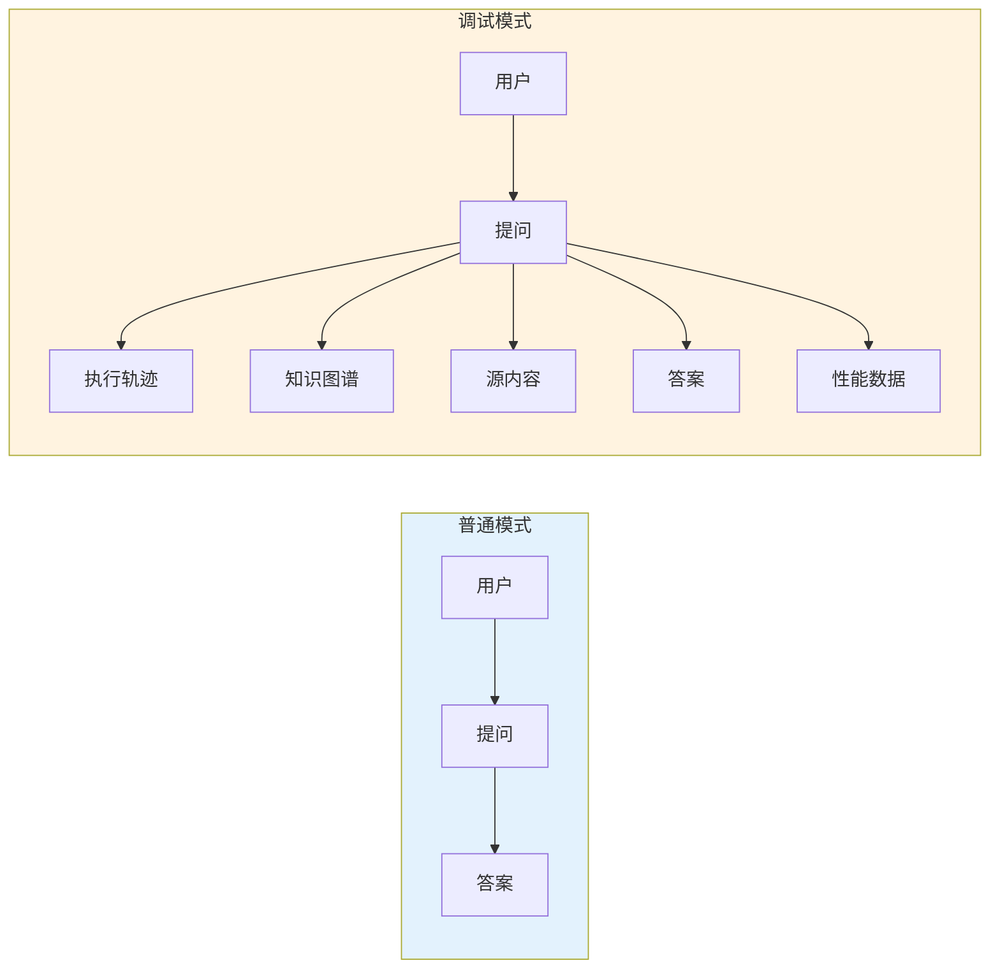
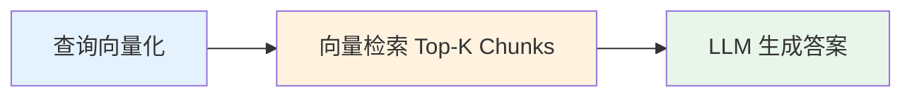
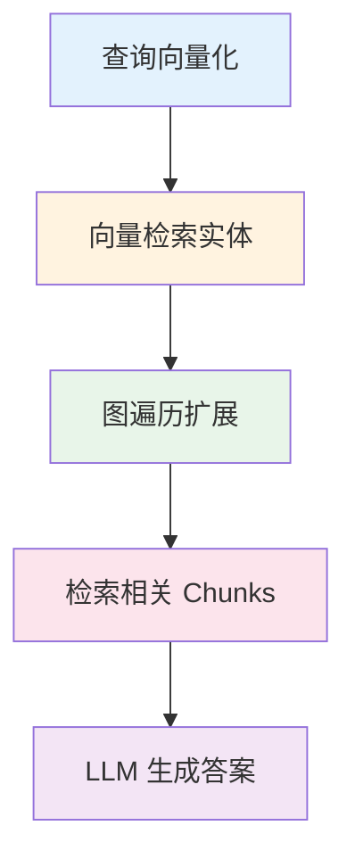
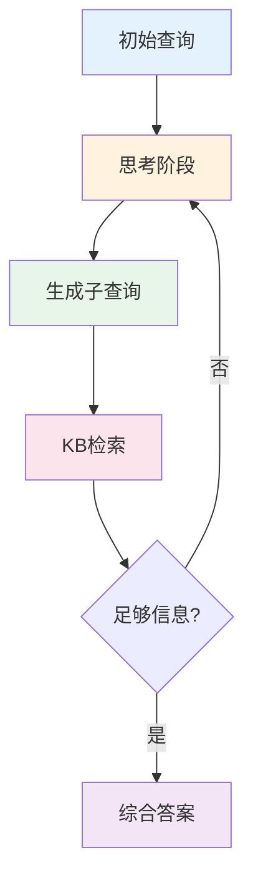
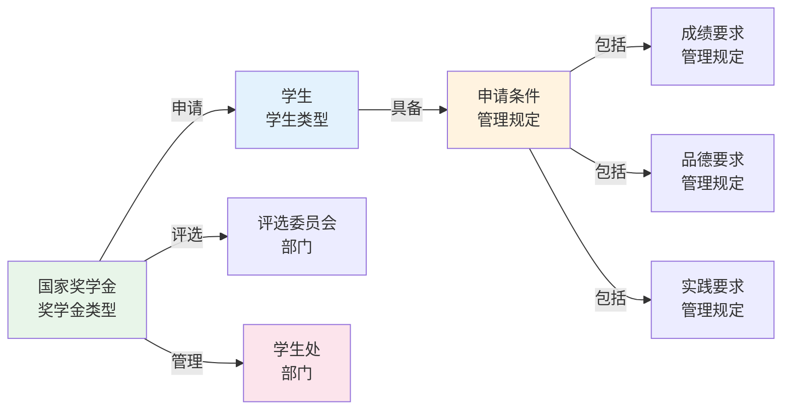

# 调试模式

---

## 📋 元信息

- **目标读者**：开发者、测试人员、高级用户
- **阅读时间**：40分钟
- **难度**：⭐⭐
- **前置知识**：基本的系统调试概念、前端界面使用
- **最后更新**：2026-01-04

---

## 📖 本文大纲

- [调试模式概览](#调试模式概览)
- [启用调试模式](#启用调试模式)
- [执行轨迹分析](#执行轨迹分析)
- [知识图谱可视化（旧版已下线）](#知识图谱可视化)
- [源内容查看（旧版已下线）](#源内容查看)
- [知识图谱管理（旧版已下线）](#知识图谱管理)
- [性能监控](#性能监控)
- [调试技巧](#调试技巧)
- [常见问题排查](#常见问题排查)
- [相关文档](#相关文档)

---

> 注意：旧版知识图谱/源内容/图谱管理相关接口已下线，当前调试仅针对 `/api/v1/chat` 与 `/api/v1/chat/stream` 的 debug 输出。以下章节保留为历史参考。

## 调试模式概览

### 什么是调试模式

调试模式是 GraphRAG 系统提供的**深度诊断工具**，允许开发者和高级用户查看系统内部的运行细节，包括：

- 📊 **执行轨迹**：每一步操作的详细记录
- 🕸️ **知识图谱**：实体关系的可视化网络
- 📄 **源内容**：原始文档和文本块
- ⚙️ **图谱管理**：实体和关系的增删改查
- 📈 **性能监控**：响应时间和资源使用

### 调试模式 vs 普通模式



**对比表**：

| 维度 | 普通模式 | 调试模式 |
|------|---------|---------|
| **响应速度** | 快（流式） | 慢（完整生成后返回） |
| **信息展示** | 仅答案 | 答案 + 执行细节 |
| **适用场景** | 日常使用 | 问题排查、学习、开发 |
| **流式响应** | ✅ 支持 | ❌ 不支持 |
| **资源占用** | 低 | 中等 |

---

## 启用调试模式

### 方法 1: 通过前端界面

**位置**：侧边栏 → 系统设置

**操作步骤**：

1. 打开 Streamlit 前端（`http://localhost:8501`）
2. 在侧边栏找到 "系统设置" 区域
3. 勾选 "启用调试模式" 复选框
4. 发送查询，查看右侧调试面板

**效果**：

```
┌──────────────┬──────────────────┬───────────────────┐
│   侧边栏     │    聊天区域      │   调试面板       │
│              │                  │                   │
│ ☑ 启用调试   │  Q: 查询...      │ [执行轨迹]       │
│   模式       │  A: 答案...      │ [知识图谱]       │
│              │                  │ [源内容]         │
│              │                  │ [图谱管理]       │
│              │                  │ [性能监控]       │
└──────────────┴──────────────────┴───────────────────┘
```

### 方法 2: 通过 API 调用

**同步调用**：

```python
import requests

response = requests.post(
    "http://localhost:8000/api/v1/chat",
    json={
        "message": "国家奖学金的申请条件是什么？",
        "session_id": "user_12345",
        "debug": True,  # 启用调试模式
        "agent_type": "hybrid_agent"
    }
)

result = response.json()

# 获取调试信息
print("答案:", result["answer"])
print("执行日志:", result["execution_log"])
print("知识图谱:", result["kg_data"])
```

**流式调用**：

```python
# 流式调用也支持调试模式
response = requests.post(
    "http://localhost:8000/api/v1/chat/stream",
    json={
        "message": "国家奖学金的申请条件是什么？",
        "session_id": "user_12345",
        "debug": True,
        "agent_type": "hybrid_agent"
    },
    stream=True
)

# 接收执行日志事件
for line in response.iter_lines():
    if line and line.startswith(b"data: "):
        data = json.loads(line[6:])
        if data["status"] == "execution_log":
            print(data["content"])
```

### 注意事项

⚠️ **调试模式限制**：

1. **禁用流式响应**：调试模式下自动禁用流式响应（需等待完整生成）
2. **性能影响**：调试信息收集会增加 10-20% 的响应时间
3. **内存占用**：执行日志和图谱数据会占用额外内存

---

## 执行轨迹分析

### 执行轨迹的作用

执行轨迹（Execution Trace）记录了系统处理查询的**每一个步骤**，包括：

- 调用的工具和函数
- 输入和输出数据
- 每步的耗时
- 中间结果

### 不同 Agent 的执行轨迹

#### 1. Naive RAG Agent

**执行流程**：



**执行轨迹示例**：

```
┌─────────────────────────────────────────────┐
│ 节点: vectorize_query                        │
├─────────────────────────────────────────────┤
│ 输入:                                        │
│   - query: "国家奖学金的申请条件是什么？"    │
│ 输出:                                        │
│   - embedding: [0.12, -0.45, 0.78, ...]     │
│   - dimension: 1536                          │
│ 耗时: 0.08s                                  │
└─────────────────────────────────────────────┘

┌─────────────────────────────────────────────┐
│ 节点: vector_retrieve                        │
├─────────────────────────────────────────────┤
│ 输入:                                        │
│   - query_vector: [0.12, -0.45, ...]        │
│   - top_k: 5                                 │
│ 输出:                                        │
│   - chunks: [chunk_001, chunk_005, ...]     │
│   - similarity: [0.92, 0.87, 0.81, ...]     │
│ 耗时: 0.15s                                  │
└─────────────────────────────────────────────┘

┌─────────────────────────────────────────────┐
│ 节点: generate_answer                        │
├─────────────────────────────────────────────┤
│ 输入:                                        │
│   - query: "国家奖学金的申请条件是什么？"    │
│   - context: [chunk_001, chunk_005, ...]    │
│ 输出:                                        │
│   - answer: "根据检索到的信息..."           │
│ 耗时: 0.65s                                  │
└─────────────────────────────────────────────┘
```

#### 2. Hybrid Agent

**执行流程**：



**执行轨迹示例**：

```
步骤 1: 查询向量化 (0.08s)
  - 输入: "国家奖学金的申请条件是什么？"
  - 输出: 1536维向量

步骤 2: 向量检索实体 (0.15s)
  - Top 10 实体:
    * 国家奖学金 (相似度: 0.92)
    * 申请条件 (相似度: 0.87)
    * 评选标准 (相似度: 0.81)

步骤 3: 图遍历扩展 (0.35s)
  - 起始实体: 3个
  - 遍历深度: 2跳
  - 发现关系: 15条
  - 发现实体: 8个

步骤 4: 检索相关文本块 (0.12s)
  - 检索到 5 个 Chunks
  - 总 Token 数: 1200

步骤 5: LLM 生成答案 (0.65s)
  - 输入 Token: 1200
  - 输出 Token: 156

━━━━━━━━━━━━━━━━━━━━━━━━━━━━━━━━━━━━
总耗时: 1.35s
```

#### 3. Deep Research Agent

**执行流程**：



**执行轨迹示例**（多轮迭代）：

```
┌────────────────────────────────────────────┐
│ 第 1 轮迭代                                 │
├────────────────────────────────────────────┤
│ [深度研究] 开始第1轮迭代                    │
│ [深度研究] 执行查询: 国家奖学金的申请条件   │
│ [KB检索] 开始搜索: 国家奖学金 申请条件      │
│ [KB检索] 结果: 找到 5 个相关文档            │
│ [深度研究] 发现有用信息: 学习成绩要求前10%  │
└────────────────────────────────────────────┘

┌────────────────────────────────────────────┐
│ 第 2 轮迭代                                 │
├────────────────────────────────────────────┤
│ [深度研究] 开始第2轮迭代                    │
│ [深度研究] 执行查询: 除了成绩还有哪些条件？ │
│ [KB检索] 开始搜索: 国家奖学金 其他条件      │
│ [KB检索] 结果: 找到 3 个相关文档            │
│ [深度研究] 发现有用信息: 思想品德、社会实践 │
└────────────────────────────────────────────┘

┌────────────────────────────────────────────┐
│ 第 3 轮迭代                                 │
├────────────────────────────────────────────┤
│ [深度研究] 开始第3轮迭代                    │
│ [深度研究] 没有生成新查询且已有信息，结束   │
└────────────────────────────────────────────┘

━━━━━━━━━━━━━━━━━━━━━━━━━━━━━━━━━━━━
总迭代次数: 3轮
总耗时: 8.5s
```

**增强版工具（Deeper Research）额外信息**：

```
┌────────────────────────────────────────────┐
│ 社区感知增强                                │
├────────────────────────────────────────────┤
│ ✓ 识别到相关社区: "奖学金评选体系"         │
│ ✓ 提取社区知识: 3条背景信息                │
└────────────────────────────────────────────┘

┌────────────────────────────────────────────┐
│ 知识图谱增强                                │
├────────────────────────────────────────────┤
│ 实体数量: 12                                │
│ 关系数量: 18                                │
│ 核心实体:                                   │
│   - 国家奖学金 (奖学金类型)                 │
│   - 申请条件 (管理规定)                     │
│   - 学生 (学生类型)                         │
└────────────────────────────────────────────┘
```

### 如何分析执行轨迹

**分析维度**：

1. **耗时分析**：
   - 找出最耗时的步骤
   - 识别性能瓶颈
   - 评估优化空间

2. **数据流分析**：
   - 检查输入输出是否合理
   - 验证中间结果的正确性
   - 追踪数据转换过程

3. **逻辑分析**：
   - 理解系统的推理路径
   - 判断检索策略是否有效
   - 评估答案的可信度

**示例分析**：

```
问题: 响应时间过长（>5s）

1. 查看执行轨迹:
   - 查询向量化: 0.08s
   - 向量检索: 0.15s
   - 图遍历: 2.50s ⚠️ 瓶颈
   - LLM生成: 0.65s

2. 定位问题:
   - 图遍历耗时 2.50s，占比 50%
   - 遍历深度: 3跳，发现实体: 50个

3. 优化方案:
   - 减少遍历深度到 2跳
   - 限制实体数量到 30个
   - 添加缓存机制
```

---

## 知识图谱可视化

### 图谱可视化界面

**位置**：调试面板 → 知识图谱标签页

**显示内容**：

- 🟢 **实体节点**（Entity）
- 🔵 **文本块节点**（Chunk）
- 🟡 **社区节点**（Community）
- ➡️ **关系边**（Relationship）

**可视化示例**：



### 交互功能

**鼠标操作**：

| 操作 | 功能 |
|------|------|
| 滚轮滚动 | 缩放图谱 |
| 左键拖动空白 | 移动整个图谱 |
| 左键拖动节点 | 移动单个节点 |
| 点击节点 | 显示详细信息 |
| 悬停节点 | 显示标签和属性 |
| 双击节点 | 隐藏/显示邻居节点 |

**节点信息面板**：

```
┌─────────────────────────────────────────┐
│ 节点详情                                 │
├─────────────────────────────────────────┤
│ ID: entity_001                          │
│ 名称: 国家奖学金                         │
│ 类型: 奖学金类型                         │
│ 描述: 由中央政府出资设立的奖学金         │
│                                         │
│ 属性:                                    │
│   - amount: 8000元/年                   │
│   - level: 国家级                       │
│                                         │
│ 出度: 5                                  │
│ 入度: 2                                  │
│ 社区: community_001                     │
└─────────────────────────────────────────┘
```

### 图谱筛选

**筛选选项**：

```python
# 通过 API 筛选
response = requests.get(
    "http://localhost:8000/api/v1/knowledge_graph",
    params={
        "query": "国家奖学金",  # 关键词筛选
        "limit": 50            # 节点数量限制
    }
)
```

**筛选策略**：

- **关键词筛选**：仅显示与查询相关的实体
- **深度限制**：控制从起始节点扩展的跳数
- **数量限制**：避免图谱过于复杂

---

## 源内容查看

### 源内容的作用

源内容（Source Content）显示系统检索到的**原始文档和文本块**，用于：

- 验证答案的依据
- 查看原始上下文
- 评估检索质量
- 追溯信息来源

### 源内容格式

**Document 信息**：

```
┌─────────────────────────────────────────┐
│ 📄 文档信息                              │
├─────────────────────────────────────────┤
│ Document ID: doc_001                    │
│ 文件名: student_handbook.pdf           │
│ 文件路径: files/student_handbook.pdf   │
│ 文件类型: PDF                           │
│ 文件大小: 1.02 MB                       │
│ 总块数: 42                              │
│ 相关度: 0.92                            │
└─────────────────────────────────────────┘
```

**Chunk 内容**：

```
┌─────────────────────────────────────────┐
│ 📝 文本块内容                            │
├─────────────────────────────────────────┤
│ Chunk ID: doc_001_chunk_5               │
│ Chunk 索引: 5 / 42                      │
│ Token 数: 185                           │
│ 相关度: 0.87                            │
├─────────────────────────────────────────┤
│ 【原文】                                │
│                                         │
│ 国家奖学金是为了激励普通本科高校、高等   │
│ 职业学校和高等专科学校学生勤奋学习、努   │
│ 力进取，在德、智、体、美等方面全面发展， │
│ 由中央政府出资设立的奖励特别优秀学生的   │
│ 奖学金。                                │
│                                         │
│ 国家奖学金的奖励标准为每人每年8000元。   │
│                                         │
│ 申请条件：                              │
│ 1. 学习成绩优异，排名年级前10%          │
│ 2. 思想品德良好，无违纪记录              │
│ 3. 积极参与社会实践活动                 │
└─────────────────────────────────────────┘
```

### 通过 API 获取源内容

```python
# 批量获取源文件信息
response = requests.post(
    "http://localhost:8000/api/v1/source_info_batch",
    json={
        "source_ids": ["doc_001", "chunk_001"]
    }
)

# 批量获取文本块内容
response = requests.post(
    "http://localhost:8000/api/v1/content_batch",
    json={
        "chunk_ids": ["chunk_001", "chunk_002"]
    }
)
```

---

## 知识图谱管理

### 管理功能

知识图谱管理 API 迁移至 `/api/v1/*`：

- `POST /api/v1/entity/create`
- `POST /api/v1/entity/update`
- `POST /api/v1/entity/delete`
- `POST /api/v1/relation/create`
- `POST /api/v1/relation/update`
- `POST /api/v1/relation/delete`
- `POST /api/v1/kg_reasoning`

---

## 性能监控

### 性能指标

**位置**：调试面板 → 性能监控标签页

**监控指标**：

| 指标 | 说明 | 单位 |
|------|------|------|
| 响应时间 | 从请求到返回的总耗时 | 秒 |
| Token 使用 | LLM 输入输出的 Token 数 | 个 |
| 缓存命中率 | 缓存命中的查询比例 | % |
| 实体检索数 | 向量检索的实体数量 | 个 |
| 图遍历深度 | 图遍历的跳数 | 跳 |
| LLM 调用次数 | 调用 LLM 的次数 | 次 |

**性能统计面板**：

```
┌─────────────────────────────────────────┐
│ 📈 性能统计                              │
├─────────────────────────────────────────┤
│ 查询总数: 25                            │
│ 平均响应时间: 1.35s                     │
│ P95响应时间: 2.10s                      │
│ 缓存命中率: 32%                         │
│                                         │
│ Token 使用统计:                         │
│   - 总输入 Token: 28,500               │
│   - 总输出 Token: 3,800                │
│   - 平均输入: 1,140 tokens/query       │
│   - 平均输出: 152 tokens/query         │
│                                         │
│ LLM 调用统计:                           │
│   - 总调用次数: 42                      │
│   - 平均调用次数: 1.68 次/query         │
└─────────────────────────────────────────┘
```

### 性能分析

**响应时间分布**：

```
┌─────────────────────────────────────────┐
│ 响应时间分布 (最近 25 次查询)            │
├─────────────────────────────────────────┤
│ <0.5s   : ████░░░░░░ (4 次, 16%)        │
│ 0.5-1s  : ████████░░ (8 次, 32%)        │
│ 1-2s    : ██████████ (10 次, 40%)       │
│ 2-5s    : ███░░░░░░░ (3 次, 12%)        │
│ >5s     : ░░░░░░░░░░ (0 次, 0%)         │
└─────────────────────────────────────────┘
```

---

## 调试技巧

### 技巧 1: 对比不同 Agent

```
测试场景: 查询"国家奖学金的申请条件是什么？"

1. 使用 naive_rag_agent
   - 响应时间: 0.8s
   - 检索到 5 个 Chunks
   - 答案准确性: 70%

2. 使用 hybrid_agent
   - 响应时间: 1.3s
   - 检索到 8 个实体 + 5 个 Chunks
   - 答案准确性: 90%

3. 使用 deep_research_agent
   - 响应时间: 8.5s
   - 3 轮迭代，检索 15 次
   - 答案准确性: 95%

结论: hybrid_agent 平衡了速度和精度，推荐使用
```

### 技巧 2: 追踪答案来源

```
步骤:
1. 开启调试模式
2. 发送查询
3. 查看"源内容"标签页
4. 找到相关度最高的 Chunk
5. 查看原文，验证答案的准确性

示例:
- Chunk ID: doc_001_chunk_5
- 相关度: 0.92
- 原文: "申请条件：1. 学习成绩优异，排名年级前10%..."
- 答案: "根据检索到的信息，申请条件包括学习成绩优异..."
- 结论: ✅ 答案准确引用了原文
```

### 技巧 3: 定位性能瓶颈

```
步骤:
1. 查看"执行轨迹"，找出最耗时的步骤
2. 分析该步骤的输入输出规模
3. 评估优化空间

示例:
- 瓶颈: 图遍历 (2.5s, 占比 50%)
- 输入: 3 个起始实体，深度 3 跳
- 输出: 50 个实体，80 条关系
- 优化: 减少深度到 2 跳，限制实体数到 30
- 效果: 耗时降低到 0.8s
```

### 技巧 4: 验证缓存效果

```
步骤:
1. 发送查询 A，记录响应时间 T1
2. 再次发送相同查询 A，记录响应时间 T2
3. 对比 T1 和 T2

示例:
- 第 1 次查询: 1.35s
- 第 2 次查询: 0.05s (缓存命中)
- 加速比: 27x
- 结论: ✅ 缓存有效
```

---

## 常见问题排查

### Q1: 答案不准确

**排查步骤**：

1. 开启调试模式
2. 查看"源内容"标签页
3. 检查检索到的 Chunks 是否相关
4. 查看"执行轨迹"，检查检索策略

**示例**：

```
问题: 查询"国家奖学金金额"，答案错误

排查:
1. 查看源内容:
   - Chunk 1: "国家励志奖学金 5000 元/年" (相关度: 0.88)
   - Chunk 2: "国家奖学金 8000 元/年" (相关度: 0.85)

2. 发现问题:
   - 系统错误检索到"国家励志奖学金"
   - 相关度排序有误

3. 解决方案:
   - 使用 graph_agent（利用图谱结构区分）
   - 或优化查询："国家奖学金（不是励志）的金额"
```

### Q2: 响应时间过长

**排查步骤**：

1. 查看"执行轨迹"，定位耗时步骤
2. 查看"性能监控"，检查平均响应时间
3. 对比不同 Agent 的性能

**示例**：

```
问题: deep_research_agent 响应超过 20s

排查:
1. 执行轨迹:
   - 迭代 5 轮
   - 每轮 LLM 调用 2 次
   - 总 LLM 调用: 10 次

2. 优化:
   - 减少最大迭代次数（配置文件）
   - 使用 hybrid_agent 替代（适合简单问题）
```

### Q3: 知识图谱显示异常

**排查步骤**：

1. 检查是否有数据返回
2. 查看浏览器控制台错误
3. 验证图谱数据格式

**示例**：

```
问题: 知识图谱标签页显示空白

排查:
1. 查看调试信息:
   - kg_data: null

2. 原因:
   - 未启用调试模式
   - 或 Agent 不返回图谱数据

3. 解决:
   - 启用调试模式
   - 使用 graph_agent 或 hybrid_agent
```

---

## 相关文档

- [前端界面使用](./前端界面使用.md) - 前端操作指南
- [API 使用指南](./API使用指南.md) - API 调用方法
- [性能调优](../02-核心机制/04-深入理解/性能调优.md) - 系统性能优化
- [代码走读](../02-核心机制/04-深入理解/代码走读.md) - 代码实现细节

---

## 更新日志

| 版本 | 日期 | 更新内容 | 作者 |
|------|------|----------|------|
| 1.0 | 2026-01-04 | 初始版本，完整调试模式指南 | Claude |
| - | - | - | - |
