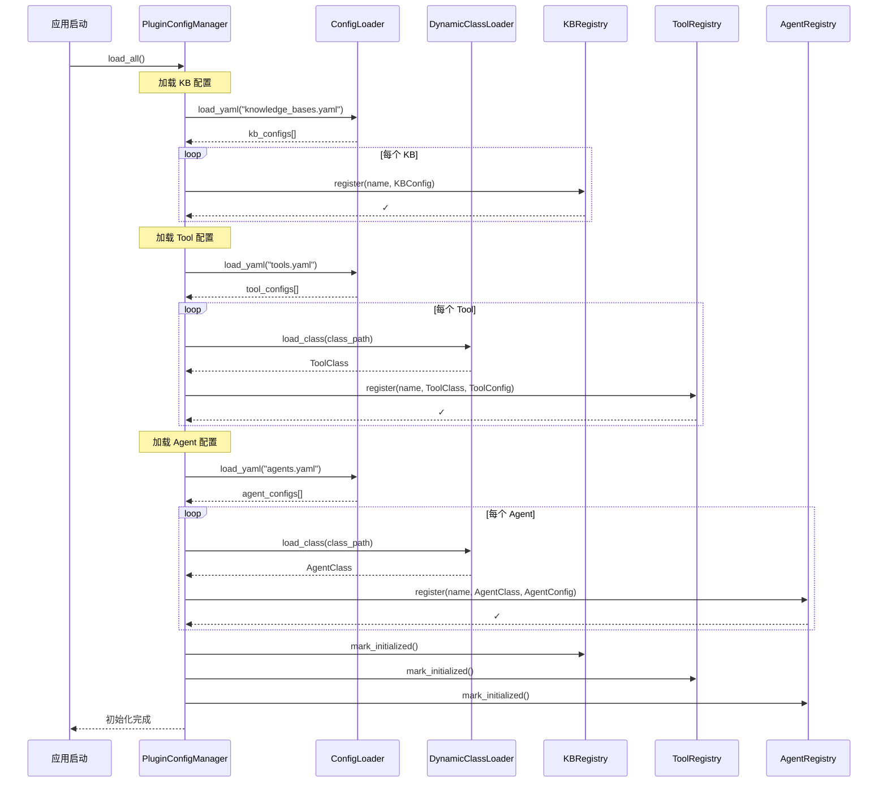
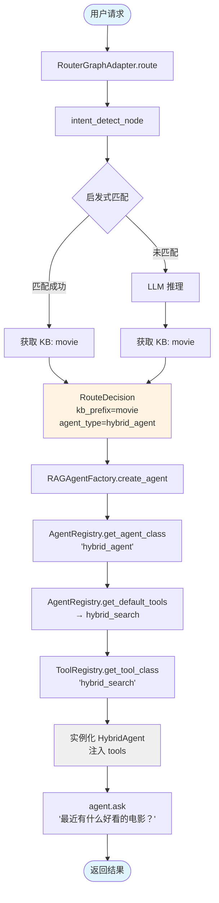
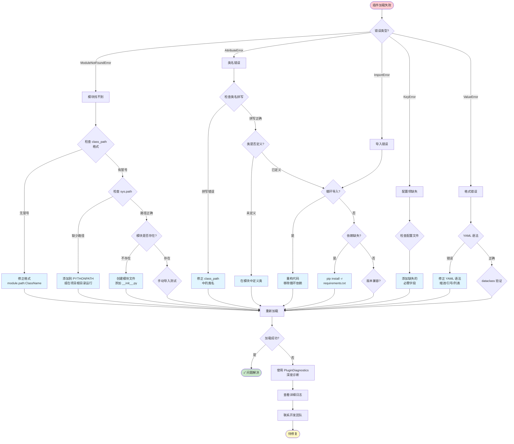
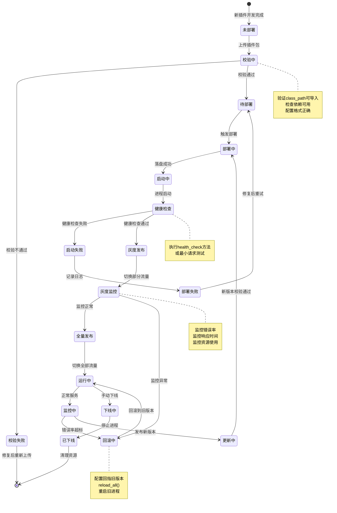
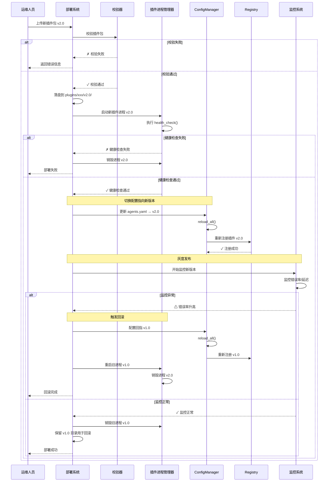

# 可配置插件架构设计文档

> **版本**: 3.0.0
> **日期**: 2026-01-17
> **作者**: GraphRAG Team
> **状态**: 设计阶段

---

## 📋 目录

- [1. 背景与目标](#1-背景与目标)
- [2. 核心问题分析](#2-核心问题分析)
- [3. 架构设计](#3-架构设计)
- [4. 核心组件](#4-核心组件)
- [5. 配置文件格式](#5-配置文件格式)
- [6. 实施计划](#6-实施计划)
- [7. 示例代码](#7-示例代码)
- [8. 迁移指南](#8-迁移指南)
- [9. 最佳实践](#9-最佳实践)

---

## 1. 背景与目标

### 1.1 项目架构概述

当前项目采用 **LangGraph Router-Worker 架构**：

```
用户请求
    ↓
Router（意图识别）
    ↓
Worker 选择（{kb_prefix}:{agent_type}）
    ↓
Agent 执行（GraphRAG / NaiveRAG / HybridRAG ...）
    ↓
返回结果
```

**核心流程**：
1. **Intent Detection**：识别用户意图，选择知识库（movie / edu / general）
2. **Worker Selection**：根据 KB 和 Agent 类型选择 Worker
3. **Agent Execution**：执行具体的 RAG 流程（使用 LangGraph 工作流）

### 1.2 当前痛点

#### 痛点 1：KB 类型硬编码

```python
# ❌ 当前代码
KBPrefix = Literal["movie", "edu", "general"]

# 问题：新增 KB（如 finance）需要改多处代码
# - backend/infrastructure/routing/types.py                     # KBPrefix 类型约束
# - backend/infrastructure/routing/kb_router/router.py           # LLM 路由 prompt（可选）与兜底逻辑
# - backend/infrastructure/routing/kb_router/heuristics.py       # heuristic 逻辑（当前只处理 edu/movie）
# - backend/domain/config/kb_routing.yaml                        # heuristic 关键词配置（edu/movie）
```

#### 痛点 2：Agent 类型硬编码

```python
# ❌ 当前代码
agent_classes = {
    "graph_agent": GraphAgent,
    "hybrid_agent": HybridAgent,
    "naive_rag_agent": NaiveRagAgent,
    "deep_research_agent": DeepResearchAgent,
    "fusion_agent": FusionGraphRAGAgent,
}

# 问题：新增 Agent 需要修改 factory.py
```

#### 痛点 3：Tool 注册硬编码

```python
# ❌ 当前代码
from graphrag_agent.search.tool_registry import LazyToolFactory

TOOL_REGISTRY = {
    "local_search": LazyToolFactory(
        "graphrag_agent.search.tool.local_search_tool", "LocalSearchTool"
    ),
    "global_search": LazyToolFactory(
        "graphrag_agent.search.tool.global_search_tool", "GlobalSearchTool"
    ),
    # ...
}

# 问题：新增 Tool 需要修改 tool_registry.py
```

#### 痛点 4：意图识别规则固化

```python
# ❌ 当前代码
prompt = (
    "你是一个知识库路由器，只在 movie / edu / general 三个选项中选择一个。\n"
    "规则：\n"
    "- 电影/演员/导演/剧情/片单推荐 => movie\n"
    "- 学生管理/课程/考勤/学籍/退学/处分/成绩 => edu\n"
    "- 其他无法匹配以上领域的问题 => general\n"
    "只输出 JSON，不要输出其他文字：\n"
    "{\"kb_prefix\": \"movie|edu|general\", \"confidence\": 0~1, \"reason\": \"...\"}\n"
)

# 问题：规则写死在代码中，新增 KB 需要改 Prompt
```

### 1.3 设计目标

**核心目标**：新增 KB / Agent / Tool 时，只需：
1. ✅ 修改配置文件（YAML）
2. ✅ 添加新代码（不改旧代码）
3. ✅ 无需重启服务（可选）

**设计原则**：
- **开闭原则**：对扩展开放，对修改关闭
- **配置驱动**：业务规则外置到配置文件
- **类型安全**：使用 Protocol + MyPy 静态检查
- **一次性切换**：移除硬编码，不保留兼容层

### 1.4 最小可用版（MVP）范围

**目标**：一次性切换后，主服务不重启也能让插件代码变更生效（通过子进程运行时）。

**MVP 包含**：
- 配置驱动（KB/Agent/Tool）+ Registry + 动态加载
- Router / Factory / ToolRegistry 全面改为 Registry
- 配置热加载（仅 YAML）
- 子进程插件运行时（Tool/Agent 可选启用），插件代码更新通过重启插件进程生效
- 基础超时与错误隔离（不追求完整沙箱）

**MVP 不包含**：
- 插件市场 / 远程仓库 / 包签名
- Docker / Serverless 运行时
- 细粒度权限系统与依赖隔离

**非目标**（本次不涉及）：
- ❌ 远程插件加载（从 Git / Registry）
- ❌ 插件市场
- ❌ 插件权限管理
- ❌ 插件沙箱隔离

---

## 2. 核心问题分析

### 2.1 当前架构分析

通过代码探索，识别出以下核心组件：

| 组件 | 职责 | 硬编码位置 |
|------|------|-----------|
| **RouterGraphAdapter** | 路由入口，调用 LangGraph | `/backend/infrastructure/routing/router.py` |
| **router_graph.py** | LangGraph 工作流定义 | `/backend/infrastructure/routing/orchestrator/router_graph.py` |
| **kb_router** | 意图识别（启发式 + LLM） | `/backend/infrastructure/routing/kb_router/router.py` |
| **heuristics.py** | 启发式规则匹配 | `/backend/infrastructure/routing/kb_router/heuristics.py` |
| **kb_routing.yaml** | 关键词配置 | `/backend/domain/config/kb_routing.yaml` |
| **RAGAgentFactory** | Agent 工厂 | `/backend/infrastructure/agents/rag_factory/factory.py` |
| **BaseAgent** | Agent 基类（LangGraph 框架） | `/backend/graphrag_agent/agents/base.py` |
| **tool_registry.py** | Tool 注册表 | `/backend/graphrag_agent/search/tool_registry.py` |

### 2.2 硬编码痛点详解

#### KB 类型硬编码的影响

```python
# 影响文件 1: state.py
KBPrefix = Literal["movie", "edu", "general"]  # ← 类型系统限制

# 影响文件 2: router.py
available_kbs = ["movie", "edu", "general"]  # ← 可选 KB 列表

# 影响文件 3: heuristics.py
# 虽然从 YAML 读取，但 YAML 结构也固化

# 影响文件 4: LLM Prompt
prompt = "从 movie/edu/general 中选择..."  # ← Prompt 写死
```

**新增 `finance` KB 需要改动**：
1. 修改 `KBPrefix` 类型定义（`state.py`）
2. 修改可选列表（`router.py`）
3. 修改 LLM Prompt（`router.py`）
4. 修改启发式配置（`kb_routing.yaml`）
5. 重启服务

#### Agent 硬编码的影响

```python
# 影响文件: factory.py
agent_classes = {
    "graph_agent": GraphAgent,
    "hybrid_agent": HybridAgent,
    # ...
}

def create_agent(self, agent_type: str, ...):
    agent_class = agent_classes.get(agent_type)  # ← 查硬编码字典
    return agent_class(...)
```

**新增 `finance_agent` 需要改动**：
1. 导入 `FinanceAgent` 类（`factory.py`）
2. 添加到 `agent_classes` 字典（`factory.py`）
3. 重启服务

#### Tool 硬编码的影响

```python
# 影响文件: tool_registry.py
TOOL_REGISTRY = {
    "local_search": LocalSearchTool,
    # ...
}

# Agent 使用 Tool
def _setup_tools(self):
    tool_class = TOOL_REGISTRY["local_search"]  # ← 查硬编码字典
    return [tool_class(self.kb_prefix)]
```

**新增 `finance_search` 需要改动**：
1. 导入 `FinanceSearchTool` 类（`tool_registry.py`）
2. 添加到 `TOOL_REGISTRY` 字典（`tool_registry.py`）
3. Agent 代码中引用新 Tool（多个文件）
4. 重启服务

### 2.3 解决方案概述

**核心思想**：**注册中心 + 配置驱动 + 动态加载**

```
┌─────────────────────────────────────────────────┐
│           配置文件（YAML）                        │
│  knowledge_bases.yaml | agents.yaml | tools.yaml│
└─────────────────────────────────────────────────┘
                    ↓ 加载
┌─────────────────────────────────────────────────┐
│              注册中心（Registry）                 │
│  KBRegistry | AgentRegistry | ToolRegistry      │
└─────────────────────────────────────────────────┘
                    ↓ 查询
┌─────────────────────────────────────────────────┐
│           业务逻辑（Router / Factory）            │
│  动态获取 KB / Agent / Tool                      │
└─────────────────────────────────────────────────┘
```

**关键设计决策**：

| 决策点 | 选择 | 理由 |
|-------|------|------|
| **配置格式** | 多个独立 YAML 文件 | 关注点分离，易于维护 |
| **向后兼容** | 一次性切换（无兼容层） | 避免双轨维护，减少长期复杂度 |
| **扩展机制** | 本地 `plugins/` 目录 | 简单、安全、易调试 |
| **类型安全** | Protocol + MyPy | 静态检查 + 运行时验证 |

---

## 3. 架构设计

### 3.1 整体架构图

```
backend/
├── infrastructure/
│   ├── plugin_system/              # ✅ 新增：插件系统核心
│   │   ├── protocols/              # Protocol 定义（类型安全）
│   │   │   ├── kb_protocol.py
│   │   │   ├── agent_protocol.py
│   │   │   └── tool_protocol.py
│   │   ├── registry/               # 注册中心
│   │   │   ├── base_registry.py    # 基类
│   │   │   ├── kb_registry.py      # KB 注册表
│   │   │   ├── agent_registry.py   # Agent 注册表
│   │   │   └── tool_registry.py    # Tool 注册表
│   │   ├── loader/                 # 动态加载器
│   │   │   ├── config_loader.py    # YAML 加载
│   │   │   └── class_loader.py     # 类动态导入
│   │   └── config/
│   │       └── config_manager.py   # 统一配置管理
│   │
│   ├── routing/                    # ✅ 重构：移除硬编码
│   │   ├── router.py               # 使用 KBRegistry
│   │   ├── orchestrator/
│   │   │   ├── router_graph.py     # 使用 KBRegistry
│   │   │   └── state.py            # 移除 Literal 类型
│   │   └── kb_router/
│   │       ├── router.py           # 使用 KBRegistry
│   │       └── heuristics.py       # 从 KBRegistry 读取
│   │
│   └── agents/
│       └── rag_factory/
│           ├── factory.py          # ✅ 重构：使用 AgentRegistry
│           └── manager.py
│
├── config/
│   └── plugins/                    # ✅ 新增：插件配置目录
│       ├── knowledge_bases.yaml    # KB 配置
│       ├── agents.yaml             # Agent 配置
│       ├── tools.yaml              # Tool 配置
│       └── routers.yaml            # Router 配置（预留/可选）
│
└── plugins/                        # ✅ 新增：插件代码目录
    ├── __init__.py
    ├── finance_agent/              # 示例：金融 Agent
    │   ├── __init__.py
    │   ├── agent.py                # FinanceAgent 类
    │   └── tools.py                # FinanceSearchTool 类
    └── custom_agent/               # 示例：自定义 Agent
        ├── __init__.py
        └── agent.py
```

### 3.2 核心组件职责

#### 组件 1: Protocol（协议层）

**职责**：定义接口规范，确保类型安全

```python
# protocols/agent_protocol.py

@runtime_checkable
class AgentProtocol(Protocol):
    """Agent 协议

    所有 Agent 必须实现：
    - __init__(kb_prefix, session_id, **kwargs)
    - ask(query, **kwargs) -> Dict[str, Any]
    - ask_stream(query, **kwargs) -> Iterator
    """

    def __init__(self, kb_prefix: str, session_id: str = None, **kwargs): ...
    def ask(self, query: str, **kwargs) -> Dict[str, Any]: ...
    def ask_stream(self, query: str, **kwargs): ...
```

**优势**：
- ✅ MyPy 静态检查
- ✅ 运行时验证（`isinstance(obj, AgentProtocol)`）
- ✅ IDE 自动补全

#### 组件 2: Registry（注册中心）

**职责**：管理所有可扩展组件的注册、查询、验证

```python
# registry/kb_registry.py

class KBRegistry(BaseRegistry[KBConfig, KBConfig]):
    """KB 注册表（单例）"""

    _instance = None

    def register(self, name: str, config: KBConfig):
        """注册 KB"""
        ...

    def get_kb_config(self, kb_name: str) -> KBConfig:
        """获取 KB 配置"""
        ...

    def list_kbs(self) -> List[str]:
        """列出所有 KB"""
        ...

    def validate_kb(self, kb_name: str) -> bool:
        """验证 KB 是否存在"""
        ...
```

**优势**：
- ✅ 统一接口
- ✅ 单例模式（全局唯一）
- ✅ 运行时验证

#### 组件 3: Loader（加载器）

**职责**：从配置文件加载，动态导入 Python 类

```python
# loader/class_loader.py

class DynamicClassLoader:
    """动态类加载器"""

    @staticmethod
    def load_class(class_path: str) -> Type:
        """从类路径加载类

        Args:
            class_path: "graphrag_agent.agents.hybrid_agent:HybridAgent"

        Returns:
            加载的类
        """
        module_path, class_name = class_path.rsplit(':', 1)
        module = importlib.import_module(module_path)
        return getattr(module, class_name)
```

**优势**：
- ✅ 支持标准模块（`graphrag_agent.agents.hybrid_agent:HybridAgent`）
- ✅ 支持本地插件（`plugins.finance_agent.agent:FinanceAgent`）
- ✅ 延迟加载（需要时才导入）

#### 组件 4: Config Manager（配置管理器）

**职责**：统一管理所有配置加载，协调各注册中心初始化

```python
# config/config_manager.py

class PluginConfigManager:
    """插件配置管理器"""

    def __init__(self, config_dir: str = "./backend/config/plugins"):
        self.config_dir = Path(config_dir)

    def load_all(self):
        """加载所有配置

        顺序很重要：KB → Tool → Agent（Router 配置预留）
        """
        self._load_kbs()
        self._load_tools()
        self._load_agents()
        # Router 配置预留，后续启用时再加入

    def _load_kbs(self):
        """加载 KB 配置"""
        config = yaml.safe_load(open(self.config_dir / "knowledge_bases.yaml"))
        for kb in config['knowledge_bases']:
            kb_config = KBConfig(**kb)
            kb_registry.register(kb['name'], kb_config)
```

### 3.3 数据流图

#### 启动时：加载配置

```
应用启动
    ↓
PluginConfigManager.load_all()
    ↓
1. 加载 knowledge_bases.yaml
   → KBRegistry.register("movie", KBConfig(...))
   → KBRegistry.register("edu", KBConfig(...))
   → KBRegistry.register("finance", KBConfig(...))
    ↓
2. 加载 tools.yaml
   → DynamicClassLoader.load_class("graphrag_agent.search.tool.local_search_tool:LocalSearchTool")
   → ToolRegistry.register("local_search", LocalSearchTool, ToolConfig(...))
    ↓
3. 加载 agents.yaml
   → DynamicClassLoader.load_class("graphrag_agent.agents.hybrid_agent:HybridAgent")
   → AgentRegistry.register("hybrid_agent", HybridAgent, AgentConfig(...))
    ↓
初始化完成
```

#### 运行时：处理请求

```
用户请求: "最近有什么好看的电影？"
    ↓
RouterGraphAdapter.route()
    ↓
intent_detect_node
    ├─ route_by_heuristic()
    │  └─ KBRegistry.get_kb_config("movie").keywords  # ← 从注册表获取
    └─ LLM 推理
       └─ KBRegistry.get_kb_descriptions()  # ← 动态生成 Prompt
    ↓
RouteDecision(kb_prefix="movie", agent_type="hybrid_agent")
    ↓
RAGAgentFactory.create_agent("hybrid_agent", "movie")
    ├─ AgentRegistry.get_agent_class("hybrid_agent")  # ← 获取 HybridAgent 类
    ├─ AgentRegistry.get_agent_config("hybrid_agent").default_tools  # ← 获取默认工具
    │  └─ ["hybrid_search"]
    └─ ToolRegistry.get_tool_class("hybrid_search")  # ← 获取 Tool 类
    ↓
agent = HybridAgent(kb_prefix="movie", tools=[HybridSearchTool(...)])
    ↓
agent.ask("最近有什么好看的电影？")
    ↓
返回结果
```

#### 可视化流程图

**配置加载时序图**：



**请求处理流程图**：



---

## 4. 核心组件

### 4.1 Protocol 定义

#### KBProtocol

```python
# backend/infrastructure/plugin_system/protocols/kb_protocol.py

from typing import Protocol, List, Dict, Any
from dataclasses import dataclass, field

@dataclass
class KBConfig:
    """KB 配置数据类"""
    name: str
    display_name: str
    description: str
    keywords: List[str]
    intent_model: str = "heuristic"  # heuristic | llm（是否启用关键词匹配）
    min_confidence: float = 0.75     # LLM 置信度低于阈值时回退
    metadata: Dict[str, Any] = field(default_factory=dict)


class KBProvider(Protocol):
    """KB 提供者协议"""

    def get_kb_config(self, kb_name: str) -> KBConfig:
        """获取 KB 配置"""
        ...

    def list_kbs(self) -> List[str]:
        """列出所有 KB 名称"""
        ...

    def validate_kb(self, kb_name: str) -> bool:
        """验证 KB 是否存在"""
        ...
```

#### AgentProtocol

```python
# backend/infrastructure/plugin_system/protocols/agent_protocol.py

from typing import Protocol, List, Dict, Any, Type, runtime_checkable
from dataclasses import dataclass, field

@dataclass
class AgentConfig:
    """Agent 配置数据类"""
    name: str
    class_path: str  # graphrag_agent.agents.hybrid_agent:HybridAgent
    description: str
    default_tools: List[str]
    supported_kbs: List[str] = field(default_factory=list)  # 空列表表示支持所有 KB
    metadata: Dict[str, Any] = field(default_factory=dict)


@runtime_checkable
class AgentProtocol(Protocol):
    """Agent 协议

    所有 Agent 类必须实现此协议
    """

    def __init__(
        self,
        kb_prefix: str,
        session_id: str = None,
        **kwargs
    ):
        """初始化 Agent"""
        ...

    def ask(self, query: str, **kwargs) -> Dict[str, Any]:
        """同步问答"""
        ...

    def ask_stream(self, query: str, **kwargs):
        """流式问答"""
        ...


class AgentProvider(Protocol):
    """Agent 提供者协议"""

    def get_agent_class(self, agent_name: str) -> Type:
        """获取 Agent 类"""
        ...

    def get_agent_config(self, agent_name: str) -> AgentConfig:
        """获取 Agent 配置"""
        ...

    def list_agents(self) -> List[str]:
        """列出所有 Agent"""
        ...
```

#### ToolProtocol

```python
# backend/infrastructure/plugin_system/protocols/tool_protocol.py

from typing import Protocol, List, Dict, Any, Type, runtime_checkable
from dataclasses import dataclass, field

@dataclass
class ToolConfig:
    """Tool 配置数据类"""
    name: str
    class_path: str
    description: str
    supported_kbs: List[str] = field(default_factory=list)  # 空列表表示支持所有 KB
    requires_kb_prefix: bool = True  # false 时不注入 kb_prefix
    metadata: Dict[str, Any] = field(default_factory=dict)


@runtime_checkable
class ToolProtocol(Protocol):
    """Tool 协议

    所有 Tool 必须实现此协议（LangChain Tool 标准）
    """

    def __init__(self, kb_prefix: str = None, **kwargs):
        """初始化 Tool（requires_kb_prefix=false 时可忽略 kb_prefix）"""
        ...

    def _run(self, *args, **kwargs) -> Any:
        """执行工具（LangChain Tool 标准方法）"""
        ...


class ToolProvider(Protocol):
    """Tool 提供者协议"""

    def get_tool_class(self, tool_name: str) -> Type:
        """获取 Tool 类"""
        ...

    def get_tool_config(self, tool_name: str) -> ToolConfig:
        """获取 Tool 配置"""
        ...

    def list_tools(self) -> List[str]:
        """列出所有 Tool"""
        ...
```

### 4.2 Registry 实现

#### Base Registry

```python
# backend/infrastructure/plugin_system/registry/base_registry.py

from typing import Dict, List, TypeVar, Generic, Type
from abc import ABC, abstractmethod
import logging

T = TypeVar('T')
ConfigT = TypeVar('ConfigT')

logger = logging.getLogger(__name__)


class BaseRegistry(ABC, Generic[T, ConfigT]):
    """注册表基类

    提供统一的注册、查询、验证接口
    """

    def __init__(self):
        self._items: Dict[str, T] = {}
        self._configs: Dict[str, ConfigT] = {}
        self._initialized = False

    @abstractmethod
    def _validate_item(self, name: str, item: T) -> bool:
        """验证注册项是否符合协议（子类实现）"""
        pass

    def register(self, name: str, item: T, config: ConfigT):
        """注册项

        Args:
            name: 注册名称
            item: 注册对象（类或配置）
            config: 配置对象

        Raises:
            ValueError: 验证失败
        """
        if not self._validate_item(name, item):
            raise ValueError(f"Item {name} validation failed")

        self._items[name] = item
        self._configs[name] = config
        logger.info(f"✓ Registered {self.__class__.__name__}: {name}")

    def get(self, name: str) -> T:
        """获取注册项

        Args:
            name: 注册名称

        Returns:
            注册的对象

        Raises:
            KeyError: 不存在
        """
        if name not in self._items:
            raise KeyError(f"{self.__class__.__name__}: '{name}' not found")
        return self._items[name]

    def get_config(self, name: str) -> ConfigT:
        """获取配置

        Args:
            name: 注册名称

        Returns:
            配置对象

        Raises:
            KeyError: 不存在
        """
        if name not in self._configs:
            raise KeyError(f"Config for '{name}' not found")
        return self._configs[name]

    def list_names(self) -> List[str]:
        """列出所有注册项名称"""
        return list(self._items.keys())

    def exists(self, name: str) -> bool:
        """检查是否存在"""
        return name in self._items

    def clear(self):
        """清空注册表"""
        self._items.clear()
        self._configs.clear()
        self._initialized = False
        logger.info(f"Cleared {self.__class__.__name__}")

    def is_initialized(self) -> bool:
        """是否已初始化"""
        return self._initialized

    def mark_initialized(self):
        """标记为已初始化"""
        self._initialized = True
        logger.info(f"{self.__class__.__name__} initialized")
```

#### KB Registry

```python
# backend/infrastructure/plugin_system/registry/kb_registry.py

from typing import List, Dict, Any
from ..protocols.kb_protocol import KBConfig, KBProvider
from .base_registry import BaseRegistry
import logging

logger = logging.getLogger(__name__)


class KBRegistry(BaseRegistry[KBConfig, KBConfig], KBProvider):
    """KB 注册表

    管理所有知识库配置（单例）
    """

    _instance = None

    def __new__(cls):
        if cls._instance is None:
            cls._instance = super().__new__(cls)
        return cls._instance

    def _validate_item(self, name: str, item: KBConfig) -> bool:
        """验证 KB 配置"""
        # 检查必需字段
        if not item.name or not item.display_name:
            logger.error(f"KB '{name}': missing required fields (name, display_name)")
            return False

        # 检查 intent_model 合法性
        if item.intent_model not in ["heuristic", "llm"]:
            logger.error(f"KB '{name}': invalid intent_model '{item.intent_model}' (must be 'heuristic' or 'llm')")
            return False

        # 检查 min_confidence 范围
        if not 0.0 <= item.min_confidence <= 1.0:
            logger.error(f"KB '{name}': min_confidence must be in [0.0, 1.0], got {item.min_confidence}")
            return False

        return True

    # 实现 KBProvider 协议
    def get_kb_config(self, kb_name: str) -> KBConfig:
        """获取 KB 配置"""
        return self.get(kb_name)

    def list_kbs(self) -> List[str]:
        """列出所有 KB"""
        return self.list_names()

    def validate_kb(self, kb_name: str) -> bool:
        """验证 KB 是否存在"""
        return self.exists(kb_name)

    # 扩展方法
    def get_kb_descriptions(self) -> Dict[str, Dict[str, Any]]:
        """获取所有 KB 的描述（用于生成 LLM Prompt）

        Returns:
            {
                "movie": {
                    "display_name": "电影知识库",
                    "description": "提供电影、导演...",
                    "keywords": ["电影", "导演", ...]
                },
                ...
            }
        """
        return {
            name: {
                "display_name": config.display_name,
                "description": config.description,
                "keywords": config.keywords
            }
            for name, config in self._configs.items()
        }

    def get_heuristic_keywords(self, kb_name: str) -> List[str]:
        """获取启发式关键词"""
        config = self.get_config(kb_name)
        return config.keywords


# 全局单例
kb_registry = KBRegistry()
```

#### Agent Registry

```python
# backend/infrastructure/plugin_system/registry/agent_registry.py

from typing import Type, List
from ..protocols.agent_protocol import AgentConfig, AgentProtocol, AgentProvider
from .base_registry import BaseRegistry
import logging

logger = logging.getLogger(__name__)


class AgentRegistry(BaseRegistry[Type[AgentProtocol], AgentConfig], AgentProvider):
    """Agent 注册表

    管理所有 Agent 类（单例）
    """

    _instance = None

    def __new__(cls):
        if cls._instance is None:
            cls._instance = super().__new__(cls)
        return cls._instance

    def _validate_item(self, name: str, item: Type) -> bool:
        """验证 Agent 类是否符合 AgentProtocol"""
        # 检查必需方法
        required_methods = ['__init__', 'ask', 'ask_stream']

        for method in required_methods:
            if not hasattr(item, method):
                logger.error(f"Agent '{name}': missing required method '{method}'")
                return False

        # 可选：运行时检查协议（需要 Python 3.8+）
        # if not isinstance(item, AgentProtocol):  # 这对类不适用
        #     logger.warning(f"Agent '{name}': does not conform to AgentProtocol")

        return True

    # 实现 AgentProvider 协议
    def get_agent_class(self, agent_name: str) -> Type[AgentProtocol]:
        """获取 Agent 类"""
        return self.get(agent_name)

    def get_agent_config(self, agent_name: str) -> AgentConfig:
        """获取 Agent 配置"""
        return self.get_config(agent_name)

    def list_agents(self) -> List[str]:
        """列出所有 Agent"""
        return self.list_names()

    # 扩展方法
    def get_agents_for_kb(self, kb_name: str) -> List[str]:
        """获取支持指定 KB 的所有 Agent

        Args:
            kb_name: KB 名称

        Returns:
            Agent 名称列表
        """
        result = []
        for name, config in self._configs.items():
            # supported_kbs 为空表示支持所有 KB
            if not config.supported_kbs or kb_name in config.supported_kbs:
                result.append(name)
        return result

    def get_default_tools(self, agent_name: str) -> List[str]:
        """获取 Agent 的默认工具列表"""
        config = self.get_config(agent_name)
        return config.default_tools


# 全局单例
agent_registry = AgentRegistry()
```

#### Tool Registry

```python
# backend/infrastructure/plugin_system/registry/tool_registry.py

from typing import Type, List
from ..protocols.tool_protocol import ToolConfig, ToolProtocol, ToolProvider
from .base_registry import BaseRegistry
import logging

logger = logging.getLogger(__name__)


class ToolRegistry(BaseRegistry[Type[ToolProtocol], ToolConfig], ToolProvider):
    """Tool 注册表

    管理所有 Tool 类（单例）
    """

    _instance = None

    def __new__(cls):
        if cls._instance is None:
            cls._instance = super().__new__(cls)
        return cls._instance

    def _validate_item(self, name: str, item: Type) -> bool:
        """验证 Tool 类是否符合 ToolProtocol"""
        # 检查必需方法（LangChain Tool 标准）
        required_methods = ['__init__', '_run']

        for method in required_methods:
            if not hasattr(item, method):
                logger.error(f"Tool '{name}': missing required method '{method}'")
                return False

        return True

    # 实现 ToolProvider 协议
    def get_tool_class(self, tool_name: str) -> Type[ToolProtocol]:
        """获取 Tool 类"""
        return self.get(tool_name)

    def get_tool_config(self, tool_name: str) -> ToolConfig:
        """获取 Tool 配置"""
        return self.get_config(tool_name)

    def list_tools(self) -> List[str]:
        """列出所有 Tool"""
        return self.list_names()

    # 扩展方法
    def get_tools_for_kb(self, kb_name: str) -> List[str]:
        """获取支持指定 KB 的所有 Tool

        Args:
            kb_name: KB 名称

        Returns:
            Tool 名称列表
        """
        result = []
        for name, config in self._configs.items():
            # supported_kbs 为空表示支持所有 KB
            if not config.supported_kbs or kb_name in config.supported_kbs:
                result.append(name)
        return result


# 全局单例
tool_registry = ToolRegistry()
```

### 4.3 Dynamic Loader

#### Config Loader

```python
# backend/infrastructure/plugin_system/loader/config_loader.py

import yaml
from pathlib import Path
from typing import Dict, Any
import logging

logger = logging.getLogger(__name__)


class ConfigLoader:
    """配置文件加载器"""

    @staticmethod
    def load_yaml(file_path: str | Path) -> Dict[str, Any]:
        """加载 YAML 配置文件

        Args:
            file_path: 配置文件路径

        Returns:
            配置字典

        Raises:
            FileNotFoundError: 文件不存在
            yaml.YAMLError: YAML 格式错误
        """
        file_path = Path(file_path)

        if not file_path.exists():
            raise FileNotFoundError(f"Config file not found: {file_path}")

        try:
            with open(file_path, 'r', encoding='utf-8') as f:
                config = yaml.safe_load(f)

            logger.info(f"✓ Loaded config: {file_path}")
            return config

        except yaml.YAMLError as e:
            logger.error(f"Failed to parse YAML: {file_path}")
            raise

    @staticmethod
    def validate_version(config: Dict[str, Any], expected_version: str = "1.0"):
        """验证配置文件版本

        Args:
            config: 配置字典
            expected_version: 期望版本

        Raises:
            ValueError: 版本不匹配
        """
        version = config.get("version", "unknown")
        if version != expected_version:
            raise ValueError(
                f"Config version mismatch: expected '{expected_version}', got '{version}'"
            )
```

#### Class Loader

```python
# backend/infrastructure/plugin_system/loader/class_loader.py

import importlib
import sys
from pathlib import Path
from typing import Type, TypeVar
import logging

logger = logging.getLogger(__name__)

T = TypeVar('T')


class DynamicClassLoader:
    """动态类加载器

    支持从类路径动态导入 Python 类
    """

    @staticmethod
    def load_class(class_path: str) -> Type:
        """加载类

        Args:
            class_path: 类路径，格式为 "module.path:ClassName"
                示例：
                - graphrag_agent.agents.hybrid_agent:HybridAgent
                - plugins.finance_agent.agent:FinanceAgent

        Returns:
            加载的类

        Raises:
            ValueError: class_path 格式错误
            ImportError: 模块不存在
            AttributeError: 类不存在
        """
        if ':' not in class_path:
            raise ValueError(
                f"Invalid class_path format: '{class_path}'. "
                f"Expected 'module.path:ClassName'"
            )

        module_path, class_name = class_path.rsplit(':', 1)

        try:
            # 动态导入模块
            module = importlib.import_module(module_path)

            # 获取类
            if not hasattr(module, class_name):
                raise AttributeError(
                    f"Module '{module_path}' has no class '{class_name}'"
                )

            cls = getattr(module, class_name)
            logger.info(f"✓ Loaded class: {class_path}")

            return cls

        except ImportError as e:
            logger.error(f"Failed to import module '{module_path}': {e}")
            raise
        except AttributeError as e:
            logger.error(f"Failed to get class '{class_name}': {e}")
            raise

    @staticmethod
    def ensure_plugins_in_path():
        """确保 plugins 目录在 sys.path 中

        这样可以直接导入 plugins.xxx 模块
        """
        # 假设 plugins 目录在项目根目录
        project_root = Path(__file__).parent.parent.parent.parent
        plugins_dir = project_root / "plugins"

        plugins_dir_str = str(plugins_dir.absolute())

        if plugins_dir_str not in sys.path:
            sys.path.insert(0, plugins_dir_str)
            logger.info(f"Added plugins directory to sys.path: {plugins_dir_str}")
```

### 4.4 Config Manager

```python
# backend/infrastructure/plugin_system/config/config_manager.py

from pathlib import Path
from typing import Optional
import logging

from ..loader.config_loader import ConfigLoader
from ..loader.class_loader import DynamicClassLoader
from ..registry.kb_registry import kb_registry
from ..registry.agent_registry import agent_registry
from ..registry.tool_registry import tool_registry
from ..protocols.kb_protocol import KBConfig
from ..protocols.agent_protocol import AgentConfig
from ..protocols.tool_protocol import ToolConfig

logger = logging.getLogger(__name__)


class PluginConfigManager:
    """插件配置管理器

    统一管理所有插件配置的加载和注册
    """

    def __init__(self, config_dir: str | Path = None):
        """初始化

        Args:
            config_dir: 配置文件目录，默认为 ./backend/config/plugins
        """
        if config_dir is None:
            # 默认配置目录
            config_dir = Path(__file__).parent.parent.parent.parent / "config" / "plugins"

        self.config_dir = Path(config_dir)

        if not self.config_dir.exists():
            raise FileNotFoundError(f"Config directory not found: {self.config_dir}")

        logger.info(f"PluginConfigManager initialized with config_dir: {self.config_dir}")

    def load_all(self):
        """加载所有配置

        按顺序加载：KB → Tool → Agent（Router 配置预留）

        顺序很重要：
        - Tool 依赖 KB（某些 Tool 只支持特定 KB）
        - Agent 依赖 Tool（Agent 的 default_tools 引用 Tool）
        - Router 配置（routers.yaml）预留，后续启用时再加入加载链路
        """
        logger.info("=" * 60)
        logger.info("Loading plugin configurations...")
        logger.info("=" * 60)

        # 确保 plugins 目录在 sys.path 中
        DynamicClassLoader.ensure_plugins_in_path()

        # 加载配置
        self._load_kbs()
        self._load_tools()
        self._load_agents()

        logger.info("=" * 60)
        logger.info("✓ All plugin configurations loaded successfully")
        logger.info(f"  - {len(kb_registry.list_kbs())} KBs")
        logger.info(f"  - {len(tool_registry.list_tools())} Tools")
        logger.info(f"  - {len(agent_registry.list_agents())} Agents")
        logger.info("=" * 60)

        # 标记所有注册表已初始化
        kb_registry.mark_initialized()
        tool_registry.mark_initialized()
        agent_registry.mark_initialized()

    def _load_kbs(self):
        """加载 KB 配置"""
        logger.info("Loading KBs...")

        config_file = self.config_dir / "knowledge_bases.yaml"
        config = ConfigLoader.load_yaml(config_file)

        # 验证版本
        ConfigLoader.validate_version(config, "1.0")

        # 注册每个 KB
        for kb_data in config.get('knowledge_bases', []):
            kb_config = KBConfig(**kb_data)
            kb_registry.register(kb_config.name, kb_config, kb_config)

        logger.info(f"✓ Loaded {len(config.get('knowledge_bases', []))} KBs")

    def _load_tools(self):
        """加载 Tool 配置"""
        logger.info("Loading Tools...")

        config_file = self.config_dir / "tools.yaml"
        config = ConfigLoader.load_yaml(config_file)

        # 验证版本
        ConfigLoader.validate_version(config, "1.0")

        # 注册每个 Tool
        for tool_data in config.get('tools', []):
            tool_config = ToolConfig(**tool_data)

            # 动态加载 Tool 类
            tool_class = DynamicClassLoader.load_class(tool_config.class_path)

            # 注册到 registry
            tool_registry.register(tool_config.name, tool_class, tool_config)

        logger.info(f"✓ Loaded {len(config.get('tools', []))} Tools")

    def _load_agents(self):
        """加载 Agent 配置"""
        logger.info("Loading Agents...")

        config_file = self.config_dir / "agents.yaml"
        config = ConfigLoader.load_yaml(config_file)

        # 验证版本
        ConfigLoader.validate_version(config, "1.0")

        # 注册每个 Agent
        for agent_data in config.get('agents', []):
            agent_config = AgentConfig(**agent_data)

            # 动态加载 Agent 类
            agent_class = DynamicClassLoader.load_class(agent_config.class_path)

            # 注册到 registry
            agent_registry.register(agent_config.name, agent_class, agent_config)

        logger.info(f"✓ Loaded {len(config.get('agents', []))} Agents")

    def reload_all(self):
        """重新加载所有配置

        注意：这会清空所有注册表
        """
        logger.warning("Reloading all plugin configurations...")

        # 清空注册表
        kb_registry.clear()
        tool_registry.clear()
        agent_registry.clear()

        # 重新加载
        self.load_all()


# 全局单例
_config_manager: Optional[PluginConfigManager] = None


def get_config_manager(config_dir: str | Path = None) -> PluginConfigManager:
    """获取全局配置管理器（单例）"""
    global _config_manager
    if _config_manager is None:
        _config_manager = PluginConfigManager(config_dir)
    return _config_manager
```

---

### 4.5 Subprocess Runtime（MVP）

**目标**：插件代码更新时，仅重启插件子进程，主服务无需重启。

**最小接口（主进程侧）**：
```python
class SubprocessRuntime:
    def execute(
        self,
        plugin_path: str,
        method: str,
        init_args: dict | None = None,
        method_args: dict | None = None,
        timeout: int | None = None,
    ) -> dict:
        """返回 {"success": bool, "result": Any, "error": str | None, "execution_time_ms": int}"""
```

**通信协议（JSON Lines，stdin/stdout）**：
```json
// Request
{
  "id": "uuid",
  "plugin_path": "plugins.finance_agent.agent:FinanceAgent",
  "method": "ask",
  "init_args": {"kb_prefix": "finance", "session_id": "s-123"},
  "method_args": {"query": "最近的金融新闻？"}
}

// Response
{
  "id": "uuid",
  "success": true,
  "result": "...",
  "error": null,
  "execution_time_ms": 135
}
```

**最小 Runner 行为**：
- 每个请求**独立实例化**插件（MVP 简化，避免进程内状态污染）
- 需要会话状态时，通过 `session_id` + 外部存储（缓存/数据库）实现
- stdout 只输出协议 JSON；日志统一写 stderr
- 可选支持 `health_check` 方法（用于发布前验证）

**失败语义**：
- `success=false` 时必须返回 `error` 字段
- 超时由主进程控制并销毁子进程

## 5. 配置文件格式

### 5.1 knowledge_bases.yaml

```yaml
# backend/config/plugins/knowledge_bases.yaml

version: "1.0"

knowledge_bases:
  - name: movie
    display_name: 电影知识库
    description: 提供电影、导演、演员等信息查询
    keywords:
      - 电影
      - 影片
      - 导演
      - 主演
      - 演员
      - 票房
      - 上映
    intent_model: heuristic  # heuristic | llm
    min_confidence: 0.75
    metadata:
      icon: 🎬
      color: "#FF6B6B"

  - name: edu
    display_name: 教育知识库
    description: 学生管理、学籍、奖惩等信息查询
    keywords:
      - 学生
      - 学籍
      - 退学
      - 旷课
      - 奖学金
      - 处分
    intent_model: heuristic
    min_confidence: 0.75
    metadata:
      icon: 🎓
      color: "#4ECDC4"

  - name: general
    display_name: 通用知识库
    description: 通用问题回答
    keywords: []
    intent_model: llm
    min_confidence: 0.5
    metadata:
      icon: 💬
      color: "#95E1D3"

  # ✅ 新增 KB 示例
  - name: finance
    display_name: 金融知识库
    description: 股票、基金、财报等金融信息查询
    keywords:
      - 股票
      - 基金
      - 财报
      - 投资
      - 市值
      - PE
      - ROE
    intent_model: heuristic
    min_confidence: 0.8
    metadata:
      icon: 💰
      color: "#FFD93D"
```

### 5.2 agents.yaml

```yaml
# backend/config/plugins/agents.yaml

version: "1.0"

agents:
  - name: graph_agent
    class_path: graphrag_agent.agents.graph_agent:GraphAgent
    description: 基于图结构的检索 Agent，适合实体关系查询
    default_tools:
      - local_search
      - global_search
    supported_kbs:
      - movie
      - edu
    metadata:
      priority: 1
      requires_graph: true

  - name: hybrid_agent
    class_path: graphrag_agent.agents.hybrid_agent:HybridAgent
    description: 混合检索 Agent，综合多种搜索策略
    default_tools:
      - hybrid_search
    supported_kbs: []  # 空数组表示支持所有 KB
    metadata:
      priority: 2

  - name: naive_rag_agent
    class_path: graphrag_agent.agents.naive_rag_agent:NaiveRagAgent
    description: 简单向量检索 Agent
    default_tools:
      - naive_search
    supported_kbs: []
    metadata:
      priority: 3

  - name: deep_research_agent
    class_path: graphrag_agent.agents.deep_research_agent:DeepResearchAgent
    description: 深度研究 Agent，多轮推理
    default_tools:
      - deep_research
      - deeper_research
    supported_kbs:
      - movie
      - edu
    metadata:
      priority: 0
      requires_streaming: true

  - name: fusion_agent
    class_path: graphrag_agent.agents.fusion_agent:FusionGraphRAGAgent
    description: 融合 Agent，Plan-Execute-Report 架构
    default_tools:
      - local_search
      - global_search
      - deep_research
    supported_kbs: []
    metadata:
      priority: 1

  # ✅ 新增 Agent 示例
  - name: finance_agent
    class_path: plugins.finance_agent.agent:FinanceAgent
    description: 金融领域专用 Agent
    default_tools:
      - finance_search
      - finance_analysis
    supported_kbs:
      - finance
    metadata:
      priority: 1
      requires_finance_api: true
```

### 5.3 tools.yaml

```yaml
# backend/config/plugins/tools.yaml

version: "1.0"

tools:
  - name: local_search
    class_path: graphrag_agent.search.tool.local_search_tool:LocalSearchTool
    description: 本地图检索工具，基于实体邻域扩展
    requires_kb_prefix: true
    supported_kbs:
      - movie
      - edu
    metadata:
      search_type: local
      max_depth: 2

  - name: global_search
    class_path: graphrag_agent.search.tool.global_search_tool:GlobalSearchTool
    description: 全局社区检索工具
    requires_kb_prefix: true
    supported_kbs:
      - movie
      - edu
    metadata:
      search_type: global

  - name: hybrid_search
    class_path: graphrag_agent.search.tool.hybrid_tool:HybridSearchTool
    description: 混合检索工具，结合多种策略
    requires_kb_prefix: true
    supported_kbs: []
    metadata:
      search_type: hybrid

  - name: naive_search
    class_path: graphrag_agent.search.tool.naive_search_tool:NaiveSearchTool
    description: 简单向量检索工具
    requires_kb_prefix: true
    supported_kbs: []
    metadata:
      search_type: naive

  - name: deep_research
    class_path: graphrag_agent.search.tool.deep_research_tool:DeepResearchTool
    description: 深度研究工具，多步推理
    requires_kb_prefix: true
    supported_kbs:
      - movie
      - edu
    metadata:
      search_type: deep
      max_iterations: 5

  - name: deeper_research
    class_path: graphrag_agent.search.tool.deeper_research_tool:DeeperResearchTool
    description: 更深度的研究工具
    requires_kb_prefix: true
    supported_kbs:
      - movie
      - edu
    metadata:
      search_type: deeper

  # ✅ 新增 Tool 示例
  - name: finance_search
    class_path: plugins.finance_agent.tools:FinanceSearchTool
    description: 金融数据检索工具
    requires_kb_prefix: true
    supported_kbs:
      - finance
    metadata:
      search_type: finance
      api_endpoint: https://api.finance.example.com

  - name: finance_analysis
    class_path: plugins.finance_agent.tools:FinanceAnalysisTool
    description: 财务分析工具
    requires_kb_prefix: true
    supported_kbs:
      - finance
    metadata:
      analysis_type: financial_metrics
```

---

## 6. 实施计划

### 6.1 总体时间表

| 阶段 | 任务 | 时间 | 负责人 |
|------|------|------|--------|
| **Phase 1** | 搭建基础设施（Protocol + Registry + Loader） | 3 天 | TBD |
| **Phase 2** | 重构 Router 层（移除 KB 硬编码） | 2 天 | TBD |
| **Phase 3** | 重构 Agent Factory（移除 Agent 硬编码） | 2 天 | TBD |
| **Phase 4** | 重构 Tool Registry（移除 Tool 硬编码） | 1 天 | TBD |
| **Phase 5** | 编写测试 + 文档 | 2 天 | TBD |
| **总计** | | **10 天** | |

### 6.2 Phase 1: 基础设施（3 天）

**目标**：搭建插件系统核心框架

#### Day 1: Protocol 定义

**任务**：
- [ ] 创建 `protocols/` 目录
- [ ] 实现 `kb_protocol.py`（KBConfig, KBProvider）
- [ ] 实现 `agent_protocol.py`（AgentConfig, AgentProtocol, AgentProvider）
- [ ] 实现 `tool_protocol.py`（ToolConfig, ToolProtocol, ToolProvider）
- [ ] 编写 MyPy 配置，启用 Protocol 检查

**验收标准**：
- ✅ 所有 Protocol 定义完成
- ✅ MyPy 检查通过
- ✅ 单元测试覆盖率 > 80%

#### Day 2: Registry 实现

**任务**：
- [ ] 创建 `registry/` 目录
- [ ] 实现 `base_registry.py`（BaseRegistry 抽象类）
- [ ] 实现 `kb_registry.py`（KBRegistry + 单例）
- [ ] 实现 `agent_registry.py`（AgentRegistry + 单例）
- [ ] 实现 `tool_registry.py`（ToolRegistry + 单例）
- [ ] 编写 Registry 单元测试

**验收标准**：
- ✅ 所有 Registry 实现完成
- ✅ 单例模式正确（多次调用返回同一实例）
- ✅ 注册、查询、验证功能正常
- ✅ 单元测试覆盖率 > 80%

#### Day 3: Loader + ConfigManager

**任务**：
- [ ] 创建 `loader/` 目录
- [ ] 实现 `config_loader.py`（YAML 加载）
- [ ] 实现 `class_loader.py`（动态类导入）
- [ ] 实现 `config_manager.py`（统一配置管理）
- [ ] 实现 Subprocess Runtime（MVP）（`SubprocessRuntime` + `plugin_runner`），支持不重启主服务的插件代码更新
- [ ] 编写 Loader 单元测试
- [ ] 创建示例配置文件（`knowledge_bases.yaml`, `agents.yaml`, `tools.yaml`）

**验收标准**：
- ✅ ConfigManager 能成功加载所有配置
- ✅ 动态导入功能正常（支持 backend.xxx 和 plugins.xxx）
- ✅ 子进程运行时可独立重启插件进程，主服务无需重启
- ✅ 错误处理完善（文件不存在、格式错误、类不存在）
- ✅ 集成测试通过

### 6.3 Phase 2: 重构 Router 层（2 天）

**目标**：移除 KB 类型硬编码

#### Day 4: 重构 state.py + router.py

**任务**：
- [ ] 修改 `backend/infrastructure/routing/orchestrator/state.py`
  - 移除 `KBPrefix = Literal["movie", "edu", "general"]`
  - 改为 `KBPrefix = str`（或保留 Literal 但动态生成）
- [ ] 修改 `backend/infrastructure/routing/kb_router/router.py`
  - 替换硬编码的 `available_kbs = ["movie", ...]`
  - 改为 `kb_registry.list_kbs()`
  - 动态生成 LLM Prompt（从 `kb_registry.get_kb_descriptions()`）
  - 根据 `KBConfig.min_confidence` 做阈值判断，低于阈值回退到 requested/general

**代码示例**：
```python
# 旧代码
available_kbs = ["movie", "edu", "general"]

# 新代码
from infrastructure.plugin_system.registry.kb_registry import kb_registry
available_kbs = kb_registry.list_kbs()
```

**验收标准**：
- ✅ 不再有硬编码的 KB 列表
- ✅ 新增 KB 到配置文件后，Router 自动识别
- ✅ 意图识别功能正常
- ✅ 集成测试通过

#### Day 5: 重构 heuristics.py

**任务**：
- [ ] 修改 `backend/infrastructure/routing/kb_router/heuristics.py`
  - 从 `kb_registry.get_heuristic_keywords(kb_name)` 获取关键词
  - 不再依赖 `kb_routing.yaml`（一次性切换时移除旧路径）

**验收标准**：
- ✅ 启发式规则从 Registry 读取
- ✅ 新增 KB 后启发式规则自动生效
- ✅ 单元测试 + 集成测试通过

### 6.4 Phase 3: 重构 Agent Factory（2 天）

**目标**：移除 Agent 类型硬编码

#### Day 6: 重构 factory.py

**任务**：
- [ ] 修改 `backend/infrastructure/agents/rag_factory/factory.py`
  - 移除 `agent_classes` 硬编码字典
  - 改为从 `agent_registry.get_agent_class(agent_type)` 获取
  - 工具列表从 `agent_registry.get_default_tools(agent_type)` 获取

**代码示例**：
```python
# 旧代码
agent_classes = {
    "graph_agent": GraphAgent,
    "hybrid_agent": HybridAgent,
    # ...
}

def create_agent(self, agent_type, kb_prefix, ...):
    agent_class = agent_classes[agent_type]
    return agent_class(kb_prefix=kb_prefix, ...)

# 新代码
from infrastructure.plugin_system.registry.agent_registry import agent_registry
from infrastructure.plugin_system.registry.tool_registry import tool_registry

def create_agent(self, agent_type, kb_prefix, ...):
    # 获取 Agent 类
    agent_class = agent_registry.get_agent_class(agent_type)

    # 获取默认工具
    tool_names = agent_registry.get_default_tools(agent_type)
    tools = []
    for tool_name in tool_names:
        tool_config = tool_registry.get_tool_config(tool_name)
        tool_class = tool_registry.get_tool_class(tool_name)
        if tool_config.requires_kb_prefix:
            tools.append(tool_class(kb_prefix=kb_prefix))
        else:
            tools.append(tool_class())

    return agent_class(kb_prefix=kb_prefix, tools=tools, ...)
```

**验收标准**：
- ✅ 不再有硬编码的 Agent 类字典
- ✅ 新增 Agent 到配置文件后，Factory 自动识别
- ✅ 工具注入功能正常
- ✅ 集成测试通过

#### Day 7: 测试 + 文档

**任务**：
- [ ] 编写 Factory 集成测试
- [ ] 测试所有现有 Agent（graph_agent, hybrid_agent, ...）
- [ ] 测试新增 Agent（创建一个示例 `test_agent`）
- [ ] 更新 Factory 文档

### 6.5 Phase 4: 重构 Tool Registry（1 天）

**目标**：移除 Tool 注册硬编码

#### Day 8: 重构 tool_registry.py

**任务**：
- [ ] 修改 `backend/graphrag_agent/search/tool_registry.py`
  - 移除 `TOOL_REGISTRY` 硬编码字典与旧接口
  - 统一调用方直接使用新的 ToolRegistry

**代码示例**：
```python
# 调用方示例（一次性切换）
from infrastructure.plugin_system.registry.tool_registry import tool_registry

tool_class = tool_registry.get_tool_class(tool_name)
```

**验收标准**：
- ✅ 所有调用方已替换为新 ToolRegistry
- ✅ 新增 Tool 到配置文件后自动生效
- ✅ 所有现有 Agent 的 Tool 加载正常
- ✅ 集成测试通过

### 6.6 Phase 5: 测试 + 文档（2 天）

#### Day 9: 端到端测试

**任务**：
- [ ] 编写端到端测试
  - 测试新增 KB
  - 测试新增 Agent
  - 测试新增 Tool
- [ ] 性能测试（配置加载时间）
- [ ] 压力测试（并发请求）
- [ ] 回归测试（确保旧功能正常）

**验收标准**：
- ✅ 端到端测试通过
- ✅ 性能无明显退化（配置加载 < 1s）
- ✅ 并发请求正常
- ✅ 所有现有功能正常

#### Day 10: 文档 + Code Review

**任务**：
- [ ] 编写开发者文档
  - 如何新增 KB
  - 如何新增 Agent
  - 如何新增 Tool
- [ ] 编写一次性切换指南（从硬编码到配置驱动）
- [ ] Code Review
- [ ] 合并到主分支

---

## 7. 示例代码

### 7.1 新增 KB 示例

#### Step 1: 修改配置文件

```yaml
# backend/config/plugins/knowledge_bases.yaml

knowledge_bases:
  # ... 现有 KB ...

  # ✅ 新增 finance KB
  - name: finance
    display_name: 金融知识库
    description: 股票、基金、财报等金融信息查询
    keywords:
      - 股票
      - 基金
      - 财报
      - 投资
      - 市值
      - PE
      - ROE
    intent_model: heuristic
    min_confidence: 0.8
    metadata:
      icon: 💰
      color: "#FFD93D"
```

#### Step 2: 测试

```bash
# 无需重启服务（如果启用热加载）
# 或重启服务
bash scripts/dev.sh backend

# 测试意图识别
curl -X POST http://localhost:8000/api/chat \
  -H "Content-Type: application/json" \
  -d '{
    "message": "最近有什么好股票推荐？",
    "session_id": "test-123"
  }'

# 应该路由到 finance KB
```

### 7.2 新增 Agent 示例

#### Step 1: 编写 Agent 代码

```python
# plugins/finance_agent/agent.py

from graphrag_agent.agents.base import BaseAgent
from typing import List

class FinanceAgent(BaseAgent):
    """金融领域专用 Agent"""

    def __init__(self, kb_prefix: str, session_id: str = None, **kwargs):
        super().__init__(kb_prefix=kb_prefix, session_id=session_id, **kwargs)
        self.logger.info(f"FinanceAgent initialized for KB: {kb_prefix}")

    def _setup_tools(self) -> List:
        """设置工具"""
        from .tools import FinanceSearchTool, FinanceAnalysisTool

        return [
            FinanceSearchTool(kb_prefix=self.kb_prefix),
            FinanceAnalysisTool(kb_prefix=self.kb_prefix)
        ]

    def _add_retrieval_edges(self):
        """自定义检索流程（可选）"""
        # 使用 BaseAgent 的默认流程
        super()._add_retrieval_edges()
```

#### Step 2: 编写 Tool 代码

```python
# plugins/finance_agent/tools.py

from langchain.tools import tool
from typing import Optional

@tool
def finance_search(query: str, kb_prefix: str) -> str:
    """金融数据检索工具

    Args:
        query: 搜索查询
        kb_prefix: 知识库前缀

    Returns:
        检索结果
    """
    # 实现金融数据检索逻辑
    # 例如：调用金融 API、查询数据库等
    return f"[FinanceSearch] Results for: {query} in {kb_prefix}"


class FinanceSearchTool:
    """金融检索工具（兼容 LangChain Tool）"""

    name = "finance_search"
    description = "金融数据检索工具，用于查询股票、基金等信息"

    def __init__(self, kb_prefix: str):
        self.kb_prefix = kb_prefix

    def _run(self, query: str) -> str:
        """执行检索"""
        return finance_search(query, self.kb_prefix)


@tool
def finance_analysis(query: str, kb_prefix: str) -> str:
    """财务分析工具"""
    # 实现财务分析逻辑
    return f"[FinanceAnalysis] Analysis for: {query}"


class FinanceAnalysisTool:
    """财务分析工具"""

    name = "finance_analysis"
    description = "财务分析工具，用于分析财报、指标等"

    def __init__(self, kb_prefix: str):
        self.kb_prefix = kb_prefix

    def _run(self, query: str) -> str:
        """执行分析"""
        return finance_analysis(query, self.kb_prefix)
```

#### Step 3: 修改配置文件

```yaml
# backend/config/plugins/agents.yaml

agents:
  # ... 现有 Agent ...

  # ✅ 新增 finance_agent
  - name: finance_agent
    class_path: plugins.finance_agent.agent:FinanceAgent
    description: 金融领域专用 Agent
    default_tools:
      - finance_search
      - finance_analysis
    supported_kbs:
      - finance
    metadata:
      priority: 1
```

```yaml
# backend/config/plugins/tools.yaml

tools:
  # ... 现有 Tool ...

  # ✅ 新增 finance_search
  - name: finance_search
    class_path: plugins.finance_agent.tools:FinanceSearchTool
    description: 金融数据检索工具
    requires_kb_prefix: true
    supported_kbs:
      - finance
    metadata:
      search_type: finance

  # ✅ 新增 finance_analysis
  - name: finance_analysis
    class_path: plugins.finance_agent.tools:FinanceAnalysisTool
    description: 财务分析工具
    requires_kb_prefix: true
    supported_kbs:
      - finance
    metadata:
      analysis_type: financial_metrics
```

#### Step 4: 测试

```bash
# 重启服务
bash scripts/dev.sh backend

# 测试 Finance Agent
curl -X POST http://localhost:8000/api/chat \
  -H "Content-Type: application/json" \
  -d '{
    "message": "分析一下阿里巴巴的财报",
    "session_id": "test-finance",
    "agent_type": "finance_agent",
    "kb_prefix": "finance"
  }'
```

### 7.3 新增 Tool 示例

#### Step 1: 编写 Tool 代码

```python
# plugins/custom_tools/sentiment_tool.py

from langchain.tools import tool

class SentimentAnalysisTool:
    """情感分析工具"""

    name = "sentiment_analysis"
    description = "分析文本的情感倾向（正面/负面/中性）"

    def __init__(self, kb_prefix: str = None):
        self.kb_prefix = kb_prefix

    def _run(self, text: str) -> str:
        """执行情感分析"""
        # 实现情感分析逻辑
        # 例如：调用情感分析 API、使用 transformers 模型等
        return "正面"  # 示例返回
```

#### Step 2: 修改配置文件

```yaml
# backend/config/plugins/tools.yaml

tools:
  # ... 现有 Tool ...

  # ✅ 新增 sentiment_analysis
  - name: sentiment_analysis
    class_path: plugins.custom_tools.sentiment_tool:SentimentAnalysisTool
    description: 情感分析工具
    requires_kb_prefix: false  # 不需要 kb_prefix
    supported_kbs: []  # 支持所有 KB
    metadata:
      model: distilbert-base-uncased-finetuned-sst-2-english
```

#### Step 3: 在 Agent 中使用

```yaml
# backend/config/plugins/agents.yaml

agents:
  - name: hybrid_agent
    # ... 其他配置 ...
    default_tools:
      - hybrid_search
      - sentiment_analysis  # ✅ 添加新工具
```

---

## 8. 迁移指南

### 8.1 从硬编码到配置驱动

本次采用一次性切换策略，不保留兼容层，所有改造在同一次发布完成。

#### 迁移步骤

**Step 1: 备份代码**
```bash
git checkout -b plugin-refactor
git commit -m "Backup before plugin refactor"
```

**Step 2: 创建配置文件**
```bash
mkdir -p backend/config/plugins
touch backend/config/plugins/knowledge_bases.yaml
touch backend/config/plugins/agents.yaml
touch backend/config/plugins/tools.yaml
```

**Step 3: 迁移 KB 配置**
```yaml
# 从硬编码：
# KBPrefix = Literal["movie", "edu", "general"]

# 迁移到：
# backend/config/plugins/knowledge_bases.yaml
knowledge_bases:
  - name: movie
    display_name: 电影知识库
    # ...
  - name: edu
    display_name: 教育知识库
    # ...
  - name: general
    display_name: 通用知识库
    # ...
```

**Step 4: 迁移 Agent 配置**
```yaml
# 从硬编码：
# agent_classes = {
#     "graph_agent": GraphAgent,
#     "hybrid_agent": HybridAgent,
#     # ...
# }

# 迁移到：
# backend/config/plugins/agents.yaml
agents:
  - name: graph_agent
    class_path: graphrag_agent.agents.graph_agent:GraphAgent
    # ...
  - name: hybrid_agent
    class_path: graphrag_agent.agents.hybrid_agent:HybridAgent
    # ...
```

**Step 5: 迁移 Tool 配置**
```yaml
# 从硬编码：
# TOOL_REGISTRY = {
#     "local_search": LocalSearchTool,
#     # ...
# }

# 迁移到：
# backend/config/plugins/tools.yaml
tools:
  - name: local_search
    class_path: graphrag_agent.search.tool.local_search_tool:LocalSearchTool
    # ...
```

**Step 6: 修改代码（一次性切换）**

参考 Phase 2-4 的实施计划，一次性完成以下改造并移除旧接口：
1. Router 层
2. Agent Factory
3. Tool Registry

**Step 7: 测试**
```bash
# 运行单元测试
pytest backend/infrastructure/plugin_system/tests/

# 运行集成测试
pytest backend/tests/integration/test_plugin_system.py

# 运行端到端测试
python test/test_router_agent_integration.py
```

**Step 8: 部署**
```bash
# 合并到主分支
git add .
git commit -m "Refactor: Plugin system with config-driven architecture"
git push origin plugin-refactor

# 创建 PR 并 Review
```

### 8.2 常见问题 FAQ

#### Q1: 如何处理现有代码的依赖？

**A**: 一次性切换不保留兼容接口，要求在同一次变更中完成所有调用方替换。

```python
# 旧代码（硬编码）
from graphrag_agent.search.tool_registry import TOOL_REGISTRY
tool_class = TOOL_REGISTRY["local_search"]

# 新代码（Registry）
from infrastructure.plugin_system.registry.tool_registry import tool_registry
tool_class = tool_registry.get_tool_class("local_search")
```

**切换清单**：
- 全局搜索并替换 `TOOL_REGISTRY` / `get_tool_class`
- 删除旧的注册表常量与旧模块
- 统一运行回归测试

#### Q2: 如何确保类型安全？

**A**: 使用 Protocol + MyPy：

1. 定义 Protocol（`AgentProtocol`, `ToolProtocol`）
2. 启用 MyPy 检查：
```bash
# mypy.ini
[mypy]
python_version = 3.10
warn_return_any = True
warn_unused_configs = True
disallow_untyped_defs = True

[mypy-infrastructure.plugin_system.*]
check_untyped_defs = True
```

3. 运行 MyPy：
```bash
mypy backend/infrastructure/plugin_system/
```

#### Q3: 如何调试配置加载错误？

**A**: 检查日志：

```python
import logging
logging.basicConfig(level=logging.DEBUG)

# 日志输出示例：
# INFO: ✓ Loaded config: backend/config/plugins/knowledge_bases.yaml
# INFO: ✓ Registered KBRegistry: movie
# ERROR: KB 'finance': missing required fields (name, display_name)
```

#### Q4: 如何支持热加载？

**A**: 使用 `watchdog` 库监听配置文件变化：

```python
from watchdog.observers import Observer
from watchdog.events import FileSystemEventHandler

class ConfigChangeHandler(FileSystemEventHandler):
    def on_modified(self, event):
        if event.src_path.endswith('.yaml'):
            logger.info(f"Config changed: {event.src_path}")
            config_manager.reload_all()

observer = Observer()
observer.schedule(ConfigChangeHandler(), config_dir, recursive=False)
observer.start()
```

> 注：热加载仅覆盖配置文件；插件代码变更仍需重启或显式 `importlib.reload`，否则可能继续使用已缓存模块。

**MVP 方案（不重启主服务）**：
- 插件以子进程运行，主服务仅负责调度
- 配置变化触发 Registry 重载
- 代码变化触发对应插件进程重启（主服务不重启）

#### Q5: 插件加载失败怎么办？

**A**: 系统性的故障排查流程：

**步骤 1：检查类路径格式**
```yaml
# ❌ 错误格式
class_path: graphrag_agent.agents.hybrid_agent.HybridAgent  # 使用点号

# ✅ 正确格式
class_path: graphrag_agent.agents.hybrid_agent:HybridAgent  # 使用冒号分隔
#                                              ↑ 必须是冒号
```

**步骤 2：验证模块可导入性**
```bash
# 测试模块是否可以导入
python -c "from graphrag_agent.agents.hybrid_agent import HybridAgent; print('✓ 导入成功')"

# 如果导入失败，检查：
# 1. 模块路径是否正确
# 2. __init__.py 文件是否存在
# 3. 是否有循环依赖
# 4. Python路径是否正确
```

**步骤 3：检查 sys.path**
```python
# 在应用启动时打印 sys.path
import sys
import logging

logger = logging.getLogger(__name__)

def check_plugin_paths():
    """检查插件路径配置"""
    logger.info("Current sys.path:")
    for i, path in enumerate(sys.path):
        logger.info(f"  [{i}] {path}")

    # 检查 plugins 目录
    from pathlib import Path
    project_root = Path(__file__).parent.parent.parent
    plugins_dir = project_root / "plugins"

    if str(plugins_dir) not in sys.path:
        logger.warning(f"⚠ Plugins directory not in sys.path: {plugins_dir}")
        sys.path.insert(0, str(plugins_dir))
        logger.info(f"✓ Added {plugins_dir} to sys.path")
    else:
        logger.info(f"✓ Plugins directory in sys.path: {plugins_dir}")
```

**步骤 4：启用详细日志**
```python
# 在配置加载前启用 DEBUG 日志
import logging
logging.basicConfig(
    level=logging.DEBUG,
    format='%(asctime)s - %(name)s - %(levelname)s - %(message)s'
)

# 查看详细的加载日志
# DEBUG: Attempting to load class: graphrag_agent.agents.hybrid_agent:HybridAgent
# DEBUG: Module path: graphrag_agent.agents.hybrid_agent
# DEBUG: Class name: HybridAgent
# INFO: ✓ Loaded class: graphrag_agent.agents.hybrid_agent:HybridAgent
```

**步骤 5：使用诊断工具**
```python
# backend/infrastructure/plugin_system/diagnostics.py

class PluginDiagnostics:
    """插件系统诊断工具"""

    @staticmethod
    def verify_class_loadable(class_path: str) -> dict:
        """验证类是否可加载

        Returns:
            {
                "success": bool,
                "error_type": str | None,
                "error_message": str | None,
                "class": Type | None
            }
        """
        result = {
            "success": False,
            "error_type": None,
            "error_message": None,
            "class": None
        }

        try:
            from infrastructure.plugin_system.loader.class_loader import DynamicClassLoader
            cls = DynamicClassLoader.load_class(class_path)
            result["success"] = True
            result["class"] = cls
            return result

        except ValueError as e:
            result["error_type"] = "FORMAT_ERROR"
            result["error_message"] = f"Class path format error: {e}"

        except ImportError as e:
            result["error_type"] = "IMPORT_ERROR"
            result["error_message"] = f"Module import failed: {e}"

        except AttributeError as e:
            result["error_type"] = "ATTRIBUTE_ERROR"
            result["error_message"] = f"Class not found in module: {e}"

        except Exception as e:
            result["error_type"] = "UNKNOWN_ERROR"
            result["error_message"] = f"Unexpected error: {e}"

        return result

    @staticmethod
    def run_full_diagnostics():
        """运行完整诊断"""
        from infrastructure.plugin_system.config.config_manager import get_config_manager

        print("=" * 60)
        print("Plugin System Diagnostics")
        print("=" * 60)

        # 检查配置文件
        print("\n1. Checking configuration files...")
        config_manager = get_config_manager()
        config_dir = config_manager.config_dir

        for config_file in ["knowledge_bases.yaml", "agents.yaml", "tools.yaml"]:
            file_path = config_dir / config_file
            if file_path.exists():
                print(f"  ✓ {config_file} exists")
            else:
                print(f"  ✗ {config_file} missing")

        # 检查插件路径
        print("\n2. Checking plugin paths...")
        import sys
        from pathlib import Path
        project_root = Path(__file__).parent.parent.parent.parent
        plugins_dir = project_root / "plugins"

        if str(plugins_dir) in sys.path:
            print(f"  ✓ Plugins directory in sys.path: {plugins_dir}")
        else:
            print(f"  ✗ Plugins directory NOT in sys.path: {plugins_dir}")

        # 尝试加载配置
        print("\n3. Loading configurations...")
        try:
            config_manager.load_all()
            print("  ✓ All configurations loaded successfully")
        except Exception as e:
            print(f"  ✗ Configuration load failed: {e}")

        # 检查各个注册表
        print("\n4. Checking registries...")
        from infrastructure.plugin_system.registry.kb_registry import kb_registry
        from infrastructure.plugin_system.registry.agent_registry import agent_registry
        from infrastructure.plugin_system.registry.tool_registry import tool_registry

        print(f"  - KBs: {len(kb_registry.list_kbs())} registered")
        print(f"  - Agents: {len(agent_registry.list_agents())} registered")
        print(f"  - Tools: {len(tool_registry.list_tools())} registered")

        print("\n" + "=" * 60)

# 使用示例
if __name__ == "__main__":
    PluginDiagnostics.run_full_diagnostics()
```

**步骤 6：常见错误及解决方案**

| 错误类型 | 症状 | 原因 | 解决方案 |
|---------|------|------|----------|
| `ModuleNotFoundError` | `No module named 'backend.graphrag_agent'` | Python路径未配置 | 在项目根目录运行，或配置PYTHONPATH |
| `AttributeError` | `module has no attribute 'HybridAgent'` | 类名拼写错误 | 检查class_path中的类名 |
| `ImportError: circular import` | 循环导入错误 | 模块间循环依赖 | 重构代码，移除循环依赖 |
| `KeyError: 'tool_name'` | Tool不存在 | 配置文件中未注册 | 检查tools.yaml |
| `ValueError: Invalid class_path` | 类路径格式错误 | 使用了点号而非冒号 | 改为 `module:Class` 格式 |

**步骤 7：编写自动化检查脚本**
```bash
#!/bin/bash
# scripts/check_plugin_system.sh

echo "🔍 Checking Plugin System Configuration..."
echo ""

# 检查配置文件
echo "1️⃣ Checking configuration files..."
for file in backend/config/plugins/*.yaml; do
    if [ -f "$file" ]; then
        echo "  ✅ Found: $file"
        # 检查 YAML 语法
        python -c "import yaml; yaml.safe_load(open('$file'))" 2>/dev/null
        if [ $? -eq 0 ]; then
            echo "    ✅ Valid YAML syntax"
        else
            echo "    ❌ Invalid YAML syntax"
        fi
    fi
done

echo ""
echo "2️⃣ Running diagnostics..."
bash scripts/py.sh infrastructure.plugin_system.diagnostics

echo ""
echo "3️⃣ Checking class imports..."
python -c "
from infrastructure.plugin_system.loader.config_loader import ConfigLoader
import yaml

# 检查所有 Agent 类是否可导入
config = yaml.safe_load(open('backend/config/plugins/agents.yaml'))
for agent in config['agents']:
    class_path = agent['class_path']
    try:
        module_path, class_name = class_path.rsplit(':', 1)
        exec(f'from {module_path} import {class_name}')
        print(f'  ✅ {class_path}')
    except Exception as e:
        print(f'  ❌ {class_path}: {e}')
"

echo ""
echo "✅ Plugin system check complete!"
```

#### 插件加载错误诊断流程图



---

## 9. 最佳实践

### 9.1 配置文件组织

**建议结构**：
```
backend/config/plugins/
├── knowledge_bases.yaml     # KB 配置（按领域分组）
├── agents.yaml              # Agent 配置（按功能分组）
├── tools.yaml               # Tool 配置（按类型分组）
├── routers.yaml             # Router 配置（预留/可选）
└── README.md                # 配置说明文档
```

**命名规范**：
- KB 名称：小写，使用下划线（`movie`, `edu`, `finance`）
- Agent 名称：小写，使用下划线（`graph_agent`, `hybrid_agent`）
- Tool 名称：小写，使用下划线（`local_search`, `global_search`）
- 类路径：使用冒号分隔模块和类名（`module.path:ClassName`）

**版本管理**：
```yaml
version: "1.0"  # 配置文件版本，用于版本演进与破坏性变更提示
```

**配置文件示例注释规范**：
```yaml
# backend/config/plugins/knowledge_bases.yaml

version: "1.0"

# 知识库配置说明：
# - name: 唯一标识符，小写字母和下划线
# - display_name: 显示名称，用于用户界面
# - description: 详细描述，用于 LLM 意图识别
# - keywords: 关键词列表，用于启发式匹配
# - intent_model: 意图识别模型 (heuristic | llm)，llm 模式可忽略 keywords
# - min_confidence: 最小置信度阈值 (0.0-1.0)，LLM 结果低于阈值回退
# - metadata: 扩展元数据（可选）

knowledge_bases:
  - name: movie                           # ✅ 必需
    display_name: 电影知识库             # ✅ 必需
    description: 提供电影、导演、演员等信息查询  # ✅ 必需
    keywords:                             # ✅ 必需（heuristic 模式）
      - 电影
      - 影片
      - 导演
    intent_model: heuristic               # ✅ 必需
    min_confidence: 0.75                  # ✅ 必需
    metadata:                             # ✅ 可选
      icon: 🎬
      color: "#FF6B6B"
      priority: 1                         # 路由优先级（数字越小越优先）
      cache_ttl: 3600                     # 缓存过期时间（秒）
```

### 9.2 插件开发规范

#### Agent 开发规范

```python
# 1. 继承 BaseAgent
class MyAgent(BaseAgent):
    pass

# 2. 实现必需方法
def __init__(self, kb_prefix: str, session_id: str = None, **kwargs):
    super().__init__(kb_prefix=kb_prefix, session_id=session_id, **kwargs)

def ask(self, query: str, **kwargs) -> Dict[str, Any]:
    # 同步问答逻辑
    pass

def ask_stream(self, query: str, **kwargs):
    # 流式问答逻辑
    pass

# 3. 实现工具设置
def _setup_tools(self) -> List:
    return [MyTool(self.kb_prefix)]

# 4. （可选）自定义检索流程
def _add_retrieval_edges(self):
    # 自定义 LangGraph 边
    pass
```

#### Tool 开发规范

```python
# 1. 实现 LangChain Tool 接口
class MyTool:
    name = "my_tool"
    description = "My custom tool"

    def __init__(self, kb_prefix: str = None):
        self.kb_prefix = kb_prefix

    def _run(self, query: str) -> str:
        # 工具逻辑
        return "result"

# 2. 可选：使用 @tool 装饰器
from langchain.tools import tool

@tool
def my_tool(query: str) -> str:
    """My custom tool"""
    return "result"
```

### 9.3 测试规范

#### 单元测试

```python
# tests/unit/test_kb_registry.py

import pytest
from infrastructure.plugin_system.registry.kb_registry import KBRegistry, kb_registry
from infrastructure.plugin_system.protocols.kb_protocol import KBConfig

def test_kb_registry_register():
    """测试 KB 注册"""
    # 清空注册表
    kb_registry.clear()

    # 注册 KB
    config = KBConfig(
        name="test_kb",
        display_name="Test KB",
        description="Test",
        keywords=["test"]
    )
    kb_registry.register("test_kb", config, config)

    # 验证
    assert kb_registry.exists("test_kb")
    assert "test_kb" in kb_registry.list_kbs()

def test_kb_registry_validation():
    """测试 KB 验证"""
    kb_registry.clear()

    # 无效配置（缺少 name）
    config = KBConfig(
        name="",
        display_name="Test",
        description="Test",
        keywords=[]
    )

    with pytest.raises(ValueError):
        kb_registry.register("invalid_kb", config, config)
```

#### 集成测试

```python
# tests/integration/test_plugin_system.py

def test_config_manager_load_all():
    """测试配置管理器加载所有配置"""
    from infrastructure.plugin_system.config.config_manager import PluginConfigManager

    manager = PluginConfigManager()
    manager.load_all()

    # 验证 KB 加载
    assert len(kb_registry.list_kbs()) > 0

    # 验证 Agent 加载
    assert len(agent_registry.list_agents()) > 0

    # 验证 Tool 加载
    assert len(tool_registry.list_tools()) > 0

def test_router_integration():
    """测试 Router 集成"""
    from infrastructure.routing.router import RouterGraphAdapter

    # 确保配置已加载
    manager = PluginConfigManager()
    manager.load_all()

    # 测试路由
    adapter = RouterGraphAdapter()
    result = adapter.route(
        message="最近有什么好看的电影？",
        session_id="test-123"
    )

    # 验证结果
    assert result.kb_prefix in kb_registry.list_kbs()
```

### 9.4 性能优化

#### 1. 延迟加载

```python
# 只在需要时加载类
class AgentRegistry:
    def get_agent_class(self, agent_name: str):
        if agent_name not in self._items:
            # 第一次使用时才加载
            config = self.get_config(agent_name)
            agent_class = DynamicClassLoader.load_class(config.class_path)
            self._items[agent_name] = agent_class
        return self._items[agent_name]
```

#### 2. 缓存

```python
# 缓存配置加载结果
from functools import lru_cache

@lru_cache(maxsize=1)
def get_kb_configs() -> List[KBConfig]:
    return ConfigLoader.load_yaml("knowledge_bases.yaml")
```

#### 3. 并发加载

```python
# 并发加载多个配置文件
from concurrent.futures import ThreadPoolExecutor

def load_all_parallel(self):
    with ThreadPoolExecutor(max_workers=3) as executor:
        futures = [
            executor.submit(self._load_kbs),
            executor.submit(self._load_tools),
            executor.submit(self._load_agents)
        ]
        for future in futures:
            future.result()  # 等待完成
```

---

### 9.5 插件更新与回滚（MVP）

#### 更新流程（主服务不重启）

```
新插件代码/包
    ↓ 落盘到版本目录（plugins/<name>/<version>）
校验（类路径/依赖/配置）
    ↓
启动新插件进程
    ↓ 健康检查（可选）
切换配置指向新版本 + reload_all
    ↓
停止旧插件进程
    ↓
保留旧版本用于回滚
```

**步骤**：
1. 将新版本落盘到独立目录（或替换 `plugins/<name>/current` 的软链）。
2. 预检：验证 `class_path` 可导入、配置格式正确、依赖可用。
3. 启动新插件进程，执行一次最小请求/`health_check`（可选）。
4. 更新配置（`tools.yaml`/`agents.yaml` 指向新版本），触发 `reload_all()`。
5. 新流量切换到新版本后，关闭旧插件进程。
6. 保留上一个版本目录用于回滚。

#### 回滚流程

```
监控报警/错误率升高
    ↓
配置回指旧版本 + reload_all
    ↓
重启旧插件进程
    ↓
停止有问题的新版本
```

**步骤**：
1. 触发回滚条件（健康检查失败、错误率阈值超标）。
2. 配置回指上一个版本并 `reload_all()`。
3. 重启旧版本插件进程，恢复服务。
4. 停止新版本进程并记录问题。

#### 插件生命周期状态机



#### 更新流程详细时序图



---

### 10.1 核心价值

✅ **开闭原则**：新增 KB / Agent / Tool 只需配置，不改代码
✅ **配置驱动**：业务规则外置，易于维护
✅ **类型安全**：Protocol + MyPy 静态检查
✅ **模块解耦**：注册中心统一管理，降低耦合度
✅ **扩展友好**：本地 `plugins/` 目录，无需打包发布

### 10.2 最终效果

**新增 Finance KB 的完整流程**：

```yaml
# 1. ✅ 修改配置文件
# backend/config/plugins/knowledge_bases.yaml
knowledge_bases:
  - name: finance
    display_name: 金融知识库
    keywords: [股票, 基金, 财报]
```

```python
# 2. ✅ 添加 Agent 代码（不改旧代码）
# plugins/finance_agent/agent.py
class FinanceAgent(BaseAgent):
    def _setup_tools(self):
        return [FinanceSearchTool(self.kb_prefix)]
```

```yaml
# 3. ✅ 注册 Agent
# backend/config/plugins/agents.yaml
agents:
  - name: finance_agent
    class_path: plugins.finance_agent.agent:FinanceAgent
    default_tools: [finance_search]
```

```bash
# 4. ✅ 重启服务（或热加载）
bash scripts/dev.sh backend

# 5. ✅ 测试
curl -X POST http://localhost:8000/api/chat \
  -d '{"message": "推荐一些优质股票"}'

# ✅ 自动路由到 finance KB + finance_agent
```

### 10.3 后续规划

**短期（1-2 个月）**：
- [ ] 完成所有 Phase 的实施
- [ ] 迁移现有的 3 个 KB（movie, edu, general）
- [ ] 编写完整文档和测试

**中期（3-6 个月）**：
- [ ] 支持配置热加载（无需重启服务）
- [ ] 开发插件管理 CLI 工具
- [ ] 建立插件模板库

**长期（6+ 个月）**：
- [ ] 插件市场（可选）
- [ ] 远程插件加载（从 Git / Registry）
- [ ] 插件权限管理和沙箱隔离

---

**文档版本历史**：

| 版本 | 日期 | 变更说明 |
|------|------|----------|
| 3.0.0 | 2026-01-17 | 初版：可配置插件架构设计 |

---

**参考资料**：
- [LangGraph Documentation](https://langchain-ai.github.io/langgraph/)
- [Python Protocol (PEP 544)](https://peps.python.org/pep-0544/)
- [MyPy Documentation](https://mypy.readthedocs.io/)
- [watchdog Documentation](https://pythonhosted.org/watchdog/)

**联系方式**：
- 问题反馈：[GitHub Issues](https://github.com/your-repo/issues)
- 技术讨论：[Slack Channel](https://your-slack.com)
