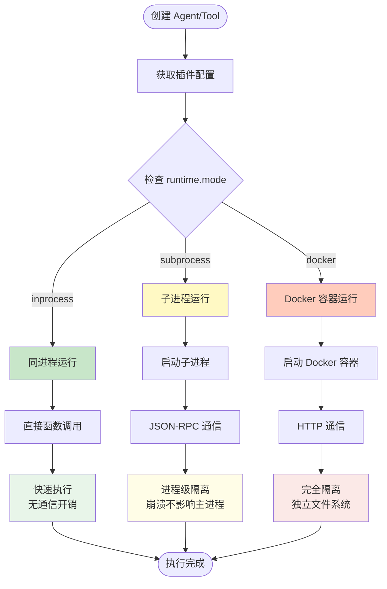
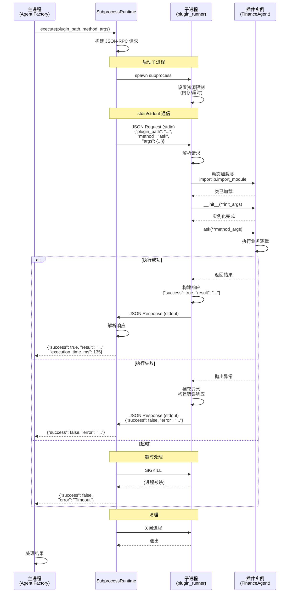
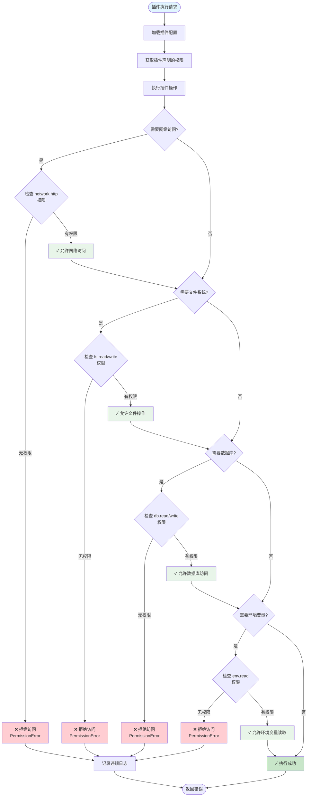
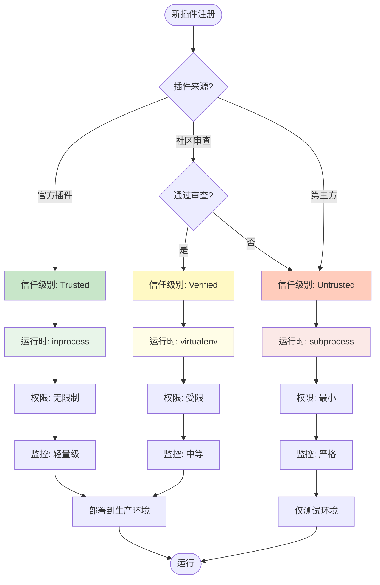
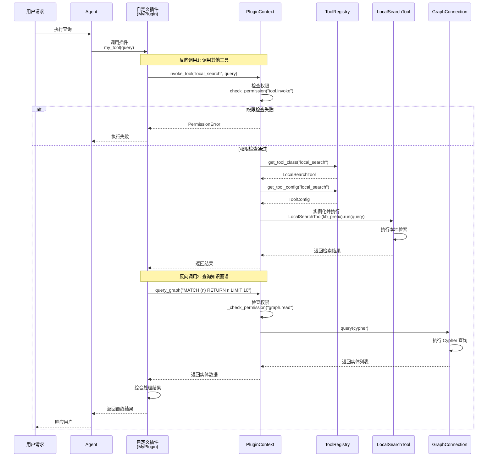
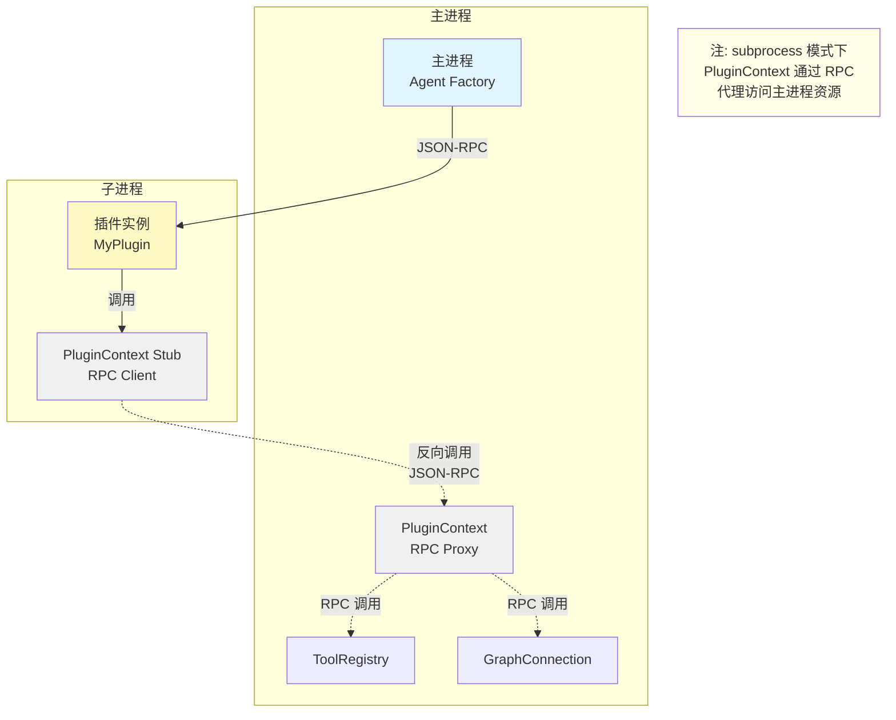

# Dify 插件系统 vs LangGraph/LangChain 插件系统对比分析

> 说明：本文为对比分析与规划草案，包含“参考实现/伪代码”。仓库当前可能并未实际存在文中提到的 `infrastructure.plugin_system.*` 模块与文件路径；请以代码仓库现状为准。

> **版本**: 1.0.0
> **日期**: 2026-01-17
> **目的**: 学习 Dify 插件设计，改进我们的插件系统

## 📋 目录

- [1. Dify 插件系统概述](#1-dify-插件系统概述)
- [2. 核心设计对比](#2-核心设计对比)
- [3. 架构设计分析](#3-架构设计分析)
- [4. 运行时机制](#4-运行时机制)
- [5. 插件类型对比](#5-插件类型对比)
- [6. 配置与打包](#6-配置与打包)
- [7. 安全与隔离](#7-安全与隔离)
- [8. 关键启示](#8-关键启示)
- [9. 改进建议](#9-改进建议)
- [10. 实施路线图](#10-实施路线图)

---

## 1. Dify 插件系统概述

### 1.1 Dify 简介

[Dify](https://dify.ai) 是一个开源的 LLM 应用开发平台，提供了完整的插件生态系统。

**核心特点**：
- **Beehive Architecture**（蜂巢架构）：模块化、独立、协作
- **插件市场**：社区驱动的插件生态
- **多语言 SDK**：Python、Node.js 等
- **安全隔离**：插件运行在独立环境

### 1.2 Dify 插件系统架构

```
┌─────────────────────────────────────────────────────────┐
│                   Dify Platform                          │
│                                                          │
│  ┌──────────────┐  ┌──────────────┐  ┌──────────────┐  │
│  │   Workflow   │  │    Agent     │  │   Chatflow   │  │
│  └──────┬───────┘  └──────┬───────┘  └──────┬───────┘  │
│         │                 │                 │           │
│         └─────────────────┼─────────────────┘           │
│                           │                             │
│                           ▼                             │
│              ┌─────────────────────────┐                │
│              │   Plugin Runtime        │                │
│              │   (独立进程/Serverless)  │                │
│              └─────────────────────────┘                │
│                           │                             │
│         ┌─────────────────┼─────────────────┐           │
│         │                 │                 │           │
│         ▼                 ▼                 ▼           │
│  ┌──────────┐      ┌──────────┐      ┌──────────┐      │
│  │  Tool    │      │  Model   │      │Extension │      │
│  │  Plugin  │      │  Plugin  │      │  Plugin  │      │
│  └──────────┘      └──────────┘      └──────────┘      │
│         │                 │                 │           │
└─────────┼─────────────────┼─────────────────┼───────────┘
          │                 │                 │
          ▼                 ▼                 ▼
   ┌──────────┐      ┌──────────┐      ┌──────────┐
   │External  │      │Custom    │      │HTTP      │
   │Tools     │      │Models    │      │Endpoints │
   └──────────┘      └──────────┘      └──────────┘
```

**参考资料**：
- [Dify Plugin System: Design and Implementation](https://dify.ai/blog/dify-plugin-system-design-and-implementation)
- [Introducing Dify Plugins](https://dify.ai/blog/introducing-dify-plugins)
- [Dify v1.0.0: Building a Vibrant Plugin Ecosystem](https://dify.ai/blog/dify-v1-0-building-a-vibrant-plugin-ecosystem)

---

## 2. 核心设计对比

### 2.1 设计理念

| 维度 | Dify | 我们的设计（草案） |
|------|------|------------------|
| **核心理念** | 独立运行时 + 反向调用 | 分层兼容 + 一次性切换 |
| **插件隔离** | 进程级隔离（subprocess/serverless） | 模块级隔离（Python import） |
| **通信方式** | 进程间通信（IPC/HTTP） | 函数调用 |
| **安全模型** | 沙箱 + 权限控制 | 代码审查 + Python import |
| **打包格式** | `.difypkg` 二进制包 | Python 模块目录 |
| **生态兼容** | Dify 专有 | LangChain 标准兼容 |

### 2.2 架构对比

**Dify 架构**：
```
Dify Platform
    ↓
Plugin Runtime (独立进程)
    ↓
Plugin Package (.difypkg)
    ↓
External Tool/Model/Endpoint
```

**我们的架构（草案）**：
```
LangGraph Agent
    ↓
Layer 3: Plugin Manager (可选)
    ↓
Layer 2: Tool Loader (可选)
    ↓
Layer 1: LangChain Tool (必需)
    ↓
Tool Implementation
```

### 2.3 优劣势对比

**Dify 优势**：
- ✅ **强隔离**：插件崩溃不影响主进程
- ✅ **安全性高**：沙箱环境，权限控制
- ✅ **可横向扩展**：serverless 部署
- ✅ **多语言支持**：不限于 Python

**Dify 劣势**：
- ❌ **性能开销**：进程间通信延迟
- ❌ **部署复杂**：需要插件运行时
- ❌ **学习成本**：全新的 SDK 和打包格式
- ❌ **生态独立**：与现有生态不兼容

**我们的优势**：
- ✅ **零学习成本**：Layer 1 就是 LangChain Tool
- ✅ **性能高**：无进程通信开销
- ✅ **部署简单**：标准 Python 模块
- ✅ **生态兼容**：完全兼容 LangChain

**我们的劣势**：
- ❌ **隔离弱**：插件错误可能影响主进程
- ❌ **安全性低**：插件可访问全局状态
- ❌ **单语言**：仅支持 Python

---

## 3. 架构设计分析

### 3.1 Dify 的 Beehive Architecture

**核心思想**：像蜂巢一样，每个插件是独立的"蜂房"，既独立又协作。

**实现方式**：
1. **独立包管理**：每个插件是独立的 package
2. **标准接口**：统一的 Plugin Protocol
3. **运行时隔离**：独立进程或 serverless 函数
4. **反向调用**：插件可调用 Dify 服务（Reverse Calls）

**示例结构**：
```
my-dify-plugin/
├── manifest.yaml          # 插件元数据
├── main.py                # 入口文件
├── requirements.txt       # 依赖
├── .env.example           # 配置示例
└── README.md              # 文档
```

**manifest.yaml 示例**：
```yaml
version: 1.0.0
type: tool
author:
  name: Your Name
  email: your@email.com
  url: https://yourwebsite.com
created_at: 2025-01-01
description:
  en_US: A sample tool plugin
  zh_Hans: 示例工具插件
icon: icon.svg
plugins:
  tools:
    - identity: my_tool
      provider: your_provider
      category: utilities
```

### 3.2 我们的分层架构（参考 Dify 改进）

**改进方向**：借鉴 Dify 的模块化思想，但保持 LangChain 兼容。

```
┌─────────────────────────────────────────────────────────┐
│            Layer 3: 高级扩展层（参考 Dify）              │
│                                                          │
│  ┌──────────────┐  ┌──────────────┐  ┌──────────────┐  │
│  │   Plugin     │  │   Plugin     │  │   Plugin     │  │
│  │   Package    │  │   Runtime    │  │   Manifest   │  │
│  │   (.pkg)     │  │   (Isolated) │  │   (YAML)     │  │
│  └──────────────┘  └──────────────┘  └──────────────┘  │
│                                                          │
└──────────────────────────┬───────────────────────────────┘
                           │
┌──────────────────────────┼───────────────────────────────┐
│            Layer 2: 插件管理层（轻量化）                  │
│                          │                                │
│  ┌──────────────┐  ┌─────┴────────┐  ┌──────────────┐  │
│  │   Simple     │  │   Tool       │  │   Config     │  │
│  │   Registry   │  │   Loader     │  │   Manager    │  │
│  └──────────────┘  └──────────────┘  └──────────────┘  │
│                                                          │
└──────────────────────────┬───────────────────────────────┘
                           │
┌──────────────────────────┼───────────────────────────────┐
│            Layer 1: LangChain 原生层（不变）              │
│                          │                                │
│              ┌───────────▼───────────┐                   │
│              │  LangChain @tool      │                   │
│              │  (标准兼容)            │                   │
│              └───────────────────────┘                   │
│                                                          │
└──────────────────────────────────────────────────────────┘
```

---

## 4. 运行时机制

### 4.1 Dify 的运行时机制

**本地部署**：
```
Dify Main Process
    ↓ (spawn subprocess)
Plugin Runtime Process
    ↓ (stdin/stdout pipe)
Plugin Code Execution
    ↓ (reverse call via IPC)
Dify Services (Model, Tool, App)
```

**特点**：
- 插件运行在独立子进程
- 通过 stdin/stdout 通信
- 父进程管理插件生命周期
- 依赖隔离（独立的 virtualenv）

**SaaS 部署**：
```
User Request
    ↓
Dify API Gateway
    ↓ (invoke Lambda)
AWS Lambda (Plugin Runtime)
    ↓ (callback)
Dify Core Services
```

**特点**：
- Serverless 函数
- 按需启动，自动扩展
- 完全隔离，高并发
- 按使用量计费

### 4.2 我们的运行时机制（基线方案）

```
LangGraph Agent
    ↓ (function call)
Tool Function (LangChain Tool)
    ↓ (direct import)
Tool Implementation
```

**特点**：
- 同进程执行
- 无通信开销
- 共享内存空间
- 简单快速

### 4.3 改进建议：混合运行时

**设计思路**：根据插件类型选择运行时模式。

```python
# 插件配置中声明运行时模式
# plugin.yaml
runtime:
  mode: "inprocess"  # inprocess | subprocess | serverless
  isolation: "none"  # none | virtualenv | docker
  timeout: 30        # 秒
  memory_limit: 512M # 内存限制
  cpu_shares: 1024   # CPU 份额
```

> 注：memory_limit/cpu_shares 需要 cgroups/容器等基础设施支持，非 Linux 环境多为 best-effort。

**运行时选择策略**：

| 插件类型 | 推荐运行时 | 隔离级别 | 理由 |
|---------|-----------|---------|------|
| **轻量工具** | inprocess | none | 性能优先，风险低，延迟最小 |
| **重型计算** | subprocess | virtualenv | 隔离崩溃，CPU 密集，避免阻塞主进程 |
| **不可信代码** | docker | docker | 安全隔离，完全沙箱 |
| **SaaS 部署** | serverless | cloud | 弹性扩展，按需计费 |

> 注：docker/serverless 依赖额外基础设施与运维，短期可先落地 inprocess + subprocess。

**MVP 落地建议**：
- 仅实现 inprocess + subprocess
- 插件更新流程：替换插件包/目录 → 重启插件进程 → 主服务无需重启

**详细实现：Subprocess 运行时**

> **注**：完整 MVP 接口定义与通信协议规范见《可配置插件架构设计文档》[Section 4.5: Subprocess Runtime（MVP）](./CONFIGURABLE_PLUGIN_ARCHITECTURE.md#45-subprocess-runtimemvp)。以下为参考实现示例。

```python
# backend/infrastructure/plugin_system/runtime/subprocess_runtime.py

import subprocess
import json
import sys
from pathlib import Path
from typing import Any, Dict
import logging
import signal
import time

logger = logging.getLogger(__name__)


class SubprocessRuntime:
    """子进程运行时

    使用独立 Python 进程运行插件，提供进程级隔离

    特性：
    - 独立内存空间
    - 崩溃不影响主进程
    - 资源限制（超时、内存、CPU）
    - 通过 stdin/stdout 进行 JSON-RPC 通信
    """

    def __init__(self, timeout: int = 30, memory_limit_mb: int = 512):
        """初始化

        Args:
            timeout: 执行超时时间（秒）
            memory_limit_mb: 内存限制（MB）
        """
        self.timeout = timeout
        self.memory_limit_mb = memory_limit_mb
        self._active_processes = {}  # 活跃进程追踪

    def execute(
        self,
        plugin_path: str,
        method: str,
        args: Dict[str, Any],
        timeout: int = None
    ) -> Dict[str, Any]:
        """在子进程中执行插件方法

        Args:
            plugin_path: 插件类路径（如 "plugins.finance_agent.agent:FinanceAgent"）
            method: 要调用的方法名
            args: 方法参数
            timeout: 执行超时（可选，覆盖默认值）

        Returns:
            {
                "success": bool,
                "result": Any,
                "error": str | None,
                "execution_time": float
            }
        """
        timeout = timeout or self.timeout
        start_time = time.time()

        try:
            # 构建请求
            request = {
                "plugin_path": plugin_path,
                "method": method,
                "args": args
            }

            # 启动子进程
            proc = self._spawn_plugin_process()

            logger.debug(f"Subprocess started (PID: {proc.pid}): {plugin_path}.{method}")

            # 发送请求并等待响应
            try:
                stdout, stderr = proc.communicate(
                    input=json.dumps(request).encode('utf-8'),
                    timeout=timeout
                )
            except subprocess.TimeoutExpired:
                proc.kill()
                proc.wait()
                raise TimeoutError(f"Plugin execution timeout after {timeout}s")

            # 检查进程退出状态
            if proc.returncode != 0:
                error_msg = stderr.decode('utf-8') if stderr else "Unknown error"
                raise RuntimeError(f"Plugin process failed (exit code {proc.returncode}): {error_msg}")

            # 解析响应
            response = json.loads(stdout.decode('utf-8'))

            execution_time = time.time() - start_time
            logger.info(f"Plugin executed successfully in {execution_time:.3f}s")

            return {
                "success": True,
                "result": response.get("result"),
                "error": None,
                "execution_time": execution_time
            }

        except TimeoutError as e:
            logger.error(f"Plugin timeout: {e}")
            return {
                "success": False,
                "result": None,
                "error": str(e),
                "execution_time": time.time() - start_time
            }

        except Exception as e:
            logger.error(f"Plugin execution failed: {e}")
            return {
                "success": False,
                "result": None,
                "error": str(e),
                "execution_time": time.time() - start_time
            }

    def _spawn_plugin_process(self) -> subprocess.Popen:
        """启动插件进程

        Returns:
            子进程对象
        """
        # 使用项目根目录下的 plugin_runner.py
        runner_path = Path(__file__).parent.parent / "plugin_runner.py"

        # 构建命令
        cmd = [
            sys.executable,  # 当前 Python 解释器
            str(runner_path),
            f"--memory-limit={self.memory_limit_mb}"
        ]

        # 启动进程
        proc = subprocess.Popen(
            cmd,
            stdin=subprocess.PIPE,
            stdout=subprocess.PIPE,
            stderr=subprocess.PIPE,
            env=self._get_subprocess_env()
        )

        return proc

    def _get_subprocess_env(self) -> Dict[str, str]:
        """获取子进程环境变量

        Returns:
            环境变量字典
        """
        import os
        env = os.environ.copy()

        # 设置资源限制环境变量
        env['PLUGIN_MEMORY_LIMIT_MB'] = str(self.memory_limit_mb)
        env['PLUGIN_TIMEOUT'] = str(self.timeout)

        return env


# backend/infrastructure/plugin_system/plugin_runner.py

"""
插件运行器 - 在独立进程中执行插件

通信协议：
- Input: JSON-RPC 请求（通过 stdin）
- Output: JSON-RPC 响应（通过 stdout）
- Errors: 错误信息（通过 stderr）

请求格式：
{
    "plugin_path": "plugins.finance_agent.agent:FinanceAgent",
    "method": "ask",
    "args": {"query": "test"}
}

响应格式：
{
    "success": true,
    "result": "..."
}
"""

import sys
import json
import logging
import traceback
import resource
import signal

# 配置日志（输出到 stderr，避免污染 stdout）
logging.basicConfig(
    stream=sys.stderr,
    level=logging.INFO,
    format='%(asctime)s - %(name)s - %(levelname)s - %(message)s'
)
logger = logging.getLogger(__name__)


def set_resource_limits():
    """设置资源限制"""
    import os

    # 读取环境变量
    memory_limit_mb = int(os.environ.get('PLUGIN_MEMORY_LIMIT_MB', 512))
    timeout = int(os.environ.get('PLUGIN_TIMEOUT', 30))

    # 设置内存限制（仅 Linux）
    if sys.platform == 'linux':
        try:
            # 设置虚拟内存限制
            memory_limit_bytes = memory_limit_mb * 1024 * 1024
            resource.setrlimit(resource.RLIMIT_AS, (memory_limit_bytes, memory_limit_bytes))
            logger.info(f"Memory limit set to {memory_limit_mb}MB")
        except Exception as e:
            logger.warning(f"Failed to set memory limit: {e}")

    # 设置超时（全局）
    def timeout_handler(signum, frame):
        raise TimeoutError(f"Execution timeout after {timeout}s")

    signal.signal(signal.SIGALRM, timeout_handler)
    signal.alarm(timeout)
    logger.info(f"Timeout set to {timeout}s")


def load_plugin_class(plugin_path: str):
    """动态加载插件类

    Args:
        plugin_path: 类路径（如 "plugins.finance_agent.agent:FinanceAgent"）

    Returns:
        加载的类
    """
    if ':' not in plugin_path:
        raise ValueError(f"Invalid plugin_path format: {plugin_path}")

    module_path, class_name = plugin_path.rsplit(':', 1)

    # 动态导入
    import importlib
    module = importlib.import_module(module_path)
    return getattr(module, class_name)


def execute_plugin(request: dict) -> dict:
    """执行插件方法

    Args:
        request: 请求字典

    Returns:
        响应字典
    """
    try:
        # 提取请求参数
        plugin_path = request['plugin_path']
        method = request['method']
        args = request.get('args', {})

        logger.info(f"Loading plugin: {plugin_path}")

        # 加载插件类
        plugin_class = load_plugin_class(plugin_path)

        logger.info(f"Instantiating plugin")

        # 实例化插件
        plugin_instance = plugin_class(**args.get('init_args', {}))

        logger.info(f"Calling method: {method}")

        # 调用方法
        if not hasattr(plugin_instance, method):
            raise AttributeError(f"Plugin {plugin_path} has no method '{method}'")

        method_func = getattr(plugin_instance, method)
        result = method_func(**args.get('method_args', {}))

        logger.info(f"Method executed successfully")

        return {
            "success": True,
            "result": result
        }

    except Exception as e:
        logger.error(f"Plugin execution failed: {e}")
        logger.error(traceback.format_exc())

        return {
            "success": False,
            "error": str(e),
            "traceback": traceback.format_exc()
        }


def main():
    """主入口"""
    try:
        # 设置资源限制
        set_resource_limits()

        logger.info("Plugin runner started, waiting for input...")

        # 读取 stdin（JSON 请求）
        input_data = sys.stdin.read()

        if not input_data:
            logger.error("No input received")
            sys.exit(1)

        # 解析请求
        request = json.loads(input_data)

        logger.info(f"Request received: {request.get('plugin_path', 'unknown')}.{request.get('method', 'unknown')}")

        # 执行插件
        response = execute_plugin(request)

        # 输出响应到 stdout
        print(json.dumps(response), flush=True)

        # 成功退出
        sys.exit(0)

    except Exception as e:
        logger.error(f"Fatal error: {e}")
        logger.error(traceback.format_exc())

        # 输出错误响应
        error_response = {
            "success": False,
            "error": str(e),
            "traceback": traceback.format_exc()
        }
        print(json.dumps(error_response), flush=True)

        # 错误退出
        sys.exit(1)


if __name__ == "__main__":
    main()
```

**使用示例**：

```python
# 使用 subprocess 运行时执行插件

from infrastructure.plugin_system.runtime.subprocess_runtime import SubprocessRuntime

# 创建运行时
runtime = SubprocessRuntime(timeout=30, memory_limit_mb=512)

# 执行插件方法
result = runtime.execute(
    plugin_path="plugins.finance_agent.agent:FinanceAgent",
    method="ask",
    args={
        "init_args": {
            "kb_prefix": "finance",
            "session_id": "test-123"
        },
        "method_args": {
            "query": "推荐一些优质股票"
        }
    }
)

if result["success"]:
    print(f"Result: {result['result']}")
    print(f"Execution time: {result['execution_time']:.3f}s")
else:
    print(f"Error: {result['error']}")
```

**与 Agent Factory 集成**：

```python
# backend/infrastructure/agents/rag_factory/factory.py

from infrastructure.plugin_system.runtime.subprocess_runtime import SubprocessRuntime

class RAGAgentFactory:
    def __init__(self):
        self.subprocess_runtime = SubprocessRuntime(timeout=60, memory_limit_mb=1024)

    def create_agent(self, agent_type: str, kb_prefix: str, session_id: str = None, use_subprocess: bool = False):
        """创建 Agent

        Args:
            agent_type: Agent 类型
            kb_prefix: 知识库前缀
            session_id: 会话 ID
            use_subprocess: 是否使用子进程运行时
        """
        from infrastructure.plugin_system.registry.agent_registry import agent_registry

        # 获取 Agent 配置
        agent_config = agent_registry.get_agent_config(agent_type)

        # 检查是否需要子进程运行时
        runtime_mode = agent_config.metadata.get('runtime', {}).get('mode', 'inprocess')

        if runtime_mode == 'subprocess' or use_subprocess:
            # 返回子进程代理包装器
            return SubprocessAgentProxy(
                runtime=self.subprocess_runtime,
                agent_type=agent_type,
                kb_prefix=kb_prefix,
                session_id=session_id
            )
        else:
            # 标准流程：直接实例化
            agent_class = agent_registry.get_agent_class(agent_type)
            return agent_class(kb_prefix=kb_prefix, session_id=session_id)


class SubprocessAgentProxy:
    """子进程 Agent 代理

    提供与标准 Agent 相同的接口，但在子进程中执行
    """

    def __init__(self, runtime: SubprocessRuntime, agent_type: str, kb_prefix: str, session_id: str = None):
        self.runtime = runtime
        self.agent_type = agent_type
        self.kb_prefix = kb_prefix
        self.session_id = session_id

        # 获取 Agent 类路径
        from infrastructure.plugin_system.registry.agent_registry import agent_registry
        config = agent_registry.get_agent_config(agent_type)
        self.class_path = config.class_path

    def ask(self, query: str, **kwargs) -> Dict[str, Any]:
        """同步问答（通过子进程）"""
        result = self.runtime.execute(
            plugin_path=self.class_path,
            method="ask",
            args={
                "init_args": {
                    "kb_prefix": self.kb_prefix,
                    "session_id": self.session_id
                },
                "method_args": {
                    "query": query,
                    **kwargs
                }
            }
        )

        if result["success"]:
            return result["result"]
        else:
            raise RuntimeError(f"Agent execution failed: {result['error']}")

    def ask_stream(self, query: str, **kwargs):
        """流式问答（暂不支持子进程流式传输）"""
        raise NotImplementedError("Streaming not supported in subprocess runtime")
```

#### 运行时选择流程图



#### Subprocess 通信时序图



---

## 5. 插件类型对比

### 5.1 Dify 插件类型

#### 5.1.1 Tool Plugin

**用途**：扩展外部工具能力（搜索、API 调用等）

**示例**：
```python
# Dify Tool Plugin 结构
from dify_plugin import Tool

class WeatherTool(Tool):
    def _run(self, location: str) -> str:
        """查询天气"""
        # 调用天气 API
        return f"{location} 的天气是晴天"

    def get_runtime_parameters(self):
        return [
            {
                "name": "location",
                "type": "string",
                "required": True,
                "description": "城市名称"
            }
        ]
```

#### 5.1.2 Model Plugin

**用途**：集成自定义模型（私有部署、fine-tuned 模型）

**示例**：
```python
# Dify Model Plugin 结构
from dify_plugin import LLMModel

class CustomLLM(LLMModel):
    def _invoke(self, prompt: str, **kwargs) -> str:
        # 调用自定义模型
        return self.model.generate(prompt)
```

#### 5.1.3 Extension Plugin

**用途**：轻量级 HTTP Endpoint 扩展

**示例**：
```python
# Dify Extension Plugin 结构
from dify_plugin import Extension

class DataProcessorExtension(Extension):
    def endpoint(self, request):
        """处理 HTTP 请求"""
        data = request.json()
        result = self.process(data)
        return {"result": result}
```

### 5.2 我们的插件类型（草案）

#### 5.2.1 Layer 1: LangChain Tool（基础）

```python
from langchain.tools import tool

@tool
def weather_tool(location: str) -> str:
    """查询天气"""
    return f"{location} 的天气是晴天"
```

**对比**：
- ✅ 更简洁（装饰器 vs 类继承）
- ✅ LangChain 生态兼容
- ❌ 缺少运行时参数定义

#### 5.2.2 Layer 2: Managed Tool（管理层）

```python
# tool.yaml
name: weather_tool
version: 1.0.0
entry_point: plugins.weather.tool:weather_tool  # module.path:callable
description: 查询天气工具
config:
  api_key: ${WEATHER_API_KEY}
```

**对比**：
- ✅ 支持配置管理
- ✅ 动态加载
- ❌ 不支持 Model/Extension

#### 5.2.3 Layer 3: Full Plugin（完整插件）

```python
from infrastructure.plugin_system.full_plugin import ToolPlugin, plugin

@plugin(name="weather", type="tool", version="1.0.0")
class WeatherPlugin(ToolPlugin):
    def load(self):
        self.api_key = self.config.get("api_key")
        return True

    def get_tool(self):
        @tool
        def weather(location: str) -> str:
            return self._query_weather(location, self.api_key)
        return weather
```

**对比**：
- ✅ 完整生命周期
- ✅ 配置管理
- ❌ 无进程隔离
- ❌ 单一类型（Tool）

### 5.3 启示：扩展插件类型

**借鉴 Dify，我们应该支持**：

1. **Tool Plugin**（基础能力）：LangChain Tool 包装
2. **Model Plugin**（规划新增）：自定义 LLM/Embeddings
3. **Node Plugin**（规划支持）：LangGraph 节点扩展
4. **Extension Plugin**（规划新增）：HTTP Endpoint

---

## 6. 配置与打包

### 6.1 Dify 配置格式

**manifest.yaml**（详细）：
```yaml
# 基本信息
version: 1.0.0
type: tool
author:
  name: GraphRAG Team
  email: team@graphrag.com
  url: https://graphrag.com
created_at: 2025-01-17
label:
  en_US: Weather Tool
  zh_Hans: 天气工具
description:
  en_US: Query weather information
  zh_Hans: 查询天气信息
icon: icon.svg

# 插件定义
plugins:
  tools:
    - identity: weather_query           # 工具标识
      provider: openweathermap           # 提供商
      category: utilities                # 分类
      description:
        en_US: Query current weather
        zh_Hans: 查询当前天气
      parameters:
        - name: location
          type: string
          required: true
          label:
            en_US: Location
            zh_Hans: 位置
          description:
            en_US: City name
            zh_Hans: 城市名称
          form: llm                       # LLM 填充
        - name: api_key
          type: secret-input              # 敏感信息
          required: true
          label:
            en_US: API Key
            zh_Hans: API 密钥
          form: form                      # 用户填写

# 权限声明
permissions:
  - network.http                          # 网络访问
  - storage.read                          # 读取存储

# 依赖
dependencies:
  python: ">=3.10"
  packages:
    - requests>=2.28.0
    - pydantic>=2.0.0

# 资源限制
resources:
  memory: 512MB
  timeout: 30s
```

**特点**：
- 多语言支持（i18n）
- 详细的参数定义
- 权限和资源声明
- 表单类型（llm/form）

### 6.2 我们的配置格式（最小方案）

**tool.yaml**（简化）：
```yaml
name: weather_tool
version: 1.0.0
author: GraphRAG Team
description: 查询天气工具

entry_point: plugins.weather.tool:weather_tool  # module.path:callable

config:
  api_key: ${WEATHER_API_KEY}

requires:
  - requests>=2.28.0
```

说明：`entry_point` 统一使用 `module.path:callable_or_class` 格式，避免歧义。

**对比**：
- ✅ 更简洁
- ❌ 缺少多语言支持
- ❌ 缺少权限声明
- ❌ 缺少资源限制

### 6.3 改进建议：增强配置格式

**plugin.yaml（v3.0 提案）**：
```yaml
# 基本信息
name: weather_tool
version: 1.0.0
type: tool
author:
  name: GraphRAG Team
  email: team@graphrag.com

# 多语言描述
label:
  en: Weather Tool
  zh: 天气工具
description:
  en: Query weather information
  zh: 查询天气信息

# 入口点
entry_point: plugins.weather.tool:WeatherTool  # module.path:ClassName

# 参数定义（参考 Dify）
parameters:
  - name: location
    type: string
    required: true
    label:
      en: Location
      zh: 位置
    default: "Beijing"

  - name: api_key
    type: secret
    required: true
    label:
      en: API Key
      zh: API 密钥
    env: WEATHER_API_KEY      # 从环境变量读取

# 运行时配置（新增）
runtime:
  mode: inprocess             # inprocess | subprocess | docker
  isolation: none             # none | virtualenv | docker
  timeout: 30                 # 超时时间（秒）
  memory_limit: 512M          # 内存限制（可选）

# 权限声明（新增）
permissions:
  - network.http              # HTTP 访问
  - env.read                  # 读取环境变量

# 依赖
dependencies:
  python: ">=3.10"
  langchain: ">=0.1.0"        # LangChain 版本要求
  packages:
    - requests>=2.28.0
    - pydantic>=2.0.0

# 兼容性（新增）
compatibility:
  langgraph: ">=0.2.0"
  platforms:
    - linux
    - darwin                  # macOS
    - win32                   # Windows
```

### 6.4 打包格式对比

**Dify**：
```bash
# 打包命令
dify-cli pack my-plugin/

# 输出
my-plugin.difypkg  # 二进制包

# 包结构（zip 格式）
my-plugin.difypkg
├── manifest.yaml
├── main.py
├── requirements.txt
├── icon.svg
└── .metadata/
    ├── checksum.txt
    └── signature.txt
```

**我们（最小形态）**：
```
my-tool/
├── tool.yaml
└── tool.py
```

**改进建议**：
```bash
# 打包命令（提议）
graphrag-plugin pack my-tool/

# 输出
my-tool.gragpkg  # 或使用 .zip

# 包结构
my-tool.gragpkg
├── plugin.yaml        # 元数据
├── tool.py            # 代码
├── requirements.txt   # 依赖
├── README.md          # 文档
├── icon.svg           # 图标（可选）
└── tests/             # 测试（可选）
    └── test_tool.py
```

---

## 7. 安全与隔离

### 7.1 Dify 的安全机制

#### 7.1.1 沙箱隔离

**进程隔离**：
```
Dify Main Process (PID 1000)
    ↓
Plugin Runtime (PID 2000)
    ↓ 独立内存空间
    ↓ 独立文件系统（可选 chroot）
    ↓ 资源限制（CPU/内存）
Plugin Code
```

**权限控制**：
```yaml
# manifest.yaml
permissions:
  - network.http        # HTTP 访问
  - storage.read        # 读取存储
  - storage.write       # 写入存储（慎用）
  - dify.app.invoke     # 调用 Dify App（反向调用）
```

**代码审查**：
- 所有 Marketplace 插件人工审查
- 静态代码分析
- 依赖安全扫描

#### 7.1.2 资源限制

```yaml
# manifest.yaml
resources:
  memory: 512MB          # 内存限制
  timeout: 30s           # 超时时间
  cpu: 0.5               # CPU 份额
```

**运行时强制**：
- 内存超限：自动终止
- 超时：强制中断
- CPU 限制：通过 cgroups（Linux）

### 7.2 我们的安全机制（规划草案）

**现状**：
- ❌ 无进程隔离
- ❌ 无权限控制
- ❌ 无资源限制
- ✅ 代码审查（手动）

**风险**：
- 插件可访问全局状态
- 插件崩溃影响主进程
- 恶意插件可读取敏感数据
- 无限循环/内存泄漏

### 7.3 改进建议：分级安全策略

**策略 1：信任级别**

| 级别 | 描述 | 隔离方式 | 适用场景 |
|------|------|---------|---------|
| **Trusted** | 官方插件 | 无隔离（inprocess） | 内置工具 |
| **Verified** | 社区审查 | 轻隔离（virtualenv） | Marketplace |
| **Untrusted** | 第三方 | 强隔离（subprocess/docker） | 测试环境 |

**策略 2：权限系统**

```python
# 插件权限检查
class PermissionChecker:
    PERMISSIONS = {
        "network.http": "HTTP 网络访问",
        "network.https": "HTTPS 网络访问",
        "fs.read": "文件系统读取",
        "fs.write": "文件系统写入",
        "env.read": "环境变量读取",
        "db.read": "数据库读取",
        "db.write": "数据库写入",
    }

    def check(self, plugin, permission):
        """检查插件是否有权限"""
        declared = plugin.metadata.get("permissions", [])
        if permission not in declared:
            raise PermissionError(f"插件 {plugin.name} 缺少权限: {permission}")
```

**策略 3：资源监控**

```python
# 资源监控装饰器
import signal
import resource

def with_timeout(seconds):
    def decorator(func):
        def handler(signum, frame):
            raise TimeoutError(f"执行超时: {seconds}s")

        def wrapper(*args, **kwargs):
            signal.signal(signal.SIGALRM, handler)
            signal.alarm(seconds)
            try:
                return func(*args, **kwargs)
            finally:
                signal.alarm(0)
        return wrapper
    return decorator

def with_memory_limit(mb):
    def decorator(func):
        def wrapper(*args, **kwargs):
            # 设置内存限制
            soft, hard = resource.getrlimit(resource.RLIMIT_AS)
            resource.setrlimit(resource.RLIMIT_AS, (mb * 1024 * 1024, hard))
            try:
                return func(*args, **kwargs)
            finally:
                resource.setrlimit(resource.RLIMIT_AS, (soft, hard))
        return wrapper
    return decorator
```

#### 权限检查流程图



#### 安全策略决策树



---

## 8. 关键启示

### 8.1 从 Dify 学到什么

#### 8.1.1 模块化设计

**Dify 的做法**：
- 每个插件是独立包
- 标准化的接口定义
- 清晰的职责边界

**我们的应用**：
```
当前：混合在一起
├── agents/
│   ├── base.py
│   ├── hybrid_agent.py  (包含工具定义)
│   └── graph_agent.py   (包含工具定义)

改进：完全分离
├── agents/              # Agent 核心
│   ├── base.py
│   └── hybrid_agent.py
├── tools/               # 工具插件（独立）
│   ├── local_search/
│   ├── global_search/
│   └── sentiment/
└── plugins/             # 插件系统
```

#### 8.1.2 配置驱动

**Dify 的做法**：
- 详细的 manifest.yaml
- 多语言支持
- 参数类型定义
- 权限声明

**我们的应用**：
- 增强 plugin.yaml 格式
- 支持环境变量
- 参数验证
- 权限系统

#### 8.1.3 反向调用（Reverse Calls）

**Dify 的创新**：插件可以调用平台服务

```python
# Dify Plugin 中调用平台服务
from dify_plugin import context

# 调用 Dify 的模型服务
response = context.invoke_model("gpt-4", prompt="Hello")

# 调用 Dify 的 App
result = context.invoke_app("my-app-id", inputs={"query": "test"})
```

**我们的应用**：
```python
# 插件中调用 GraphRAG 服务
from infrastructure.plugin_system.context import plugin_context

# 调用其他工具
result = plugin_context.invoke_tool("local_search", query="test")

# 访问知识图谱
entities = plugin_context.query_graph("MATCH (n) RETURN n LIMIT 10")
```

#### 8.1.4 插件市场

**Dify 的做法**：
- 集中式插件仓库
- 版本管理
- 评分和评论
- 自动更新

**我们的应用**（长期规划）：
- GitHub-based 插件仓库
- 版本管理（semver）
- CI/CD 自动测试
- 社区贡献

### 8.2 我们的独特优势

#### 8.2.1 LangChain 生态兼容

**优势**：
- 直接使用社区 LangChain Tools
- 无需重写现有工具
- 学习资源丰富

**保持策略**：
- Layer 1 永远兼容 LangChain
- Layer 2/3 是可选增强

#### 8.2.2 一次性切换策略

**优势**：
- 避免双轨维护
- 统一入口与配置
- 变更范围清晰（便于测试）

**实施策略**：
- 先准备完整配置与注册表
- 同一次发布中替换 Router/Factory/Tool Registry
- 切换前后各做一次全量回归测试

#### 8.2.3 知识图谱集成

**优势**：
- 深度集成 Neo4j
- GraphRAG 特有能力
- 图查询优化

**扩展方向**：
```python
# Graph Plugin（新类型）
from infrastructure.plugin_system.graph_plugin import GraphPlugin, plugin

@plugin(name="graph_analyzer", type="graph", version="1.0.0")
class GraphAnalyzerPlugin(GraphPlugin):
    def analyze(self, query: str):
        """图分析插件"""
        # 使用 Neo4j GDS
        result = self.graph.run_algorithm("pagerank", ...)
        return result
```

---

## 9. 改进建议

### 9.1 短期改进（1-2 个月）

#### 9.1.1 增强配置格式

**目标**：参考 Dify 的 manifest.yaml，增强我们的 plugin.yaml

**行动项**：
- [ ] 添加多语言支持（label/description）
- [ ] 添加参数类型定义
- [ ] 添加权限声明
- [ ] 添加资源限制

**示例**：
```yaml
# plugin.yaml (v3.0)
name: sentiment_analyzer
version: 1.0.0
type: tool

label:
  en: Sentiment Analyzer
  zh: 情感分析器

description:
  en: Analyze text sentiment
  zh: 分析文本情感

parameters:
  - name: text
    type: string
    required: true
    label:
      en: Text
      zh: 文本

permissions:
  - network.http

runtime:
  timeout: 30
  memory_limit: 512M
```

#### 9.1.2 添加权限系统

**目标**：控制插件能力范围

**行动项**：
- [ ] 定义权限列表
- [ ] 实现权限检查器
- [ ] 在工具执行前检查权限

**示例**：
```python
# backend/infrastructure/plugin_system/permissions.py

class PermissionManager:
    PERMISSIONS = {
        "network.http": "HTTP access",
        "fs.read": "File system read",
        "env.read": "Environment variables read",
        "graph.read": "Knowledge graph read",
        "graph.write": "Knowledge graph write",
    }

    def check(self, plugin_name: str, permission: str):
        """检查权限"""
        plugin = registry.get(plugin_name)
        declared = plugin.metadata.get("permissions", [])

        if permission not in declared:
            raise PermissionError(
                f"Plugin {plugin_name} requires permission: {permission}"
            )
```

#### 9.1.3 资源监控

**目标**：防止插件消耗过多资源

**行动项**：
- [ ] 实现超时控制
- [ ] 实现内存限制（可选）
- [ ] 添加执行日志

**示例**：
```python
# backend/infrastructure/plugin_system/execution.py

import signal
from contextlib import contextmanager

@contextmanager
def execution_limits(timeout=30, memory_mb=None):
    """执行限制上下文管理器"""
    def timeout_handler(signum, frame):
        raise TimeoutError(f"Execution timeout: {timeout}s")

    # 设置超时
    old_handler = signal.signal(signal.SIGALRM, timeout_handler)
    signal.alarm(timeout)

    try:
        yield
    finally:
        signal.alarm(0)
        signal.signal(signal.SIGALRM, old_handler)

# 使用
with execution_limits(timeout=30):
    result = plugin.execute(query)
```

> 注：`signal.alarm` 仅在类 Unix 主线程生效；Windows/多线程环境需改用线程或子进程超时方案。

### 9.2 中期改进（3-6 个月）

#### 9.2.1 混合运行时

**目标**：支持进程隔离（参考 Dify）

**行动项**：
- [ ] 实现 subprocess 运行时
- [ ] 设计进程间通信协议
- [ ] 插件可选择运行时模式

**架构**：
```
┌─────────────────────────────────────────┐
│         Plugin Runtime Selector          │
├─────────────────────────────────────────┤
│                                          │
│  if runtime == "inprocess":              │
│      ├─> Direct Function Call            │
│                                          │
│  elif runtime == "subprocess":           │
│      ├─> Spawn Process                   │
│      └─> IPC Communication               │
│                                          │
│  elif runtime == "docker":               │
│      ├─> Docker Container                │
│      └─> HTTP Communication              │
│                                          │
└─────────────────────────────────────────┘
```

**示例**：
```python
# backend/infrastructure/plugin_system/runtime/subprocess_runtime.py
#
# 简化示例（完整 MVP 接口定义见《可配置插件架构设计文档》Section 4.5）

import subprocess
import json

class SubprocessRuntime:
    """子进程运行时"""

    def execute(self, plugin_path: str, method: str, args: dict):
        """在子进程中执行插件"""
        # 启动子进程
        proc = subprocess.Popen(
            ["python", "-m", "infrastructure.plugin_system.plugin_runner"],
            stdin=subprocess.PIPE,
            stdout=subprocess.PIPE,
            stderr=subprocess.PIPE
        )

        # 发送请求
        request = json.dumps({
            "method": method,
            "args": args
        })

        # 等待响应
        stdout, stderr = proc.communicate(request.encode())

        # 解析结果
        result = json.loads(stdout.decode())
        return result
```

#### 9.2.2 反向调用（Reverse Calls）

**目标**：插件可调用平台服务

**行动项**：
- [ ] 设计 Plugin Context API
- [ ] 实现服务注册
- [ ] 权限控制

**示例**：
```python
# backend/infrastructure/plugin_system/context.py

class PluginContext:
    """插件上下文 - 提供反向调用能力"""

    def __init__(self, plugin_name: str, kb_prefix: str | None = None, session_id: str | None = None):
        # kb_prefix/session_id 由宿主在加载插件时注入
        self.plugin_name = plugin_name
        self.kb_prefix = kb_prefix
        self.session_id = session_id

    def invoke_tool(self, tool_name: str, **kwargs):
        """调用其他工具"""
        # 检查权限
        self._check_permission("tool.invoke")

        # 调用工具
        from infrastructure.plugin_system.registry.tool_registry import tool_registry
        tool_class = tool_registry.get_tool_class(tool_name)
        tool_config = tool_registry.get_tool_config(tool_name)
        if tool_config.requires_kb_prefix:
            tool = tool_class(kb_prefix=self.kb_prefix)
        else:
            tool = tool_class()
        return tool(**kwargs)

    def query_graph(self, cypher: str):
        """查询知识图谱"""
        # 检查权限
        self._check_permission("graph.read")

        # 执行查询
        from graphrag_agent.graph import GraphConnection
        conn = GraphConnection()
        return conn.query(cypher)

    # v3 strict: no built-in retrieval cache interface.

# 在插件中使用
from infrastructure.plugin_system.context import plugin_context

class MyPlugin(ToolPlugin):
    def get_tool(self):
        @tool
        def my_tool(query: str) -> str:
            # 调用其他工具
            result = plugin_context.invoke_tool("local_search", query=query)

            # 查询图谱
            entities = plugin_context.query_graph("MATCH (n) RETURN n LIMIT 10")

            return result
        return my_tool
```

> 注：subprocess/docker 模式下 PluginContext 应作为 RPC 代理，避免直接访问主进程资源。

#### 反向调用时序图



#### Subprocess 模式下的反向调用架构



---

**目标**：标准化插件打包

**行动项**：
- [ ] 开发 CLI 工具
- [ ] 定义包格式（.gragpkg）
- [ ] 包签名和验证

**示例**：
```bash
# 打包插件
$ graphrag-plugin pack my-tool/

✓ Validating plugin.yaml
✓ Checking dependencies
✓ Running tests
✓ Creating package
✓ Signing package

Package created: my-tool-1.0.0.gragpkg

# 安装插件
$ graphrag-plugin install my-tool-1.0.0.gragpkg

✓ Verifying signature
✓ Checking compatibility
✓ Installing dependencies
✓ Registering plugin

Plugin installed: my-tool@1.0.0
```

### 9.3 长期规划（6-12 个月）

#### 9.3.1 插件市场

**目标**：社区驱动的插件生态

**行动项**：
- [ ] 搭建插件仓库（GitHub-based）
- [ ] 自动化测试 CI/CD
- [ ] 插件评分系统
- [ ] 自动更新机制

**架构**：
```
┌────────────────────────────────────────────┐
│         Plugin Marketplace (GitHub)         │
├────────────────────────────────────────────┤
│                                             │
│  graphrag-plugins/                          │
│  ├── README.md                              │
│  ├── plugins/                               │
│  │   ├── sentiment-analyzer/               │
│  │   │   ├── plugin.yaml                   │
│  │   │   ├── tool.py                       │
│  │   │   └── README.md                     │
│  │   ├── graph-analyzer/                   │
│  │   └── web-scraper/                      │
│  ├── .github/workflows/                    │
│  │   └── test-plugin.yml  (CI/CD)          │
│  └── registry.json         (插件索引)       │
│                                             │
└────────────────────────────────────────────┘

# 用户安装
$ graphrag-plugin search sentiment
$ graphrag-plugin install sentiment-analyzer
```

#### 9.3.2 可视化插件编辑器

**目标**：低代码插件开发

**行动项**：
- [ ] 可视化编辑器（Web UI）
- [ ] 代码生成
- [ ] 在线测试

#### 9.3.3 插件分析和监控

**目标**：插件性能和安全监控

**行动项**：
- [ ] 执行时间统计
- [ ] 错误率监控
- [ ] 资源使用分析
- [ ] 安全告警

---

## 10. 实施路线图

### 10.1 Phase 1: 基础增强（Month 1-2）

**目标**：完善 Layer 2，参考 Dify 配置格式

| 任务 | 优先级 | 工作量 | 负责人 |
|------|--------|--------|--------|
| 增强 plugin.yaml 格式 | P0 | 3d | - |
| 实现权限系统 | P0 | 5d | - |
| 添加超时控制 | P1 | 2d | - |
| 完善文档 | P1 | 3d | - |

**交付物**：
- ✅ 增强的配置格式
- ✅ 权限检查器
- ✅ 超时控制
- ✅ 使用文档

### 10.2 Phase 2: 隔离运行时（Month 3-4）

**目标**：支持 subprocess 运行时

| 任务 | 优先级 | 工作量 | 负责人 |
|------|--------|--------|--------|
| 设计 IPC 协议 | P0 | 5d | - |
| 实现 subprocess runtime | P0 | 10d | - |
| 插件运行时选择 | P1 | 3d | - |
| 测试和优化 | P1 | 5d | - |

**交付物**：
- ✅ Subprocess 运行时
- ✅ IPC 通信
- ✅ 运行时选择机制

### 10.3 Phase 3: 生态建设（Month 5-6）

**目标**：插件打包和分发

| 任务 | 优先级 | 工作量 | 负责人 |
|------|--------|--------|--------|
| CLI 工具开发 | P0 | 8d | - |
| 打包格式定义 | P0 | 3d | - |
| 插件仓库搭建 | P1 | 5d | - |
| 示例插件开发 | P1 | 5d | - |

**交付物**：
- ✅ graphrag-plugin CLI
- ✅ .gragpkg 格式
- ✅ GitHub 插件仓库
- ✅ 5+ 示例插件

### 10.4 Phase 4: 高级特性（Month 7-12）

**目标**：完整插件生态

| 任务 | 优先级 | 工作量 | 负责人 |
|------|--------|--------|--------|
| 反向调用 API | P0 | 10d | - |
| 插件市场 | P1 | 15d | - |
| 可视化编辑器 | P2 | 20d | - |
| 监控和分析 | P2 | 10d | - |

**交付物**：
- ✅ Plugin Context API
- ✅ 插件市场（Beta）
- ✅ 可视化编辑器（可选）
- ✅ 监控系统

---

## 11. 总结

### 11.1 核心对比

| 维度 | Dify | 我们的设计 |
|------|------|-----------|
| **隔离性** | ⭐⭐⭐⭐⭐ 进程级 | ⭐⭐ 模块级 |
| **安全性** | ⭐⭐⭐⭐⭐ 沙箱 + 权限 | ⭐⭐ 代码审查 |
| **性能** | ⭐⭐⭐ IPC 开销 | ⭐⭐⭐⭐⭐ 函数调用 |
| **兼容性** | ⭐⭐ Dify 专有 | ⭐⭐⭐⭐⭐ LangChain 标准 |
| **易用性** | ⭐⭐⭐ 新 SDK | ⭐⭐⭐⭐⭐ 熟悉的 API |
| **生态** | ⭐⭐⭐⭐ Marketplace | ⭐⭐⭐ GitHub |

### 11.2 学习要点

**从 Dify 学到的**：
1. ✅ **模块化设计**：独立包管理
2. ✅ **配置驱动**：详细的 manifest
3. ✅ **权限系统**：细粒度权限控制
4. ✅ **资源限制**：超时、内存、CPU
5. ✅ **反向调用**：插件调用平台服务
6. ✅ **插件市场**：社区生态

**我们的独特优势**：
1. ✅ **LangChain 兼容**：零学习成本
2. ✅ **一次性切换**：避免双轨维护
3. ✅ **性能优先**：无 IPC 开销
4. ✅ **知识图谱**：深度集成 Neo4j

### 11.3 推荐策略

**短期（1-2 月）**：
- 增强配置格式（参考 Dify manifest）
- 添加权限系统
- 实现超时控制
- MVP：子进程运行时 + 插件进程重启（主服务无重启）

**中期（3-6 月）**：
- 完善 subprocess 运行时（更强隔离与资源限制）
- 实现反向调用
- 插件打包工具

**长期（6-12 月）**：
- 插件市场
- 可视化编辑器
- 监控和分析

**核心原则**：
- 🎯 **保持 LangChain 兼容**（Layer 1）
- 🎯 **一次性切换**（移除硬编码，避免双轨）
- 🎯 **借鉴不照搬**（适配我们的场景）
- 🎯 **安全优先**（权限 + 隔离）

---

## 参考资料

**Dify 官方资源**：
- [Dify Plugin System: Design and Implementation](https://dify.ai/blog/dify-plugin-system-design-and-implementation)
- [Introducing Dify Plugins](https://dify.ai/blog/introducing-dify-plugins)
- [Dify v1.0.0: Building a Vibrant Plugin Ecosystem](https://dify.ai/blog/dify-v1-0-building-a-vibrant-plugin-ecosystem)
- [Tool Plugin Documentation](https://docs.dify.ai/en/plugins/quick-start/develop-plugins/tool-plugin)
- [Extension Plugin Documentation](https://docs.dify.ai/en/plugins/quick-start/develop-plugins/extension-plugin)
- [GitHub - dify-plugins](https://github.com/langgenius/dify-plugins)
- [GitHub - dify-plugin-sdks](https://github.com/langgenius/dify-plugin-sdks)

**我们的文档**：
- [可配置插件架构设计文档（v3.0 草案）](./CONFIGURABLE_PLUGIN_ARCHITECTURE.md)

---

**文档更新记录**：

| 版本 | 日期 | 变更说明 |
|------|------|----------|
| 1.0.0 | 2026-01-17 | 初始版本 - Dify 对比分析 |
