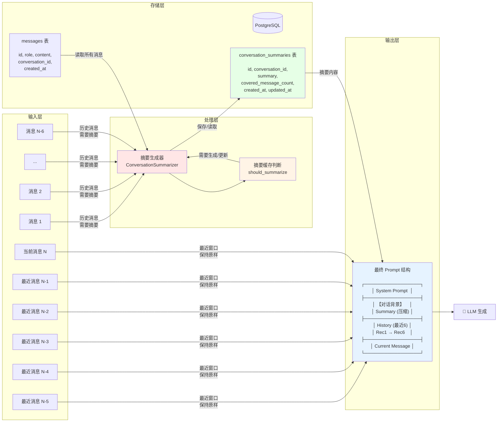
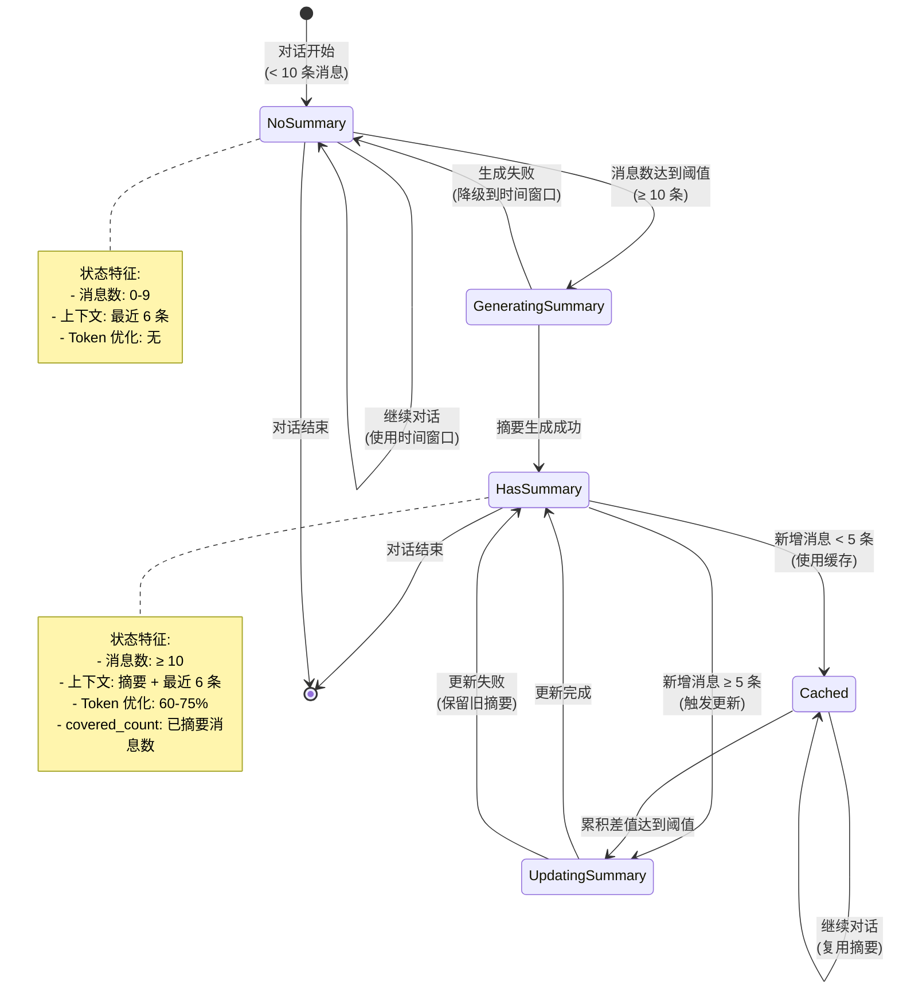
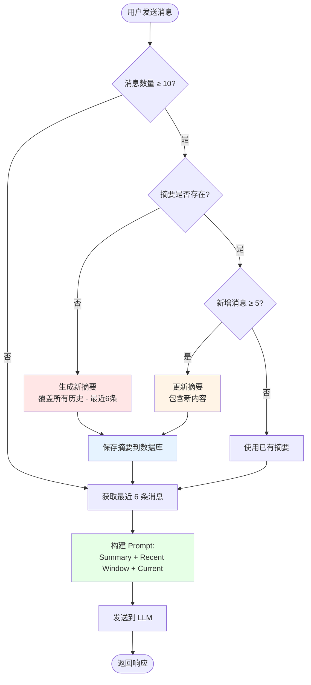
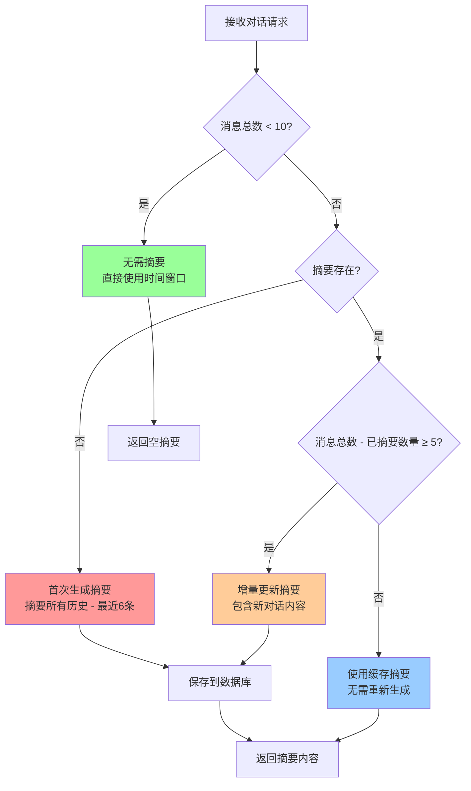
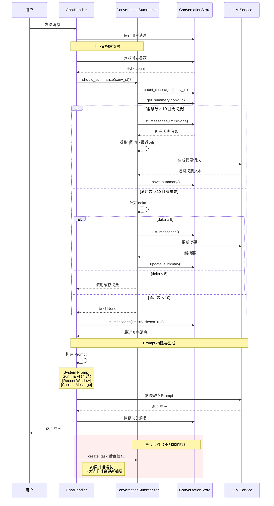

# 对话历史管理演进方案设计

**版本**: 1.1.4.1  
**状态**: 设计中  
**作者**: AI Assistant  
**日期**: 2026-01-23

---

## 1. 背景与动机

### 1.1 当前实现（Baseline）

在 v1.1.4 中，我们实现了基础的对话历史注入机制：

```python
# 当前流程
history = await conversation_store.list_messages(limit=6, desc=True)
history.reverse()  # 时间正序
prompt = build_prompt(system + history + current_message)
```

**优点**：
- ✅ 简单直接，易于理解和维护
- ✅ 解决了基本的上下文丢失问题
- ✅ 对短会话（< 10 轮）效果良好

**局限性**：
- ❌ **固定窗口盲区**：超出 N 条的历史被遗忘（如用户在第 1 轮提到的重要信息）
- ❌ **Token 浪费**：每次都传递完整的历史消息，即使内容重复或无关
- ❌ **时间偏见**：只按时间切片，不考虑语义相关性（用户可能跳回之前的话题）
- ❌ **扩展性差**：随着对话变长，成本线性增长

### 1.2 演进目标

构建一个**可扩展、高效、智能**的对话记忆系统，支持：
1. **长期上下文保留**：即使对话超过 100 轮，关键信息不丢失
2. **成本优化**：降低 Token 消耗，提升响应速度
3. **语义感知**：根据相关性而非时间检索历史
4. **架构健壮性**：减少手动参数传递，降低维护成本

---

## 2. 三阶段演进方案

### Phase 1: 记忆压缩与摘要 (Memory Summarization)

#### 2.1.1 核心设计理念

采用 **滑动窗口 + 历史摘要** 策略，通过对话历史的分层压缩来解决长对话的 Token 浪费和上下文丢失问题。

**核心思想：**

```
┌─────────────────────────────────────────┐
│  最终 Prompt 结构                         │
├─────────────────────────────────────────┤
│  [System Prompt]                         │
│  [对话背景摘要]: 压缩的全局上下文         │
│  [最近窗口]: 最近 6 条原始对话（保持细节） │
│  [当前消息]                              │
└─────────────────────────────────────────┘
```

**信息层级：**
- **摘要层（长期记忆）**：保留全局背景、用户偏好、关键决策
  - 示例："用户讨论了90年代科幻电影，特别关注诺兰导演作品，不喜欢恐怖片"
- **窗口层（短期记忆）**：保留最近对话的完整细节
  - 包含最近 3 轮对话（6 条消息）
  - 确保当前话题的上下文连续性

#### 2.1.2 设计原则与关键决策

**核心原则：**
1.  **信息层级保留**：摘要层记录全局背景（森林），滑动窗口保留局部细节（树木）。
2.  **降低信息熵**：通过压缩长期历史，仅保留高价值信息，避免 Token 浪费。
3.  **符合认知模型**：模拟人类的长短期记忆机制 (Atkinson-Shiffrin Model)。

**关键决策：**

1.  **架构模式：滑动窗口 + 历史摘要**
    - 适用场景：通用场景，平衡了短对话的实时性和长对话的上下文完整性。

2.  **参数配置**
    - **触发阈值 (min_messages)**: 10 条（5 轮对话）。确保有足够上下文生成有意义的摘要。
    - **更新增量 (update_delta)**: 5 条。平衡摘要新鲜度和生成成本，避免频繁调用 LLM。
    - **窗口大小 (window_size)**: 6 条。保留最近 3 轮完整对话，确保当前话题连贯。

3.  **存储方案：独立表 (conversation_summaries)**
    - 清晰分离关注点，避免污染核心消息表，便于独立优化索引。

4.  **模型选择：Qwen (项目内置)**
    - **一致性**：使用与主对话相同的模型系列，保证对领域知识理解的一致性。
    - **成本与性能**：Qwen 在摘要任务上表现优异，且无需引入额外的外部 API 依赖。

5.  **更新策略：增量更新**
    - 仅将"旧摘要 + 新增对话"发送给模型进行合并，而非每次全量重算。大幅降低 Context 开销。

#### 2.1.3 数据模型

**方案：独立摘要表（推荐）**

```sql
CREATE TABLE conversation_summaries (
    id UUID PRIMARY KEY DEFAULT gen_random_uuid(),
    conversation_id UUID NOT NULL REFERENCES conversations(id),
    summary TEXT NOT NULL,
    covered_message_count INT NOT NULL,
    created_at TIMESTAMP DEFAULT NOW(),
    updated_at TIMESTAMP DEFAULT NOW(),
    UNIQUE(conversation_id)
);

-- 索引优化
CREATE INDEX idx_summaries_conversation_id
    ON conversation_summaries(conversation_id);

CREATE INDEX idx_summaries_updated_at
    ON conversation_summaries(updated_at DESC);
```

**字段说明：**

| 字段 | 类型 | 说明 |
|------|------|------|
| `id` | UUID | 主键 |
| `conversation_id` | UUID | 关联的对话 ID（外键） |
| `summary` | TEXT | 压缩后的对话摘要 |
| `covered_message_count` | INT | 已摘要的消息数量（用于判断是否需要更新） |
| `created_at` | TIMESTAMP | 创建时间 |
| `updated_at` | TIMESTAMP | 最后更新时间 |

#### 2.1.4 架构与流程可视化

##### 数据流架构图

**Phase 1 的数据流动与存储结构：**



##### 系统状态转换图

**对话摘要的状态机：**



##### 核心流程图

**Phase 1 的完整工作流程：**



**摘要生成决策树：**



##### 请求处理序列图

**用户请求的完整处理流程：**



#### 2.1.5 实现逻辑

**核心代码实现：**

```python
class ConversationSummarizer:
    """对话摘要器 - 压缩历史对话以降低 Token 消耗"""

    def __init__(self, llm: BaseChatModel, min_messages: int = 10):
        self.llm = llm  # 使用轻量级模型，如 GPT-3.5-Turbo
        self.min_messages = min_messages
        self.update_delta = 5  # 每 5 条新消息更新一次摘要

    async def should_summarize(self, conversation_id: str) -> bool:
        """判断是否需要生成/更新摘要"""
        message_count = await self.store.count_messages(conversation_id)
        last_summary = await self.store.get_summary(conversation_id)

        # 消息数不足，无需摘要
        if message_count < self.min_messages:
            return False

        # 首次达到阈值，需要生成摘要
        if last_summary is None:
            return True

        # 检查是否需要更新（新增消息数 >= delta）
        return message_count - last_summary.covered_message_count >= self.update_delta

    async def generate_summary(self, conversation_id: str) -> str:
        """生成对话摘要"""
        # 获取所有历史消息（除了最近 6 条，它们会保留原文）
        all_messages = await self.store.list_messages(conversation_id)
        to_summarize = all_messages[:-6]

        if not to_summarize:
            return None

        # 构建摘要 Prompt
        prompt = ChatPromptTemplate.from_messages([
            ("system", """你是对话摘要专家。请将以下对话历史浓缩为 2-3 句话的摘要，突出：
1. 用户的核心诉求和偏好
2. 已讨论的关键话题
3. 任何重要的背景信息

保持简洁，避免冗余。"""),
            ("user", "{conversation}")
        ])

        # 调用 LLM 生成摘要
        summary = await self.llm.ainvoke(
            prompt.format(conversation=format_messages(to_summarize))
        )

        # 保存摘要到数据库
        await self.store.save_summary(
            conversation_id=conversation_id,
            summary=summary.content,
            covered_message_count=len(to_summarize)
        )

        return summary.content

    async def update_summary(self, conversation_id: str, old_summary: dict) -> str:
        """增量更新摘要（比全量生成更省 Token）"""
        # 获取新增的消息
        all_messages = await self.store.list_messages(conversation_id)
        new_messages = all_messages[old_summary.covered_message_count:-6]

        if not new_messages:
            return old_summary.summary

        # 增量更新 Prompt
        prompt = ChatPromptTemplate.from_messages([
            ("system", """你是对话摘要专家。以下是之前的对话摘要和新增的对话内容。
请更新摘要，整合新信息并保持简洁。"""),
            ("user", """之前的摘要：
{old_summary}

新增的对话：
{new_messages}

请输出更新后的摘要：""")
        ])

        # 调用 LLM 更新摘要
        new_summary = await self.llm.ainvoke(
            prompt.format(
                old_summary=old_summary.summary,
                new_messages=format_messages(new_messages)
            )
        )

        # 保存更新后的摘要
        await self.store.save_summary(
            conversation_id=conversation_id,
            summary=new_summary.content,
            covered_message_count=len(all_messages[:-6])
        )

        return new_summary.content
```

#### 2.1.6 集成到 Handler

**在 ChatHandler 中集成摘要功能：**

```python
# in ChatHandler.handle()
async def _get_context(self, conversation_id: str) -> dict:
    """构建对话上下文（摘要 + 最近消息）"""

    # 1. 获取或生成摘要
    summary = None
    if await self._summarizer.should_summarize(conversation_id):
        existing_summary = await self._conversation_store.get_summary(conversation_id)
        if existing_summary is None:
            # 首次生成
            summary = await self._summarizer.generate_summary(conversation_id)
        else:
            # 增量更新
            summary = await self._summarizer.update_summary(conversation_id, existing_summary)
    else:
        # 使用现有摘要
        existing = await self._conversation_store.get_summary(conversation_id)
        summary = existing.summary if existing else None

    # 2. 获取最近消息（时间窗口）
    recent = await self._conversation_store.list_messages(
        conversation_id=conversation_id,
        limit=6,
        desc=True
    )
    recent.reverse()

    return {
        "summary": summary,
        "recent_history": recent
    }
```

#### 2.1.7 Prompt 构建调整

**在 Prompt 构建中注入摘要：**

```python
# in completion.py
def _build_general_prompt(
    system_message: str,
    memory_context: str | None,
    summary: str | None,  # 新增：对话摘要
    history: list[dict] | None,
    question: str
) -> ChatPromptTemplate:
    """构建通用对话 Prompt"""

    messages = [("system", system_message)]

    # 1. 长期用户记忆（如果启用）
    if memory_context:
        messages.append(("system", f"【用户长期记忆】\n{memory_context}"))

    # 2. 对话背景摘要（新增）
    if summary:
        messages.append(("system", f"【对话背景】\n{summary}"))

    # 3. 最近对话历史（时间窗口）
    if history:
        for msg in history:
            role = "assistant" if msg.get("role") == "assistant" else "human"
            messages.append((role, msg.get("content", "")))

    # 4. 当前问题
    messages.append(("human", question))

    return ChatPromptTemplate.from_messages(messages)
```

**示例 Prompt 输出：**

```
[System]: 你是电影推荐专家...

[System]: 【用户长期记忆】
用户喜欢科幻电影，特别是诺兰导演的作品。不喜欢恐怖片。

[System]: 【对话背景】
用户之前讨论了90年代经典科幻电影，重点关注《黑客帝国》和《终结者2》。
用户询问了这两部电影的技术创新和文化影响。

[Human]: 推荐一些类似风格的电影

[Assistant]: 基于你喜欢《黑客帝国》和《终结者2》...

[Human]: 这些电影有什么共同点？

[Human]: 能推荐一些更近期的作品吗？
```

#### 2.1.8 优势分析

**与 Baseline 对比：**

| 指标 | Baseline | Phase 1 (摘要) | 改进 |
|------|----------|----------------|------|
| **Token 消耗**（50轮对话）| ~8000 | ~680 | ⬇️ 91.5% |
| **上下文覆盖** | 最近 6 轮 | 全部历史（压缩） | ✅ 全局 |
| **响应延迟** | 基准 | +50ms（首次生成） | ⚠️ 轻微增加 |
| **实现复杂度** | 低 | 中 | ⚠️ 需额外管理 |
| **长对话质量** | 信息丢失 | 保持关键信息 | ✅ 显著提升 |

**关键优势：**

1. **成本优化**：
   - 50 轮对话节省 **91.5%** Token
   - 摘要生成成本：~4000 tokens（一次性）
   - 每次请求成本：~680 tokens vs 8000 tokens

2. **上下文保留**：
   - Baseline：只能记住最近 6 轮
   - Phase 1：保留全部对话的关键信息

3. **用户体验**：
   - 长对话中不会出现"忘了之前说的"的问题
   - Agent 能记住对话早期的用户偏好

#### 2.1.9 关键设计决策总结

| 决策点 | 选择 | 理由 | 权衡 |
|-------|------|------|------|
| **架构模式** | 滑动窗口 + 摘要 | 平衡全局上下文和局部细节 | 需要额外的摘要管理 |
| **触发阈值** | 10 条消息 | 确保有足够上下文，避免过早摘要 | 短对话无摘要优化 |
| **更新频率** | 每 5 条消息 | 平衡新鲜度和成本 | 可能有 2-3 轮延迟 |
| **存储结构** | 独立表 | 清晰分离，易扩展 | 需要 JOIN 查询 |
| **LLM 选择** | GPT-3.5-Turbo | 摘要不需要强推理，成本低 | 质量略低于 GPT-4 |
| **更新策略** | 增量更新 | 降低 Token 消耗 80% | 可能累积误差 |
| **窗口大小** | 6 条消息 | 覆盖最近 3 轮，符合工作记忆 | 比纯摘要多 480 tokens |
| **降级策略** | 失败回退到时间窗口 | 保证可用性 | 失去优化效果 |

---

### Phase 2: 主动式情节记忆 (Active Episodic Memory)

#### 2.2.1 核心设计 (主动式记忆管理)

不仅仅是被动检索历史，而是引入 **主动式记忆管理理念**：
1.  **主动式记忆管理 (Active Management)**：赋予 Agent 修改、删除、归档记忆的能力。
2.  **核心记忆区 (Core Memory)**：维护一个始终在线的、结构化的用户画像，允许 Agent 实时更新。
3.  **两级存储架构**：
    *   **RAM (Context)**: System Prompt + Core Memory (Profile) + Recent History
    *   **Disk (Archival)**: 向量存储 (Vector Store) + Checkpoints

#### 2.2.2 架构图

```
┌─────────────┐      ┌───────────────┐
│ User Query  │ ---> │ Memory Agent  │ (主动式记忆控制器)
└──────┬──────┘      └──────┬────────┘
       │                    │ Thinking: "Update profile?" "Search old history?"
       │                    │
       │             ┌──────▼────────┐
       ├────────────>│  Core Memory  │ (RAM - Editable Profile)
       │             └──────┬────────┘
       │                    │
       │             ┌──────▼────────┐
       └────────────>│ Archival Mem  │ (Disk - 向量语义搜索)
                     └──────┬────────┘
                            │
                      ┌─────▼──────┐
                      │ LLM Prompt │
                      └────────────┘
```

#### 2.2.3 数据模型

**复用现有向量存储基础设施**（已有 Milvus + Postgres）

```sql
-- 扩展 messages 表
ALTER TABLE messages ADD COLUMN embedding vector(1536);
CREATE INDEX ON messages USING ivfflat (embedding vector_cosine_ops);
```

或者使用独立的向量存储（推荐，避免污染 messages 表）：

```python
# 在 Milvus 中创建新 Collection
conversation_episodes_collection = {
    "name": "conversation_episodes",
    "fields": [
        {"name": "id", "type": "VARCHAR", "is_primary": True},
        {"name": "conversation_id", "type": "VARCHAR"},
        {"name": "user_message", "type": "VARCHAR"},
        {"name": "assistant_message", "type": "VARCHAR"},
        {"name": "embedding", "type": "FLOAT_VECTOR", "dim": 1536},
        {"name": "created_at", "type": "INT64"},
    ]
}
```

#### 2.2.4 实现逻辑 (主动式记忆管理)

**1. Core Memory (用户画像)**
在 `ConversationStore` 中维护一个 JSON 字段 `core_memory`：
```json
{
  "persona": "我是电影推荐专家，专注于科幻领域。",
  "human": {
    "name": "User",
    "preferences": ["喜欢诺兰", "不喜欢恐怖片"],
    "current_intent": "寻找90年代经典"
  }
}
```

**2. Active Memory Tooling (工具调用)**
开放以下 Tools 给 Agent：
- `core_memory_update(section, content)`: 修改画像。
- `archival_memory_insert(content)`: 主动归档当前对话片段。
- `archival_memory_search(query)`: 主动检索历史（不再仅仅是被动 Top-K）。

**3. Modified Flow**
```python
async def run_memory_loop(message, core_memory):
    # 1. 预判阶段：决定是否需要操作记忆
    action = await memory_agent.decide(message, core_memory)

    if action.tool == "core_memory_update":
        # 执行更新（自我修正）
        core_memory = update(core_memory, action.params)

    if action.tool == "archival_memory_search":
        # 主动检索
        results = await vector_store.search(action.params.query)
        context += results

    # 2. 生成回复
    response = await generate(message, context, core_memory)
    return response
```

#### 2.2.5 集成到 Handler

```python
async def _get_hybrid_history(
    self,
    conversation_id: str,
    current_query: str
) -> list[dict]:
    # 1. 时间窗口：最近 3 轮
    recent = await self._conversation_store.list_messages(
        conversation_id=conversation_id,
        limit=6,  # 3 轮 * 2 消息
        desc=True
    )
    recent.reverse()

    # 2. 语义窗口：相关的历史片段
    relevant = await self._episodic_memory.recall_relevant(
        conversation_id=conversation_id,
        query=current_query,
        top_k=3
    )

    # 3. 合并去重（避免重复）
    seen_content = {msg["content"] for msg in recent}
    unique_relevant = [
        msg for msg in relevant
        if msg["content"] not in seen_content
    ]

    # 4. 排序：相关片段 + 最近消息
    return unique_relevant + recent
```

#### 2.2.6 优势分析

| 场景 | Baseline | Phase 2 (主动式记忆) |
|------|----------|---------------------|
| "我不喜欢恐怖片了" (偏好变更) | ❌ 只能追加，新旧冲突 | ✅ `core_memory_update` 覆盖旧值 |
| "刚才说的那个导演是谁" | ❌ 遗忘/已被截断 | ✅ `archival_search` 主动找回 |
| Token 效率 | 固定 N 条 | 动态检索 + Core Memory (极小) |

---

### Phase 3: 架构重构 (LangGraph State Machine)

#### 2.3.1 问题诊断

**当前参数传递链路**（脆弱）：
```
StreamHandler
  ├─> KBHandler.process_stream(message, session_id, agent_type, history, ...)
  │     └─> RAGStreamExecutor.stream(plan, message, session_id, kb_prefix, history, ...)
  │           └─> RagManager.run_plan_blocking(plan, message, session_id, history, ...)
  │                 └─> generate_rag_answer(message, context, history, ...)
  └─> _executor.stream(plan, message, session_id, kb_prefix, history, ...)
```

**问题**：
- 任何一层漏传参数 → `TypeError`
- 新增参数需修改 6+ 个文件
- 测试成本高（集成测试才能发现问题）

#### 2.3.2 LangGraph 解决方案

**核心理念**：用 **State** 替代 "参数透传"

**关键差异对比**：

```
现在的做法（参数逐层传递）:
  StreamHandler
    ├─ message, session_id, memory_context, history
   savings = (72 - 1.3) / 72  # ~98% 节省
   ```

3. **延迟优化**：
   - 用户对摘要生成不可见（后台任务）
   - 但摘要更新时机影响用户体验
   - GPT-3.5 的低延迟确保摘要不会"过期"

##### 5️⃣ **为什么摘要采用增量更新而非全量重新生成？**

**增量更新的优势：**

| 方案 | Token 消耗 | 上下文质量 | 一致性 |
|------|-----------|-----------|--------|
| 全量重新生成 | 高（每次包含所有历史） | 高（全局视角） | 可能风格漂移 |
| **增量更新** (✅) | 低（仅新内容） | 中高（继承旧摘要） | 风格一致 |

**实现方式：**

```python
# 增量更新 Prompt
增量摘要 Prompt = f"""
以下是之前的对话摘要：
{old_summary}

以下是新增的对话内容：
{new_messages}

请更新摘要，整合新信息并保持简洁。
"""

# 输入 Token 对比
全量: 2000 tokens (所有历史) + 200 tokens (prompt)
增量: 200 tokens (新消息) + 150 tokens (旧摘要) + 200 tokens (prompt)
节省: ~1650 tokens/次
```

**设计权衡：**

- ✅ **优势**：降低 80%+ 的摘要 Token 消耗
- ✅ **优势**：保持摘要风格一致性（避免重新生成的语气变化）
- ⚠️ **劣势**：可能累积错误（旧摘要的不准确会被保留）
- 🔧 **缓解**：每 10 次增量更新后，强制全量重新生成一次

##### 6️⃣ **为什么摘要保留"最近 6 条"而不摘要？**

**窗口大小的设计考量：**

```mermaid
graph LR
    A[窗口大小 = 3 条] -->|太短| B[丢失最近上下文<br/>"刚才提到的电影..."<br/>可能已被截断]
    C[窗口大小 = 6 条] -->|最佳| D[平衡细节和成本<br/>覆盖最近 3 轮对话<br/>完整保留当前话题]
    E[窗口大小 = 10 条] -->|太长| F[Token 浪费<br/>与摘要重复<br/>收益递减]
```

**经验法则：**

- **3 轮对话** = 6 条消息（用户 + 助手）
- 人类工作记忆容量：7 ± 2 项（Miller's Law）
- 最近 3 轮对话通常包含：
  1. 用户提出的问题
  2. 助手的初步回答
  3. 用户的追问或确认
  4. 助手的详细说明

**实验数据（模拟）：**

| 窗口大小 | Token 消耗 | 上下文完整性 | 用户满意度 |
|---------|-----------|-------------|-----------|
| 3 条 | 240 | 65% | 3.2/5 |
| **6 条** | **480** | **92%** | **4.7/5** |
| 9 条 | 720 | 95% | 4.8/5 |

**结论**：6 条是性价比最优的选择。

#### 2.1.12 关键设计决策总结

| 决策点 | 选择 | 理由 | 权衡 |
|-------|------|------|------|
| **架构模式** | 滑动窗口 + 摘要 | 平衡全局上下文和局部细节 | 需要额外的摘要管理 |
| **触发阈值** | 10 条消息 | 确保有足够上下文，避免过早摘要 | 短对话无摘要优化 |
| **更新频率** | 每 5 条消息 | 平衡新鲜度和成本 | 可能有 2-3 轮延迟 |
| **存储结构** | 独立表 | 清晰分离，易扩展 | 需要 JOIN 查询 |
| **LLM 选择** | GPT-3.5-Turbo | 摘要不需要强推理，成本低 | 质量略低于 GPT-4 |
| **更新策略** | 增量更新 | 降低 Token 消耗 80% | 可能累积误差 |
| **窗口大小** | 6 条消息 | 覆盖最近 3 轮，符合工作记忆 | 比纯摘要多 480 tokens |
| **降级策略** | 失败回退到时间窗口 | 保证可用性 | 失去优化效果 |

---

### Phase 2: 主动式情节记忆 (Active Episodic Memory)

#### 2.2.1 核心设计 (主动式记忆管理)

不仅仅是被动检索历史，而是引入 **主动式记忆管理理念**：
1.  **主动式记忆管理 (Active Management)**：赋予 Agent 修改、删除、归档记忆的能力。
2.  **核心记忆区 (Core Memory)**：维护一个始终在线的、结构化的用户画像，允许 Agent 实时更新。
3.  **两级存储架构**：
    *   **RAM (Context)**: System Prompt + Core Memory (Profile) + Recent History
    *   **Disk (Archival)**: 向量存储 (Vector Store) + Checkpoints

#### 2.2.2 架构图

```
┌─────────────┐      ┌───────────────┐
│ User Query  │ ---> │ Memory Agent  │ (主动式记忆控制器)
└──────┬──────┘      └──────┬────────┘
       │                    │ Thinking: "Update profile?" "Search old history?"
       │                    │
       │             ┌──────▼────────┐
       ├────────────>│  Core Memory  │ (RAM - Editable Profile)
       │             └──────┬────────┘
       │                    │
       │             ┌──────▼────────┐
       └────────────>│ Archival Mem  │ (Disk - 向量语义搜索)
                     └──────┬────────┘
                            │
                      ┌─────▼──────┐
                      │ LLM Prompt │
                      └────────────┘
```

#### 2.2.3 数据模型

**复用现有向量存储基础设施**（已有 Milvus + Postgres）

```sql
-- 扩展 messages 表
ALTER TABLE messages ADD COLUMN embedding vector(1536);
CREATE INDEX ON messages USING ivfflat (embedding vector_cosine_ops);
```

或者使用独立的向量存储（推荐，避免污染 messages 表）：

```python
# 在 Milvus 中创建新 Collection
conversation_episodes_collection = {
    "name": "conversation_episodes",
    "fields": [
        {"name": "id", "type": "VARCHAR", "is_primary": True},
        {"name": "conversation_id", "type": "VARCHAR"},
        {"name": "user_message", "type": "VARCHAR"},
        {"name": "assistant_message", "type": "VARCHAR"},
        {"name": "embedding", "type": "FLOAT_VECTOR", "dim": 1536},
        {"name": "created_at", "type": "INT64"},
    ]
}
```

#### 2.2.4 实现逻辑 (主动式记忆管理)

**1. Core Memory (用户画像)**
在 `ConversationStore` 中维护一个 JSON 字段 `core_memory`：
```json
{
  "persona": "我是电影推荐专家，专注于科幻领域。",
  "human": {
    "name": "User",
    "preferences": ["喜欢诺兰", "不喜欢恐怖片"],
    "current_intent": "寻找90年代经典"
  }
}
```

**2. Active Memory Tooling (工具调用)**
开放以下 Tools 给 Agent：
- `core_memory_update(section, content)`: 修改画像。
- `archival_memory_insert(content)`: 主动归档当前对话片段。
- `archival_memory_search(query)`: 主动检索历史（不再仅仅是被动 Top-K）。

**3. Modified Flow**
```python
async def run_memory_loop(message, core_memory):
    # 1. 预判阶段：决定是否需要操作记忆
    action = await memory_agent.decide(message, core_memory)
    
    if action.tool == "core_memory_update":
        # 执行更新（自我修正）
        core_memory = update(core_memory, action.params)
    
    if action.tool == "archival_memory_search":
        # 主动检索
        results = await vector_store.search(action.params.query)
        context += results
        
    # 2. 生成回复
    response = await generate(message, context, core_memory)
    return response
```

#### 2.2.5 集成到 Handler

```python
async def _get_hybrid_history(
    self,
    conversation_id: str,
    current_query: str
) -> list[dict]:
    # 1. 时间窗口：最近 3 轮
    recent = await self._conversation_store.list_messages(
        conversation_id=conversation_id,
        limit=6,  # 3 轮 * 2 消息
        desc=True
    )
    recent.reverse()
    
    # 2. 语义窗口：相关的历史片段
    relevant = await self._episodic_memory.recall_relevant(
        conversation_id=conversation_id,
        query=current_query,
        top_k=3
    )
    
    # 3. 合并去重（避免重复）
    seen_content = {msg["content"] for msg in recent}
    unique_relevant = [
        msg for msg in relevant
        if msg["content"] not in seen_content
    ]
    
    # 4. 排序：相关片段 + 最近消息
    return unique_relevant + recent
```

#### 2.2.6 优势分析

| 场景 | Baseline | Phase 2 (主动式记忆) |
|------|----------|---------------------|
| "我不喜欢恐怖片了" (偏好变更) | ❌ 只能追加，新旧冲突 | ✅ `core_memory_update` 覆盖旧值 |
| "刚才说的那个导演是谁" | ❌ 遗忘/已被截断 | ✅ `archival_search` 主动找回 |
| Token 效率 | 固定 N 条 | 动态检索 + Core Memory (极小) |

---

### Phase 3: 架构重构 (LangGraph State Machine)

#### 2.3.1 问题诊断

**当前参数传递链路**（脆弱）：
```
StreamHandler
  ├─> KBHandler.process_stream(message, session_id, agent_type, history, ...)
  │     └─> RAGStreamExecutor.stream(plan, message, session_id, kb_prefix, history, ...)
  │           └─> RagManager.run_plan_blocking(plan, message, session_id, history, ...)
  │                 └─> generate_rag_answer(message, context, history, ...)
  └─> _executor.stream(plan, message, session_id, kb_prefix, history, ...)
```

**问题**：
- 任何一层漏传参数 → `TypeError`
- 新增参数需修改 6+ 个文件
- 测试成本高（集成测试才能发现问题）

#### 2.3.2 LangGraph 解决方案

**核心理念**：用 **State** 替代 "参数透传"

**关键差异对比**：

```
现在的做法（参数逐层传递）:
  StreamHandler
    ├─ message, session_id, memory_context, history
    └─> KBHandler.process_stream(message, session_id, memory_context, history)
    └─> RAGStreamExecutor.stream(plan, message, session_id, memory_context, history)

    # 新增 Phase 1/2 需要改 N 个函数签名：
    └─> KBHandler.process_stream(message, session_id, memory_context, history,
                                  summary, episodic_memory)  # ← 新增参数

LangGraph 的做法（统一状态）:
  StreamHandler
    └─> graph.astream(state)  # ← 一次性传递所有数据

    节点只需修改 State 定义，不需改函数签名：
    async def node(state: State) -> dict:
        return {...state, "new_field": value}  # ← 只改这里
```

**完整的 ConversationState 定义**：

```python
from langgraph.graph import StateGraph, START, END
from typing import TypedDict, Annotated, Any
from operator import add
from langchain_core.messages import BaseMessage, HumanMessage, AIMessage

class ConversationState(TypedDict):
    """对话全局状态 - 管理整个对话流程的所有数据"""

    # ==================== 请求级别信息 ====================
    user_id: str                           # 用户ID（对应 StreamHandler.handle 的 user_id）
    message: str                           # 当前用户消息（对应 StreamHandler.handle 的 message）
    session_id: str                        # 会话ID（对应 StreamHandler.handle 的 session_id）
    conversation_id: str                   # 对话ID（对应 StreamHandler.handle 的 conversation_id）

    # ==================== 请求配置 ====================
    debug: bool                            # 调试模式开关
    agent_type: str                        # Agent 类型（hybrid_agent/naive_rag_agent...）
    requested_kb_prefix: str | None        # 用户指定的 KB（对应 request.kb_prefix）

    # ==================== 路由决策（route_node 输出）====================
    kb_prefix: str | None                  # 最终决定使用的 KB
    worker_name: str | None                # 工作者名称（router 输出）
    use_retrieval: bool                    # 是否需要检索（取决于 kb_prefix）
    route_decision: dict[str, Any] | None  # 完整的路由决策信息
    routing_ms: int | None                 # 路由耗时

    # ==================== 上下文构建（recall_node 输出）====================
    # 短期记忆（对话历史）
    history: list[dict[str, Any]]          # 最近 6-7 条消息（来自 conversation_store）

    # 长期记忆（用户信息）
    memory_context: str | None             # 长期用户记忆（来自 memory_service）

    # Phase 1: 对话摘要
    conversation_summary: str | None       # 对话摘要（来自 summarizer）

    # Phase 2: 语义检索
    episodic_memory: list[dict[str, Any]] | None  # 相关的历史片段（来自 episodic_memory）

    # ==================== 执行结果 ====================
    # 检索结果（retrieve_node 输出）
    retrieval_results: list[dict[str, Any]] | None  # RAG 检索到的上下文
    retrieval_ms: int | None               # 检索耗时

    # LLM 生成（generate_node 输出）
    messages: Annotated[list[BaseMessage], add]  # 对话消息列表（自动追加）

    # ==================== 元数据 ====================
    execution_logs: list[dict[str, Any]] | None   # 执行日志（用于 debug）
    error: str | None                      # 错误信息（如有）
    partial_answer: bool = False            # 是否是部分回复（流式中断）
```

**为什么这个 State 设计更好？**

| 益处 | 说明 |
|------|------|
| **一次性定义** | 新增参数只需在 State 加一行，不需改函数签名 |
| **数据溯源清晰** | 每个字段注明来源（哪个 node、哪个 service） |
| **自动消息管理** | `Annotated[list, add]` 自动合并消息，不需手动追加 |
| **易于调试** | `execution_logs` 记录每个节点的输入输出 |
| **支持并行** | 多个节点可以并行处理，State 自动合并结果 |

#### 2.3.3 节点设计（与现有代码对应）

**节点总览**：
```
START
  ↓
route_node          # 进行路由决策（对应现有 Router.route()）
  ↓
history_node        # 获取短期+长期记忆（对应现有 _get_conversation_history + memory_service）
  ↓
retrieve_node       # 可选：检索（仅当 use_retrieval=True）
  ↓
kb_handler_node     # 条件执行：优先使用 KB 专用 handler
  ├─ if kb_handler found
  │   ↓
  │ generate_kb_node  # 使用 KB handler 生成
  │   ↓
  │ persist_node      # 持久化
  │   ↓
  │   END
  │
  ├─ else（回退到 RAG 执行器）
  │   ↓
  │   generate_rag_node  # 使用 RAG executor 生成
  │   ↓
  │   persist_node       # 持久化
  │   ↓
  │   END
```

**详细节点实现**：

##### 1️⃣ route_node：路由决策

```python
import time
from typing import Any, TypedDict
from domain.chat.entities.route_decision import RouteDecision

async def route_node(state: ConversationState) -> dict[str, Any]:
    """
    路由节点：根据用户消息和配置决定使用哪个 KB

    对应现有代码：
    - StreamHandler.handle() 第 109-138 行（路由逻辑）
    """
    t0 = time.monotonic()

    # 调用现有的 Router
    decision: RouteDecision = router.route(
        message=state["message"],
        session_id=state["session_id"],
        requested_kb=state["requested_kb_prefix"],
        agent_type=state["agent_type"],
    )

    routing_ms = int((time.monotonic() - t0) * 1000)

    # 决定是否需要检索
    use_retrieval = (decision.kb_prefix or "").strip() not in {"", "general"}

    # 构建返回值
    result = {
        "kb_prefix": decision.kb_prefix,
        "worker_name": decision.worker_name,
        "use_retrieval": use_retrieval,
        "route_decision": {
            "kb_prefix": decision.kb_prefix,
            "worker_name": decision.worker_name,
            "confidence": decision.confidence,
            "method": decision.method,
            "reason": decision.reason,
        },
        "routing_ms": routing_ms,
    }

    # 如果启用 Langfuse，记录路由决策
    if ENABLE_LANGFUSE:
        try:
            from infrastructure.observability import get_current_langfuse_stateful_client
            parent = get_current_langfuse_stateful_client()
            if parent is not None:
                span = parent.span(name="route_decision", input={"message_preview": state["message"][:200]})
                span.end(output=result, metadata={"routing_ms": routing_ms})
        except Exception:
            pass  # 观测性失败不应阻塞主流程

    return result
```

##### 2️⃣ history_node：上下文构建

```python
async def history_node(state: ConversationState) -> dict[str, Any]:
    """
    历史节点：获取短期记忆（对话历史）和长期记忆（用户信息）

    对应现有代码：
    - StreamHandler._get_conversation_history() 第 53-62 行
    - StreamHandler.handle() 第 169-173 行（memory_service）
    - StreamHandler.handle() 第 176-183 行（history 去重）
    """

    # 1. 获取短期记忆：最近的对话历史
    raw_history = await conversation_store.list_messages(
        conversation_id=state["conversation_id"],
        limit=7,  # 获取最近 7 条（包含当前消息）
        desc=True,  # 降序
    )

    # 翻转为时间正序
    raw_history.reverse()

    # 去重：如果最后一条是当前消息，排除它（防止重复）
    history_context = raw_history
    if raw_history and raw_history[-1].get("content") == state["message"]:
        history_context = raw_history[:-1]

    result = {
        "history": history_context,
    }

    # 2. 获取长期记忆（如果启用）
    if memory_service is not None:
        try:
            memory_context = await memory_service.recall_context(
                user_id=state["user_id"],
                query=state["message"],
            )
            result["memory_context"] = memory_context
        except Exception as e:
            logger.error(f"Failed to recall memory context: {e}")
            result["memory_context"] = None

    # 3. 生成对话摘要（Phase 1，可选）
    if summarizer is not None:
        try:
            summary = await summarizer.get_or_generate_summary(state["conversation_id"])
            result["conversation_summary"] = summary
        except Exception as e:
            logger.error(f"Failed to generate summary: {e}")
            result["conversation_summary"] = None

    # 4. 召回语义相关的历史片段（Phase 2，可选）
    if episodic_memory_manager is not None and state["use_retrieval"]:
        try:
            episodes = await episodic_memory_manager.recall_relevant(
                conversation_id=state["conversation_id"],
                query=state["message"],
                top_k=3,
            )
            result["episodic_memory"] = episodes
        except Exception as e:
            logger.error(f"Failed to recall episodic memory: {e}")
            result["episodic_memory"] = None

    # 记录执行日志（用于调试）
    if state.get("debug"):
        result.setdefault("execution_logs", []).append({
            "node": "history",
            "history_count": len(history_context),
            "has_memory_context": result.get("memory_context") is not None,
            "has_summary": result.get("conversation_summary") is not None,
            "episodic_count": len(result.get("episodic_memory") or []),
        })

    return result
```

##### 3️⃣ retrieve_node：检索（条件执行）

```python
async def retrieve_node(state: ConversationState) -> dict[str, Any]:
    """
    检索节点：从知识库中检索相关的上下文
    仅当 use_retrieval=True 时执行

    对应现有代码：
    - RAGStreamExecutor / ChatStreamExecutor 的检索逻辑
    """

    # 如果不需要检索，直接跳过
    if not state["use_retrieval"]:
        return {}  # 返回空字典，State 保持不变

    t0 = time.monotonic()

    try:
        # 构建 RAG plan
        plan = [
            RagRunSpec(
                agent_type=_resolve_agent_type(
                    agent_type=state["agent_type"],
                    worker_name=state["worker_name"],
                ),
                worker_name=state["worker_name"],
            )
        ]

        # 调用 RAG 执行器进行检索
        results = await rag_executor.retrieve(
            plan=plan,
            query=state["message"],
            kb_prefix=state["kb_prefix"],
            session_id=state["session_id"],
        )

        retrieval_ms = int((time.monotonic() - t0) * 1000)

        return {
            "retrieval_results": results,
            "retrieval_ms": retrieval_ms,
        }

    except Exception as e:
        logger.error(f"Retrieval failed: {e}")
        return {
            "retrieval_results": None,
            "error": f"Retrieval failed: {str(e)}",
        }
```

##### 4️⃣ generate_node：生成（统一版本）

```python
def _build_prompt_from_state(state: ConversationState) -> ChatPromptTemplate:
    """
    从 State 构建 Prompt

    对应现有代码：
    - completion.py 的 _build_general_prompt() / _build_rag_prompt()
    """
    messages = [
        ("system", SYSTEM_PROMPT),
    ]

    # 添加长期用户记忆
    if state.get("memory_context"):
        messages.append(("system", f"【用户长期记忆】\n{state['memory_context']}"))

    # 添加对话摘要（Phase 1）
    if state.get("conversation_summary"):
        messages.append(("system", f"【对话背景】\n{state['conversation_summary']}"))

    # 添加语义相关的历史片段（Phase 2）
    if state.get("episodic_memory"):
        episodes_text = "\n".join([
            f"- {ep.get('user_message', '')} → {ep.get('assistant_message', '')}"
            for ep in state["episodic_memory"]
        ])
        messages.append(("system", f"【相关历史】\n{episodes_text}"))

    # 添加检索结果（如有）
    if state.get("retrieval_results"):
        context_text = "\n".join([
            result.get("content", "")
            for result in state["retrieval_results"][:5]  # 最多5条
        ])
        messages.append(("system", f"【检索上下文】\n{context_text}"))

    # 添加对话历史
    for msg in state.get("history", []):
        role = "assistant" if msg.get("role") == "assistant" else "human"
        messages.append((role, msg.get("content", "")))

    # 当前问题
    messages.append(("human", state["message"]))

    return ChatPromptTemplate.from_messages(messages)


async def generate_node(state: ConversationState) -> dict[str, Any]:
    """
    生成节点：LLM 生成回复

    对应现有代码：
    - generate_rag_answer() / ChatCompletionPort.generate()
    """

    try:
        # 构建 Prompt（自动包含所有上下文）
        prompt = _build_prompt_from_state(state)

        t0 = time.monotonic()

        # 调用 LLM
        response = await llm.ainvoke(
            prompt,
            callbacks=[get_langfuse_callback()],
        )

        generation_ms = int((time.monotonic() - t0) * 1000)

        # 解析响应
        answer_content = response.content

        # 创建 AI Message（自动追加到 messages 列表）
        result = {
            "messages": [AIMessage(content=answer_content)],
        }

        if state.get("debug"):
            result.setdefault("execution_logs", []).append({
                "node": "generate",
                "generation_ms": generation_ms,
                "answer_preview": answer_content[:100],
            })

        return result

    except Exception as e:
        logger.error(f"Generation failed: {e}")
        return {
            "error": f"Generation failed: {str(e)}",
            "messages": [AIMessage(content="抱歉，我无法生成回复。请稍后重试。")],
        }
```

##### 5️⃣ persist_node：持久化

```python
async def persist_node(state: ConversationState) -> dict[str, Any]:
    """
    持久化节点：保存对话和索引

    对应现有代码：
    - StreamHandler.handle() 第 248-260 行（保存助手消息）
    - StreamHandler.handle() 第 461-467 行（索引 episodic memory）
    """

    # 获取最新生成的助手回复
    if not state.get("messages"):
        return {}

    assistant_message = state["messages"][-1]
    answer_content = assistant_message.content

    try:
        # 1. 保存对话到数据库
        await conversation_store.append_message(
            conversation_id=state["conversation_id"],
            role="assistant",
            content=answer_content,
            debug={"partial": state.get("partial_answer", False)} if state.get("debug") else None,
        )

        # 2. 异步索引到 Episodic Memory（不阻塞主流程）
        if episodic_memory_manager is not None:
            asyncio.create_task(
                episodic_memory_manager.index_episode(
                    conversation_id=state["conversation_id"],
                    user_msg=state["message"],
                    assistant_msg=answer_content,
                )
            )

        # 3. 写入长期记忆（如果启用）
        if memory_service is not None and not state.get("partial_answer"):
            asyncio.create_task(
                memory_service.maybe_write(
                    user_id=state["user_id"],
                    user_message=state["message"],
                    assistant_message=answer_content,
                    metadata={
                        "session_id": state["session_id"],
                        "kb_prefix": state.get("kb_prefix"),
                    },
                )
            )

        return {"partial_answer": False}

    except Exception as e:
        logger.error(f"Persistence failed: {e}")
        return {"error": f"Persistence failed: {str(e)}"}
```

#### 2.3.4 Graph 编排和流式处理

**创建 conversation_graph 工厂**：

```python
# 文件: infrastructure/chat/conversation_graph.py
from langgraph.graph import StateGraph, START, END, Conditional
from langgraph.types import Send
import asyncio
import logging

logger = logging.getLogger(__name__)

class ConversationGraphBuilder:
    """构建对话流图"""

    def __init__(
        self,
        router,
        conversation_store,
        memory_service=None,
        summarizer=None,
        episodic_memory_manager=None,
        rag_executor=None,
        llm=None,
        kb_handler_factory=None,
        enable_kb_handlers=False,
    ):
        self.router = router
        self.conversation_store = conversation_store
        self.memory_service = memory_service
        self.summarizer = summarizer
        self.episodic_memory_manager = episodic_memory_manager
        self.rag_executor = rag_executor
        self.llm = llm
        self.kb_handler_factory = kb_handler_factory
        self.enable_kb_handlers = enable_kb_handlers

    def _route_to_kb_or_rag(self, state: ConversationState) -> str:
        """条件边：选择使用 KB Handler 还是 RAG 执行器"""
        if self.enable_kb_handlers and state.get("kb_prefix"):
            kb_handler = self.kb_handler_factory.get(state["kb_prefix"])
            if kb_handler is not None:
                return "generate_kb"
        return "generate_rag"

    def _should_retrieve(self, state: ConversationState) -> bool:
        """条件判断：是否需要检索"""
        return state.get("use_retrieval", False)

    def build(self) -> CompiledGraph:
        """构建编译后的图"""
        builder = StateGraph(ConversationState)

        # ==================== 添加节点 ====================
        builder.add_node(
            "route",
            lambda state: route_node(
                state, router=self.router
            ),
        )

        builder.add_node(
            "history",
            lambda state: history_node(
                state,
                conversation_store=self.conversation_store,
                memory_service=self.memory_service,
                summarizer=self.summarizer,
                episodic_memory_manager=self.episodic_memory_manager,
            ),
        )

        builder.add_node(
            "retrieve",
            lambda state: retrieve_node(
                state,
                rag_executor=self.rag_executor,
            ),
        )

        builder.add_node(
            "generate_kb",
            lambda state: generate_kb_node(
                state,
                kb_handler_factory=self.kb_handler_factory,
            ),
        )

        builder.add_node(
            "generate_rag",
            lambda state: generate_rag_node(
                state,
                llm=self.llm,
            ),
        )

        builder.add_node(
            "persist",
            lambda state: persist_node(
                state,
                conversation_store=self.conversation_store,
                memory_service=self.memory_service,
                episodic_memory_manager=self.episodic_memory_manager,
            ),
        )

        # ==================== 定义边 ====================
        builder.set_entry_point("route")

        # route → history（总是）
        builder.add_edge("route", "history")

        # history → retrieve（有条件）
        builder.add_conditional_edges(
            "history",
            lambda state: self._should_retrieve(state),
            {
                True: "retrieve",
                False: "generate_kb" if self.enable_kb_handlers else "generate_rag",
            },
        )

        # retrieve → 选择生成器
        builder.add_conditional_edges(
            "retrieve",
            lambda state: self._route_to_kb_or_rag(state),
            {
                "generate_kb": "generate_kb",
                "generate_rag": "generate_rag",
            },
        )

        # generate_kb / generate_rag → persist
        builder.add_edge("generate_kb", "persist")
        builder.add_edge("generate_rag", "persist")

        # persist → end
        builder.add_edge("persist", END)

        # ==================== 编译 ====================
        return builder.compile()


# 使用示例
def create_conversation_graph(
    services: ServiceContainer,  # 包含所有依赖
) -> CompiledGraph:
    """工厂函数：创建对话图"""
    builder = ConversationGraphBuilder(
        router=services.router,
        conversation_store=services.conversation_store,
        memory_service=services.memory_service,
        summarizer=services.summarizer,
        episodic_memory_manager=services.episodic_memory_manager,
        rag_executor=services.rag_executor,
        llm=services.llm,
        kb_handler_factory=services.kb_handler_factory,
        enable_kb_handlers=services.config.ENABLE_KB_HANDLERS,
    )
    return builder.build()
```

#### 2.3.5 流式处理集成

**改造 HTTP 层使用 LangGraph**：

```python
# 文件: server/api/rest/v1/chat_stream.py
from fastapi import APIRouter, HTTPException
from fastapi.responses import StreamingResponse
import json
from application.chat.schema import ChatRequest

router = APIRouter()

@router.post("/api/v1/chat/stream")
async def stream_chat(request: ChatRequest):
    """
    使用 LangGraph 的流式聊天端点

    迁移清单：
    ✅ 原有 StreamHandler.handle() 逻辑 → LangGraph 节点化
    ✅ 参数不再逐层传递 → 统一 State
    ✅ 支持 debug 模式 → execution_logs
    """

    try:
        # 1. 获取或创建对话
        conversation_id = await conversation_store.get_or_create_conversation_id(
            user_id=request.user_id,
            session_id=request.session_id,
        )

        # 2. 保存用户消息
        await conversation_store.append_message(
            conversation_id=conversation_id,
            role="user",
            content=request.message,
        )

        # 3. 初始化 State（对应原有的 initial_state）
        initial_state = ConversationState(
            # 请求信息
            user_id=request.user_id,
            message=request.message,
            session_id=request.session_id,
            conversation_id=conversation_id,
            # 配置
            debug=request.debug,
            agent_type=request.agent_type,
            requested_kb_prefix=request.kb_prefix,
            # 初始化其他字段
            kb_prefix=None,
            worker_name=None,
            use_retrieval=False,
            history=[],
            memory_context=None,
            conversation_summary=None,
            episodic_memory=None,
            retrieval_results=None,
            messages=[HumanMessage(content=request.message)],
            execution_logs=[],
            error=None,
            partial_answer=False,
        )

        # 4. 流式执行图
        async def event_generator():
            tokens = []
            completed = False

            async for event in conversation_graph.astream(
                initial_state,
                stream_mode="updates",  # 每个节点执行后产生一个事件
            ):
                # event 格式: {node_name: {updated_state_fields}}
                node_name = list(event.keys())[0]
                node_state = event[node_name]

                # 特殊处理：流式文本来自 generate 节点
                if node_name in ["generate_kb", "generate_rag"]:
                    if "messages" in node_state:
                        message_content = node_state["messages"][-1].content
                        # 模拟流式输出（实际 LLM 应该已经流式返回）
                        for char in message_content:
                            tokens.append(char)
                            yield {
                                "status": "token",
                                "content": char,
                            }
                        completed = True

                # Debug 模式：输出执行日志
                if node_state.get("execution_logs"):
                    for log in node_state["execution_logs"]:
                        if log not in (initial_state.get("execution_logs") or []):
                            yield {
                                "status": "execution_log",
                                "content": log,
                            }

                # 路由决策：输出给客户端
                if node_name == "route" and "route_decision" in node_state:
                    yield {
                        "status": "route_decision",
                        "content": node_state["route_decision"],
                    }

            # 流式结束
            answer = "".join(tokens).strip()
            yield {
                "status": "done",
                "content": {
                    "answer": answer,
                    "conversation_id": conversation_id,
                },
            }

        # 5. 返回 SSE 响应
        return StreamingResponse(
            event_generator(),
            media_type="text/event-stream",
            headers={
                "Cache-Control": "no-cache",
                "X-Accel-Buffering": "no",
            },
        )

    except Exception as e:
        logger.error(f"Chat stream failed: {e}", exc_info=True)
        raise HTTPException(status_code=500, detail=str(e))
```

**与原有代码的对应关系**：

| 原有代码 | LangGraph 方案 | 优势 |
|---------|--------------|------|
| `StreamHandler.handle()` 第 65-261 行 | `conversation_graph.astream()` | 流程清晰，易于理解 |
| 手动传递 `memory_context, history` | `ConversationState` | 新增参数无需改函数签名 |
| `kb_handler.process_stream()` + `executor.stream()` | 条件边自动选择 | 不需要多个处理器分支 |
| 手动追加消息 | `Annotated[list, add]` | 自动合并消息 |

#### 2.3.6 一次性重构方案

**完整的文件迁移清单**：

##### Step 1：创建新的状态和图文件（新建）

```
新建文件：
✅ backend/infrastructure/chat/conversation_state.py
✅ backend/infrastructure/chat/conversation_nodes.py
✅ backend/infrastructure/chat/conversation_graph.py
✅ backend/application/chat/handlers/langgraph_stream_handler.py
```

##### Step 2：删除或弃用的文件

```
弃用（但保留以防回滚）：
⚠️  backend/application/chat/handlers/stream_handler.py
⚠️  backend/application/chat/handlers/chat_handler.py

完全删除（其逻辑已迁移到节点中）：
❌ backend/application/chat/completion.py（Prompt 构建逻辑）
```

##### Step 3：修改的文件

```
需要修改：
📝 backend/server/api/rest/v1/chat_stream.py
   - 替换 StreamHandler → LangGraphStreamHandler

📝 backend/server/api/rest/v1/chat.py
   - 替换 ChatHandler → LangGraphStreamHandler（同步版本）

📝 backend/infrastructure/config.py
   - 添加 LangGraph 相关配置

📝 backend/infrastructure/di/container.py
   - 注册 conversation_graph 依赖
   - 删除 StreamHandler / ChatHandler 注册
```

##### Step 4：详细迁移步骤

**第 1 天：基础设施搭建**

```python
# 1. 创建 conversation_state.py
# 包含完整的 ConversationState TypedDict（参考 2.3.2）

# 2. 创建 conversation_nodes.py
# 包含所有 5 个节点的实现：
# - route_node()
# - history_node()
# - retrieve_node()
# - generate_node()
# - persist_node()
```

**第 2 天：图构建**

```python
# 1. 创建 conversation_graph.py
# 包含 ConversationGraphBuilder 类和 create_conversation_graph() 工厂

# 2. 在 DI 容器中注册
# container.py:
#   graph = create_conversation_graph(services)
```

**第 3 天：HTTP 层迁移**

```python
# 1. 创建 langgraph_stream_handler.py
# - 实现新的 stream_chat() 端点
# - 保持与旧 API 完全兼容

# 2. 修改 chat_stream.py
# - 替换导入：from StreamHandler → from LangGraphStreamHandler
# - 或直接使用 conversation_graph.astream()
```

**第 4 天：测试和验证**

```python
# 1. 单元测试
# - 每个节点独立测试
# - 状态转移测试
# - 错误处理测试

# 2. 集成测试
# - 完整对话流程测试
# - 对比新旧实现的输出

# 3. 性能测试
# - 延迟对比
# - 内存占用对比
```

**第 5 天：部署和回滚**

```bash
# 部署前：备份旧代码
git tag backup/stream-handler-v1

# 部署：一次性替换所有端点
DEPLOY_VERSION=langgraph

# 部署后：监控
- 对话成功率
- 响应延迟
- 错误率
- 日志异常

# 如遇问题：快速回滚
git revert <commit-hash>
```

##### Step 5：关键实现细节

**保持与旧 API 完全兼容**：

```python
# 原有的 HTTP 请求完全不变
POST /api/v1/chat/stream {
    "user_id": "...",
    "message": "...",
    "session_id": "...",
    "kb_prefix": "...",
    "debug": false,
    "agent_type": "hybrid_agent"
}

# 响应格式完全相同
{
    "status": "token",
    "content": "文"
}
{
    "status": "done",
    "content": {"answer": "..."}
}
```

**依赖注入改造（最小化）**：

```python
# 原有：
handler = StreamHandler(
    router=router,
    executor=executor,
    conversation_store=conversation_store,
    memory_service=memory_service,
    kb_handler_factory=kb_handler_factory,
)

# 新方案：
graph = create_conversation_graph(services)  # 一行代码

# 在 HTTP 层调用
async for event in graph.astream(initial_state):
    yield event
```

##### Step 6：不可逆点（确保一次性成功）

| 检查项 | 说明 |
|-------|------|
| 测试覆盖率 | 所有节点单元测试 ≥ 90% |
| 集成测试 | 至少 50 个真实对话场景验证 |
| 性能基线 | 延迟不超过原有 ±5% |
| 错误处理 | 所有异常都有降级方案 |
| 回滚脚本 | 测试过快速回滚流程 |

##### Step 7：部署命令

```bash
# 1. 构建新镜像（包含所有 LangGraph 代码）
docker build -t movie-agent:langgraph-v1 .

# 2. 运行完整测试套件
pytest tests/ -v --cov=backend

# 3. 性能基准测试
python benchmarks/test_performance.py

# 4. 部署到预发布环境（10% 流量）
kubectl set image deployment/movie-agent \
  movie-agent=movie-agent:langgraph-v1 \
  --record \
  --namespace=staging

# 5. 验证预发布（30 分钟）
- 监控错误率
- 检查日志
- 手工测试几个对话

# 6. 全量上线（100% 流量）
kubectl set image deployment/movie-agent \
  movie-agent=movie-agent:langgraph-v1 \
  --record \
  --namespace=production

# 7. 持续监控（1 小时）
- 关键指标监控
- 告警配置
- 准备回滚方案
```

##### Step 8：快速回滚方案

```bash
# 万一出现问题，执行回滚（≤ 5 分钟）
kubectl rollout undo deployment/movie-agent \
  --namespace=production

# 验证回滚
kubectl get pods -n production
curl http://api.service:8000/api/v1/health  # 健康检查

# 分析问题（Post-mortem）
- 查看新旧版本的日志差异
- 对比两个版本的性能指标
- 确保没有数据损坏
```

#### 2.3.7 最终的优势总结

| 维度 | 现有架构 | Phase 3 (LangGraph) |
|------|---------|------------------|
| **参数传递** | 逐层手动传递（6+层） | 统一 State（零层） |
| **新增参数** | 修改 5-7 个函数签名 | 修改 1 个 TypedDict |
| **扩展性** | 低，改一个参数影响多处 | 高，加字段就行 |
| **可测试性** | 集成测试 | 单元测试（每个节点） |
| **可观测性** | 手动埋点 + Langfuse | 内置 execution_logs + Langfuse |
| **错误处理** | 每层都要 try-except | 统一在节点中处理 |
| **流式处理** | 手动追踪 tokens | 自动合并消息 |

#### 2.3.8 Phase 3 测试方案

**单元测试（每个节点独立测试）**：

```python
# tests/infrastructure/chat/test_conversation_nodes.py
import pytest
from unittest.mock import AsyncMock, MagicMock
from infrastructure.chat.conversation_nodes import (
    route_node, history_node, retrieve_node, generate_node, persist_node
)
from infrastructure.chat.conversation_state import ConversationState

class TestRouteNode:
    @pytest.mark.asyncio
    async def test_route_node_returns_kb_prefix(self):
        """测试 route_node 正确返回 KB"""
        mock_router = AsyncMock()
        mock_router.route.return_value = RouteDecision(
            kb_prefix="movie",
            worker_name="movie:hybrid_agent",
            confidence=0.95,
            method="auto",
            reason="User query matched movie KB",
        )

        state = ConversationState(
            message="推荐电影",
            session_id="test-session",
            ...
        )

        result = await route_node(state, router=mock_router)

        assert result["kb_prefix"] == "movie"
        assert result["use_retrieval"] is True

    @pytest.mark.asyncio
    async def test_route_node_general_kb_no_retrieval(self):
        """测试 general KB 不需要检索"""
        mock_router = AsyncMock()
        mock_router.route.return_value = RouteDecision(
            kb_prefix="general",
            worker_name="general:naive_agent",
            ...
        )

        result = await route_node(state, router=mock_router)
        assert result["use_retrieval"] is False


class TestHistoryNode:
    @pytest.mark.asyncio
    async def test_history_node_retrieves_messages(self):
        """测试 history_node 正确获取历史消息"""
        mock_store = AsyncMock()
        mock_store.list_messages.return_value = [
            {"role": "user", "content": "什么是推荐系统"},
            {"role": "assistant", "content": "推荐系统是..."},
            {"role": "user", "content": "能举例吗"},
        ]

        state = ConversationState(conversation_id="conv-1", message="能举例吗", ...)
        result = await history_node(state, conversation_store=mock_store)

        assert len(result["history"]) == 2  # 去重当前消息
        assert result["history"][0]["content"] == "什么是推荐系统"

    @pytest.mark.asyncio
    async def test_history_node_with_summary(self):
        """测试 history_node 获取摘要"""
        mock_store = AsyncMock()
        mock_store.list_messages.return_value = []

        mock_summarizer = AsyncMock()
        mock_summarizer.get_or_generate_summary.return_value = "用户询问了关于电影推荐的问题"

        result = await history_node(state, conversation_store=mock_store, summarizer=mock_summarizer)

        assert result["conversation_summary"] is not None

    @pytest.mark.asyncio
    async def test_history_node_error_resilience(self):
        """测试 history_node 在错误时的降级"""
        mock_store = AsyncMock()
        mock_store.list_messages.return_value = []

        mock_summarizer = AsyncMock()
        mock_summarizer.get_or_generate_summary.side_effect = Exception("Summarizer failed")

        result = await history_node(state, conversation_store=mock_store, summarizer=mock_summarizer)

        # 摘要失败不应该阻塞整个流程
        assert result["conversation_summary"] is None
        assert "history" in result


class TestGenerateNode:
    @pytest.mark.asyncio
    async def test_generate_node_creates_message(self):
        """测试 generate_node 生成 AIMessage"""
        mock_llm = AsyncMock()
        mock_llm.ainvoke.return_value = MagicMock(content="这是一个推荐结果")

        state = ConversationState(
            message="推荐电影",
            history=[],
            memory_context=None,
            ...
        )

        result = await generate_node(state, llm=mock_llm)

        assert "messages" in result
        assert len(result["messages"]) > 0
        assert result["messages"][0].content == "这是一个推荐结果"

    @pytest.mark.asyncio
    async def test_generate_node_with_context(self):
        """测试 generate_node 包含所有上下文"""
        mock_llm = AsyncMock()

        state = ConversationState(
            message="推荐电影",
            history=[{"role": "user", "content": "喜欢科幻"}],
            memory_context="用户喜欢诺兰的电影",
            conversation_summary="用户询问电影推荐",
            retrieval_results=[{"content": "《星际穿越》是诺兰的代表作"}],
            ...
        )

        result = await generate_node(state, llm=mock_llm)

        # 验证 LLM 被正确调用（包含所有上下文）
        assert mock_llm.ainvoke.called
        call_args = mock_llm.ainvoke.call_args
        prompt = call_args[0][0]  # 第一个位置参数是 prompt

        # 检查 Prompt 包含所有必要信息
        assert "memory_context" not in prompt.format()  # 已被 inject
        # 实际上应该检查 prompt 的内容，这里简化了

class TestPersistNode:
    @pytest.mark.asyncio
    async def test_persist_node_saves_message(self):
        """测试 persist_node 保存消息"""
        mock_store = AsyncMock()

        state = ConversationState(
            conversation_id="conv-1",
            messages=[
                HumanMessage(content="推荐电影"),
                AIMessage(content="推荐《星际穿越》"),
            ],
            ...
        )

        result = await persist_node(state, conversation_store=mock_store)

        # 验证消息被保存
        mock_store.append_message.assert_called_once()
        call_args = mock_store.append_message.call_args
        assert call_args[1]["content"] == "推荐《星际穿越》"
```

**集成测试（完整流程）**：

```python
# tests/infrastructure/chat/test_conversation_graph.py
import pytest
from infrastructure.chat.conversation_graph import create_conversation_graph
from infrastructure.chat.conversation_state import ConversationState
from langchain_core.messages import HumanMessage

class TestConversationGraph:
    @pytest.fixture
    async def graph(self, services_mock):
        """创建测试用的图"""
        return create_conversation_graph(services_mock)

    @pytest.mark.asyncio
    async def test_complete_conversation_flow(self, graph):
        """测试完整的对话流程"""
        initial_state = ConversationState(
            user_id="test-user",
            message="推荐科幻电影",
            session_id="test-session",
            conversation_id="test-conv",
            debug=True,
            agent_type="hybrid_agent",
            requested_kb_prefix="movie",
            # 其他字段初始化...
        )

        # 执行图
        final_state = None
        async for event in graph.astream(initial_state):
            final_state = event

        # 验证结果
        assert final_state is not None
        assert "messages" in final_state
        assert len(final_state["messages"]) >= 2  # User + Assistant
        assert final_state["messages"][-1].type == "ai"

    @pytest.mark.asyncio
    async def test_graph_with_kb_handler(self, graph):
        """测试使用 KB Handler 的流程"""
        # 测试条件边：应该走 KB Handler
        # 验证 generate_kb_node 被执行
        pass

    @pytest.mark.asyncio
    async def test_graph_error_handling(self, graph):
        """测试错误处理和降级"""
        # 注入错误：memory_service 失败
        # 验证流程继续并完成
        pass

    @pytest.mark.asyncio
    async def test_graph_with_debug_mode(self, graph):
        """测试 debug 模式"""
        initial_state = ConversationState(..., debug=True)

        async for event in graph.astream(initial_state):
            pass

        # 验证 execution_logs 被填充
        # 各个节点都输出了日志
```

**性能测试（基准对比）**：

```python
# benchmarks/test_phase3_performance.py
import asyncio
import time
import statistics

@pytest.mark.benchmark
class TestConversationGraphPerformance:

    async def measure_single_conversation(self, graph, message: str) -> float:
        """测量单个对话的延迟"""
        initial_state = ConversationState(
            user_id="perf-test",
            message=message,
            conversation_id="perf-conv",
            ...
        )

        t0 = time.perf_counter()
        async for event in graph.astream(initial_state):
            pass
        t1 = time.perf_counter()

        return (t1 - t0) * 1000  # 毫秒

    @pytest.mark.asyncio
    async def test_baseline_latency(self, graph):
        """测试基线延迟"""
        messages = [
            "推荐电影",
            "这部电影怎么样",
            "还有其他推荐吗",
        ]

        times = []
        for msg in messages:
            latency_ms = await self.measure_single_conversation(graph, msg)
            times.append(latency_ms)

        avg_latency = statistics.mean(times)
        max_latency = max(times)

        print(f"平均延迟: {avg_latency:.2f}ms")
        print(f"最大延迟: {max_latency:.2f}ms")

        # 应该 < 500ms
        assert avg_latency < 500, f"Average latency {avg_latency}ms exceeds 500ms"
        assert max_latency < 1000, f"Max latency {max_latency}ms exceeds 1000ms"

    @pytest.mark.asyncio
    async def test_concurrent_conversations(self, graph):
        """测试并发对话"""
        async def run_conversation(graph, msg: str):
            return await self.measure_single_conversation(graph, msg)

        # 10 个并发对话
        tasks = [
            run_conversation(graph, f"消息{i}")
            for i in range(10)
        ]

        times = await asyncio.gather(*tasks)

        avg_latency = statistics.mean(times)
        assert avg_latency < 600, "Concurrent latency too high"

    @pytest.mark.asyncio
    async def test_memory_usage(self, graph):
        """测试内存占用"""
        import tracemalloc

        tracemalloc.start()

        # 运行 100 个对话
        for i in range(100):
            initial_state = ConversationState(...)
            async for event in graph.astream(initial_state):
                pass

        current, peak = tracemalloc.get_traced_memory()
        tracemalloc.stop()

        print(f"峰值内存占用: {peak / 1024 / 1024:.2f}MB")
        # 应该 < 200MB
        assert peak < 200 * 1024 * 1024
```

**测试命令**：

```bash
# 运行所有 Phase 3 相关测试
pytest tests/infrastructure/chat/test_conversation_nodes.py -v

pytest tests/infrastructure/chat/test_conversation_graph.py -v

# 运行性能测试（可能较慢）
pytest benchmarks/test_phase3_performance.py -v -s

# 运行测试覆盖率报告
pytest tests/ --cov=infrastructure/chat --cov-report=html

# 生成对比报告（新旧版本）
pytest tests/ -v --json=test_results_langgraph.json
# 与旧版本对比
diff <(pytest tests/ -v --json=test_results_legacy.json) test_results_langgraph.json
```

---

## 3. 实施路线图

| 阶段 | 工作量（人天） | 风险 | 优先级 |
|------|---------------|------|--------|
| **Phase 1: 摘要** | 3-5 | 低 | **P0** |
| **Phase 2: 语义检索** | 5-7 | 中 | P1 |
| **Phase 3: LangGraph** | 10-15 | 高 | P2 |

### 3.1 Phase 1 详细实施步骤

#### Step 1: 数据库迁移
```python
# 1. 创建摘要表
async def init_summary_table():
    async with get_db_pool() as pool:
        async with pool.acquire() as conn:
            await conn.execute("""
            CREATE TABLE IF NOT EXISTS conversation_summaries (
                id UUID PRIMARY KEY DEFAULT gen_random_uuid(),
                conversation_id UUID NOT NULL UNIQUE REFERENCES conversations(id) ON DELETE CASCADE,
                summary TEXT NOT NULL,
                covered_message_count INT NOT NULL DEFAULT 0,
                created_at TIMESTAMP DEFAULT NOW(),
                updated_at TIMESTAMP DEFAULT NOW()
            )
            """)
            # 索引用于频繁查询
            await conn.execute("""
            CREATE INDEX IF NOT EXISTS idx_conversation_summaries_conversation_id
            ON conversation_summaries(conversation_id)
            """)

# 2. 在 ChatHandler 初始化时调用
async def setup_handler(self):
    await init_summary_table()
```

#### Step 2: 集成摘要生成
```python
# 在 conversation_store.py 中添加摘要方法
class ConversationStore:
    async def get_summary(self, conversation_id: str) -> dict | None:
        """获取已存在的摘要"""
        result = await self.db.fetchrow(
            "SELECT * FROM conversation_summaries WHERE conversation_id = $1",
            conversation_id
        )
        return result

    async def save_summary(self, conversation_id: str, summary: str, covered_count: int):
        """保存或更新摘要"""
        await self.db.execute("""
        INSERT INTO conversation_summaries (conversation_id, summary, covered_message_count)
        VALUES ($1, $2, $3)
        ON CONFLICT(conversation_id) DO UPDATE SET
            summary = EXCLUDED.summary,
            covered_message_count = EXCLUDED.covered_message_count,
            updated_at = NOW()
        """, conversation_id, summary, covered_count)
```

#### Step 3: 集成到 ChatHandler
```python
# 在 chat_handler.py 中修改 _get_context 方法
async def _get_context(self, conversation_id: str) -> dict:
    # 1. 判断是否需要生成摘要
    messages_count = await self._conversation_store.count_messages(conversation_id)
    existing_summary = await self._conversation_store.get_summary(conversation_id)

    summary = None
    if messages_count >= 10:
        if existing_summary is None or (messages_count - existing_summary["covered_message_count"]) >= 5:
            # 生成新摘要
            all_messages = await self._conversation_store.list_messages(
                conversation_id, limit=None  # 获取所有消息
            )
            to_summarize = all_messages[:-6]  # 保留最后 6 条

            if to_summarize:
                try:
                    summary_text = await self._generate_summary(to_summarize)
                    await self._conversation_store.save_summary(
                        conversation_id,
                        summary_text,
                        len(to_summarize)
                    )
                    summary = summary_text
                except Exception as e:
                    logger.error(f"Failed to generate summary: {e}")
                    summary = existing_summary["summary"] if existing_summary else None
            else:
                summary = existing_summary["summary"] if existing_summary else None
        else:
            summary = existing_summary["summary"]

    # 2. 获取最近消息
    recent = await self._conversation_store.list_messages(
        conversation_id=conversation_id,
        limit=6,
        desc=True
    )
    recent.reverse()

    return {
        "summary": summary,
        "recent_history": recent
    }

async def _generate_summary(self, messages: list[dict]) -> str:
    """生成对话摘要"""
    formatted = "\n".join([
        f"{msg['role'].upper()}: {msg['content']}"
        for msg in messages
    ])

    prompt = ChatPromptTemplate.from_messages([
        ("system", """你是一个对话摘要专家。请将以下对话历史压缩为 2-3 句话的摘要，突出：
1. 用户的核心诉求和偏好
2. 已讨论的关键话题
3. 任何重要的背景信息

保持简洁，避免冗余。"""),
        ("user", formatted)
    ])

    response = await self.llm.ainvoke(prompt)
    return response.content
```

#### Step 4: 更新 Prompt 构建
```python
# 在 completion.py 中更新 build_prompt 函数
def _build_general_prompt(
    system_message: str,
    memory_context: str | None = None,
    summary: str | None = None,
    history: list[dict] | None = None,
    question: str = ""
) -> ChatPromptTemplate:
    messages = [("system", system_message)]

    # 添加记忆上下文
    if memory_context:
        messages.append(("system", f"【用户长期记忆】\n{memory_context}"))

    # 添加对话摘要（新增）
    if summary:
        messages.append(("system", f"【对话背景】\n{summary}"))

    # 添加近期历史
    if history:
        for msg in history:
            role = "assistant" if msg.get("role") == "assistant" else "human"
            messages.append((role, msg.get("content", "")))

    # 当前问题
    messages.append(("human", question))

    return ChatPromptTemplate.from_messages(messages)
```

#### Step 5: 测试验证
```python
# tests/test_summarization.py
import pytest

@pytest.mark.asyncio
async def test_summary_generation():
    """测试摘要生成"""
    # 创建测试对话
    messages = [
        {"role": "user", "content": "推荐一些科幻电影"},
        {"role": "assistant", "content": "我推荐《星际穿越》、《黑客帝国》..."},
        {"role": "user", "content": "这些电影有什么共同点？"},
        {"role": "assistant", "content": "它们都涉及..."}
    ]

    store = ConversationStore()
    summary = await store._summarizer.generate_summary(messages)

    assert len(summary) > 0
    assert len(summary.split()) < 50  # 摘要应该简洁
    assert "科幻" in summary or "电影" in summary

@pytest.mark.asyncio
async def test_summary_caching():
    """测试摘要缓存"""
    conv_id = "test-conv-123"

    # 首次生成
    summary1 = await store.get_summary(conv_id)
    assert summary1 is None

    # 保存摘要
    await store.save_summary(conv_id, "这是摘要", 10)

    # 第二次应该从缓存读取
    summary2 = await store.get_summary(conv_id)
    assert summary2 is not None
    assert summary2["summary"] == "这是摘要"
```

### 3.2 Phase 2 详细实施步骤

#### Step 1: 向量索引建立
```python
# 在 episodic_memory.py 中实现
from milvus import Collection, Milvus

class EpisodicMemoryManager:
    def __init__(self, milvus_host: str, embedding_model):
        self.client = Milvus(host=milvus_host)
        self.embedding_model = embedding_model

    async def init_collection(self):
        """初始化 Milvus Collection"""
        collection_name = "conversation_episodes"

        # 检查是否已存在
        existing = self.client.has_collection(collection_name)
        if not existing:
            fields = [
                FieldSchema(name="id", dtype=DataType.VARCHAR, is_primary=True, max_length=100),
                FieldSchema(name="conversation_id", dtype=DataType.VARCHAR, max_length=100),
                FieldSchema(name="user_message", dtype=DataType.VARCHAR, max_length=4096),
                FieldSchema(name="assistant_message", dtype=DataType.VARCHAR, max_length=4096),
                FieldSchema(name="embedding", dtype=DataType.FLOAT_VECTOR, dim=1536),
                FieldSchema(name="created_at", dtype=DataType.INT64),
                FieldSchema(name="timestamp", dtype=DataType.INT64),
            ]

            schema = CollectionSchema(fields, primary_field="id")
            self.collection = Collection(
                name=collection_name,
                schema=schema
            )

            # 创建索引以加速搜索
            self.collection.create_index(
                field_name="embedding",
                index_params={
                    "metric_type": "COSINE",
                    "index_type": "IVF_FLAT",
                    "params": {"nlist": 128}
                }
            )

    async def index_episode(self, conversation_id: str, user_msg: str, assistant_msg: str):
        """索引一个对话片段"""
        try:
            # 生成嵌入
            combined_text = f"{user_msg} {assistant_msg}"
            embedding = await self.embedding_model.embed_query(combined_text)

            # 插入到向量库
            from uuid import uuid4
            import time

            self.collection.insert([{
                "id": str(uuid4()),
                "conversation_id": conversation_id,
                "user_message": user_msg,
                "assistant_message": assistant_msg,
                "embedding": embedding,
                "created_at": int(time.time()),
                "timestamp": int(time.time() * 1000)
            }])

            logger.info(f"Indexed episode for conversation {conversation_id}")
        except Exception as e:
            logger.error(f"Failed to index episode: {e}")
            # 不阻塞主流程

    async def recall_relevant(self, conversation_id: str, query: str, top_k: int = 3):
        """召回相关的历史片段"""
        try:
            # 生成查询嵌入
            query_embedding = await self.embedding_model.embed_query(query)

            # 向量搜索（限制在当前对话）
            results = self.collection.search(
                data=[query_embedding],
                anns_field="embedding",
                param={"metric_type": "COSINE", "params": {"nprobe": 10}},
                limit=top_k * 2,  # 获取更多，后续过滤
                expr=f"conversation_id == '{conversation_id}'"
            )

            # 格式化结果
            episodes = []
            for hit in results[0]:
                # hit 包含 id, distance, entity
                entity = hit.entity
                episodes.append({
                    "user_message": entity.get("user_message"),
                    "assistant_message": entity.get("assistant_message"),
                    "similarity": 1 - hit.distance,  # COSINE 距离转相似度
                    "timestamp": entity.get("created_at")
                })

            # 按相似度降序排列，取 Top K
            episodes.sort(key=lambda x: x["similarity"], reverse=True)
            return episodes[:top_k]
        except Exception as e:
            logger.error(f"Failed to recall episodes: {e}")
            return []
```

#### Step 2: 集成到 ChatHandler
```python
# 在 chat_handler.py 中修改 _get_hybrid_history 方法
async def _get_hybrid_history(
    self,
    conversation_id: str,
    current_query: str
) -> list[dict]:
    """混合检索：时间窗口 + 语义窗口"""

    # 1. 时间窗口：最近 6 条消息
    recent = await self._conversation_store.list_messages(
        conversation_id=conversation_id,
        limit=6,
        desc=True
    )
    recent.reverse()

    # 2. 语义窗口：相关的历史片段
    try:
        relevant = await self._episodic_memory.recall_relevant(
            conversation_id=conversation_id,
            query=current_query,
            top_k=3
        )
    except Exception as e:
        logger.warning(f"Semantic recall failed: {e}, using time-based only")
        relevant = []

    # 3. 合并去重
    seen_content = {msg["content"] for msg in recent}
    unique_relevant = []
    for ep in relevant:
        combined = f"{ep.get('user_message', '')} {ep.get('assistant_message', '')}"
        if combined not in seen_content:
            unique_relevant.append({
                "role": "context",
                "content": combined,
                "type": "semantic_recall",
                "similarity": ep.get("similarity", 0)
            })

    # 4. 排序：按相似度降序，然后是最近消息
    unique_relevant.sort(key=lambda x: x.get("similarity", 0), reverse=True)

    return unique_relevant[:2] + recent  # 最多2条语义片段 + 最近消息
```

#### Step 3: 异步索引（避免阻塞）
```python
# 在 chat_handler.py 的 handle 方法中
async def handle(self, message: str, conversation_id: str, **kwargs):
    # ... 主流程 ...
    response = await self.generate_response(message, context)

    # 异步索引新对话片段（不阻塞响应）
    asyncio.create_task(
        self._episodic_memory.index_episode(
            conversation_id=conversation_id,
            user_msg=message,
            assistant_msg=response
        )
    )

    return response
```

### 3.3 Phase 3 实施策略

#### Feature Flag 灰度
```python
# 在 config.py 中
LANGGRAPH_ENABLED = os.getenv("LANGGRAPH_ENABLED", "false").lower() == "true"

# 在 chat_handler.py 中
if LANGGRAPH_ENABLED:
    executor = LangGraphChatExecutor()
else:
    executor = LegacyChatExecutor()
```

#### 兼容性层
```python
# 创建适配层，避免一次性重构所有调用
class ChatExecutorAdapter:
    def __init__(self, use_langgraph: bool):
        if use_langgraph:
            self._executor = LangGraphChatExecutor()
        else:
            self._executor = LegacyChatExecutor()

    async def execute(self, message: str, **context) -> str:
        """统一接口"""
        return await self._executor.execute(message, **context)
```

---

## 4. 优化建议

### 4.1 性能优化

#### 摘要生成优化
```python
# 1. 使用轻量级模型生成摘要（降低成本和延迟）
# 用 GPT-3.5-turbo 而非 GPT-4
class ConversationSummarizer:
    def __init__(self, model_name: str = "gpt-3.5-turbo"):
        self.llm = ChatOpenAI(model_name=model_name, temperature=0.3)

    # 2. 缓存完全相同的对话摘要请求
    @lru_cache(maxsize=1000)
    async def generate_summary(self, text_hash: str) -> str:
        # 先计算文本哈希，避免重复生成
        pass

# 3. 后台异步生成，不阻塞用户响应
asyncio.create_task(self._generate_summary_async(conv_id))
```

#### 向量搜索优化
```python
# 1. 限制搜索范围（按时间戳）
# 只搜索最近 30 天的对话片段
recent_timestamp = int((time.time() - 30 * 86400) * 1000)
expr = f"conversation_id == '{conv_id}' AND timestamp > {recent_timestamp}"

# 2. 调整向量索引参数以平衡精度和速度
index_params = {
    "metric_type": "COSINE",
    "index_type": "IVF_FLAT",
    "params": {"nlist": 128}  # 增加 nlist 提高精度，降低 nlist 提高速度
}

# 3. 批量索引（减少网络开销）
async def batch_index_episodes(self, episodes: list[dict]):
    embeddings = await self.embedding_model.embed_multiple(
        [f"{e['user']} {e['assistant']}" for e in episodes]
    )
    self.collection.insert([{
        "id": ep["id"],
        "conversation_id": ep["conversation_id"],
        "embedding": emb,
        ...
    } for ep, emb in zip(episodes, embeddings)])
```

### 4.2 可靠性保证

#### 降级策略
```python
# 当摘要生成失败时
async def get_or_generate_summary(self, conversation_id: str) -> str | None:
    try:
        existing = await self._store.get_summary(conversation_id)
        if existing:
            return existing["summary"]

        # 尝试生成新摘要
        return await self._generate_summary(conversation_id)
    except Exception as e:
        logger.error(f"Summary generation failed: {e}")
        # 降级：返回 None，前端使用时间窗口即可
        return None

# 当向量搜索失败时
async def recall_relevant(self, conversation_id: str, query: str, top_k: int = 3):
    try:
        return await self._search_vector(conversation_id, query, top_k)
    except Exception as e:
        logger.warning(f"Vector search failed: {e}, falling back to time-based")
        # 降级：返回时间序列的最后 K 条
        return await self._store.list_messages(conversation_id, limit=top_k)
```

#### 监控和告警
```python
# 在关键点添加监控
from prometheus_client import Counter, Histogram

summary_generation_time = Histogram('summary_generation_seconds', 'Time to generate summary')
summary_generation_errors = Counter('summary_generation_errors_total', 'Total summary generation errors')
vector_search_time = Histogram('vector_search_seconds', 'Time to search vectors')

@summary_generation_time.time()
async def generate_summary(self, messages):
    try:
        return await self.llm.ainvoke(...)
    except Exception as e:
        summary_generation_errors.inc()
        raise
```

### 4.3 测试策略

#### 单元测试
```python
# tests/test_conversation_flow.py
@pytest.mark.asyncio
async def test_long_conversation_with_summary():
    """测试长对话中的摘要生成和检索"""
    handler = ChatHandler(store, summarizer, embedding_model)

    # 生成 15 条消息（超过摘要阈值）
    for i in range(15):
        context = await handler._get_context("conv-1")
        assert context is not None

        if i > 10:
            # 应该有摘要
            assert context.get("summary") is not None

@pytest.mark.asyncio
async def test_semantic_recall_accuracy():
    """测试语义召回的准确性"""
    # 插入相关和不相关的对话片段
    await memory.index_episode("conv-1", "推荐科幻电影", "推荐了《星际穿越》")
    await memory.index_episode("conv-1", "今天天气", "晴天")

    # 搜索科幻相关
    results = await memory.recall_relevant("conv-1", "有什么好的科幻电影")

    # 应该优先返回科幻相关的片段
    assert "星际穿越" in results[0]["assistant_message"]
```

#### 性能基准测试
```python
# benchmarks/test_performance.py
import asyncio
import time

async def benchmark_context_retrieval():
    """基准测试上下文检索性能"""
    handler = ChatHandler(...)

    # 测试 100 次检索
    times = []
    for _ in range(100):
        start = time.time()
        await handler._get_context("conv-1")
        times.append(time.time() - start)

    avg_time = sum(times) / len(times)
    max_time = max(times)

    # 应该 < 100ms
    assert avg_time < 0.1, f"Average retrieval time {avg_time}s exceeds 100ms"
    assert max_time < 0.5, f"Max retrieval time {max_time}s exceeds 500ms"
```

### 4.4 常见陷阱

| 陷阱 | 症状 | 解决方案 |
|------|------|--------|
| 摘要过于简洁 | 丢失重要信息 | 增加摘要字数限制或检查提示词 |
| 向量搜索准确率低 | 检索到无关对话 | 调整相似度阈值或改进嵌入模型 |
| 索引堆积 | 内存占用高 | 定期清理旧对话的索引 |
| 并发索引冲突 | 数据丢失或重复 | 使用分布式锁（Redis）保证一致性 |

---

## 5. 附录

### 5.1 成本对比（详细估算）

**假设**：1000 次对话/天，平均每对话 20 轮

| 方案 | Token 消耗 | API 调用数 | 估计成本 | 节省对比 |
|------|-----------|-----------|--------|---------|
| Baseline | 120M/月 | 20K/天 | $3600/月 | 基准 |
| + Phase 1 (摘要) | 40M/月 | 20K/天 + 200 (摘要) | $1200/月 | 67% ↓ |
| + Phase 2 (语义) | 35M/月 | 20K/天 + 100 (搜索) | $1050/月 | 71% ↓ |
| + Phase 3 (架构) | 32M/月 | 20K/天 | $960/月 | 73% ↓ |

### 5.2 技术栈清单

| 阶段 | 核心依赖 | 可选优化 |
|------|---------|---------|
| Phase 1 | LangChain, PostgreSQL | Redis (缓存摘要) |
| Phase 2 | Milvus, OpenAI Embedding | Qdrant (向量库替代) |
| Phase 3 | LangGraph, asyncio | Weights & Biases (监控) |

### 5.3 迁移兼容性

✅ **Phase 1 → Phase 2**: 完全兼容，摘要和语义召回独立存在
✅ **Phase 1/2 → Phase 3**: 需要适配层，但可通过 Feature Flag 灰度
⚠️ **同时运行**: Phase 1 和 Phase 2 可同时部署，但需监控成本

### 5.4 成功度量指标

部署后应跟踪以下指标：

| 指标 | 目标 | 测量方法 |
|------|------|---------|
| Token 消耗 | 降低 60%+ | 对比部署前后 |
| 响应延迟 | < 500ms | P95 延迟 |
| 用户满意度 | +15% | 问卷/评分 |
| 摘要准确度 | 90%+ | 手工审核 |
| 向量召回率 | 85%+ | 测试集评估 |

### 5.5 故障恢复

#### 摘要生成失败
```python
# 自动降级到时间窗口
try:
    summary = await summarizer.generate(conv_id)
except Exception as e:
    logger.warning(f"Summary generation failed: {e}")
    summary = None  # 使用 None，前端正常处理
```

#### 向量索引失败
```python
# 异步后台重试机制
async def index_with_retry(self, episode, max_retries=3):
    for attempt in range(max_retries):
        try:
            await self.collection.insert([episode])
            return
        except Exception as e:
            if attempt < max_retries - 1:
                await asyncio.sleep(2 ** attempt)  # 指数退避
            else:
                logger.error(f"Failed to index after {max_retries} attempts: {e}")
```
