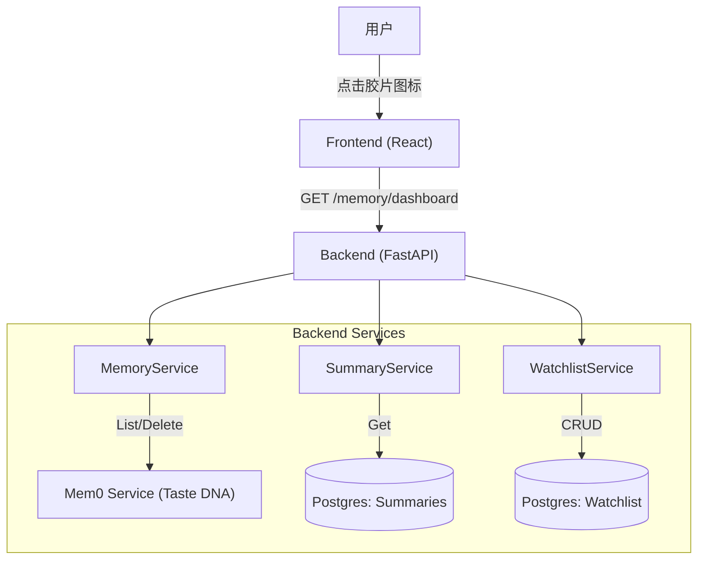

# 记忆中心 (Memory Center) 技术方案设计

**版本**: 1.0 (MVP)
**对应产品文**: [memory-center-product-design.md](./memory-center-product-design.md)
**状态**: ✅ 已实现 (MVP)
**日期**: 2026-01-25

---

## 1. 架构概览 (Architecture Overview)

本方案旨在实现 **"Movie Agent Memory Center"** 的最小可行性版本 (MVP)。
核心架构原则：**轻量级聚合**。后端负责聚合分散的记忆数据（Summaries + Mem0），前端通过单一组件（Drawer）进行展示和简单交互。

### 1.1 系统上下文


---

## 2. 后端设计 (Backend Design)

### 2.1 API 接口设计

为了减少前端请求次数，我们将首页数据聚合为一个接口。

#### 2.1.1 获取记忆看板数据
- **Endpoint**: `GET /api/v1/memory/dashboard`
- **Query Params**:
  - `conversation_id`: string (必填，用于获取当前会话摘要)
  - `user_id`: string (必填，用于获取全局画像)
- **Response**:
```json
{
  "summary": {
    "content": "上回我们讨论了《盗梦空间》的多重梦境设计...",  // "Previously On..."
    "updated_at": "2024-01-25T10:00:00Z"
  },
  "taste_profile": [
    {
      "id": "mem_12345",
      "tag": "Director: Christopher Nolan",
      "category": "preference",
      "confidence": 0.95
    },
    {
      "id": "mem_67890",
      "tag": "Genre: Sci-Fi",
      "category": "preference",
      "confidence": 0.88
    }
  ],
  "watchlist": [
    {
      "id": "uuid-1",
      "title": "Interstellar",
      "year": 2014,
      "created_at": "2024-01-25T10:00:00Z"
    }
  ],
  "stats": {
    "total_memories": 12,
    "watchlist_count": 3
  }
}
```

#### 2.1.2 删除记忆条目
- **Endpoint**: `DELETE /api/v1/memory/items/{memory_id}`
- **Response**: `204 No Content`
- **Logic**: 调用 `mem0` 的 `delete(memory_id)` 接口。

#### 2.1.3 Watchlist (想看清单) API
（MVP：支持手动维护 + 轻量自动捕获；后续可升级为更强的抽取链路）

- **List**: `GET /api/v1/memory/watchlist?user_id=...&limit=50&offset=0`
- **Add**: `POST /api/v1/memory/watchlist`
  ```json
  {"user_id":"u1","title":"Interstellar","year":2014}
  ```
- **Delete**: `DELETE /api/v1/memory/watchlist/{item_id}?user_id=...`

#### 2.1.4 Watchlist 自动捕获 (Auto-Capture)
为了降低用户维护成本，后端会在每次对话回合结束后（assistant 回复落库时）做一次 **best-effort** 抽取：

- **触发**：用户消息中包含推荐/想看/待看/加入等意图关键词
- **抽取**：优先抽取 `《...》`；其次仅从“列表项”中抽取标题（避免误抓普通段落）
- **写入**：最多写入 `WATCHLIST_AUTO_CAPTURE_MAX_ITEMS` 条；已存在标题会跳过
- **配置**：
  - `WATCHLIST_AUTO_CAPTURE_ENABLE=true|false`（默认 true）
  - `WATCHLIST_AUTO_CAPTURE_MAX_ITEMS=5`（默认 5）

#### 2.1.5 Watchlist 标准化与去重 (Standardization)
MVP 阶段不引入外部电影数据库（豆瓣/IMDB）做实体归一，但会做“轻量标准化”以减少噪声与重复：

- **规范化**：
  - `title` 会移除常见列表前缀、移除 `（2014）/(2014)` 等年份后缀并抽取 `year`
  - 生成 `normalized_title`（大小写/空白/标点统一）用于同名去重
- **版本合并/幂等写入**：
  - `add_item` 若检测到同一 `user_id + normalized_title` 已存在：返回原条目（并补全缺失 `year`、合并 metadata）
  - 若条目曾被软删除：会自动 restore（`deleted_at -> NULL`）
- **限制**：
  - 不做 “中文名 ↔ 英文名” 的别名映射（需要外部 movie-id 服务或 KB 实体对齐）

### 2.2 核心逻辑扩展 (Core Logic Extension)

**Gap Analysis**:
当前 `MemoryStorePort` 仅支持 RAG 场景的 `search` (向量检索) 和 `add`。但为了实现“记忆中心”的管理功能（全量展示 + 删除），我们需要扩展底层能力。

#### 2.2.1 Port 扩展
我们需要在 `backend/application/ports/memory_store_port.py` 中增加以下接口：

```python
class MemoryStorePort(Protocol):
    # ... existing search/add ...

    async def get_all(self, *, user_id: str, limit: int = 100, offset: int = 0) -> list[MemoryItem]:
        """获取用户的所有记忆（用于构建 Dashboard）。"""
        ...

    async def delete(self, *, user_id: str, memory_id: str) -> bool:
        """删除指定 ID 的记忆。"""
        ...
```

#### 2.2.2 Adapter 实现 (Mem0)
在 `Mem0HttpMemoryStore` 中对接 Mem0 的管理 API：
- **List**: `GET /v1/memories`
- **Delete**: `DELETE /v1/memories/{memory_id}`
  - 注意：仓库自带 `server.mem0_service` 的 List/Delete 需要通过 header 传递 user_id（默认 `x-user-id`），客户端会自动注入。

### 2.3 服务层实现 (`MemoryFacadeService`)

我们需要一个新的 Facade Service 来聚合 `ConversationSummarizer` 和 `MemoryService` 的数据。

**伪代码逻辑**:
```python
class MemoryFacadeService:
    async def get_dashboard(self, conversation_id, user_id):
        # 1. 获取前情提要 (Summaries)
        summary_task = self.summary_store.get_summary(conversation_id)
        
        # 2. 获取口味 DNA (Mem0) - 依赖 Port 扩展
        mem0_task = self.memory_store.get_all(user_id=user_id, limit=100, offset=0)

        # 3. 获取 Watchlist (Postgres)
        watchlist_task = self.watchlist_store.list_items(user_id=user_id, limit=50, offset=0)
        
        summary, memories, watchlist = await asyncio.gather(summary_task, mem0_task, watchlist_task)
        
        return {
            "summary": self._format_recap(summary),
            "taste_profile": self._cluster_tags(memories),  # MVP：直接展示 text/tags
            "watchlist": watchlist
        }
```

### 2.3 Mem0 集成优化
- **Tag 提取**: Mem0 返回的数据通常包含 `text` 和 `metadata`。我们需要在后端做一层清洗，提取出这就话的核心标签（例如从 "User likes Nolan movies" 提取 "Director: Nolan"），或者直接复用 Mem0 的 memory text 作为展示（如果足够短）。
- **建议**: MVP 阶段直接展示 `memory_text`，后续迭代增加自动打标签能力。

---

## 3. 前端设计 (Frontend Design)

### 3.1 组件结构
复用现有的 **Ant Design (v5)** 组件库，保持与 `DebugDrawer` 一致的视觉风格。

当前实现（与代码一致）：

- `frontend-react/src/components/memory-center/MemoryDrawer.tsx`：Drawer 主体（Summary + Taste DNA + Watchlist）
- `frontend-react/src/pages/ChatPage.tsx`：TopBar 入口按钮
- `frontend-react/src/services/memoryCenter.ts`：API client
- `frontend-react/src/types/memoryCenter.ts`：类型定义

### 3.2 交互流程
1.  **打开**: 用户点击 TopBar 的 🎬 图标 -> 触发 `Drawer` 组件的 `open` 状态。
2.  **加载**: 调用 API 时展示 `Skeleton` (Antd 骨架屏)。
3.  **展示**:
    -   **Top**: "Previously On..." 卡片，使用 `Card` 组件，暗色模式下搭配 `borderless`。
    -   **Middle**: "Taste DNA" 标签云，使用 `Tag` + `Popconfirm` 支持删除。
    -   **Bottom**: "Watchlist" 列表，支持手动添加与删除。
4.  **删除**:
    -   Taste DNA：点击关闭 -> `Popconfirm` 确认 -> 调用 `DELETE /api/v1/memory/items/{memory_id}`。
    -   Watchlist：点击移除 -> `Popconfirm` 确认 -> 调用 `DELETE /api/v1/memory/watchlist/{item_id}`。
    -   确认 -> 调用 API -> 成功后前端移除该 Tag。

### 3.3 样式规范 (Movie Theme)
-   **配色**: 使用 Antd Theme Token 进行深色模式定制 (`algorithm: theme.darkAlgorithm`)。
-   **字体**: 标题使用衬线体 (Serif) 增加电影海报感。
-   **动效**: 复用 Antd Drawer 的原生滑出动画；Tag 移除使用 `Animate.css` 或 Antd 内置淡出。

---

## 4. 数据库变更 (Database Changes)

-   Summaries 使用现有的 `conversation_summaries` 表。
-   Profile 使用外部 `mem0` 服务，本地不存储。
-   Watchlist 新增表 `watchlist_items`（软删除）：
    - `id uuid primary key default gen_random_uuid()`
    - `user_id text`
    - `title text`
    - `year int`
    - `metadata jsonb`
    - `created_at/updated_at/deleted_at timestamptz`

---

## 5. 开发任务拆解 (Implementation Plan)

### Core Integration (关键路径)
1.  [x] **Interface**: 扩展 `MemoryStorePort` 增加 `get_all()` 和 `delete()`。
2.  [x] **Adapter**: 在 `Mem0HttpMemoryStore` 中实现上述接口（调用 Mem0 List/Delete API）。

### Backend
1.  [x] 创建 `MemoryFacadeService` 聚合 Summary + Mem0 + Watchlist。
2.  [x] 实现 `GET /api/v1/memory/dashboard` 接口。
3.  [x] 实现 `DELETE /api/v1/memory/items/{memory_id}` 接口。
4.  [x] 实现 Watchlist CRUD：`GET/POST/DELETE /api/v1/memory/watchlist...`
5.  [x] 注册 Router。

### Frontend
1.  [x] TopBar 增加“记忆中心”入口按钮。
2.  [x] 开发 `MemoryDrawer`（Summary + Taste DNA + Watchlist）。
3.  [x] 对接 Dashboard API 并绑定数据。
4.  [x] Taste DNA 删除交互（Popconfirm）。
5.  [x] Watchlist 添加/删除交互（Popconfirm）。

### Refinement
1.  [ ] 调整 Summarizer System Prompt，增加 "Brief Recap" 风格指令。
