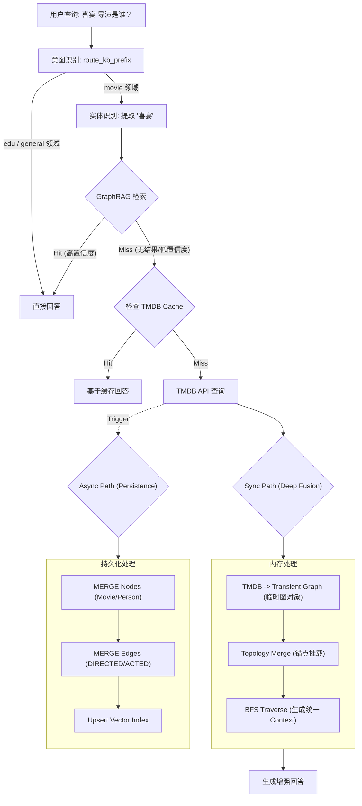

# 1.1.5 Query-Time Enrichment: Deep Fusion Strategy

**版本**: 2.0 (Deep Fusion)
**日期**: 2026-01-25
**关联文档**: [Incremental Update Strategy Analysis](./incremental-update-strategy-analysis.md)

---

## 1. 核心理念 (Core Concept)

针对 GraphRAG "知识库缺失" 和 "增量更新难" 的双重挑战，我们摒弃了简单的 "Context Injection"（文本拼接），升级为 **"Deep Fusion: In-Memory Graph Overlay" (深度融合：内存图谱叠加)** 策略。

### 我们的选择：Deep Fusion Strategy (深度融合)
| 路径 | 机制 | 解决问题 |
|------|------|----------|
| **Sync Path (0s)** | **In-Memory Graph Overlay** | **即时性 (Latency)**: 将 API 数据实时转化为图结构，在内存中与旧图谱**拓扑融合**，让 LLM 进行完整的图谱推理。 |
| **Async Path (1s)** | **Full Graph Sync** | **增量性 (Incremental)**: 异步写入完整的 Node + Edge + Vector，确保 1 秒后的 Local Search 能够命中。 |
| **Deferred (24h)** | **Community Clustering** | **宏观性 (Global)**: 接受 Community Summary 的短期滞后，留给夜间批处理解决。 |

---

## 2. 架构设计 (Architecture)



---

## 3. 详细流程 (Detailed Flow)

### 3.1 Sync Path: Deep Fusion (深度融合)
**目标**: 让当前这次对话立即“变聪明”，且像感知原生知识一样感知新知识。

1.  **Transient Graph Construction**:
    *   收到 TMDB JSON `(Title: The Wedding Banquet, Director: Ang Lee)`。
    *   即时转化为内存对象 `Node(Movie, "The Wedding Banquet")` 和 `Node(Person, "Ang Lee")` 以及 `Edge(DIRECTED)`。
2.  **Topological Merge (Overlay)**:
    *   在 GraphRAG 检索到的子图中寻找 **Anchor Node (锚点)**。
    *   *Case*: 检索到了 "Ang Lee" (旧节点)。
    *   *Action*: 将 `Node(Movie, "The Wedding Banquet")` (新节点) 通过 `Edge(DIRECTED)` 挂载到 "Ang Lee" 上。
3.  **Context Generation**:
    *   对这张 "Unified Graph" 进行 BFS 遍历。
    *   生成自然语言描述：*"Ang Lee, who is known for 'Crouching Tiger', also directed 'The Wedding Banquet' (TMDB Source)..."*

### 3.2 Async Path: Full Graph Sync (全量同步)
**目标**: 保证图谱的物理完整性，服务于未来的 Local Search。

1.  **ETL**: 将 TMDB 结构化数据映射为 Graph Schema 实体。
2.  **Cypher Write**:
    *   `MERGE (m:Movie {tmdb_id: ...})`
    *   `MERGE (p:Person {tmdb_id: ...})`
    *   `MERGE (p)-[:DIRECTED]->(m)`
3.  **Vector Indexing**:
    *   对新写入的 `m:Movie` 节点立即计算 Embedding。
    *   写入 Milvus/Pgvector。
    *   **结果**: 下一秒用户搜“喜宴”，直接通过 Vector Search 命中该节点。

---

## 4. 核心组件 (Core Components)

### 4.1 ChatStreamExecutor (Enhancement Logic)
**位置**: `ChatStreamExecutor.stream()` 内部拦截。

```python
# 伪代码逻辑
if needs_enrichment:
    # 1. 获取外部数据
    tmdb_data = await strategies.fetch_tmdb(title)
    
    # 2. [Deep Fusion] 内存图融合
    transient_graph = graph_transformer.to_graph(tmdb_data)
    unified_graph = graph_merger.overlay(
        base_graph=current_retrieved_subgraph,
        overlay_graph=transient_graph
    )
    
    # 3. [Context] 基于融合图生成上下文
    optimized_context = context_builder.build(unified_graph)
    run.context = optimized_context
    
    # 4. [Async] 物理落库
    asyncio.create_task(graph_writer.persist(tmdb_data))
```

### 4.2 IncrementalGraphWriter (Full Sync)

**位置**: `backend/infrastructure/integrations/incremental_graph_writer.py`

**职责**：将 TMDB API 返回的数据结构化地写入 Neo4j，确保增量更新的幂等性和一致性。

**核心设计原则**：
- **幂等性**：使用 `MERGE` 而非 `CREATE`，基于 `tmdb_id` 业务主键去重
- **增量更新**：使用 `SET` 更新属性，而非删除重建
- **关系完整性**：同时写入节点和边（DIRECTED、ACTED_IN、IN_GENRE）
- **批量优化**：使用 `UNWIND` 批量处理提升性能
- **向量同步**：Neo4j 写入完成后异步更新 Milvus/Pgvector

**关键 Cypher 操作**：
```cypher
// 幂等写入电影
MERGE (m:Movie {tmdb_id: $id})
SET m.title = $title

// 写入导演关系
MERGE (p:Person {tmdb_id: $director_id})
MERGE (p)-[:DIRECTED]->(m)

// 批量优化
UNWIND $movies AS movie
MERGE (m:Movie {tmdb_id: movie.id})
SET m.title = movie.title
```

**详细实现细节**（错误处理、重试机制、批量优化等）见：
[Incremental Update Strategy Analysis - §7](./incremental-update-strategy-analysis.md#7-实现细节)

---

## 5. 交互设计 (UX)

为了让用户感知到"思维升级"的过程，前端 UI 应配合展示状态：

1.  **State 1: Searching**
    *   `Thinking: GraphRAG miss... searching TMDB...`
2.  **State 2: Learn & Fuse**
    *   `Thinking: Found "The Wedding Banquet". Merging into knowledge graph...`
3.  **State 3: Answer**
    *   `Answer: 《喜宴》是李安 1993 年的作品...`

---

## 6. 实施要点

### 6.1 核心依赖

- **TMDB API**: 外部数据源
- **Neo4j**: 图数据库（Async Path 持久化）
- **Milvus/Pgvector**: 向量索引
- **PostgreSQL**: 缓存层

### 6.2 关键配置

```python
# backend/config/settings.py
TMDB_API_KEY = os.getenv("TMDB_API_KEY")
ENABLE_ENRICHMENT = os.getenv("ENABLE_ENRICHMENT", "false").lower() == "true"
ENRICHMENT_SCORE_THRESHOLD = float(os.getenv("ENRICHMENT_SCORE_THRESHOLD", "0.4"))
```

### 6.3 实施优先级

| 优先级 | 任务 | 说明 |
|--------|------|------|
| **P0** | Sync Path 实现 | 核心价值：即时生效的 Deep Fusion |
| **P1** | Async Path 实现 | 保证 Local Search 长期可用 |
| **P2** | 缓存优化 | 降低 API 成本，提升性能 |
| **P3** | 监控告警 | 生产环境可观测性 |

**详细实现规范**（错误处理、缓存策略、并发控制、监控等）见：[Incremental Update Strategy Analysis](./incremental-update-strategy-analysis.md)

