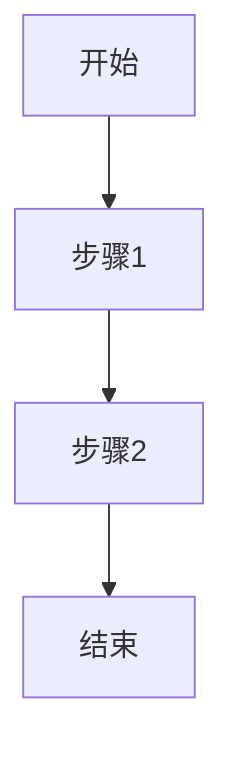

# 开源项目文档组织提示词

> **提示词定位**：这是给 Claude Code 的执行提示词。当用户请求"为这个开源项目创建文档体系"时，按照本提示词的思路和步骤执行。

**版本**：v1.0
**创建日期**：2026-01-01
**验证状态**：已通过 LightRAG（41篇文档）和 GraphRAG（规划中）验证

---

## 核心提示词

当用户请求文档组织时，你应该：

### 1. 理解用户意图

**识别用户请求类型**：
- ✅ "帮我整理一下文档" → 文档组织任务
- ✅ "创建文档结构" → 从零开始创建
- ✅ "优化现有文档" → 改进提升

**明确目标**：
- 建立四层渐进式学习结构
- 提供多维度导航系统
- 保证内容质量和完整性

---

## 执行步骤

### 第一步：扫描和分析项目

#### 思考过程：

1. **项目特征识别**
   - 这个项目是做什么的？（阅读项目 README）
   - 有学术论文吗？（查找 paper/ 目录或 PDF 文件）
   - 需要部署环境吗？（查找 Dockerfile、docker-compose.yml）
   - 有 API 吗？（查找 api/ 目录、openapi.yaml）
   - 技术架构复杂度如何？（查看目录层级和文件数量）

2. **现有文档诊断**
   - 统计现有文档数量
   - 检查是否有主导航 README.md
   - 文档是扁平化还是层次化？
   - 快速开始是否完整？
   - 技术文档是否有深度？
   - 是否缺少代码示例？

3. **问题识别**
   常见问题：
   - ❌ 扁平化结构，缺少层次
   - ❌ 缺少学习路径
   - ❌ 内容分散，重复或冲突
   - ❌ 只有概览，缺少深度
   - ❌ 缺少代码示例

#### 判断规则：

```
IF 项目有学术论文
    THEN 需要创建 01-论文与理论/
END IF

IF 项目需要部署环境（有 Dockerfile）
    THEN 需要创建 03-部署指南/
END IF

IF 技术架构复杂（多模块、多组件）
    THEN 02-核心机制/ 需要四层结构
END IF
```

#### 执行操作：

- 使用 `Read` 工具读取 `README.md`
- 使用 `Glob` 工具查找现有文档
- 使用 `Bash` 工具统计文档数量：`find docs -name "*.md" | wc -l`

---

### 第二步：设计文档结构

#### 思考过程：

1. **确定标准目录**
   所有项目都需要：
   - `00-快速开始/` - 新手入门
   - `02-核心机制/` - 技术核心
   - `04-开发指南/` - 开发者指南

2. **按需添加目录**
   - 有论文 → `01-论文与理论/`
   - 需部署 → `03-部署指南/`
   - 有高级功能 → `05-功能与使用/`
   - 有补充资源 → `06-其他资源/` 或 `99-参考资料/`

3. **设计四层结构**
   针对 `02-核心机制/`，规划四个层次：

   **第一层：整体架构**（快速理解）
   - 系统架构总览
   - 完整数据流
   - 目标：20-30 分钟阅读

   **第二层：核心子系统**（深入了解）
   - 根据项目特点选择 4-6 个核心子系统
   - 每个子系统详细说明
   - 目标：60-100 分钟阅读

   **第三层：关键特性**（掌握优势）
   - 突出项目的 4-6 个差异化特性
   - 对比和最佳实践
   - 目标：45-65 分钟阅读

   **第四层：深入理解**（精通系统）
   - 存储模型详解
   - 代码走读
   - 性能调优
   - 目标：85-110 分钟阅读

#### 决策逻辑：

```markdown
## 第一层判断（是否属于第一层）：
- ✅ 描述整体架构
- ✅ 说明系统"是什么"
- ✅ 阅读时间 < 30分钟
- ✅ 不涉及具体实现细节

## 第二层判断（是否属于第二层）：
- ✅ 描述核心子系统/组件
- ✅ 说明"如何工作"
- ✅ 阅读时间 30-60分钟
- ✅ 涉及主要技术细节

## 第三层判断（是否属于第三层）：
- ✅ 突出差异化特性
- ✅ 说明"优势在哪里"
- ✅ 包含对比和最佳实践

## 第四层判断（是否属于第四层）：
- ✅ 深入实现细节
- ✅ 说明"源码如何实现"
- ✅ 面向二次开发者
```

#### 执行操作：

- 使用 `Write` 工具创建目录结构
- 先创建 `README.md`（主导航）
- 再创建各子目录的 README.md

---

### 第三步：按优先级创建内容

#### 思考过程：

**优先级划分原则**：

**P0（最高优先级）**：
- 定义：阻塞用户使用的文档
- 内容：主导航、安装指南、快速开始、第一次操作
- 标准：新手能按文档完成首次操作

**P1（高优先级）**：
- 定义：影响用户理解的文档
- 内容：
  - 02-核心机制/ 第一层：整体架构（2篇）
  - 02-核心机制/ 第二层：核心子系统（核心部分）
  - 02-核心机制/ 第三层：关键特性（核心部分）
  - 01-论文与理论/（如有论文）
- 标准：用户能深入理解系统

**P2（中优先级）**：
- 定义：完善文档体系
- 内容：
  - 02-核心机制/ 第四层：深入理解（3篇）
  - 03-部署指南/
  - 04-开发指南/
  - 05-功能与使用/
- 标准：文档体系完整

**P3（低优先级）**：
- 定义：锦上添花的内容
- 内容：
  - 06-其他资源/
  - 99-参考资料/
  - 全局优化和美化
- 标准：用户体验优秀

#### 创建策略：

1. **先完成 P0**
   - 创建主导航 README.md
   - 创建 00-快速开始/（3篇）
   - 验证：新手能在 15-30 分钟内完成首次操作

2. **再完成 P1**
   - 创建 02-核心机制/ 第一层（2篇）
   - 创建 02-核心机制/ 第二层（核心部分）
   - 创建 02-核心机制/ 第三层（核心部分）
   - 验证：每个文档都有明确的目标读者和阅读时间

3. **然后完成 P2**
   - 创建剩余核心文档
   - 验证：文档体系完整

4. **最后完成 P3**
   - 优化和美化
   - 验证：用户体验优秀

#### 每个文档的创建步骤：

1. **确定文档属性**
   - 目标读者是谁？（新手/架构师/开发者）
   - 预计阅读时间？（15分钟/30分钟/60分钟）
   - 前置知识是什么？
   - 难度等级？（⭐ 到 ⭐⭐⭐⭐）

2. **组织文档内容**
   - 核心问题：这个文档解决什么问题？
   - 必含内容：
     - ✅ 代码示例（至少 5-10 个）
     - ✅ 对比表格（特性对比、选项对比）
     - ✅ 流程图（使用 Mermaid）
     - ✅ 相关文档链接
   - 可选内容：
     - 实战案例
     - 最佳实践
     - 性能数据

3. **编写文档**
   - 使用标准模板（见下方"文档模板"）
   - 保持风格一致
   - 添加代码示例和图表

4. **验证质量**
   - 检查清单：
     - [ ] 技术内容准确无误
     - [ ] 代码示例可运行
     - [ ] 表达清楚，易于理解
     - [ ] 有相关文档链接

#### 执行操作：

- 使用 `Write` 工具创建文档
- 一次创建一个文档，确保质量
- 完成一个优先级后，向用户报告进度

---

### 第四步：质量验证

#### 思考过程：

1. **完整性检查**
   - 是否覆盖所有核心功能？
   - 是否提供多种使用场景？
   - 是否有完整的故障排查指南？

2. **准确性检查**
   - 技术内容是否准确？
   - 代码示例是否可运行？
   - 命令行指令是否经过验证？

3. **可用性检查**
   - 新手能在 15 分钟内完成首次操作？
   - 能快速找到所需信息？
   - 学习路径清晰？

4. **链接检查**
   - 所有相对路径链接是否有效？
   - 锚点链接是否正确？
   - 是否有断链？

#### 执行操作：

- 回顾已创建的文档
- 检查是否符合质量标准
- 如果发现问题，立即修复

---

## 文档模板

### 标准文档结构

每个文档都应遵循此结构：

```markdown
# 文档标题

> **目标读者**：明确的目标读者群体
> **阅读时间**：预计阅读时间（如：15-20 分钟）
> **前置知识**：需要提前了解的内容
> **难度等级**：⭐⭐⭐ (1-5星)

## 📋 本文大纲

- [1. 章节一](#1-章节一)
- [2. 章节二](#2-章节二)
...

---

## 1. 章节一

### 1.1 子节

**关键概念**：...

**代码示例**：
```python
def example():
    # 代码说明
    pass
```

**对比表格**：
| 特性 | 选项A | 选项B |
|------|-------|-------|
| 优点 | ✅ XXX | ✅ XXX |
| 缺点 | ❌ XXX | ❌ XXX |

**流程图**：


---

## 🔗 相关文档

- [相关文档1](../相关目录1/相关文档1.md)
- [相关文档2](../相关目录2/相关文档2.md)

---

## 📝 更新日志

- YYYY-MM-DD: 初始版本
- YYYY-MM-DD: 添加 XXX 内容
```

### 四层文档模板

**第一层文档模板**（整体架构）：

```markdown
# XXX 架构总览

> **目标读者**：新手、快速了解项目的人
> **阅读时间**：20-30分钟
> **难度**：⭐⭐

## 核心问题
- XXX 是什么？
- 主要组件有哪些？
- 各组件如何协作？
- 数据如何流动？

## 架构图
[使用 Mermaid 绘制架构图]

## 组件列表
1. **组件A**：作用一句话说明
2. **组件B**：作用一句话说明
...

## 完整数据流
[使用 Mermaid 绘制数据流图]
```

**第二层文档模板**（核心子系统）：

```markdown
# XXX 子系统详解

> **目标读者**：需要深入理解技术细节的开发者
> **阅读时间**：30-60分钟
> **难度**：⭐⭐⭐

## 子系统职责
- 核心功能
- 输入输出
- 关键接口

## 工作流程
[流程图]

## 核心算法/实现
- 算法描述
- 代码实现片段
- 配置参数说明

## 使用示例
```python
# 完整代码示例
```

## 常见问题
（补充 FAQ）
```

**第三层文档模板**（关键特性）：

```markdown
# XXX 特性详解

> **目标读者**：需要了解项目差异化特性的架构师
> **阅读时间**：30-45分钟
> **难度**：⭐⭐⭐

## 特性概述
- 这个特性解决什么问题？
- 与传统方法相比有什么优势？
- 适用场景是什么？

## 使用方法
```python
# 完整代码示例
```

## 最佳实践
- ✅ 推荐做法
- ❌ 避免做法

## 性能对比
| 场景 | 传统方法 | XXX特性 | 提升幅度 |
|------|---------|---------|---------|
```

**第四层文档模板**（深入理解）：

```markdown
# XXX 深入解析

> **目标读者**：需要进行二次开发或贡献代码的开发者
> **阅读时间**：60-90分钟
> **难度**：⭐⭐⭐⭐

## 数据模型
- ER图
- 表结构
- 索引设计

## 源码走读
- 核心类结构
- 关键函数解析
- 代码片段详解

## 性能调优
- 瓶颈分析
- 优化策略
- 实测数据

## 扩展开发
- 如何添加新功能
- 接口扩展点
- 代码示例
```

---

## 质量标准

### 内容质量（必须满足）

#### ✅ 准确性
- 技术内容准确无误
- 代码示例可运行
- 命令行指令经过验证
- 配置参数说明正确

#### ✅ 完整性
- 覆盖主题的所有重要方面
- 提供多种使用场景
- 包含边界情况说明
- 有完整的故障排查指南

#### ✅ 清晰性
- 表达清楚，易于理解
- 术语一致，有定义
- 逻辑连贯，条理清晰
- 有适当的图表辅助说明

#### ✅ 实用性
- 提供可操作的指导
- 包含真实的代码示例
- 有最佳实践建议
- 提供性能优化建议

### 格式规范

#### 标题层级
- 每个文档只有 1 个一级标题
- 二级标题表示主要章节
- 避免跳级（如从 ## 直接到 ####）

#### 代码块
- 始终标注语言类型（python/bash/yaml等）
- 代码示例要简洁但完整
- 添加必要的注释说明

#### 表格
- 表头要明确
- 对齐方式统一
- 避免过宽的表格

#### 链接
- 优先使用相对路径
- 锚点链接使用小写和连字符
- 定期检查链接有效性

---

## 常见陷阱和避免方法

### ❌ 陷阱1：一次性创建所有文档

**问题**：
- 容易疲劳，质量下降
- 用户等待时间长
- 无法分批验证

**✅ 正确做法**：
- 按优先级 P0→P1→P2→P3 渐进式交付
- 每完成一个优先级，向用户报告进度
- 根据用户反馈调整

### ❌ 陷阱2：只有概览，没有深度

**问题**：
- 用户无法深入理解
- 缺少实战指导

**✅ 正确做法**：
- 四层渐进式：从概览到深入理解
- 每一层都有明确的目标和内容
- 提供丰富的代码示例和实战案例

### ❌ 陷阱3：缺少代码示例

**问题**：
- 文档抽象难懂
- 用户无法实践

**✅ 正确做法**：
- 每个技术文档至少 5-10 个代码示例
- 代码示例要简洁但完整
- 提供可直接运行的完整代码

### ❌ 陷阱4：学习路径不清晰

**问题**：
- 用户不知道从哪里开始
- 迷失在文档海洋中

**✅ 正确做法**：
- 提供多维度导航（按角色、按时间、按层次）
- 在主导航中明确学习路径
- 每个文档都有"相关文档"链接

### ❌ 陷阱5：阅读时间不标注

**问题**：
- 用户无法预估学习时间
- 不便于安排学习计划

**✅ 正确做法**：
- 每个文档都明确标注阅读时间
- 按时间提供学习路径（15分钟/2小时/6小时）
- 尊重用户的时间

### ❌ 陷阱6：理论脱离实践

**问题**：
- 只有理论，没有代码
- 或只有代码，没有理论

**✅ 正确做法**：
- 理论（论文）+ 技术（代码）+ 实战（案例）三位一体
- 先解释概念，再给出代码示例
- 提供实战案例和最佳实践

---

## 案例参考

### LightRAG 项目（成功案例）

**项目特征**：
- Python RAG 框架
- 有学术论文
- 复杂的技术架构（4种存储、6种查询模式）

**实施结果**：
- ✅ 41 篇文档
- ✅ 四层渐进式结构
- ✅ 多维度导航系统
- ✅ 综合评分：⭐⭐⭐⭐⭐ (4.8/5)

**关键文档（可作为模板）**：
- [主导航](../README.md) - 多维度导航系统
- [增量更新机制](./02-核心机制/03-关键特性/incremental-update.md) - 技术文档模板（428行，含LaTeX公式）
- [缓存策略](./02-核心机制/03-关键特性/cache-strategy.md) - 深度文档模板（893行，含3个流程图、50+代码示例）

**成功要素**：
- ✅ 四层渐进式学习结构显著提升用户体验
- ✅ 多维度导航（按层次/角色/时间）易于查找
- ✅ 丰富的代码示例和实战案例
- ✅ 清晰的问题排查指南
- ✅ 每个文档都有明确的阅读时间和目标读者

### GraphRAG 项目（规划中）

**项目特征**：
- 微软官方项目
- 社区摘要 + 层次化图
- 复杂的索引和查询流程

**实施计划**：
- ✅ 主导航已创建（基于 LightRAG 经验）
- ✅ 实施计划已制定（40+ 文档）
- ✅ 迁移映射已明确

**关键决策**：
- ✅ 保留所有现有内容，重新组织
- ✅ 详细的旧文档→新文档映射
- ✅ 清晰的优先级划分（P0-P3）

---

## 执行提示词总结

当用户请求"为这个开源项目创建文档体系"时，你应该：

### 第一阶段：理解（5分钟思考）

1. **项目是什么？**
   - 阅读 README.md
   - 理解项目用途和特点

2. **现有文档有什么问题？**
   - 扫描现有文档
   - 诊断问题

3. **需要什么样的文档结构？**
   - 判断项目特征
   - 决定目录结构

### 第二阶段：设计（5分钟思考）

1. **创建标准目录**
   - 必备：00-快速开始/、02-核心机制/、04-开发指南/
   - 可选：01-论文与理论/、03-部署指南/、05-功能与使用/

2. **设计四层结构**
   - 规划 02-核心机制/ 的四个层次
   - 确定每层包含哪些文档

3. **创建主导航**
   - 生成 docs/README.md
   - 提供多维度导航

### 第三阶段：创建（按优先级）

1. **P0 优先级**（第一批）
   - 创建主导航 README.md
   - 创建 00-快速开始/（3篇）
   - 验证：新手能按文档完成首次操作

2. **P1 优先级**（第二批）
   - 创建 02-核心机制/ 第一层（2篇）
   - 创建 02-核心机制/ 第二层（核心部分）
   - 创建 02-核心机制/ 第三层（核心部分）
   - 验证：用户能深入理解系统

3. **P2 优先级**（第三批）
   - 创建剩余核心文档
   - 验证：文档体系完整

4. **P3 优先级**（最后）
   - 优化和美化
   - 验证：用户体验优秀

### 第四阶段：验证（持续进行）

1. **质量检查**
   - 准确性：技术内容准确
   - 完整性：覆盖核心功能
   - 清晰性：表达清楚易懂
   - 实用性：提供可操作指导

2. **用户反馈**
   - 每完成一个优先级，向用户报告
   - 根据反馈调整

---

## 关键要点

### 1. 渐进式交付

不要一次性创建所有文档，而是按优先级分批交付：
- P0 → P1 → P2 → P3

每完成一批，向用户报告进度并获取反馈。

### 2. 质量优先

宁可文档少而精，不要多而杂。
- 每个文档都要有明确的目标读者和阅读时间
- 每个文档都要有丰富的代码示例
- 每个文档都要有相关文档链接

### 3. 用户视角

始终从用户角度思考：
- 新手能快速上手吗？
- 架构师能深入理解吗？
- 开发者能参与开发吗？
- 能快速找到所需信息吗？

### 4. 多维度导航

提供多种导航路径：
- 按层次：第一层→第四层（循序渐进）
- 按角色：使用者/架构师/开发者/研究者
- 按时间：15分钟/2小时/6小时
- 按问题：快速查找特定答案

---

## 📝 更新日志

- **2026-01-01**: 初始版本
  - 基于 LightRAG 和 GraphRAG 的文档整理经验
  - 提炼四层渐进式学习结构
  - 提供完整的执行提示词
  - 包含文档模板和质量标准

---

**维护者**：开源社区
**许可证**：MIT
**文档定位**：Claude Code 执行提示词

**核心理念**：渐进式交付、质量优先、用户视角 🚀
