# Agent系统

# ⚠️ 注意：缓存描述已过时

本文档里出现的 `cache_manager/global_cache_manager/CacheManager` 属于历史实现；v3 strict 已将缓存系统**物理下线**。
现行闭环以 Postgres（会话/消息/反馈）+ mem0（长期记忆）为准。

---

## 📋 元信息

- **目标读者**：开发者、架构师
- **阅读时间**：60分钟
- **难度**：⭐⭐⭐
- **前置知识**：LangChain、LangGraph、大模型调用、Python异步编程
- **最后更新**：2026-01-04

---

## 📖 本文大纲

- [系统概览](#系统概览)
- [BaseAgent 架构设计](#baseagent-架构设计)
- [LangGraph 状态图设计](#langgraph-状态图设计)
- [五种 Agent 详解](#五种-agent-详解)
- [工具注册机制](#工具注册机制)
- [流式响应实现](#流式响应实现)
- [缓存系统](#缓存系统)
- [Agent 对比](#agent-对比)
- [开发指南](#开发指南)
- [相关文档](#相关文档)

---

## 系统概览

### 核心理念

本项目的 Agent 系统采用基于 **LangGraph** 的工作流编排架构，实现了可扩展、可观测、支持多轮对话的智能问答系统。

**核心设计思想**：
1. **统一架构**：所有 Agent 继承自 `BaseAgent`，共享双 LLM 实例、双层缓存和状态管理
2. **工作流编排**：使用 LangGraph 构建 DAG（有向无环图）式的处理流程
3. **工具增强**：通过工具注册机制，Agent 可调用不同的搜索策略
4. **渐进增强**：从简单的 NaiveRagAgent 到复杂的 FusionGraphRAGAgent，逐步增加能力

### Agent 架构层级

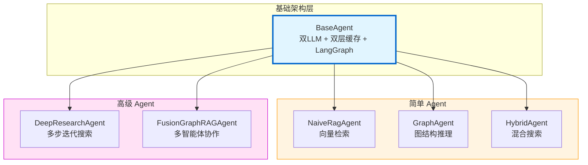

---

## BaseAgent 架构设计

### 核心组件

`BaseAgent` 是所有 Agent 的基类，位于 `backend/graphrag_agent/agents/base.py`，提供以下核心能力：

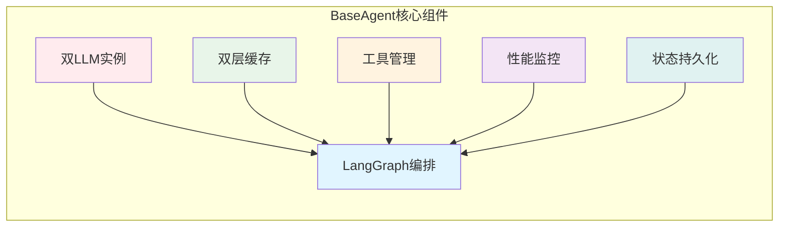

### 双 LLM 实例

**设计理念**：分离同步和流式场景的 LLM 调用，优化性能和用户体验。

```python
class BaseAgent(ABC):
    def __init__(self, cache_dir="./cache", memory_only=False):
        # 1. 普通 LLM - 用于标准调用
        self.llm = get_llm_model()

        # 2. 流式 LLM - 用于流式响应
        self.stream_llm = get_stream_llm_model()

        # 3. 嵌入模型 - 用于向量生成
        self.embeddings = get_embeddings_model()
```

**使用场景**：
- `self.llm`：用于 `ask()` 方法、关键词提取、工具调用决策
- `self.stream_llm`：用于 `ask_stream()` 方法，提供流式响应
- `self.embeddings`：用于缓存相似度匹配、关键词向量化

### 双层缓存架构

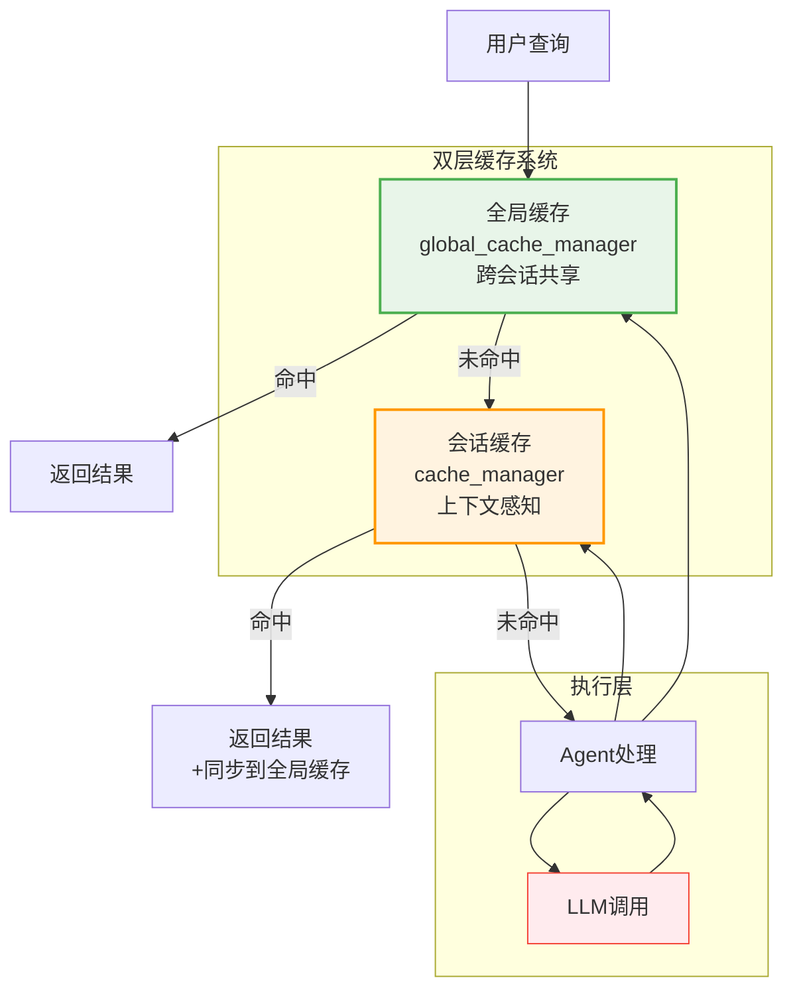

**缓存初始化代码**：

```python
# 会话级缓存（上下文感知）
self.cache_manager = CacheManager(
    key_strategy=ContextAwareCacheKeyStrategy(),  # 考虑对话历史
    storage_backend=HybridCacheBackend(
        cache_dir=cache_dir,
        memory_max_size=200,   # 内存缓存200条
        disk_max_size=2000     # 磁盘缓存2000条
    ),
    cache_dir=cache_dir,
    memory_only=memory_only
)

# 全局缓存（跨会话）
self.global_cache_manager = CacheManager(
    key_strategy=GlobalCacheKeyStrategy(),  # 仅基于查询文本
    storage_backend=HybridCacheBackend(
        cache_dir=f"{cache_dir}/global",
        memory_max_size=500,   # 更大的内存缓存
        disk_max_size=5000     # 更大的磁盘缓存
    ),
    cache_dir=f"{cache_dir}/global",
    memory_only=memory_only
)
```

**缓存查询优先级**：
1. 全局缓存（最快，跨会话）
2. 快速路径缓存（高质量标记的缓存，跳过验证）
3. 常规会话缓存（带验证）
4. 执行完整处理流程

### 状态持久化

使用 LangGraph 的 `MemorySaver` 实现多轮对话记忆：

```python
self.memory = MemorySaver()  # 会话状态持久化

# 编译图时绑定 checkpointer
self.graph = workflow.compile(checkpointer=self.memory)

# 使用时通过 thread_id 隔离不同会话
config = {
    "configurable": {
        "thread_id": thread_id,  # 会话ID
        "recursion_limit": recursion_limit
    }
}
```

---

## LangGraph 状态图设计

### 工作流核心概念

LangGraph 是一个基于状态图的工作流编排框架，核心概念包括：

1. **State（状态）**：在工作流中流动的数据结构
2. **Node（节点）**：处理状态的函数
3. **Edge（边）**：节点之间的连接路径
4. **Conditional Edge（条件边）**：根据状态动态选择下一个节点

### 标准工作流程

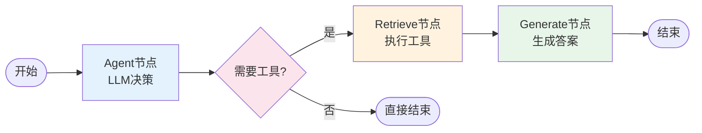

### 状态定义

```python
class AgentState(TypedDict):
    """
    Agent 的状态结构

    字段说明:
        messages: 消息序列，记录整个对话历史和中间结果

    数据结构示例:
        [
            HumanMessage("用户提问"),           # 用户输入
            AIMessage("", tool_calls=[...]),   # LLM 决策调用工具
            ToolMessage("工具返回结果"),        # 工具执行结果
            AIMessage("最终答案")              # LLM 生成的回答
        ]
    """
    messages: Annotated[Sequence[BaseMessage], add_messages]
```

**关键点**：
- `Annotated` 是 Python 的类型注解语法
- `add_messages` 是 LangGraph 的 reducer 函数，自动追加消息到列表

### 节点实现

#### 1. Agent 节点（决策中心）

```python
def _agent_node(self, state):
    """
    Agent 节点 - LLM 决策中心

    作用:
        - 提取用户查询的关键词
        - 调用 LLM 决策是否需要使用工具
        - 返回 LLM 的响应消息
    """
    messages = state["messages"]

    # 关键词提取与消息增强
    if len(messages) > 0 and isinstance(messages[-1], HumanMessage):
        query = messages[-1].content
        keywords = self._extract_keywords(query)  # 子类实现

        if keywords:
            # 创建带关键词元数据的增强消息
            enhanced_message = HumanMessage(
                content=query,
                additional_kwargs={"keywords": keywords}
            )
            messages = messages[:-1] + [enhanced_message]

    # 绑定工具到 LLM
    model = self.llm.bind_tools(self.tools)

    # 调用 LLM 进行推理
    response = model.invoke(messages)

    return {"messages": [response]}
```

**流程详解**：
1. 提取最后一条消息（用户查询）
2. 使用子类的 `_extract_keywords()` 提取关键词
3. 将关键词附加到消息元数据中
4. 绑定工具到 LLM（告诉 LLM 可用的工具）
5. LLM 决策是否需要调用工具

#### 2. Retrieve 节点（工具执行）

使用 LangGraph 内置的 `ToolNode`：

```python
workflow.add_node("retrieve", ToolNode(self.tools))
```

**ToolNode 自动处理逻辑**：
1. 从最后一条消息提取 `tool_calls`
2. 根据 `tool_calls[i].name` 找到对应工具
3. 执行 `tool.invoke(tool_calls[i].args)`
4. 将结果包装成 `ToolMessage`
5. 追加到 `messages` 列表

#### 3. Generate 节点（答案生成）

```python
def _generate_node(self, state):
    """生成回答节点逻辑"""
    messages = state["messages"]
    question = messages[-3].content  # 用户问题
    docs = messages[-1].content      # 工具返回的文档

    # 缓存检查
    cached_result = self.cache_manager.get(question, thread_id=thread_id)
    if cached_result:
        return {"messages": [AIMessage(content=cached_result)]}

    # 使用 LLM 生成答案
    prompt = ChatPromptTemplate.from_messages([
        ("system", LC_SYSTEM_PROMPT),
        ("human", GENERATE_PROMPT),
    ])

    chain = prompt | self.llm | StrOutputParser()
    response = chain.invoke({
        "context": docs,
        "question": question
    })

    # 更新缓存
    self.cache_manager.set(question, response, thread_id=thread_id)
    self.global_cache_manager.set(question, response)

    return {"messages": [AIMessage(content=response)]}
```

### 条件边：tools_condition

```python
workflow.add_conditional_edges(
    source="agent",           # 从 agent 节点出发
    path=tools_condition,     # 使用内置条件函数
    path_map={
        "tools": "retrieve",  # 有 tool_calls → 去 retrieve
        END: END,             # 无 tool_calls → 直接结束
    },
)
```

**tools_condition 判断逻辑**：
```python
def tools_condition(state) -> str:
    last_message = state["messages"][-1]
    if hasattr(last_message, 'tool_calls') and last_message.tool_calls:
        return "tools"  # 需要调用工具
    else:
        return END      # 不需要工具，直接结束
```

---

## 五种 Agent 详解

### 1. NaiveRagAgent（基础向量检索）

**特点**：最简单的 RAG 实现，仅使用向量检索。

**工作流程**：
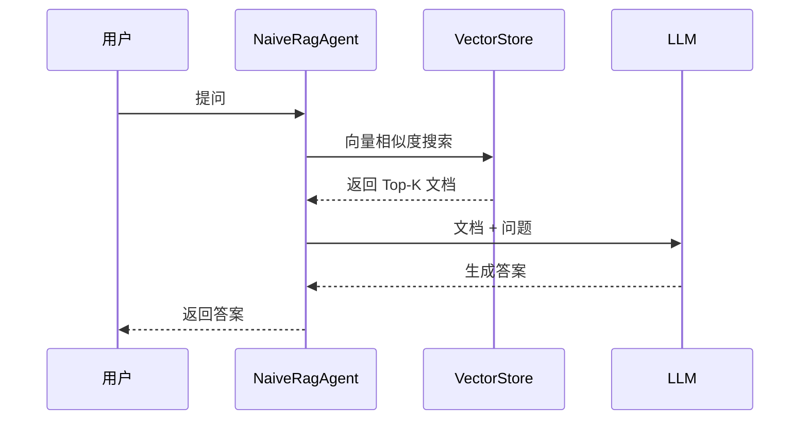

**核心代码**：
```python
class NaiveRagAgent(BaseAgent):
    def __init__(self):
        self.search_tool = NaiveSearchTool()  # 向量搜索工具
        super().__init__(cache_dir="./cache/naive_agent")

    def _setup_tools(self) -> List:
        return [self.search_tool.get_tool()]

    def _add_retrieval_edges(self, workflow):
        # 简单的从检索直接到生成
        workflow.add_edge("retrieve", "generate")

    def _extract_keywords(self, query: str) -> Dict[str, List[str]]:
        # 不做关键词提取
        return {"low_level": [], "high_level": []}
```

**适用场景**：
- 简单问答
- 文档数量较少
- 不需要复杂推理

---

### 2. GraphAgent（图结构推理）

**特点**：基于知识图谱的本地和全局搜索。

**工作流程**：
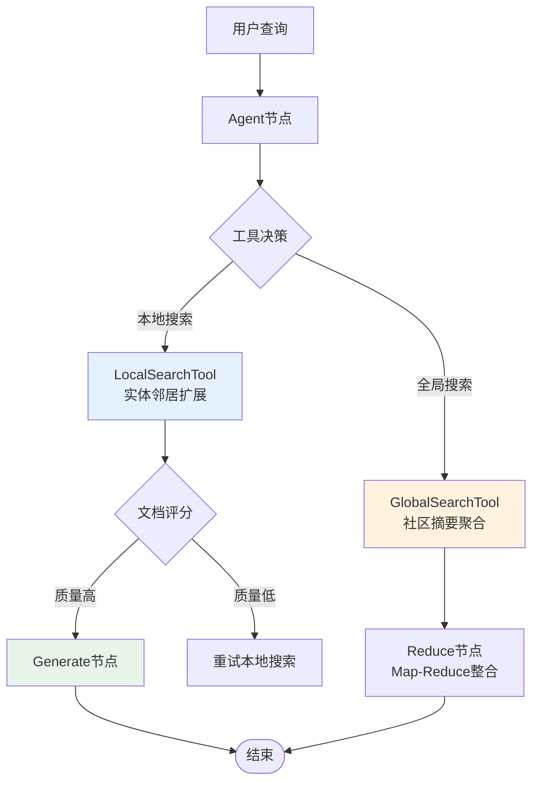

**核心代码**：
```python
class GraphAgent(BaseAgent):
    def __init__(self):
        self.local_tool = LocalSearchTool()   # 本地搜索
        self.global_tool = GlobalSearchTool() # 全局搜索
        super().__init__(cache_dir="./cache/graph_agent")

    def _setup_tools(self) -> List:
        return [
            self.local_tool.get_tool(),
            self.global_tool.search,
        ]

    def _add_retrieval_edges(self, workflow):
        # 添加 reduce 节点（用于全局搜索）
        workflow.add_node("reduce", self._reduce_node)

        # 条件边：根据文档评分决定路由
        workflow.add_conditional_edges(
            "retrieve",
            self._grade_documents,  # 评分函数
            {
                "generate": "generate",
                "reduce": "reduce"      # 全局搜索走 reduce
            }
        )

        workflow.add_edge("reduce", END)

    def _grade_documents(self, state) -> str:
        """评估文档相关性"""
        messages = state["messages"]
        retrieve_message = messages[-2]

        # 检查是否为全局检索工具调用
        tool_calls = retrieve_message.additional_kwargs.get("tool_calls", [])
        if tool_calls and tool_calls[0].get("function", {}).get("name") == "global_retriever":
            return "reduce"  # 全局搜索需要 reduce

        # 其他情况使用 generate
        return "generate"
```

**关键词提取**：
```python
def _extract_keywords(self, query: str) -> Dict[str, List[str]]:
    # 使用 LLM 提取关键词
    prompt = GRAPH_AGENT_KEYWORD_PROMPT.format(query=query)
    result = self.llm.invoke(prompt)

    # 解析 JSON 格式的关键词
    keywords = json.loads(result.content)
    return keywords
    # 返回格式: {"low_level": [...], "high_level": [...]}
```

**适用场景**：
- 需要理解实体关系
- 多跳推理
- 全局性问题（如统计、排名）

---

### 3. HybridAgent（混合搜索）

**特点**：结合向量检索和图搜索，动态选择最佳策略。

**工作流程**：
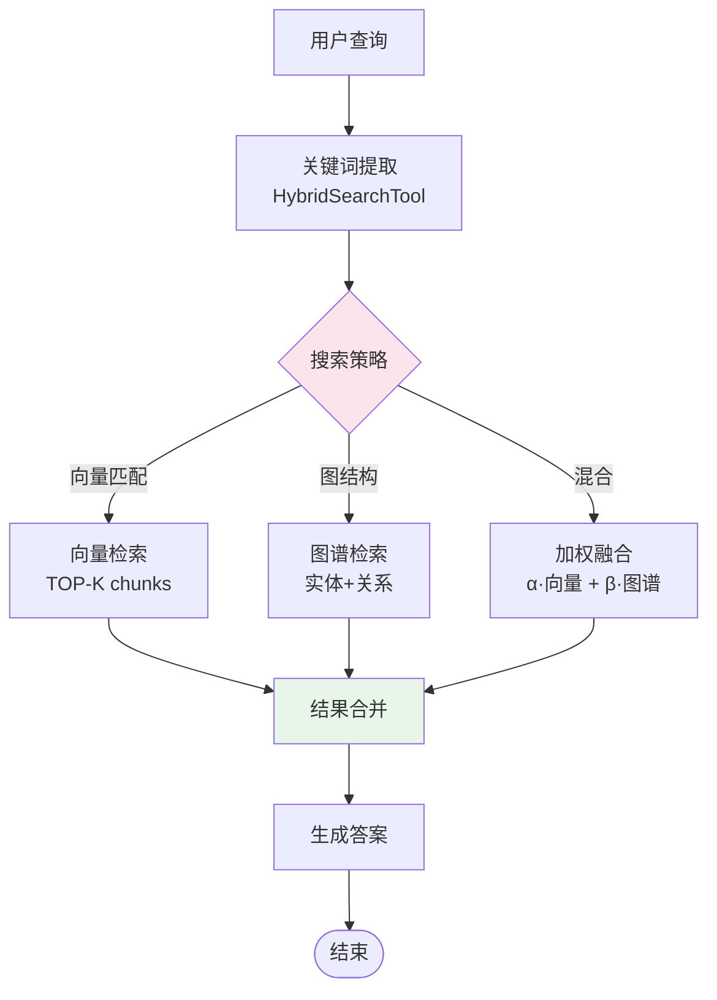

**核心代码**：
```python
class HybridAgent(BaseAgent):
    def __init__(self):
        self.search_tool = HybridSearchTool()  # 混合搜索工具
        super().__init__(cache_dir="./cache/hybrid_agent")

    def _setup_tools(self) -> List:
        return [
            self.search_tool.get_tool(),
            self.search_tool.get_global_tool(),
        ]

    def _extract_keywords(self, query: str) -> Dict[str, List[str]]:
        # 使用搜索工具的关键词提取功能
        return self.search_tool.extract_keywords(query)
```

**HybridSearchTool 工作原理**：
```python
class HybridSearchTool:
    def search(self, query: str) -> str:
        # 1. 关键词提取
        keywords = self.extract_keywords(query)

        # 2. 向量检索
        vector_results = self._vector_search(query, top_k=5)

        # 3. 图谱检索
        graph_results = self._graph_search(keywords, max_hops=2)

        # 4. 加权融合
        final_results = self._merge_results(
            vector_results,
            graph_results,
            alpha=0.6,  # 向量权重
            beta=0.4    # 图谱权重
        )

        return final_results
```

**适用场景**：
- 复杂查询（既需要语义匹配又需要结构推理）
- 中等规模知识库
- 平衡准确率和召回率

---

### 4. DeepResearchAgent（多步迭代搜索）

**特点**：多轮 Think-Search-Reason 循环，深度探索知识图谱。

**工作流程**：
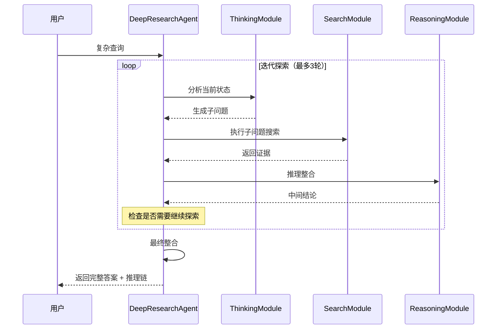

**核心代码**：
```python
class DeepResearchAgent(BaseAgent):
    def __init__(self, use_deeper_tool=True):
        if use_deeper_tool:
            self.research_tool = DeeperResearchTool()
            self.exploration_tool = self.research_tool.get_exploration_tool()
            self.reasoning_analysis_tool = self.research_tool.get_reasoning_analysis_tool()
        else:
            self.research_tool = DeepResearchTool()

        super().__init__(cache_dir="./cache/enhanced_research_agent")

    def _setup_tools(self) -> List:
        tools = [self.research_tool.get_tool()]

        if self.use_deeper_tool:
            tools.append(self.exploration_tool)
            tools.append(self.reasoning_analysis_tool)

        return tools

    def ask_with_thinking(self, query: str, thread_id: str = "default"):
        """返回带思考过程的答案"""
        result = self.research_tool.thinking(query)
        return result
        # 返回格式:
        # {
        #     "answer": "最终答案",
        #     "thinking_steps": [...],
        #     "evidence": [...],
        #     "reasoning_chain": [...]
        # }
```

**思考过程格式**：
```xml
<think>
步骤1: 问题分解
- 子问题1: ...
- 子问题2: ...

步骤2: 证据收集
- 证据1: ... [来源: ...]
- 证据2: ... [来源: ...]

步骤3: 推理整合
- 推论1: ...
- 推论2: ...
</think>

最终答案: ...
```

**适用场景**：
- 复杂多跳推理
- 需要展示推理过程
- 研究性查询

---

### 5. FusionGraphRAGAgent（多智能体协作）

**特点**：Plan-Execute-Report 三阶段，多 Agent 并行协作。

**架构图**：
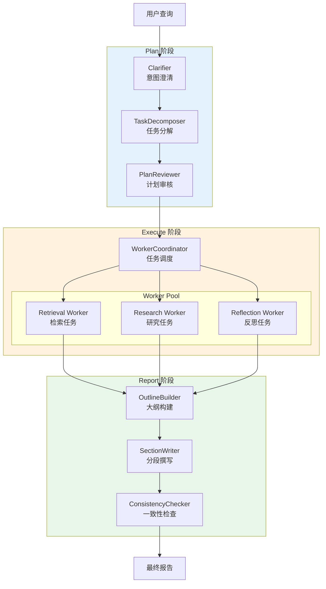

**核心代码**：
```python
class FusionGraphRAGAgent(BaseAgent):
    def __init__(self):
        # 初始化三阶段组件
        self.planner = Planner()
        self.executor = Executor()
        self.reporter = Reporter()

        super().__init__(cache_dir="./cache/fusion_agent")

    def ask(self, query: str, thread_id: str = "default"):
        # 1. Plan 阶段
        plan_spec = self.planner.plan(query)
        # plan_spec = {
        #     "tasks": [...],
        #     "dependencies": {...},
        #     "priority": [...]
        # }

        # 2. Execute 阶段
        execution_records = self.executor.execute(plan_spec)
        # execution_records = [
        #     {"task_id": 1, "result": ..., "evidence": ...},
        #     ...
        # ]

        # 3. Report 阶段
        final_report = self.reporter.generate_report(
            query=query,
            executions=execution_records
        )

        return final_report
```

**Plan 阶段详解**：
```python
class Planner:
    def plan(self, query: str) -> PlanSpec:
        # 1. Clarifier - 澄清用户意图
        clarified_query = self.clarifier.clarify(query)

        # 2. TaskDecomposer - 任务分解
        tasks = self.decomposer.decompose(clarified_query)
        # tasks = [
        #     {"id": 1, "type": "retrieval", "query": "..."},
        #     {"id": 2, "type": "research", "query": "..."},
        # ]

        # 3. PlanReviewer - 审核优化
        optimized_plan = self.reviewer.review(tasks)

        return optimized_plan
```

**适用场景**：
- 超复杂查询（如撰写报告）
- 需要多维度分析
- 高质量输出要求

---

## 工具注册机制

### 工具注册流程

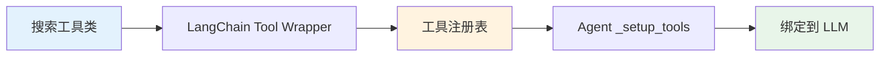

### 工具定义示例

```python
from langchain.tools import tool

class LocalSearchTool:
    def __init__(self):
        self.searcher = LocalSearch(llm, embeddings)

    @tool
    def search(self, query: str) -> str:
        """
        在知识图谱中进行本地搜索。

        参数:
            query: 搜索查询字符串

        返回:
            str: 检索到的相关信息
        """
        return self.searcher.search(query)

    def get_tool(self):
        """返回 LangChain 工具对象"""
        return self.search
```

**工具描述的重要性**：
- LLM 通过工具的 `docstring` 理解工具功能
- 描述越清晰，LLM 选择越准确

### 多工具协作

```python
class HybridAgent(BaseAgent):
    def _setup_tools(self) -> List:
        return [
            self.search_tool.get_tool(),          # 混合搜索
            self.search_tool.get_global_tool(),   # 全局搜索
        ]

# LLM 会根据查询特点自动选择工具
# 例如：
# "奖学金申请条件？" → 使用 hybrid search
# "所有奖学金类型统计？" → 使用 global search
```

---

## 流式响应实现

### 伪流式 vs 真流式

**当前实现**：伪流式（由于 LangChain 版本限制）

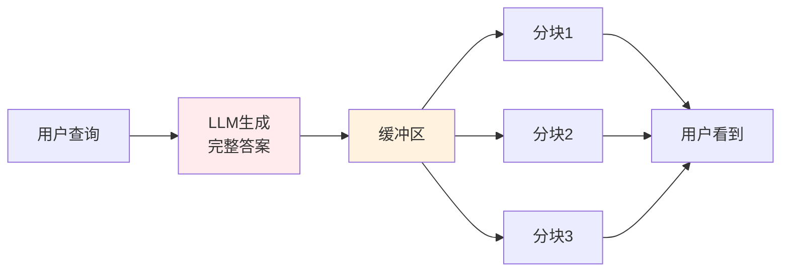

**真流式（未来升级）**：
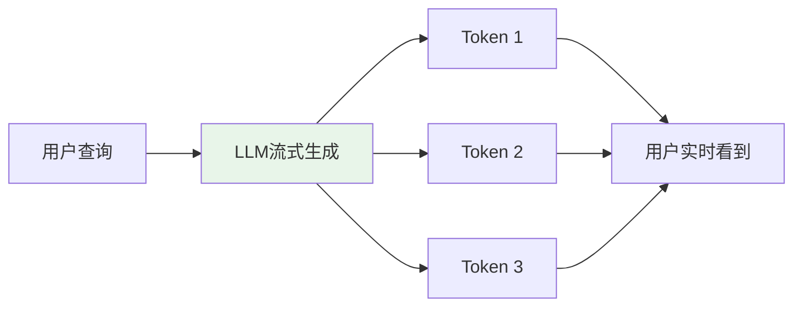

### 流式代码实现

```python
async def _stream_process(self, inputs, config):
    """实现流式处理过程"""
    query = inputs["messages"][-1].content
    thread_id = config.get("configurable", {}).get("thread_id", "default")

    # 1. 缓存检查
    cached_response = self.cache_manager.get(query.strip(), thread_id=thread_id)
    if cached_response:
        # 分块返回缓存结果
        chunks = re.split(r'([.!?。！？]\s*)', cached_response)
        buffer = ""

        for i in range(0, len(chunks)):
            buffer += chunks[i]

            # 当缓冲区包含完整句子或达到阈值时输出
            if (i % 2 == 1) or len(buffer) >= self.stream_flush_threshold:
                yield buffer
                buffer = ""
                await asyncio.sleep(0.01)

        if buffer:
            yield buffer
        return

    # 2. 执行工作流
    workflow_state = {"messages": [HumanMessage(content=query)]}

    # 提示用户正在处理
    yield "**正在分析问题**...\n\n"

    # Agent 节点
    agent_output = self._agent_node(workflow_state)
    workflow_state = {"messages": workflow_state["messages"] + agent_output["messages"]}

    # 检查是否需要工具
    tool_decision = tools_condition(workflow_state)
    if tool_decision == "tools":
        yield "**正在检索相关信息**...\n\n"

        # 检索节点
        retrieve_output = await self._retrieve_node_async(workflow_state)
        workflow_state = {"messages": workflow_state["messages"] + retrieve_output["messages"]}

        yield "**正在生成回答**...\n\n"

        # 流式生成
        async for token in self._generate_node_stream(workflow_state):
            yield token
```

### 分块策略

```python
# 按句子分块（更自然）
sentences = re.split(r'([.!?。！？]\s*)', response)
buffer = ""

for i in range(0, len(sentences)):
    buffer += sentences[i]

    # 完整句子 OR 达到阈值
    if (i % 2 == 1) or len(buffer) >= self.stream_flush_threshold:
        yield buffer
        buffer = ""
        await asyncio.sleep(0.01)  # 避免过快刷新

if buffer:
    yield buffer
```

**配置参数**：
```python
# .env 或 settings.py
STREAM_FLUSH_THRESHOLD = 100          # 普通 Agent
DEEP_STREAM_FLUSH_THRESHOLD = 150     # Deep Research Agent
FUSION_STREAM_FLUSH_THRESHOLD = 200   # Fusion Agent
```

---

## 缓存系统

### 缓存架构

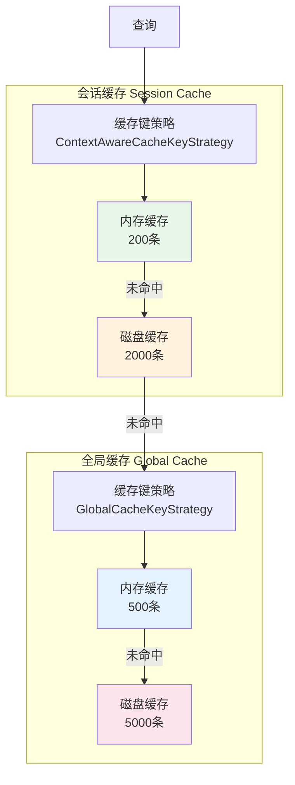

### 缓存键生成策略

**会话缓存（上下文感知）**：
```python
class ContextAwareCacheKeyStrategy:
    def generate_key(self, query: str, thread_id: str, **kwargs) -> str:
        # 考虑对话历史
        context_hash = self._hash_context(thread_id)
        query_hash = self._hash_query(query)

        # 组合键
        return f"{thread_id}:{context_hash}:{query_hash}"
```

**全局缓存（仅基于查询）**：
```python
class GlobalCacheKeyStrategy:
    def generate_key(self, query: str, **kwargs) -> str:
        # 仅基于查询文本
        return self._hash_query(query)
```

### 缓存质量控制

```python
def mark_answer_quality(self, query: str, is_positive: bool, thread_id: str = "default"):
    """标记回答质量，用于缓存质量控制"""
    keywords = self._extract_keywords(query)

    self.cache_manager.mark_quality(
        query.strip(),
        is_positive,
        thread_id=thread_id,
        low_level_keywords=keywords.get("low_level", []),
        high_level_keywords=keywords.get("high_level", [])
    )

# 高质量缓存会进入"快速路径"，跳过验证
```

### 缓存失效

```python
def clear_cache_for_query(self, query: str, thread_id: str = "default"):
    """清除特定查询的缓存"""
    # 清除会话缓存
    self.cache_manager.delete(query.strip(), thread_id=thread_id)

    # 清除全局缓存
    self.global_cache_manager.delete(query.strip())

    # 强制刷新写队列
    self.cache_manager.storage._flush_write_queue()
    self.global_cache_manager.storage._flush_write_queue()
```

---

## Agent 对比

### 功能对比表

| 特性 | NaiveRagAgent | GraphAgent | HybridAgent | DeepResearchAgent | FusionGraphRAGAgent |
|------|---------------|------------|-------------|-------------------|---------------------|
| **搜索策略** | 向量检索 | 图谱检索（本地+全局） | 向量+图谱混合 | 多步迭代搜索 | 多智能体协作 |
| **推理能力** | 低 | 中 | 中高 | 高 | 极高 |
| **关键词提取** | 无 | LLM提取 | 工具提取 | LLM提取 | 多阶段提取 |
| **多轮对话** | 支持 | 支持 | 支持 | 支持 | 支持 |
| **流式响应** | 支持 | 支持 | 支持 | 支持 | 支持 |
| **缓存机制** | 双层缓存 | 双层缓存 | 双层缓存 | 双层缓存 | 双层缓存 |
| **响应速度** | 快 | 中 | 中 | 慢 | 慢 |
| **准确率** | 低 | 中高 | 高 | 高 | 极高 |
| **资源消耗** | 低 | 中 | 中 | 高 | 高 |
| **适用场景** | 简单问答 | 实体关系推理 | 通用查询 | 复杂推理 | 报告生成 |

### 性能对比

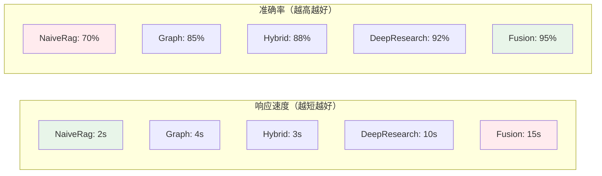

### 选择建议

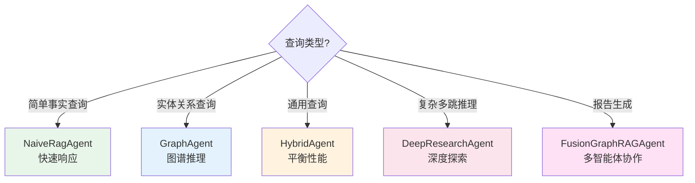

---

## 开发指南

### 如何创建自定义 Agent

**步骤1：创建 Agent 类**
```python
from graphrag_agent.agents.base import BaseAgent

class CustomAgent(BaseAgent):
    def __init__(self):
        # 初始化自定义工具
        self.my_tool = MyCustomTool()

        # 调用父类构造函数
        super().__init__(cache_dir="./cache/custom_agent")
```

**步骤2：实现必需方法**
```python
    def _setup_tools(self) -> List:
        """设置工具（必需）"""
        return [
            self.my_tool.get_tool(),
        ]

    def _add_retrieval_edges(self, workflow):
        """添加检索边（必需）"""
        # 简单实现：直接从 retrieve 到 generate
        workflow.add_edge("retrieve", "generate")

        # 复杂实现：添加自定义节点
        # workflow.add_node("custom", self._custom_node)
        # workflow.add_edge("retrieve", "custom")
        # workflow.add_edge("custom", "generate")

    def _extract_keywords(self, query: str) -> Dict[str, List[str]]:
        """提取关键词（必需）"""
        # 使用 LLM 或其他方法提取
        return {"low_level": [...], "high_level": [...]}

    def _generate_node(self, state):
        """生成答案（必需）"""
        messages = state["messages"]
        question = messages[-3].content
        docs = messages[-1].content

        # 缓存检查
        thread_id = state.get("configurable", {}).get("thread_id", "default")
        cached_result = self.cache_manager.get(question, thread_id=thread_id)
        if cached_result:
            return {"messages": [AIMessage(content=cached_result)]}

        # 使用 LLM 生成
        prompt = ChatPromptTemplate.from_messages([
            ("system", SYSTEM_PROMPT),
            ("human", HUMAN_PROMPT),
        ])

        chain = prompt | self.llm | StrOutputParser()
        response = chain.invoke({"context": docs, "question": question})

        # 更新缓存
        self.cache_manager.set(question, response, thread_id=thread_id)

        return {"messages": [AIMessage(content=response)]}
```

**步骤3：实现流式方法（可选）**
```python
    async def _stream_process(self, inputs, config):
        """流式处理（可选）"""
        # 参考 HybridAgent._stream_process 实现
        pass
```

**步骤4：使用自定义 Agent**
```python
agent = CustomAgent()

# 同步调用
answer = agent.ask("你的问题", thread_id="session_123")

# 流式调用
async for chunk in agent.ask_stream("你的问题", thread_id="session_123"):
    print(chunk, end="", flush=True)
```

### 添加自定义节点

```python
def _add_retrieval_edges(self, workflow):
    # 添加自定义节点
    workflow.add_node("preprocess", self._preprocess_node)
    workflow.add_node("postprocess", self._postprocess_node)

    # 定义边
    workflow.add_edge("retrieve", "preprocess")
    workflow.add_edge("preprocess", "generate")
    workflow.add_edge("generate", "postprocess")
    workflow.add_edge("postprocess", END)

def _preprocess_node(self, state):
    """预处理节点"""
    messages = state["messages"]
    # 对检索结果进行清洗、去重等
    processed_docs = self._clean_documents(messages[-1].content)

    # 更新最后一条消息
    messages[-1].content = processed_docs
    return {"messages": messages}

def _postprocess_node(self, state):
    """后处理节点"""
    messages = state["messages"]
    # 对生成的答案进行格式化
    formatted_answer = self._format_answer(messages[-1].content)

    messages[-1].content = formatted_answer
    return {"messages": messages}
```

### 调试技巧

**1. 启用执行日志**
```python
result = agent.ask_with_trace("问题", thread_id="debug")
print(result["execution_log"])
# [
#     {"node": "extract_keywords", "input": "...", "output": {...}},
#     {"node": "agent", "input": [...], "output": ...},
#     ...
# ]
```

**2. 可视化工作流**
```python
from IPython.display import Image, display

# 生成工作流图
display(Image(agent.graph.get_graph().draw_mermaid_png()))
```

**3. 性能监控**
```python
print(agent.performance_metrics)
# {
#     "ask": {"total_duration": 5.2, "processing": 4.8},
#     "cache_check": {"duration": 0.05, "type": "miss"},
#     ...
# }
```

### 常见问题

**Q1: 如何禁用缓存？**
```python
agent = CustomAgent()
agent.cache_manager.enable_cache = False
agent.global_cache_manager.enable_cache = False
```

**Q2: 如何调整递归限制？**
```python
# 方式1：环境变量
os.environ["AGENT_DEFAULT_RECURSION_LIMIT"] = "50"

# 方式2：调用时指定
agent.ask("问题", recursion_limit=50)
```

**Q3: 如何处理超长对话历史？**
```python
# 定期清理会话状态
agent.memory.clear(config)

# 或使用滑动窗口（保留最近 N 条消息）
```

---

## 相关文档

- [知识图谱构建](./知识图谱构建.md) - 了解知识图谱的构建流程
- [搜索引擎](./搜索引擎.md) - 了解各种搜索策略的实现
- [系统架构总览](../01-整体架构/系统架构总览.md) - 了解整体架构
- [LangGraph 官方文档](https://langchain-ai.github.io/langgraph/) - LangGraph 框架文档

---

## 更新日志

| 版本 | 日期 | 更新内容 | 作者 |
|------|------|----------|------|
| 1.0 | 2026-01-04 | 初始版本，完整覆盖5种Agent | Claude |
| - | - | - | - |
