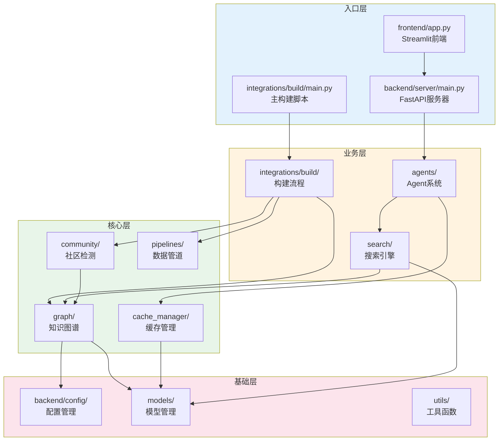
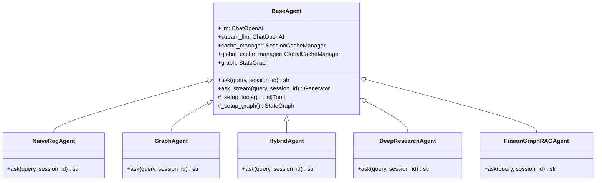
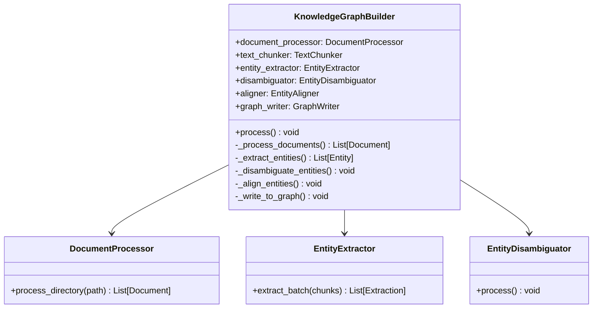
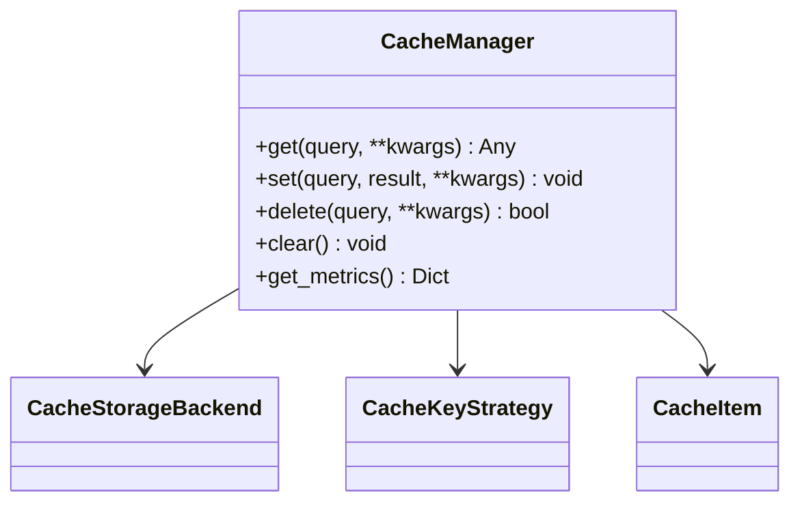
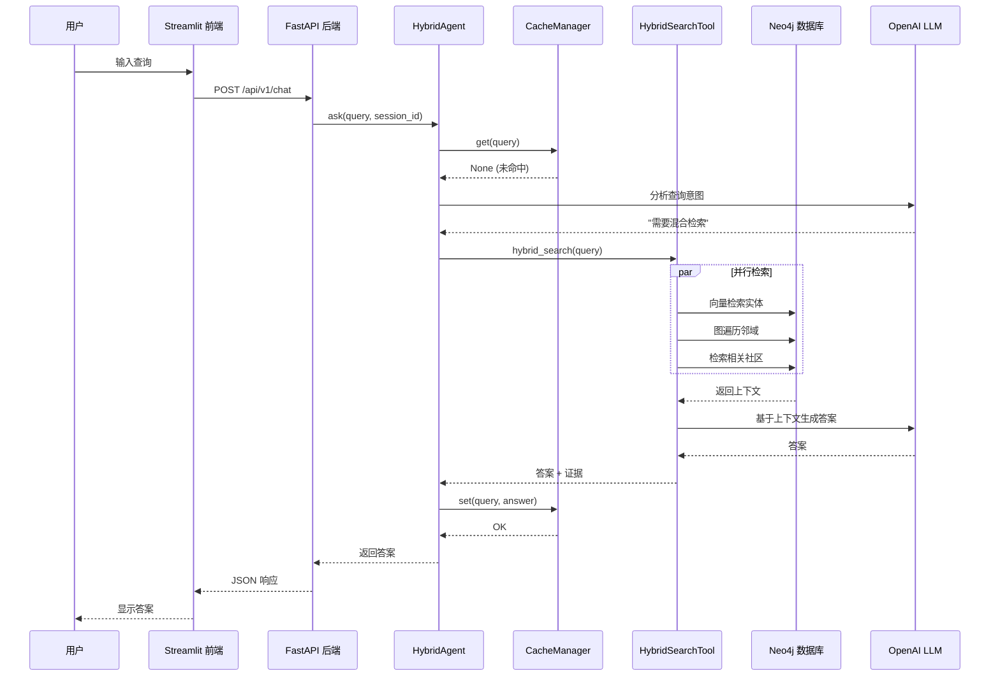

# 代码走读

# ⚠️ 注意：缓存目录/CacheManager 描述已过时

本文档里出现的 `cache_manager/CacheManager` 属于历史实现；v3 strict 已将缓存系统**物理下线**。
后续阅读请以代码现状为准（Postgres 持久化 + mem0 记忆，无缓存模块）。

---

## 📋 元信息

- **目标读者**：二次开发者、贡献者
- **阅读时间**：90分钟
- **难度**：⭐⭐⭐⭐
- **前置知识**：Python 3.10+、Neo4j、LangChain、面向对象编程
- **最后更新**：2026-01-04

---

## 📖 本文大纲

- [项目结构总览](#项目结构总览)
- [核心模块解析](#核心模块解析)
- [关键类详解](#关键类详解)
- [设计模式应用](#设计模式应用)
- [数据流追踪](#数据流追踪)
- [扩展点识别](#扩展点识别)
- [代码规范](#代码规范)
- [调试技巧](#调试技巧)
- [常见陷阱](#常见陷阱)
- [相关文档](#相关文档)

---

## 项目结构总览

### 目录树

```
backend/graphrag_agent/
├── __init__.py                    # 包初始化
├── readme.md                      # 模块说明
│
├── agents/                        # Agent 系统
│   ├── __init__.py
│   ├── base.py                    # BaseAgent 基类
│   ├── naive_rag_agent.py         # NaiveRAG Agent
│   ├── graph_agent.py             # Graph Agent
│   ├── hybrid_agent.py            # Hybrid Agent
│   ├── deep_research_agent.py     # Deep Research Agent
│   ├── fusion_agent.py            # Fusion GraphRAG Agent
│   └── multi_agent/               # 多 Agent 协作
│       ├── __init__.py
│       ├── orchestrator.py        # 协调器（已废弃）
│       ├── planner/               # 规划阶段
│       ├── executor/              # 执行阶段
│       ├── reporter/              # 报告阶段
│       └── integration/           # 集成层
│
├── cache_manager/                 # 缓存管理
│   ├── __init__.py
│   ├── manager.py                 # 统一缓存管理器（精确 key 命中）
│   ├── backends/                  # 存储后端
│   ├── models/                    # CacheItem 元数据
│   └── strategies/                # Key 策略
│
├── community/                     # 社区检测
│   ├── __init__.py
│   ├── detector/                  # 检测器
│   │   ├── base.py                # BaseCommunityDetector
│   │   ├── leiden.py              # Leiden 算法
│   │   ├── sllpa.py               # SLLPA 算法
│   │   └── projections.py         # 图投影混入
│   └── summary/                   # 社区摘要
│       ├── base.py                # BaseSummarizer
│       ├── leiden.py              # Leiden 摘要生成
│       └── sllpa.py               # SLLPA 摘要生成
│
├── config/                       # 配置管理
│   ├── __init__.py
│   ├── prompts/                  # Prompt 模板
│   └── settings.py               # 核心默认配置
│
├── evaluation/                    # 评估系统
│   ├── __init__.py
│   ├── metrics/                   # 评估指标
│   ├── preprocessing/             # 数据预处理
│   └── test/                      # 测试脚本
│
├── graph/                         # 知识图谱
│   ├── __init__.py
│   ├── core/                      # 核心组件
│   │   ├── graph_ops.py           # 图访问辅助方法
│   │   └── utils.py               # 工具函数
│   ├── extraction/                # 实体关系提取与写入
│   │   ├── entity_extractor.py    # 实体提取器
│   │   ├── prompt_builder.py      # Prompt 构建
│   │   └── graph_writer.py        # 图写入器（GraphWriter）
│   ├── processing/                # 实体处理
│   │   ├── disambiguator.py       # 实体消歧
│   │   └── aligner.py             # 实体对齐
│   ├── indexing/                  # 向量索引
│   │   ├── entity_index.py        # 实体索引
│   │   └── chunk_index.py         # Chunk 索引
│   └── graph_consistency_validator.py  # 一致性验证
│
├── integrations/                  # 集成入口
│   ├── __init__.py
│   └── build/                     # 构建流程
│       ├── main.py                # 主构建脚本
│       ├── build_graph.py         # 图谱构建器
│       ├── incremental_update.py  # 增量更新
│       └── incremental/           # 增量更新实现
│
├── models/                        # 模型管理
│   ├── __init__.py
│   ├── get_models.py              # LLM/嵌入模型获取
│   └── schemas/                   # 数据模式
│
├── pipelines/                     # 数据管道
│   ├── __init__.py
│   └── ingestion/                 # 数据摄取
│       ├── document_processor.py  # 文档处理器
│       └── text_chunker.py        # 文本分块器
│
├── search/                        # 搜索引擎
│   ├── __init__.py
│   ├── local_search.py            # 本地搜索
│   ├── global_search.py           # 全局搜索
│   ├── tool/                      # 搜索工具
│   │   ├── base.py                # BaseSearchTool
│   │   ├── naive_tool.py          # Naive Search Tool
│   │   ├── hybrid_tool.py         # Hybrid Search Tool
│   │   └── deep_research_tool.py  # Deep Research Tool
│   └── tool_registry.py           # 工具注册表
│
└── utils/                         # 工具函数
    ├── __init__.py
    └── logging_context.py         # 日志上下文
```

### 模块职责



---

## 核心模块解析

### 1. agents/ - Agent 系统

**核心文件**：`agents/base.py`

**关键类**：`BaseAgent`

**职责**：
- 定义所有 Agent 的基础接口
- 集成 LangGraph 工作流
- 管理 LLM 实例和缓存
- 提供统一的 `ask()` 和 `ask_stream()` 接口

**继承关系**：



**代码示例**：

```python
# backend/graphrag_agent/agents/base.py

from abc import ABC, abstractmethod
from typing import List, Dict, Any, Generator
from langgraph.graph import StateGraph, END
from langchain_core.tools import Tool
from langchain_openai import ChatOpenAI

class BaseAgent(ABC):
    """Agent 基类"""

    def __init__(
        self,
        session_id: str = "default",
        enable_cache: bool = True,
        enable_stream: bool = True
    ):
        """初始化 Agent"""
        # 1. LLM 实例
        self.llm = get_llm_model(stream=False)
        self.stream_llm = get_llm_model(stream=True) if enable_stream else None

        # 2. 缓存管理器
        self.cache_manager = SessionCacheManager(session_id) if enable_cache else None
        self.global_cache_manager = GlobalCacheManager() if enable_cache else None

        # 3. 图数据库连接
        self.neo4j_graph = get_graph()

        # 4. 工具和图设置
        self.tools = self._setup_tools()
        self.graph = self._setup_graph()

        # 5. 编译 LangGraph
        self.app = self.graph.compile(
            checkpointer=MemorySaver()  # 会话状态保存
        )

    @abstractmethod
    def _setup_tools(self) -> List[Tool]:
        """子类实现：设置工具列表"""
        pass

    def _setup_graph(self) -> StateGraph:
        """设置 LangGraph 工作流（可被子类重写）"""
        from langgraph.prebuilt import create_react_agent

        return create_react_agent(
            self.llm,
            tools=self.tools,
            state_modifier=self._get_system_prompt()
        )

    def ask(self, query: str, session_id: str = None) -> str:
        """同步问答接口"""
        session_id = session_id or "default"

        # 1. 检查缓存
        if self.cache_manager:
            cached_result = self.cache_manager.get(query)
            if cached_result:
                return cached_result

        # 2. 调用 LangGraph
        result = self.app.invoke(
            {"messages": [("user", query)]},
            config={"configurable": {"thread_id": session_id}}
        )

        # 3. 提取答案
        answer = result["messages"][-1].content

        # 4. 写入缓存
        if self.cache_manager:
            self.cache_manager.set(query, answer)

        return answer

    def ask_stream(self, query: str, session_id: str = None) -> Generator:
        """流式问答接口"""
        # 实现流式生成逻辑
        pass
```

**文件位置**：`backend/graphrag_agent/agents/base.py:1-150`

---

### 2. graph/ - 知识图谱模块

**核心文件**：`graph/extraction/entity_extractor.py`

**关键类**：`EntityExtractor`

**职责**：
- 使用 LLM 从文本块提取实体和关系
- 管理提取 Prompt
- 支持批量并行提取
- 集成全局缓存

**代码示例**：

```python
# backend/graphrag_agent/graph/extraction/entity_extractor.py

from typing import List, Dict, Tuple
from concurrent.futures import ThreadPoolExecutor
from infrastructure.providers.models import get_llm_model
from infrastructure.providers.cache import CacheManager
from graphrag_agent.config.prompts import ENTITY_EXTRACTION_PROMPT

class EntityExtractor:
    """实体关系提取器"""

    def __init__(self, enable_cache: bool = True):
        self.llm = get_llm_model(stream=False)
        self.cache_manager = CacheManager() if enable_cache else None
        self.extraction_chain = self._build_extraction_chain()

    def _build_extraction_chain(self):
        """构建提取链"""
        from langchain_core.prompts import ChatPromptTemplate
        from langchain_core.output_parsers import JsonOutputParser

        prompt = ChatPromptTemplate.from_messages([
            ("system", ENTITY_EXTRACTION_PROMPT),
            ("user", "文本内容：\n{text}\n\n请提取实体和关系（JSON格式）")
        ])

        return prompt | self.llm | JsonOutputParser()

    def extract_from_chunk(self, chunk_text: str) -> Dict[str, Any]:
        """从单个文本块提取实体关系"""
        # 1. 检查缓存
        if self.cache_manager:
            cache_key = f"extraction_{hash(chunk_text)}"
            cached = self.cache_manager.get(cache_key)
            if cached:
                return cached

        # 2. LLM 提取
        try:
            result = self.extraction_chain.invoke({"text": chunk_text})

            # 3. 写入缓存
            if self.cache_manager:
                self.cache_manager.set(cache_key, result)

            return result

        except Exception as e:
            print(f"提取失败: {e}")
            return {"entities": [], "relationships": []}

    def extract_batch(
        self,
        chunks: List[Dict],
        max_workers: int = 4
    ) -> List[Dict]:
        """批量并行提取"""
        with ThreadPoolExecutor(max_workers=max_workers) as executor:
            futures = [
                executor.submit(self.extract_from_chunk, chunk["text"])
                for chunk in chunks
            ]

            results = [future.result() for future in futures]

        return results
```

**文件位置**：`backend/graphrag_agent/graph/extraction/entity_extractor.py:1-120`

---

### 3. search/ - 搜索引擎模块

**核心文件**：`search/local_search.py`

**关键类**：`LocalSearch`

**职责**：
- 实现本地搜索（Entity-centric）
- 向量检索 + 图遍历
- 生成带证据的答案

**代码示例**：

```python
# backend/graphrag_agent/search/local_search.py

from typing import List, Dict
from infrastructure.models import get_llm_model, get_embeddings_model
from langchain_community.graphs import Neo4jGraph

class LocalSearch:
    """本地搜索：基于实体的邻域搜索"""

    def __init__(self):
        self.llm = get_llm_model()
        self.embeddings = get_embeddings_model()
        self.graph = Neo4jGraph(
            url=NEO4J_URI,
            username=NEO4J_USERNAME,
            password=NEO4J_PASSWORD
        )

    def search(
        self,
        query: str,
        top_k_entities: int = 5,
        neighborhood_depth: int = 2
    ) -> str:
        """执行本地搜索"""
        # 1. 查询向量化
        query_vector = self.embeddings.embed_query(query)

        # 2. 向量检索相关实体
        entities = self._retrieve_entities(query_vector, top_k_entities)

        # 3. 扩展实体邻域
        context = self._expand_neighborhood(entities, neighborhood_depth)

        # 4. LLM 生成答案
        answer = self._generate_answer(query, context)

        return answer

    def _retrieve_entities(
        self,
        query_vector: List[float],
        top_k: int
    ) -> List[Dict]:
        """向量检索实体"""
        result = self.graph.query("""
            CALL db.index.vector.queryNodes('entity_index', $top_k, $query_vector)
            YIELD node, score
            RETURN node.id AS id,
                   node.name AS name,
                   node.description AS description,
                   score
            ORDER BY score DESC
        """, params={
            "query_vector": query_vector,
            "top_k": top_k
        })

        return result

    def _expand_neighborhood(
        self,
        entities: List[Dict],
        depth: int
    ) -> Dict[str, Any]:
        """扩展实体邻域"""
        entity_ids = [e["id"] for e in entities]

        result = self.graph.query(f"""
            MATCH (e:__Entity__)
            WHERE e.id IN $entity_ids

            // 扩展 {depth} 跳邻居
            CALL {{
                WITH e
                MATCH path = (e)-[r*1..{depth}]-(neighbor:__Entity__)
                RETURN
                    collect(DISTINCT neighbor) AS neighbors,
                    collect(DISTINCT r) AS relationships
            }}

            RETURN
                collect(e) AS center_entities,
                neighbors,
                relationships
        """, params={"entity_ids": entity_ids})

        return result[0] if result else {}

    def _generate_answer(self, query: str, context: Dict) -> str:
        """基于上下文生成答案"""
        from langchain_core.prompts import ChatPromptTemplate

        prompt = ChatPromptTemplate.from_messages([
            ("system", "你是一个知识图谱问答助手。基于提供的实体和关系回答用户问题。"),
            ("user", "问题：{query}\n\n上下文：\n{context}\n\n请回答：")
        ])

        # 格式化上下文
        context_str = self._format_context(context)

        # 调用 LLM
        chain = prompt | self.llm
        response = chain.invoke({
            "query": query,
            "context": context_str
        })

        return response.content
```

**文件位置**：`backend/graphrag_agent/search/local_search.py:1-180`

---

## 关键类详解

### 1. KnowledgeGraphBuilder

**位置**：`backend/infrastructure/integrations/build/build_graph.py`

**职责**：编排知识图谱构建的完整流程

**类图**：



**完整代码解析**：

```python
# backend/infrastructure/integrations/build/build_graph.py

from infrastructure.pipelines.ingestion import DocumentProcessor
from graphrag_agent.graph.extraction import EntityExtractor
from graphrag_agent.graph.processing import EntityDisambiguator, EntityAligner
from graphrag_agent.graph.core import GraphWriter

class KnowledgeGraphBuilder:
    """知识图谱构建器：编排完整构建流程"""

    def __init__(self, source_dir: str = "files/"):
        """初始化构建器"""
        self.source_dir = source_dir

        # 初始化各组件
        self.document_processor = DocumentProcessor(self.source_dir)
        self.text_chunker = self.document_processor.chunker
        self.entity_extractor = EntityExtractor(enable_cache=True)
        self.disambiguator = EntityDisambiguator()
        self.aligner = EntityAligner()
        self.graph_writer = GraphWriter()

    def process(self):
        """执行完整构建流程"""
        print("=" * 60)
        print("开始知识图谱构建")
        print("=" * 60)

        # 步骤1：文档处理
        print("\n[1/6] 文档处理...")
        documents = self._process_documents()
        print(f"✓ 处理了 {len(documents)} 个文档")

        # 步骤2：文本分块
        print("\n[2/6] 文本分块...")
        chunks = self._chunk_documents(documents)
        print(f"✓ 生成了 {len(chunks)} 个文本块")

        # 步骤3：实体关系提取
        print("\n[3/6] 实体关系提取...")
        extractions = self._extract_entities(chunks)
        print(f"✓ 提取了 {len(extractions)} 个实体关系对")

        # 步骤4：写入图数据库
        print("\n[4/6] 写入 Neo4j...")
        self._write_to_graph(documents, chunks, extractions)
        print("✓ 图谱写入完成")

        # 步骤5：实体消歧
        print("\n[5/6] 实体消歧...")
        self.disambiguator.process()
        print("✓ 实体消歧完成")

        # 步骤6：实体对齐
        print("\n[6/6] 实体对齐...")
        self.aligner.process()
        print("✓ 实体对齐完成")

        print("\n" + "=" * 60)
        print("知识图谱构建完成！")
        print("=" * 60)

    def _process_documents(self) -> List[Dict]:
        """处理文档"""
        from pathlib import Path

        # 获取所有文档
        doc_files = list(Path(self.source_dir).rglob("*"))
        doc_files = [f for f in doc_files if f.is_file()]

        # 处理每个文档
        documents = []
        for doc_file in doc_files:
            try:
                content = self.document_processor.process_file(str(doc_file))
                documents.append({
                    "id": f"doc_{hash(str(doc_file))}",
                    "file_name": doc_file.name,
                    "file_path": str(doc_file),
                    "content": content,
                    "file_type": doc_file.suffix[1:]
                })
            except Exception as e:
                print(f"处理文档失败 {doc_file}: {e}")

        return documents

    def _chunk_documents(self, documents: List[Dict]) -> List[Dict]:
        """文本分块"""
        all_chunks = []

        for doc in documents:
            chunks = self.text_chunker.chunk_text(doc["content"])

            for i, chunk_text in enumerate(chunks):
                all_chunks.append({
                    "id": f"{doc['id']}_chunk_{i}",
                    "document_id": doc["id"],
                    "text": chunk_text,
                    "chunk_index": i
                })

        return all_chunks

    def _extract_entities(self, chunks: List[Dict]) -> List[Dict]:
        """提取实体关系"""
        # 批量并行提取
        extractions = self.entity_extractor.extract_batch(
            chunks,
            max_workers=MAX_WORKERS
        )

        # 合并结果
        all_entities = []
        all_relationships = []

        for i, extraction in enumerate(extractions):
            chunk_id = chunks[i]["id"]

            for entity in extraction.get("entities", []):
                entity["source_chunk"] = chunk_id
                all_entities.append(entity)

            for rel in extraction.get("relationships", []):
                rel["source_chunk"] = chunk_id
                all_relationships.append(rel)

        return {
            "entities": all_entities,
            "relationships": all_relationships
        }

    def _write_to_graph(
        self,
        documents: List[Dict],
        chunks: List[Dict],
        extractions: Dict
    ):
        """写入图数据库"""
        # 1. 写入文档节点
        self.graph_writer.write_documents(documents)

        # 2. 写入 Chunk 节点
        self.graph_writer.write_chunks(chunks)

        # 3. 写入实体节点
        self.graph_writer.write_entities(extractions["entities"])

        # 4. 写入关系
        self.graph_writer.write_relationships(extractions["relationships"])
```

**文件位置**：`backend/infrastructure/integrations/build/build_graph.py:1-250`

---

### 2. CacheManager

**位置**：`backend/infrastructure/cache_manager/manager.py`

**职责**：统一缓存入口（精确 key 命中），管理存储后端与缓存键策略

**类图**：



**代码示例**：

```python
# backend/infrastructure/cache_manager/manager.py

from infrastructure.providers.cache import (
    CacheManager,
    MemoryCacheBackend,
    SimpleCacheKeyStrategy,
)

# 当前实现以 `CacheManager` 为统一入口（仅精确 key 命中）。
cache = CacheManager(
    key_strategy=SimpleCacheKeyStrategy(),
    storage_backend=MemoryCacheBackend(),
)

cached = cache.get("What is GraphRAG?")
if cached is None:
    cache.set("What is GraphRAG?", "GraphRAG is ...")
    cached = cache.get("What is GraphRAG?")

print(cached)
```

**文件位置**：`backend/infrastructure/cache_manager/manager.py`（实现以代码为准；此处示例为简化调用）

---

## 设计模式应用

### 1. 工厂模式（Factory Pattern）

**应用场景**：创建社区检测器

```python
# backend/graphrag_agent/community/__init__.py

class CommunityDetectorFactory:
    """社区检测器工厂"""

    @staticmethod
    def create(
        algorithm: str,
        gds,
        graph
    ) -> BaseCommunityDetector:
        """根据算法类型创建检测器"""
        if algorithm == "leiden":
            from .detector.leiden import LeidenDetector
            return LeidenDetector(gds, graph)

        elif algorithm == "sllpa":
            from .detector.sllpa import SLLPADetector
            return SLLPADetector(gds, graph)

        else:
            raise ValueError(f"不支持的算法: {algorithm}")


# 使用示例
detector = CommunityDetectorFactory.create(
    algorithm="leiden",
    gds=gds,
    graph=graph
)
result = detector.process()
```

**优势**：
- 解耦对象创建和使用
- 方便扩展新算法
- 统一创建接口

---

### 2. 策略模式（Strategy Pattern）

**应用场景**：缓存后端选择

```python
# backend/infrastructure/cache_manager/backends/base.py

from abc import ABC, abstractmethod

class CacheBackend(ABC):
    """缓存后端接口"""

    @abstractmethod
    def get(self, key: str) -> Any:
        pass

    @abstractmethod
    def set(self, key: str, value: Any):
        pass

    @abstractmethod
    def clear(self):
        pass


# 内存后端实现
class MemoryCacheBackend(CacheBackend):
    def __init__(self):
        self.storage = {}

    def get(self, key: str) -> Any:
        return self.storage.get(key)

    def set(self, key: str, value: Any):
        self.storage[key] = value

    def clear(self):
        self.storage.clear()


# 磁盘后端实现
class DiskCacheBackend(CacheBackend):
    def __init__(self, cache_dir: str):
        self.cache_dir = Path(cache_dir)
        self.cache_dir.mkdir(parents=True, exist_ok=True)

    def get(self, key: str) -> Any:
        cache_file = self.cache_dir / f"{hash(key)}.json"
        if cache_file.exists():
            with open(cache_file, 'r') as f:
                return json.load(f)
        return None

    def set(self, key: str, value: Any):
        cache_file = self.cache_dir / f"{hash(key)}.json"
        with open(cache_file, 'w') as f:
            json.dump(value, f)

    def clear(self):
        shutil.rmtree(self.cache_dir)
        self.cache_dir.mkdir(parents=True, exist_ok=True)


# 使用示例
# 可以动态切换后端
backend = MemoryCacheBackend()  # 或 DiskCacheBackend("./cache")
cache_manager = SessionCacheManager(
    session_id="user_123",
    backend=backend
)
```

**优势**：
- 运行时动态选择算法
- 易于扩展新后端
- 符合开闭原则

---

### 3. 模板方法模式（Template Method Pattern）

**应用场景**：Agent 基类定义流程模板

```python
# backend/graphrag_agent/agents/base.py

class BaseAgent(ABC):
    """Agent 基类：定义问答流程模板"""

    def ask(self, query: str, session_id: str = None) -> str:
        """问答流程模板（不可被重写）"""
        # 1. 预处理（钩子方法）
        processed_query = self._preprocess_query(query)

        # 2. 检查缓存
        cached_result = self._check_cache(processed_query, session_id)
        if cached_result:
            return cached_result

        # 3. 核心处理（抽象方法，子类必须实现）
        answer = self._process_query(processed_query, session_id)

        # 4. 后处理（钩子方法）
        final_answer = self._postprocess_answer(answer)

        # 5. 写入缓存
        self._write_cache(processed_query, final_answer, session_id)

        return final_answer

    def _preprocess_query(self, query: str) -> str:
        """预处理查询（钩子方法，子类可选择重写）"""
        return query.strip()

    def _check_cache(self, query: str, session_id: str) -> Optional[str]:
        """检查缓存（模板内部方法）"""
        if self.cache_manager:
            return self.cache_manager.get(query)
        return None

    @abstractmethod
    def _process_query(self, query: str, session_id: str) -> str:
        """处理查询（抽象方法，子类必须实现）"""
        pass

    def _postprocess_answer(self, answer: str) -> str:
        """后处理答案（钩子方法，子类可选择重写）"""
        return answer

    def _write_cache(self, query: str, answer: str, session_id: str):
        """写入缓存（模板内部方法）"""
        if self.cache_manager:
            self.cache_manager.set(query, answer)


# 子类实现
class GraphAgent(BaseAgent):
    def _process_query(self, query: str, session_id: str) -> str:
        """实现图检索逻辑"""
        # 子类具体实现
        pass

    def _postprocess_answer(self, answer: str) -> str:
        """重写后处理（可选）"""
        # 添加来源引用
        return f"{answer}\n\n来源：知识图谱"
```

**优势**：
- 固定流程骨架，灵活扩展细节
- 复用公共逻辑
- 强制子类实现关键步骤

---

### 4. 装饰器模式（Decorator Pattern）

**应用场景**：缓存装饰器

```python
# backend/infrastructure/cache_manager/decorators.py

from functools import wraps
from typing import Callable

def with_global_cache(func: Callable) -> Callable:
    """全局缓存装饰器"""
    @wraps(func)
    def wrapper(*args, **kwargs):
        from infrastructure.providers.cache import CacheManager

        # 生成缓存键
        cache_key = f"{func.__name__}_{hash((args, frozenset(kwargs.items())))}"

        # 检查缓存
        cache_manager = CacheManager()
        cached_result = cache_manager.get(cache_key)

        if cached_result:
            print(f"[Cache] 命中全局缓存: {func.__name__}")
            return cached_result

        # 执行函数
        result = func(*args, **kwargs)

        # 写入缓存
        cache_manager.set(cache_key, result)

        return result

    return wrapper


# 使用示例
@with_global_cache
def extract_entities(chunk_text: str) -> Dict:
    """实体提取（带全局缓存）"""
    # 耗时的 LLM 调用
    result = llm.invoke(chunk_text)
    return result
```

**优势**：
- 透明地添加功能
- 不修改原有代码
- 可组合多个装饰器

---

### 5. 观察者模式（Observer Pattern）

**应用场景**：进度监控

```python
# backend/infrastructure/utils/progress.py

from typing import List, Callable

class ProgressObserver:
    """进度观察者接口"""
    def update(self, current: int, total: int, message: str):
        pass


class ConsoleProgressObserver(ProgressObserver):
    """控制台进度观察者"""
    def update(self, current: int, total: int, message: str):
        percentage = (current / total) * 100
        print(f"[{percentage:.1f}%] {message} ({current}/{total})")


class ProgressSubject:
    """进度主题（被观察者）"""
    def __init__(self):
        self._observers: List[ProgressObserver] = []

    def attach(self, observer: ProgressObserver):
        """添加观察者"""
        self._observers.append(observer)

    def detach(self, observer: ProgressObserver):
        """移除观察者"""
        self._observers.remove(observer)

    def notify(self, current: int, total: int, message: str):
        """通知所有观察者"""
        for observer in self._observers:
            observer.update(current, total, message)


# 使用示例
class KnowledgeGraphBuilder:
    def __init__(self):
        self.progress = ProgressSubject()

        # 添加控制台观察者
        self.progress.attach(ConsoleProgressObserver())

    def process(self):
        chunks = self._load_chunks()
        total = len(chunks)

        for i, chunk in enumerate(chunks):
            self._process_chunk(chunk)

            # 通知进度
            self.progress.notify(
                current=i + 1,
                total=total,
                message=f"处理文本块 {chunk['id']}"
            )
```

**优势**：
- 解耦进度报告和业务逻辑
- 支持多个观察者
- 易于扩展新的观察者类型

---

## 数据流追踪

### 完整查询流程

**场景**：用户通过 Streamlit 前端提问 "国家奖学金的申请条件是什么？"



**代码追踪路径**：

1. **前端**：`frontend/app.py`（`chat_interface()`）
   ```python
   def chat_interface():
       if user_input:
           response = requests.post(
               f"{API_URL}/api/v1/chat",
               json={"query": user_input, "session_id": session_id}
           )
           answer = response.json()["answer"]
   ```

2. **后端 API**：`backend/server/api/rest/v1/chat.py`（`chat_endpoint()`）
   ```python
   @router.post("/chat")
   def chat_endpoint(request: ChatRequest):
       agent = get_agent(request.agent_type)
       answer = agent.ask(request.query, request.session_id)
       return {"answer": answer}
   ```

3. **Agent 层**：`backend/graphrag_agent/agents/hybrid_agent.py`（`ask()`）
   ```python
   def ask(self, query: str, session_id: str) -> str:
       # 检查缓存
       cached = self.cache_manager.get(query)
       if cached:
           return cached

       # 调用 LangGraph
       result = self.app.invoke(
           {"messages": [("user", query)]},
           config={"configurable": {"thread_id": session_id}}
       )

       answer = result["messages"][-1].content

       # 写入缓存
       self.cache_manager.set(query, answer)

       return answer
   ```

4. **搜索工具**：`backend/graphrag_agent/search/tool/hybrid_tool.py`（`_run()`）
   ```python
   def _run(self, query: str) -> str:
       # 向量检索
       entities = self._vector_retrieve(query)

       # 图遍历
       context = self._graph_traverse(entities)

       # 生成答案
       answer = self._generate_answer(query, context)

       return answer
   ```

5. **数据库查询**：`backend/graphrag_agent/search/tool/hybrid_tool.py`（`_vector_retrieve()`）
   ```python
   def _vector_retrieve(self, query: str) -> List[Dict]:
       query_vector = self.embeddings.embed_query(query)

       result = self.graph.query("""
           CALL db.index.vector.queryNodes('entity_index', 10, $query_vector)
           YIELD node, score
           RETURN node.id, node.description, score
       """, params={"query_vector": query_vector})

       return result
   ```

---

## 扩展点识别

### 1. 添加新 Agent

**扩展点**：`backend/graphrag_agent/agents/`

**步骤**：

```python
# 1. 创建新 Agent 类
# backend/graphrag_agent/agents/my_custom_agent.py

from graphrag_agent.agents.base import BaseAgent
from langchain_core.tools import Tool

class MyCustomAgent(BaseAgent):
    """自定义 Agent"""

    def _setup_tools(self) -> List[Tool]:
        """定义工具列表"""
        return [
            Tool(
                name="custom_search",
                func=self._custom_search,
                description="自定义搜索工具"
            )
        ]

    def _custom_search(self, query: str) -> str:
        """自定义搜索逻辑"""
        # 实现你的逻辑
        pass

    def _get_system_prompt(self) -> str:
        """定义系统提示"""
        return "你是一个自定义助手..."


# 2. 注册到 Agent 工厂
# backend/graphrag_agent/agents/__init__.py

from .my_custom_agent import MyCustomAgent

AGENT_REGISTRY = {
    "naive": NaiveRagAgent,
    "graph": GraphAgent,
    "hybrid": HybridAgent,
    "deep_research": DeepResearchAgent,
    "fusion": FusionGraphRAGAgent,
    "custom": MyCustomAgent,  # 新增
}

def get_agent(agent_type: str) -> BaseAgent:
    agent_class = AGENT_REGISTRY.get(agent_type)
    if not agent_class:
        raise ValueError(f"未知 Agent 类型: {agent_type}")
    return agent_class()
```

---

### 2. 添加新搜索工具

**扩展点**：`backend/graphrag_agent/search/tool/`

```python
# backend/graphrag_agent/search/tool/my_search_tool.py

from langchain_core.tools import BaseTool

class MySearchTool(BaseTool):
    """自定义搜索工具"""

    name = "my_search"
    description = "自定义搜索策略"

    def _run(self, query: str) -> str:
        """执行搜索"""
        # 实现你的搜索逻辑
        pass

    def _arun(self, query: str):
        """异步版本（可选）"""
        raise NotImplementedError()


# 注册到工具注册表
# backend/graphrag_agent/search/tool_registry.py

from .my_search_tool import MySearchTool

TOOL_REGISTRY = {
    "naive": NaiveSearchTool,
    "hybrid": HybridSearchTool,
    "deep_research": DeepResearchTool,
    "my_search": MySearchTool,  # 新增
}
```

---

### 3. 添加新社区检测算法

**扩展点**：`backend/graphrag_agent/community/detector/`

```python
# backend/graphrag_agent/community/detector/my_algorithm.py

from graphrag_agent.community.detector.base import BaseCommunityDetector

class MyAlgorithmDetector(BaseCommunityDetector):
    """自定义社区检测算法"""

    def detect_communities(self) -> Dict[str, Any]:
        """实现检测逻辑"""
        # 你的算法实现
        pass

    def save_communities(self) -> Dict[str, Any]:
        """保存社区结果"""
        # 保存逻辑
        pass


# 注册到工厂
# backend/graphrag_agent/community/__init__.py

class CommunityDetectorFactory:
    @staticmethod
    def create(algorithm: str, gds, graph):
        if algorithm == "leiden":
            from .detector.leiden import LeidenDetector
            return LeidenDetector(gds, graph)
        elif algorithm == "sllpa":
            from .detector.sllpa import SLLPADetector
            return SLLPADetector(gds, graph)
        elif algorithm == "my_algorithm":
            from .detector.my_algorithm import MyAlgorithmDetector
            return MyAlgorithmDetector(gds, graph)
        else:
            raise ValueError(f"不支持的算法: {algorithm}")
```

---

## 代码规范

### 1. 命名规范

**模块和包**：小写+下划线
```python
# ✅ 正确
backend/infrastructure/cache_manager/manager.py

# ❌ 错误
backend/graphrag_agent/CacheManager/SessionCache.py
```

**类名**：大驼峰（PascalCase）
```python
# ✅ 正确
class EntityExtractor:
    pass

# ❌ 错误
class entity_extractor:
    pass
```

**函数和变量**：小写+下划线
```python
# ✅ 正确
def extract_entities(chunk_text: str):
    entity_count = 0

# ❌ 错误
def ExtractEntities(chunkText: str):
    EntityCount = 0
```

**常量**：全大写+下划线
```python
# ✅ 正确
MAX_WORKERS = 4
CHUNK_SIZE = 512

# ❌ 错误
maxWorkers = 4
chunkSize = 512
```

### 2. 类型注解

**必须使用类型注解**：

```python
from typing import List, Dict, Optional, Any

# ✅ 正确
def extract_entities(
    chunk_text: str,
    enable_cache: bool = True
) -> Dict[str, List[str]]:
    """提取实体"""
    pass

# ❌ 错误
def extract_entities(chunk_text, enable_cache=True):
    pass
```

### 3. 文档字符串

**使用 Google 风格**：

```python
def hybrid_search(
    query: str,
    top_k_entities: int = 5,
    top_k_chunks: int = 3
) -> str:
    """执行混合搜索

    Args:
        query: 用户查询
        top_k_entities: 实体检索数量
        top_k_chunks: 文本块检索数量

    Returns:
        生成的答案字符串

    Raises:
        ValueError: 当 top_k_entities < 1 时

    Example:
        >>> answer = hybrid_search("国家奖学金的条件", top_k_entities=10)
        >>> print(answer)
        "国家奖学金的申请条件是..."
    """
    pass
```

### 4. 导入顺序

```python
# 1. 标准库
import os
import sys
from typing import List, Dict

# 2. 第三方库
import neo4j
from langchain_core.tools import Tool
from langchain_openai import ChatOpenAI

# 3. 本地模块
from graphrag_agent.config import settings
from infrastructure.models import get_llm_model
```

---

## 调试技巧

### 1. 启用调试日志

```python
# backend/graphrag_agent/config/settings.py

import logging

# 设置日志级别
logging.basicConfig(
    level=logging.DEBUG,  # INFO / DEBUG / WARNING
    format='%(asctime)s - %(name)s - %(levelname)s - %(message)s'
)

# 使用示例
logger = logging.getLogger(__name__)

def extract_entities(chunk_text: str):
    logger.debug(f"开始提取实体，文本长度: {len(chunk_text)}")

    result = llm.invoke(chunk_text)

    logger.debug(f"提取结果: {result}")

    return result
```

### 2. 追踪 LangGraph 执行

```python
# 启用 LangSmith 追踪
import os
os.environ["LANGCHAIN_TRACING_V2"] = "true"
os.environ["LANGCHAIN_API_KEY"] = "your_api_key"

# 或使用本地追踪
from langchain.callbacks import StdOutCallbackHandler

agent = HybridAgent()
answer = agent.ask(
    "国家奖学金的条件",
    callbacks=[StdOutCallbackHandler()]
)
```

### 3. 性能分析

```python
import cProfile
import pstats

def profile_function():
    """性能分析"""
    profiler = cProfile.Profile()
    profiler.enable()

    # 执行代码
    agent = HybridAgent()
    agent.ask("国家奖学金的条件")

    profiler.disable()

    # 输出统计
    stats = pstats.Stats(profiler)
    stats.sort_stats('cumulative')
    stats.print_stats(20)  # 打印前 20 个最耗时的函数
```

### 4. 断点调试

```python
# 使用 pdb
import pdb

def extract_entities(chunk_text: str):
    # 设置断点
    pdb.set_trace()

    result = llm.invoke(chunk_text)
    return result

# 或使用 IPython
from IPython import embed

def extract_entities(chunk_text: str):
    # 进入交互式 shell
    embed()

    result = llm.invoke(chunk_text)
    return result
```

---

## 常见陷阱

### 1. 循环导入

**问题**：
```python
# backend/graphrag_agent/agents/base.py
from graphrag_agent.search.tool import HybridSearchTool  # ❌

# backend/graphrag_agent/search/tool/hybrid_tool.py
from graphrag_agent.agents.base import BaseAgent  # ❌
```

**解决方案**：使用延迟导入
```python
# backend/graphrag_agent/agents/base.py
def _setup_tools(self):
    from graphrag_agent.search.tool import HybridSearchTool  # ✅
    return [HybridSearchTool()]
```

### 2. 缓存键冲突

**问题**：
```python
# 两个不同查询生成相同缓存键
cache_key1 = hash("国家奖学金")  # 可能冲突
cache_key2 = hash("国家奖学金")
```

**解决方案**：使用更健壮的键生成
```python
import hashlib

def generate_cache_key(query: str, session_id: str) -> str:
    """生成唯一缓存键"""
    content = f"{session_id}:{query}"
    return hashlib.sha256(content.encode()).hexdigest()
```

### 3. Neo4j 连接泄漏

**问题**：
```python
def query_graph():
    driver = GraphDatabase.driver(uri, auth=auth)
    session = driver.session()
    result = session.run("MATCH (n) RETURN n")
    # ❌ 未关闭 session 和 driver
    return result
```

**解决方案**：使用上下文管理器
```python
def query_graph():
    with GraphDatabase.driver(uri, auth=auth) as driver:
        with driver.session() as session:
            result = session.run("MATCH (n) RETURN n")
            return list(result)  # ✅ 在 session 关闭前消费结果
```

### 4. LLM 调用未捕获异常

**问题**：
```python
def extract_entities(chunk_text: str):
    result = llm.invoke(chunk_text)  # ❌ 可能抛出异常
    return result
```

**解决方案**：添加异常处理
```python
def extract_entities(chunk_text: str):
    try:
        result = llm.invoke(chunk_text)
        return result
    except Exception as e:
        logger.error(f"实体提取失败: {e}")
        return {"entities": [], "relationships": []}  # 返回默认值
```

---

## 相关文档

- [存储模型详解](./存储模型详解.md) - Neo4j 数据模型
- [性能调优](./性能调优.md) - 系统性能优化
- [Agent 系统](../02-核心子系统/Agent系统.md) - Agent 架构设计
- [知识图谱构建](../02-核心子系统/知识图谱构建.md) - 构建流程详解
- [添加新 Agent](../../04-开发指南/添加新Agent.md) - Agent 扩展指南

---

## 更新日志

| 版本 | 日期 | 更新内容 | 作者 |
|------|------|----------|------|
| 1.0 | 2026-01-04 | 初始版本，完整覆盖代码走读 | Claude |
| - | - | - | - |
