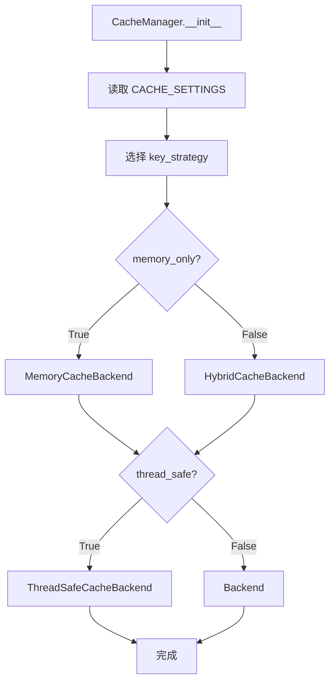

# 缓存管理（CacheManager）

本项目的缓存系统用于复用“同一输入在相同上下文下”的执行结果，以降低重复调用 LLM/检索的成本。

当前版本仅支持“精确 key 命中”（exact match）。历史版本中的“向量语义相似匹配（FAISS / EmbeddingProvider /
VectorSimilarityMatcher）”已下线，仓库中不再保留对应实现与配置项。

## 1. 代码位置与边界

- 实现：`backend/infrastructure/cache_manager/`
- Provider 注入：`backend/infrastructure/providers/cache.py`

**缓存层负责**：

- 缓存键生成（策略）
- 存储后端（内存/磁盘/混合）
- 缓存项元数据（质量、访问统计）
- 基础命中率统计

**缓存层不负责**：

- embedding / 向量索引 / 语义相似检索（这类能力应落在检索层，而不是缓存层）

## 2. 目录结构

```
backend/infrastructure/cache_manager/
├── manager.py              # CacheManager：统一入口
├── backends/               # 存储后端（memory/disk/hybrid）
├── strategies/             # 缓存键策略（simple/context/global）
└── models/
    └── cache_item.py       # CacheItem：内容 + 元数据（质量/访问统计等）
```

## 3. 核心流程

### 3.1 初始化流程（概览）



### 3.2 get/set 流程（精确命中）

```mermaid
flowchart TB
  Q[query + kwargs] --> Key[生成 key]
  Key --> Get[storage.get(key)]
  Get --> Hit{命中?}
  Hit -->|Yes| Item[CacheItem.from_any]
  Item --> Return[返回 content]
  Hit -->|No| None[返回 None]
```

## 4. 配置（.env）

缓存默认从 `infrastructure.config.settings.CACHE_SETTINGS` 读取（其值来自仓库根 `.env`）：

```env
CACHE_DIR=./cache
CACHE_MEMORY_ONLY=false
CACHE_MAX_MEMORY_SIZE=100
CACHE_MAX_DISK_SIZE=1000
CACHE_THREAD_SAFE=true
```

说明：当前缓存层不再读取/支持 `CACHE_ENABLE_VECTOR_SIMILARITY`、
`CACHE_SIMILARITY_THRESHOLD`、`CACHE_EMBEDDING_PROVIDER`、
`CACHE_SENTENCE_TRANSFORMER_MODEL` 等“向量语义缓存”相关配置。

## 5. 缓存键策略

- `SimpleCacheKeyStrategy`：仅基于 query（适合无状态请求）
- `ContextAwareCacheKeyStrategy`：在 key 中包含 `thread_id` + 上下文窗口（适合多轮对话）
- `ContextAndKeywordAwareCacheKeyStrategy`：上下文 + 关键词（适合强隔离/多 domain）
- `GlobalCacheKeyStrategy`：全局缓存键（适合跨会话共享）

## 6. 质量与反馈

缓存项通过 `CacheItem` 保存 `created_at/last_accessed/access_count/quality_score/user_verified` 等元数据。
应用层可通过 `mark_quality(query, is_positive=...)` 标记答案质量，影响后续 `get_fast(...)` 的返回策略。
# ⚠️ 已废弃：缓存系统已物理下线

本文件中关于 `CacheManager` / `backend/infrastructure/cache_manager/` / 双层缓存 的设计与实现，已在 v3 strict 阶段**物理下线**，仅作为历史参考。

当前后端不再提供缓存读写/清理接口；如需闭环数据，请使用：
- Postgres 持久化（`conversations` / `messages` / `feedback`）
- mem0 长期记忆（召回/写入）

