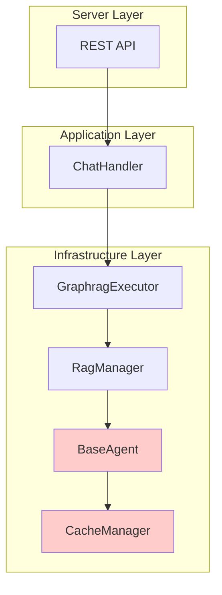
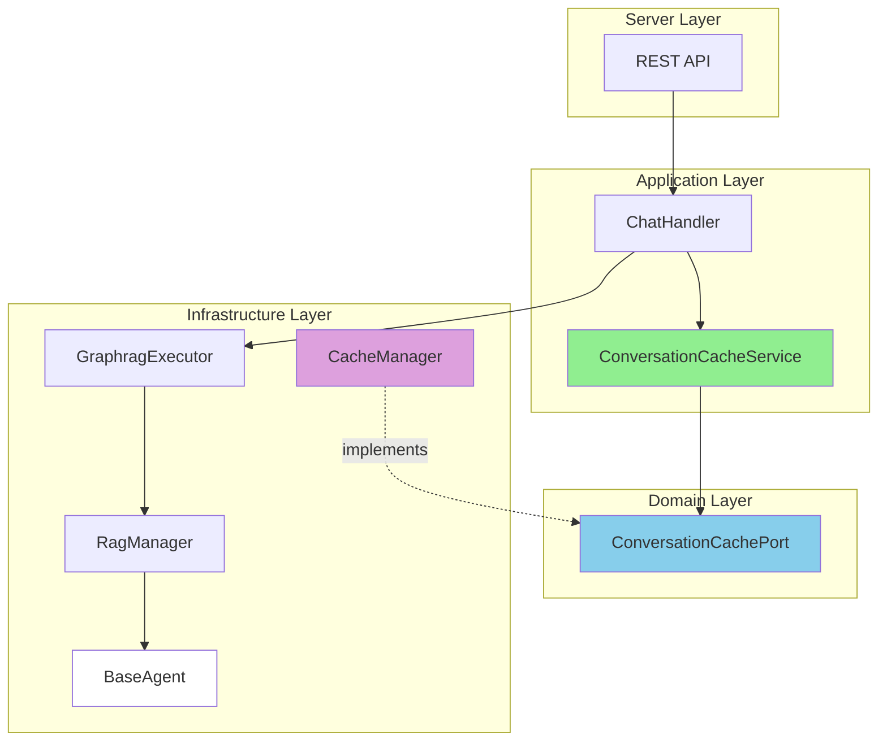

# CacheManager 迁移设计文档

## 文档信息

- **项目**: GraphRAG Agent
- **文档版本**: v2.0 (一次性迁移方案)
- **创建日期**: 2025-01-19
- **作者**: System Architect
- **状态**: 设计评审中

---

## 目录

- [1. 背景与动机](#1-背景与动机)
- [2. 当前架构分析](#2-当前架构分析)
- [3. 架构问题](#3-架构问题)
- [4. 目标架构设计](#4-目标架构设计)
- [5. 详细迁移方案](#5-详细迁移方案)
- [6. 接口设计](#6-接口设计)
- [7. 一次性迁移实施计划](#7-一次性迁移实施计划)
- [8. 风险评估与缓解](#8-风险评估与缓解)
- [9. 测试策略](#9-测试策略)
- [10. 回滚方案](#10-回滚方案)

---

## 1. 背景与动机

### 1.1 核心问题

当前 `CacheManager` 位于 `backend/infrastructure/cache_manager`，被 RAG 层（BaseAgent）直接使用。这导致了**架构职责混淆**：

- ❌ RAG 服务负责检索和生成，不应该承担会话缓存职责
- ❌ 会话缓存是 Chat 层的关注点，应该由应用层编排
- ❌ 缓存策略与 RAG 逻辑耦合，违反单一职责原则

### 1.2 迁移目标

✅ **架构清晰性**: 将会话缓存从 RAG 层上移到 Chat 层
✅ **职责分离**: RAG 专注于检索和生成，Chat 负责会话管理
✅ **灵活性提升**: 支持多种缓存策略（按会话、按用户、全局）
✅ **可测试性**: 缓存逻辑独立，便于单元测试

### 1.3 迁移策略

**一次性迁移**: 直接完成架构重构，不再保留旧的缓存逻辑

**优势**:
- ✅ 避免双写模式的复杂性和维护成本
- ✅ 代码更简洁，没有历史包袱
- ✅ 一次性完成，减少迁移周期
- ✅ 测试和验证更直接

---

## 2. 当前架构分析

### 2.1 现状架构图



**问题**:
- `BaseAgent` 直接依赖 `CacheManager`
- 缓存逻辑嵌入在 Agent 实现中
- Chat 层无法控制缓存策略

### 2.2 代码位置

| 组件 | 当前位置 | 职责 |
|------|---------|------|
| CacheManager | `backend/infrastructure/cache_manager` | 缓存管理 |
| BaseAgent | `backend/infrastructure/agents/base.py` | RAG 检索+生成 |
| ChatHandler | `backend/application/chat/handlers/chat_handler.py` | 会话编排 |
| GraphragExecutor | `backend/infrastructure/rag/adapters/graphrag_executor.py` | RAG 执行适配器 |

### 2.3 当前调用链

```
HTTP Request
  ↓
ChatHandler.handle()
  ↓
GraphragExecutor.run()
  ↓
RagManager.run_plan_blocking()
  ↓
BaseAgent.ask() / ask_stream()
  ↓
CacheManager.get() / set()  ← 缓存逻辑在这里
```

### 2.4 需要修改的文件清单

```
需要修改的文件:
├── backend/infrastructure/agents/base.py
│   └── 移除 cache_manager 初始化和调用
│
├── backend/infrastructure/rag/adapters/graphrag_executor.py
│   └── 简化执行逻辑，不再处理缓存
│
├── backend/application/chat/handlers/chat_handler.py
│   └── 集成 ConversationCacheService
│
├── backend/server/api/rest/dependencies.py
│   └── 修改依赖注入，添加 ConversationCacheService
│
└── backend/server/api/rest/v1/chat.py
    └── 可能需要调整 API 响应结构

需要新增的文件:
├── backend/domain/chat/ports/conversation_cache_port.py
├── backend/application/chat/services/conversation_cache_service.py
└── backend/infrastructure/providers/cache/cache_manager_provider.py
```

---

## 3. 架构问题

### 3.1 职责混淆

```python
# backend/infrastructure/agents/base.py (当前)
class BaseAgent:
    def __init__(self):
        # ❌ Agent 不应该管理缓存
        self.cache_manager = CacheManager(
            key_strategy=ContextAwareCacheKeyStrategy(),
            storage_backend=HybridCacheBackend(...)
        )

    def ask(self, query: str, thread_id: str):
        # ❌ 缓存逻辑与业务逻辑混合
        cached = self.cache_manager.get(query, thread_id=thread_id)
        if cached:
            return cached

        result = self._execute_search(query)
        self.cache_manager.set(query, result, thread_id=thread_id)
        return result
```

**问题**:
- Agent 是 RAG 执行单元，不应该承担会话管理职责
- 缓存策略（上下文窗口、隔离级别）应该是 Chat 层的决定

### 3.2 灵活性不足

```python
# 当前无法在 Chat 层控制缓存策略
class ChatHandler:
    async def handle(self, message: str, session_id: str):
        # ❌ 无法指定缓存策略
        # ❌ 无法控制缓存键生成
        # ❌ 无法选择缓存存储后端
        result = await self._executor.run(...)
```

### 3.3 可测试性差

- 测试 Agent 时必须 Mock CacheManager
- 无法独立测试缓存逻辑
- 集成测试复杂度高

---

## 4. 目标架构设计

### 4.1 新架构图



### 4.2 架构分层

| 层级 | 职责 | 组件 |
|------|------|------|
| **Application** | 会话编排、缓存策略决策 | `ConversationCacheService` |
| **Domain** | 缓存接口定义 | `ConversationCachePort` |
| **Infrastructure** | 缓存实现、RAG 执行 | `CacheManager`, `BaseAgent` |

### 4.3 新的调用链

```
HTTP Request
  ↓
ChatHandler.handle()
  ↓
ConversationCacheService.execute_with_cache()  ← 缓存逻辑上移到这里
  ├─ CacheManager.get()  (尝试命中缓存)
  └─ GraphragExecutor.run()  (缓存未命中，执行 RAG)
       ↓
  BaseAgent.ask()  (专注于 RAG，不再管理缓存)
  ↓
返回结果
```

---

## 5. 详细迁移方案

### 5.1 迁移策略：一次性重构

**核心原则**：
1. **直接替换**：不保留旧的缓存逻辑，直接完成架构重构
2. **测试先行**：在迁移前完成充分的测试
3. **快速回滚**：如果出现问题，可以快速回滚到旧版本
4. **充分验证**：在测试环境完整验证后再部署到生产

### 5.2 目录结构变化

```
backend/
├── application/
│   └── chat/
│       ├── services/
│       │   └── conversation_cache_service.py  ← 新增
│       └── handlers/
│           └── chat_handler.py  ← 修改
├── domain/
│   └── chat/
│       ├── ports/
│       │   └── conversation_cache_port.py  ← 新增
│       └── services/
│           └── rag_aggregator.py  ← 保持不变
├── infrastructure/
│   ├── cache_manager/  ← 保留（作为实现）
│   │   ├── manager.py
│   │   ├── strategies/
│   │   ├── backends/
│   │   └── models/
│   ├── agents/
│   │   └── base.py  ← 移除缓存逻辑
│   └── providers/
│       └── cache/
│           └── cache_manager_provider.py  ← 新增适配器
```

### 5.3 代码变更概览

#### 5.3.1 BaseAgent 简化

```python
# Before: backend/infrastructure/agents/base.py
class BaseAgent:
    def __init__(self):
        # ❌ 移除这些
        self.cache_manager = CacheManager(...)
        self.global_cache_manager = CacheManager(...)

    def ask(self, query: str, thread_id: str):
        # ❌ 移除这些
        cached = self.cache_manager.get(query, thread_id=thread_id)
        if cached:
            return cached

        result = self._execute_search(query)
        self.cache_manager.set(query, result, thread_id=thread_id)
        return result

# After: backend/infrastructure/agents/base.py
class BaseAgent:
    def __init__(self):
        # ✅ 只保留 RAG 相关的初始化
        self.llm = get_llm_model()
        self.embeddings = get_embeddings_model()
        # ... 其他 RAG 相关配置

    def ask(self, query: str, thread_id: str):
        # ✅ 专注于 RAG 执行
        result = self._execute_search(query)
        return result
```

#### 5.3.2 ChatHandler 集成缓存服务

```python
# Before: backend/application/chat/handlers/chat_handler.py
class ChatHandler:
    def __init__(self, executor: RAGExecutorPort, ...):
        self._executor = executor

    async def handle(self, message: str, session_id: str, ...):
        # ❌ 直接调用 executor，没有缓存控制
        result = await self._executor.run(...)
        return result

# After: backend/application/chat/handlers/chat_handler.py
class ChatHandler:
    def __init__(
        self,
        cache_service: ConversationCacheService,  # ← 新增
        executor: RAGExecutorPort,
        ...
    ):
        self._cache_service = cache_service
        self._executor = executor

    async def handle(self, message: str, session_id: str, ...):
        # ✅ 通过缓存服务执行
        result = await self._cache_service.execute_with_cache(
            message=message,
            session_id=session_id,
            kb_prefix=kb_prefix,
            agent_type=agent_type,
        )
        return result
```

---

## 6. 接口设计

### 6.1 Domain Layer: Port 定义

**文件**: `backend/domain/chat/ports/conversation_cache_port.py`

```python
"""
会话缓存接口定义

位置：backend/domain/chat/ports/conversation_cache_port.py

职责：
- 定义缓存能力的抽象接口
- 由 Domain 层定义，Application 层使用
- Infrastructure 层提供具体实现
"""
from __future__ import annotations
from typing import Protocol, Any, Optional
from dataclasses import dataclass


@dataclass(frozen=True)
class CacheEntry:
    """缓存条目"""
    content: Any
    metadata: dict[str, Any]
    created_at: float
    access_count: int
    quality_score: int


class ConversationCachePort(Protocol):
    """
    会话缓存接口

    设计原则：
    1. 接口最小化：只提供必要的方法
    2. 语义清晰：方法名反映意图
    3. 扩展友好：支持未来功能扩展
    """

    async def get(
        self,
        *,
        session_id: str,
        query: str,
        agent_type: str = "default",
    ) -> Optional[CacheEntry]:
        """
        获取缓存内容

        Args:
            session_id: 会话 ID
            query: 用户查询
            agent_type: Agent 类型（用于区分不同的缓存策略）

        Returns:
            缓存条目，如果不存在返回 None
        """
        ...

    async def set(
        self,
        *,
        session_id: str,
        query: str,
        content: Any,
        agent_type: str = "default",
        metadata: Optional[dict[str, Any]] = None,
    ) -> None:
        """
        设置缓存内容

        Args:
            session_id: 会话 ID
            query: 用户查询
            content: 缓存内容
            agent_type: Agent 类型
            metadata: 额外元数据
        """
        ...

    async def invalidate(
        self,
        *,
        session_id: str,
        query: Optional[str] = None,
    ) -> None:
        """
        使缓存失效

        Args:
            session_id: 会话 ID
            query: 特定查询（如果为 None，则清除整个会话的缓存）
        """
        ...

    async def mark_quality(
        self,
        *,
        session_id: str,
        query: str,
        is_positive: bool,
        agent_type: str = "default",
    ) -> None:
        """
        标记缓存质量

        Args:
            session_id: 会话 ID
            query: 用户查询
            is_positive: 是否正向反馈
            agent_type: Agent 类型
        """
        ...

    async def get_metrics(
        self,
        *,
        session_id: Optional[str] = None,
    ) -> dict[str, Any]:
        """
        获取缓存性能指标

        Args:
            session_id: 会话 ID（如果为 None，返回全局指标）

        Returns:
            性能指标字典
        """
        ...
```

### 6.2 Application Layer: Service 实现

**文件**: `backend/application/chat/services/conversation_cache_service.py`

```python
"""
会话缓存服务

位置：backend/application/chat/services/conversation_cache_service.py

职责：
- 实现会话级别的缓存策略
- 协调 RAG 执行和缓存命中
- 提供缓存统计和监控
"""
from __future__ import annotations
import logging
from typing import Any, Optional
from datetime import datetime

from domain.chat.ports.conversation_cache_port import (
    ConversationCachePort,
    CacheEntry,
)
from application.ports.rag_executor_port import RAGExecutorPort


logger = logging.getLogger(__name__)


class ConversationCacheService:
    """
    会话缓存服务

    设计原则：
    1. 缓存策略集中管理
    2. 支持多种缓存模式
    3. 提供完整的监控能力
    """

    def __init__(
        self,
        cache_port: ConversationCachePort,
        executor: RAGExecutorPort,
        *,
        enable_cache: bool = True,
    ):
        """
        初始化缓存服务

        Args:
            cache_port: 缓存端口实现
            executor: RAG 执行器
            enable_cache: 是否启用缓存
        """
        self._cache = cache_port
        self._executor = executor
        self._enable_cache = enable_cache

    async def execute_with_cache(
        self,
        *,
        message: str,
        session_id: str,
        kb_prefix: str,
        agent_type: str = "hybrid_agent",
        debug: bool = False,
    ) -> dict[str, Any]:
        """
        执行查询（带缓存）

        这是缓存服务的核心方法，封装了"先查缓存，未命中则执行"的逻辑

        Args:
            message: 用户消息
            session_id: 会话 ID
            kb_prefix: 知识库前缀
            agent_type: Agent 类型
            debug: 调试模式

        Returns:
            执行结果字典
        """
        # 如果禁用缓存，直接执行
        if not self._enable_cache:
            return await self._execute_rag(
                message=message,
                session_id=session_id,
                kb_prefix=kb_prefix,
                agent_type=agent_type,
                debug=debug,
            )

        # 尝试从缓存获取
        cached_entry = await self._cache.get(
            session_id=session_id,
            query=message,
            agent_type=agent_type,
        )

        if cached_entry is not None:
            logger.info(
                f"Cache hit for session={session_id}, query={message[:50]}"
            )
            return cached_entry.content

        # 缓存未命中，执行 RAG
        logger.info(
            f"Cache miss for session={session_id}, query={message[:50]}"
        )
        result = await self._execute_rag(
            message=message,
            session_id=session_id,
            kb_prefix=kb_prefix,
            agent_type=agent_type,
            debug=debug,
        )

        # 写入缓存
        await self._cache.set(
            session_id=session_id,
            query=message,
            content=result,
            agent_type=agent_type,
            metadata={
                "kb_prefix": kb_prefix,
                "cached_at": datetime.now().isoformat(),
            },
        )

        return result

    async def _execute_rag(
        self,
        *,
        message: str,
        session_id: str,
        kb_prefix: str,
        agent_type: str,
        debug: bool,
    ) -> dict[str, Any]:
        """
        执行 RAG 查询

        Args:
            message: 用户消息
            session_id: 会话 ID
            kb_prefix: 知识库前缀
            agent_type: Agent 类型
            debug: 调试模式

        Returns:
            RAG 执行结果
        """
        from domain.chat.entities.rag_run import RagRunSpec

        plan = [
            RagRunSpec(
                agent_type=agent_type,
                worker_name=None,
            )
        ]

        aggregated, runs = await self._executor.run(
            plan=plan,
            message=message,
            session_id=session_id,
            kb_prefix=kb_prefix,
            debug=debug,
        )

        result: dict[str, Any] = {"answer": aggregated.answer}
        if aggregated.reference:
            result["reference"] = aggregated.reference
        if aggregated.retrieval_results is not None:
            result["retrieval_results"] = aggregated.retrieval_results

        return result

    async def mark_feedback(
        self,
        *,
        session_id: str,
        query: str,
        is_positive: bool,
        agent_type: str = "default",
    ) -> None:
        """
        标记用户反馈

        Args:
            session_id: 会话 ID
            query: 用户查询
            is_positive: 是否正向反馈
            agent_type: Agent 类型
        """
        await self._cache.mark_quality(
            session_id=session_id,
            query=query,
            is_positive=is_positive,
            agent_type=agent_type,
        )

    async def clear_cache(
        self,
        *,
        session_id: str,
        query: Optional[str] = None,
    ) -> None:
        """
        清除缓存

        Args:
            session_id: 会话 ID
            query: 特定查询（如果为 None，清除整个会话）
        """
        await self._cache.invalidate(session_id=session_id, query=query)

    async def get_cache_metrics(
        self,
        *,
        session_id: Optional[str] = None,
    ) -> dict[str, Any]:
        """
        获取缓存指标

        Args:
            session_id: 会话 ID（如果为 None，返回全局指标）

        Returns:
            缓存性能指标
        """
        return await self._cache.get_metrics(session_id=session_id)
```

### 6.3 Infrastructure Layer: 适配器实现

**文件**: `backend/infrastructure/providers/cache/cache_manager_provider.py`

```python
"""
CacheManager 适配器

位置：backend/infrastructure/providers/cache/cache_manager_provider.py

职责：
- 将现有的 CacheManager 适配到 ConversationCachePort 接口
- 处理同步/异步转换
- 维护向后兼容性
"""
from __future__ import annotations
import asyncio
from typing import Any, Optional
from datetime import datetime

from domain.chat.ports.conversation_cache_port import (
    ConversationCachePort,
    CacheEntry,
)
from infrastructure.cache_manager import CacheManager
from infrastructure.cache_manager.strategies import (
    ContextAwareCacheKeyStrategy,
    GlobalCacheKeyStrategy,
)
from infrastructure.cache_manager.backends import HybridCacheBackend


class CacheManagerProvider(ConversationCachePort):
    """
    CacheManager 适配器

    将现有的同步 CacheManager 适配到异步 ConversationCachePort 接口
    """

    def __init__(
        self,
        cache_dir: str = "./cache",
        memory_max_size: int = 200,
        disk_max_size: int = 2000,
    ):
        """
        初始化适配器

        Args:
            cache_dir: 缓存目录
            memory_max_size: 内存缓存最大数量
            disk_max_size: 磁盘缓存最大数量
        """
        # 会话缓存：上下文感知
        self._session_cache = CacheManager(
            key_strategy=ContextAwareCacheKeyStrategy(context_window=3),
            storage_backend=HybridCacheBackend(
                cache_dir=f"{cache_dir}/sessions",
                memory_max_size=memory_max_size,
                disk_max_size=disk_max_size,
            ),
        )

        # 全局缓存：跨会话共享
        self._global_cache = CacheManager(
            key_strategy=GlobalCacheKeyStrategy(),
            storage_backend=HybridCacheBackend(
                cache_dir=f"{cache_dir}/global",
                memory_max_size=memory_max_size * 2,
                disk_max_size=disk_max_size * 2,
            ),
        )

    async def get(
        self,
        *,
        session_id: str,
        query: str,
        agent_type: str = "default",
    ) -> Optional[CacheEntry]:
        """
        获取缓存（异步包装）
        """
        # 在线程池中执行同步方法
        loop = asyncio.get_event_loop()
        cached = await loop.run_in_executor(
            None,
            lambda: self._session_cache.get(
                query=query,
                thread_id=session_id,
            ),
        )

        if cached is None:
            return None

        # 转换为 CacheEntry
        return self._to_cache_entry(cached)

    async def set(
        self,
        *,
        session_id: str,
        query: str,
        content: Any,
        agent_type: str = "default",
        metadata: Optional[dict[str, Any]] = None,
    ) -> None:
        """
        设置缓存（异步包装）
        """
        loop = asyncio.get_event_loop()
        await loop.run_in_executor(
            None,
            lambda: self._session_cache.set(
                query=query,
                result=content,
                thread_id=session_id,
            ),
        )

    async def invalidate(
        self,
        *,
        session_id: str,
        query: Optional[str] = None,
    ) -> None:
        """
        使缓存失效
        """
        loop = asyncio.get_event_loop()

        if query is None:
            # 清除整个会话的缓存（需要遍历）
            # TODO: 实现按会话清除的逻辑
            pass
        else:
            await loop.run_in_executor(
                None,
                lambda: self._session_cache.delete(
                    query=query,
                    thread_id=session_id,
                ),
            )

    async def mark_quality(
        self,
        *,
        session_id: str,
        query: str,
        is_positive: bool,
        agent_type: str = "default",
    ) -> None:
        """
        标记缓存质量
        """
        loop = asyncio.get_event_loop()
        await loop.run_in_executor(
            None,
            lambda: self._session_cache.mark_quality(
                query=query,
                is_positive=is_positive,
                thread_id=session_id,
            ),
        )

    async def get_metrics(
        self,
        *,
        session_id: Optional[str] = None,
    ) -> dict[str, Any]:
        """
        获取缓存指标
        """
        metrics = self._session_cache.get_metrics()
        return {
            "hit_rate": metrics.get("exact_hit_rate", 0.0),
            "total_queries": metrics.get("total_queries", 0),
            "exact_hits": metrics.get("exact_hits", 0),
            "misses": metrics.get("misses", 0),
        }

    def _to_cache_entry(self, cached: Any) -> CacheEntry:
        """
        将缓存内容转换为 CacheEntry
        """
        from infrastructure.cache_manager import CacheItem

        if isinstance(cached, CacheItem):
            return CacheEntry(
                content=cached.get_content(),
                metadata=cached.metadata,
                created_at=cached.metadata.get("created_at", 0),
                access_count=cached.metadata.get("access_count", 0),
                quality_score=cached.metadata.get("quality_score", 0),
            )

        # 简单类型
        return CacheEntry(
            content=cached,
            metadata={},
            created_at=0,
            access_count=0,
            quality_score=0,
        )
```

---

## 7. 一次性迁移实施计划

### 7.1 总体时间安排

**预计总时间**: 5 个工作日

| 阶段 | 工作内容 | 预计时间 | 责任人 |
|------|---------|---------|--------|
| **准备阶段** | 代码备份、环境准备 | 0.5 天 | DevOps + 开发 |
| **开发阶段** | 新功能开发、旧代码移除 | 2 天 | 开发 |
| **测试阶段** | 单元测试、集成测试 | 1.5 天 | 开发 + QA |
| **部署阶段** | 部署到生产、监控验证 | 1 天 | DevOps + 开发 |

### 7.2 详细步骤

#### Day 1 上午：准备阶段

**目标**: 确保可以快速回滚

- [ ] **代码备份**
  ```bash
  # 创建备份分支
  git checkout -b backup/before-cache-migration
  git push origin backup/before-cache-migration

  # 创建迁移分支
  git checkout -b feature/cache-migration
  ```

- [ ] **数据库备份**（如果缓存使用数据库）
  ```bash
  # 备份缓存数据
  cp -r ./cache ./cache.backup.$(date +%Y%m%d)
  ```

- [ ] **环境准备**
  - 确认测试环境可用
  - 准备监控和日志系统
  - 准备回滚脚本

#### Day 1 下午 - Day 2：开发阶段

**目标**: 完成所有代码变更

**Day 1 下午**:

- [ ] **创建新文件** (2 小时)
  - [ ] `domain/chat/ports/conversation_cache_port.py`
  - [ ] `application/chat/services/conversation_cache_service.py`
  - [ ] `infrastructure/providers/cache/cache_manager_provider.py`

- [ ] **修改现有文件** (2 小时)
  - [ ] `infrastructure/agents/base.py` - 移除缓存逻辑
  - [ ] `application/chat/handlers/chat_handler.py` - 集成缓存服务
  - [ ] `server/api/rest/dependencies.py` - 修改依赖注入

**Day 2**:

- [ ] **完成依赖注入调整** (1 小时)
  - [ ] 修改 `get_chat_handler()` 依赖注入
  - [ ] 添加 `get_cache_service()` 函数

- [ ] **代码自测** (2 小时)
  - [ ] 本地运行，确保没有语法错误
  - [ ] 手动测试基本功能

- [ ] **代码评审** (3 小时)
  - [ ] 提交 Pull Request
  - [ ] 团队评审
  - [ ] 根据反馈修改

#### Day 3：测试阶段

**目标**: 完成完整的测试验证

**上午**: 单元测试

- [ ] **Port 接口测试** (1 小时)
  ```python
  # tests/domain/chat/ports/test_conversation_cache_port.py
  - test_cache_miss
  - test_cache_set_and_get
  - test_cache_invalidation
  ```

- [ ] **Service 逻辑测试** (2 小时)
  ```python
  # tests/application/chat/services/test_conversation_cache_service.py
  - test_cache_hit
  - test_cache_miss
  - test_cache_disabled
  - test_mark_feedback
  ```

- [ ] **Provider 适配器测试** (1 小时)
  ```python
  # tests/infrastructure/providers/cache/test_cache_manager_provider.py
  - test_async_wrapper
  - test_cache_entry_conversion
  - test_metrics
  ```

**下午**: 集成测试和性能测试

- [ ] **集成测试** (2 小时)
  ```python
  # tests/integration/test_cache_integration.py
  - test_end_to_end_cache_flow
  - test_multi_session_isolation
  - test_cache_persistence
  ```

- [ ] **性能测试** (1 小时)
  ```python
  # tests/performance/test_cache_performance.py
  - test_cache_hit_latency
  - test_cache_miss_latency
  - test_concurrent_access
  ```

- [ ] **回归测试** (1 小时)
  - 运行现有测试套件
  - 确保没有功能回归

#### Day 4：测试环境验证

**目标**: 在测试环境完整验证

**上午**: 部署到测试环境

- [ ] **部署** (1 小时)
  ```bash
  # 部署到测试环境
  kubectl apply -f k8s/test/
  # 或
  docker-compose -f docker-compose.test.yml up -d
  ```

- [ ] **冒烟测试** (1 小时)
  - 测试基本聊天功能
  - 测试缓存命中场景
  - 测试缓存未命中场景

**下午**: 完整功能测试

- [ ] **功能测试** (3 小时)
  - 多轮对话测试
  - 不同 agent_type 测试
  - 不同 kb_prefix 测试
  - 会话隔离验证

- [ ] **性能验证** (2 小时)
  - 压力测试（100 并发）
  - 缓存命中率验证
  - 响应时间对比

- [ ] **监控验证** (1 小时)
  - 确认监控指标正常上报
  - 确认日志正常输出
  - 确认告警规则生效

#### Day 5：生产部署

**目标**: 部署到生产环境并监控

**上午**: 部署

- [ ] **生产部署** (1 小时)
  ```bash
  # 蓝绿部署或滚动更新
  kubectl apply -f k8s/production/
  ```

- [ ] **健康检查** (0.5 小时)
  - 检查服务健康状态
  - 检查基础指标
  - 检查错误日志

**下午**: 监控与验证

- [ ] **实时监控** (2 小时)
  - 监控缓存命中率
  - 监控响应时间（P50, P95, P99）
  - 监控错误率
  - 监控系统资源（CPU, 内存）

- [ ] **功能验证** (2 小时)
  - 执行关键用户场景
  - 验证多用户并发
  - 验证缓存持久化

- [ ] **问题处理** (2 小时)
  - 处理可能出现的问题
  - 必要时执行回滚

- [ ] **总结与文档** (1 小时)
  - 记录部署过程
  - 更新运行文档
  - 总结经验教训

### 7.3 每日检查清单

**每日结束时**:
- [ ] 代码已提交到 Git
- [ ] 测试已通过
- [ ] 文档已更新
- [ ] 明日计划已确认

**每日开始时**:
- [ ] 查看昨晚构建和测试结果
- [ ] 检查是否有新的问题
- [ ] 确认今日工作重点

---

## 8. 风险评估与缓解

### 8.1 风险矩阵

| 风险 | 影响 | 概率 | 等级 | 缓解措施 |
|------|------|------|------|---------|
| 缓存命中率下降 | 高 | 中 | 🔴 高 | 充分的测试验证，监控告警 |
| 性能回归 | 高 | 低 | 🟡 中 | 性能基准测试，压力测试 |
| 架构复杂度增加 | 中 | 低 | 🟢 低 | 代码评审，完善文档 |
| 向后兼容性破坏 | 高 | 低 | 🟡 中 | 保留兼容的 Port 接口 |
| 测试覆盖不足 | 中 | 低 | 🟢 低 | 严格的测试要求 |

### 8.2 缓解策略

#### 8.2.1 缓存命中率监控

```python
# 监控指标
expected_hit_rate = 0.80  # 期望命中率 80%

# 实时监控
actual_hit_rate = get_cache_hit_rate()

# 告警规则
if actual_hit_rate < expected_hit_rate * 0.9:  # 低于期望值的 90%
    send_alert(
        severity="warning",
        message=f"缓存命中率 {actual_hit_rate:.2%} < {expected_hit_rate * 0.9:.2%}"
    )
```

#### 8.2.2 性能回归检测

```python
# 性能基准（基于迁移前的测量）
baseline = {
    "p50_latency_ms": 100,
    "p95_latency_ms": 500,
    "p99_latency_ms": 1000,
}

# 实时监控
actual = get_current_latency()

# 告警规则（允许 20% 的波动）
if actual["p95"] > baseline["p95_latency_ms"] * 1.2:
    send_alert(
        severity="warning",
        message=f"P95 延迟 {actual['p95']}ms > {baseline['p95_latency_ms'] * 1.2}ms"
    )

# 严重告警（超过 50%）
if actual["p95"] > baseline["p95_latency_ms"] * 1.5:
    send_alert(
        severity="critical",
        message=f"P95 延迟严重恶化: {actual['p95']}ms",
        action="考虑回滚"
    )
```

#### 8.2.3 错误率监控

```python
# 错误率监控
max_error_rate = 0.01  # 最大允许错误率 1%

actual_error_rate = get_error_rate()

if actual_error_rate > max_error_rate:
    send_alert(
        severity="critical",
        message=f"错误率 {actual_error_rate:.2%} > {max_error_rate:.2%}",
        action="立即检查或回滚"
    )
```

---

## 9. 测试策略

### 9.1 单元测试

#### 9.1.1 Port 接口测试

```python
# tests/domain/chat/ports/test_conversation_cache_port.py
import pytest
from domain.chat.ports.conversation_cache_port import ConversationCachePort

class MockCachePort(ConversationCachePort):
    """Mock 实现"""
    def __init__(self):
        self._cache = {}

    async def get(self, *, session_id, query, agent_type="default"):
        return self._cache.get((session_id, query))

    async def set(self, *, session_id, query, content, agent_type="default", metadata=None):
        self._cache[(session_id, query)] = CacheEntry(
            content=content,
            metadata=metadata or {},
            created_at=0,
            access_count=0,
            quality_score=0,
        )

    async def invalidate(self, *, session_id, query=None):
        if query:
            self._cache.pop((session_id, query), None)
        else:
            # 清除整个会话
            keys_to_remove = [k for k in self._cache if k[0] == session_id]
            for key in keys_to_remove:
                self._cache.pop(key)

    async def mark_quality(self, *, session_id, query, is_positive, agent_type="default"):
        pass

    async def get_metrics(self, *, session_id=None):
        return {"hit_rate": 0.5}


@pytest.mark.asyncio
async def test_cache_miss():
    """测试缓存未命中"""
    port = MockCachePort()
    result = await port.get(session_id="test", query="hello")
    assert result is None

@pytest.mark.asyncio
async def test_cache_set_and_get():
    """测试缓存设置和获取"""
    port = MockCachePort()

    await port.set(
        session_id="test",
        query="hello",
        content={"answer": "world"}
    )

    result = await port.get(session_id="test", query="hello")
    assert result is not None
    assert result.content["answer"] == "world"

@pytest.mark.asyncio
async def test_cache_invalidation():
    """测试缓存失效"""
    port = MockCachePort()

    await port.set(
        session_id="test",
        query="hello",
        content={"answer": "world"}
    )

    # 验证缓存存在
    result = await port.get(session_id="test", query="hello")
    assert result is not None

    # 使缓存失效
    await port.invalidate(session_id="test", query="hello")

    # 验证缓存已清除
    result = await port.get(session_id="test", query="hello")
    assert result is None

@pytest.mark.asyncio
async def test_session_invalidation():
    """测试会话级别缓存清除"""
    port = MockCachePort()

    # 设置多个缓存
    await port.set(session_id="test", query="q1", content={"answer": "a1"})
    await port.set(session_id="test", query="q2", content={"answer": "a2"})

    # 清除整个会话
    await port.invalidate(session_id="test")

    # 验证所有缓存已清除
    assert await port.get(session_id="test", query="q1") is None
    assert await port.get(session_id="test", query="q2") is None
```

#### 9.1.2 Service 逻辑测试

```python
# tests/application/chat/services/test_conversation_cache_service.py
import pytest
from unittest.mock import Mock, AsyncMock
from application.chat.services.conversation_cache_service import ConversationCacheService
from domain.chat.entities.rag_run import RagRunResult

@pytest.mark.asyncio
async def test_cache_hit():
    """测试缓存命中场景"""
    # Arrange
    mock_cache = Mock()
    mock_executor = Mock()

    # Mock 缓存命中
    mock_cache.get = AsyncMock(return_value={
        "content": {"answer": "cached answer"},
        "metadata": {},
        "created_at": 0,
        "access_count": 1,
        "quality_score": 3,
    })

    service = ConversationCacheService(
        cache_port=mock_cache,
        executor=mock_executor,
        enable_cache=True,
    )

    # Act
    result = await service.execute_with_cache(
        message="test query",
        session_id="test_session",
        kb_prefix="test_kb",
    )

    # Assert
    assert result["answer"] == "cached answer"
    mock_executor.run.assert_not_called()  # 不应该执行 RAG

@pytest.mark.asyncio
async def test_cache_miss():
    """测试缓存未命中场景"""
    # Arrange
    mock_cache = Mock()
    mock_executor = Mock()

    # Mock 缓存未命中
    mock_cache.get = AsyncMock(return_value=None)

    # Mock RAG 执行
    mock_executor.run = AsyncMock(return_value=(
        RagRunResult(
            answer="rag answer",
            reference=None,
            retrieval_results=None
        ),
        [],
    ))

    # Mock 缓存设置
    mock_cache.set = AsyncMock()

    service = ConversationCacheService(
        cache_port=mock_cache,
        executor=mock_executor,
        enable_cache=True,
    )

    # Act
    result = await service.execute_with_cache(
        message="test query",
        session_id="test_session",
        kb_prefix="test_kb",
    )

    # Assert
    assert result["answer"] == "rag answer"
    mock_executor.run.assert_called_once()  # 应该执行 RAG
    mock_cache.set.assert_called_once()  # 应该写入缓存

@pytest.mark.asyncio
async def test_cache_disabled():
    """测试禁用缓存场景"""
    # Arrange
    mock_cache = Mock()
    mock_executor = Mock()

    # Mock RAG 执行
    mock_executor.run = AsyncMock(return_value=(
        RagRunResult(
            answer="rag answer",
            reference=None,
            retrieval_results=None
        ),
        [],
    ))

    service = ConversationCacheService(
        cache_port=mock_cache,
        executor=mock_executor,
        enable_cache=False,  # 禁用缓存
    )

    # Act
    result = await service.execute_with_cache(
        message="test query",
        session_id="test_session",
        kb_prefix="test_kb",
    )

    # Assert
    assert result["answer"] == "rag answer"
    mock_cache.get.assert_not_called()  # 不应该查询缓存
    mock_cache.set.assert_not_called()  # 不应该写入缓存
    mock_executor.run.assert_called_once()  # 应该执行 RAG

@pytest.mark.asyncio
async def test_mark_feedback():
    """测试标记反馈"""
    # Arrange
    mock_cache = Mock()
    mock_executor = Mock()

    mock_cache.mark_quality = AsyncMock()

    service = ConversationCacheService(
        cache_port=mock_cache,
        executor=mock_executor,
        enable_cache=True,
    )

    # Act
    await service.mark_feedback(
        session_id="test_session",
        query="test query",
        is_positive=True,
    )

    # Assert
    mock_cache.mark_quality.assert_called_once_with(
        session_id="test_session",
        query="test query",
        is_positive=True,
        agent_type="default",
    )
```

### 9.2 集成测试

```python
# tests/integration/test_cache_integration.py
import pytest
import asyncio
from application.chat.services.conversation_cache_service import ConversationCacheService
from infrastructure.providers.cache.cache_manager_provider import CacheManagerProvider
from application.ports.rag_executor_port import RAGExecutorPort

class MockRAGExecutorPort:
    """Mock RAG 执行器"""
    async def run(self, plan, message, session_id, kb_prefix, debug):
        from domain.chat.entities.rag_run import RagRunResult

        # 模拟 RAG 执行延迟
        await asyncio.sleep(0.1)

        return (
            RagRunResult(
                answer=f"Answer for: {message}",
                reference="Mock reference",
                retrieval_results=None,
            ),
            [],
        )

@pytest.mark.asyncio
async def test_end_to_end_cache_flow():
    """端到端缓存流程测试"""
    # Arrange
    cache_provider = CacheManagerProvider(
        cache_dir="/tmp/test_cache",
        memory_max_size=10,
        disk_max_size=100,
    )
    executor = MockRAGExecutorPort()
    service = ConversationCacheService(
        cache_port=cache_provider,
        executor=executor,
        enable_cache=True,
    )

    # Act: 第一次查询（缓存未命中）
    import time
    start = time.time()
    result1 = await service.execute_with_cache(
        message="什么是奖学金？",
        session_id="test_user",
        kb_prefix="ecust",
    )
    time1 = time.time() - start

    # Act: 第二次查询（缓存命中）
    start = time.time()
    result2 = await service.execute_with_cache(
        message="什么是奖学金？",
        session_id="test_user",
        kb_prefix="ecust",
    )
    time2 = time.time() - start

    # Assert
    assert result1["answer"] == result2["answer"]  # 答案应该相同
    assert time2 < time1  # 缓存命中应该更快

    # Act: 获取指标
    metrics = await service.get_cache_metrics(session_id="test_user")

    # Assert
    assert metrics["total_queries"] >= 2  # 至少 2 次查询
    assert metrics["hit_rate"] > 0  # 应该有缓存命中

@pytest.mark.asyncio
async def test_multi_session_isolation():
    """测试多会话隔离"""
    # Arrange
    cache_provider = CacheManagerProvider(
        cache_dir="/tmp/test_cache_isolation",
        memory_max_size=10,
        disk_max_size=100,
    )
    executor = MockRAGExecutorPort()
    service = ConversationCacheService(
        cache_port=cache_provider,
        executor=executor,
        enable_cache=True,
    )

    # Act: 用户 A 查询
    result_a = await service.execute_with_cache(
        message="我的余额是多少？",
        session_id="user_a",
        kb_prefix="bank",
    )

    # Act: 用户 B 查询相同问题
    result_b = await service.execute_with_cache(
        message="我的余额是多少？",
        session_id="user_b",
        kb_prefix="bank",
    )

    # Assert: 答案应该相同，但缓存应该隔离
    assert result_a["answer"] == result_b["answer"]

    # 获取指标（应该分别统计）
    metrics_a = await service.get_cache_metrics(session_id="user_a")
    metrics_b = await service.get_cache_metrics(session_id="user_b")

    # 验证隔离性（这里简化验证）
    assert metrics_a is not None
    assert metrics_b is not None
```

### 9.3 性能测试

```python
# tests/performance/test_cache_performance.py
import pytest
import time
import asyncio

@pytest.mark.asyncio
async def test_cache_performance():
    """缓存性能测试"""
    from application.chat.services.conversation_cache_service import ConversationCacheService
    from infrastructure.providers.cache.cache_manager_provider import CacheManagerProvider

    # 使用真实的缓存 provider
    cache_provider = CacheManagerProvider(
        cache_dir="/tmp/test_cache_perf",
        memory_max_size=100,
        disk_max_size=1000,
    )

    # 使用 mock executor
    class MockExecutor:
        async def run(self, plan, message, session_id, kb_prefix, debug):
            await asyncio.sleep(0.05)  # 模拟 RAG 延迟
            from domain.chat.entities.rag_run import RagRunResult
            return (
                RagRunResult(answer=f"Answer: {message}", reference=None, retrieval_results=None),
                [],
            )

    executor = MockExecutor()
    service = ConversationCacheService(
        cache_port=cache_provider,
        executor=executor,
        enable_cache=True,
    )

    # 预热缓存
    await service.execute_with_cache(
        message="test query",
        session_id="perf_test",
        kb_prefix="test_kb",
    )

    # 测试缓存命中性能
    iterations = 1000
    start = time.time()

    for _ in range(iterations):
        await service.execute_with_cache(
            message="test query",
            session_id="perf_test",
            kb_prefix="test_kb",
        )

    elapsed = time.time() - start

    # 计算性能指标
    avg_latency_ms = (elapsed / iterations) * 1000
    qps = iterations / elapsed

    print(f"\n缓存性能测试结果:")
    print(f"  总迭代次数: {iterations}")
    print(f"  总耗时: {elapsed:.2f}s")
    print(f"  平均延迟: {avg_latency_ms:.2f}ms")
    print(f"  QPS: {qps:.2f}")

    # Assert: 验证性能要求
    assert avg_latency_ms < 10, f"平均延迟 {avg_latency_ms:.2f}ms 超过 10ms 阈值"
    assert qps > 100, f"QPS {qps:.2f} 低于 100 阈值"

@pytest.mark.asyncio
async def test_concurrent_access():
    """并发访问测试"""
    from application.chat.services.conversation_cache_service import ConversationCacheService
    from infrastructure.providers.cache.cache_manager_provider import CacheManagerProvider

    cache_provider = CacheManagerProvider(
        cache_dir="/tmp/test_cache_concurrent",
        memory_max_size=100,
        disk_max_size=1000,
    )

    class MockExecutor:
        async def run(self, plan, message, session_id, kb_prefix, debug):
            await asyncio.sleep(0.01)
            from domain.chat.entities.rag_run import RagRunResult
            return (
                RagRunResult(answer=f"Answer: {message}", reference=None, retrieval_results=None),
                [],
            )

    executor = MockExecutor()
    service = ConversationCacheService(
        cache_port=cache_provider,
        executor=executor,
        enable_cache=True,
    )

    # 并发测试
    concurrency = 100
    requests_per_session = 10

    async def worker(session_id: str):
        for i in range(requests_per_session):
            await service.execute_with_cache(
                message=f"query_{i}",
                session_id=session_id,
                kb_prefix="test_kb",
            )

    # 启动并发任务
    start = time.time()

    tasks = [
        worker(f"session_{i % 10}")  # 10 个不同会话
        for i in range(concurrency)
    ]

    await asyncio.gather(*tasks)

    elapsed = time.time() - start

    print(f"\n并发访问测试结果:")
    print(f"  并发数: {concurrency}")
    print(f"  每会话请求数: {requests_per_session}")
    print(f"  总耗时: {elapsed:.2f}s")
    print(f"  平均 QPS: {(concurrency * requests_per_session) / elapsed:.2f}")

    # 验证没有错误
    assert True  # 如果没有抛出异常，说明并发处理正常
```

### 9.4 测试覆盖率要求

| 模块 | 最低覆盖率 | 推荐覆盖率 |
|------|-----------|-----------|
| Port 接口 | 80% | 90% |
| Service 逻辑 | 85% | 95% |
| Provider 适配器 | 80% | 90% |
| 集成测试 | 覆盖关键场景 | 覆盖所有场景 |
| 性能测试 | 达到性能指标 | 优于性能指标 20% |

---

## 10. 回滚方案

### 10.1 回滚触发条件

| 条件 | 阈值 | 动作 |
|------|------|------|
| 缓存命中率下降 | > 15% | 立即回滚 |
| P95 延迟增加 | > 30% | 立即回滚 |
| 错误率上升 | > 1% | 立即回滚 |
| 用户投诉增加 | > 10 个/小时 | 立即回滚 |
| 系统崩溃 | N/A | 立即回滚 |

### 10.2 回滚步骤

#### 10.2.1 快速回滚（代码级）

**时间**: < 5 分钟

```bash
# 1. 切换到备份分支
git checkout backup/before-cache-migration

# 2. 重新部署
docker-compose down
docker-compose up -d

# 或 Kubernetes
kubectl rollout undo deployment/graphrag-agent
```

#### 10.2.2 配置级回滚

**时间**: < 1 分钟

```python
# 如果保留了配置开关，可以通过配置快速切换
# backend/config/cache_config.py
CACHE_MIGRATION_ENABLED = False  # 改为 False

# 或环境变量
# export CACHE_MIGRATION_ENABLED=false
```

#### 10.2.3 验证回滚成功

```bash
# 1. 检查服务状态
curl http://localhost:8000/health

# 2. 检查缓存命中率
curl http://localhost:8000/api/v1/cache/metrics

# 3. 执行测试查询
curl -X POST http://localhost:8000/api/v1/chat \
  -H "Content-Type: application/json" \
  -d '{"message": "test", "session_id": "test"}'

# 4. 监控关键指标
# - 缓存命中率应恢复到迁移前水平
# - P95 延迟应恢复正常
# - 错误率应恢复正常
```

### 10.3 回滚后检查清单

- [ ] 服务状态正常
- [ ] 缓存命中率恢复到基线（±5%）
- [ ] 响应延迟恢复正常（±10%）
- [ ] 错误率恢复正常（< 0.1%）
- [ ] 无新增错误日志
- [ ] 用户投诉停止
- [ ] 监控指标正常

### 10.4 回滚后分析

回滚后需要进行根因分析：

1. **收集日志**
   ```bash
   # 收集迁移期间的日志
   kubectl logs -l app=graphrag-agent --since=1h > migration_logs.txt
   ```

2. **分析指标**
   - 对比迁移前后的关键指标
   - 定位性能下降的具体原因
   - 分析是否有缓存逻辑错误

3. **制定修复计划**
   - 根据分析结果调整实现
   - 补充测试用例
   - 重新验证后再迁移

---

## 11. 配置管理

### 11.1 环境变量

```bash
# .env

# 缓存开关
ENABLE_CACHE=true

# 缓存配置
CACHE_DIR=./cache
CACHE_MODE=session  # session | user | global

# 缓存大小
SESSION_CACHE_MEMORY_SIZE=200
SESSION_CACHE_DISK_SIZE=2000
GLOBAL_CACHE_MEMORY_SIZE=500
GLOBAL_CACHE_DISK_SIZE=5000

# 监控
CACHE_METRICS_ENABLED=true
CACHE_ALERT_THRESHOLD_HIT_RATE=0.70
CACHE_ALERT_THRESHOLD_P95_MS=600
```

### 11.2 配置类

**文件**: `backend/infrastructure/config/cache_config.py`

```python
from dataclasses import dataclass
from typing import Literal
import os


@dataclass(frozen=True)
class CacheConfig:
    """缓存配置"""

    # 开关
    enable_cache: bool = True

    # 缓存模式
    cache_mode: Literal["session", "user", "global"] = "session"

    # 缓存目录
    cache_dir: str = "./cache"

    # 会话缓存
    session_cache_memory_size: int = 200
    session_cache_disk_size: int = 2000

    # 全局缓存
    global_cache_memory_size: int = 500
    global_cache_disk_size: int = 5000

    # 监控
    cache_metrics_enabled: bool = True
    cache_alert_threshold_hit_rate: float = 0.70
    cache_alert_threshold_p95_ms: int = 600

    @classmethod
    def from_env(cls) -> "CacheConfig":
        """从环境变量加载配置"""
        return cls(
            enable_cache=os.getenv("ENABLE_CACHE", "true").lower() == "true",
            cache_mode=os.getenv("CACHE_MODE", "session"),
            cache_dir=os.getenv("CACHE_DIR", "./cache"),
            session_cache_memory_size=int(os.getenv("SESSION_CACHE_MEMORY_SIZE", "200")),
            session_cache_disk_size=int(os.getenv("SESSION_CACHE_DISK_SIZE", "2000")),
            global_cache_memory_size=int(os.getenv("GLOBAL_CACHE_MEMORY_SIZE", "500")),
            global_cache_disk_size=int(os.getenv("GLOBAL_CACHE_DISK_SIZE", "5000")),
            cache_metrics_enabled=os.getenv("CACHE_METRICS_ENABLED", "true").lower() == "true",
            cache_alert_threshold_hit_rate=float(os.getenv("CACHE_ALERT_THRESHOLD_HIT_RATE", "0.70")),
            cache_alert_threshold_p95_ms=int(os.getenv("CACHE_ALERT_THRESHOLD_P95_MS", "600")),
        )
```

---

## 12. 监控与告警

### 12.1 监控指标

```python
# 缓存性能指标
CACHE_METRICS = {
    # 命中率
    "cache_hit_rate": {
        "type": "gauge",
        "description": "缓存命中率",
        "labels": ["cache_type", "agent_type"],
    },

    # 延迟
    "cache_get_latency_ms": {
        "type": "histogram",
        "description": "缓存获取延迟",
        "buckets": [1, 5, 10, 50, 100, 500, 1000],
    },

    # 容量
    "cache_size": {
        "type": "gauge",
        "description": "缓存大小",
        "labels": ["storage_type"],  # memory | disk
    },

    # 质量
    "cache_quality_score": {
        "type": "gauge",
        "description": "缓存质量分数",
        "labels": ["agent_type"],
    },
}
```

### 12.2 告警规则

```yaml
# prometheus_alerts.yml
groups:
  - name: cache_alerts
    rules:
      - alert: LowCacheHitRate
        expr: cache_hit_rate < 0.7
        for: 5m
        labels:
          severity: warning
        annotations:
          summary: "缓存命中率过低"
          description: "缓存命中率 {{ $value }} < 70%"

      - alert: HighCacheLatency
        expr: histogram_quantile(0.95, cache_get_latency_ms) > 500
        for: 5m
        labels:
          severity: warning
        annotations:
          summary: "缓存延迟过高"
          description: "P95 缓存延迟 {{ $value }}ms > 500ms"

      - alert: CacheCapacityHigh
        expr: cache_size{storage_type="memory"} / cache_max_size > 0.9
        for: 5m
        labels:
          severity: info
        annotations:
          summary: "内存缓存容量告警"
          description: "内存缓存使用率 {{ $value }} > 90%"
```

---

## 13. 附录

### 13.1 术语表

| 术语 | 定义 |
|------|------|
| CacheManager | 现有的缓存管理器实现（位于 `infrastructure/cache_manager`） |
| ConversationCacheService | 新的会话缓存服务（位于 `application/chat/services`） |
| ConversationCachePort | 缓存接口定义（位于 `domain/chat/ports`） |
| CacheManagerProvider | CacheManager 的适配器（位于 `infrastructure/providers/cache`） |
| 会话缓存 | 按 `session_id` 隔离的缓存，上下文感知 |
| 全局缓存 | 跨会话共享的缓存，精确 key 命中 |
| 上下文窗口 | 生成缓存键时考虑的历史对话轮数 |
| 质量分数 | 缓存项的质量评分（-5 到 +∞） |
| 快速路径 | 优先返回高质量缓存的优化路径 |

### 13.2 参考文档

- [记忆系统文档](../../02-核心机制/02-核心子系统/记忆系统/README.md)
- [Phase 2 架构设计](../02-架构设计/phase2-architecture.md)
- [Hexagonal Architecture](https://alistair.cockburn.us/hexagonal-architecture/)
- [Domain-Driven Design](https://martinfowler.com/bliki/DomainDrivenDesign.html)

### 13.3 变更日志

| 版本 | 日期 | 作者 | 变更内容 |
|------|------|------|---------|
| v1.0 | 2025-01-19 | System Architect | 初始版本（渐进式迁移） |
| v2.0 | 2025-01-19 | System Architect | 修改为一次性迁移方案 |

---

## 14. 审批与签字

| 角色 | 姓名 | 签字 | 日期 |
|------|------|------|------|
| 架构师 | - | - | - |
| 技术负责人 | - | - | - |
| 产品负责人 | - | - | - |
| QA 负责人 | - | - | - |

---

**文档结束**
# ⚠️ 已归档：缓存系统迁移不再进行（已物理下线）

本设计文档描述的 CacheManager/provider 迁移方案对应旧阶段的缓存系统。当前版本已将缓存系统整体**物理下线**，并以 Postgres 持久化 + mem0 记忆作为闭环基础。

如需回溯历史决策可继续阅读；但请勿以本文档作为现行实现依据。
