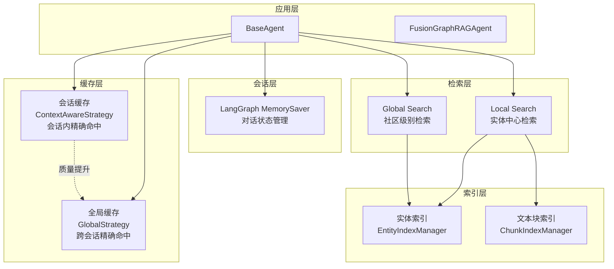
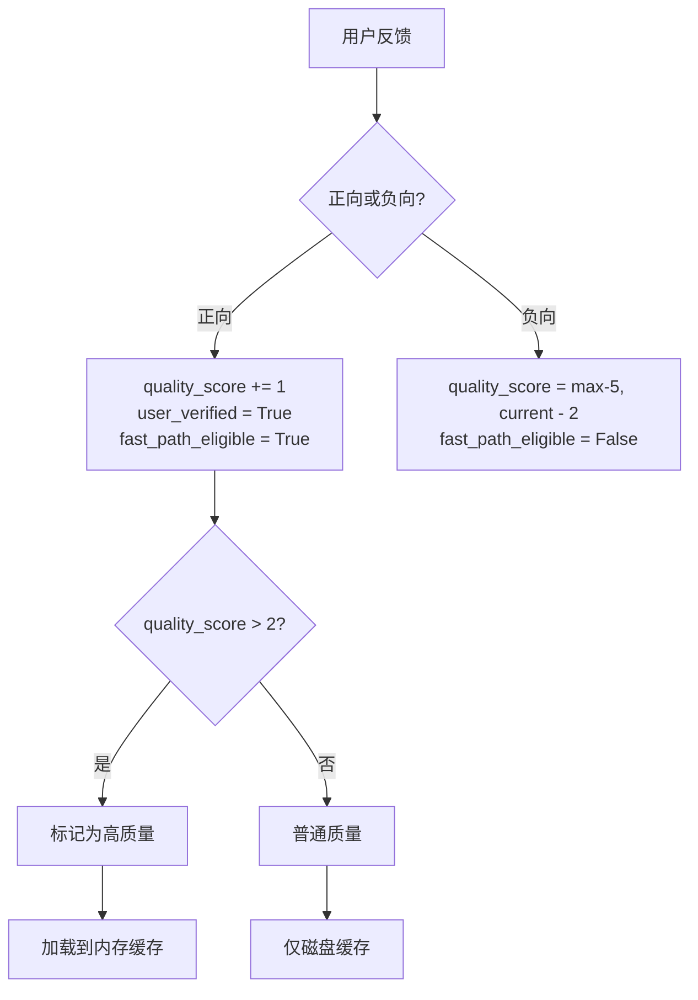
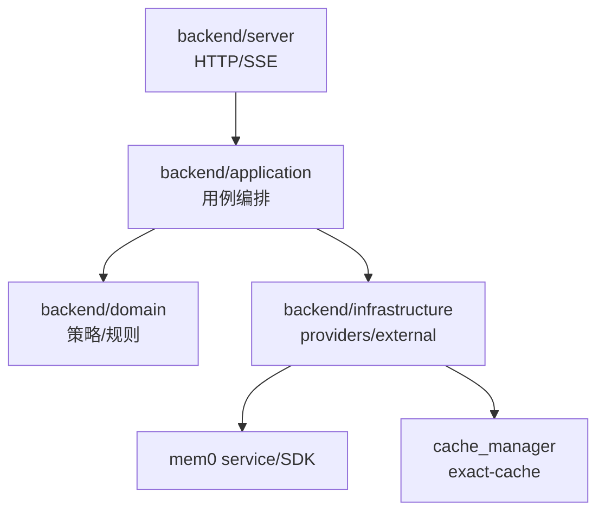
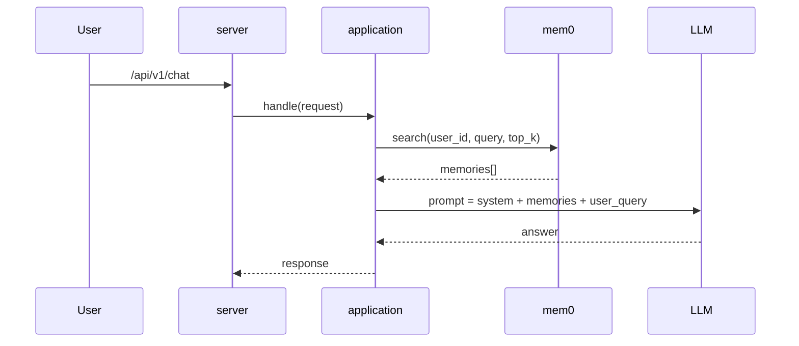
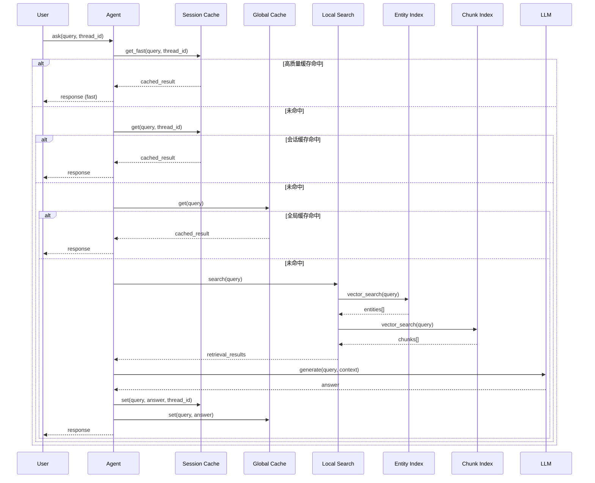
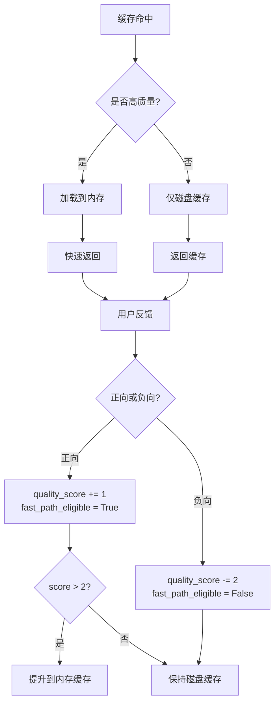

# 记忆系统 (Memory System)

> **目的**: 提供多层级的智能记忆缓存能力，支撑 GraphRAG 系统的高性能、高质量的问答服务。本文档详细介绍当前系统已实现的记忆机制，以及未来 mem0 集成的规划方案。

## 目录

- [1. 系统概览](#1-系统概览)
- [2. 已实现：双层级缓存系统](#2-已实现双层级缓存系统)
  - [2.1 架构设计](#21-架构设计)
  - [2.2 核心组件](#22-核心组件)
  - [2.3 缓存键策略](#23-缓存键策略)
  - [2.4 存储后端](#24-存储后端)
  - [2.5 质量机制](#25-质量机制)
- [3. 向量索引与检索](#3-向量索引与检索)
- [4. 会话管理](#4-会话管理)
- [5. 未来规划：mem0 集成](#5-未来规划mem0-集成)
- [6. 配置说明](#6-配置说明)
- [7. 使用示例](#7-使用示例)

---

## 1. 系统概览

GraphRAG 的记忆系统是一个多层级的智能缓存架构，结合了：

- **工程缓存** (`cache_manager`): 精确 key 命中，用于性能优化
- **向量索引** (Entity/Chunk Index): 语义检索能力
- **会话管理** (LangGraph MemorySaver): 对话状态管理
- **图结构检索** (Local/Global Search): 知识图谱推理

### 1.1 记忆层级架构



---

## 2. 已实现：双层级缓存系统

### 2.1 架构设计

当前系统实现了一个**双层级缓存架构**：

| 缓存层级 | 策略 | 隔离性 | 用途 |
|---------|------|--------|------|
| **会话缓存** | `ContextAwareCacheKeyStrategy` | 按 `thread_id` 隔离 | 会话内的上下文感知缓存 |
| **全局缓存** | `GlobalCacheKeyStrategy` | 跨会话共享 | 跨会话的通用问答缓存 |

**关键设计决策**:

1. **精确 key 命中**: 缓存基于确定性 key，避免语义漂移带来的错误答案复用
2. **质量驱动**: 高质量缓存优先加载到内存，提供快速访问路径
3. **自动降级**: 缓存失败不影响主链路，确保服务可用性
4. **线程安全**: 默认启用 `ThreadSafeCacheBackend`，支持并发访问

### 2.2 核心组件

#### 2.2.1 CacheManager

**位置**: `backend/infrastructure/cache_manager/manager.py`

**核心功能**:

```python
class CacheManager:
    def __init__(self,
                 key_strategy: CacheKeyStrategy = None,
                 storage_backend: CacheStorageBackend = None,
                 cache_dir: Optional[str] = None,
                 memory_only: Optional[bool] = None,
                 max_memory_size: Optional[int] = None,
                 max_disk_size: Optional[int] = None,
                 thread_safe: Optional[bool] = None)
```

**主要方法**:

- `get(query, skip_validation=False, **kwargs)`: 精确 key 命中获取缓存
- `get_fast(query, **kwargs)`: 仅返回高质量缓存（快速路径）
- `set(query, result, **kwargs)`: 设置缓存内容
- `mark_quality(query, is_positive, **kwargs)`: 标记缓存质量
- `validate_answer(query, answer, validator, **kwargs)`: 验证答案质量

**性能指标**:

```python
{
    'exact_hits': 0,          # 精确命中次数
    'misses': 0,              # 未命中次数
    'total_queries': 0,       # 总查询次数
    'exact_hit_rate': 0.0,    # 精确命中率
    'get_time': 0.0,          # 获取耗时
    'set_time': 0.0,          # 设置耗时
    'fast_get_time': 0.0      # 快速获取耗时
}
```

#### 2.2.2 CacheItem

**位置**: `backend/infrastructure/cache_manager/models/cache_item.py`

**元数据结构**:

```python
{
    "created_at": time.time(),        # 创建时间
    "quality_score": 0,               # 质量分数（-5 到 +∞）
    "user_verified": False,           # 用户是否验证过
    "access_count": 0,                # 访问次数
    "fast_path_eligible": False,      # 是否适合快速路径
    "last_accessed": None,            # 最后访问时间
    "similarity_score": None,         # 相似度分数（已废弃）
    "matched_via_vector": False,      # 是否通过向量匹配（已废弃）
    "original_query": None            # 原始查询（已废弃）
}
```

**质量判断标准**:

```python
def is_high_quality(self) -> bool:
    return (self.metadata.get("user_verified", False) or
            self.metadata.get("quality_score", 0) > 2 or
            self.metadata.get("fast_path_eligible", False))
```

**质量标记机制**:

- 正向反馈: `quality_score += 1`, `user_verified = True`, `fast_path_eligible = True`
- 负向反馈: `quality_score = max(-5, current_score - 2)`, `fast_path_eligible = False`

### 2.3 缓存键策略

#### 2.3.1 ContextAwareCacheKeyStrategy

**位置**: `backend/infrastructure/cache_manager/strategies/context_aware.py`

**特性**:

- 考虑会话历史（默认前 3 条）
- 按 `thread_id` 隔离
- 版本控制机制

**键生成逻辑**:

```python
# thread:{thread_id}|ctx:{context}|v{version}|{query}
combined = f"thread:{thread_id}|ctx:{context}|v{version}|{query}".strip()
return hashlib.md5(combined.encode('utf-8')).hexdigest()
```

**使用场景**:

- 多轮对话中的上下文依赖问答
- 需要保持会话一致性的场景

#### 2.3.2 GlobalCacheKeyStrategy

**位置**: `backend/infrastructure/cache_manager/strategies/global_strategy.py`

**特性**:

- 忽略会话上下文
- 仅基于查询内容生成键
- 跨会话共享

**键生成逻辑**:

```python
# 直接使用查询内容的 MD5 哈希
return hashlib.md5(query.strip().encode('utf-8')).hexdigest()
```

**使用场景**:

- 通用问答（与上下文无关）
- 跨会话的公共知识复用

#### 2.3.3 ContextAndKeywordAwareCacheKeyStrategy

**特性**:

- 结合上下文和关键词
- 支持低级关键词和高级关键词
- 更细粒度的缓存控制

**键生成逻辑**:

```python
key_parts = [
    f"thread:{thread_id}",
    query.strip(),
    f"ctx:{hashlib.md5(context.encode('utf-8')).hexdigest()}",
    f"v:{version}",
    f"low:{','.join(sorted(low_level_keywords))}",
    f"high:{','.join(sorted(high_level_keywords))}"
]
key_str = "||".join(key_parts)
return hashlib.md5(key_str.encode('utf-8')).hexdigest()
```

### 2.4 存储后端

#### 2.4.1 HybridCacheBackend

**位置**: `backend/infrastructure/cache_manager/backends/hybrid.py`

**架构**:

```
┌─────────────────────────────────────┐
│       HybridCacheBackend            │
│                                     │
│  ┌──────────────┐  ┌─────────────┐ │
│  │   Memory     │  │    Disk     │ │
│  │   Cache      │←→│    Cache    │ │
│  │              │  │             │ │
│  │ max_size:    │  │ max_size:   │ │
│  │ 200 (session)│  │ 2000 (sess) │ │
│  │ 500 (global) │  │ 5000 (glob) │ │
│  └──────────────┘  └─────────────┘ │
└─────────────────────────────────────┘
```

**智能调度策略**:

1. **读取路径**:
   - 优先检查内存缓存
   - 内存未命中则检查磁盘缓存
   - 高质量缓存自动提升到内存

2. **写入路径**:
   - 所有缓存都写入磁盘（持久化）
   - 高质量缓存同时写入内存（快速访问）

3. **质量驱动**:

```python
# 检查是否是高质量缓存项
is_high_quality = (
    metadata.get("user_verified", False) or
    metadata.get("fast_path_eligible", False)
)

# 高质量项优先加入内存
if is_high_quality:
    self.memory_cache.set(key, value)
```

**性能指标**:

- `memory_hits`: 内存命中次数
- `disk_hits`: 磁盘命中次数
- `misses`: 未命中次数

#### 2.4.2 ThreadSafeCacheBackend

**位置**: `backend/infrastructure/cache_manager/backends/thread_safe.py`

**特性**:

- 使用 `threading.Lock` 保护并发访问
- 默认启用（通过 `thread_safe=True` 配置）
- 支持高并发场景

### 2.5 质量机制

#### 2.5.1 质量判断流程



#### 2.5.2 快速路径 (Fast Path)

**触发条件**:

```python
if cache_item.is_high_quality():
    # 快速返回高质量缓存
    return cache_item.get_content()
```

**优势**:

- 减少重复计算
- 降低 LLM 调用成本
- 提升响应速度

---

## 3. 向量索引与检索

### 3.1 实体索引 (EntityIndexManager)

**位置**: `backend/graphrag_agent/graph/indexing/entity_indexer.py`

**功能**:

- 为实体节点创建向量索引
- 批量计算 embeddings（支持并行）
- 支持多知识库前缀隔离

**核心方法**:

```python
def create_entity_index(
    self,
    node_label: str = '__Entity__',
    text_properties: List[str] = ['id', 'description'],
    embedding_property: str = 'embedding'
) -> Optional[Any]
```

**批量优化**:

```python
# 使用 ThreadPoolExecutor 并行计算
with ThreadPoolExecutor(max_workers=self.max_workers) as executor:
    embeddings = list(executor.map(self.embeddings.embed_query, texts))
```

### 3.2 文本块索引 (ChunkIndexManager)

**位置**: `backend/graphrag_agent/graph/indexing/chunk_indexer.py`

**功能**:

- 为文本块节点创建向量索引
- 支持增量更新
- 高效批量处理

**核心方法**:

```python
def create_chunk_index(
    self,
    node_label: str = '__Chunk__',
    text_property: str = 'text',
    embedding_property: str = 'embedding'
) -> Optional[Any]
```

### 3.3 检索适配器 (RetrievalAdapter)

**位置**: `backend/graphrag_agent/search/retrieval_adapter.py`

**功能**:

- 标准化检索结果
- 结果去重与合并
- 元数据丰富

**核心方法**:

```python
def results_from_documents(docs, source, default_confidence=0.6, granularity="Chunk")
def results_from_entities(entities, source, confidence=0.55)
def results_from_relationships(relationships, source, confidence=0.5)
def merge_retrieval_results(*result_groups)  # 基于source_id去重，保留最高分
```

### 3.4 Local Search

**位置**: `backend/graphrag_agent/search/local_search.py`

**检索能力**:

```python
# 复杂的 Cypher 查询，同时检索：
- 相关文本块 (Chunks)        # 向量相似度
- 社区报告 (Reports)         # 社区级别上下文
- 实体关系 (Relationships)   # 图结构推理
- 实体描述 (Entities)        # 实体中心知识
```

**参数配置**:

```python
{
    "top_chunks": 10,           # 检索的文本块数量
    "top_communities": 3,       # 检索的社区数量
    "top_outside_rels": 5,      # 检索的外部关系数量
    "top_entities": 10,         # 检索的实体数量
    "temperature": 0.7,         # 生成温度
    "max_tokens": 2000          # 最大生成 tokens
}
```

---

## 4. 会话管理

### 4.1 LangGraph MemorySaver

**位置**: `backend/graphrag_agent/agents/base.py`

**初始化**:

```python
from langgraph.checkpoint.memory import MemorySaver

class BaseAgent:
    def __init__(self):
        self.memory = MemorySaver()
        self.execution_log = []
```

**功能**:

- 保存对话状态
- 支持断点续传
- 可追溯执行历史

### 4.2 会话历史管理

**位置**: `backend/infrastructure/cache_manager/strategies/context_aware.py`

**核心逻辑**:

```python
class ContextAwareCacheKeyStrategy:
    def __init__(self, context_window: int = 3):
        self.context_window = context_window
        self.conversation_history = {}  # {thread_id: [query1, query2, ...]}
        self.history_versions = {}      # {thread_id: version}

    def update_history(self, query: str, thread_id: str = "default", max_history: int = 10):
        # 维护会话历史记录
        # 保持历史记录在可管理的大小
        # 增加版本号
```

**多线程隔离**:

- 每个 `thread_id` 有独立的历史记录
- 支持 max_history 限制（默认 10 条）
- 版本控制确保上下文变化时键也会变化

---

## 5. 未来规划：mem0 集成

### 5.1 背景：mem0 与 cache_manager 不是一类东西

| 能力 | `cache_manager`（现状） | mem0（拟引入） |
|---|---|---|
| **解决的问题** | 性能：同输入同上下文复用结果 | 体验：跨会话长期记忆与个性化 |
| **命中语义** | 精确 key 命中（确定性） | 语义召回（非确定性） |
| **存储内容** | "执行结果/答案"等可复用产物 | "用户偏好/事实/约束/总结" |
| **风险** | 误命中导致错误答案复用 | 召回漂移/污染，需要策略治理 |

**结论**:

- mem0 **不能**完全替代 `cache_manager`（否则会丢掉确定性缓存与成本/延迟收益）
- mem0 可以替代/承接的是：历史版本里"想用语义相似命中做跨会话复用"的诉求

### 5.2 分层落点（与当前分层体系一致）

目标是：**core（`backend/graphrag_agent`）不依赖 mem0**；mem0 作为基础设施能力，通过 ports 注入、由 application 编排使用。



**推荐落点**:

- `backend/application/...`：决定"何时 recall、如何注入 prompt、何时写入记忆"
- `backend/domain/...`：定义"记忆写入/召回策略"（例如：哪些字段可写入、哪些必须过滤、top_k、阈值等）
- `backend/infrastructure/providers/...`：提供 mem0 client/provider 的具体实现（HTTP/SDK、鉴权、重试、超时）

### 5.3 端口（ports）与数据模型（建议）

为避免 application 直接绑死 mem0 SDK，建议新增一个轻量 ports：

- `MemoryStorePort`
  - `search(user_id, query, top_k) -> list[MemoryItem]`
  - `add(user_id, text, tags, metadata) -> memory_id`
  - `delete(user_id, memory_id) -> bool`（可选）

`MemoryItem`（最小字段）:

```python
{
    "id": str,
    "text": str,
    "score": float,      # 召回相关性
    "tags": List[str],   # 例如：preference/fact/constraint
    "created_at": datetime
}
```

**说明**：ports 定义建议放在 `backend/graphrag_agent/ports/`（core 只认接口，不认 mem0），实现放在 `backend/infrastructure/providers/`。

### 5.4 运行时流程（最小可落地）

#### Recall：请求进入时召回相关记忆



**注入方式建议**:

- 把召回结果整理成一个 `MEMORY_CONTEXT` 段落（可控长度），放在 system prompt 或 developer prompt 中
- 统一模板/约束：记忆仅作为"背景"，不得覆盖安全策略与系统规则

#### Write：请求结束后写入记忆（先从"总结"开始）

写入建议从保守策略开始，避免记忆污染：

- 只写 "用户稳定偏好/长期事实/约束"
- 对每轮对话先做 summarize（短句），而不是把原文全量写入
- 写入前跑 guardrail（脱敏/过滤/长度限制/黑名单关键字）

### 5.5 配置开关（建议统一入口在 backend/config）

建议新增（或预留）：

```env
MEMORY_ENABLE=true/false
MEMORY_WRITE_ENABLE=true/false
MEMORY_TOP_K=5
MEMORY_MIN_SCORE=0.6
MEMORY_MAX_CHARS=1200
MEM0_BASE_URL=...
MEM0_API_KEY=...
```

并要求：当 mem0 不可用时 **自动降级**（不影响主链路回答）。

### 5.6 与 cache_manager 的协作边界

推荐组合策略：

- `cache_manager`：只做"同 key 精确命中"的结果复用（性能兜底）
- mem0：只做"长期记忆召回 + 注入"（体验增强）

**禁止用途**（避免走偏）：

- 不用 mem0 充当结果缓存（会引入非确定性命中与额外 token 成本）
- 不在 cache_manager 里再引入 embedding/语义相似命中（已下线且易误导）

### 5.7 分阶段落地计划（可逐步上线）

1. **Phase M0（最小接入）**：加 ports + provider + 开关；默认关闭；请求链路可降级
2. **Phase M1（只读 recall）**：在 chat/general 路径注入 memory_context；不写入
3. **Phase M2（受控写入）**：只写"偏好/事实/约束"的 summarize，带过滤与长度限制
4. **Phase M3（Agent Tool 化）**：给 multi-agent 提供 remember/recall 工具（可选）
5. **Phase M4（回归与观测）**：补集成测试（可跳过）、补事件字段（memory_recall_start/done）

---

## 6. 配置说明

### 6.1 缓存配置

**位置**: `backend/infrastructure/config/settings.py`

```python
CACHE_SETTINGS = {
    "dir": "./cache",           # 缓存目录
    "memory_only": False,       # 是否仅使用内存
    "max_memory_size": 200,     # 会话缓存内存大小
    "max_disk_size": 2000,      # 会话缓存磁盘大小
    "thread_safe": True,        # 是否线程安全
}
```

### 6.2 Agent 配置

**位置**: `backend/graphrag_agent/config/settings.py`

```python
AGENT_SETTINGS = {
    "default_recursion_limit": 100,           # LangGraph 递归限制
    "stream_flush_threshold": 5,              # 流式输出刷新阈值
    "deep_stream_flush_threshold": 10,        # 深度搜索刷新阈值
    "fusion_stream_flush_threshold": 20,      # 融合代理刷新阈值
    "chunk_size": 2000,                       # 文本块大小
}
```

### 6.3 环境变量

**位置**: `.env`

```env
# 缓存配置
CACHE_DIR=./cache
CACHE_MAX_MEMORY_SIZE=200
CACHE_MAX_DISK_SIZE=2000
CACHE_THREAD_SAFE=true

# 索引配置
EMBEDDING_BATCH_SIZE=64
ENTITY_BATCH_SIZE=50
CHUNK_BATCH_SIZE=100
MAX_WORKERS=4

# 向量索引
ENTITY_INDEX_NAME=entity_vector_index
CHUNK_INDEX_NAME=chunk_vector_index
```

---

## 7. 使用示例

### 7.1 基础使用

```python
from infrastructure.cache_manager import (
    CacheManager,
    ContextAwareCacheKeyStrategy,
    HybridCacheBackend,
)

# 初始化缓存管理器
cache_manager = CacheManager(
    key_strategy=ContextAwareCacheKeyStrategy(context_window=3),
    storage_backend=HybridCacheBackend(
        cache_dir="./cache",
        memory_max_size=200,
        disk_max_size=2000
    ),
    thread_safe=True
)

# 设置缓存
cache_manager.set(
    query="什么是奖学金？",
    result="奖学金是...（详细回答）",
    thread_id="user_123"
)

# 获取缓存
cached_result = cache_manager.get(
    query="什么是奖学金？",
    thread_id="user_123"
)

# 标记质量
cache_manager.mark_quality(
    query="什么是奖学金？",
    is_positive=True,
    thread_id="user_123"
)

# 快速获取高质量缓存
fast_result = cache_manager.get_fast(
    query="什么是奖学金？",
    thread_id="user_123"
)
```

### 7.2 Agent 中使用

```python
from graphrag_agent.agents.base import BaseAgent

# 初始化 Agent（自动创建双层级缓存）
agent = FusionGraphRAGAgent(
    cache_dir="./cache",
    kb_prefix="ecust",
    memory_only=False
)

# Agent 会自动使用缓存
response = agent.ask(
    query="华东理工大学的奖学金有哪些？",
    thread_id="user_123"
)

# 查看缓存指标
metrics = agent.cache_manager.get_metrics()
print(f"命中率: {metrics['exact_hit_rate']:.2%}")
```

### 7.3 质量驱动示例

```python
# 用户点赞后正向反馈
agent.cache_manager.mark_quality(
    query="什么是奖学金？",
    is_positive=True,
    thread_id="user_123"
)

# 用户点踩后负向反馈
agent.cache_manager.mark_quality(
    query="什么是奖学金？",
    is_positive=False,
    thread_id="user_123"
)

# 验证答案质量
is_valid = agent.cache_manager.validate_answer(
    query="什么是奖学金？",
    answer="奖学金是...",
    thread_id="user_123"
)
```

---

## 8. 架构流程图

### 8.1 完整的记忆系统流程



### 8.2 质量驱动缓存流程



---

## 9. 性能优化建议

### 9.1 缓存预热

```python
# 系统启动时预热常用问答
common_queries = [
    "什么是奖学金？",
    "如何申请奖学金？",
    "奖学金评定标准是什么？"
]

for query in common_queries:
    agent.ask(query)  # 预先计算并缓存
```

### 9.2 批量索引构建

```python
# 构建索引时调整批量大小
ENTITY_BATCH_SIZE=100        # 增加批量大小
EMBEDDING_BATCH_SIZE=128     # 增加 embedding 批量大小
MAX_WORKERS=8                # 增加并行度
```

### 9.3 内存优化

```python
# 调整内存缓存大小
cache_manager = CacheManager(
    memory_max_size=500,      # 增加内存缓存
    disk_max_size=10000       # 增加磁盘缓存
)
```

---

## 10. 监控与调试

### 10.1 性能指标

```python
# 获取缓存性能指标
metrics = cache_manager.get_metrics()
print(f"精确命中率: {metrics['exact_hit_rate']:.2%}")
print(f"平均获取时间: {metrics['get_time']:.3f}s")
print(f"平均设置时间: {metrics['set_time']:.3f}s")
```

### 10.2 缓存统计

```python
# 获取存储后端统计
if hasattr(cache_manager.storage, 'backend'):
    backend = cache_manager.storage.backend
    print(f"内存命中: {backend.memory_hits}")
    print(f"磁盘命中: {backend.disk_hits}")
    print(f"未命中: {backend.misses}")
```

### 10.3 质量分析

```python
# 分析缓存质量分布
quality_distribution = {}
for key, value in cache_manager.storage.memory_cache.cache.items():
    cache_item = CacheItem.from_any(value)
    score = cache_item.metadata.get('quality_score', 0)
    quality_distribution[score] = quality_distribution.get(score, 0) + 1

print(quality_distribution)
```

---

## 11. 故障排查

### 11.1 缓存未命中

**可能原因**:
- 缓存键不匹配（检查 `thread_id`）
- 缓存过期（检查 `created_at`）
- 缓存被清理（检查 `cache_dir`）

**排查方法**:

```python
# 检查缓存键
key = cache_manager._get_consistent_key(query, thread_id="user_123")
print(f"缓存键: {key}")

# 检查缓存内容
cached_data = cache_manager.storage.get(key)
if cached_data:
    cache_item = CacheItem.from_any(cached_data)
    print(f"缓存内容: {cache_item.to_dict()}")
```

### 11.2 性能问题

**可能原因**:
- 磁盘 I/O 瓶颈
- 缓存大小过小
- 线程竞争

**优化方法**:

```python
# 增加内存缓存大小
cache_manager = CacheManager(
    memory_max_size=1000,
    disk_max_size=10000
)

# 禁用线程安全（单线程场景）
cache_manager = CacheManager(
    thread_safe=False
)
```

### 11.3 质量下降

**可能原因**:
- 用户反馈不准确
- 质量阈值设置不当
- 缓存污染

**解决方法**:

```python
# 重置质量分数
cache_manager.mark_quality(
    query="问题",
    is_positive=True,
    thread_id="user_123"
)

# 清除低质量缓存
cache_manager.storage.clear()
```

---

## 12. 总结

GraphRAG 的记忆系统是一个多层级的智能缓存架构，具有以下特点：

1. **双层级缓存**: 会话缓存 + 全局缓存，满足不同场景需求
2. **质量驱动**: 高质量缓存优先加载，提供快速访问路径
3. **精确命中**: 基于确定性 key，避免语义漂移带来的错误答案
4. **自动降级**: 缓存失败不影响主链路，确保服务可用性
5. **线程安全**: 默认启用，支持高并发场景
6. **向量索引**: 支持语义检索，提升知识获取能力
7. **图结构推理**: 结合知识图谱，提供深度推理能力

未来可以通过引入 mem0 进一步增强长期记忆和个性化能力，同时保持现有缓存系统的性能优势。
