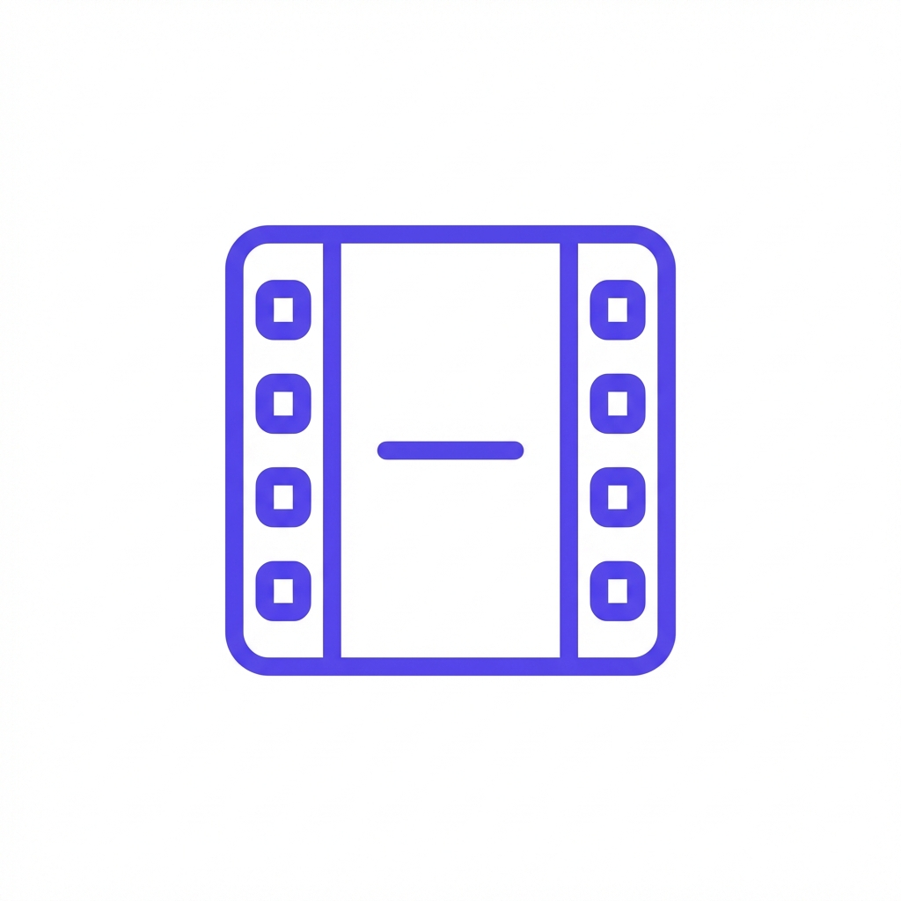
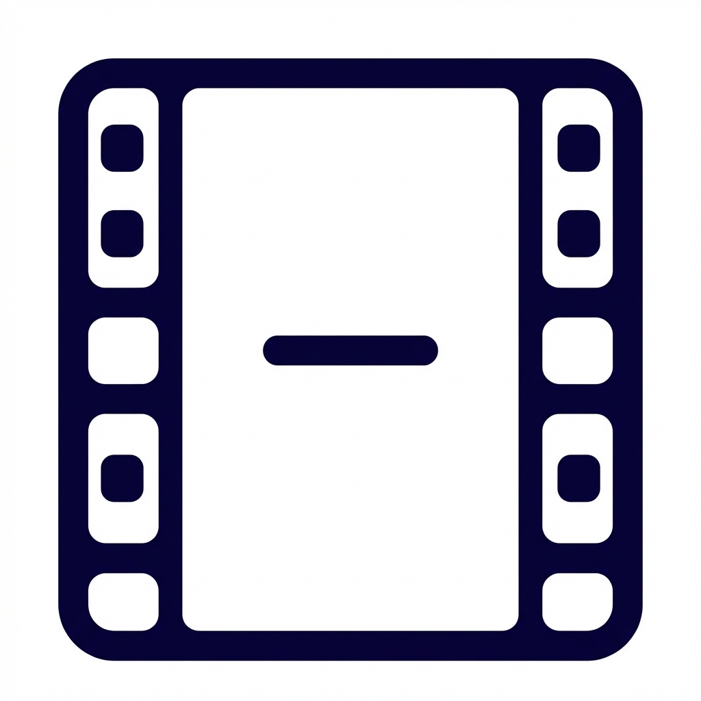
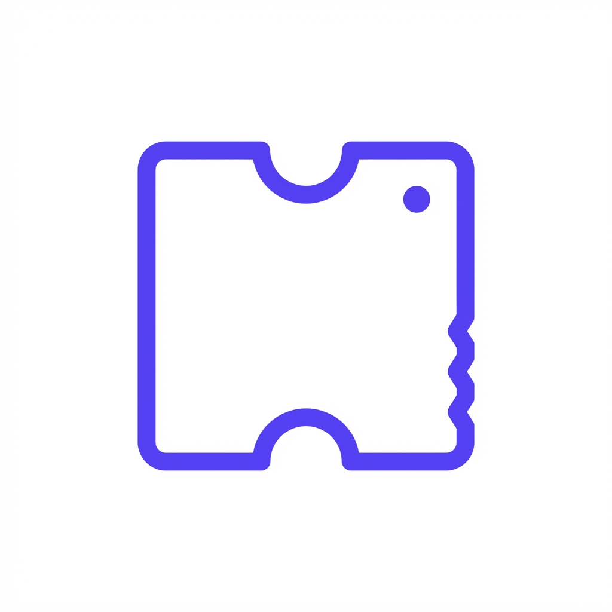
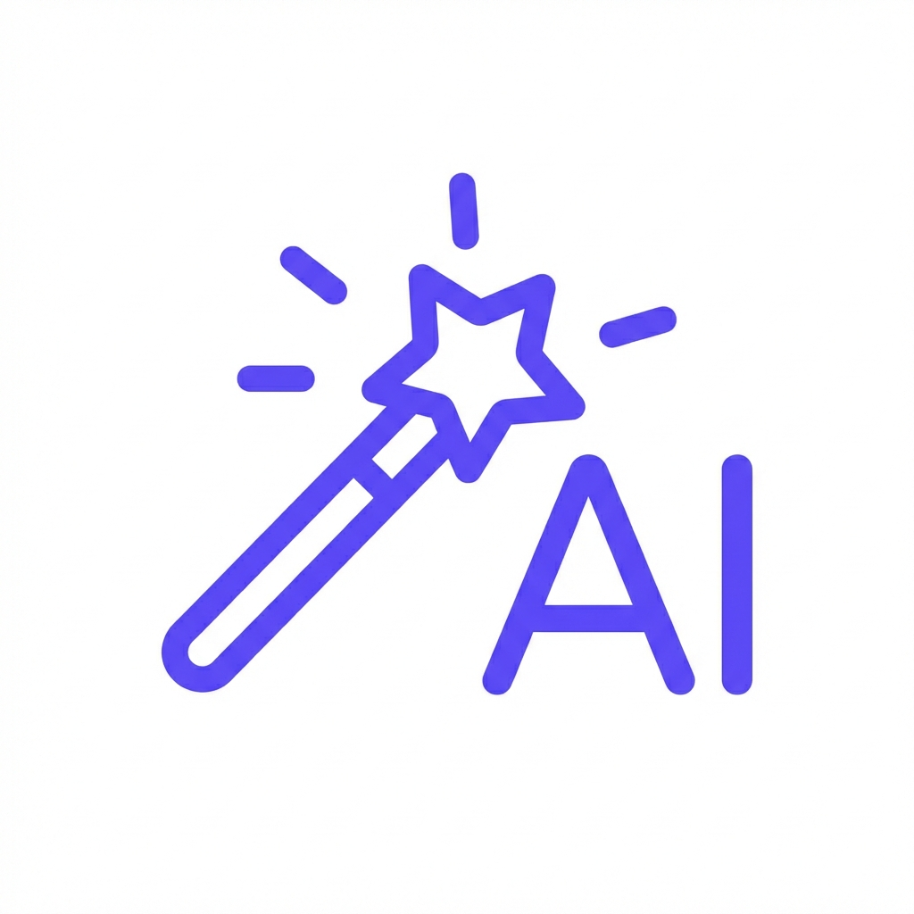
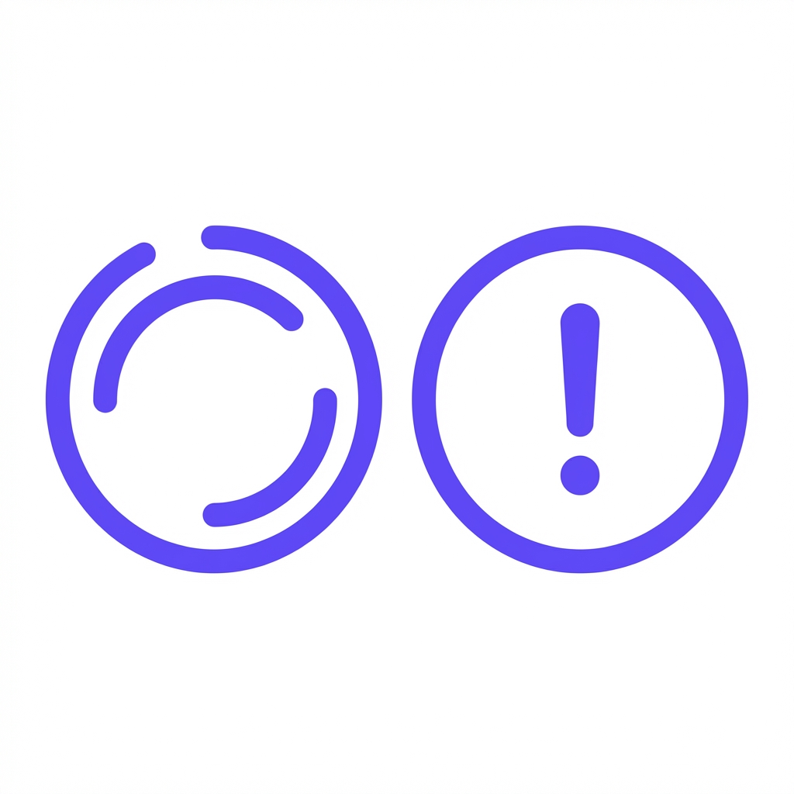
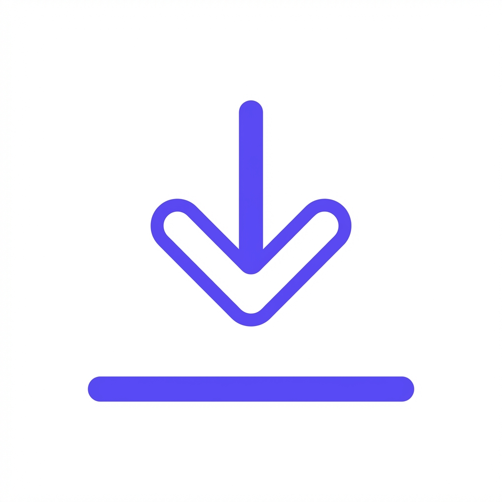

# 微信小程序 UI 设计说明（MVP，参考模板工程）

本 UI 设计以 `/Users/songxijun/workspace/miniprogram/miniprogram` 为视觉与组件参考（TabBar + 自定义导航 + 通用组件风格），在此基础上做“电影聊天 + 推荐卡片 + 详情页”的最小实现。

相关文档：
- 产品文档：`docs/miniprogram/1.0/product-design.md`
- 前端实现：`docs/miniprogram/1.0/frontend-implementation.md`

---

## 1. 全局风格与设计 Token（对齐模板）

建议复用模板的基础 Token（来自 `assets/styels/common-var.less`）：
- 主色：`#5D45FA`（`@btn-color`）
- 主文字：`rgba(0, 0, 0, 0.87)`（`@common-color-txt1`）
- 圆角：`12rpx`（`@base-border-radius`，组件内部可用 24rpx/26rpx）
- 页面左右边距：`32rpx`（`@base-padding-width`）

推荐的 UI 语义色（与模板组件保持一致）：
- `primary`: `#5D45FA`
- `text_primary`: `#1D2433`（见 `zh-card.less`）
- `text_secondary`: `#646F88`（见 `zh-card.less`）
- `danger`: `#D92D20`（见消息状态 error 色）
- `bg_page`: `#F7F8FA`（建议；若走深色主题可参考 agent-chat 的遮罩做法）

字体建议（与模板一致的 rpx 体系）：
- 标题：32rpx~34rpx（`zh-nav-bar` 标题 34rpx；`zh-card` title 32rpx）
- 正文：28rpx~32rpx（`zh-card` content 28rpx；消息正文 32rpx）
- 辅助：22rpx~24rpx

---

## 2. 导航与 TabBar（MVP）

参考模板：
- 全局 `navigationStyle: "custom"`（见模板 `app.json`）
- TabBar：背景白、选中紫（`selectedColor: #5D45FA`）、未选中文字深色（`#0A023E`）

MVP 建议：
- TabBar 两项：
  - `Chat`（默认首页）
  - `我的`（极简：环境/baseURL、清空会话）
- 详情页不在 TabBar 内：`wx.navigateTo` 进入

TabBar 图标规范（对齐模板尺寸与观感）：
- 尺寸：`61x60 px`（模板 tab 图标尺寸）
- 风格：圆角线性图标（rounded cap/rounded join），推荐 2px~2.5px 线宽
- 颜色：
  - 未选中：接近 `#0A023E`
  - 选中：`#5D45FA`
- 输出：需要各 2 张（active/inactive），PNG 透明底
- 图形内容：需要重新设计，不照搬模板图标（具体“画什么”见 3.8）

自定义导航栏：
- 统一使用模板组件 `components/zh-nav-bar/zh-nav-bar`
- Chat 页标题：`电影助手` / `Movie Agent`
- 详情页标题：电影名（超长省略）
- Back 行为：`wx.navigateBack`；若无返回栈则回 Chat

---

## 3. Chat 页 UI（核心）

参考模板的聊天页结构（`pages/ai-agent/agent-chat/agent-chat.wxml`）：
- 顶部：`zh-nav-bar`
- 中间：`zh-layout` 承载可滚动的消息列表
- 底部：`input-bar` 固定在底部，处理键盘高度变化
- 可选：`scroll-to-bottom` 悬浮按钮

MVP Chat 页面结构建议：

1) 背景与容器
- 浅色模式推荐：纯色背景 `bg_page`；消息区域留出 bottom input-bar 高度
- 深色模式（可选）：参考 agent-chat 的 background image + top/bottom mask（不建议 MVP 一开始做）

2) 布局与间距（建议值）
- 页面左右边距：`32rpx`（对齐 `@base-padding-width`）
- 消息列表 padding bottom：至少 `inputBarHeight + 32rpx`，避免最后一条被输入框遮挡
- 消息间距：`16rpx`（对齐模板的 `gap: 16rpx`）
- 单条消息气泡最大宽：约 `560rpx`（对齐模板 `agent-message-block__bubble-wrapper max-width: 560rpx`）

3) 消息气泡（复用模板样式）
- 直接复用 `pages/ai-agent/components/agent-message-block`
  - light theme 下：
    - incoming（assistant）：白底、深色字
    - outgoing（user）：紫底、白字（见 `agent-message-block.less`）
- 消息布局：
  - assistant：显示 avatar（可以用固定 logo 或电影 icon）
  - user：可不显示 avatar（或显示用户头像，MVP 可省略）

4) “生成中”状态
- 复用 `pages/ai-agent/components/agent-message-process` 的三点 loading（紫色点）
- 在 assistant placeholder 中显示（类似 agent-chat 的 PREPARING 状态）

5) 推荐卡片区（Message attachment）

推荐卡片区挂载位置：
- 放在“本轮 assistant 消息”的 bubble 下方（同一 anchor 里），避免与消息流割裂

卡片布局建议（MVP）：
- 横向滚动 `scroll-view scroll-x`
- 卡片尺寸：宽 220rpx~260rpx，高度自适应（海报 3:4）
- 卡片内容：
  - 海报（poster）
  - 片名（1 行省略）
  - 年份 + 评分（小字一行）
- 卡片圆角：`24rpx`（与 `zh-card` 观感一致）
- loading skeleton：
  - 先渲染 3~5 个灰块占位；拉到 `movies/bulk` 结果后替换

点击行为：
- 点击卡片：进入详情页 `pages/movie-detail/movie-detail?tmdb_id=...`

6) 输入框与发送
- 直接复用模板组件 `components/input-bar/input-bar`
- placeholder（MVP）：
  - idle：`想看什么？例如：推荐近期热门 / 2024 中文高分 / 类似《喜宴》`
  - generating：`回复中，请稍候...`

7) 回到底部按钮（可选）
- 复用模板思路：当用户上滑离开底部时出现悬浮按钮
- 建议尺寸：`56rpx * 56rpx`（与模板一致）
- 位置：`bottom = inputBarHeight + 24px`（模板做法）

8) 需要新生成的图标清单（MVP）

说明：图标的“大小/风格”对齐模板工程，但“图形内容”不要照搬模板图标；这里给出文字设计稿说明，供设计或用 AI 生成后再精修。

统一规范（建议）：
- 画板：以 `61x60 px`（TabBar）为基准；其它尺寸按下方要求单独出图
- 线性风格：圆角端点/圆角连接（rounded cap/join），避免尖角
- 线宽：2px~2.5px（TabBar/大按钮）；小图标可用 2px（保持清晰）
- 安全边距：主体图形离画板边缘至少 6~8px
- 单色优先：尽量只用 1 种颜色（active 用 `#5D45FA`，inactive 用 `#0A023E` 或近似深色）
- 背景：透明（PNG）

必需（P0）：
- TabBar - Chat（未选 / 选中 两张）
  - 尺寸参考：`61x60 px`（模板 tab 图标尺寸）
  - 风格：线性图标 + 轻微圆角；2px~2.5px 线宽；圆角端点/圆角连接
  - 对齐：图形主体居中，四周预留 6~8px 安全边距，避免贴边
  - 配色：未选用深色（接近 `#0A023E`），选中用主色 `#5D45FA`

#### 设计示意图：TabBar 图标 (Active / Inactive)
- **Chat**:  / 
- **Mine**:  / 

- 图形内容（不要用通用对话气泡直出）：
    - 方案 A：一个“竖向胶片框”（两侧打孔的抽象矩形）+ 中间一条短横线（表示“对话/推荐”）
    - 方案 B：一个“场记板”轮廓 + 右下角一颗小星（表示“AI 推荐”）
  - 文件命名（建议）：`tab-chat.png` / `tab-chat-active.png`
- TabBar - 我的（未选 / 选中 两张）
  - 尺寸参考：`61x60 px`
  - 风格/对齐/配色：同上
  - 图形内容（不要用模板的“人形轮廓”直出）：
    - 方案 A：一个“票根”轮廓（上方锯齿/缺口用极简抽象）+ 右上角一个小点（表示“设置”）
    - 方案 B：一个“书签”轮廓 + 一条短横（表示“偏好/配置”）
  - 文件命名（建议）：`tab-mine.png` / `tab-mine-active.png`
- Assistant 头像（默认）
  - 尺寸参考：`80x80 px`（模板头像容器 80rpx）
  - 风格：圆形底 + 简洁符号
  - **参考图标**：
  - 图形内容（避免通用机器人头像）：
    - 圆形底：深色或浅紫渐变都可，但 MVP 推荐纯色（便于适配深浅模式）
    - 中心符号：电影放映机/场记板/胶片其中一个（线性或轻填充），可加 1 颗小星点缀
  - 文件命名（建议）：`avatar-assistant.png`

建议做（P0/P1，根据实现选择）：
- AI 回复徽标（贴在头像右上角的小角标）
  - 尺寸参考：`34x22 px`（模板 badge）
  - 风格：尽量单色/双色，小尺寸可读性优先
  - **参考图标**：
  - 图形内容：建议用“闪电/星光/魔法棒”抽象符号，不用 “AI” 字样也可以
  - 文件命名（建议）：`badge-ai.png`
- 消息状态图标（发送中 / 失败）
  - 尺寸参考：`48x48 px`（模板 status icon）
  - 风格：线性或轻填充；避免细节过多
  - **参考图标**：
  - 发送中：圆环加载（可自绘），颜色浅灰或主色半透明
  - 失败：感叹号/叉号（不使用模板原图）
  - 文件命名（建议）：`msg-sending.png` / `msg-failed.png`
- 回到底部按钮图标
  - 尺寸参考：`56x56 px`
  - 风格：线性图标，配合圆形按钮容器（容器可用白底+阴影）
  - **参考图标**：
  - 图形内容：向下箭头 + 一条横线（表示“回到最新”），不要使用模板图片
  - 文件命名（建议）：`scroll-to-bottom.png`

可选（若不复用模板组件内置资源时再做）：
- NavBar 返回箭头（亮色/暗色两张）
  - 尺寸参考：宽 `20px` 高 `36px`（见模板 `zh-nav-bar.less`）
  - 图形内容：圆角箭头（不要与模板箭头同形）
  - 文件命名（建议）：`nav-back-light.png` / `nav-back-dark.png`

输出规范（建议）：
- 格式：PNG（透明背景）
- 命名：推荐使用连字符并与 TabBar 语义对齐（例如 `tab-chat.png/tab-chat-active.png`）
- 颜色：优先使用单色，避免复杂渐变（与模板一致）
- 存放路径建议：`miniprogram/assets/imgs/`（本仓库已拍平，便于配置 `app.json` tabBar）

可选（只有在你们启用输入栏的更多能力时才需要）：
- 输入栏「发送」按钮图标（若不复用模板内置样式）
  - 尺寸参考：`56x56 px` 或 `48x48 px`
  - 图形内容：纸飞机/上箭头（不要与模板一致）；建议“上箭头 + 圆角方形底”的组合
  - 文件命名（建议）：`icon-send.png`
- 输入栏「附件/加号」图标（若启用添加文件/图片）
  - 尺寸参考：`56x56 px`
  - 图形内容：圆角加号（线性）
  - 文件命名（建议）：`icon-plus.png`
- 输入栏「语音」图标（若启用语音输入）
  - 尺寸参考：`56x56 px`
  - 图形内容：麦克风（线性）
  - 文件命名（建议）：`icon-voice.png`

---

## 4. 电影详情页 UI（MVP）

页面目标：快速“看懂一部电影”并能继续回到 Chat 追问。

参考模板的页面结构（对齐 `zh-nav-bar` + `zh-layout` 组织方式）：
1) 顶部：自定义导航 `zh-nav-bar`
2) 中间：`zh-layout` 的 scroll-view 作为详情滚动容器
3) 底部：可选固定 CTA（MVP 可不固定，先放在 scroll 末尾）

### 4.1 顶部 Hero 区（backdrop + poster + 标题）

布局（文字示意）：
- 背景层：`backdrop` 作为顶图
  - 建议高度：`420rpx ~ 520rpx`
  - 处理：加一层渐变遮罩（上深下浅或下深上浅都可），保证标题可读
  - 无 backdrop 的 fallback：用纯色渐变底（`bg_page` → 白）或用 poster 放大模糊做底图
- 前景层（覆盖在背景上）：
  - 左侧：poster（w500）
    - 建议尺寸：`240rpx x 320rpx`（3:4）
    - 圆角：`24rpx`
    - 阴影：轻阴影（不必强，避免脏）
  - 右侧：标题信息
    - 标题（最多 2 行）：32rpx~36rpx，粗体
    - 副标题（1 行）：原名 / 年份 / 地区 / 片长（用 24rpx~26rpx，次级色）
    - 评分行（1 行）：星形 icon + `vote_average` + `vote_count`（可选）
    - 信息标签（可选）：用 2~3 个小 tag（如“剧情 / 喜剧 / 爱情”）增强可读性；MVP 可不做

布局层级建议（便于实现者按模板思路搭页面）：
1) `zh-nav-bar` 固定在顶部（`disablePlaceholderHeight=false`），标题随滚动切换颜色/背景
2) `zh-layout` 的 `scroll-view` 作为滚动容器
3) `hero` 作为滚动容器的第一段内容：
  - `hero-bg`：backdrop image（绝对铺满）
  - `hero-mask`：渐变遮罩（绝对铺满）
  - `hero-foreground`：poster + title 区（相对定位、flex row）
4) `content`：紧接 hero 的卡片区，建议 `margin-top: -40rpx ~ -60rpx` 轻微上提，让卡片“压住”顶图（更像模板质感）

滚动联动（推荐，体验更像模板）：
- 初始：nav-bar 透明（标题白字）
- 向上滚动超过 hero：nav-bar 变为浅底（标题深色），类似 `zh-nav-bar` 的 `hasBg` 切换

### 4.2 信息区（卡片化块，直接复用 zh-card）

整体容器：
- 左右边距：`32rpx`
- 卡片间距：`16rpx ~ 24rpx`
- 卡片圆角/内边距：复用 `zh-card` 默认（`padding 24rpx 32rpx`, `radius 24rpx`）

建议分 3 块卡片（MVP）：

1) 卡片 A：概览（Overview）
- 标题：`剧情简介`
- 内容：`overview`
  - 默认展示最多 6 行（`.ellipsis-multi(6)`），末尾“展开/收起”（P1 再做也可）

2) 卡片 B：关键信息（Meta）
- 标题：`基本信息`
- 内容排版：两列信息行（左 label，右 value）
  - 上映日期：release_date（格式化成 yyyy-mm-dd 或 yyyy）
  - 片长：runtime（分钟）
  - 类型：genres（逗号分隔；超长换行）
  - 语言：original_language（可转中文名，P1）
  - 评分：vote_average + vote_count

信息行 UI 规格（建议，保证观感统一）：
- 行高：最小 `72rpx`（两行时自适应）
- label（左侧）：
  - 字号：24rpx~26rpx
  - 颜色：`#646F88`（对齐 `zh-card__desc`）
- value（右侧）：
  - 字号：28rpx
  - 颜色：`#1D2433`（对齐 `zh-card__content`）
  - 对齐：右对齐；超长可换行（类型/语言更容易换行）
- 分隔线：
  - 使用模板的 0.5px 线（`half-1px-line-bottom`），颜色 `rgba(0,0,0,0.06~0.1)`

3) 卡片 C：演职员（Credits）
- 标题：`演职员`
- 内容（MVP 只取关键岗位 + 前 N 主演）：
  - 导演：crew 里 job=Director（最多 1~2 个）
  - 主演：cast 前 3~5 个（名字 + 角色名可选）
- 排版建议（两种选一）：
  - 简单文字列表（最快）：`导演：...` / `主演：...`
  - 小头像横滑（更像产品）：每个人一个圆形头像 + 名字（P1 再做）

### 4.3 CTA（可选，建议做成“轻按钮”）

位置建议：
- 放在 scroll 末尾一块独立区域（MVP 最省事），或固定在底部（P1）

按钮文案：
- `继续问这部电影`

点击行为：
- 回到 Chat（navigateBack 或 switchTab 到 Chat）
- 自动填充输入框：`《{title}》的导演是谁？` 或 `推荐几部类似《{title}》的电影`

### 4.4 Skeleton（加载态）

进入详情页后先渲染 skeleton，接口返回后替换：
- hero skeleton：backdrop 灰块 + poster 灰块 + 标题两行灰块
- 卡片 skeleton：2~3 块 `zh-card`，每块 3~5 行灰条

失败态（网络/无数据）：
- 使用 `zh-layout` 的 network-error/business-error 形态（参考模板 `zh-layout.wxml`）

---

## 5. “我的”页 UI（极简）

目的：为开发/联调提供最小控制面板（不做用户体系）。

页面结构（参考模板的“卡片化设置页”思路）：
- 顶部：`zh-nav-bar`（标题：`我的`）
- 内容：`zh-layout` + scroll 容器
- 主体：多个 `zh-card` 堆叠（左右边距 32rpx，卡片间距 16rpx~24rpx）

行式布局通用规格（建议在“我的”页统一使用）：
- 每一行：左 label + 右 value +（可选）右箭头
- 行高：`88rpx`（对齐模板按钮高度/舒适点击区）
- label：
  - 字号：28rpx
  - 颜色：`#1D2433`
- value：
  - 字号：24rpx~26rpx
  - 颜色：`#646F88`
  - 超长省略：1 行 ellipsis；点击可复制/展开
- 分隔线：0.5px line（同详情页 meta 行）

### 5.1 卡片 1：环境与接口（开发/联调必需）

标题：`环境与接口`

内容（建议行式布局，左 label 右 value）：
- 当前环境：dev/test/prod（可点开选择）
- baseURL：显示完整 URL（超长省略，点击可复制）
- API 前缀：固定展示 `/api/v1/mp/*`

交互：
- 点击“当前环境” → 打开底部弹窗（`zh-popup` 或原生 action-sheet），选择 dev/test/prod
- 选择后：写入本地 storage，并刷新 http client 的 baseURL（对齐模板 `service-env` 思路）
 - 行右侧建议带“右箭头”提示可点击（可用 `zh-icon` 的箭头类图标；若图标不全，先用 `>` 文字符号占位）

### 5.2 卡片 2：会话与缓存（MVP 必需）

标题：`会话与缓存`

内容：
- 当前 session_id：展示短号（前 8 位），点击可复制完整
- 清空当前会话：
  - 说明文案：`仅清理本地消息与 session，不删除服务端数据`
  - 按钮：使用 `zh-common-btn` 的 plain 或 danger 风格（如果没有就用普通按钮 + 红字）

清空交互建议：
1) 点击“清空当前会话”
2) 弹出确认 modal：
  - 标题：`确认清空？`
  - 描述：`将清空本地聊天记录，并生成新的会话。`
3) 确认后：
  - 清空本地消息列表
  - 重置 session_id
  - 回到 Chat 页顶部空状态（可选展示快捷问题）

### 5.3 卡片 3：关于（可选）

标题：`关于`

内容：
- 小程序版本：`x.y.z`
- 后端版本：如果后端暴露版本接口则展示；否则先不展示
- 数据来源声明：`数据来自 TMDB（The Movie Database）`（合规文案可后置）

---

## 6. 组件复用清单（来自模板，建议优先用）

- 导航：`components/zh-nav-bar/zh-nav-bar`
- 页面布局/滚动：`components/zh-layout/zh-layout`
- 输入框：`components/input-bar/input-bar`（含键盘高度处理事件）
- 卡片：`components/zh-card/zh-card`
- 空状态：`components/zh-empty/zh-empty`
- Loading：`components/zh-loading/zh-loading`

聊天相关可直接借用：
- `pages/ai-agent/components/agent-message-block`（消息气泡）
- `pages/ai-agent/components/agent-message-process`（三点 typing）

---

## 7. 可落地的 MVP 规格（实现者清单）

本节把“应该画什么/怎么拼 UI/如何处理状态”收敛成可直接实现的规格，避免口径不一致。

### 7.1 资源清单（Asset Manifest）

存放路径统一为：`miniprogram/assets/imgs/`

TabBar（必须）：
- `tab-chat.png`：Chat 未选中图标，`61x60 px`，单色深色
- `tab-chat-active.png`：Chat 选中图标，`61x60 px`，单色 `#5D45FA`
- `tab-mine.png`：我的 未选中图标，`61x60 px`，单色深色
- `tab-mine-active.png`：我的 选中图标，`61x60 px`，单色 `#5D45FA`

聊天（建议）：
- `avatar-assistant.png`：assistant 默认头像（圆形），`80x80 px`
- `badge-ai.png`：AI 角标（贴头像右上角），`34x22 px`
- `scroll-to-bottom.png`：回到底部按钮图标，`56x56 px`
- `msg-sending.png`：消息发送中图标，`48x48 px`
- `msg-failed.png`：消息发送失败图标，`48x48 px`

导航（可选，如果不用模板内置远程资源）：
- `nav-back-light.png` / `nav-back-dark.png`：返回箭头，`20x36 px`

输入栏扩展（可选）：
- `icon-send.png`：发送按钮图标，`56x56 px`（或 48x48）
- `icon-plus.png`：附件/加号图标，`56x56 px`
- `icon-voice.png`：语音图标，`56x56 px`

TabBar 配置示例（路径对齐模板 `app.json` 结构，仅示意）：
```json
{
  "tabBar": {
    "backgroundColor": "#ffffff",
    "color": "#0A023E",
    "selectedColor": "#5D45FA",
    "list": [
      {
        "iconPath": "./assets/imgs/tab-chat.png",
        "selectedIconPath": "./assets/imgs/tab-chat-active.png",
        "pagePath": "pages/chat/chat",
        "text": "聊天"
      },
      {
        "iconPath": "./assets/imgs/tab-mine.png",
        "selectedIconPath": "./assets/imgs/tab-mine-active.png",
        "pagePath": "pages/me/me",
        "text": "我的"
      }
    ]
  }
}
```

### 7.2 Chat 页面规格（可直接照着实现）

结构（对齐模板）：
- 顶部：`zh-nav-bar`（custom nav）
- 中间：`zh-layout` + `scroll-view`
- 底部：`input-bar` 固定

消息列表：
- 消息 item 复用 `agent-message-block`（light theme）
- 每条消息的间距：`16rpx`
- 列表左右 padding：`16rpx ~ 32rpx`（若复用 `agent-message-block` 自带 margin，可保持一致）

流式展示：
- 收到 `generate_start`：插入 assistant placeholder 消息（空文本 + typing）
- 收到 `chunk`：持续 append 文本并 setData，频率由 Stream client 节流（模板已实现字符节流）
- 收到 `complete`：隐藏 typing，最终文本固定
- 收到 `error`：将当前 assistant 消息标为失败，并展示“点击重试”（MVP 可以只 toast + 保留已生成文本）

推荐卡片区（挂在 assistant 消息下方）：
- 触发：收到 `recommendations` 帧
- 布局：
  - 标题行：`为你推荐`（28rpx，次级色）
  - 横滑列表：`scroll-view scroll-x`
  - 卡片：
    - 宽：`240rpx`（固定，避免抖动）
    - 海报：`240rpx x 320rpx`，圆角 `24rpx`
    - 标题：26rpx，1 行省略
    - 副行：24rpx（年份 + 评分），1 行省略
    - 外间距：右侧 `16rpx`（最后一张可补 padding）
- Skeleton：
  - 在 bulk 返回前，先渲染 3 个卡片灰块（同尺寸）
- 点击：
  - `wx.navigateTo` 进入详情页并带 `tmdb_id`

回到底部按钮（可选，但推荐做）：
- 出现条件：用户上滑离开底部（模板 layout controller 的做法）
- 按钮尺寸：`56rpx` 圆形
- 位置：`bottom = inputBarHeight + 24px`（模板做法）

### 7.3 详情页规格（可直接照着实现）

顶部：
- `zh-nav-bar`：
  - 默认透明 + 白字
  - 滚动超过 hero 后变浅底 + 深字（切换 hasBg）

Hero：
- 高度：`480rpx`（固定值即可）
- backdrop：
  - 有：铺满 hero
  - 无：纯色渐变底（浅灰到白）
- poster：
  - `240rpx x 320rpx`，圆角 `24rpx`，左边距 `32rpx`
- 标题区：
  - 标题：2 行省略，34rpx，粗体
  - 副标题：1 行省略，24rpx，次级色（原名/年份/片长）
  - 评分：可选一行（24rpx）

内容卡片区：
- 位置：紧接 hero，`margin-top: -48rpx`（压住顶图）
- 卡片间距：`16rpx`
- 卡片 A（剧情简介）：默认 6 行省略（P1 再做展开）
- 卡片 B（基本信息）：行式布局（行高 `72rpx`，0.5px 分隔线）
- 卡片 C（演职员）：导演（1~2）+ 主演（3~5）；先做纯文本列表，P1 再做头像横滑

底部 CTA（可选）：
- 放在 scroll 末尾：一个 `zh-common-btn plain` 按钮
- 点击后回 Chat，并填入一句追问（例如导演/类似推荐）

加载/失败：
- Loading：hero skeleton + 3 张 card skeleton
- Network error：用 `zh-layout` 的 network-error

### 7.4 “我的”页规格（可直接照着实现）

页面结构：
- 顶部：`zh-nav-bar`（标题：我的）
- 内容：`zh-layout` scroll
- 主体：3 张 `zh-card`（左右边距 `32rpx`，卡片间距 `16rpx`）

卡片 1（环境与接口）：
- 行：当前环境（可点）、baseURL（可复制）、API 前缀（固定）
- 右侧：显示 `>` 或箭头 icon
- 切换环境：底部 action-sheet（dev/test/prod）

卡片 2（会话与缓存）：
- 行：session_id（短号展示，点击复制）
- 按钮：清空当前会话（弹确认 modal）

卡片 3（关于）：
- 行：小程序版本、后端版本（可选）、TMDB attribution 文案

### 7.5 合规与归因（MVP 必需文案）

建议至少在“我的 → 关于”里展示：
- `This product uses the TMDB API but is not endorsed or certified by TMDB.`
- `数据来源：TMDB（The Movie Database）`
